# `.\MetaGPT\metagpt\ext\stanford_town\memory\scratch.py` 详细设计文档

该代码定义了一个名为Scratch的Pydantic模型类，用于表示和管理一个虚拟角色（Persona）的完整状态信息。它包含了角色的核心身份（如姓名、年龄、性格）、世界信息（如当前时间、位置）、行为参数（如注意力带宽、记忆保留）、反思机制变量、个人日程计划以及当前正在执行的动作等。该类提供了从文件初始化、保存状态到文件、获取角色摘要信息、管理日程索引和动作状态检查等一系列方法，是支撑角色模拟系统中角色状态持久化和行为逻辑的核心数据模型。

## 整体流程

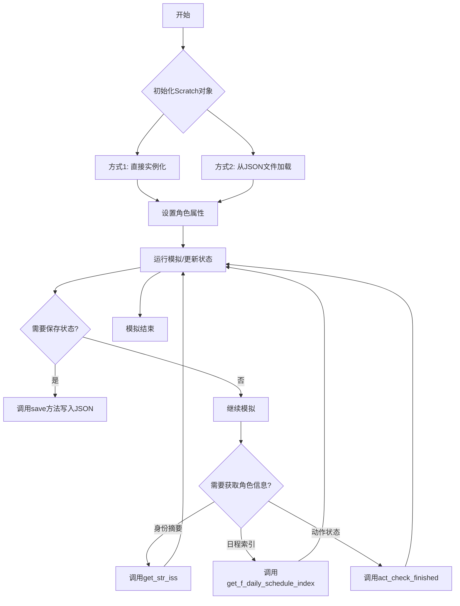

## 类结构

```
Scratch (Pydantic BaseModel)
├── 字段 (按类别分组)
│   ├── 类别1: 人物超参 (vision_r, att_bandwidth, retention)
│   ├── 类别2: 世界信息 (curr_time, curr_tile, daily_plan_req)
│   ├── 类别3: 核心身份 (name, age, innate, learned, currently...)
│   ├── 类别4: 旧反思变量 (concept_forget, daily_reflection_time...)
│   ├── 类别5: 新反思变量 (recency_w, relevance_w, importance_w...)
│   ├── 类别6: 个人计划 (daily_req, f_daily_schedule...)
│   └── 类别7: 当前动作 (act_address, act_start_time, chatting_with...)
└── 方法
    ├── 类方法 (init_scratch_from_path, check_time_filed)
    ├── 实例方法 (save, get_str_iss, add_new_action, act_check_finished...)
    └── 序列化方法 (transform_time_field)
```

## 全局变量及字段


### `Scratch.vision_r`
    
角色的视觉范围半径，用于感知环境。

类型：`int`
    


### `Scratch.att_bandwidth`
    
角色的注意力带宽，限制同时处理的信息量。

类型：`int`
    


### `Scratch.retention`
    
角色的记忆保留能力，影响信息的持久性。

类型：`int`
    


### `Scratch.curr_time`
    
当前模拟世界的时间。

类型：`Optional[datetime]`
    


### `Scratch.curr_tile`
    
角色当前所在的坐标位置。

类型：`Optional[list[int]]`
    


### `Scratch.daily_plan_req`
    
角色的每日计划要求或目标。

类型：`Optional[str]`
    


### `Scratch.name`
    
角色的全名。

类型：`Optional[str]`
    


### `Scratch.first_name`
    
角色的名字。

类型：`Optional[str]`
    


### `Scratch.last_name`
    
角色的姓氏。

类型：`Optional[str]`
    


### `Scratch.age`
    
角色的年龄。

类型：`Optional[int]`
    


### `Scratch.innate`
    
角色的先天核心特质（L0级）。

类型：`Optional[str]`
    


### `Scratch.learned`
    
角色后天习得的稳定特质（L1级）。

类型：`Optional[str]`
    


### `Scratch.currently`
    
角色当前的外部表现或状态（L2级）。

类型：`Optional[str]`
    


### `Scratch.lifestyle`
    
角色的生活方式描述。

类型：`Optional[str]`
    


### `Scratch.living_area`
    
角色的居住区域。

类型：`Optional[str]`
    


### `Scratch.concept_forget`
    
概念遗忘阈值，用于控制记忆的遗忘。

类型：`int`
    


### `Scratch.daily_reflection_time`
    
每日反思的时间长度（以分钟计）。

类型：`int`
    


### `Scratch.daily_reflection_size`
    
每日反思的事件数量上限。

类型：`int`
    


### `Scratch.overlap_reflect_th`
    
重叠反思的阈值，用于触发反思。

类型：`int`
    


### `Scratch.kw_strg_event_reflect_th`
    
关键词触发事件反思的阈值。

类型：`int`
    


### `Scratch.kw_strg_thought_reflect_th`
    
关键词触发思想反思的阈值。

类型：`int`
    


### `Scratch.recency_w`
    
反思中近期性因素的权重。

类型：`int`
    


### `Scratch.relevance_w`
    
反思中相关性因素的权重。

类型：`int`
    


### `Scratch.importance_w`
    
反思中重要性因素的权重。

类型：`int`
    


### `Scratch.recency_decay`
    
近期性因素的衰减率。

类型：`float`
    


### `Scratch.importance_trigger_max`
    
重要性触发反思的最大阈值。

类型：`int`
    


### `Scratch.importance_trigger_curr`
    
重要性触发反思的当前阈值。

类型：`int`
    


### `Scratch.importance_ele_n`
    
重要性元素的数量。

类型：`int`
    


### `Scratch.thought_count`
    
思想的数量。

类型：`int`
    


### `Scratch.daily_req`
    
角色的每日需求列表。

类型：`list[str]`
    


### `Scratch.f_daily_schedule`
    
角色的详细每日计划，包含任务和持续时间。

类型：`list[list[Union[int, str]]]`
    


### `Scratch.f_daily_schedule_hourly_org`
    
角色按小时组织的每日计划。

类型：`list[list[Union[int, str]]]`
    


### `Scratch.act_address`
    
当前动作发生的地点。

类型：`Optional[str]`
    


### `Scratch.act_start_time`
    
当前动作的开始时间。

类型：`Optional[datetime]`
    


### `Scratch.act_duration`
    
当前动作的持续时间（分钟）。

类型：`Optional[int]`
    


### `Scratch.act_description`
    
当前动作的描述。

类型：`Optional[str]`
    


### `Scratch.act_pronunciatio`
    
当前动作的发音或口头表达。

类型：`Optional[str]`
    


### `Scratch.act_event`
    
当前动作关联的事件信息列表。

类型：`list[Optional[str]]`
    


### `Scratch.act_obj_description`
    
当前动作对象的描述。

类型：`Optional[str]`
    


### `Scratch.act_obj_pronunciatio`
    
当前动作对象的发音或口头表达。

类型：`Optional[str]`
    


### `Scratch.act_obj_event`
    
当前动作对象关联的事件信息列表。

类型：`list[Optional[str]]`
    


### `Scratch.chatting_with`
    
角色正在聊天的对象。

类型：`Optional[str]`
    


### `Scratch.chat`
    
当前的聊天内容。

类型：`Optional[str]`
    


### `Scratch.chatting_with_buffer`
    
聊天对象的缓冲区，存储临时信息。

类型：`dict`
    


### `Scratch.chatting_end_time`
    
聊天结束的时间。

类型：`Optional[datetime]`
    


### `Scratch.act_path_set`
    
标识动作路径是否已设置。

类型：`bool`
    


### `Scratch.planned_path`
    
角色计划移动的路径坐标列表。

类型：`list[list[int]]`
    
    

## 全局函数及方法

### `Scratch.check_time_filed`

`check_time_filed` 是 `Scratch` 类的一个类方法，用作 Pydantic 模型的字段验证器。它的核心功能是接收一个表示时间的字符串，并将其解析为 `datetime` 对象。如果输入为空，则返回 `None`。此方法主要用于在模型实例化或数据更新时，自动将特定字段（如 `curr_time`, `act_start_time`, `chatting_end_time`）从字符串格式转换为 Python 的 `datetime` 对象，确保数据的一致性和类型安全。

参数：
- `cls`：`type[Scratch]`，指向 `Scratch` 类本身的引用。
- `time_filed`：`str | None`，待验证和转换的时间字符串。如果为 `None` 或空值，则直接返回 `None`。

返回值：`datetime | None`，返回解析后的 `datetime` 对象。如果输入为空，则返回 `None`。

#### 流程图

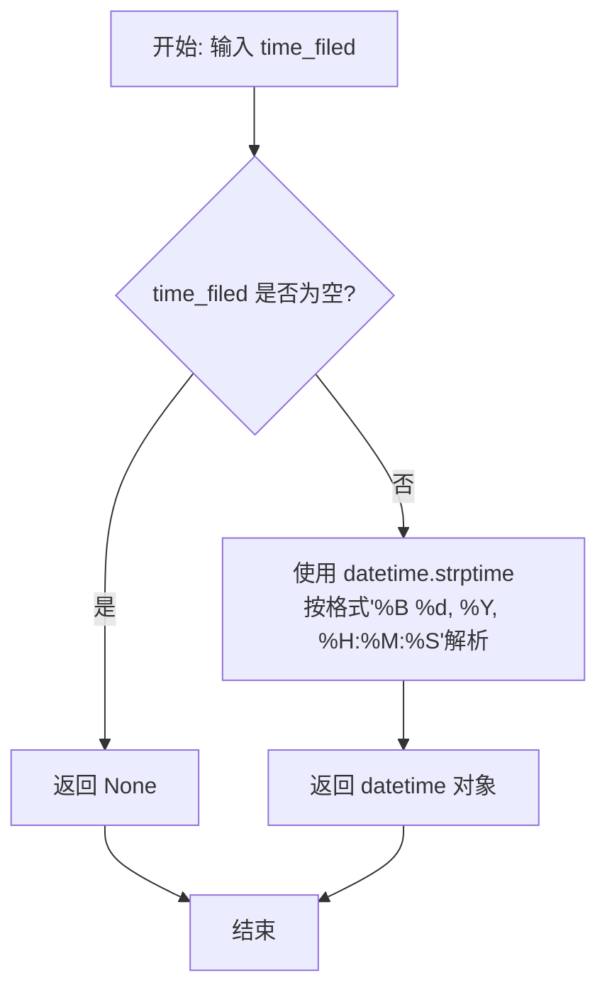

#### 带注释源码

```python
    @field_validator("curr_time", "act_start_time", "chatting_end_time", mode="before")
    @classmethod
    def check_time_filed(cls, time_filed):
        # 如果 time_filed 参数有值（非空），则尝试将其从字符串解析为 datetime 对象。
        # 解析的格式为 "%B %d, %Y, %H:%M:%S"，例如 "October 26, 2023, 14:30:00"。
        val = datetime.strptime(time_filed, "%B %d, %Y, %H:%M:%S") if time_filed else None
        # 返回解析后的 datetime 对象或 None。
        return val
```

### `Scratch.transform_time_field`

该方法是一个字段序列化器，用于将 `Scratch` 类中的 `datetime` 类型时间字段（如 `curr_time`, `act_start_time`, `chatting_end_time`）转换为特定格式的字符串，以便于JSON序列化和存储。

参数：

- `self`：`Scratch`，`Scratch` 类的实例。
- `time_filed`：`Optional[datetime]`，需要被序列化的时间字段，可能为 `None`。

返回值：`str`，如果输入的时间字段不为 `None`，则返回格式化为 `"%B %d, %Y, %H:%M:%S"`（例如："October 26, 2023, 14:30:00"）的字符串；如果输入为 `None`，则直接返回 `None`。

#### 流程图

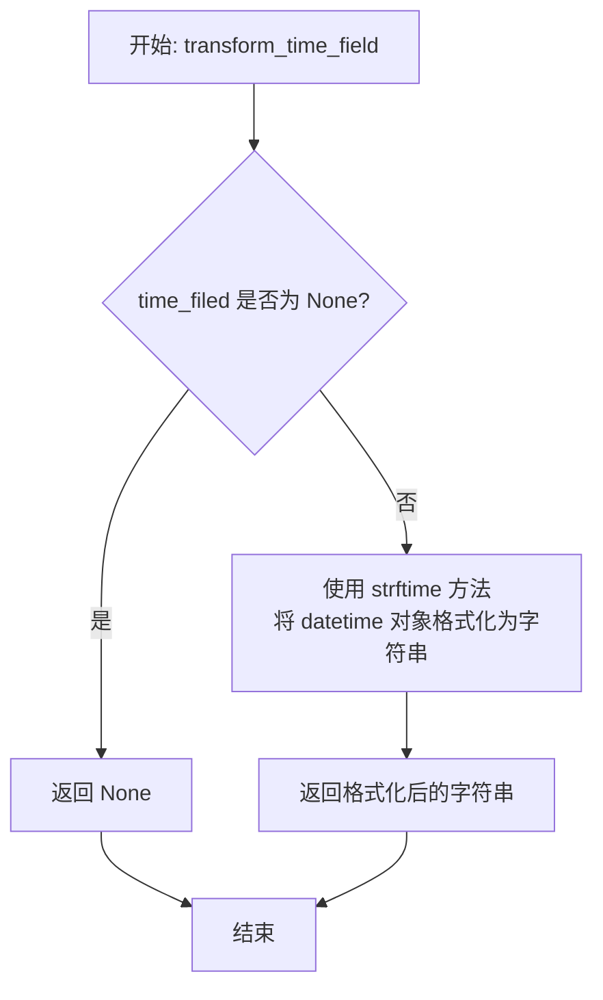

#### 带注释源码

```python
    @field_serializer("curr_time", "act_start_time", "chatting_end_time")
    def transform_time_field(self, time_filed: Optional[datetime]) -> str:
        # 检查传入的时间字段是否为 None
        if time_filed:
            # 如果不为 None，则使用 strftime 方法将其格式化为指定的字符串格式
            # 格式示例: "October 26, 2023, 14:30:00"
            time_filed = time_filed.strftime("%B %d, %Y, %H:%M:%S")
        # 返回处理后的结果（字符串或 None）
        return time_filed
```

### `Scratch.init_scratch_from_path`

这是一个类方法，用于从指定的JSON文件路径加载数据并初始化一个`Scratch`实例。它读取文件内容，将其解析为字典，然后使用该字典创建并返回一个新的`Scratch`对象。

参数：

- `f_saved`：`Path`，指向包含`Scratch`对象序列化数据的JSON文件的路径。

返回值：`Scratch`，根据文件内容初始化的`Scratch`类的新实例。

#### 流程图

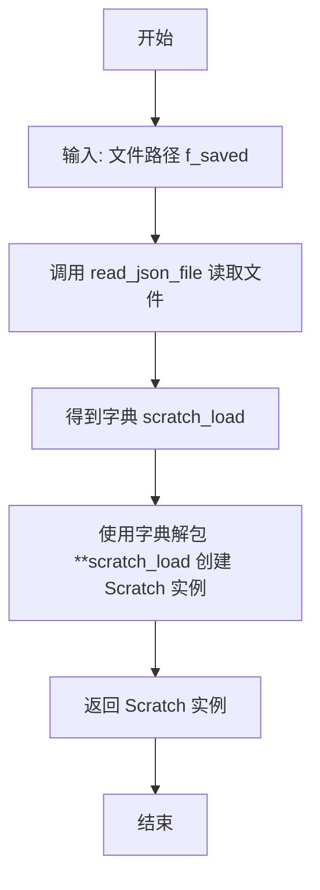

#### 带注释源码

```python
@classmethod
def init_scratch_from_path(cls, f_saved: Path):
    # 使用工具函数 read_json_file 从指定路径读取 JSON 文件，并将其内容解析为 Python 字典。
    scratch_load = read_json_file(f_saved)
    # 使用字典解包操作符 ** 将字典 scratch_load 的键值对作为关键字参数传递给 Scratch 类的构造函数。
    # 这相当于 Scratch(name=scratch_load['name'], age=scratch_load['age'], ...)。
    # cls 指代当前类（Scratch），因此这里创建并返回一个 Scratch 实例。
    scratch = Scratch(**scratch_load)
    # 返回新创建的 Scratch 实例。
    return scratch
```

### `Scratch.save`

该方法用于将`Scratch`实例（角色信息）的当前状态序列化为JSON格式并保存到指定的文件路径。

参数：

- `out_json`：`Path`，指定保存角色状态信息的JSON文件路径。

返回值：`None`，该方法不返回任何值，仅执行文件写入操作。

#### 流程图

```mermaid
flowchart TD
    A[开始] --> B[调用 self.model_dump()<br>将实例数据转为字典]
    B --> C[调用 write_json_file<br>将字典写入指定路径]
    C --> D[结束]
```

#### 带注释源码

```python
def save(self, out_json: Path):
    """
    Save persona's scratch.

    INPUT:
      out_json: The file where we wil be saving our persona's state.
    OUTPUT:
      None
    """
    # 1. 使用Pydantic BaseModel的model_dump方法将当前实例的所有字段序列化为字典。
    scratch = self.model_dump()
    # 2. 调用工具函数write_json_file，将字典写入到out_json指定的文件中，使用UTF-8编码。
    write_json_file(out_json, scratch, encoding="utf-8")
```

### `Scratch.get_f_daily_schedule_index`

该方法用于计算并返回角色（Persona）当前时间点在当日分解任务计划 `f_daily_schedule` 中的索引位置。它通过累加计划中每个任务的持续时间，并与从当天0点开始到当前时间（可加上指定的提前量）所经过的分钟数进行比较，从而确定当前时间点对应的计划项索引。

参数：

- `advance`：`int`，可选参数，默认为0。表示要向前（未来）看的分钟数。例如，传入30表示计算30分钟后的计划索引。

返回值：`int`，返回一个整数值，代表当前时间点（或未来指定时间点）在 `self.f_daily_schedule` 列表中的索引。如果时间点超过了所有计划的总时长，则返回最后一个索引（即列表长度）。

#### 流程图

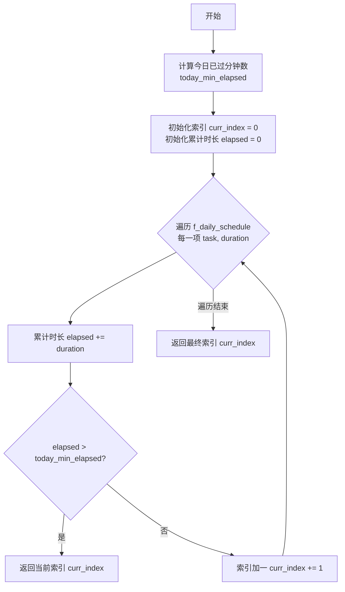

#### 带注释源码

```python
def get_f_daily_schedule_index(self, advance=0):
    """
    We get the current index of self.f_daily_schedule.

    Recall that self.f_daily_schedule stores the decomposed action sequences
    up until now, and the hourly sequences of the future action for the rest
    of today. Given that self.f_daily_schedule is a list of list where the
    inner list is composed of [task, duration], we continue to add up the
    duration until we reach "if elapsed > today_min_elapsed" condition. The
    index where we stop is the index we will return.

    INPUT
      advance: Integer value of the number minutes we want to look into the
               future. This allows us to get the index of a future timeframe.
    OUTPUT
      an integer value for the current index of f_daily_schedule.
    """
    # 计算从当天0点开始到当前时间（加上advance参数）所经过的总分钟数。
    today_min_elapsed = 0
    today_min_elapsed += self.curr_time.hour * 60
    today_min_elapsed += self.curr_time.minute
    today_min_elapsed += advance

    # 以下两段计算总时长的代码似乎是冗余的调试代码或笔误，对核心逻辑无影响。
    x = 0
    for task, duration in self.f_daily_schedule:
        x += duration
    x = 0
    for task, duration in self.f_daily_schedule_hourly_org:
        x += duration

    # 遍历 f_daily_schedule，累加每个任务的持续时间。
    # 当累计时间超过 today_min_elapsed 时，返回当前遍历到的索引。
    curr_index = 0
    elapsed = 0
    for task, duration in self.f_daily_schedule:
        elapsed += duration
        if elapsed > today_min_elapsed:
            return curr_index
        curr_index += 1

    # 如果遍历完所有任务，累计时间仍未超过 today_min_elapsed，
    # 则返回最后一个任务的索引（即列表长度）。
    return curr_index
```

### `Scratch.get_f_daily_schedule_hourly_org_index`

该方法用于计算并返回角色当前时间点在`f_daily_schedule_hourly_org`（按小时组织的每日计划）列表中的索引位置。它通过累加计划中每个任务的持续时间，并与从当天零点开始到当前时间（可加上一个提前量）所经过的总分钟数进行比较，来确定当前或未来某个时间点对应的计划项索引。

参数：

-  `advance`：`int`，可选参数，默认为0。表示要向前（未来）看的分钟数。用于获取未来某个时间点的计划索引。

返回值：`int`，返回一个整数值，表示在`f_daily_schedule_hourly_org`列表中，当前（或未来指定时间点）所对应的计划项的索引。

#### 流程图

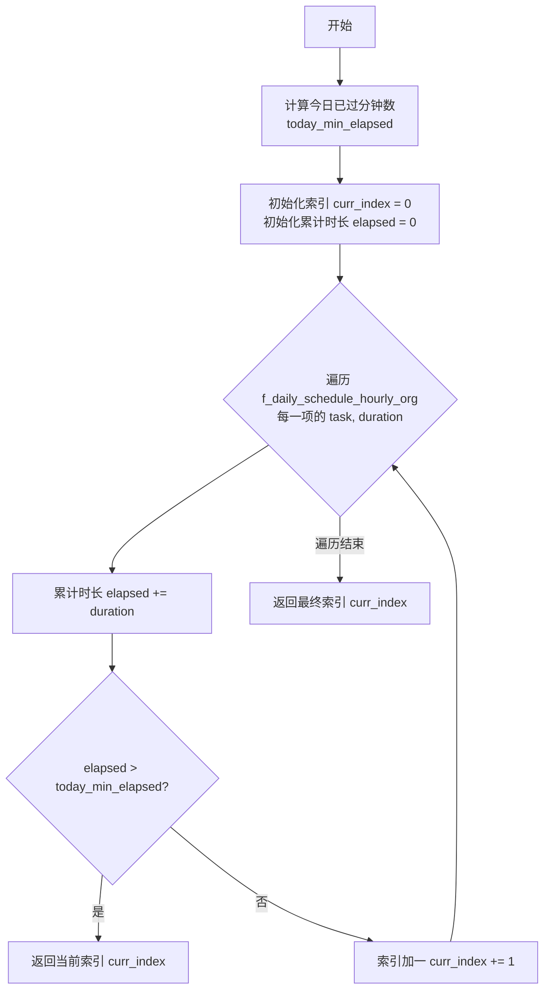

#### 带注释源码

```python
def get_f_daily_schedule_hourly_org_index(self, advance=0):
    """
    获取 self.f_daily_schedule_hourly_org 的当前索引。
    其逻辑与 get_f_daily_schedule_index 相同。

    输入参数:
      advance: 整数，表示我们希望向前（未来）看的分钟数。这允许我们获取未来某个时间段的索引。

    返回值:
      一个整数值，表示 f_daily_schedule_hourly_org 的当前索引。
    """
    # 首先计算今天已经过去的分钟数。
    today_min_elapsed = 0
    # 将当前时间的小时转换为分钟并累加
    today_min_elapsed += self.curr_time.hour * 60
    # 将当前时间的分钟数累加
    today_min_elapsed += self.curr_time.minute
    # 加上向前看的分钟数（advance）
    today_min_elapsed += advance

    # 然后基于已过时间计算当前索引。
    curr_index = 0  # 初始化索引
    elapsed = 0     # 初始化累计时长
    # 遍历按小时组织的每日计划列表
    for task, duration in self.f_daily_schedule_hourly_org:
        elapsed += duration  # 累加当前任务的持续时间
        # 如果累计时长超过了今天已过的时间（含advance），则返回当前索引
        if elapsed > today_min_elapsed:
            return curr_index
        curr_index += 1  # 否则索引加一，继续检查下一项
    # 如果遍历完所有计划项仍未超过，则返回最后一个索引（即列表长度）
    return curr_index
```

### `Scratch.get_str_iss`

该方法用于生成角色的“身份稳定集”（Identity Stable Set, ISS）摘要。ISS 是角色最核心、最稳定的身份描述，通常用于需要调用角色信息的各种提示（prompts）中。它汇总了角色的姓名、年龄、先天特质、后天习得特质、当前状态、生活方式和每日计划要求等关键信息。

参数：

- 无

返回值：`str`，返回一个格式化的字符串，包含角色的身份稳定集摘要。

#### 流程图

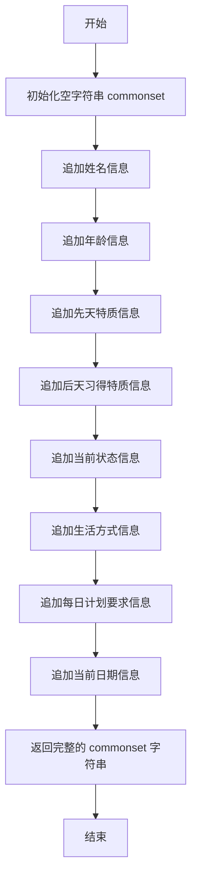

#### 带注释源码

```python
def get_str_iss(self):
    """
    ISS stands for "identity stable set." This describes the commonset summary
    of this persona -- basically, the bare minimum description of the persona
    that gets used in almost all prompts that need to call on the persona.

    INPUT
      None
    OUTPUT
      the identity stable set summary of the persona in a string form.
    EXAMPLE STR OUTPUT
      "Name: Dolores Heitmiller
       Age: 28
       Innate traits: hard-edged, independent, loyal
       Learned traits: Dolores is a painter who wants live quietly and paint
         while enjoying her everyday life.
       Currently: Dolores is preparing for her first solo show. She mostly
         works from home.
       Lifestyle: Dolores goes to bed around 11pm, sleeps for 7 hours, eats
         dinner around 6pm.
       Daily plan requirement: Dolores is planning to stay at home all day and
         never go out."
    """
    # 初始化一个空字符串，用于累积所有身份信息
    commonset = ""
    # 追加姓名信息，格式为 "Name: {self.name}\n"
    commonset += f"Name: {self.name}\n"
    # 追加年龄信息，格式为 "Age: {self.age}\n"
    commonset += f"Age: {self.age}\n"
    # 追加先天特质信息，格式为 "Innate traits: {self.innate}\n"
    commonset += f"Innate traits: {self.innate}\n"
    # 追加后天习得特质信息，格式为 "Learned traits: {self.learned}\n"
    commonset += f"Learned traits: {self.learned}\n"
    # 追加当前状态信息，格式为 "Currently: {self.currently}\n"
    commonset += f"Currently: {self.currently}\n"
    # 追加生活方式信息，格式为 "Lifestyle: {self.lifestyle}\n"
    commonset += f"Lifestyle: {self.lifestyle}\n"
    # 追加每日计划要求信息，格式为 "Daily plan requirement: {self.daily_plan_req}\n"
    commonset += f"Daily plan requirement: {self.daily_plan_req}\n"
    # 追加当前日期信息。如果 curr_time 存在，则格式化为 "Current Date: {星期几} {月份} {日期}\n"
    commonset += f"Current Date: {self.curr_time.strftime('%A %B %d') if self.curr_time else ''}\n"
    # 返回构建好的完整身份摘要字符串
    return commonset
```

### `Scratch.get_str_name`

该方法用于获取角色（Persona）的姓名。

参数：无

返回值：`Optional[str]`，返回角色的姓名（`self.name`），如果未设置则返回 `None`。

#### 流程图

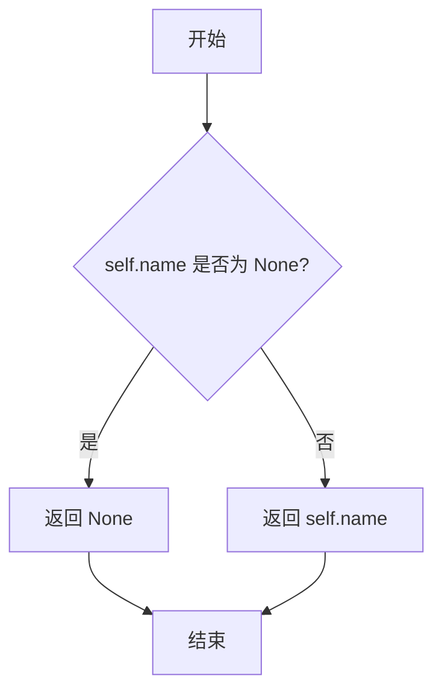

#### 带注释源码

```python
def get_str_name(self):
    # 直接返回实例的 `name` 字段
    return self.name
```

### `Scratch.get_str_firstname`

该方法用于获取角色（Persona）的名字（first name）。它是`Scratch`类的一个简单访问器方法，直接返回存储在`first_name`字段中的字符串值。

参数：
- 无

返回值：`Optional[str]`，返回角色的名字（first name）。如果`first_name`字段未设置，则返回`None`。

#### 流程图

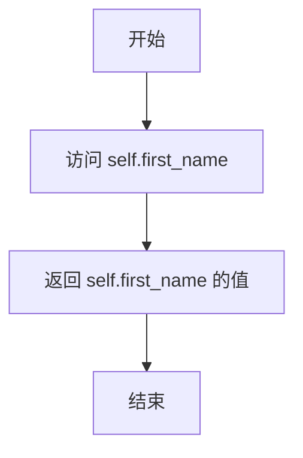

#### 带注释源码

```python
def get_str_firstname(self):
    # 直接返回实例的 first_name 属性值
    # 该属性在类定义中为 Optional[str] 类型，可能为 None
    return self.first_name
```

### `Scratch.get_str_lastname`

该方法用于获取角色（Persona）的姓氏（last name）。它是`Scratch`类中的一个简单属性访问器，直接返回存储在`last_name`字段中的值。

参数：
- 无

返回值：`Optional[str]`，返回角色的姓氏字符串。如果`last_name`字段未设置，则返回`None`。

#### 流程图

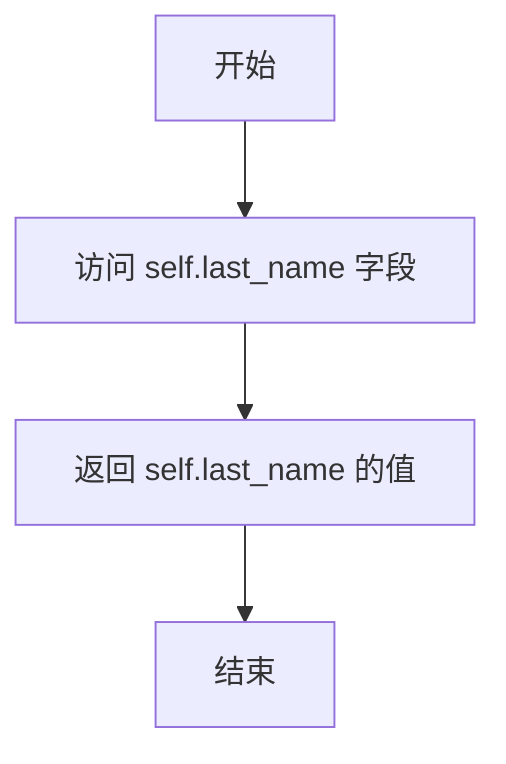

#### 带注释源码

```python
def get_str_lastname(self):
    """
    获取角色的姓氏。
    这是一个简单的属性访问器，直接返回存储在`last_name`字段中的值。
    如果`last_name`字段未设置，则返回`None`。

    Returns:
        Optional[str]: 角色的姓氏字符串。
    """
    return self.last_name
```

### `Scratch.get_str_age`

该方法用于获取角色年龄的字符串表示形式。它简单地将整数类型的年龄字段转换为字符串类型返回。

参数：无

返回值：`str`，返回角色年龄的字符串表示形式。

#### 流程图

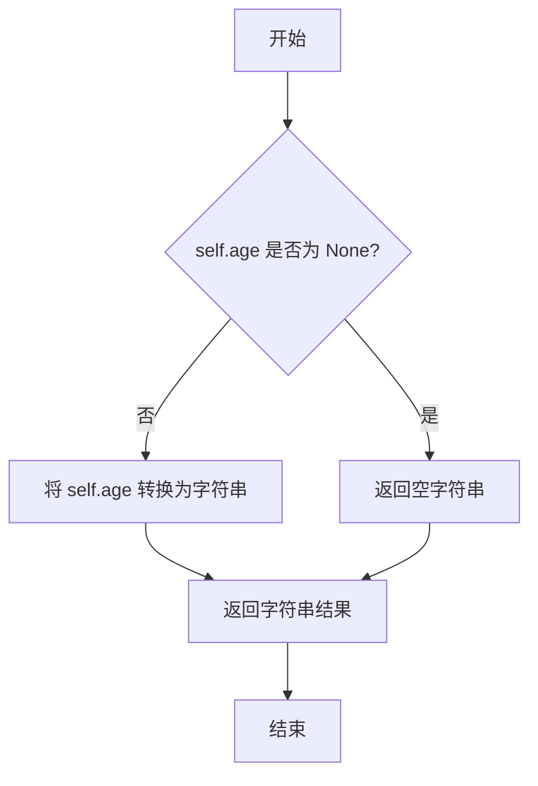

#### 带注释源码

```python
def get_str_age(self):
    # 将 self.age 字段的值转换为字符串类型并返回
    # 如果 self.age 为 None，则返回字符串 "None"
    return str(self.age)
```

### `Scratch.get_str_innate`

该方法用于获取角色（Persona）的“先天特质”（innate traits）字符串。这是角色核心身份（L0级别）的永久性特征描述，通常用于构建角色的基础身份摘要。

参数：
- 无

返回值：`Optional[str]`，返回角色的先天特质描述字符串。如果`self.innate`字段未设置，则返回`None`。

#### 流程图

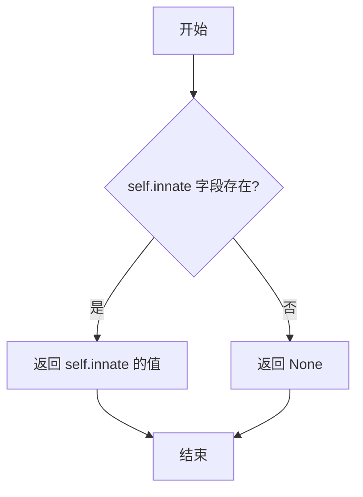

#### 带注释源码

```python
def get_str_innate(self):
    """
    获取角色的先天特质（innate traits）字符串。
    这是角色核心身份（L0级别）的永久性特征描述。
    
    输入:
        无
    输出:
        角色的先天特质描述字符串。如果未设置，则返回None。
    """
    return self.innate  # 直接返回实例的 innate 字段值
```

### `Scratch.get_str_learned`

该方法用于获取角色（Persona）的“已习得特质”（Learned traits）的字符串表示。这是角色核心身份信息的一部分，属于L1稳定特质，描述了角色通过生活经验形成的相对稳定的性格、技能或习惯。

参数：
- 无

返回值：`Optional[str]`，返回`self.learned`字段的值，即角色已习得特质的字符串描述。如果该字段未设置，则返回`None`。

#### 流程图

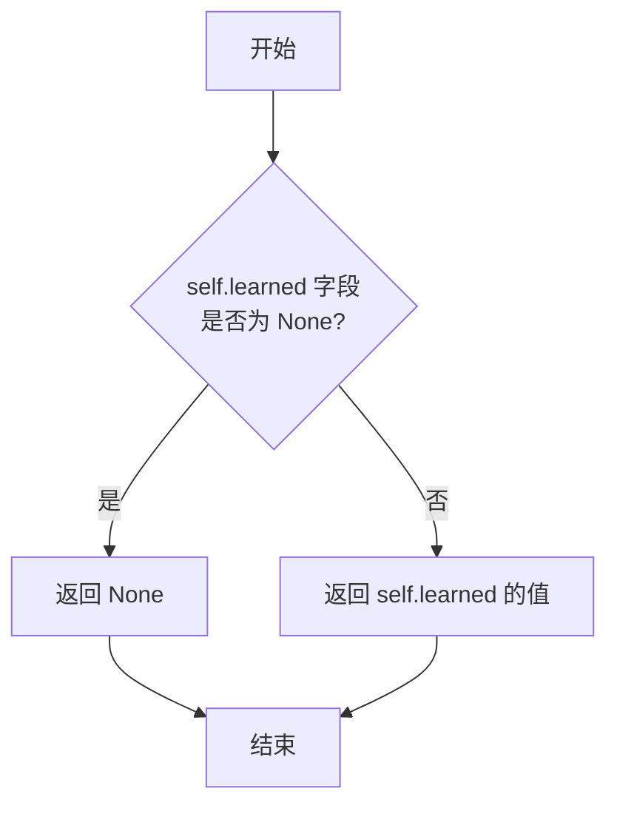

#### 带注释源码

```python
def get_str_learned(self):
    """
    获取角色“已习得特质”（Learned traits）的字符串表示。
    这是角色核心身份信息（L1稳定特质）的一部分。

    INPUT
      None
    OUTPUT
      self.learned 字段的值，类型为 Optional[str]。
      如果该字段未设置，则返回 None。
    """
    return self.learned  # 直接返回类字段 `self.learned` 的值
```

### `Scratch.get_str_currently`

该方法用于获取角色当前状态（currently）的字符串表示。`currently`字段属于“人物角色的核心身份”类别，代表角色的L2外部实现层，描述角色当前正在进行的活动或状态。

参数：
- 无参数

返回值：`Optional[str]`，返回`self.currently`字段的值，即角色当前状态的字符串描述，可能为`None`。

#### 流程图

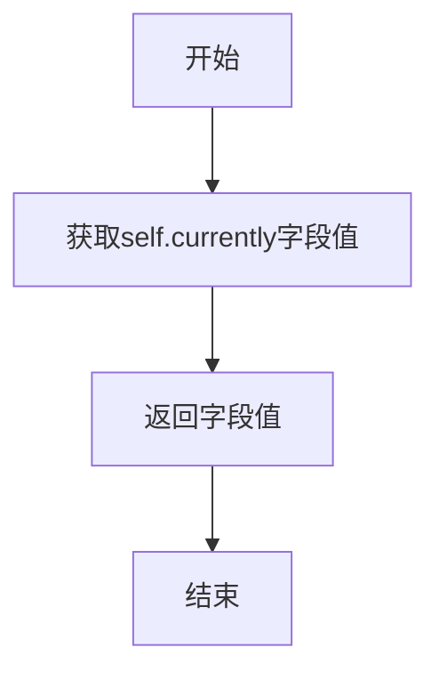

#### 带注释源码

```python
def get_str_currently(self):
    # 直接返回实例的`currently`属性值
    # `currently`字段存储角色当前的外部状态描述（L2层）
    return self.currently
```

### `Scratch.get_str_lifestyle`

该方法用于获取角色生活方式的字符串描述。它直接返回 `Scratch` 类中 `lifestyle` 字段的值，该字段描述了角色的生活习惯，如作息时间、饮食习惯等。

参数：无

返回值：`Optional[str]`，返回角色的生活方式描述字符串。如果 `lifestyle` 字段为 `None`，则返回 `None`。

#### 流程图

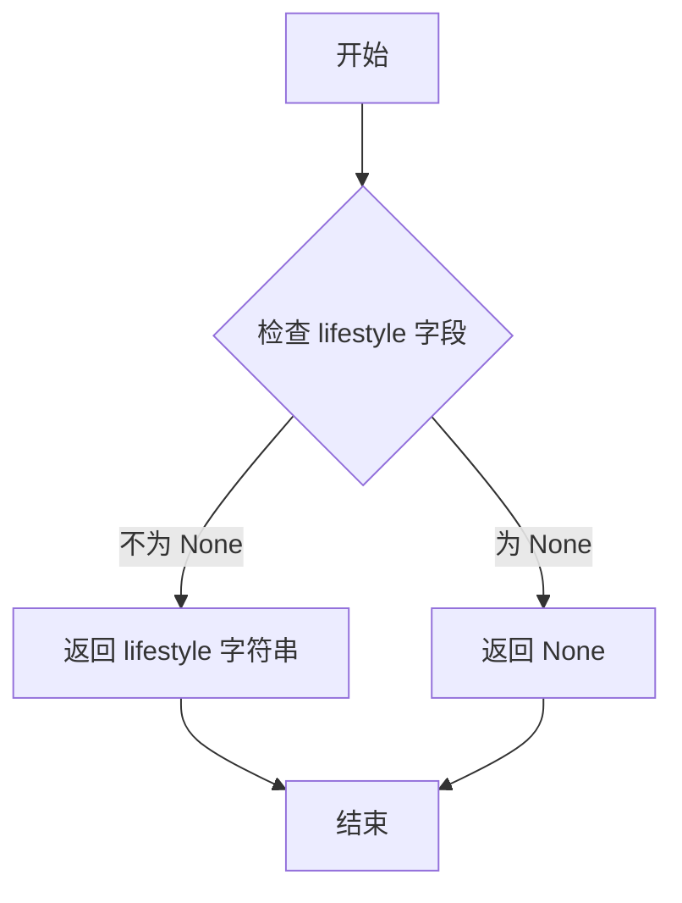

#### 带注释源码

```python
def get_str_lifestyle(self):
    """
    获取角色生活方式的字符串描述。
    直接返回 `lifestyle` 字段的值，该字段描述了角色的生活习惯，如作息时间、饮食习惯等。
    
    返回值:
        Optional[str]: 角色的生活方式描述字符串。如果 `lifestyle` 字段为 `None`，则返回 `None`。
    """
    return self.lifestyle  # 返回 lifestyle 字段的值
```

### `Scratch.get_str_daily_plan_req`

该方法用于获取角色（Persona）的每日计划要求（daily plan requirement）的字符串表示。这是一个简单的属性访问器方法，直接返回存储在`daily_plan_req`字段中的值。

参数：
- 无

返回值：`Optional[str]`，返回角色的每日计划要求字符串，如果未设置则为`None`。

#### 流程图

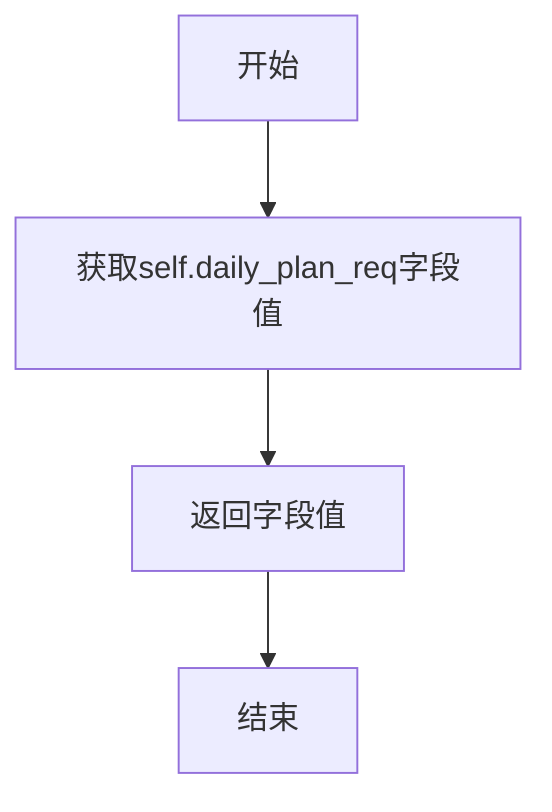

#### 带注释源码

```python
def get_str_daily_plan_req(self):
    # 直接返回实例的 daily_plan_req 属性值
    # 该属性存储了角色的每日计划要求
    return self.daily_plan_req
```

### `Scratch.get_str_curr_date_str`

该方法用于获取当前日期（`curr_time`）的格式化字符串表示，格式为“星期几 月份 日期”（例如：“Monday January 01”）。

参数：
- 无

返回值：`str`，返回当前日期（`curr_time`）的格式化字符串，格式为“%A %B %d”。如果`curr_time`为`None`，则返回空字符串。

#### 流程图

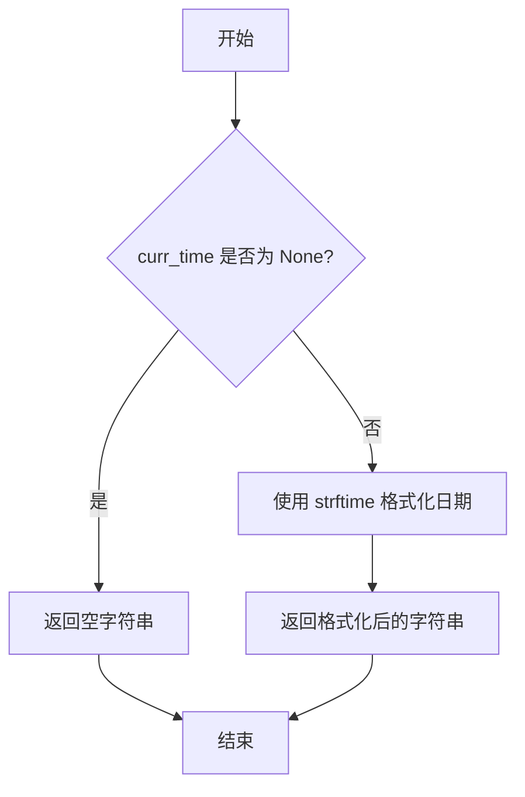

#### 带注释源码

```python
def get_str_curr_date_str(self):
    # 返回当前日期（curr_time）的格式化字符串，格式为“星期几 月份 日期”
    # 如果 curr_time 为 None，则返回空字符串
    return self.curr_time.strftime("%A %B %d")
```

### `Scratch.get_curr_event`

该方法用于获取角色当前正在执行的事件信息。如果角色当前没有活动地址（即未执行任何动作），则返回角色名称和两个`None`值；否则，返回角色当前动作的事件列表。

参数：
- 无

返回值：`tuple`，包含三个元素：
  - 第一个元素：`str`，角色名称（当无活动地址时）或当前动作事件列表的第一个元素。
  - 第二个元素：`Optional[str]`，当前动作事件列表的第二个元素，若无活动地址则为`None`。
  - 第三个元素：`Optional[str]`，当前动作事件列表的第三个元素，若无活动地址则为`None`。

#### 流程图

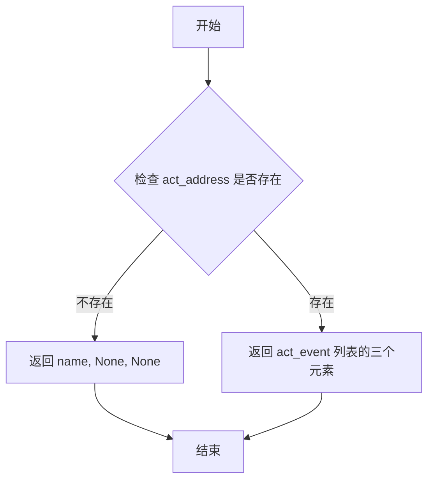

#### 带注释源码

```python
def get_curr_event(self):
    # 检查当前活动地址是否存在
    if not self.act_address:
        # 如果不存在，返回角色名称和两个None值
        return self.name, None, None
    else:
        # 如果存在，返回当前动作的事件列表
        return self.act_event
```

### `Scratch.get_curr_event_and_desc`

该方法用于获取角色当前正在执行的事件及其详细描述。如果角色当前没有活动地址（即未执行任何活动），则返回角色名称和三个`None`值；否则，返回当前事件的三个组成部分（事件标识符）及其描述。

参数：
- 无

返回值：`tuple`，包含四个元素：
  - 第一个元素：`str` 或 `None`，当前事件的第一个组成部分（通常是事件标识符或角色名称）
  - 第二个元素：`str` 或 `None`，当前事件的第二个组成部分
  - 第三个元素：`str` 或 `None`，当前事件的第三个组成部分
  - 第四个元素：`str` 或 `None`，当前事件的描述

#### 流程图

```mermaid
graph TD
    A[开始] --> B{act_address 是否存在?};
    B -- 否 --> C[返回 name, None, None, None];
    B -- 是 --> D[返回 act_event[0], act_event[1], act_event[2], act_description];
    C --> E[结束];
    D --> E;
```

#### 带注释源码

```python
def get_curr_event_and_desc(self):
    # 检查当前活动地址是否存在
    if not self.act_address:
        # 如果不存在，返回角色名称和三个None值
        return self.name, None, None, None
    else:
        # 如果存在，返回当前事件的三个组成部分及其描述
        return self.act_event[0], self.act_event[1], self.act_event[2], self.act_description
```

### `Scratch.get_curr_obj_event_and_desc`

该方法用于获取当前角色（Persona）正在执行的动作（Action）所关联的对象（Object）的事件信息和描述。如果角色当前没有执行任何动作（即`act_address`为空），则返回空字符串和三个`None`值；否则，返回动作的地址以及对象事件的三个组成部分和对象描述。

参数：
- 无

返回值：`tuple[str, Optional[str], Optional[str], Optional[str]]`，返回一个包含四个元素的元组：
  1. 动作地址（`act_address`），如果无动作则为空字符串。
  2. 对象事件的第二个元素（`act_obj_event[1]`），可能为`None`。
  3. 对象事件的第三个元素（`act_obj_event[2]`），可能为`None`。
  4. 对象描述（`act_obj_description`），可能为`None`。

#### 流程图

```mermaid
flowchart TD
    A[开始] --> B{act_address 是否为空?}
    B -->|是| C[返回空字符串和三个None]
    B -->|否| D[返回 act_address, act_obj_event[1], act_obj_event[2], act_obj_description]
    C --> E[结束]
    D --> E
```

#### 带注释源码

```python
def get_curr_obj_event_and_desc(self):
    # 检查当前是否有正在执行的动作（通过 act_address 判断）
    if not self.act_address:
        # 如果没有动作，返回空字符串和三个 None 值
        return "", None, None, None
    else:
        # 如果有动作，返回动作地址、对象事件的第二个和第三个元素、以及对象描述
        return self.act_address, self.act_obj_event[1], self.act_obj_event[2], self.act_obj_description
```

### `Scratch.add_new_action`

该方法用于更新角色（Persona）的当前动作状态，包括动作地址、持续时间、描述、发音、事件以及与聊天相关的信息。它还会重置动作路径设置，并将动作开始时间设置为当前时间。

参数：

- `action_address`：`str`，动作发生的地点或地址
- `action_duration`：`int`，动作的持续时间（分钟）
- `action_description`：`str`，动作的描述
- `action_pronunciatio`：`str`，动作的发音表示
- `action_event`：`list[Optional[str]]`，动作相关的事件列表
- `chatting_with`：`str`，聊天对象
- `chat`：`str`，聊天内容
- `chatting_with_buffer`：`dict`，聊天缓冲区，用于存储聊天历史
- `chatting_end_time`：`datetime`，聊天结束时间
- `act_obj_description`：`str`，动作对象的描述
- `act_obj_pronunciatio`：`str`，动作对象的发音表示
- `act_obj_event`：`list[Optional[str]]`，动作对象相关的事件列表
- `act_start_time`：`datetime`，可选参数，动作开始时间，默认为None

返回值：`None`，无返回值

#### 流程图

```mermaid
flowchart TD
    A[开始] --> B[更新动作地址、持续时间、描述、发音和事件]
    B --> C[更新聊天相关字段]
    C --> D[更新动作对象相关字段]
    D --> E[设置动作开始时间为当前时间]
    E --> F[重置动作路径设置]
    F --> G[结束]
```

#### 带注释源码

```python
def add_new_action(
    self,
    action_address,
    action_duration,
    action_description,
    action_pronunciatio,
    action_event,
    chatting_with,
    chat,
    chatting_with_buffer,
    chatting_end_time,
    act_obj_description,
    act_obj_pronunciatio,
    act_obj_event,
    act_start_time=None,
):
    # 更新动作相关字段
    self.act_address = action_address
    self.act_duration = action_duration
    self.act_description = action_description
    self.act_pronunciatio = action_pronunciatio
    self.act_event = action_event

    # 更新聊天相关字段
    self.chatting_with = chatting_with
    self.chat = chat
    if chatting_with_buffer:
        self.chatting_with_buffer.update(chatting_with_buffer)
    self.chatting_end_time = chatting_end_time

    # 更新动作对象相关字段
    self.act_obj_description = act_obj_description
    self.act_obj_pronunciatio = act_obj_pronunciatio
    self.act_obj_event = act_obj_event

    # 设置动作开始时间为当前时间
    self.act_start_time = self.curr_time

    # 重置动作路径设置
    self.act_path_set = False
```

### `Scratch.act_time_str`

该方法用于获取当前动作开始时间的格式化字符串表示。

参数：无

返回值：`str`，返回当前动作开始时间的格式化字符串，格式为"HH:MM AM/PM"。

#### 流程图

```mermaid
flowchart TD
    A[开始] --> B{act_start_time 是否存在?}
    B -- 是 --> C[调用 strftime 方法<br>格式化为 '%H:%M %p']
    C --> D[返回格式化后的时间字符串]
    B -- 否 --> E[返回空字符串或默认值]
    D --> F[结束]
    E --> F
```

#### 带注释源码

```python
def act_time_str(self):
    """
    返回当前动作开始时间的字符串表示。

    输入:
        无
    输出:
        当前动作开始时间的格式化字符串。
    示例输出:
        "14:05 PM"
    """
    # 使用 strftime 方法将 act_start_time 格式化为 "小时:分钟 上午/下午" 的字符串
    return self.act_start_time.strftime("%H:%M %p")
```

### `Scratch.act_check_finished`

该方法用于检查当前角色（`Scratch`实例）正在执行的动作是否已经完成。它通过比较当前时间（`curr_time`）与动作的预计结束时间来判断。如果动作没有地址（即没有正在执行的动作），或者当前时间等于或超过了计算出的结束时间，则返回`True`表示动作已完成；否则返回`False`表示动作仍在进行中。

参数：

-  `self`：`Scratch`，`Scratch`类的实例，代表一个角色。

返回值：`bool`，`True`表示动作已完成，`False`表示动作未完成。

#### 流程图

```mermaid
flowchart TD
    A[开始] --> B{是否有动作地址<br>self.act_address?}
    B -->|否| C[返回 True]
    B -->|是| D{是否在聊天中<br>self.chatting_with?}
    D -->|是| E[结束时间 = 聊天结束时间<br>self.chatting_end_time]
    D -->|否| F[计算动作结束时间<br>动作开始时间 + 持续时间]
    F --> G[调整动作开始时间的秒数为0]
    G --> H[计算结束时间]
    E --> I{当前时间 == 结束时间?}
    H --> I
    I -->|是| C
    I -->|否| J[返回 False]
```

#### 带注释源码

```python
def act_check_finished(self):
    """
    检查当前动作是否已完成。

    逻辑：
    1. 如果没有设置动作地址（self.act_address），说明没有正在进行的动作，直接返回True（已完成）。
    2. 如果当前动作是聊天（self.chatting_with存在），则使用聊天的预定结束时间（self.chatting_end_time）作为判断依据。
    3. 否则，根据动作的开始时间（self.act_start_time）和持续时间（self.act_duration）计算动作的结束时间。
        - 计算前，将开始时间的秒数归零并加一分钟，以确保时间对齐到整分钟。
    4. 将当前时间（self.curr_time）与计算出的结束时间进行比较。
        - 如果两者相等（精确到秒），则认为动作已完成，返回True。
        - 否则，返回False。

    注意：此方法依赖于self.curr_time的准确性，它应由外部系统（如模拟时钟）定期更新。
    """
    # 情况1: 没有正在执行的动作
    if not self.act_address:
        return True

    # 情况2: 当前动作是聊天
    if self.chatting_with:
        end_time = self.chatting_end_time
    # 情况3: 当前是普通动作
    else:
        # 获取动作开始时间
        x = self.act_start_time
        # 将秒数归零并加一分钟，对齐到整分钟
        if x.second != 0:
            x = x.replace(second=0)
            x = x + timedelta(minutes=1)
        # 计算动作结束时间：开始时间 + 持续时间
        end_time = x + timedelta(minutes=self.act_duration)

    # 比较当前时间与结束时间（精确到秒）
    if end_time.strftime("%H:%M:%S") == self.curr_time.strftime("%H:%M:%S"):
        return True
    return False
```

### `Scratch.act_summarize`

该方法用于将角色的当前动作信息汇总为一个字典格式的摘要，便于后续处理或展示。

参数：
- 无

返回值：`dict`，一个包含当前动作关键信息的字典，包括角色名、地址、开始时间、持续时间、描述和发音提示。

#### 流程图

```mermaid
flowchart TD
    A[开始] --> B[创建空字典 exp]
    B --> C[添加 persona 字段<br>值为 self.name]
    C --> D[添加 address 字段<br>值为 self.act_address]
    D --> E[添加 start_datetime 字段<br>值为 self.act_start_time]
    E --> F[添加 duration 字段<br>值为 self.act_duration]
    F --> G[添加 description 字段<br>值为 self.act_description]
    G --> H[添加 pronunciatio 字段<br>值为 self.act_pronunciatio]
    H --> I[返回字典 exp]
    I --> J[结束]
```

#### 带注释源码

```python
def act_summarize(self):
    """
    Summarize the current action as a dictionary.

    INPUT
      None
    OUTPUT
      ret: A human readable summary of the action.
    """
    # 初始化一个空字典，用于存储动作摘要
    exp = dict()
    # 添加角色名字段
    exp["persona"] = self.name
    # 添加动作地址字段
    exp["address"] = self.act_address
    # 添加动作开始时间字段
    exp["start_datetime"] = self.act_start_time
    # 添加动作持续时间字段
    exp["duration"] = self.act_duration
    # 添加动作描述字段
    exp["description"] = self.act_description
    # 添加动作发音提示字段
    exp["pronunciatio"] = self.act_pronunciatio
    # 返回包含所有动作信息的字典
    return exp
```

### `Scratch.act_summary_str`

该方法用于生成一个人类可读的字符串，总结角色（Persona）当前正在执行的动作（Action）。它格式化动作的开始时间、描述、发生地址和持续时间，并以清晰的结构化文本形式返回。

参数：
- 无

返回值：`str`，一个格式化的字符串，包含当前动作的详细信息。

#### 流程图

```mermaid
flowchart TD
    A[开始] --> B[格式化动作开始时间<br/>`act_start_time`]
    B --> C[构建总结字符串<br/>包含时间、描述、地址、时长]
    C --> D[返回格式化字符串]
    D --> E[结束]
```

#### 带注释源码

```python
def act_summary_str(self):
    """
    返回当前动作的字符串摘要。旨在使其对人类可读。

    输入
      无
    输出
      ret: 动作的人类可读摘要。
    """
    # 1. 将动作开始时间格式化为易读的字符串，例如 "Monday January 01 -- 14:30 PM"
    start_datetime_str = self.act_start_time.strftime("%A %B %d -- %H:%M %p")
    # 2. 初始化返回字符串，首先添加时间戳行
    ret = f"[{start_datetime_str}]\n"
    # 3. 添加动作描述行，格式为 "Activity: {角色名} is {动作描述}"
    ret += f"Activity: {self.name} is {self.act_description}\n"
    # 4. 添加动作发生地址行
    ret += f"Address: {self.act_address}\n"
    # 5. 添加动作持续时间行，单位为分钟
    ret += f"Duration in minutes (e.g., x min): {str(self.act_duration)} min\n"
    # 6. 返回构建好的完整摘要字符串
    return ret
```

### `Scratch.get_daily_schedule`

该方法用于将给定的每日计划列表（包含任务和持续时间）格式化为一个可读的字符串时间表。它计算每个任务的累计时间，并将其转换为“HH:MM || 任务描述”的格式。

参数：
- `daily_schedule`：`list[list[str]]`，一个列表，其中每个元素是一个包含两个字符串的列表，第一个元素是任务描述，第二个元素是任务持续时间（以分钟为单位，字符串形式）。

返回值：`str`，一个格式化后的字符串，每一行代表一个计划任务及其对应的开始时间。

#### 流程图

```mermaid
flowchart TD
    A[开始] --> B[初始化返回字符串ret和累计时间curr_min_sum为0]
    B --> C{遍历daily_schedule中的每个row}
    C --> D[将row[1]转换为整数并累加到curr_min_sum]
    D --> E[计算小时hour = curr_min_sum // 60]
    E --> F[计算分钟minute = curr_min_sum % 60]
    F --> G[格式化时间并拼接任务描述到ret]
    G --> C
    C -- 遍历结束 --> H[返回格式化后的字符串ret]
    H --> I[结束]
```

#### 带注释源码

```python
def get_daily_schedule(self, daily_schedule: list[list[str]]):
    ret = ""  # 初始化返回的字符串
    curr_min_sum = 0  # 初始化累计分钟数
    for row in daily_schedule:  # 遍历每日计划中的每一行
        curr_min_sum += int(row[1])  # 将当前任务的持续时间（分钟）累加到总时间
        hour = int(curr_min_sum / 60)  # 计算累计时间对应的小时数
        minute = curr_min_sum % 60  # 计算累计时间对应的分钟数
        # 格式化时间并拼接任务描述，添加到返回字符串中
        ret += f"{hour:02}:{minute:02} || {row[0]}\n"
    return ret  # 返回格式化后的时间表字符串
```

### `Scratch.get_str_daily_schedule_summary`

该方法用于获取角色每日计划（`f_daily_schedule`）的格式化字符串摘要。它将计划中的每个任务及其持续时间转换为一个按时间顺序排列的日程表字符串，其中时间以“HH:MM”格式表示，后跟任务描述。

参数：
- 无

返回值：`str`，返回一个格式化的字符串，表示从当天开始累计的日程安排，每行包含时间点和对应的任务。

#### 流程图

```mermaid
flowchart TD
    A[开始] --> B[初始化返回字符串 ret 和<br>累计分钟数 curr_min_sum 为 0]
    B --> C{遍历 daily_schedule<br>中的每个任务 row}
    C --> D[计算累计分钟数<br>curr_min_sum += row[1]]
    D --> E[计算小时和分钟<br>hour = curr_min_sum // 60<br>minute = curr_min_sum % 60]
    E --> F[格式化时间并拼接任务描述<br>ret += f"{hour:02}:{minute:02} || {row[0]}\n"]
    F --> C
    C -- 遍历结束 --> G[返回格式化后的字符串 ret]
    G --> H[结束]
```

#### 带注释源码

```python
def get_str_daily_schedule_summary(self):
    # 调用内部方法 get_daily_schedule，传入当前角色的详细日程计划 f_daily_schedule
    # f_daily_schedule 是一个列表，每个元素是 [任务描述, 持续时间（分钟）]
    return self.get_daily_schedule(self.f_daily_schedule)
```

### `Scratch.get_str_daily_schedule_hourly_org_summary`

该方法用于获取角色每日计划（按小时组织）的格式化字符串摘要。它将`f_daily_schedule_hourly_org`字段中的计划（一个包含任务和持续时间的列表）转换为一个易读的字符串，其中每行显示任务开始的时间（格式为“HH:MM”）和任务描述。

参数：
-  `self`：`Scratch`，当前`Scratch`类的实例，包含角色的状态信息，特别是`f_daily_schedule_hourly_org`字段。

返回值：`str`，返回一个格式化后的字符串，表示角色按小时组织的每日计划摘要。每行格式为“HH:MM || 任务描述”。

#### 流程图

```mermaid
flowchart TD
    A[开始] --> B[初始化返回字符串ret为空字符串<br>初始化累计分钟数curr_min_sum为0]
    B --> C{遍历f_daily_schedule_hourly_org<br>中的每个任务row}
    C --> D[计算累计分钟数<br>curr_min_sum += row[1]]
    D --> E[计算小时数hour = int(curr_min_sum / 60)]
    E --> F[计算分钟数minute = curr_min_sum % 60]
    F --> G[格式化时间字符串<br>并拼接任务描述到ret]
    G --> C
    C -- 遍历结束 --> H[返回格式化后的字符串ret]
    H --> I[结束]
```

#### 带注释源码

```python
def get_str_daily_schedule_hourly_org_summary(self):
    # 调用内部辅助方法 `get_daily_schedule`，传入 `f_daily_schedule_hourly_org` 列表
    # 该方法将计划列表转换为格式化的字符串摘要
    return self.get_daily_schedule(self.f_daily_schedule_hourly_org)
```

## 关键组件

### Scratch类

角色信息与状态管理核心类，用于存储和管理虚拟角色的身份属性、行为状态、时间感知、日常计划及反思机制等综合信息。

### 时间管理与序列化组件

负责处理`curr_time`、`act_start_time`、`chatting_end_time`等时间字段的验证、序列化与反序列化，确保时间数据在JSON存储和Python对象间正确转换。

### 日程管理组件

包含`f_daily_schedule`和`f_daily_schedule_hourly_org`两个核心字段及其对应的索引查询方法（`get_f_daily_schedule_index`和`get_f_daily_schedule_hourly_org_index`），用于管理角色的分解动作序列和未来每小时计划，并支持基于当前时间或未来时间偏移量查询计划索引。

### 身份信息组件

包含`name`、`age`、`innate`、`learned`、`currently`、`lifestyle`、`daily_plan_req`等字段及其对应的`get_str_*`方法，用于构建和获取角色的核心身份描述（ISS - Identity Stable Set）及各个独立属性。

### 动作状态管理组件

包含`act_address`、`act_start_time`、`act_duration`、`act_description`、`act_event`、`chatting_with`、`chatting_end_time`等字段，以及`add_new_action`、`act_check_finished`、`act_summarize`、`act_summary_str`等方法，用于记录、更新、检查和总结角色当前执行的动作状态。

### 反思机制组件

包含`concept_forget`、`daily_reflection_time`、`recency_w`、`relevance_w`、`importance_w`、`recency_decay`、`importance_trigger_max`等字段，定义了角色进行记忆反思和行为调整的算法参数与阈值。

### 持久化组件

包含`init_scratch_from_path`类方法和`save`实例方法，提供了从JSON文件初始化角色状态以及将当前状态保存回JSON文件的能力，实现了角色的状态持久化。

## 问题及建议


### 已知问题

-   **时间字段验证逻辑不健壮**：`check_time_filed` 验证器在尝试将字符串解析为 `datetime` 对象时，如果传入的 `time_filed` 不是预期的 `"%B %d, %Y, %H:%M:%S"` 格式，会直接抛出 `ValueError` 异常，缺乏对异常情况的捕获和处理。
-   **`get_f_daily_schedule_index` 方法存在冗余计算**：该方法中有一段计算 `x` 的循环代码（`for task, duration in self.f_daily_schedule:` 和 `for task, duration in self.f_daily_schedule_hourly_org:`），这些计算结果未被使用，属于无效代码，可能是在开发过程中遗留的调试代码。
-   **`add_new_action` 方法参数过多**：该方法接收多达13个参数，违反了高内聚、低耦合的设计原则，使得方法签名冗长，调用复杂，且容易在参数传递时出错。
-   **`chatting_with_buffer` 字段初始化不一致**：该字段在类定义中初始化为 `dict()`，但在 `add_new_action` 方法中使用了 `update` 方法。如果传入的 `chatting_with_buffer` 为 `None`，`update` 方法会报错。虽然代码中使用了 `if chatting_with_buffer:` 进行判断，但初始化方式与其它列表字段（如 `daily_req`）使用 `Field(default=[])` 的风格不统一。
-   **`act_check_finished` 方法逻辑存在潜在问题**：方法中通过比较 `end_time` 和 `self.curr_time` 的格式化字符串是否相等来判断动作是否结束。这种字符串比较的方式不如直接比较 `datetime` 对象精确和高效，且忽略了时间精度（秒级）可能带来的问题。同时，当 `act_address` 为空时直接返回 `True` 的逻辑可能掩盖了某些状态异常。
-   **缺乏数据完整性验证**：类中有多个字段是 `Optional` 类型，且没有设置必须的验证器（如 `age` 应为正数，`daily_req` 应为非空列表等）。在 `add_new_action` 等方法中，也未对传入参数的有效性（如 `action_duration` 应为正数）进行检查。
-   **序列化/反序列化可能丢失信息**：`transform_time_field` 序列化器将 `datetime` 对象转换为字符串，但反序列化时 `check_time_filed` 只处理了字符串格式。如果直接使用 `model_dump()` 序列化，然后通过 `Scratch(**scratch_load)` 反序列化，对于已经是 `datetime` 对象的字段（例如从其他途径加载的数据），`check_time_filed` 验证器会因类型不匹配而报错。

### 优化建议

-   **增强时间字段验证器的健壮性**：在 `check_time_filed` 验证器中添加异常处理，例如使用 `try...except` 块捕获 `ValueError`。可以记录日志或提供一个默认值（如当前时间），而不是让程序崩溃。同时，应考虑支持多种时间格式或对 `datetime` 类型的输入直接通过。
-   **清理无效代码**：移除 `get_f_daily_schedule_index` 方法中未使用的冗余循环计算代码，保持代码简洁。
-   **重构 `add_new_action` 方法**：考虑将相关参数封装成一个数据类（如 `Action` 或 `ChatContext`），然后将该数据类对象作为单个参数传入。这能显著简化方法签名，提高可读性和可维护性。
-   **统一字段初始化风格并增强健壮性**：将 `chatting_with_buffer` 字段的初始化改为 `Field(default_factory=dict)` 以与其他容器字段风格一致。在 `add_new_action` 中，确保 `update` 调用前参数是字典类型，例如：`self.chatting_with_buffer.update(chatting_with_buffer or {})`。
-   **优化 `act_check_finished` 方法逻辑**：将结束时间的判断逻辑改为直接比较 `datetime` 对象：`return self.curr_time >= end_time`。同时，重新审视 `act_address` 为空时返回 `True` 的业务逻辑是否合理，并考虑添加日志以记录状态变化。
-   **增加数据验证**：为关键字段添加 `pydantic` 验证器。例如，使用 `Field(gt=0)` 约束 `age`，使用 `field_validator` 确保 `daily_req` 等列表不为 `None`。在 `add_new_action` 等方法内部，添加参数的基础验证（如断言 `action_duration > 0`）。
-   **改进序列化/反序列化兼容性**：修改 `check_time_filed` 验证器，使其能够处理 `datetime` 类型的输入（直接返回）。或者，在 `init_scratch_from_path` 方法中，在调用 `Scratch(**scratch_load)` 前，对时间字段进行预处理，确保它们都是字符串格式。
-   **考虑引入枚举或常量**：对于类别4和类别5中的一些阈值参数（如 `overlap_reflect_th`, `kw_strg_event_reflect_th` 等），如果它们有明确的、固定的取值范围，可以考虑定义为类常量或使用枚举，以提高代码的可读性和可维护性。
-   **添加类型注解的完整性**：部分方法（如 `get_curr_event`）的返回值类型注解可以更精确，例如使用 `Tuple[Optional[str], ...]`。这有助于静态类型检查工具（如 mypy）更好地工作。
-   **考虑性能优化**：`get_str_iss` 等方法在频繁调用时可能会构造大量字符串。如果该信息不常变化，可以考虑将其计算结果缓存起来，并在相关字段更新时使缓存失效。


## 其它


### 设计目标与约束

本代码旨在实现一个名为`Scratch`的角色信息类，用于在模拟环境中（如智能体模拟、游戏或叙事生成系统）表示和管理一个虚拟角色的状态、属性、行为计划及历史。其核心设计目标包括：
1.  **状态持久化**：能够将角色的完整状态（Scratch对象）序列化为JSON格式保存到文件，并能从文件反序列化恢复状态，支持模拟的暂停与继续。
2.  **角色建模**：通过多类别字段（如身份、性格、计划、当前动作）对角色进行结构化建模，支持复杂的角色行为和决策逻辑。
3.  **时间与计划管理**：集成时间感知能力（`curr_time`）和日程计划系统（`f_daily_schedule`等），使角色能够根据时间推进执行计划、切换动作。
4.  **信息查询与摘要**：提供一系列`get_str_*`和`get_curr_*`方法，方便外部系统（如提示词生成器、UI界面）获取角色的关键信息摘要。
5.  **动作生命周期管理**：通过`add_new_action`、`act_check_finished`、`act_summarize`等方法，支持对角色当前执行的动作进行设置、监控和总结。

主要约束包括：
*   **Pydantic依赖**：使用Pydantic库进行数据验证和序列化，确保了字段类型安全，但引入了外部依赖。
*   **时间格式耦合**：内部使用`datetime`对象，但序列化/反序列化时固定使用`"%B %d, %Y, %H:%M:%S"`字符串格式，与外部数据源存在格式契约。
*   **计划数据结构**：日程计划（`f_daily_schedule`）使用`list[list[Union[int, str]]]`的特定结构（`[任务描述, 持续时间(分钟)]`），外部系统需遵循此约定进行读写。

### 错误处理与异常设计

当前代码中的错误处理机制较为基础，主要依赖于Pydantic的自动验证和Python内置异常：
1.  **字段验证**：通过`@field_validator`对`curr_time`、`act_start_time`、`chatting_end_time`字段进行反序列化时的格式验证。若输入字符串不符合`"%B %d, %Y, %H:%M:%S"`格式，`datetime.strptime`将抛出`ValueError`，该异常会向上传播。
2.  **文件操作**：`init_scratch_from_path`和`save`方法依赖`read_json_file`和`write_json_file`。这些工具函数内部的错误（如文件不存在、权限不足、JSON解析/格式化错误）会以标准异常（如`FileNotFoundError`, `JSONDecodeError`, `IOError`）形式抛出，调用方需捕获处理。
3.  **空值处理**：许多`Optional`字段允许为`None`。相关方法（如`get_str_curr_date_str`）在访问前未显式检查，若`curr_time`为`None`直接调用`.strftime`会抛出`AttributeError`。`get_curr_event`等方法通过条件判断进行了防护。
4.  **潜在缺陷**：
    *   **缺乏业务逻辑验证**：例如，`add_new_action`方法没有验证`action_duration`是否为负数，或`act_start_time`是否早于`curr_time`。
    *   **异常信息不友好**：Pydantic或底层库抛出的异常信息可能不够直观，不利于调试。
    *   **错误恢复策略缺失**：加载损坏的存档文件时，没有提供默认值或部分恢复的机制。

### 数据流与状态机

`Scratch`类的数据流和核心状态变迁主要体现在角色动作和日程计划上：
1.  **核心状态变量**：
    *   `curr_time`：驱动整个系统推进的基准时间。
    *   `act_address`, `act_start_time`, `act_duration`, `chatting_with`等：共同定义角色的**当前动作状态**。
    *   `f_daily_schedule`：代表当天已分解的详细行动计划队列。
    *   `f_daily_schedule_hourly_org`：代表当天原始的、按小时组织的计划。

2.  **状态机（动作生命周期）**：
    *   **空闲/无动作**：`act_address`为`None`。
    *   **动作设置**：通过`add_new_action`方法，传入动作参数，设置`act_*`系列字段和`chatting_*`字段，状态变为“动作执行中”。同时`act_path_set`重置为`False`。
    *   **动作执行与检查**：外部系统（模拟引擎）定期推进`curr_time`，并调用`act_check_finished`。该方法根据`act_start_time`、`act_duration`（或`chatting_end_time`）与`curr_time`的比较，判断动作是否完成。
    *   **动作完成**：当`act_check_finished`返回`True`时，表示当前动作结束。外部逻辑应据此触发下一个动作的设置（可能基于`f_daily_schedule`），从而开始新的生命周期。`act_summarize`和`act_summary_str`可用于在动作结束时生成记录。

3.  **数据流**：
    *   **输入**：通过构造函数、`init_scratch_from_path`（文件加载）、`add_new_action`（动作指令）以及直接对字段（如`curr_time`）赋值来更新状态。
    *   **内部处理**：`get_f_daily_schedule_index`等方法根据`curr_time`和计划计算索引，支持动作调度决策。
    *   **输出**：通过`save`方法持久化全部状态；通过大量的`get_str_*`、`get_curr_*`、`act_summarize`等方法对外提供信息摘要。

### 外部依赖与接口契约

1.  **库依赖**：
    *   `pydantic`：用于数据模型定义、验证、序列化/反序列化。是核心依赖，版本需兼容。
    *   `datetime`, `pathlib`, `typing`：Python标准库。
    *   `metagpt.utils.common`：项目内部工具模块，提供`read_json_file`和`write_json_file`。存在紧耦合，替换或修改这些函数会影响本类。

2.  **接口契约（文件格式）**：
    *   **保存/加载**：`save`和`init_scratch_from_path`方法使用JSON格式。序列化时，时间字段通过`@field_serializer`转换为特定格式的字符串；反序列化时，通过`@field_validator`转换回`datetime`对象。任何外部系统读写该JSON文件都必须遵守此时间格式契约（`"%B %d, %Y, %H:%M:%S"`）。

3.  **接口契约（方法调用）**：
    *   `add_new_action`：调用方必须提供一整套动作参数，尽管部分可能为`None`或空。特别是`chatting_with_buffer`期望一个`dict`。
    *   `get_f_daily_schedule_index`：假设`self.f_daily_schedule`中的每个元素都是`[task: str, duration: int]`的列表。调用方在修改此字段时必须维持此结构。
    *   所有`get_str_*`方法：返回字符串用于直接展示或拼接提示词。调用方不应修改返回的字符串内容。

4.  **隐式契约**：
    *   `curr_time`的更新：本类不负责推进时间，需要外部系统（模拟主循环）定期更新`curr_time`，并以此驱动动作检查、计划索引计算等逻辑。
    *   日程管理：`f_daily_schedule`和`f_daily_schedule_hourly_org`的填充、消费（通过索引获取任务）和更新逻辑主要由外部系统负责，本类仅提供查询当前索引的辅助方法。

    