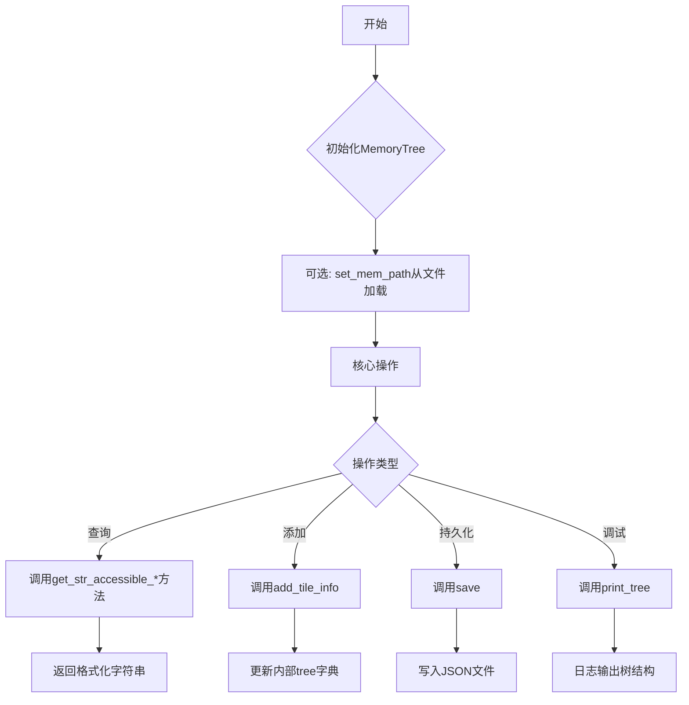
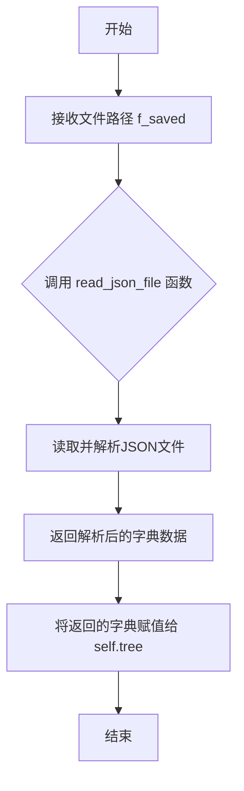
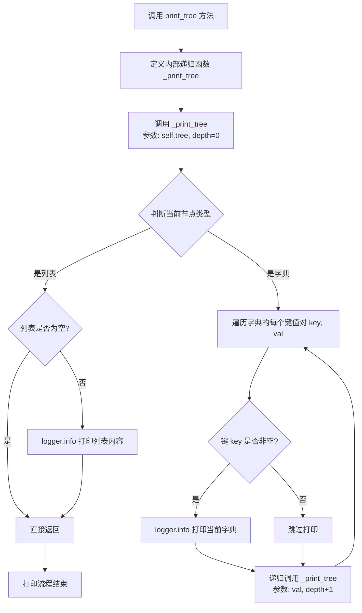

# `.\MetaGPT\metagpt\ext\stanford_town\memory\spatial_memory.py` 详细设计文档

该文件定义了 MemoryTree 类，作为智能体的空间记忆系统，用于在游戏世界中组织和查询层级化的位置信息（世界-区域-场景-游戏对象），支持从文件加载/保存记忆树、添加新的位置信息，并提供多种查询方法来获取可访问位置的字符串表示。

## 整体流程



## 类结构

```
MemoryTree (Pydantic BaseModel)
├── 字段: tree (dict)
├── 方法: set_mem_path
├── 方法: print_tree
├── 方法: save
├── 方法: get_str_accessible_sectors
├── 方法: get_str_accessible_sector_arenas
├── 方法: get_str_accessible_arena_game_objects
└── 方法: add_tile_info
```

## 全局变量及字段


### `MemoryTree.tree`
    
一个嵌套字典，用于存储游戏世界的空间记忆结构，其层级为 world -> sector -> arena -> game_objects。

类型：`dict`
    
    

## 全局函数及方法


### `MemoryTree.set_mem_path`

该方法用于从指定的JSON文件路径加载空间记忆数据，并将其解析为嵌套字典结构，用以初始化或更新MemoryTree实例的`tree`字段。

参数：
-  `f_saved`：`Path`，指向存储空间记忆数据的JSON文件的路径对象。

返回值：`None`，该方法不返回任何值，其作用是将加载的数据直接赋值给实例的`tree`字段。

#### 流程图



#### 带注释源码

```python
def set_mem_path(self, f_saved: Path):
    # 调用工具函数 read_json_file，传入文件路径 f_saved
    # 该函数负责读取文件内容并将其解析为Python字典
    # 将解析得到的字典直接赋值给当前实例的 `tree` 属性
    self.tree = read_json_file(f_saved)
```


### `MemoryTree.print_tree`

该方法用于以树形结构递归打印 `MemoryTree` 实例中存储的空间记忆数据。它通过缩进和前缀符号（`>`）来可视化数据的层级关系，并使用 `logger.info` 输出到日志。

参数：
-   `self`：`MemoryTree`，`MemoryTree` 类的实例，包含要打印的 `tree` 数据。

返回值：`None`，此方法不返回任何值，其作用是将数据打印到日志。

#### 流程图



#### 带注释源码

```python
def print_tree(self) -> None:
    # 定义一个内部递归函数，用于遍历并打印树结构
    def _print_tree(tree, depth):
        # 根据当前深度生成缩进前缀，使用 ' >' 表示层级
        dash = " >" * depth
        # 检查当前节点是否为列表类型
        if isinstance(tree, list):
            # 如果是非空列表，则打印其内容
            if tree:
                logger.info(f"{dash} {tree}")
            # 列表节点没有子节点，直接返回
            return

        # 如果当前节点是字典，则遍历其所有键值对
        for key, val in tree.items():
            # 如果键非空（通常表示一个有效的层级名称），则打印当前字典节点
            if key:
                logger.info(f"{dash} {tree}")
            # 递归处理子节点（值），深度加1
            _print_tree(val, depth + 1)

    # 从根节点（self.tree）和深度0开始递归打印
    _print_tree(self.tree, 0)
```


### `MemoryTree.save`

将 MemoryTree 实例的 `tree` 字段（一个嵌套字典结构）序列化为 JSON 格式，并保存到指定的文件路径。

参数：
-  `out_json`：`Path`，指定 JSON 文件的输出路径。

返回值：`None`，此方法不返回任何值，其作用是将数据写入文件。

#### 流程图

```mermaid
flowchart TD
    A[开始: MemoryTree.save(out_json)] --> B[调用 write_json_file(out_json, self.tree)]
    B --> C[将 self.tree 序列化为 JSON 并写入文件]
    C --> D[结束]
```

#### 带注释源码

```python
def save(self, out_json: Path) -> None:
    # 调用工具函数 write_json_file，将当前 MemoryTree 实例的 tree 字段（一个嵌套字典）
    # 序列化为 JSON 格式，并写入到 out_json 参数指定的文件路径。
    write_json_file(out_json, self.tree)
```


### `MemoryTree.get_str_accessible_sectors`

该方法根据给定的当前世界（`curr_world`）名称，从内存树（`self.tree`）中提取该世界下所有可访问的扇区（sector）名称，并将其连接成一个以逗号和空格分隔的字符串返回。它主要用于为智能体（persona）提供一个可读的、关于其当前所处世界中所有可访问区域的摘要。

参数：

-  `curr_world`：`str`，表示当前智能体所在世界的名称（例如，游戏中的某个地图或区域）。

返回值：`str`，一个由逗号和空格分隔的字符串，列出了指定世界下所有可访问的扇区名称。如果该世界下没有扇区或`curr_world`不存在于内存树中，将返回空字符串。

#### 流程图

```mermaid
flowchart TD
    A[开始] --> B{内存树中是否存在<br>curr_world键?}
    B -- 否 --> C[返回空字符串]
    B -- 是 --> D[获取self.tree[curr_world]的键列表]
    D --> E[将键列表用', '连接成字符串]
    E --> F[返回连接后的字符串]
    C --> G[结束]
    F --> G
```

#### 带注释源码

```python
    def get_str_accessible_sectors(self, curr_world: str) -> str:
        """
        Returns a summary string of all the arenas that the persona can access
        within the current sector.

        Note that there are places a given persona cannot enter. This information
        is provided in the persona sheet. We account for this in this function.

        INPUT
          None
        OUTPUT
          A summary string of all the arenas that the persona can access.
        EXAMPLE STR OUTPUT
          "bedroom, kitchen, dining room, office, bathroom"
        """
        # 从内存树（self.tree）中获取对应curr_world的字典，
        # 提取其所有键（即扇区名），转换为列表。
        # 使用", "将列表中的所有扇区名连接成一个字符串。
        x = ", ".join(list(self.tree[curr_world].keys()))
        # 返回连接后的字符串。
        return x
```


### `MemoryTree.get_str_accessible_sector_arenas`

该方法用于获取并返回一个字符串，该字符串总结了智能体在当前区域（sector）内可以访问的所有竞技场（arenas）。它通过解析传入的`sector`参数，从内存树（`self.tree`）中提取对应区域下的所有竞技场名称，并以逗号分隔的字符串形式返回。

参数：

-  `sector`：`str`，一个表示世界和区域的字符串，格式为`"世界:区域"`（例如：`"Oak Hill College:library"`）。

返回值：`str`，一个由逗号和空格分隔的字符串，列出了指定区域下所有可访问的竞技场名称。如果区域不存在或为空，则返回空字符串`""`。

#### 流程图

```mermaid
flowchart TD
    A[开始: 调用 get_str_accessible_sector_arenas(sector)] --> B{解析 sector 参数};
    B --> C[使用 split(':') 分割字符串];
    C --> D{检查 curr_sector 是否为空?};
    D -- 是 --> E[返回空字符串 ""];
    D -- 否 --> F[从 self.tree[curr_world][curr_sector] 获取所有键];
    F --> G[使用 list(...) 将键转换为列表];
    G --> H[使用 ", ".join(...) 将列表连接成字符串];
    H --> I[返回连接后的字符串];
    E --> J[结束];
    I --> J;
```

#### 带注释源码

```python
    def get_str_accessible_sector_arenas(self, sector: str) -> str:
        """
        Returns a summary string of all the arenas that the persona can access
        within the current sector.

        Note that there are places a given persona cannot enter. This information
        is provided in the persona sheet. We account for this in this function.

        INPUT
          None
        OUTPUT
          A summary string of all the arenas that the persona can access.
        EXAMPLE STR OUTPUT
          "bedroom, kitchen, dining room, office, bathroom"
        """
        # 将输入的`sector`字符串按冒号':'分割成世界（world）和区域（sector）两部分。
        curr_world, curr_sector = sector.split(":")
        # 检查区域部分是否为空。如果为空，则直接返回空字符串。
        if not curr_sector:
            return ""
        # 1. 从内存树中定位到指定世界下的指定区域（self.tree[curr_world][curr_sector]）。
        # 2. 获取该区域字典的所有键（即所有竞技场名称），并转换为列表。
        # 3. 使用逗号和空格（", "）将列表中的所有竞技场名称连接成一个字符串。
        x = ", ".join(list(self.tree[curr_world][curr_sector].keys()))
        # 返回连接好的字符串。
        return x
```


### `MemoryTree.get_str_accessible_arena_game_objects`

该方法用于获取指定游戏竞技场（arena）中所有可访问的游戏对象（game objects）的字符串列表。它通过解析传入的竞技场地址，在内存树（`self.tree`）中查找对应的对象列表，并将其转换为一个用逗号和空格分隔的字符串。如果指定的竞技场不存在或为空，则返回空字符串。方法内部包含异常处理，当按原始大小写查找失败时，会尝试使用小写形式的竞技场名称进行查找，以增强健壮性。

参数：

-  `arena`：`str`，一个表示游戏世界位置的字符串，格式为`"世界:区域:竞技场"`（例如：`"town:main:park"`），用于指定要查询的竞技场。

返回值：`str`，一个由逗号和空格分隔的字符串，列出了指定竞技场中的所有游戏对象（例如：`"phone, charger, bed, nightstand"`）。如果竞技场地址无效或为空，则返回空字符串`""`。

#### 流程图

```mermaid
flowchart TD
    A[开始: 调用 get_str_accessible_arena_game_objects(arena)] --> B{解析 arena 参数<br>curr_world, curr_sector, curr_arena = arena.split(':')}
    B --> C{检查 curr_arena 是否为空?}
    C -- 是 --> D[返回空字符串 ""]
    C -- 否 --> E[尝试从内存树获取对象列表<br>self.tree[curr_world][curr_sector][curr_arena]]
    E --> F{是否发生异常?}
    F -- 是 --> G[尝试使用小写竞技场名获取对象列表<br>self.tree[curr_world][curr_sector][curr_arena.lower()]]
    G --> H[将列表转换为字符串<br>x = ', '.join(list(...))]
    F -- 否 --> H
    H --> I[返回字符串 x]
    D --> J[结束]
    I --> J
```

#### 带注释源码

```python
    def get_str_accessible_arena_game_objects(self, arena: str) -> str:
        """
        Get a str list of all accessible game objects that are in the arena. If
        temp_address is specified, we return the objects that are available in
        that arena, and if not, we return the objects that are in the arena our
        persona is currently in.

        INPUT
          temp_address: optional arena address
        OUTPUT
          str list of all accessible game objects in the gmae arena.
        EXAMPLE STR OUTPUT
          "phone, charger, bed, nightstand"
        """
        # 步骤1: 解析传入的竞技场地址字符串。
        # 格式应为 "世界:区域:竞技场"，例如 "town:main:park"
        curr_world, curr_sector, curr_arena = arena.split(":")

        # 步骤2: 检查解析出的竞技场名称是否为空。如果为空，直接返回空字符串。
        if not curr_arena:
            return ""

        # 步骤3: 尝试从内存树结构中获取该竞技场下的游戏对象列表。
        # 内存树结构为: self.tree[世界][区域][竞技场] -> List[游戏对象]
        try:
            # 使用原始大小写的竞技场名称进行查找
            x = ", ".join(list(self.tree[curr_world][curr_sector][curr_arena]))
        except Exception:
            # 步骤4: 如果上述查找失败（例如键名大小写不匹配），
            # 则尝试使用小写形式的竞技场名称再次查找，以提高代码的容错性。
            x = ", ".join(list(self.tree[curr_world][curr_sector][curr_arena.lower()]))
        # 步骤5: 将找到的游戏对象列表转换为逗号分隔的字符串并返回。
        return x
```


### `MemoryTree.add_tile_info`

该方法用于向空间记忆树中添加一个瓦片（tile）的信息。它根据传入的字典信息，逐级创建或更新内存树中的世界（world）、区域（sector）、场景（arena）层级，并在对应的场景中添加游戏对象（game_object）。该方法确保内存树的数据结构能够反映游戏世界的层级组织。

参数：

-  `tile_info`：`dict`，一个包含瓦片层级信息的字典。预期包含以下键：`world`（世界）、`sector`（区域）、`arena`（场景）、`game_object`（游戏对象）。这些键的值可能为空字符串，表示该层级不存在或不需要创建。

返回值：`None`，该方法不返回任何值，直接修改类的 `tree` 字段。

#### 流程图

```mermaid
flowchart TD
    A[开始: add_tile_info(tile_info)] --> B{检查 world 键值<br>是否非空?};
    B -- 是 --> C{检查 world 是否已存在于 tree 中?};
    B -- 否 --> D;
    C -- 否 --> E[在 tree 中创建 world 键<br>并初始化为空字典];
    C -- 是 --> D;
    E --> D;
    D{检查 sector 键值<br>是否非空?};
    D -- 是 --> F{检查 sector 是否已存在于<br>tree[world] 中?};
    D -- 否 --> G;
    F -- 否 --> H[在 tree[world] 中创建 sector 键<br>并初始化为空字典];
    F -- 是 --> G;
    H --> G;
    G{检查 arena 键值<br>是否非空?};
    G -- 是 --> I{检查 arena 是否已存在于<br>tree[world][sector] 中?};
    G -- 否 --> J;
    I -- 否 --> K[在 tree[world][sector] 中创建 arena 键<br>并初始化为空列表];
    I -- 是 --> J;
    K --> J;
    J{检查 game_object 键值<br>是否非空?};
    J -- 是 --> L{检查 game_object 是否已存在于<br>tree[world][sector][arena] 列表中?};
    J -- 否 --> M[结束];
    L -- 否 --> N[将 game_object 添加到<br>tree[world][sector][arena] 列表中];
    L -- 是 --> M;
    N --> M;
```

#### 带注释源码

```python
def add_tile_info(self, tile_info: dict) -> None:
    # 1. 处理世界（world）层级
    # 如果传入的 tile_info 中 'world' 键的值非空
    if tile_info["world"]:
        # 检查这个 world 是否已经存在于内存树 (self.tree) 中
        if tile_info["world"] not in self.tree:
            # 如果不存在，则在树中创建该 world 键，并将其值初始化为一个空字典，
            # 用于后续存储该世界下的区域（sector）信息。
            self.tree[tile_info["world"]] = {}

    # 2. 处理区域（sector）层级
    # 如果传入的 tile_info 中 'sector' 键的值非空
    if tile_info["sector"]:
        # 检查这个 sector 是否已经存在于对应 world 的字典中
        if tile_info["sector"] not in self.tree[tile_info["world"]]:
            # 如果不存在，则在对应 world 的字典中创建该 sector 键，
            # 并将其值初始化为一个空字典，用于后续存储该区域下的场景（arena）信息。
            self.tree[tile_info["world"]][tile_info["sector"]] = {}

    # 3. 处理场景（arena）层级
    # 如果传入的 tile_info 中 'arena' 键的值非空
    if tile_info["arena"]:
        # 检查这个 arena 是否已经存在于对应 world 和 sector 的字典中
        if tile_info["arena"] not in self.tree[tile_info["world"]][tile_info["sector"]]:
            # 如果不存在，则在对应 world 和 sector 的字典中创建该 arena 键，
            # 并将其值初始化为一个空列表，用于后续存储该场景下的游戏对象（game_object）。
            self.tree[tile_info["world"]][tile_info["sector"]][tile_info["arena"]] = []

    # 4. 处理游戏对象（game_object）层级
    # 如果传入的 tile_info 中 'game_object' 键的值非空
    if tile_info["game_object"]:
        # 检查这个 game_object 是否已经存在于对应 world、sector 和 arena 的列表中
        if tile_info["game_object"] not in self.tree[tile_info["world"]][tile_info["sector"]][tile_info["arena"]]:
            # 如果不存在，则将这个 game_object 添加到对应 arena 的列表中。
            self.tree[tile_info["world"]][tile_info["sector"]][tile_info["arena"]] += [tile_info["game_object"]]
```


## 关键组件


### MemoryTree 类

定义了代理的空间记忆结构，用于在游戏世界中锚定其行为。它通过一个嵌套字典树来组织游戏世界的层级结构（世界 -> 区域 -> 场景 -> 游戏对象），并提供了一系列方法来查询和修改这个记忆树。

### 空间记忆树数据结构

一个嵌套的字典结构，用于分层存储游戏世界的空间信息。其层级为：世界（world） -> 区域（sector） -> 场景（arena） -> 游戏对象（game_object）列表。这种结构清晰地映射了游戏世界的物理或逻辑层次。

### 记忆持久化与加载

通过 `set_mem_path` 和 `save` 方法，结合 `read_json_file` 和 `write_json_file` 工具函数，实现了将内存中的树状结构序列化到JSON文件以及从JSON文件反序列化加载的功能，确保了代理记忆在程序运行间的持久化。

### 空间信息查询接口

提供了一组方法（`get_str_accessible_sectors`, `get_str_accessible_sector_arenas`, `get_str_accessible_arena_game_objects`）来查询代理在当前或指定空间层级（世界、区域、场景）下可以访问的下级元素（区域、场景、游戏对象），并以逗号分隔的字符串形式返回结果，便于自然语言处理或显示。

### 动态记忆更新

通过 `add_tile_info` 方法，支持根据传入的包含 `world`, `sector`, `arena`, `game_object` 键的字典，动态地向记忆树中添加新的层级节点或游戏对象，使得代理的记忆能够随着探索或事件而增长和变化。


## 问题及建议


### 已知问题

-   **`print_tree` 方法存在逻辑错误**：在递归打印字典时，当 `key` 存在时，代码打印的是整个当前层级的字典 (`tree`)，而不是当前键 (`key`)。这会导致输出信息冗余且不准确，例如会重复打印父节点内容。
-   **`get_str_accessible_arena_game_objects` 方法存在潜在的 `KeyError` 风险**：该方法在尝试访问 `self.tree[curr_world][curr_sector][curr_arena]` 失败后，会尝试访问小写版本 `self.tree[curr_world][curr_sector][curr_arena.lower()]`。然而，如果小写版本也不存在，程序会抛出未处理的 `KeyError` 异常，导致程序崩溃。
-   **`add_tile_info` 方法逻辑不健壮**：该方法在向嵌套字典中添加键时，没有检查上级键是否存在。例如，当 `tile_info["sector"]` 存在但 `tile_info["world"]` 不存在时，代码 `self.tree[tile_info["world"]][tile_info["sector"]]` 会引发 `KeyError`。虽然前面的 `if` 语句旨在创建这些键，但逻辑顺序和条件判断不够严谨，容易在并发或异常数据输入时出错。
-   **数据结构缺乏类型安全与验证**：`tree` 字段被定义为 `dict` 类型，但其内部嵌套结构（`world -> sector -> arena -> list[game_object]`）没有通过 Pydantic 模型进行严格定义和验证。这可能导致存入不符合预期的数据结构，增加运行时错误的风险。
-   **异常处理不完整**：除了上述的 `KeyError` 外，代码中（如 `get_str_accessible_sector_arenas`）对输入字符串进行 `split(":")` 操作时，如果格式不符合预期（例如不包含冒号），会引发 `ValueError`，当前代码未处理此异常。

### 优化建议

-   **修复 `print_tree` 方法**：修改递归打印逻辑，确保正确打印每个键及其对应的子树结构。例如，将 `logger.info(f"{dash} {tree}")` 改为 `logger.info(f"{dash} {key}")` 来打印当前键名。
-   **增强 `get_str_accessible_arena_game_objects` 的健壮性**：使用 `dict.get()` 方法进行安全访问，或使用 `try-except` 块捕获 `KeyError` 并返回空字符串或默认值，避免程序因数据缺失而中断。
-   **重构 `add_tile_info` 方法**：使用 `collections.defaultdict` 或递归地使用 `setdefault` 方法来简化嵌套字典的创建逻辑，确保在添加下级节点前其所有父节点都已存在。这可以使代码更简洁、健壮。
-   **使用嵌套的 Pydantic 模型定义数据结构**：为 `World`, `Sector`, `Arena` 等层级创建对应的 Pydantic 模型，并将 `tree` 字段的类型定义为 `Dict[str, WorldModel]`。这样可以获得自动的数据验证、IDE 类型提示和更清晰的文档。
-   **增加输入验证和异常处理**：在 `get_str_accessible_sector_arenas` 和 `get_str_accessible_arena_game_objects` 等方法中，对输入参数进行验证（例如检查 `split` 后的列表长度），并使用更精确的异常处理（如 `try-except` 包裹可能出错的部分），返回有意义的默认值或抛出更具描述性的自定义异常。
-   **考虑性能优化**：当前 `add_tile_info` 方法中，使用 `list += [item]` 来向列表添加元素，效率较低。如果 `game_object` 列表可能很大或操作频繁，建议使用 `append()` 方法。此外，对于频繁的“检查键是否存在并创建”模式，使用 `setdefault` 是更高效的选择。
-   **提高代码可测试性**：将类的方法（特别是那些操作内部 `tree` 数据的方法）与具体的 I/O 操作（如 `read_json_file`, `write_json_file`, `logger`）解耦，可以通过依赖注入（如传入文件操作函数和日志记录器）来方便单元测试。


## 其它


### 设计目标与约束

本模块旨在为智能体（Agent）提供一个结构化的空间记忆系统，用于在游戏世界中定位和导航。其核心设计目标是将游戏世界的物理空间（世界、区域、场景、游戏对象）组织成层次化的树状结构，并对外提供查询和修改接口。主要约束包括：1. 内存结构需支持从外部JSON文件快速加载和持久化；2. 查询接口需返回易于自然语言处理的字符串格式；3. 数据结构需灵活，以容纳不同粒度的空间信息（从世界到单个游戏对象）。

### 错误处理与异常设计

当前代码的错误处理较为基础。在`get_str_accessible_arena_game_objects`方法中，尝试访问小写形式的场景名称是一种容错机制，但未明确说明其适用场景，且仅捕获了通用的`Exception`，不利于问题定位。`add_tile_info`方法在逐级构建树时，未对输入的`tile_info`字典的键进行有效性校验，可能导致`KeyError`。整体缺乏对非法输入（如空值、错误格式的地址字符串）和边界条件（如访问不存在的路径）的防御性编程和明确的异常抛出机制。

### 数据流与状态机

数据流起始于通过`set_mem_path`从JSON文件加载初始记忆树，或通过`add_tile_info`方法增量添加空间信息。记忆树（`self.tree`）是核心状态，其结构为嵌套字典：`世界 -> 区域 -> 场景 -> [游戏对象列表]`。查询方法（`get_str_accessible_sectors`等）是纯函数，仅读取该状态并返回格式化字符串，不产生副作用。`add_tile_info`和`save`是唯一修改状态的方法。整个模块没有复杂的状态转换逻辑，是一个被动的数据存储和查询服务。

### 外部依赖与接口契约

1.  **文件I/O依赖**：依赖`metagpt.utils.common`中的`read_json_file`和`write_json_file`函数。契约是传入有效的`Path`对象，函数负责处理具体的文件读写和JSON解析/序列化。
2.  **数据模型依赖**：继承自`pydantic.BaseModel`，依赖于Pydantic库进行数据验证和序列化（尽管当前未显式定义字段验证规则）。
3.  **日志依赖**：依赖`metagpt.logs.logger`进行信息输出。
4.  **接口契约**：
    *   输入：`add_tile_info`方法期望一个包含`world`, `sector`, `arena`, `game_object`键的字典。`get_str_accessible_*`方法期望特定格式的地址字符串（如`"世界:区域:场景"`）。
    *   输出：查询方法返回以逗号和空格分隔的英文名称字符串。`print_tree`输出到日志。`save`将状态写入文件。

### 性能考量

1.  **时间复杂度**：查询方法（`get_str_accessible_*`）的时间复杂度为O(1)，因为是通过字典键进行直接访问。`add_tile_info`方法在最坏情况下（需要创建所有中间节点）的时间复杂度为O(d)，其中d为地址深度（通常为4），性能良好。
2.  **空间复杂度**：记忆树在内存中以嵌套字典形式存储。其空间占用与游戏世界的复杂度和游戏对象的数量成正比。对于超大型开放世界，可能需要考虑更高效的数据结构或持久化策略。
3.  **I/O性能**：`set_mem_path`和`save`涉及文件读写，其性能受磁盘速度影响。对于频繁的自动保存，需注意可能成为瓶颈。

### 测试策略建议

1.  **单元测试**：
    *   测试`add_tile_info`：验证能正确创建各级节点并添加游戏对象，测试重复添加、部分信息为空的情况。
    *   测试`get_str_accessible_*`：验证给定正确地址能返回预期字符串，测试地址不存在、地址格式错误、地址部分为空时的行为。
    *   测试`set_mem_path`和`save`：验证能正确加载和保存JSON文件，保持数据一致性。
2.  **集成测试**：与调用此模块的智能体系统集成，测试在模拟游戏流程中，空间记忆的更新和查询是否符合预期。
3.  **数据验证测试**：验证从文件加载的JSON数据是否符合预期的树形结构。

### 安全性与合规性

当前模块不直接处理用户输入或敏感数据，主要风险在于：
1.  **反序列化风险**：`read_json_file`加载外部文件，如果文件来源不可信，可能存在恶意JSON数据导致的安全问题。建议在可信环境中使用。
2.  **内存耗尽**：如果加载的JSON文件异常巨大，可能导致内存消耗过高。可考虑添加文件大小检查或流式解析。
3.  **日志信息泄露**：`print_tree`方法会将整个记忆树结构打印到日志，在生产环境中可能需要控制日志级别或对输出进行脱敏。

### 部署与运维

1.  **配置**：记忆树数据文件（JSON）的路径需要通过`set_mem_path`在运行时指定，这提供了灵活性。
2.  **监控**：可监控`add_tile_info`的调用频率和记忆树的大小增长，以了解游戏世界的探索进度。
3.  **备份**：由于`save`方法会覆盖目标文件，建议在重要操作前对记忆树文件进行备份。
4.  **版本兼容性**：如果记忆树的数据结构（JSON模式）发生变更，需要提供数据迁移脚本或版本管理机制。


    