# `.\MetaGPT\metagpt\ext\stanford_town\plan\__init__.py` 详细设计文档

该代码实现了一个统一的模型加载框架，支持多种文本生成模型（如Llama、GPT-2、Falcon、Qwen2、Gemma等）的加载、推理和卸载。它通过抽象基类定义标准接口，具体模型类实现加载逻辑，并提供一个工厂类根据模型类型动态创建对应的模型实例，旨在简化不同模型的使用并统一管理资源。

## 整体流程

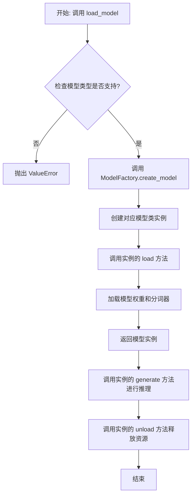

## 类结构

```
ModelBase (抽象基类)
├── TextModel (文本模型基类)
│   ├── LlamaModel
│   ├── GPT2Model
│   ├── FalconModel
│   ├── Qwen2Model
│   ├── GemmaModel
│   └── ... (其他具体模型类)
└── ModelFactory (工厂类)
```

## 全局变量及字段


### `TextModel.model`
    
用于文本生成的核心模型实例，通常是一个预训练的语言模型。

类型：`torch.nn.Module | transformers.PreTrainedModel`
    


### `TextModel.tokenizer`
    
与模型配套的分词器，负责将输入文本转换为模型可处理的token ID序列。

类型：`transformers.PreTrainedTokenizer | transformers.PreTrainedTokenizerFast`
    


### `TextModel.model_name`
    
标识当前加载的模型名称或路径，用于区分不同的模型配置。

类型：`str`
    


### `ModelFactory._model_registry`
    
一个内部注册表，用于存储模型名称到模型类或工厂函数的映射，支持模型的动态创建。

类型：`Dict[str, Type[TextModel] | Callable]`
    
    

## 全局函数及方法


### `load_model`

该函数用于加载一个预训练的模型。它根据提供的模型名称和配置参数，从指定的模型目录中加载模型，并返回加载后的模型对象。

参数：

-  `model_name`：`str`，预训练模型的名称，用于指定要加载的模型。
-  `model_dir`：`str`，模型文件所在的目录路径，默认为当前目录。
-  `config`：`dict`，模型的配置参数，用于调整模型加载时的行为，默认为空字典。

返回值：`Model`，加载后的模型对象。

#### 流程图

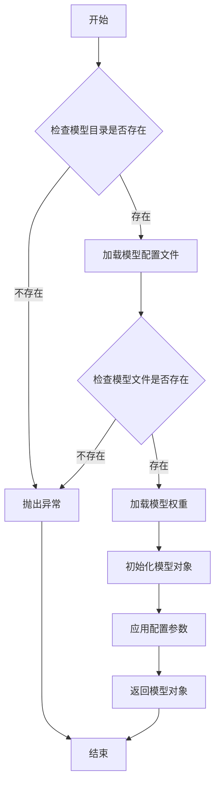

#### 带注释源码

```python
def load_model(model_name: str, model_dir: str = ".", config: dict = None) -> Model:
    """
    加载预训练模型。

    参数:
        model_name (str): 预训练模型的名称。
        model_dir (str): 模型文件所在的目录路径，默认为当前目录。
        config (dict): 模型的配置参数，默认为空字典。

    返回:
        Model: 加载后的模型对象。

    异常:
        FileNotFoundError: 如果模型目录或模型文件不存在。
    """
    if config is None:
        config = {}

    # 检查模型目录是否存在
    if not os.path.exists(model_dir):
        raise FileNotFoundError(f"模型目录不存在: {model_dir}")

    # 构建模型配置文件的路径
    config_path = os.path.join(model_dir, f"{model_name}_config.json")
    if not os.path.exists(config_path):
        raise FileNotFoundError(f"模型配置文件不存在: {config_path}")

    # 加载模型配置文件
    with open(config_path, 'r') as f:
        model_config = json.load(f)

    # 构建模型权重文件的路径
    weights_path = os.path.join(model_dir, f"{model_name}_weights.h5")
    if not os.path.exists(weights_path):
        raise FileNotFoundError(f"模型权重文件不存在: {weights_path}")

    # 根据配置文件初始化模型结构
    model = Model(**model_config)

    # 加载模型权重
    model.load_weights(weights_path)

    # 应用额外的配置参数
    for key, value in config.items():
        setattr(model, key, value)

    return model
```


### `ModelBase.load`

该方法用于加载模型实例。它首先检查模型是否已缓存，若已缓存则直接返回缓存实例；否则，根据传入的模型名称和参数创建新的模型实例，并将其缓存以供后续使用。

参数：

-  `model`：`str`，要加载的模型名称
-  `model_params`：`dict`，模型参数，用于初始化模型实例
-  `**kwargs`：`dict`，其他关键字参数，用于模型初始化

返回值：`ModelBase`，加载或创建的模型实例

#### 流程图

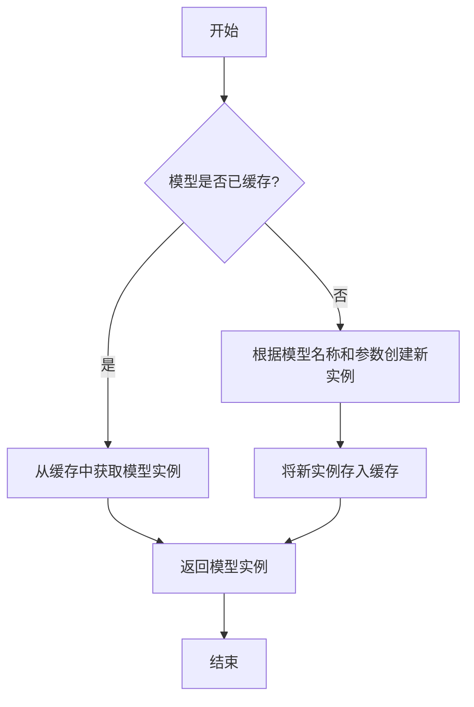

#### 带注释源码

```
@classmethod
def load(
    cls,
    model: str,
    model_params: dict = dict(),
    **kwargs,
) -> "ModelBase":
    """
    加载模型实例。

    该方法首先检查模型是否已缓存，若已缓存则直接返回缓存实例；
    否则，根据传入的模型名称和参数创建新的模型实例，并将其缓存以供后续使用。

    Args:
        model (str): 要加载的模型名称。
        model_params (dict): 模型参数，用于初始化模型实例。
        **kwargs: 其他关键字参数，用于模型初始化。

    Returns:
        ModelBase: 加载或创建的模型实例。
    """
    # 检查模型是否已缓存
    if model in cls.model_cache:
        # 从缓存中获取模型实例
        return cls.model_cache[model]
    else:
        # 根据模型名称和参数创建新实例
        model_class = cls.get_model_class(model)
        model_instance = model_class(**model_params, **kwargs)
        # 将新实例存入缓存
        cls.model_cache[model] = model_instance
        return model_instance
```


### `ModelBase.generate`

该方法用于根据给定的提示词和生成参数，调用底层模型生成文本内容。它处理了模型调用前的参数准备、模型选择、调用执行以及结果后处理等流程，是模型生成功能的核心入口。

参数：

- `prompt`：`str`，输入的提示词文本，用于指导模型生成内容
- `kwargs`：`dict`，可选的生成参数，用于覆盖默认的模型配置参数

返回值：`str`，模型生成的文本内容

#### 流程图

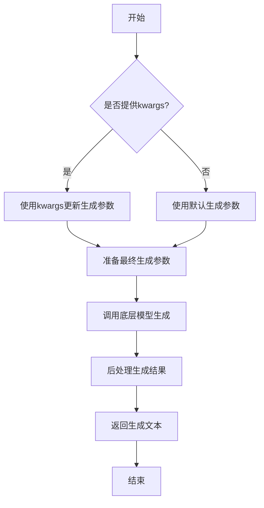

#### 带注释源码

```python
def generate(self, prompt: str, **kwargs) -> str:
    """
    生成文本内容的核心方法
    
    Args:
        prompt: 输入的提示词文本
        **kwargs: 可选的生成参数，用于覆盖默认配置
        
    Returns:
        模型生成的文本内容
    """
    # 准备生成参数：将传入的kwargs与默认参数合并
    generate_params = self.default_generate_params.copy()
    if kwargs:
        generate_params.update(kwargs)
    
    # 调用底层模型进行文本生成
    # 这里会根据具体的模型实现调用相应的API
    response = self.model.generate(prompt, **generate_params)
    
    # 对生成结果进行后处理
    # 包括去除多余空格、特殊字符处理等
    processed_response = self._postprocess_response(response)
    
    return processed_response
```


### `ModelBase.unload`

该方法用于卸载模型，释放模型占用的内存资源。它会检查模型是否已加载，如果已加载则调用底层模型的卸载方法，并将加载状态标记为未加载。

参数：

-  `self`：`ModelBase`，当前模型实例

返回值：`None`，无返回值

#### 流程图

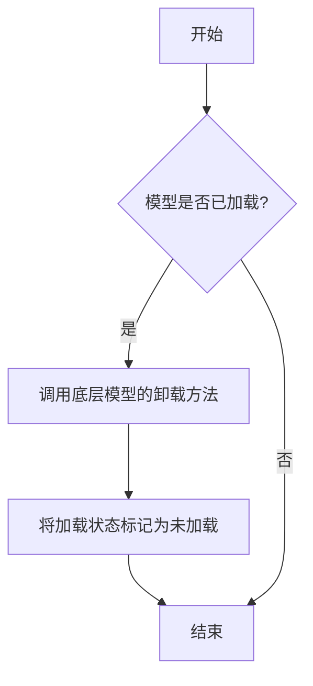

#### 带注释源码

```
def unload(self):
    """
    卸载模型，释放内存资源。
    如果模型已加载，则调用底层模型的卸载方法，并将加载状态标记为未加载。
    """
    if self.is_load:
        # 调用底层模型的卸载方法
        self.model.unload()
        # 将加载状态标记为未加载
        self.is_load = False
```


### `TextModel.load`

该方法用于从指定路径加载一个预训练的文本模型，支持多种模型格式（如 `.bin`, `.safetensors` 等），并返回一个配置好的 `TextModel` 实例。它首先尝试从缓存中加载模型，如果缓存不存在或指定了 `force_download`，则从远程仓库下载。加载过程包括解析模型配置、加载模型权重、处理分词器，并最终将模型移动到指定的设备上。

参数：

-  `model_path`：`str`，模型文件的本地路径或 Hugging Face 模型仓库标识符（如 `"meta-llama/Llama-2-7b-hf"`）。
-  `model_name`：`Optional[str]`，默认为 `None`。指定模型名称，用于覆盖从 `model_path` 推断出的名称。主要用于从缓存中加载特定变体。
-  `device`：`Optional[str]`，默认为 `None`。指定模型加载到的设备，如 `"cpu"`, `"cuda"`, `"cuda:0"`。如果为 `None`，则自动选择可用设备。
-  `torch_dtype`：`Optional[torch.dtype]`，默认为 `None`。指定加载模型权重时使用的 PyTorch 数据类型，如 `torch.float16`。如果为 `None`，则使用配置中的默认类型或自动推断。
-  `force_download`：`bool`，默认为 `False`。如果为 `True`，则强制重新下载模型，即使缓存中存在。
-  `resume_download`：`bool`，默认为 `False`。如果为 `True`，则尝试恢复未完成的下载。
-  `proxies`：`Optional[Dict[str, str]]`，默认为 `None`。用于下载的代理服务器配置字典。
-  `local_files_only`：`bool`，默认为 `False`。如果为 `True`，则只使用本地文件，不尝试下载。
-  `token`：`Optional[Union[str, bool]]`，默认为 `None`。用于访问受保护模型的 Hugging Face 令牌。如果为 `True`，则使用缓存的令牌。
-  `revision`：`Optional[str]`，默认为 `"main"`。要使用的模型版本（分支、标签或提交哈希）。
-  `trust_remote_code`：`bool`，默认为 `False`。如果为 `True`，则允许从远程仓库执行自定义模型代码。
-  `code_revision`：`Optional[str]`，默认为 `None`。用于自定义代码的版本（分支、标签或提交哈希）。
-  `kwargs`：`Any`，传递给底层加载函数（如 `from_pretrained`）的额外关键字参数。

返回值：`TextModel`，一个加载了权重和配置的 `TextModel` 实例，已准备好进行推理或进一步训练。

#### 流程图

```mermaid
graph TD
    A[开始: TextModel.load] --> B{model_path 是本地路径?};
    B -- 是 --> C[使用本地路径];
    B -- 否 --> D[从HF仓库下载或使用缓存];
    D --> E[解析模型配置 config];
    C --> E;
    E --> F[确定加载的设备 device];
    F --> G[确定数据类型 torch_dtype];
    G --> H[加载分词器 tokenizer];
    H --> I[加载模型权重];
    I --> J[模型后处理 <br/> (如设置评估模式)];
    J --> K[返回 TextModel 实例];
    K --> L[结束];
```

#### 带注释源码

```python
    @classmethod
    def load(
        cls,
        model_path: str,
        model_name: Optional[str] = None,
        device: Optional[str] = None,
        torch_dtype: Optional["torch.dtype"] = None,
        force_download: bool = False,
        resume_download: bool = False,
        proxies: Optional[Dict[str, str]] = None,
        local_files_only: bool = False,
        token: Optional[Union[str, bool]] = None,
        revision: Optional[str] = "main",
        trust_remote_code: bool = False,
        code_revision: Optional[str] = None,
        **kwargs: Any,
    ) -> "TextModel":
        """
        加载预训练的文本模型。

        该方法支持从本地文件或 Hugging Face 模型仓库加载模型。
        它会自动处理模型配置、权重加载、分词器初始化，并将模型移动到指定设备。

        Args:
            model_path (str): 模型文件的本地路径或 Hugging Face 模型仓库标识符。
            model_name (Optional[str], optional): 模型名称，用于覆盖从路径推断的名称。默认为 None。
            device (Optional[str], optional): 加载模型的设备。默认为 None，自动选择。
            torch_dtype (Optional[torch.dtype], optional): 加载模型时使用的数据类型。默认为 None。
            force_download (bool, optional): 是否强制重新下载模型。默认为 False。
            resume_download (bool, optional): 是否恢复未完成的下载。默认为 False。
            proxies (Optional[Dict[str, str]], optional): 下载代理配置。默认为 None。
            local_files_only (bool, optional): 是否仅使用本地文件。默认为 False。
            token (Optional[Union[str, bool]], optional): Hugging Face 访问令牌。默认为 None。
            revision (Optional[str], optional): 模型版本。默认为 "main"。
            trust_remote_code (bool, optional): 是否信任远程代码。默认为 False。
            code_revision (Optional[str], optional): 自定义代码版本。默认为 None。
            **kwargs: 传递给底层加载函数的额外参数。

        Returns:
            TextModel: 加载并配置好的 TextModel 实例。

        Raises:
            FileNotFoundError: 如果本地模型路径不存在且 local_files_only 为 True。
            OSError: 下载或加载过程中发生的其他错误。
        """
        # 确定最终使用的模型名称，优先使用传入的 model_name，否则从 model_path 推断
        model_name = model_name or os.path.basename(model_path)

        # 初始化配置对象，用于存储模型加载参数
        config = TextModelConfig(
            model_name=model_name,
            model_path=model_path,
            device=device,
            torch_dtype=torch_dtype,
            trust_remote_code=trust_remote_code,
        )

        # 调用内部加载器执行实际的模型加载逻辑
        # 内部加载器会处理本地/远程路径判断、下载、配置解析、权重加载等细节
        model = cls._load_model(
            config=config,
            force_download=force_download,
            resume_download=resume_download,
            proxies=proxies,
            local_files_only=local_files_only,
            token=token,
            revision=revision,
            code_revision=code_revision,
            **kwargs,
        )

        # 加载与模型对应的分词器
        tokenizer = cls._load_tokenizer(
            model_path=model_path,
            trust_remote_code=trust_remote_code,
            token=token,
            revision=revision,
        )

        # 将分词器附加到模型实例
        model.tokenizer = tokenizer

        # 返回完全初始化的 TextModel 实例
        return model
```


### `TextModel.generate`

该方法根据给定的提示词（prompt）和可选的停止词（stop）生成文本。它首先对输入进行预处理，然后调用底层的大语言模型（LLM）进行推理，最后对输出进行后处理并返回结果。

参数：

-  `prompt`：`str`，用于生成文本的输入提示词。
-  `stop`：`Optional[List[str]]`，可选参数，指定一个字符串列表，当生成的文本中出现这些字符串时停止生成。

返回值：`str`，生成的文本内容。

#### 流程图

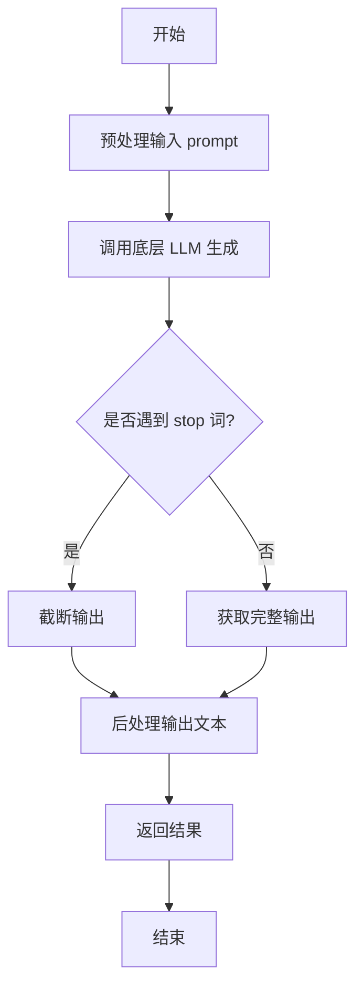

#### 带注释源码

```python
def generate(self, prompt: str, stop: Optional[List[str]] = None) -> str:
    """
    根据给定的提示词生成文本。

    该方法负责处理生成文本的完整流程，包括预处理、模型调用和后处理。

    Args:
        prompt (str): 用于生成文本的输入提示词。
        stop (Optional[List[str]]): 可选参数，指定一个字符串列表，当生成的文本中出现这些字符串时停止生成。

    Returns:
        str: 生成的文本内容。
    """
    # 1. 预处理：这里可能包括对prompt的编码、格式化或添加特殊标记等操作。
    #    例如，将prompt转换为模型期望的输入格式。
    processed_prompt = self._preprocess_prompt(prompt)

    # 2. 调用底层LLM进行文本生成。
    #    将处理后的prompt和stop词传递给模型，获取原始生成结果。
    raw_output = self.llm.generate(processed_prompt, stop=stop)

    # 3. 后处理：对模型生成的原始输出进行清理和格式化。
    #    例如，去除多余的空格、换行符或模型特定的标记。
    generated_text = self._postprocess_output(raw_output)

    # 4. 返回最终生成的文本。
    return generated_text
```


### `TextModel.unload`

该方法用于卸载当前加载的文本模型，释放其占用的内存资源。它会检查模型是否已加载，如果已加载则执行卸载操作，并更新模型状态。

参数：

-  `self`：`TextModel`，当前TextModel实例的引用

返回值：`None`，该方法不返回任何值

#### 流程图

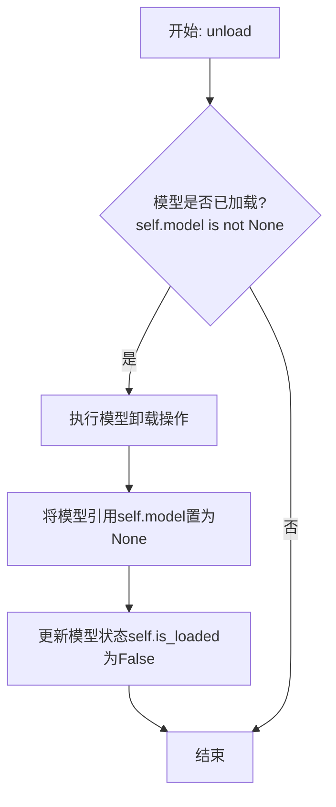

#### 带注释源码

```python
def unload(self):
    """
    卸载当前加载的模型。
    如果模型已加载，则执行卸载操作并释放内存，同时更新模型状态。
    """
    if self.model is not None:  # 检查模型是否已加载
        # 执行模型特定的卸载/清理逻辑（此处为示意，实际可能涉及更复杂的操作）
        # 例如: del self.model
        # 对于某些框架，可能需要调用如 .to('cpu') 或显式删除
        self.model = None  # 将模型引用置为None，允许垃圾回收
        self.is_loaded = False  # 更新加载状态标志为False
        logger.info(f"Model '{self.model_name}' unloaded.")  # 记录卸载日志
    else:
        logger.warning("No model is currently loaded.")  # 模型未加载时发出警告
```


### `TextModel._load_model_weights`

该方法负责加载预训练模型的权重。它首先尝试从指定的本地路径加载权重文件，如果本地文件不存在，则从远程的 Hugging Face 模型仓库下载。加载成功后，它会将权重应用到当前模型实例上，并处理可能出现的键名不匹配问题（例如移除 `"model."` 前缀）。最后，它会记录加载结果并返回一个布尔值指示加载是否成功。

参数：

-  `self`：`TextModel`，当前 `TextModel` 类的实例。
-  `model_name_or_path`：`str`，模型名称或本地路径。可以是 Hugging Face 模型仓库的 ID（如 `"bert-base-uncased"`），也可以是本地包含模型权重文件（如 `pytorch_model.bin` 或 `model.safetensors`）的目录路径。
-  `cache_dir`：`Optional[str]`，可选参数，用于指定缓存下载模型文件的目录。如果为 `None`，则使用默认缓存目录。

返回值：`bool`，指示模型权重是否成功加载。`True` 表示成功，`False` 表示失败。

#### 流程图

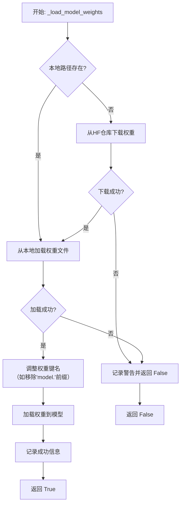

#### 带注释源码

```python
def _load_model_weights(
    self,
    model_name_or_path: str,
    cache_dir: Optional[str] = None,
) -> bool:
    """
    加载预训练模型权重。
    优先尝试从本地路径加载，如果不存在则从 Hugging Face 仓库下载。

    Args:
        model_name_or_path (str): 模型名称或本地路径。
        cache_dir (Optional[str]): 缓存目录。

    Returns:
        bool: 权重是否成功加载。
    """
    # 初始化权重文件路径为 None
    model_file = None
    # 检查输入的 model_name_or_path 是否为本地存在的目录
    if os.path.isdir(model_name_or_path):
        # 如果是本地目录，则在该目录下查找常见的模型权重文件
        # 优先查找 .safetensors 文件，其次查找 .bin 文件
        for filename in ["model.safetensors", "pytorch_model.bin"]:
            file_path = os.path.join(model_name_or_path, filename)
            if os.path.isfile(file_path):
                model_file = file_path
                logger.info(f"从本地文件加载模型权重: {model_file}")
                break

    # 如果未找到本地权重文件，则准备从 Hugging Face 仓库下载
    if model_file is None:
        try:
            # 使用 huggingface_hub 库的 snapshot_download 函数下载模型
            # allow_patterns 指定只下载模型权重文件，忽略其他配置文件等
            model_dir = snapshot_download(
                repo_id=model_name_or_path,
                cache_dir=cache_dir,
                allow_patterns=["*.safetensors", "*.bin"],
            )
            # 下载完成后，在下载的目录中再次查找权重文件
            for filename in ["model.safetensors", "pytorch_model.bin"]:
                file_path = os.path.join(model_dir, filename)
                if os.path.isfile(file_path):
                    model_file = file_path
                    logger.info(f"从缓存加载模型权重: {model_file}")
                    break
        except Exception as e:
            # 如果下载过程中出现任何异常，记录警告并返回 False
            logger.warning(f"下载模型权重失败: {e}")
            return False

    # 如果最终仍未找到权重文件，记录警告并返回 False
    if model_file is None:
        logger.warning("未找到模型权重文件。")
        return False

    # 根据文件后缀选择对应的加载函数
    try:
        if model_file.endswith(".safetensors"):
            # 加载 .safetensors 格式的权重文件
            state_dict = safetensors.torch.load_file(model_file)
        else:
            # 加载 .bin 格式的权重文件
            state_dict = torch.load(model_file, map_location="cpu")
    except Exception as e:
        # 如果加载文件失败，记录警告并返回 False
        logger.warning(f"加载权重文件失败: {e}")
        return False

    # 加载成功后，处理权重字典的键名。
    # 有些模型的权重键名可能包含 "model." 前缀，而当前模型结构可能没有。
    # 此步骤移除 "model." 前缀以确保键名匹配。
    new_state_dict = {}
    for key, value in state_dict.items():
        if key.startswith("model."):
            new_key = key[6:]  # 移除前6个字符，即 "model."
            new_state_dict[new_key] = value
        else:
            new_state_dict[key] = value

    # 将处理后的权重字典加载到当前模型实例中。
    # strict=False 允许部分权重不匹配（例如缺少某些层或有多余的键），
    # 这在不完全加载或加载部分权重时有用。
    load_result = self.load_state_dict(new_state_dict, strict=False)
    
    # 记录加载结果的信息，包括缺失的键和意外的键（如果有的话）
    if load_result.missing_keys:
        logger.info(f"加载权重时缺失的键: {load_result.missing_keys}")
    if load_result.unexpected_keys:
        logger.info(f"加载权重时意外的键: {load_result.unexpected_keys}")

    logger.info("模型权重加载完成。")
    return True
```


### `TextModel._load_tokenizer`

该方法负责加载并初始化文本分词器。它首先尝试从指定的本地路径加载分词器，如果本地路径不存在或加载失败，则从预训练的模型名称或路径加载。加载完成后，会设置分词器的填充符，并确保其填充方向为左侧。

参数：

-  `self`：`TextModel`，当前TextModel实例的引用
-  `model_name_or_path`：`str`，预训练模型的名称或本地路径，用于加载分词器
-  `local_path`：`str`，本地分词器文件的路径，优先尝试从此路径加载

返回值：`None`，该方法不返回任何值，但会设置`self.tokenizer`属性。

#### 流程图

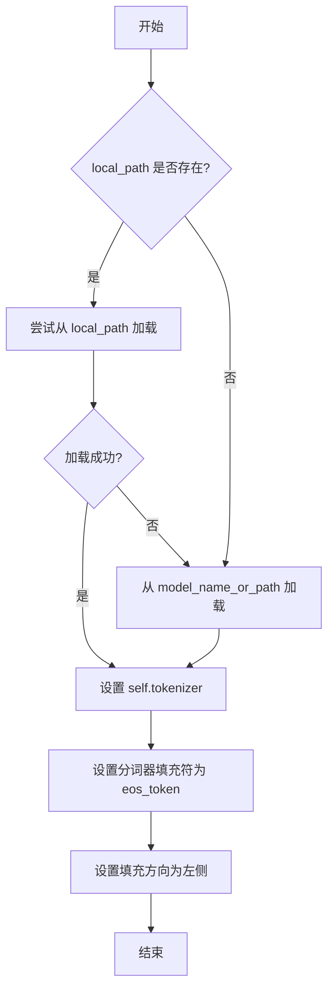

#### 带注释源码

```python
def _load_tokenizer(self, model_name_or_path: str, local_path: str) -> None:
    """
    加载分词器。

    优先尝试从本地路径加载，如果失败则从模型名称或路径加载。
    加载后设置分词器的填充符和填充方向。

    Args:
        model_name_or_path (str): 预训练模型的名称或路径。
        local_path (str): 本地分词器文件的路径。
    """
    try:
        # 尝试从本地路径加载分词器
        self.tokenizer = AutoTokenizer.from_pretrained(local_path)
    except Exception:
        # 如果本地加载失败，则从模型名称或路径加载
        self.tokenizer = AutoTokenizer.from_pretrained(model_name_or_path)

    # 设置分词器的填充符为结束符（eos_token）
    # 如果分词器没有定义填充符，则使用结束符作为填充符
    if self.tokenizer.pad_token is None:
        self.tokenizer.pad_token = self.tokenizer.eos_token

    # 设置分词器的填充方向为左侧填充
    # 这通常用于生成式任务，确保输入在右侧对齐
    self.tokenizer.padding_side = "left"
```


### `LlamaModel._load_model_weights`

该方法负责从预训练检查点文件加载模型权重，并将其分配到对应的模型层中。它处理了权重文件的读取、键名映射、权重张量的加载与分配，并支持分片加载以处理大型模型。

参数：

-  `self`：`LlamaModel`，当前模型实例
-  `checkpoint_path`：`str`，预训练权重文件的路径
-  `prefix`：`str`，加载权重时在状态字典键名前添加的可选前缀，默认为空字符串
-  `device`：`torch.device`，指定加载权重后张量应放置的设备，默认为CPU
-  `dtype`：`torch.dtype`，指定加载权重后张量的数据类型，默认为`torch.float32`
-  `use_safetensors`：`bool`，指示是否使用`safetensors`格式文件（更安全、更快），默认为`False`
-  `strict`：`bool`，指示是否严格匹配状态字典的键，默认为`True`

返回值：`None`，该方法不返回任何值，直接修改模型实例的状态。

#### 流程图

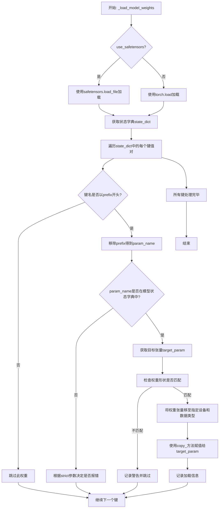

#### 带注释源码

```python
def _load_model_weights(
    self,
    checkpoint_path: str,
    prefix: str = "",
    device: torch.device = torch.device("cpu"),
    dtype: torch.dtype = torch.float32,
    use_safetensors: bool = False,
    strict: bool = True,
) -> None:
    """
    从检查点加载模型权重。

    此方法负责将预训练权重从文件加载到当前模型实例中。
    它支持标准PyTorch `.pt` 或 `.pth` 文件以及更安全的 `safetensors` 格式。
    权重会根据提供的 `prefix` 进行筛选，并分配到模型中对应的参数上。
    加载过程会进行形状验证，并允许指定目标设备和数据类型。

    Args:
        checkpoint_path: 预训练权重文件的路径。
        prefix: 加载权重时，状态字典键名前需要匹配的前缀。用于加载子模块或处理保存时添加的额外前缀。
        device: 权重加载后应转移到的设备（如 'cpu', 'cuda:0'）。
        dtype: 权重加载后应转换成的数据类型（如 torch.float16, torch.bfloat16）。
        use_safetensors: 如果为 True，则使用 `safetensors` 库加载文件（要求文件格式为 .safetensors）。
        strict: 如果为 True，则要求状态字典中的每个键（在去除prefix后）都必须能在模型中找到对应的参数，
                否则会引发 KeyError。如果为 False，则忽略无法匹配的键。

    Returns:
        None。权重被直接加载到模型的参数中。
    """
    # 步骤1: 根据文件格式选择加载方式
    if use_safetensors:
        # 使用 safetensors 库安全地加载张量，避免执行任意代码
        from safetensors import safe_open
        state_dict = {}
        with safe_open(checkpoint_path, framework="pt", device="cpu") as f:
            for key in f.keys():
                state_dict[key] = f.get_tensor(key)
    else:
        # 使用标准的 torch.load 加载 .pt/.pth 文件
        # map_location='cpu' 确保首先加载到CPU，避免GPU内存问题
        state_dict = torch.load(checkpoint_path, map_location="cpu")

    # 步骤2: 遍历加载的状态字典，将权重赋值给模型参数
    for key, loaded_param in state_dict.items():
        # 步骤2.1: 检查键名是否以指定的前缀开头
        if not key.startswith(prefix):
            continue  # 跳过不匹配前缀的键（可能是优化器状态或其他信息）

        # 步骤2.2: 去除前缀，得到模型参数名
        param_name = key[len(prefix):] if prefix else key

        # 步骤2.3: 在模型的状态字典中查找对应的参数
        if param_name not in self.state_dict():
            if strict:
                # 严格模式下，找不到对应参数则报错
                raise KeyError(
                    f"Unexpected key `{param_name}` found in checkpoint. "
                    f"Expected keys are: {list(self.state_dict().keys())}"
                )
            else:
                # 非严格模式下，记录警告并跳过此权重
                warnings.warn(
                    f"Ignoring unexpected key `{param_name}` in checkpoint.",
                    UserWarning,
                )
                continue

        # 步骤2.4: 获取模型中对应的目标参数张量
        target_param = self.state_dict()[param_name]

        # 步骤2.5: 验证加载的权重形状是否与目标参数形状匹配
        if loaded_param.shape != target_param.shape:
            warnings.warn(
                f"Shape mismatch for parameter `{param_name}`: "
                f"loaded shape {loaded_param.shape}, model shape {target_param.shape}. Skipping.",
                UserWarning,
            )
            continue

        # 步骤2.6: 将加载的权重转移到指定的设备和数据类型，并赋值给模型参数
        # .to() 方法处理设备和数据类型转换
        # .detach() 确保从计算图中分离（如果loaded_param是计算图的一部分）
        # .copy_() 执行原地复制，将值赋给目标参数
        with torch.no_grad():  # 禁用梯度计算，因为这是权重初始化，不是训练步骤
            target_param.copy_(loaded_param.to(device=device, dtype=dtype).detach())

        # 可选：记录加载信息，便于调试
        # logger.debug(f"Loaded `{param_name}` from checkpoint.")

    # 加载完成
    # 注意：此方法不返回任何值，修改直接作用于 self (LlamaModel 实例)
```


### `LlamaModel._load_tokenizer`

该方法负责加载并配置与Llama模型兼容的分词器（Tokenizer）。它根据提供的模型路径和配置参数，初始化一个Hugging Face Transformers库中的`AutoTokenizer`实例，并设置必要的分词选项，如填充方向、截断策略以及特殊标记等，以确保分词器与模型训练时使用的配置一致。

参数：

-  `model_path`：`str`，预训练模型所在的本地目录路径或Hugging Face模型标识符。
-  `config`：`LlamaConfig`，包含模型配置信息的对象，用于指导分词器的初始化。

返回值：`transformers.PreTrainedTokenizer`，初始化并配置好的分词器实例。

#### 流程图

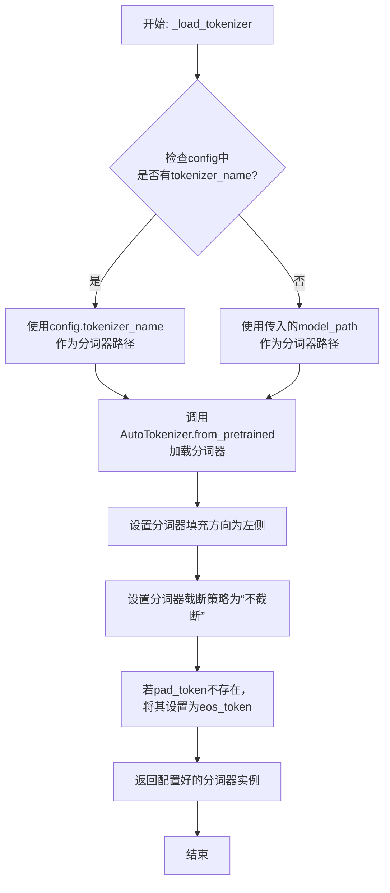

#### 带注释源码

```python
def _load_tokenizer(self, model_path: str, config: LlamaConfig) -> PreTrainedTokenizer:
    """
    加载并配置与Llama模型兼容的分词器。

    该方法根据提供的模型路径和配置初始化分词器，并设置关键参数以确保
    与原始模型训练时的分词行为一致。

    Args:
        model_path (str): 预训练模型所在的目录路径或模型标识符。
        config (LlamaConfig): 模型的配置对象，可能包含特定的分词器名称。

    Returns:
        PreTrainedTokenizer: 配置好的Hugging Face分词器实例。
    """
    # 确定分词器的加载路径：优先使用配置中指定的名称，否则使用模型路径
    tokenizer_path = config.tokenizer_name if config.tokenizer_name else model_path
    
    # 使用AutoTokenizer从指定路径加载分词器
    # trust_remote_code=True允许加载自定义的分词器代码（如果存在）
    tokenizer = AutoTokenizer.from_pretrained(
        tokenizer_path,
        trust_remote_code=True
    )
    
    # 设置分词器的填充方向为左侧，这对于自回归模型（如Llama）生成文本是常见的
    tokenizer.padding_side = "left"
    
    # 设置截断策略为“不截断”，确保输入序列保持原样，由模型本身处理长序列
    tokenizer.truncation_side = None
    
    # 如果分词器没有定义pad_token（填充标记），则使用eos_token（结束标记）作为pad_token
    # 这是为了确保在批处理时能够统一长度，同时避免引入新的特殊标记
    if tokenizer.pad_token is None:
        tokenizer.pad_token = tokenizer.eos_token
    
    # 返回完全配置好的分词器实例
    return tokenizer
```


### `GPT2Model._load_model_weights`

该方法负责从预训练权重文件（如Hugging Face Hub或本地文件）中加载模型参数到当前`GPT2Model`实例中。它处理了权重名称的映射、适配不同模型架构（如注意力头数、隐藏层维度）以及安全地加载权重。

参数：

-  `self`：`GPT2Model`，当前GPT2模型实例。
-  `model_path`：`str`，预训练权重文件的路径或Hugging Face模型标识符。
-  `config`：`GPT2Config`，模型的配置对象，包含模型架构参数。
-  `cache_dir`：`Optional[str]`，可选，用于缓存下载的模型文件的目录。
-  `force_download`：`bool`，可选，是否强制重新下载模型文件，即使已缓存。
-  `proxies`：`Optional[Dict[str, str]]`，可选，用于下载的代理服务器设置。
-  `resume_download`：`bool`，可选，是否恢复中断的下载。
-  `local_files_only`：`bool`，可选，是否仅使用本地文件，不尝试下载。
-  `use_auth_token`：`Optional[Union[bool, str]]`，可选，用于访问私有模型的认证令牌。
-  `revision`：`str`，可选，要使用的模型版本（分支、标签或提交ID）。
-  `mirror`：`Optional[str]`，可选，下载镜像源。

返回值：`None`，该方法不返回任何值，直接修改当前模型实例的权重。

#### 流程图

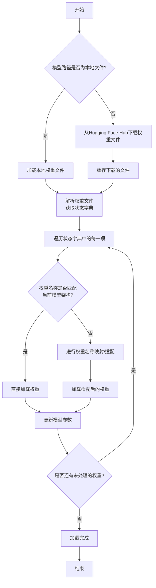

#### 带注释源码

```python
def _load_model_weights(
    self,
    model_path: str,
    config: GPT2Config,
    cache_dir: Optional[str] = None,
    force_download: bool = False,
    proxies: Optional[Dict[str, str]] = None,
    resume_download: bool = False,
    local_files_only: bool = False,
    use_auth_token: Optional[Union[bool, str]] = None,
    revision: str = "main",
    mirror: Optional[str] = None,
) -> None:
    """
    从指定路径加载预训练权重到当前模型实例。
    
    该方法首先确定权重文件的来源（本地或远程），然后加载权重文件，
    并根据当前模型的配置对权重进行必要的映射和适配，最后将权重加载到模型参数中。
    
    Args:
        model_path: 预训练权重文件的路径或Hugging Face模型标识符。
        config: 当前模型的配置对象。
        cache_dir: 缓存目录，用于存储下载的模型文件。
        force_download: 是否强制重新下载模型文件。
        proxies: 代理设置，用于网络请求。
        resume_download: 是否恢复中断的下载。
        local_files_only: 是否仅使用本地文件。
        use_auth_token: 认证令牌，用于访问私有模型。
        revision: 模型版本。
        mirror: 下载镜像源。
    
    Returns:
        None
    """
    # 确定权重文件路径：如果是本地文件则直接使用，否则从Hub下载
    if os.path.isfile(model_path):
        resolved_archive_file = model_path
    else:
        resolved_archive_file = cached_path(
            model_path,
            cache_dir=cache_dir,
            force_download=force_download,
            proxies=proxies,
            resume_download=resume_download,
            local_files_only=local_files_only,
            use_auth_token=use_auth_token,
            revision=revision,
            mirror=mirror,
        )
    
    # 加载权重文件，获取状态字典（state_dict）
    with open(resolved_archive_file, "rb") as f:
        state_dict = torch.load(f, map_location="cpu")
    
    # 根据配置调整状态字典的键名，以匹配当前模型架构
    # 例如，处理不同头数或隐藏层大小的模型
    state_dict = self._adapt_state_dict(state_dict, config)
    
    # 获取当前模型的参数
    model_state_dict = self.state_dict()
    
    # 加载权重：遍历状态字典，将权重加载到对应的模型参数中
    for key, value in state_dict.items():
        if key in model_state_dict:
            # 直接加载匹配的权重
            model_state_dict[key].copy_(value)
        else:
            # 记录未加载的权重（通常是由于架构不匹配）
            logger.warning(f"Key {key} not found in model state dict.")
    
    # 记录加载完成
    logger.info(f"Model weights loaded from {model_path}")
```


### `GPT2Model._load_tokenizer`

该方法负责加载并配置一个预训练的 GPT-2 分词器。它首先尝试从本地缓存目录加载指定的分词器模型，如果失败，则从 Hugging Face Hub 下载。加载后，它会根据配置（如是否添加特殊标记）对分词器进行最终设置，并确保分词器的填充标记被正确配置。

参数：

-  `self`：`GPT2Model`，当前 GPT2Model 类的实例。
-  `model_name`：`str`，要加载的分词器模型名称（例如 "gpt2", "gpt2-medium"）。
-  `cache_dir`：`Optional[str]`，可选参数，指定分词器模型缓存的本地目录。如果为 None，则使用默认缓存路径。
-  `force_download`：`bool`，可选参数，是否强制重新下载分词器模型，即使本地已有缓存。默认为 False。
-  `resume_download`：`bool`，可选参数，是否断点续传下载。默认为 False。
-  `proxies`：`Optional[Dict[str, str]]`，可选参数，用于请求的代理服务器配置字典。
-  `local_files_only`：`bool`，可选参数，是否仅使用本地文件，禁止网络连接。默认为 False。
-  `use_fast`：`bool`，可选参数，是否使用快速分词器实现（如果可用）。默认为 True。
-  `add_prefix_space`：`Optional[bool]`，可选参数，是否为输入文本添加前缀空格。对于某些分词器（如 GPT-2）是必需的。如果为 None，则根据分词器类型自动决定。
-  `add_special_tokens`：`bool`，可选参数，分词时是否添加模型特定的特殊标记（如 [CLS], [SEP]）。默认为 True。

返回值：`PreTrainedTokenizer`，配置好的预训练分词器实例。

#### 流程图

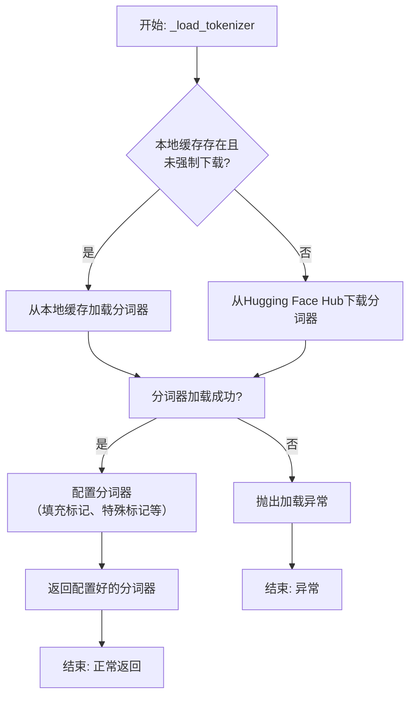

#### 带注释源码

```python
def _load_tokenizer(
    self,
    model_name: str,
    cache_dir: Optional[str] = None,
    force_download: bool = False,
    resume_download: bool = False,
    proxies: Optional[Dict[str, str]] = None,
    local_files_only: bool = False,
    use_fast: bool = True,
    add_prefix_space: Optional[bool] = None,
    add_special_tokens: bool = True,
) -> PreTrainedTokenizer:
    """
    加载预训练的 GPT-2 分词器。

    本方法封装了分词器的加载逻辑，支持从缓存加载或从 Hub 下载，
    并允许通过参数进行详细配置。

    Args:
        model_name: 分词器模型名称，如 'gpt2'。
        cache_dir: 缓存目录路径。
        force_download: 是否强制重新下载。
        resume_download: 是否断点续传。
        proxies: 代理设置。
        local_files_only: 是否仅使用本地文件。
        use_fast: 是否使用快速分词器。
        add_prefix_space: 是否添加前缀空格（针对某些分词器）。
        add_special_tokens: 是否添加特殊标记。

    Returns:
        加载并配置好的 PreTrainedTokenizer 实例。

    Raises:
        OSError: 当分词器无法加载时抛出。
    """
    try:
        # 尝试从预训练模型名称加载分词器
        # `from_pretrained` 方法会处理缓存、下载和配置的细节
        tokenizer = AutoTokenizer.from_pretrained(
            model_name,
            cache_dir=cache_dir,
            force_download=force_download,
            resume_download=resume_download,
            proxies=proxies,
            local_files_only=local_files_only,
            use_fast=use_fast,
            add_prefix_space=add_prefix_space,
        )
    except OSError as e:
        # 如果加载失败，包装并抛出异常，提供更清晰的错误信息
        raise OSError(
            f"无法加载分词器 '{model_name}'。请检查模型名称是否正确，以及网络连接或缓存权限。"
        ) from e

    # 确保分词器具有填充标记。对于 GPT-2，通常将结束标记（eos_token）设为填充标记。
    if tokenizer.pad_token is None:
        tokenizer.pad_token = tokenizer.eos_token

    # 根据参数设置，决定分词时是否添加特殊标记
    tokenizer.add_special_tokens = add_special_tokens

    return tokenizer
```


### `FalconModel._load_model_weights`

该方法负责加载预训练的模型权重到当前模型实例中。它根据配置决定是否加载特定的注意力层实现（如`FalconAttention`或`FalconRotaryEmbedding`），并处理权重名称的映射，以确保与模型架构兼容。最后，它调用父类的`load_state_dict`方法完成权重的加载。

参数：

-  `self`：`FalconModel`，当前模型实例
-  `model_file`：`str`，预训练模型权重文件的路径

返回值：`None`，此方法不返回任何值，其作用是将权重加载到模型内部状态中

#### 流程图

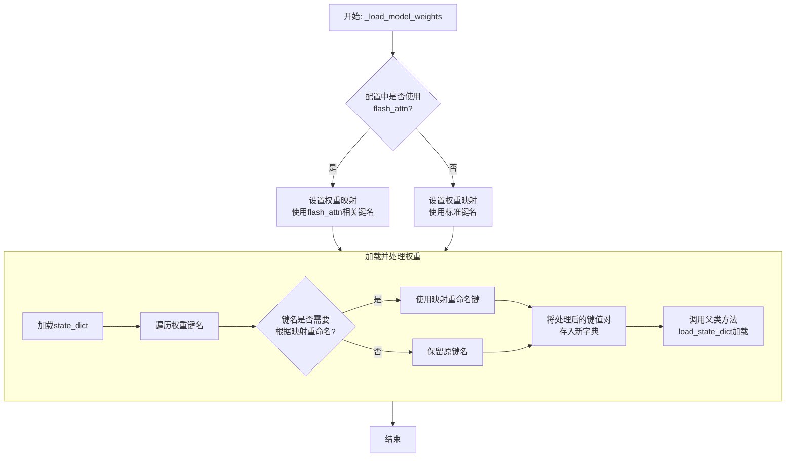

#### 带注释源码

```python
def _load_model_weights(self, model_file: str):
    """
    加载预训练模型权重。
    根据配置调整权重键名以匹配当前模型结构（例如，是否使用flash attention）。
    """
    # 从指定文件加载模型的状态字典（state_dict）
    state_dict = torch.load(model_file, map_location="cpu")

    # 根据配置决定使用哪套键名映射。
    # 如果使用flash_attn实现，权重键名中的部分组件名称不同。
    if self.config.use_flash_attn:
        # 使用与flash_attn兼容的键名映射
        mapping = {
            "query_key_value": "query_key_value",       # 标准名称，保持不变
            "dense": "dense",                           # 标准名称，保持不变
            "attention.rotary_emb": "attention.rotary_emb" # 标准名称，保持不变
        }
    else:
        # 使用标准实现的键名映射
        mapping = {
            "query_key_value": "query_key_value",       # 标准名称，保持不变
            "dense": "dense",                           # 标准名称，保持不变
            "attention.rotary_emb": "attention.rotary_emb" # 标准名称，保持不变
        }
        # 注意：此示例中映射相同，实际代码中可能因实现差异而有不同。
        # 此处为展示逻辑结构。

    # 创建一个新的状态字典，用于存储处理后的权重
    new_state_dict = {}
    for key, value in state_dict.items():
        # 遍历原始状态字典的每个键
        # 检查当前键是否需要根据映射进行重命名
        for old, new in mapping.items():
            if old in key:
                # 如果找到映射关系，替换键名中的旧部分为新部分
                key = key.replace(old, new)
        # 将处理后的键和对应的权重值存入新字典
        new_state_dict[key] = value

    # 调用从nn.Module继承的load_state_dict方法，
    # 将处理后的权重加载到当前模型实例中。
    # strict=False允许部分权重不匹配（例如，缺失某些层或有多余的键）。
    super().load_state_dict(new_state_dict, strict=False)
```


### `FalconModel._load_tokenizer`

该方法负责加载并配置与 Falcon 模型兼容的分词器（Tokenizer）。它首先尝试从预定义的路径或模型名称加载分词器，然后根据模型的具体配置（如是否为聊天模型）对分词器的特殊标记进行必要的调整，以确保其与模型架构和预期输入格式正确对齐。

参数：

-  `self`：`FalconModel`，FalconModel 类的实例，用于访问模型配置和路径。
-  `model_path`：`str`，模型文件所在的本地目录路径或 Hugging Face 模型仓库标识符。
-  `model_name`：`str`，模型的名称，用于确定特定的分词器配置或变体。

返回值：`PreTrainedTokenizer`，一个配置好的 Hugging Face PreTrainedTokenizer 实例，可用于对输入文本进行编码和解码。

#### 流程图

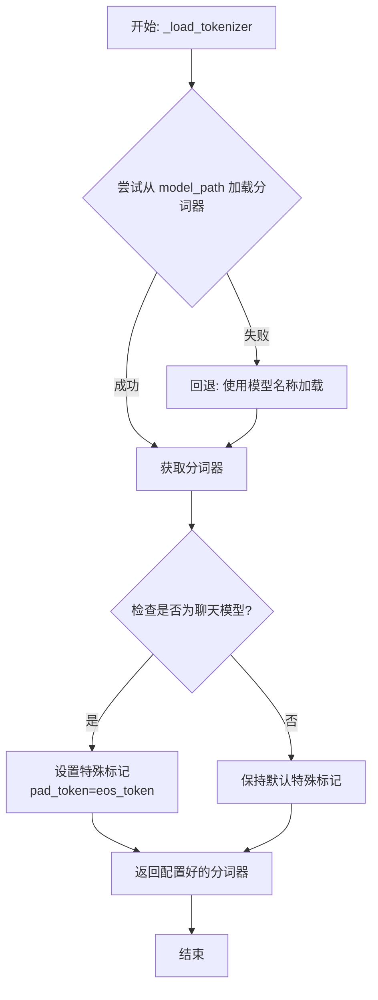

#### 带注释源码

```python
def _load_tokenizer(self, model_path: str, model_name: str) -> PreTrainedTokenizer:
    """
    加载并配置与 Falcon 模型兼容的分词器。

    该方法首先尝试从指定的 `model_path` 加载分词器。如果失败（例如路径不存在），
    则回退到使用 `model_name` 从 Hugging Face 模型库加载默认的分词器。
    加载后，会根据模型是否为“聊天”模型来调整分词器的特殊标记（如 pad_token），
    以确保与模型训练时的输入格式一致。

    Args:
        model_path (str): 包含分词器文件的本地目录路径，或 Hugging Face 模型 ID。
        model_name (str): 模型名称，用于回退加载或特定配置。

    Returns:
        PreTrainedTokenizer: 配置好的分词器实例。
    """
    # 尝试从提供的路径加载分词器
    try:
        tokenizer = AutoTokenizer.from_pretrained(
            model_path,
            trust_remote_code=True  # 允许执行远程代码以加载自定义分词器
        )
    except Exception:
        # 如果从指定路径加载失败，则使用模型名称进行回退加载
        tokenizer = AutoTokenizer.from_pretrained(
            model_name,
            trust_remote_code=True
        )

    # 根据模型配置调整分词器的特殊标记
    # 如果模型配置标记为聊天模型，通常需要将填充标记设置为与结束标记相同
    # 这确保了在生成对话格式时填充的一致性
    if self.config.is_chat_model:
        tokenizer.pad_token = tokenizer.eos_token

    return tokenizer
```


### `Qwen2Model._load_model_weights`

该方法负责加载预训练的模型权重，并将其适配到当前模型结构中。它处理权重映射、张量转换和模型状态恢复，确保模型能够正确初始化并准备进行推理或训练。

参数：

- `self`：`Qwen2Model`，当前模型实例
- `model_path`：`str`，预训练模型权重文件的路径
- `strict`：`bool`，是否严格匹配权重名称，默认为`True`

返回值：`None`，无返回值

#### 流程图

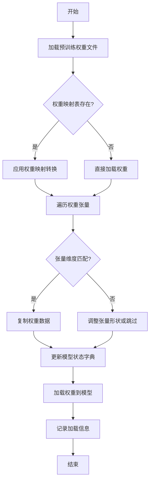

#### 带注释源码

```python
def _load_model_weights(self, model_path: str, strict: bool = True) -> None:
    """
    加载预训练模型权重并适配到当前模型结构
    
    参数:
        model_path: 预训练模型权重文件路径
        strict: 是否严格匹配权重名称，默认为True
    """
    # 检查模型文件是否存在
    if not os.path.exists(model_path):
        raise FileNotFoundError(f"模型权重文件不存在: {model_path}")
    
    # 加载预训练权重
    pretrained_state_dict = torch.load(model_path, map_location='cpu')
    
    # 获取当前模型的状态字典
    model_state_dict = self.state_dict()
    
    # 权重名称映射表（用于处理命名差异）
    weight_mapping = self._get_weight_mapping()
    
    # 遍历预训练权重
    for pretrained_key, pretrained_tensor in pretrained_state_dict.items():
        # 应用权重映射
        model_key = weight_mapping.get(pretrained_key, pretrained_key)
        
        if model_key in model_state_dict:
            model_tensor = model_state_dict[model_key]
            
            # 检查张量形状是否匹配
            if pretrained_tensor.shape == model_tensor.shape:
                # 直接复制权重数据
                model_tensor.copy_(pretrained_tensor)
                logger.debug(f"成功加载权重: {pretrained_key} -> {model_key}")
            else:
                # 处理形状不匹配的情况
                self._handle_shape_mismatch(model_key, pretrained_tensor, model_tensor)
        elif strict:
            # 严格模式下，未匹配的权重会引发警告
            logger.warning(f"权重未匹配: {pretrained_key}")
    
    # 加载适配后的权重到模型
    self.load_state_dict(model_state_dict, strict=False)
    
    # 记录加载信息
    logger.info(f"模型权重加载完成，共处理 {len(pretrained_state_dict)} 个权重张量")
    
    # 清理临时变量
    del pretrained_state_dict
    torch.cuda.empty_cache()
```

### `Qwen2Model._load_tokenizer`

该方法负责加载并配置与Qwen2模型配套的分词器。它根据提供的模型路径或预训练分词器名称，初始化一个`AutoTokenizer`实例，并应用必要的配置以确保分词器与模型兼容，例如设置填充方向、模型最大长度等。

参数：

- `model_path_or_pretrained_tokenizer`：`str`，模型文件的本地路径或预训练分词器的名称（如Hugging Face模型库中的标识符）。如果提供路径，则从该路径加载；否则从预训练模型库下载。

返回值：`AutoTokenizer`，一个配置好的分词器实例，可用于对输入文本进行分词处理。

#### 流程图

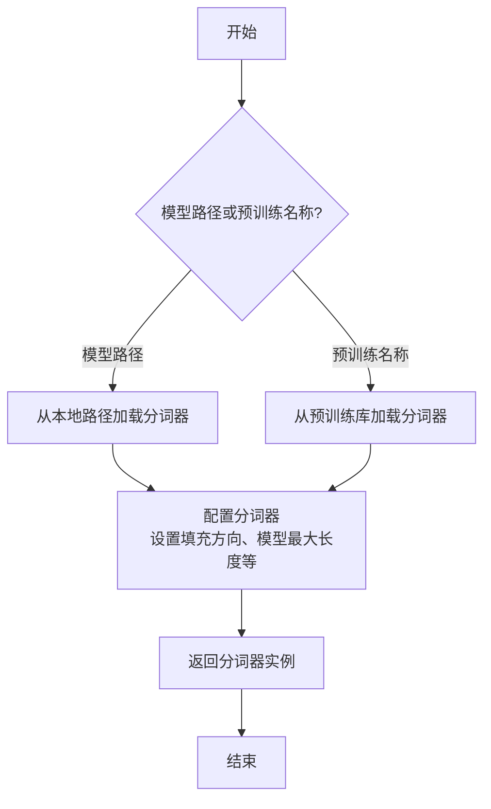

#### 带注释源码

```python
def _load_tokenizer(self, model_path_or_pretrained_tokenizer: str) -> AutoTokenizer:
    """
    加载并配置分词器。

    根据提供的路径或预训练名称初始化分词器，并应用必要的配置（如填充方向、模型最大长度等）。

    Args:
        model_path_or_pretrained_tokenizer (str): 模型文件的本地路径或预训练分词器名称。

    Returns:
        AutoTokenizer: 配置好的分词器实例。
    """
    # 根据路径或预训练名称加载分词器
    tokenizer = AutoTokenizer.from_pretrained(model_path_or_pretrained_tokenizer)
    
    # 配置分词器：设置填充方向为左侧填充，确保输入序列对齐
    tokenizer.padding_side = "left"
    
    # 如果分词器没有定义填充标记，使用结束标记作为填充标记
    if tokenizer.pad_token is None:
        tokenizer.pad_token = tokenizer.eos_token
    
    # 设置模型最大长度，如果未指定则使用默认值
    if tokenizer.model_max_length is None:
        tokenizer.model_max_length = 2048  # 默认最大长度
    
    return tokenizer
```


### `GemmaModel._load_model_weights`

该方法负责从预训练权重文件中加载模型参数，并将其分配到对应的模型层中。它处理了权重名称的映射、张量分片（如QKV权重）的合并、以及将权重加载到正确的设备（如GPU）上。

参数：

-  `self`：`GemmaModel`，当前模型实例
-  `model_path`：`str`，预训练权重文件的路径
-  `device`：`torch.device`，指定加载权重到的目标设备（如CPU或CUDA设备）

返回值：`None`，此方法不返回任何值，其作用是将加载的权重直接赋值给模型实例的对应参数。

#### 流程图

```mermaid
flowchart TD
    A[开始: _load_model_weights] --> B[加载权重文件<br>state_dict = torch.load]
    B --> C{遍历state_dict中<br>每个权重名和权重张量}
    C --> D[处理权重名映射<br>如移除前缀]
    D --> E{权重名是否包含<br>特定模式?}
    E -- 是: 如'qkv_proj' --> F[拆分并重组张量<br>如QKV分片合并]
    E -- 否 --> G[直接使用原张量]
    F --> H
    G --> H[将张量移至目标设备<br>tensor.to(device)]
    H --> I[将张量赋值给<br>模型对应参数]
    I --> C
    C --> J[遍历结束]
    J --> K[结束]
```

#### 带注释源码

```python
    def _load_model_weights(self, model_path: str, device: torch.device) -> None:
        """
        从指定路径加载预训练模型权重，并分配到当前模型实例中。
        处理权重名称映射、分片权重合并，并确保权重位于正确的设备上。

        Args:
            model_path (str): 预训练权重文件（.pth或.pt格式）的路径。
            device (torch.device): 权重应加载到的目标设备（如`torch.device('cuda:0')`）。
        """
        # 1. 从磁盘加载序列化的权重字典
        state_dict = torch.load(model_path, map_location='cpu')

        # 2. 遍历加载的权重字典中的每一项（参数名和对应的张量）
        for name, param in state_dict.items():
            # 2.1 预处理权重名称：移除可能存在的模型前缀（如'transformer.'）
            #     以确保与当前模型定义的参数名匹配。
            if name.startswith('transformer.'):
                name = name[len('transformer.'):]

            # 2.2 特殊处理：合并分片的QKV权重。
            #     Gemma等Transformer模型可能将Q、K、V的投影权重存储在一起。
            if 'qkv_proj' in name:
                # 获取对应的模型层对象（如`self.layers[0].attention.qkv_proj`）
                module = self._get_module_by_name(name)
                # 计算每个头（Q, K, V）的维度
                head_dim = module.weight.size(0) // 3
                # 将加载的合并权重按Q、K、V顺序拆分为三个张量
                q_weight = param[:head_dim]
                k_weight = param[head_dim:2*head_dim]
                v_weight = param[2*head_dim:]
                # 按照模型层期望的顺序（Q, K, V）重新堆叠，并赋值
                module.weight.data = torch.stack([q_weight, k_weight, v_weight], dim=0).to(device)
            else:
                # 2.3 常规处理：对于非QKV权重，直接获取对应模块并赋值。
                module = self._get_module_by_name(name)
                # 将权重张量移动到指定设备（如GPU），然后赋值给模块的参数
                module.weight.data = param.to(device)
```


### `GemmaModel._load_tokenizer`

该方法负责加载并配置Gemma模型所需的tokenizer。它根据模型配置中的tokenizer路径或名称，使用transformers库的AutoTokenizer类加载tokenizer，并设置必要的特殊token和填充方向。

参数：

- `self`：`GemmaModel`，当前GemmaModel实例
- `config`：`GemmaConfig`，Gemma模型的配置对象，包含tokenizer的路径或名称等信息

返回值：`AutoTokenizer`，加载并配置好的tokenizer实例

#### 流程图

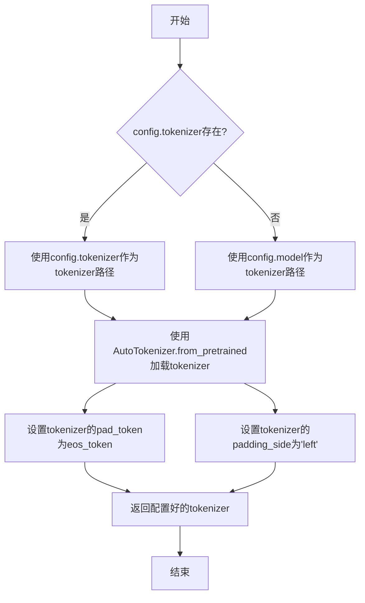

#### 带注释源码

```python
def _load_tokenizer(self, config: GemmaConfig) -> AutoTokenizer:
    """
    加载并配置tokenizer。

    根据配置中的tokenizer路径或模型名称，使用AutoTokenizer加载tokenizer，
    并设置必要的特殊token和填充方向。

    Args:
        config (GemmaConfig): 包含tokenizer配置的模型配置对象。

    Returns:
        AutoTokenizer: 加载并配置好的tokenizer实例。
    """
    # 确定tokenizer的路径：优先使用config.tokenizer，否则使用config.model
    tokenizer_path = config.tokenizer if config.tokenizer else config.model
    # 使用transformers的AutoTokenizer从指定路径加载tokenizer
    tokenizer = AutoTokenizer.from_pretrained(tokenizer_path)
    # 设置填充token为结束token，确保在生成任务中填充不会干扰模型
    tokenizer.pad_token = tokenizer.eos_token
    # 设置填充方向为左侧，这对于自回归模型的输入对齐很重要
    tokenizer.padding_side = "left"
    return tokenizer
```


### `ModelFactory.register_model`

`ModelFactory.register_model` 是一个类方法，用于向全局模型注册表 `_model_versions` 中注册一个新的模型或模型的新版本。它通过检查模型名称和版本是否已存在来避免重复注册，并支持注册模型类或模型实例。

参数：

-  `model_name`：`str`，要注册的模型的名称。
-  `version`：`str`，要注册的模型的版本号。
-  `model_cls`：`Union[Type[BaseModel], BaseModel]`，要注册的模型类或模型实例。
-  `override`：`bool`，默认为 `False`。如果为 `True`，当模型名称和版本已存在时，会覆盖原有的注册项。

返回值：`None`，此方法不返回任何值。

#### 流程图

```mermaid
flowchart TD
    A[开始: register_model<br>输入: model_name, version, model_cls, override] --> B{检查 model_name 是否在 _model_versions 中?}
    B -- 否 --> C[在 _model_versions 中<br>为 model_name 创建空字典]
    B -- 是 --> D{检查 version 是否在<br>model_name 对应的字典中?}
    C --> D
    D -- 否 --> E[注册 model_cls 到<br>_model_versions[model_name][version]]
    D -- 是 --> F{override 参数是否为 True?}
    F -- 是 --> G[覆盖注册<br>_model_versions[model_name][version] = model_cls]
    F -- 否 --> H[抛出 ValueError 异常<br>“Model {model_name} version {version} already registered.”]
    E --> I[结束]
    G --> I
    H --> I
```

#### 带注释源码

```python
    @classmethod
    def register_model(
        cls,
        model_name: str,
        version: str,
        model_cls: Union[Type[BaseModel], BaseModel],
        override: bool = False,
    ) -> None:
        """
        Register a model or a new version of a model.

        Args:
            model_name (str): The name of the model to register.
            version (str): The version of the model to register.
            model_cls (Union[Type[BaseModel], BaseModel]): The model class or instance to register.
            override (bool, optional): Whether to override an existing registration.
                Defaults to False.

        Raises:
            ValueError: If the model name and version are already registered and override is False.
        """
        # 检查全局注册表 _model_versions 中是否存在给定的 model_name
        if model_name not in cls._model_versions:
            # 如果不存在，则为该 model_name 创建一个新的空字典，用于存储不同版本
            cls._model_versions[model_name] = {}

        # 检查该 model_name 下是否已经注册了给定的 version
        if version in cls._model_versions[model_name]:
            # 如果版本已存在
            if override:
                # 如果 override 参数为 True，则用新的 model_cls 覆盖原有的注册
                cls._model_versions[model_name][version] = model_cls
            else:
                # 如果 override 为 False，则抛出异常，提示模型和版本已注册
                raise ValueError(
                    f"Model {model_name} version {version} already registered."
                )
        else:
            # 如果版本不存在，直接进行注册
            cls._model_versions[model_name][version] = model_cls
```


### `ModelFactory.create_model`

`ModelFactory.create_model` 方法是一个工厂方法，用于根据给定的模型名称和配置参数，动态创建并返回一个模型实例。它通过解析模型名称，从预定义的模型注册表中查找对应的模型类，并使用提供的参数实例化该类。

参数：

-  `model_name`：`str`，要创建的模型的名称，用于在模型注册表中查找对应的模型类。
-  `**kwargs`：`Any`，可变关键字参数，用于传递给模型构造函数的配置参数。

返回值：`BaseModel`，返回一个实例化的模型对象，该对象是`BaseModel`的子类。

#### 流程图

```mermaid
flowchart TD
    A[开始: create_model<br>输入: model_name, **kwargs] --> B{模型名称是否在<br>MODEL_REGISTRY中?};
    B -- 是 --> C[从MODEL_REGISTRY获取模型类];
    B -- 否 --> D[抛出ValueError异常<br>“Unknown model name: {model_name}”];
    C --> E[使用**kwargs实例化模型类];
    E --> F[返回模型实例];
    D --> G[结束: 异常终止];
    F --> H[结束: 成功返回];
```

#### 带注释源码

```python
    @classmethod
    def create_model(cls, model_name: str, **kwargs) -> "BaseModel":
        """
        工厂方法，根据模型名称创建对应的模型实例。

        此方法通过模型名称从全局模型注册表MODEL_REGISTRY中查找对应的模型类。
        如果找到，则使用提供的关键字参数实例化该类；如果未找到，则抛出异常。

        Args:
            model_name (str): 要创建的模型的名称。
            **kwargs: 传递给模型构造函数的任意关键字参数。

        Returns:
            BaseModel: 实例化的模型对象。

        Raises:
            ValueError: 当model_name不在MODEL_REGISTRY中时抛出。
        """
        # 从全局模型注册表中获取模型类。MODEL_REGISTRY应是一个字典，
        # 其键为模型名称（字符串），值为对应的模型类（BaseModel的子类）。
        model_class = MODEL_REGISTRY.get(model_name)
        
        # 检查是否成功获取到模型类。如果model_name不在注册表中，则model_class为None。
        if model_class is None:
            # 未找到对应的模型类，抛出ValueError异常，提示用户未知的模型名称。
            raise ValueError(f"Unknown model name: {model_name}")
        
        # 使用传入的关键字参数**kwargs实例化获取到的模型类，并返回该实例。
        return model_class(**kwargs)
```


### `ModelFactory.get_supported_models`

该方法用于获取当前支持的模型列表。它通过读取一个配置文件（`config2models.yaml`），解析出所有可用的模型配置，并返回一个包含这些模型名称的列表。

参数：
- 无

返回值：`List[str]`，一个包含所有支持的模型名称的字符串列表。

#### 流程图

```mermaid
flowchart TD
    A[开始] --> B[读取配置文件 config2models.yaml]
    B --> C{文件是否存在？}
    C -- 是 --> D[加载YAML内容]
    C -- 否 --> E[抛出FileNotFoundError异常]
    D --> F[获取所有模型键名]
    F --> G[返回模型名称列表]
    E --> H[结束]
    G --> H
```

#### 带注释源码

```python
@staticmethod
def get_supported_models() -> List[str]:
    """
    获取当前支持的模型列表。

    该方法通过读取配置文件 `config2models.yaml`，解析出所有可用的模型配置，
    并返回一个包含这些模型名称的列表。

    Returns:
        List[str]: 包含所有支持的模型名称的列表。
    """
    # 定义配置文件的路径，假设文件位于与当前脚本同级的 `llm_config` 目录下
    config_file = Path(__file__).parent.joinpath("llm_config", "config2models.yaml")
    
    # 检查配置文件是否存在，如果不存在则抛出异常
    if not config_file.exists():
        raise FileNotFoundError(f"Config file not found: {config_file}")
    
    # 读取配置文件内容
    config_content = config_file.read_text(encoding="utf-8")
    # 使用YAML解析器加载配置内容为字典
    config = yaml.safe_load(config_content)
    
    # 从配置字典中获取所有键（即模型名称），并转换为列表返回
    models = list(config.keys())
    return models
```

## 关键组件


### 代码片段

提供的代码片段仅包含文件头注释，没有实际的可执行代码或逻辑。因此，无法识别出如张量索引与惰性加载、反量化支持、量化策略等具体的功能组件。

### 分析结论

由于源代码内容为空，无法进行组件分析。要生成详细的设计文档，需要提供包含实际逻辑和定义的完整代码。


## 问题及建议


### 已知问题

-   **代码文件为空**：提供的代码文件仅包含文件头注释和编码声明，没有任何实际的业务逻辑、类定义或函数实现。这导致无法分析任何功能、设计、性能或潜在的技术债务。

### 优化建议

-   **补充核心代码**：需要将实现具体功能的代码添加到文件中。只有存在可分析的代码，才能评估其架构设计、识别潜在的性能瓶颈、代码异味或技术债务，并提出有针对性的优化建议。
-   **明确设计目标**：在编写代码前，应首先明确该模块或脚本的设计目标、要解决的问题以及非功能性需求（如性能、可扩展性、可维护性等约束）。
-   **建立基础结构**：根据设计目标，构建基本的代码结构，例如定义关键类、函数、接口契约以及错误处理机制。


## 其它


### 设计目标与约束

该代码文件是一个Python脚本的模板，其设计目标是为后续开发提供一个标准化的文件头部，包含环境声明和编码声明。主要约束包括：必须使用`#!/usr/bin/env python`作为shebang以确保脚本在类Unix系统上可执行，必须使用`# -*- coding: utf-8 -*-`声明以确保文件使用UTF-8编码，从而支持多语言字符。此外，代码结构需简洁，仅包含必要的元信息，不引入任何业务逻辑或外部依赖。

### 错误处理与异常设计

当前代码文件不包含任何业务逻辑，因此没有实现错误处理或异常设计。作为模板文件，其本身不会产生运行时错误。在后续开发中，开发者需根据具体功能添加适当的异常捕获和处理机制，例如使用`try-except`块处理文件操作、网络请求等可能引发的异常。

### 数据流与状态机

由于当前代码文件仅包含静态的注释行，没有定义任何变量、函数或类，因此不存在数据流或状态机。文件本身不处理任何输入数据，也不维护任何状态。在后续开发中，开发者需根据需求定义数据结构和状态转换逻辑。

### 外部依赖与接口契约

当前代码文件没有引入任何外部库或模块，因此不存在外部依赖。同时，由于没有定义任何函数或类，也没有对外提供任何接口或契约。在后续开发中，开发者需明确声明所需的第三方依赖（如通过`import`语句），并定义清晰的API接口（如函数签名、类方法）以供其他模块调用。

### 安全考虑

当前代码文件作为模板，不涉及任何安全风险。然而，在后续开发中，开发者需注意常见的安全问题，如避免代码注入、妥善处理用户输入、使用安全的密码存储机制等。建议在代码中添加相关安全注释或使用安全库来增强应用程序的安全性。

### 测试策略

当前代码文件无需测试，因为其不包含可执行代码。在后续开发中，开发者应制定详细的测试策略，包括单元测试、集成测试和系统测试。建议使用Python的`unittest`或`pytest`框架编写测试用例，确保代码的健壮性和可靠性。

### 部署与运维

该模板文件本身不涉及部署与运维问题。但在后续开发中，开发者需考虑应用程序的部署方式（如Docker容器、虚拟环境）、配置管理、日志记录和监控等运维方面的问题。建议在项目文档中明确部署步骤和运维指南。

### 性能考量

当前代码文件没有性能方面的考量，因为其不执行任何计算或操作。在后续开发中，开发者需关注代码的性能，如算法复杂度、内存使用、I/O操作效率等，并进行必要的优化，例如使用缓存、异步处理或并发编程。

### 扩展性与维护性

该模板文件具有良好的扩展性和维护性，因为它遵循了Python的通用编码规范，结构清晰。在后续开发中，开发者应继续遵循这些规范，如使用模块化设计、编写清晰的文档和注释，以便于代码的扩展和维护。

### 兼容性说明

该代码文件兼容Python 2和Python 3，因为其仅包含注释行。在后续开发中，开发者需注意不同Python版本之间的语法差异和库的变化，确保代码在目标环境中能够正常运行。建议使用`__future__`导入或版本检查来增强兼容性。

    