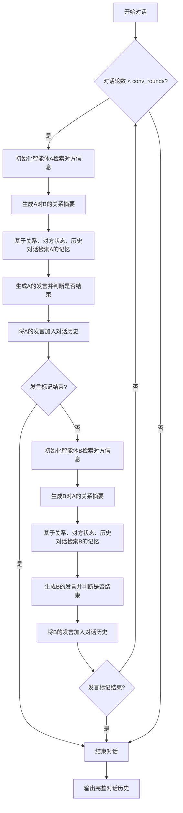
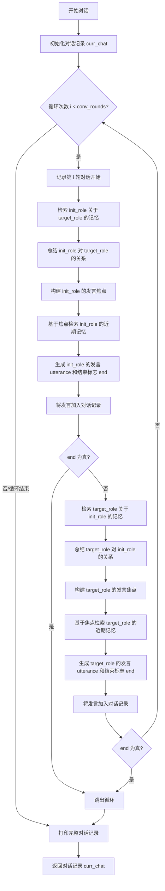
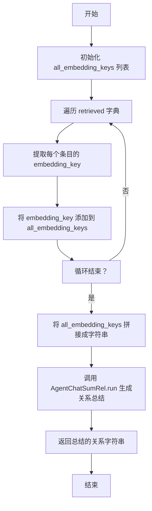
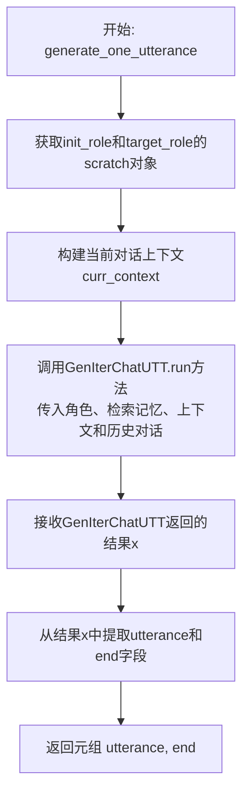
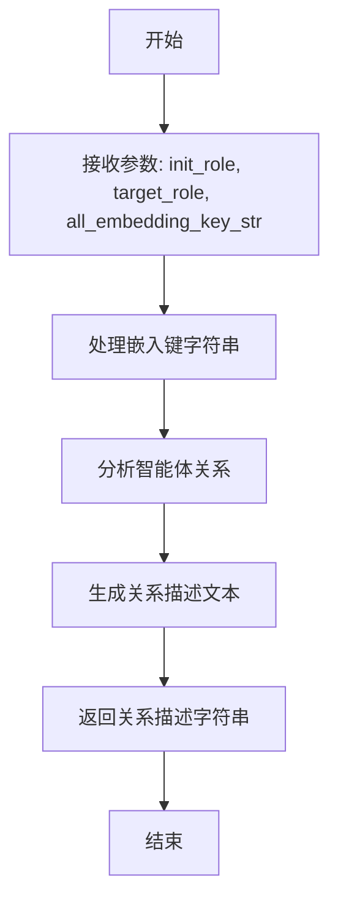
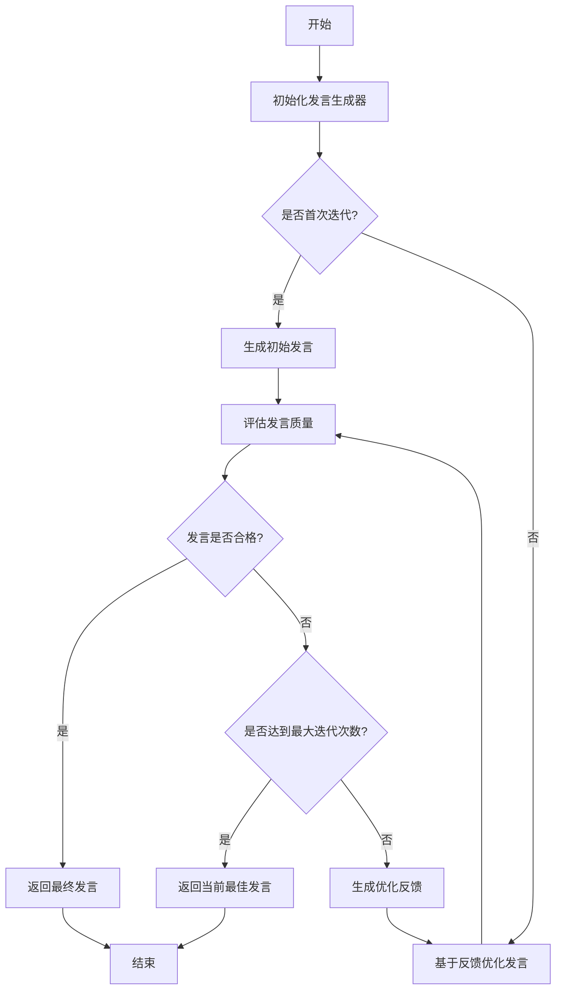

# `.\MetaGPT\metagpt\ext\stanford_town\plan\converse.py` 详细设计文档

该代码实现了一个基于斯坦福小镇（Stanford Town）扩展的智能体对话系统。其核心功能是模拟两个智能体（Agent）之间进行多轮、有上下文感知的对话。系统通过检索智能体的记忆来生成对话双方的关系摘要，并基于此关系、对方状态和最近的对话历史，生成每一轮的对话内容，直到达到预设的轮数或对话自然结束。

## 整体流程



## 类结构

```
agent_conversation.py
├── 全局函数
│   ├── agent_conversation
│   ├── generate_summarize_agent_relationship
│   └── generate_one_utterance
└── 外部依赖类
    ├── AgentChatSumRel (来自 metagpt.ext.stanford_town.actions.agent_chat_sum_rel)
    └── GenIterChatUTT (来自 metagpt.ext.stanford_town.actions.gen_iter_chat_utt)
```

## 全局变量及字段


### `logger`
    
全局日志记录器实例，用于记录代码执行过程中的信息、警告和错误日志。

类型：`metagpt.logs.logger`
    


    

## 全局函数及方法


### `agent_conversation`

该函数是斯坦福小镇扩展中实现两个智能体（`init_role` 和 `target_role`）之间多轮对话的核心协调器。它通过交替调用记忆检索、关系总结和话语生成模块，模拟了智能体之间基于上下文和关系的自然对话流程，直到达到预设的对话轮数或某一方主动结束对话。

参数：

-  `init_role`：`STRole`，发起对话的智能体角色对象。
-  `target_role`：`STRole`，对话目标的智能体角色对象。
-  `conv_rounds`：`int`，默认值为8，预设的最大对话轮数（每轮包含双方各说一次）。

返回值：`list[list[str]]`，返回一个列表，其中每个子列表代表对话中的一轮发言，格式为 `[发言者姓名, 发言内容]`。

#### 流程图



#### 带注释源码

```python
async def agent_conversation(init_role: "STRole", target_role: "STRole", conv_rounds: int = 8) -> list[list[str]]:
    # 初始化一个空列表，用于存储对话记录。每条记录是一个列表 [说话者姓名, 说话内容]
    curr_chat = []
    # 记录对话开始的日志
    logger.info(f"Role: {init_role.name} starts a conversation with Role: {target_role.name}")

    # 主循环，控制对话轮数
    for idx in range(conv_rounds):
        logger.info(f"Conv round: {idx} between {init_role.name} and {target_role.name}")
        # 获取两个角色的“草稿”对象，通常包含角色的当前状态、描述等信息
        scratch = init_role.rc.scratch
        target_scratch = target_role.rc.scratch

        # --- init_role 发言阶段 ---
        # 焦点1：目标角色的名字。用于从 init_role 的记忆中检索与 target_role 相关的广泛背景。
        focal_points = [f"{target_scratch.name}"]
        # 从 init_role 的记忆中检索与焦点相关的信息，限制返回50条
        retrieved = new_agent_retrieve(init_role, focal_points, 50)
        # 基于检索到的记忆，总结 init_role 对 target_role 的总体关系（如朋友、同事）
        relationship = await generate_summarize_agent_relationship(init_role, target_role, retrieved)
        logger.info(f"The relationship between {init_role.name} and {target_role.name}: {relationship}")
        
        # 获取最近4轮对话（最多）的历史，格式化为字符串
        last_chat = ""
        for i in curr_chat[-4:]:
            last_chat += ": ".join(i) + "\n"
        # 构建更具体的发言焦点，包含关系、目标角色描述和对话历史（如果有）
        if last_chat:
            focal_points = [f"{relationship}", f"{target_scratch.name} is {target_scratch.act_description}", last_chat]
        else:
            focal_points = [f"{relationship}", f"{target_scratch.name} is {target_scratch.act_description}"]
        # 基于新的焦点进行更精确的记忆检索，限制返回15条，用于生成当前发言
        retrieved = new_agent_retrieve(init_role, focal_points, 15)
        # 生成 init_role 的发言内容和是否结束对话的标志
        utt, end = await generate_one_utterance(init_role, target_role, retrieved, curr_chat)

        # 将 init_role 的发言记录到 curr_chat
        curr_chat += [[scratch.name, utt]]
        # 如果 init_role 的发言表示要结束对话，则跳出整个循环
        if end:
            break

        # --- target_role 发言阶段 (逻辑与 init_role 对称) ---
        focal_points = [f"{scratch.name}"]
        retrieved = new_agent_retrieve(target_role, focal_points, 50)
        relationship = await generate_summarize_agent_relationship(target_role, init_role, retrieved)
        logger.info(f"The relationship between {target_role.name} and {init_role.name}: {relationship}")
        last_chat = ""
        for i in curr_chat[-4:]:
            last_chat += ": ".join(i) + "\n"
        if last_chat:
            focal_points = [f"{relationship}", f"{scratch.name} is {scratch.act_description}", last_chat]
        else:
            focal_points = [f"{relationship}", f"{scratch.name} is {scratch.act_description}"]
        retrieved = new_agent_retrieve(target_role, focal_points, 15)
        utt, end = await generate_one_utterance(target_role, init_role, retrieved, curr_chat)

        curr_chat += [[target_scratch.name, utt]]
        if end:
            break

    # 对话结束后，打印完整的对话记录
    logger.warning(f"Conversations between {target_role.name} and {init_role.name}:")
    for row in curr_chat:
        logger.info(row)

    # 返回对话记录
    return curr_chat
```


### `generate_summarize_agent_relationship`

该函数用于生成并总结两个智能体（`init_role` 和 `target_role`）之间的关系。它通过处理从记忆中检索到的信息（`retrieved`），提取所有相关的嵌入键（`embedding_key`），并将这些键拼接成一个字符串。然后，它调用 `AgentChatSumRel` 动作来生成一个总结性的关系描述。

参数：

- `init_role`：`STRole`，发起关系总结的智能体角色。
- `target_role`：`STRole`，目标智能体角色，关系总结的对象。
- `retrieved`：`dict`，从记忆中检索到的相关信息字典，键为类别，值为包含 `embedding_key` 属性的对象列表。

返回值：`str`，返回一个字符串，描述两个智能体之间的总结性关系。

#### 流程图



#### 带注释源码

```python
async def generate_summarize_agent_relationship(init_role: "STRole", target_role: "STRole", retrieved: dict) -> str:
    # 初始化一个空列表，用于存储所有检索到的嵌入键
    all_embedding_keys = list()
    
    # 遍历检索到的字典，键为类别，值为包含 embedding_key 的对象列表
    for key, val in retrieved.items():
        for i in val:
            # 将每个对象的 embedding_key 添加到列表中
            all_embedding_keys += [i.embedding_key]
    
    # 初始化一个空字符串，用于拼接所有嵌入键
    all_embedding_key_str = ""
    for i in all_embedding_keys:
        # 将每个嵌入键添加到字符串中，每个键后换行
        all_embedding_key_str += f"{i}\n"
    
    # 调用 AgentChatSumRel 动作的 run 方法，传入两个智能体角色和嵌入键字符串，生成关系总结
    summarized_relationship = await AgentChatSumRel().run(init_role, target_role, all_embedding_key_str)
    
    # 返回生成的关系总结字符串
    return summarized_relationship
```


### `generate_one_utterance`

该函数是对话生成流程中的核心组件，负责为发起对话的智能体（`init_role`）生成一句针对目标智能体（`target_role`）的对话内容。它通过整合智能体的背景信息、当前上下文、历史对话记录以及从记忆中检索到的相关信息，利用 `GenIterChatUTT` 动作来生成一句自然、连贯的对话，并判断对话是否应该结束。

参数：

-  `init_role`：`STRole`，发起对话的智能体角色对象，包含其记忆、状态和行为描述。
-  `target_role`：`STRole`，对话的目标智能体角色对象。
-  `retrieved`：`dict`，一个字典，包含了从 `init_role` 的记忆中根据特定焦点检索到的相关记忆条目，用于为对话生成提供上下文。
-  `curr_chat`：`list`，当前对话的轮次记录列表，格式为 `[[说话者1, 话语1], [说话者2, 话语2], ...]`，用于提供对话历史上下文。

返回值：`Tuple[str, str]`，返回一个元组，包含两个字符串元素。第一个元素是生成的对话话语（`utterance`），第二个元素是一个标志（`end`），指示对话是否应该在此话语后结束。

#### 流程图



#### 带注释源码

```
async def generate_one_utterance(init_role, target_role, retrieved: dict, curr_chat: list) -> Tuple[str, str]:
    # Chat version optimized for speed via batch generation
    # 获取两个角色的scratch对象，scratch通常包含角色的即时状态、描述等信息。
    scratch = init_role.rc.scratch
    target_scratch = target_role.rc.scratch

    # 构建当前对话的上下文字符串。这个上下文描述了对话发生的场景：
    # “init_role在做什么的时候，看到了正在做什么的target_role，并开始发起对话。”
    curr_context = (
        f"{scratch.name} "  # 发起者的名字
        + f"was {scratch.act_description} "  # 发起者当时的行为描述
        + f"when {scratch.name} "  # 当发起者...
        + f"saw {target_scratch.name} "  # 看到了目标角色
        + f"in the middle of {target_scratch.act_description}.\n"  # 目标角色当时的行为描述
    )
    # 补充说明：发起者正在发起对话。
    curr_context += f"{scratch.name} " + "is initiating a conversation with " + f"{target_scratch.name}."

    # 调用GenIterChatUTT动作的run方法，传入所有必要参数来生成对话。
    # 这是一个异步操作，会等待生成过程完成。
    x = await GenIterChatUTT().run(init_role, target_role, retrieved, curr_context, curr_chat)

    # 从GenIterChatUTT返回的结果字典x中，提取生成的话语和对话结束标志。
    return x["utterance"], x["end"]
```


### `AgentChatSumRel.run`

该方法用于生成并总结两个智能体（Agent）之间的关系描述。它接收两个智能体角色和相关的嵌入键字符串作为输入，通过处理和分析这些信息，生成一段描述两个智能体之间关系的文本。

参数：

- `init_role`：`STRole`，发起关系的智能体角色，包含该智能体的基本信息、状态和行为描述。
- `target_role`：`STRole`，目标智能体角色，即与发起智能体建立关系的另一方。
- `all_embedding_key_str`：`str`，包含所有相关嵌入键的字符串，这些嵌入键用于检索智能体的记忆或上下文信息，以辅助生成关系描述。

返回值：`str`，返回一个字符串，描述两个智能体之间的关系。

#### 流程图



#### 带注释源码

```python
async def run(self, init_role: "STRole", target_role: "STRole", all_embedding_key_str: str) -> str:
    """
    生成并总结两个智能体之间的关系描述。

    参数:
        init_role (STRole): 发起关系的智能体角色。
        target_role (STRole): 目标智能体角色。
        all_embedding_key_str (str): 包含所有相关嵌入键的字符串。

    返回值:
        str: 描述两个智能体之间关系的文本。
    """
    # 处理嵌入键字符串，提取关键信息
    processed_keys = self._process_embedding_keys(all_embedding_key_str)
    
    # 分析智能体之间的关系
    relationship_analysis = self._analyze_relationship(init_role, target_role, processed_keys)
    
    # 生成关系描述文本
    relationship_description = self._generate_description(relationship_analysis)
    
    return relationship_description
```


### `GenIterChatUTT.run`

该方法用于生成对话中的单次发言，通过迭代生成过程来优化发言内容，并判断对话是否应该结束。

参数：

- `init_role`：`STRole`，发起对话的角色对象
- `target_role`：`STRole`，目标对话角色对象
- `retrieved`：`dict`，检索到的相关记忆信息
- `curr_context`：`str`，当前对话的上下文描述
- `curr_chat`：`list`，当前对话历史记录

返回值：`dict`，包含生成的发言内容和对话结束标志的字典

#### 流程图



#### 带注释源码

```python
async def run(
    self,
    init_role: "STRole",           # 发起对话的角色
    target_role: "STRole",         # 目标对话角色
    retrieved: dict,               # 检索到的记忆信息
    curr_context: str,             # 当前对话上下文
    curr_chat: list                # 对话历史记录
) -> dict:
    """
    生成单次发言的核心方法
    
    通过迭代优化过程生成自然、符合角色设定的发言，
    同时判断对话是否应该自然结束
    
    Args:
        init_role: 发言发起者角色
        target_role: 发言接收者角色
        retrieved: 检索到的相关记忆
        curr_context: 当前对话上下文描述
        curr_chat: 历史对话记录
    
    Returns:
        dict: 包含'utterance'(发言内容)和'end'(结束标志)的字典
    """
    
    # 初始化发言生成器
    generator = self._init_generator(init_role, target_role)
    
    # 设置迭代参数
    max_iterations = self.config.max_iterations
    best_utterance = None
    best_score = -1
    
    for iteration in range(max_iterations):
        # 生成候选发言
        if iteration == 0:
            # 首次迭代：基于上下文和记忆生成
            candidate = await self._generate_initial_utterance(
                generator, curr_context, retrieved
            )
        else:
            # 后续迭代：基于反馈优化
            candidate = await self._optimize_utterance(
                generator, best_utterance, feedback
            )
        
        # 评估发言质量
        score, should_end = await self._evaluate_utterance(
            candidate, init_role, target_role, curr_chat
        )
        
        # 更新最佳发言
        if score > best_score:
            best_score = score
            best_utterance = candidate
            end_flag = should_end
        
        # 检查是否达到质量阈值
        if score >= self.config.quality_threshold:
            break
        
        # 生成优化反馈（如果不是最后一次迭代）
        if iteration < max_iterations - 1:
            feedback = await self._generate_feedback(
                candidate, score, init_role, target_role
            )
    
    return {
        "utterance": best_utterance,  # 最终生成的发言内容
        "end": end_flag               # 对话是否应该结束的标志
    }
```


## 关键组件


### 对话流程控制器 (`agent_conversation`)

负责管理两个智能体之间的多轮对话流程，包括初始化对话、控制对话轮次、在每轮中交替调用智能体的记忆检索、关系总结和话语生成功能，并记录对话历史。

### 关系总结器 (`generate_summarize_agent_relationship`)

基于从智能体记忆中检索到的相关信息，生成并总结发起对话的智能体（`init_role`）与目标智能体（`target_role`）之间的关系描述。

### 话语生成器 (`generate_one_utterance`)

根据当前对话上下文、智能体记忆检索结果以及双方的角色状态，生成发起对话的智能体（`init_role`）在当前轮次中要说的一句话，并判断对话是否应结束。

### 记忆检索器 (`new_agent_retrieve`)

根据给定的焦点（`focal_points`）和数量限制，从一个智能体的记忆中检索最相关的记忆条目，为关系总结和话语生成提供上下文信息。

### 智能体状态 (`scratch`)

代表智能体的运行时状态，包含姓名（`name`）和行为描述（`act_description`）等关键属性，用于构建对话上下文和检索焦点。


## 问题及建议


### 已知问题

-   **硬编码的对话轮次上限**：`conv_rounds` 参数默认为 8，且没有内置的、基于对话内容自然结束的机制（仅依赖 `GenIterChatUTT` 返回的 `end` 标志）。这可能导致对话在不该结束时被强制中断，或在已结束时仍进行无意义的轮次。
-   **重复且冗长的代码逻辑**：`agent_conversation` 函数中，为 `init_role` 和 `target_role` 生成对话的逻辑几乎完全重复（仅角色对象互换），违反了 DRY（Don‘t Repeat Yourself）原则，增加了维护成本和出错风险。
-   **脆弱的对话历史拼接**：使用 `for i in curr_chat[-4:]: last_chat += “: “.join(i) + “\n”` 来拼接最近4轮对话历史。这种字符串拼接方式在格式上较为脆弱，且硬编码了历史轮数（4），缺乏灵活性。
-   **缺乏明确的错误处理**：代码中大量使用了 `await` 调用外部动作（如 `AgentChatSumRel().run`, `GenIterChatUTT().run`），但未包含任何 `try-except` 块来处理可能发生的网络、模型或业务逻辑异常，导致程序可能因单点故障而崩溃。
-   **类型注解不完整**：函数参数和返回值使用了字符串形式的类型提示（如 `”STRole”`），这可能在运行时之前无法被类型检查器正确识别。`generate_one_utterance` 返回的 `Tuple[str, str]` 中第二个 `str` 类型与变量名 `end` 的布尔语义不符。
-   **潜在的性能瓶颈**：每轮对话中，每个角色都会执行两次 `new_agent_retrieve` 操作（一次取50条，一次取15条）。在对话轮次多或检索内容复杂时，这可能成为性能瓶颈，且检索条数硬编码，缺乏动态调整策略。

### 优化建议

-   **引入智能对话终止机制**：除了固定的 `conv_rounds` 上限，应主要依赖 `GenIterChatUTT` 动作返回的 `end` 标志来自然结束对话。可以考虑设置一个最大轮次作为安全上限，但核心终止逻辑应由模型决定。
-   **重构重复代码为独立函数**：将 `agent_conversation` 中为单个角色生成一轮回复的逻辑（包括关系总结、历史拼接、检索和生成话语）抽取为一个独立的异步函数（如 `_generate_single_turn`）。这将大幅简化主函数逻辑，提高代码可读性和可维护性。
-   **改进对话历史管理**：将对话历史 `curr_chat` 封装为一个具有专门方法（如 `get_recent_turns(n)`）的类或使用更合适的数据结构。避免在业务逻辑中直接进行字符串拼接和切片操作，使历史管理更清晰、更易配置。
-   **增加健壮的错误处理**：在关键的外部调用（尤其是 `await` 调用）周围添加 `try-except` 块。至少应记录异常日志，并根据情况决定是终止对话、重试还是返回一个安全的默认回复，以保证对话流程的韧性。
-   **完善类型注解**：正确定义或导入 `STRole` 类，使类型提示生效。将 `generate_one_utterance` 的返回值类型更正为 `Tuple[str, bool]` 以准确反映 `end` 参数的布尔类型。这有助于静态类型检查和提高代码可读性。
-   **优化检索策略与性能**：
    -   **缓存检索结果**：考虑对相同 `focal_points` 的检索结果进行缓存，避免在短时间内的重复检索。
    -   **动态调整检索数量**：评估是否总是需要固定数量（50和15）的检索结果。可以尝试根据对话阶段或历史长度动态调整 `retrieve_count` 参数。
    -   **批量或异步检索**：如果系统支持，可以探索将不同角色的检索请求并行化，以减少单轮对话的等待时间。


## 其它


### 设计目标与约束

本模块的核心设计目标是实现两个智能体（Agent）之间基于其记忆和关系进行多轮、上下文感知的对话模拟。主要约束包括：1) 对话需基于智能体的个人背景（`scratch`）和当前活动描述（`act_description`）生成；2) 每轮对话前需动态检索与对方相关的记忆以更新对话上下文和关系理解；3) 对话流程需支持提前终止（当`end`标志为`True`时）；4) 性能上需考虑记忆检索和语言模型生成的开销，通过分批处理（`batch generation`）进行优化。

### 错误处理与异常设计

当前代码中显式的错误处理有限。主要依赖于外部的`AgentChatSumRel`和`GenIterChatUTT`动作类以及`new_agent_retrieve`函数内部的错误处理。`agent_conversation`函数本身没有`try-catch`块，这意味着任何底层操作（如记忆检索失败、模型调用异常）抛出的异常都会直接导致对话过程中断。日志记录（`logger.info/warning`）用于跟踪流程状态和结果，但并非错误恢复机制。建议增加对关键操作（如`retrieved`为空、模型返回异常格式）的防御性检查，并定义明确的异常类型和降级策略（例如，使用默认关系描述或回退话术）。

### 数据流与状态机

数据流始于两个`STRole`对象，终于一个包含多轮对话内容的列表`list[list[str]]`。核心状态是`curr_chat`列表，它按顺序记录了`[说话者姓名, 话语内容]`对。流程是一个确定性的状态机：对于每一轮对话（`conv_rounds`），状态机在两个智能体间交替执行。每个智能体的回合包含相同的子状态：1) **记忆检索**：基于对方姓名检索长期记忆；2) **关系摘要**：调用`AgentChatSumRel`基于检索结果生成关系描述；3) **上下文构建**：结合关系、对方活动描述和最近聊天历史构建焦点；4) **二次记忆检索**：基于新焦点进行更精确的检索；5) **话语生成**：调用`GenIterChatUTT`生成当前话语并判断是否结束。`end`标志是状态机的终止条件，可中断循环。

### 外部依赖与接口契约

1.  **`STRole`类**：必须包含`rc.scratch`属性，而`scratch`对象必须具有`name`和`act_description`字段。这是智能体身份和状态的核心数据源。
2.  **`new_agent_retrieve`函数**：契约要求传入智能体对象、焦点字符串列表和检索数量，返回一个格式为`dict`的检索结果。其内部实现（如向量数据库查询）对本模块透明。
3.  **`AgentChatSumRel`动作类**：其`run`方法契约为接受`init_role`、`target_role`和检索关键信息字符串，返回一个概括两者关系的字符串。
4.  **`GenIterChatUTT`动作类**：其`run`方法契约为接受`init_role`、`target_role`、检索结果字典、当前上下文字符串和当前聊天记录，返回一个包含`utterance`（话语字符串）和`end`（是否结束的字符串或布尔值）的字典。
5.  **日志系统（`metagpt.logs.logger`）**：依赖其`info`和`warning`方法进行过程记录。

### 并发与性能考虑

模块使用`async/await`语法定义异步函数，表明其设计用于异步事件循环中，以避免在等待外部I/O（如LLM调用、数据库检索）时阻塞。`generate_one_utterance`函数注释提到通过批量生成优化速度，这暗示底层`GenIterChatUTT`可能支持批量处理请求。然而，当前`agent_conversation`函数是顺序执行两个智能体的回合，未利用潜在的并行性。一个优化方向是，在资源允许的情况下，将两个智能体的记忆检索和关系摘要步骤并行执行。此外，检索数量（50, 15）是硬编码的，可能成为性能瓶颈，应考虑使其可配置或动态调整。

### 配置与可扩展性

当前对话轮数（`conv_rounds`）、记忆检索的初始数量和精炼数量（50和15）都是硬编码在函数签名或函数体内的。这限制了模块在不同场景下的适应性。建议将这些参数提取为函数参数或从配置中读取。模块通过调用抽象的`Action`类（`AgentChatSumRel`, `GenIterChatUTT`）来执行核心逻辑，这提供了良好的扩展性：可以替换这些动作的具体实现来改变关系总结或话语生成的策略，而无需修改主对话流程。

    