# `.\MetaGPT\metagpt\ext\stanford_town\plan\st_plan.py` 详细设计文档

该文件是斯坦福小镇（Stanford Town）智能体规划与执行系统的核心模块，负责管理智能体（角色）的日常规划、行动决策和社交互动。主要功能包括：1）为新的一天生成长期规划（每日时间表）；2）根据当前时间确定下一个具体行动；3）处理感知到的事件（如遇到其他角色），决定是否进行对话或等待等反应；4）动态调整计划以插入社交互动等突发事件。系统通过结合记忆检索、任务分解、对话生成和计划重构等组件，模拟了智能体在虚拟环境中的自主行为与社交互动。

## 整体流程

```mermaid
graph TD
    A[开始: plan(role, roles, new_day, retrieved)] --> B{new_day?}
    B -- 是 --> C[调用 _long_term_planning 生成新日规划]
    B -- 否 --> D{act_check_finished?}
    D -- 是 --> E[调用 _determine_action 确定新行动]
    D -- 否 --> F{retrieved 有内容?}
    F -- 否 --> G[清理聊天状态]
    F -- 是 --> H[调用 _choose_retrieved 选择焦点事件]
    H --> I{有焦点事件?}
    I -- 否 --> G
    I -- 是 --> J[调用 _should_react 决定反应模式]
    J --> K{有反应模式?}
    K -- 否 --> G
    K -- 是 --> L{反应模式类型?}
    L -- chat with --> M[调用 _chat_react 进行对话]
    L -- wait --> N[调用 _wait_react 进行等待]
    M --> G
    N --> G
    G --> O[返回 act_address]
```

## 类结构

```
plan.py (主模块)
├── 全局函数
│   ├── plan (主入口)
│   ├── _choose_retrieved
│   ├── _should_react
│   ├── _chat_react
│   ├── _create_react
│   ├── _wait_react
│   ├── generate_convo
│   ├── generate_convo_summary
│   ├── generate_new_decomp_schedule
│   ├── _long_term_planning
│   ├── _determine_action
│   └── revise_identity
└── 外部依赖类 (从其他模块导入)
    ├── STRole (角色类，未在本文件定义)
    ├── DecideToTalk
    ├── GenActionDetails
    ├── GenDailySchedule
    ├── GenHourlySchedule
    ├── NewDecompSchedule
    ├── SummarizeConv
    ├── TaskDecomp
    └── WakeUp
```

## 全局变量及字段


### `STRole.scratch`
    
存储角色当前运行时状态、日程安排、动作详情等临时数据的对象，是角色行为决策的核心数据源。

类型：`STRoleScratch`
    


### `STRole.rc`
    
角色上下文对象，包含角色在特定时刻的环境信息、交互状态和运行时控制数据。

类型：`RoleContext`
    


### `STRole.a_mem`
    
角色的联想记忆系统，用于存储和检索事件、想法、计划等长期记忆信息。

类型：`AssociativeMemory`
    


### `STRole.name`
    
角色的唯一标识名称，用于在系统中区分不同角色。

类型：`str`
    
    

## 全局函数及方法

### `plan`

`plan` 函数是斯坦福小镇（Stanford Town）智能体行为规划的核心异步函数。它负责驱动一个智能体（`STRole`）在模拟世界中的决策循环，根据当前时间、事件和记忆，决定智能体下一步要执行的动作。该函数整合了长期规划（如生成每日日程）、短期反应（如与其他智能体交谈或等待）以及状态管理，是智能体“思考-行动”循环的调度中心。

参数：

- `role`：`STRole`，当前正在执行规划决策的智能体实例。
- `roles`：`dict["STRole"]`，一个包含所有智能体名称到实例映射的字典，用于查询和交互。
- `new_day`：`bool`，一个标志，指示当前是否是新的一天（或模拟的第一天），用于触发长期规划。
- `retrieved`：`dict`，一个从智能体联想记忆中检索到的事件和想法的字典，包含了智能体感知到的环境信息。

返回值：`str`，返回一个字符串，代表智能体下一步动作的目标地址（`act_address`），例如“<persona> John”或“<waiting> 10 20”。

#### 流程图

```mermaid
graph TD
    A[开始: plan(role, roles, new_day, retrieved)] --> B{new_day?};
    B -- 是 --> C[调用 _long_term_planning<br>生成每日计划];
    B -- 否 --> D;
    C --> D{act_check_finished?};
    D -- 是 --> E[调用 _determine_action<br>确定下一个动作];
    D -- 否 --> F;
    E --> F{retrieved 有内容?};
    F -- 是 --> G[调用 _choose_retrieved<br>选择焦点事件];
    F -- 否 --> L;
    G --> H{有焦点事件?};
    H -- 是 --> I[调用 _should_react<br>决定反应模式];
    H -- 否 --> L;
    I --> J{有反应模式?};
    J -- 是 --> K{反应模式类型?};
    K -- “chat with” --> M[调用 _chat_react<br>发起对话];
    K -- “wait” --> N[调用 _wait_react<br>进入等待];
    J -- 否 --> L;
    M --> L;
    N --> L;
    L[清理聊天状态和缓冲区] --> O[返回 act_address];
```

#### 带注释源码

```python
async def plan(role: "STRole", roles: dict["STRole"], new_day: bool, retrieved: dict) -> str:
    # PART 1: 如果是新的一天，生成长期（每日）计划。
    if new_day:
        await _long_term_planning(role, new_day)

    # PART 2: 如果当前动作已完成，则确定下一个动作。
    act_check_finished = role.scratch.act_check_finished()
    logger.info(f"Role: {role.name} act_check_finished is {act_check_finished}")
    if act_check_finished:
        await _determine_action(role)

    # PART 3: 处理感知到的事件（从retrieved中）并做出反应。
    # Step 1: 从检索到的多个事件中选择一个焦点事件。
    focused_event = False
    if retrieved.keys():
        focused_event = _choose_retrieved(role.name, retrieved)

    # Step 2: 决定对该焦点事件采取何种反应模式（聊天、等待、无反应）。
    logger.info(f"Role: {role.name} focused_event: {focused_event}")
    if focused_event:
        reaction_mode = await _should_react(role, focused_event, roles)
        logger.info(f"Role: {role.name} reaction_mode: {reaction_mode}")
        if reaction_mode:
            # 如果决定聊天，则生成对话
            if reaction_mode[:9] == "chat with":
                await _chat_react(role, reaction_mode, roles)
            elif reaction_mode[:4] == "wait":
                await _wait_react(role, reaction_mode)

    # Step 3: 清理聊天相关状态。
    # 如果智能体当前没有与任何人聊天，则清理相关状态。
    if role.rc.scratch.act_event[1] != "chat with":
        role.rc.scratch.chatting_with = None
        role.rc.scratch.chat = None
        role.rc.scratch.chatting_end_time = None
    # 管理聊天缓冲区，防止智能体立即与同一目标再次对话。
    curr_persona_chat_buffer = role.rc.scratch.chatting_with_buffer
    for persona_name, buffer_count in curr_persona_chat_buffer.items():
        if persona_name != role.rc.scratch.chatting_with:
            role.rc.scratch.chatting_with_buffer[persona_name] -= 1

    # 返回智能体下一个动作的目标地址。
    return role.rc.scratch.act_address
```

### `_choose_retrieved`

从检索到的多个事件中，为当前角色选择一个需要响应的事件。该函数首先过滤掉与角色自身相关的事件，然后优先选择涉及其他角色的事件，最后选择非空闲事件。如果没有任何合适的事件，则返回 `None`。

参数：

- `role_name`：`str`，当前角色的名称，用于过滤掉与自身相关的事件。
- `retrieved`：`dict`，从角色关联记忆中检索到的事件字典，格式为 `{事件描述: {"curr_event": <ConceptNode>, "events": [<ConceptNode>, ...], "thoughts": [<ConceptNode>, ...]}}`。

返回值：`Union[None, dict]`，如果找到合适的事件，返回对应的事件上下文字典；否则返回 `None`。

#### 流程图

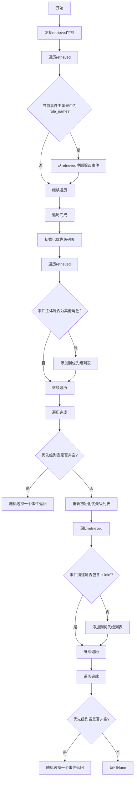

#### 带注释源码

```python
def _choose_retrieved(role_name: str, retrieved: dict) -> Union[None, dict]:
    """
    从检索到的多个事件中，为当前角色选择一个需要响应的事件。
    该函数首先过滤掉与角色自身相关的事件，然后优先选择涉及其他角色的事件，最后选择非空闲事件。
    如果没有任何合适的事件，则返回 `None`。

    参数:
        role_name: 当前角色的名称，用于过滤掉与自身相关的事件。
        retrieved: 从角色关联记忆中检索到的事件字典，格式为:
                   {事件描述: {"curr_event": <ConceptNode>, "events": [<ConceptNode>, ...], "thoughts": [<ConceptNode>, ...]}}。

    返回值:
        如果找到合适的事件，返回对应的事件上下文字典；否则返回 `None`。
    """
    # 复制retrieved字典以避免在遍历过程中修改原始字典
    copy_retrieved = retrieved.copy()
    # 遍历复制的字典，过滤掉与当前角色自身相关的事件
    for event_desc, rel_ctx in copy_retrieved.items():
        curr_event = rel_ctx["curr_event"]
        # 如果事件的主体是当前角色，则从retrieved中删除该事件
        if curr_event.subject == role_name:
            del retrieved[event_desc]

    # 优先选择涉及其他角色的事件
    priority = []
    for event_desc, rel_ctx in retrieved.items():
        curr_event = rel_ctx["curr_event"]
        # 检查事件主体是否为其他角色（即不包含冒号且不是当前角色）
        if ":" not in curr_event.subject and curr_event.subject != role_name:
            priority += [rel_ctx]
    # 如果存在涉及其他角色的事件，随机选择一个返回
    if priority:
        return random.choice(priority)

    # 如果没有涉及其他角色的事件，则选择非空闲事件
    for event_desc, rel_ctx in retrieved.items():
        # 检查事件描述中是否包含"is idle"，如果不包含则添加到优先级列表
        if "is idle" not in event_desc:
            priority += [rel_ctx]
    # 如果存在非空闲事件，随机选择一个返回
    if priority:
        return random.choice(priority)
    # 如果没有合适的事件，返回None
    return None
```

### `_should_react`

该函数是斯坦福小镇模拟中智能体（角色）决策系统的核心反应决策模块。它评估当前智能体在感知到外部事件（通常是其他智能体的活动）后，应采取何种反应模式。函数通过分析检索到的记忆事件、当前智能体状态以及目标智能体状态，决定是发起对话、等待、进行其他反应，还是不做任何反应。

参数：

- `role`：`"STRole"`，当前正在决策其行动的智能体实例。
- `retrieved`：`dict`，从智能体联想记忆中检索到的事件字典，格式为 `{事件描述: {"curr_event": <ConceptNode>, "events": [...], "thoughts": [...]}}`，包含了需要做出反应的核心事件及其相关上下文。
- `roles`：`dict`，包含所有智能体名称（键）和对应`STRole`实例（值）的字典，用于根据事件主题查找目标智能体。

返回值：`Union[str, bool]`，返回一个字符串或布尔值，表示反应模式。可能的返回值包括：
  - `"chat with {target_role.name}"`：表示应与目标智能体发起对话。
  - `"wait: {wait_until}"`：表示应等待至指定时间。
  - `False`：表示不采取任何反应。

#### 流程图

```mermaid
flowchart TD
    A[开始: _should_react] --> B{角色正在聊天?<br>或处于等待状态?}
    B -- 是 --> C[返回 False]
    B -- 否 --> D[获取检索事件 curr_event]
    D --> E{curr_event.subject<br>是否为其他角色?}
    E -- 否<br>（非角色事件） --> C
    E -- 是 --> F[调用 lets_talk<br>检查是否发起对话]
    F --> G{lets_talk 返回 True?}
    G -- 是 --> H[返回 'chat with {target}']
    G -- 否 --> I[调用 lets_react<br>检查其他反应]
    I --> J{lets_react 返回结果?}
    J -- 返回等待字符串 --> K[返回 'wait: {time}']
    J -- 返回 False --> C
    J -- 返回其他字符串 --> L[返回该字符串]
```

#### 带注释源码

```python
async def _should_react(role: "STRole", retrieved: dict, roles: dict):
    """
    根据检索到的值，决定角色应表现出何种形式的反应。
    输入:
      role: 当前正在决策其行动的<"STRole">实例。
      retrieved: 从角色联想记忆中检索到的<ConceptNode>字典。格式为:
                 dictionary[event.description] =
                   {["curr_event"] = <ConceptNode>,
                    ["events"] = [<ConceptNode>, ...],
                    ["thoughts"] = [<ConceptNode>, ...] }
      roles: 包含所有角色名称（键）和<"STRole">实例（值）的字典。
    """

    # 内部函数：评估两个角色是否应该发起对话
    async def lets_talk(init_role: "STRole", target_role: "STRole", retrieved: dict):
        # 1. 不能和自己对话
        if init_role.name == target_role.name:
            logger.info(f"Role: {role.name} _should_react lets_talk meet same role, return False")
            return False

        scratch = init_role.rc.scratch
        target_scratch = target_role.rc.scratch
        # 2. 双方都必须有当前活动地址和描述
        if (
            not target_scratch.act_address
            or not target_scratch.act_description
            or not scratch.act_address
            or not scratch.act_description
        ):
            return False

        # 3. 任何一方都不能在睡觉
        if "sleeping" in target_scratch.act_description or "sleeping" in scratch.act_description:
            return False

        # 4. 避免在深夜（23点）发起对话
        if scratch.curr_time.hour == 23:
            return False

        # 5. 目标角色不能正在等待
        if "<waiting>" in target_scratch.act_address:
            return False

        # 6. 任何一方都不能已经在聊天中
        if target_scratch.chatting_with or scratch.chatting_with:
            return False

        # 7. 检查与目标角色的聊天缓冲是否已冷却
        if target_role.name in scratch.chatting_with_buffer:
            if scratch.chatting_with_buffer[target_role.name] > 0:
                return False

        # 8. 调用专门的决策模块进行最终判断
        if await DecideToTalk().run(init_role, target_role, retrieved):
            return True

        return False

    # 内部函数：评估是否应采取“等待”或“做其他事”等非对话反应
    async def lets_react(init_role: "STRole", target_role: "STRole", retrieved: dict):
        # 1. 不能对自己做出反应
        if init_role.name == target_role.name:
            logger.info(f"Role: {role.name} _should_react lets_react meet same role, return False")
            return False

        scratch = init_role.rc.scratch
        target_scratch = target_role.rc.scratch
        # 2. 双方都必须有当前活动地址和描述
        if (
            not target_scratch.act_address
            or not target_scratch.act_description
            or not scratch.act_address
            or not scratch.act_description
        ):
            return False

        # 3. 任何一方都不能在睡觉
        if "sleeping" in target_scratch.act_description or "sleeping" in scratch.act_description:
            return False

        # 4. 避免在深夜（23点）做出反应
        if scratch.curr_time.hour == 23:
            return False

        # 5. 目标角色不能正在等待
        if "waiting" in target_scratch.act_description:
            return False
        # 6. 发起方必须有计划好的路径
        if scratch.planned_path == []:
            return False

        # 7. 双方必须在同一地点（活动地址相同）
        if scratch.act_address != target_scratch.act_address:
            return False

        # 8. 调用决策模块，可能返回“1”（等待）、“2”（做其他事）或其他
        react_mode = await DecideToTalk().run(init_role, target_role, retrieved)

        if react_mode == "1":
            # 计算等待结束时间（目标活动结束前1分钟）
            wait_until = (
                target_scratch.act_start_time + datetime.timedelta(minutes=target_scratch.act_duration - 1)
            ).strftime("%B %d, %Y, %H:%M:%S")
            return f"wait: {wait_until}"
        elif react_mode == "2":
            # 注释掉的代码，可能代表“做其他事”的反应，当前版本返回False
            return False
            # return "do other things"
        else:
            # 其他情况，如“保持”，返回False
            return False  # "keep"

    # 主逻辑开始
    # 如果角色当前正在聊天，默认不做出其他反应
    scratch = role.rc.scratch
    if scratch.chatting_with:
        return False
    # 如果角色当前处于等待状态，也不做出反应
    if "<waiting>" in scratch.act_address:
        return False

    # 从检索结果中获取核心事件
    # retrieved 格式: dictionary {["curr_event"] = <ConceptNode>}
    curr_event = retrieved["curr_event"]
    logger.info(f"Role: {role.name} _should_react curr_event.subject: {curr_event.subject}")

    # 判断事件主题是否为另一个角色（不含冒号的主题通常是角色名）
    if ":" not in curr_event.subject:
        # 这是一个关于其他角色的事件
        # 首先检查是否应该发起对话
        if await lets_talk(role, roles[curr_event.subject], retrieved):
            return f"chat with {curr_event.subject}"
        # 如果不对话，则检查是否应采取其他反应（如等待）
        react_mode = await lets_react(role, roles[curr_event.subject], retrieved)
        return react_mode
    # 如果事件主题不是角色（例如是物体或概念事件），则不反应
    return False
```

### `_chat_react`

该函数是角色（agent）在决定与另一个角色进行对话后的反应处理函数。它负责初始化对话、生成对话内容、创建对话摘要，并更新两个参与角色的日程安排和状态，以反映这次对话事件。

参数：

- `role`：`STRole`，发起对话的角色实例。
- `reaction_mode`：`str`，反应模式字符串，格式为`"chat with {target_role.name}"`，指示要与哪个目标角色聊天。
- `roles`：`dict["STRole"]`，包含所有角色名称和对应实例的字典。

返回值：`None`，该函数不返回任何值，而是通过副作用更新角色状态。

#### 流程图

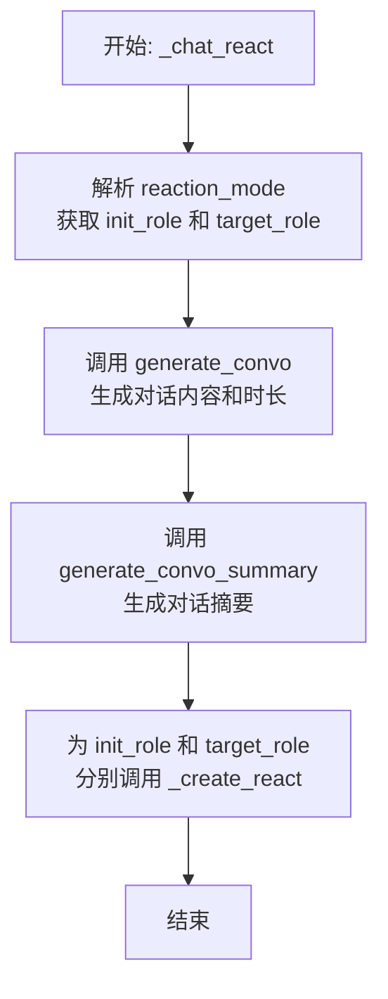

#### 带注释源码

```python
async def _chat_react(role: "STRole", reaction_mode: str, roles: dict["STRole"]):
    # 从反应模式字符串中提取目标角色名称，并获取对应的角色实例。
    # 发起对话的角色是传入的 `role` 参数。
    init_role = role
    target_role = roles[reaction_mode[9:].strip()]

    # 调用 `generate_convo` 函数，让两个角色进行对话，返回对话内容列表和估算的对话时长（分钟）。
    convo, duration_min = await generate_convo(init_role, target_role)  # 2222
    # 调用 `generate_convo_summary` 函数，根据对话内容生成一个简短的摘要。
    convo_summary = await generate_convo_summary(convo)
    # 将对话摘要作为要插入日程的新活动描述。
    inserted_act = convo_summary
    # 新活动的持续时间为对话时长。
    inserted_act_dur = duration_min

    # 获取目标角色当前活动的开始时间，作为对话活动的参考开始时间。
    act_start_time = target_role.rc.scratch.act_start_time

    # 计算对话的结束时间。
    curr_time = target_role.rc.scratch.curr_time
    if curr_time.second != 0:
        # 如果当前时间秒数不为0，则调整到下一分钟的整点开始。
        temp_curr_time = curr_time + datetime.timedelta(seconds=60 - curr_time.second)
        chatting_end_time = temp_curr_time + datetime.timedelta(minutes=inserted_act_dur)
    else:
        # 如果当前时间秒数为0，则直接从当前时间开始。
        chatting_end_time = curr_time + datetime.timedelta(minutes=inserted_act_dur)

    # 循环处理对话的双方：发起者（init）和目标（target）。
    for role, p in [("init", init_role), ("target", target_role)]:
        if role == "init":
            # 为发起者设置活动参数：地址指向目标角色，事件类型为“chat with”。
            act_address = f"<persona> {target_role.name}"
            act_event = (p.name, "chat with", target_role.name)
            chatting_with = target_role.name # 记录正在与谁聊天
            chatting_with_buffer = {} # 初始化聊天缓冲区
            chatting_with_buffer[target_role.name] = 800 # 设置一个较长的冷却时间，防止立即重复对话
        elif role == "target":
            # 为目标角色设置活动参数：地址指向发起者，事件类型为“chat with”。
            act_address = f"<persona> {init_role.name}"
            act_event = (p.name, "chat with", init_role.name)
            chatting_with = init_role.name
            chatting_with_buffer = {}
            chatting_with_buffer[init_role.name] = 800

        # 设置活动的其他元数据：表情符号、对象描述等（对话活动通常没有具体对象）。
        act_pronunciatio = "💬"
        act_obj_description = None
        act_obj_pronunciatio = None
        act_obj_event = (None, None, None)

        # 调用 `_create_react` 函数，将这次对话活动插入到角色的日程中，并更新其所有相关状态。
        await _create_react(
            p, # 当前正在处理的角色实例（p 是 init_role 或 target_role）
            inserted_act, # 活动描述：对话摘要
            inserted_act_dur, # 活动时长：对话估算时长
            act_address, # 活动地址：`<persona> {对方角色名}`
            act_event, # 活动事件元组：(自身名, "chat with", 对方角色名)
            chatting_with, # 正在聊天的对象
            convo, # 完整的对话内容列表
            chatting_with_buffer, # 聊天缓冲区字典
            chatting_end_time, # 聊天预计结束时间
            act_pronunciatio, # 活动表情符号
            act_obj_description, # 活动对象描述（无）
            act_obj_pronunciatio, # 活动对象表情符号（无）
            act_obj_event, # 活动对象事件（无）
            act_start_time, # 活动开始时间（参考目标角色的原活动开始时间）
        )
```

### `_create_react`

该函数是斯坦福小镇模拟中角色反应系统的核心执行器。当角色决定对感知到的事件（如与其他角色聊天或等待）做出反应时，此函数负责更新角色的日程安排和内部状态。其主要功能是：根据传入的反应参数（如聊天内容、持续时间、地点等），在角色的每日计划中插入一个新的活动，并相应地更新角色的当前动作、聊天状态和计划路径。

参数：

- `role`：`STRole`，需要执行反应动作的角色实例。
- `inserted_act`：`str`，要插入到日程中的新活动描述。
- `inserted_act_dur`：`int`，新活动的持续时间（分钟）。
- `act_address`：`str`，新活动发生的地点描述。
- `act_event`：`Tuple`，描述事件的三元组（主语，谓词，宾语）。
- `chatting_with`：`str`，正在与之聊天的角色名称，如果没有则为`None`。
- `chat`：`list`，聊天的对话内容列表，如果没有则为`None`。
- `chatting_with_buffer`：`dict`，一个缓冲区字典，用于防止角色立即与同一目标再次聊天，键为角色名，值为缓冲计数。
- `chatting_end_time`：`datetime`，聊天预计结束的时间。
- `act_pronunciatio`：`str`，活动的表情符号表示。
- `act_obj_description`：`str`，活动对象的描述，如果没有则为`None`。
- `act_obj_pronunciatio`：`str`，活动对象的表情符号表示，如果没有则为`None`。
- `act_obj_event`：`Tuple`，描述活动对象事件的三元组，如果没有则为`(None, None, None)`。
- `act_start_time`：`datetime`，可选参数，活动的开始时间。如果未提供，则使用角色日程中的上下文来计算。

返回值：`None`，该函数通过修改传入的`role`对象的内部状态（如`scratch`属性）来执行操作，没有显式返回值。

#### 流程图

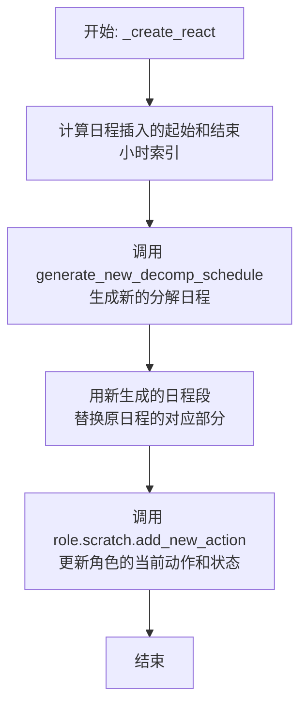

#### 带注释源码

```python
async def _create_react(
    role: "STRole",                     # 要执行反应的角色
    inserted_act: str,                  # 要插入的新活动描述（如“与X聊天”）
    inserted_act_dur: int,              # 新活动的持续时间（分钟）
    act_address: str,                   # 活动地点（如“<persona> Y”）
    act_event: Tuple,                   # 事件三元组（角色名，动作，目标）
    chatting_with: str,                 # 聊天对象的名字，若无则为None
    chat: list,                         # 对话内容列表，若无则为None
    chatting_with_buffer: dict,         # 聊天缓冲字典，防止立即重复聊天
    chatting_end_time: datetime,        # 聊天预计结束时间
    act_pronunciatio: str,              # 活动的表情符号（如“💬”）
    act_obj_description: str,           # 活动对象的描述
    act_obj_pronunciatio: str,          # 活动对象的表情符号
    act_obj_event: Tuple,               # 活动对象的事件三元组
    act_start_time=None,                # 可选：活动开始时间
):
    p = role                           # 角色别名，便于引用
    scratch = role.rc.scratch          # 角色的临时“便签”数据区

    # 1. 计算在每日计划中插入新活动的起始和结束小时。
    #    逻辑基于角色原始每小时计划（f_daily_schedule_hourly_org）的当前索引。
    min_sum = 0
    for i in range(scratch.get_f_daily_schedule_hourly_org_index()):
        min_sum += scratch.f_daily_schedule_hourly_org[i][1]
    start_hour = int(min_sum / 60) # 计算起始小时

    # 根据当前计划项的持续时间决定结束小时。
    if scratch.f_daily_schedule_hourly_org[scratch.get_f_daily_schedule_hourly_org_index()][1] >= 120:
        end_hour = (
            start_hour + scratch.f_daily_schedule_hourly_org[scratch.get_f_daily_schedule_hourly_org_index()][1] / 60
        )
    elif (
        scratch.f_daily_schedule_hourly_org[scratch.get_f_daily_schedule_hourly_org_index()][1]
        + scratch.f_daily_schedule_hourly_org[scratch.get_f_daily_schedule_hourly_org_index() + 1][1]
    ):
        end_hour = start_hour + (
            (
                scratch.f_daily_schedule_hourly_org[scratch.get_f_daily_schedule_hourly_org_index()][1]
                + scratch.f_daily_schedule_hourly_org[scratch.get_f_daily_schedule_hourly_org_index() + 1][1]
            )
            / 60
        )
    else:
        end_hour = start_hour + 2 # 默认增加2小时
    end_hour = int(end_hour)

    # 2. 根据计算出的起止小时，找到在详细日程列表(f_daily_schedule)中对应的起止索引。
    dur_sum = 0
    count = 0
    start_index = None
    end_index = None
    for act, dur in scratch.f_daily_schedule:
        if dur_sum >= start_hour * 60 and start_index is None:
            start_index = count
        if dur_sum >= end_hour * 60 and end_index is None:
            end_index = count
        dur_sum += dur
        count += 1

    # 3. 调用外部函数，生成在指定时间窗口内包含新活动的重新分解的日程段。
    ret = await generate_new_decomp_schedule(p, inserted_act, inserted_act_dur, start_hour, end_hour)

    # 4. 用新生成的日程段替换原日程中对应部分。
    scratch.f_daily_schedule[start_index:end_index] = ret

    # 5. 调用角色的内部方法，更新其当前动作、聊天状态、位置等所有相关属性。
    scratch.add_new_action(
        act_address,
        inserted_act_dur,
        inserted_act,
        act_pronunciatio,
        act_event,
        chatting_with,
        chat,
        chatting_with_buffer,
        chatting_end_time,
        act_obj_description,
        act_obj_pronunciatio,
        act_obj_event,
        act_start_time,
    )
```

### `_wait_react`

`_wait_react` 函数用于处理角色（agent）的“等待”反应。当角色决定等待某个事件（通常是另一个角色完成其当前活动）时，此函数会创建一个新的“等待”动作，并更新角色的日程安排。具体来说，它会计算等待的持续时间，设置等待的地址和事件描述，并调用 `_create_react` 函数来实际插入这个等待动作到角色的日程中。

参数：

- `role`：`STRole`，当前正在执行等待反应的角色实例。
- `reaction_mode`：`str`，反应模式字符串，格式为 `"wait: {wait_until}"`，其中 `{wait_until}` 是等待结束的时间点（格式为 `"%B %d, %Y, %H:%M:%S"`）。

返回值：`None`，此函数不返回任何值，但会通过调用 `_create_react` 更新角色的内部状态和日程。

#### 流程图

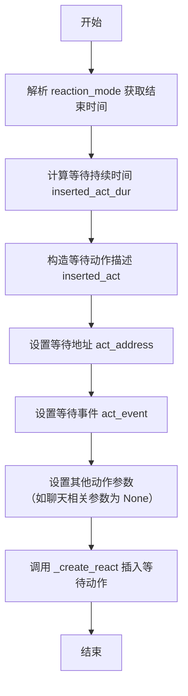

#### 带注释源码

```python
async def _wait_react(role: "STRole", reaction_mode: str):
    # 获取角色的临时数据存储区（scratch space）
    scratch = role.rc.scratch

    # 构造等待动作的描述。
    # 例如，如果角色原本计划“正在写报告”，则等待动作描述为“waiting to start 写报告”。
    inserted_act = f'waiting to start {scratch.act_description.split("(")[-1][:-1]}'
    
    # 从 reaction_mode 字符串中解析出等待的结束时间。
    # reaction_mode 格式示例: "wait: October 31, 2022, 14:30:00"
    end_time = datetime.datetime.strptime(reaction_mode[6:].strip(), "%B %d, %Y, %H:%M:%S")
    
    # 计算等待的持续时间（以分钟为单位）。
    # 公式: (结束时间的总分钟数) - (当前时间的总分钟数) + 1
    # 加1可能是为了确保至少等待1分钟，或者处理边界情况。
    inserted_act_dur = (
        (end_time.minute + end_time.hour * 60) - (scratch.curr_time.minute + scratch.curr_time.hour * 60) + 1
    )

    # 设置等待动作发生的地点。这里格式化为“<waiting> {x坐标} {y坐标}”。
    act_address = f"<waiting> {scratch.curr_tile[0]} {scratch.curr_tile[1]}"
    
    # 设置等待事件的三元组：(主体, 谓词, 客体)。
    # 例如: ('John Doe', 'waiting to start', '写报告')
    act_event = (role.name, "waiting to start", scratch.act_description.split("(")[-1][:-1])
    
    # 由于是等待动作，不涉及聊天，因此将聊天相关参数设为 None。
    chatting_with = None
    chat = None
    chatting_with_buffer = None
    chatting_end_time = None

    # 设置动作的符号表示（用于UI或日志）和其他对象相关参数（此处未使用）。
    act_pronunciatio = "⌛"  # 等待的符号
    act_obj_description = None
    act_obj_pronunciatio = None
    act_obj_event = (None, None, None)

    # 调用 _create_react 函数，将构造好的等待动作插入到角色的日程安排中。
    await _create_react(
        role,
        inserted_act,
        inserted_act_dur,
        act_address,
        act_event,
        chatting_with,
        chat,
        chatting_with_buffer,
        chatting_end_time,
        act_pronunciatio,
        act_obj_description,
        act_obj_pronunciatio,
        act_obj_event,
    )
```

### `generate_convo`

该函数用于生成两个角色之间的对话内容，并计算对话的预估时长。它通过调用`agent_conversation`函数获取对话内容，然后根据对话文本的长度估算对话持续时间。

参数：

- `init_role`：`STRole`，发起对话的角色实例
- `target_role`：`STRole`，对话目标角色实例

返回值：`Union[list, int]`，返回一个包含对话列表和预估时长的元组

#### 流程图

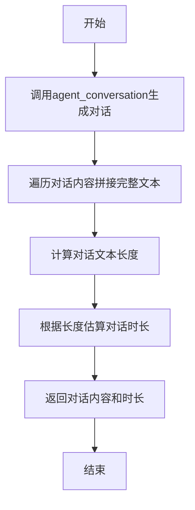

#### 带注释源码

```python
async def generate_convo(init_role: "STRole", target_role: "STRole") -> Union[list, int]:
    # 调用agent_conversation函数生成两个角色之间的对话
    convo = await agent_conversation(init_role, target_role)
    all_utt = ""

    # 遍历对话内容，将每个发言者的发言拼接成完整文本
    for row in convo:
        speaker = row[0]  # 发言者
        utt = row[1]      # 发言内容
        all_utt += f"{speaker}: {utt}\n"

    # 计算对话时长：基于文本长度估算，每8个字符约等于30分钟
    convo_length = math.ceil(int(len(all_utt) / 8) / 30)

    # 返回对话内容和预估时长
    return convo, convo_length
```

### `generate_convo_summary`

该函数用于生成对话摘要。它接收一个对话列表作为输入，调用`SummarizeConv`动作的`run`方法，生成并返回对话的摘要字符串。

参数：

- `conv`：`list[list[str]]`，包含对话内容的列表，每个元素是一个列表，表示一条对话记录，通常包含说话者和对话内容。

返回值：`str`，返回对话的摘要字符串。

#### 流程图

```mermaid
graph TD
    A[开始] --> B[接收对话列表 conv]
    B --> C[调用 SummarizeConv().run(conv)]
    C --> D[生成对话摘要 conv_summary]
    D --> E[返回 conv_summary]
    E --> F[结束]
```

#### 带注释源码

```python
async def generate_convo_summary(conv: list[list[str]]) -> str:
    # 调用 SummarizeConv 动作的 run 方法，传入对话列表 conv
    conv_summary = await SummarizeConv().run(conv)
    # 返回生成的对话摘要
    return conv_summary
```

### `generate_new_decomp_schedule`

该函数是斯坦福小镇模拟中角色日程规划系统的核心组件。当角色因外部事件（如对话）需要临时插入新活动时，此函数负责重新规划并分解指定时间段内的日程。它通过分析当前日程、截取受影响时段、插入新活动，并调用`NewDecompSchedule`动作来生成新的、分解后的日程片段，确保角色的日常活动在时间上保持连贯和合理。

参数：

- `role`：`STRole`，需要重新规划日程的角色实例。
- `inserted_act`：`str`，需要插入的新活动描述。
- `inserted_act_dur`：`int`，新活动的预计持续时间（分钟）。
- `start_hour`：`int`，受影响的日程片段的开始小时（24小时制）。
- `end_hour`：`int`，受影响的日程片段的结束小时（24小时制）。

返回值：`list`，返回一个列表，其中包含重新规划并分解后的日程片段。每个元素是一个`[活动描述, 持续时间]`的列表。

#### 流程图

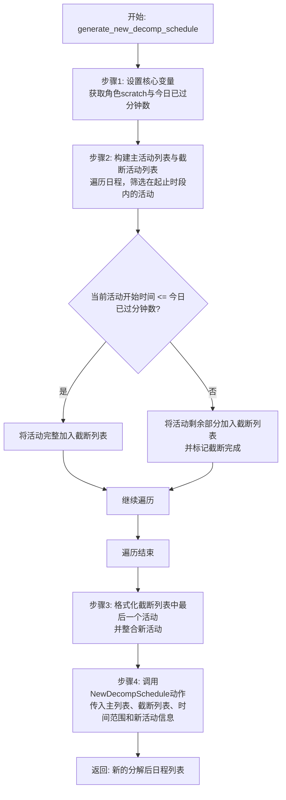

#### 带注释源码

```python
async def generate_new_decomp_schedule(
    role: "STRole", inserted_act: str, inserted_act_dur: int, start_hour: int, end_hour: int
):
    # Step 1: 设置函数的核心变量。
    # <scratch> 是当前正在编辑其日程的角色的临时数据空间。
    scratch = role.rc.scratch
    # <today_min_pass> 表示今天已经过去的分钟数。
    today_min_pass = int(scratch.curr_time.hour) * 60 + int(scratch.curr_time.minute) + 1

    # Step 2: 我们需要创建 <main_act_dur> 和 <truncated_act_dur>。
    # main_act_dur: 在指定起止时间内完整的活动列表。
    # truncated_act_dur: 考虑当前时间后需要被“截断”或调整的活动列表，用于后续重新规划。
    main_act_dur = []
    truncated_act_dur = []
    dur_sum = 0  # 持续时间累加和
    count = 0    # 枚举计数器
    truncated_fin = False # 标记是否已完成对当前时间点活动的截断

    logger.debug(f"DEBUG::: {scratch.name}")
    # 遍历角色的完整每日日程
    for act, dur in scratch.f_daily_schedule:
        # 判断活动是否在受影响的起止时间范围内
        if (dur_sum >= start_hour * 60) and (dur_sum < end_hour * 60):
            # 如果在范围内，加入主活动列表
            main_act_dur += [[act, dur]]
            # 判断该活动是否已经开始（开始时间 <= 当前已过时间）
            if dur_sum <= today_min_pass:
                # 如果已经开始，完整地加入到截断列表
                truncated_act_dur += [[act, dur]]
            elif dur_sum > today_min_pass and not truncated_fin:
                # 如果活动尚未开始且是第一个未开始的活动，则进行截断。
                # 将当前活动加入截断列表，但持续时间调整为从当前时间到活动结束的剩余时间。
                truncated_act_dur += [[scratch.f_daily_schedule[count][0], dur_sum - today_min_pass]]
                # 调整持续时间：原计划持续时间 - (活动开始时间 - 当前时间)
                # 注释提到此处有调试痕迹，关于是否+1的决策。
                truncated_act_dur[-1][-1] -= (dur_sum - today_min_pass)
                logger.debug(f"DEBUG::: {truncated_act_dur}")
                truncated_fin = True # 标记截断已完成，后续活动将完整加入
        dur_sum += dur
        count += 1

    main_act_dur = main_act_dur # 此行无实际作用，可能是调试遗留或为清晰起见。

    # 步骤3: 对截断列表中的最后一个活动描述进行格式化。
    # 例如，将“去公园”格式化为“去公园（在去公园的路上）”。
    x = (
        truncated_act_dur[-1][0].split("(")[0].strip()
        + " (on the way to "
        + truncated_act_dur[-1][0].split("(")[-1][:-1]
        + ")"
    )
    truncated_act_dur[-1][0] = x

    # 如果截断的最后一个活动描述中包含括号，则将新插入的活动描述整合到相同的格式中。
    if "(" in truncated_act_dur[-1][0]:
        inserted_act = truncated_act_dur[-1][0].split("(")[0].strip() + " (" + inserted_act + ")"

    # 将新活动及其持续时间添加到截断活动列表的末尾。
    # 注释指出 inserted_act_dur+1 是一个重要但影响未完全明确的决策。
    truncated_act_dur += [[inserted_act, inserted_act_dur]]
    
    # 创建起止时间的datetime对象（使用一个固定的基准日期）。
    start_time_hour = datetime.datetime(2022, 10, 31, 0, 0) + datetime.timedelta(hours=start_hour)
    end_time_hour = datetime.datetime(2022, 10, 31, 0, 0) + datetime.timedelta(hours=end_hour)

    # 步骤4: 调用 NewDecompSchedule 动作来执行核心的日程分解与重新规划逻辑。
    # 传入主活动列表、截断活动列表、时间范围以及新活动信息。
    return await NewDecompSchedule().run(
        role, main_act_dur, truncated_act_dur, start_time_hour, end_time_hour, inserted_act, inserted_act_dur
    )
```

### `_long_term_planning`

该函数是角色长期规划的核心方法，负责在“新的一天”开始时，为角色制定当天的长期计划。其主要功能包括：1) 确定角色的起床时间；2) 根据起床时间生成当天的“每日需求”列表；3) 基于每日需求生成详细的每小时日程安排；4) 将生成的计划存储到角色的记忆中。该函数仅在“新的一天”或“第一天”时被调用，是角色日常行为逻辑的起点。

参数：

- `role`：`STRole`，当前需要进行长期规划的角色实例。
- `new_day`：`bool`，指示当前是否为新的一天。其值可以是 `"First day"`（第一天）、`"New day"`（新的一天）或 `False`（不是新的一天）。

返回值：`None`，该函数不返回任何值，其作用是通过修改 `role` 实例的内部状态（如 `scratch.daily_req`、`scratch.f_daily_schedule` 等）来完成规划。

#### 流程图

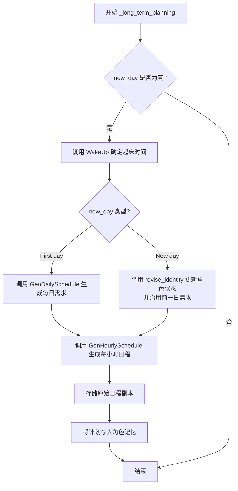

#### 带注释源码

```python
async def _long_term_planning(role: "STRole", new_day: bool):
    """
    如果新的一天开始，则制定角色的每日长期计划。
    这基本上包括两个部分：首先，我们创建起床时间，其次，我们基于它创建每小时日程。
    输入
        new_day: 指示当前时间是否表示“第一天”、“新的一天”或False（两者都不是）。
                这很重要，因为我们在新的一天创建角色的长期计划。
    """
    # 我们首先为角色创建起床时间。
    wake_up_hour = await WakeUp().run(role)  # 调用 WakeUp 动作获取起床时间
    wake_up_hour = int(wake_up_hour)  # 确保起床时间为整数
    logger.info(f"Role: {role.name} long_term_planning, wake_up_hour: {wake_up_hour}")

    # 当是新的一天时，我们首先创建角色的 daily_req。
    # 注意，daily_req 是一个字符串列表，粗略地描述了角色的一天。
    if new_day == "First day":
        # 在生成开始时引导每日计划：
        # 如果这是生成的开始（因此没有前一天的每日需求），或者如果我们在新的一天，
        # 我们希望创建一组新的每日需求。
        role.scratch.daily_req = await GenDailySchedule().run(role, wake_up_hour)  # 生成每日需求
        logger.info(f"Role: {role.name} daily requirements: {role.scratch.daily_req}")
    elif new_day == "New day":
        revise_identity(role)  # 更新角色的身份和状态

        # - - - - - - - - - - - - - - - - - - - - - - - - - - - - - - - - - - - - TODO
        # 我们需要在这里创建一个新的 daily_req...
        role.scratch.daily_req = role.scratch.daily_req  # 当前逻辑是沿用前一天的，TODO 标记表示待完善

    # 基于 daily_req，我们为角色创建一个每小时日程，
    # 这是一个待办事项列表，带有时间持续时间（以分钟为单位），总计24小时。
    role.scratch.f_daily_schedule = await GenHourlySchedule().run(role, wake_up_hour)  # 生成每小时日程
    logger.info(f"Role: {role.name} f_daily_schedule: {role.scratch.f_daily_schedule}")
    role.scratch.f_daily_schedule_hourly_org = role.scratch.f_daily_schedule[:]  # 存储原始日程的副本

    # 3月4日新增 -- 将计划添加到记忆中。
    thought = f"This is {role.scratch.name}'s plan for {role.scratch.curr_time.strftime('%A %B %d')}:"  # 创建计划描述
    for i in role.scratch.daily_req:
        thought += f" {i},"
    thought = thought[:-1] + "."  # 格式化字符串
    created = role.scratch.curr_time  # 创建时间
    expiration = role.scratch.curr_time + datetime.timedelta(days=30)  # 过期时间（30天后）
    s, p, o = (role.scratch.name, "plan", role.scratch.curr_time.strftime("%A %B %d"))  # 记忆三元组
    keywords = set(["plan"])  # 关键词
    thought_poignancy = 5  # 重要性
    thought_embedding_pair = (thought, get_embedding(thought))  # 嵌入向量
    # 将计划作为一条“想法”存入角色的联想记忆中
    role.a_mem.add_thought(
        created, expiration, s, p, o, thought, keywords, thought_poignancy, thought_embedding_pair, None
    )
```

### `_determine_action`

该方法用于为角色（`STRole`）确定并生成下一个动作序列。其主要功能是检查当前动作是否已完成，若已完成，则根据角色的日程安排（`f_daily_schedule`）分解任务并生成新的动作细节，最后将新动作添加到角色的待执行队列中。

参数：

- `role`：`STRole`，当前需要确定动作的角色实例。

返回值：`None`，该方法不返回任何值，但会更新角色的内部状态（如`scratch`中的动作队列）。

#### 流程图

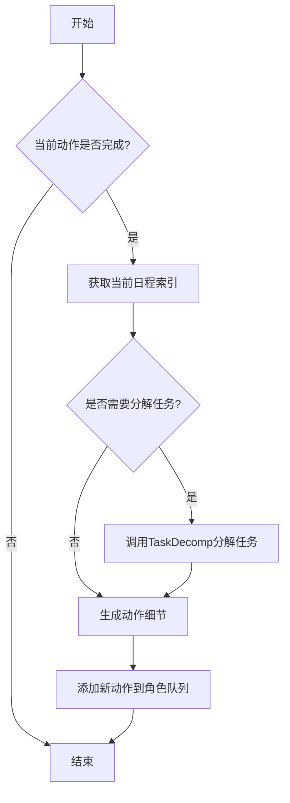

#### 带注释源码

```python
async def _determine_action(role: "STRole"):
    """
    为角色创建下一个动作序列。
    主要目标是在角色的暂存空间（scratch）上运行“add_new_action”，
    为下一个动作设置所有相关的动作变量。
    在此过程中，角色可能需要根据需要分解其每小时日程。
    输入：
        role: 当前需要确定动作的<Persona>实例。
    """

    def determine_decomp(act_desp, act_dura):
        """
        根据动作描述和持续时间，判断是否需要分解该动作。
        如果动作涉及睡眠，通常不分解。
        输入：
            act_desp: 动作描述（例如，“sleeping”）
            act_dura: 动作持续时间（分钟）
        输出：
            布尔值。True表示需要分解，False表示不需要。
        """
        if "sleep" not in act_desp and "bed" not in act_desp:
            return True
        elif "sleeping" in act_desp or "asleep" in act_desp or "in bed" in act_desp:
            return False
        elif "sleep" in act_desp or "bed" in act_desp:
            if act_dura > 60:
                return False
        return True

    # 获取当前日程索引
    curr_index = role.scratch.get_f_daily_schedule_index()
    curr_index_60 = role.scratch.get_f_daily_schedule_index(advance=60)

    logger.info(f"f_daily_schedule: {role.scratch.f_daily_schedule}")
    # * 分解任务 *
    # 在一天的第一个小时，需要分解两小时的任务序列。
    if curr_index == 0:
        # 如果是当天的第一个小时
        act_desp, act_dura = role.scratch.f_daily_schedule[curr_index]
        if act_dura >= 60:
            # 如果下一个动作超过一小时且符合分解条件，则分解
            if determine_decomp(act_desp, act_dura):
                role.scratch.f_daily_schedule[curr_index : curr_index + 1] = await TaskDecomp().run(
                    role, act_desp, act_dura
                )
        if curr_index_60 + 1 < len(role.scratch.f_daily_schedule):
            act_desp, act_dura = role.scratch.f_daily_schedule[curr_index_60 + 1]
            if act_dura >= 60:
                if determine_decomp(act_desp, act_dura):
                    role.scratch.f_daily_schedule[curr_index_60 + 1 : curr_index_60 + 2] = await TaskDecomp().run(
                        role, act_desp, act_dura
                    )

    if curr_index_60 < len(role.scratch.f_daily_schedule):
        # 如果不是当天的第一个小时，始终调用此部分（也在第一个小时调用，以便一次性分解两小时）。
        if role.scratch.curr_time.hour < 23:
            # 晚上11点后不分解任务
            act_desp, act_dura = role.scratch.f_daily_schedule[curr_index_60]
            if act_dura >= 60:
                if determine_decomp(act_desp, act_dura):
                    role.scratch.f_daily_schedule[curr_index_60 : curr_index_60 + 1] = await TaskDecomp().run(
                        role, act_desp, act_dura
                    )
    # * 分解结束 *

    # 从动作描述和持续时间生成<Action>实例。此时，假设所有相关动作已分解并准备在f_daily_schedule中。
    logger.debug("DEBUG LJSDLFSKJF")
    for i in role.scratch.f_daily_schedule:
        logger.debug(i)
    logger.debug(curr_index)
    logger.debug(len(role.scratch.f_daily_schedule))
    logger.debug(role.scratch.name)

    # 确保日程总时长为1440分钟（24小时）
    x_emergency = 0
    for i in role.scratch.f_daily_schedule:
        x_emergency += i[1]

    if 1440 - x_emergency > 0:
        logger.info(f"x_emergency__AAA: {x_emergency}")
    role.scratch.f_daily_schedule += [["sleeping", 1440 - x_emergency]]

    # 获取当前索引对应的动作描述和持续时间
    act_desp, act_dura = role.scratch.f_daily_schedule[curr_index]

    # 生成动作细节
    new_action_details = await GenActionDetails().run(role, act_desp, act_dura)
    # 将新动作添加到角色的队列中
    role.scratch.add_new_action(**new_action_details)
```

### `revise_identity`

该函数用于在角色开始新的一天时，根据其过去的记忆和当前状态，更新其身份认知、当前状态和每日计划。它通过检索角色相关的记忆，生成新的状态描述和每日计划，从而模拟角色对自身经历的反思和规划。

参数：

- `role`：`STRole`，表示当前角色实例，包含角色的记忆、状态和计划等信息。

返回值：`None`，该函数不返回任何值，直接修改传入的`role`对象的`scratch.currently`和`scratch.daily_plan_req`属性。

#### 流程图

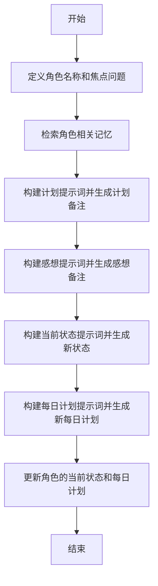

#### 带注释源码

```python
def revise_identity(role: "STRole"):
    # 获取角色的名称
    p_name = role.scratch.name

    # 定义检索记忆时的焦点问题，关注角色的计划和重要事件
    focal_points = [
        f"{p_name}'s plan for {role.scratch.get_str_curr_date_str()}.",
        f"Important recent events for {p_name}'s life.",
    ]
    # 检索与焦点问题相关的记忆
    retrieved = new_agent_retrieve(role, focal_points)

    # 构建包含所有检索到记忆的字符串，格式化为[Statements]部分
    statements = "[Statements]\n"
    for key, val in retrieved.items():
        for i in val:
            statements += f"{i.created.strftime('%A %B %d -- %H:%M %p')}: {i.embedding_key}\n"

    # 第一部分：生成计划备注
    # 基于检索到的记忆，提示LLM生成角色在规划新一天时应记住的事项
    plan_prompt = statements + "\n"
    plan_prompt += f"Given the statements above, is there anything that {p_name} should remember as they plan for"
    plan_prompt += f" *{role.scratch.curr_time.strftime('%A %B %d')}*? "
    plan_prompt += "If there is any scheduling information, be as specific as possible (include date, time, and location if stated in the statement)\n\n"
    plan_prompt += f"Write the response from {p_name}'s perspective."
    plan_note = LLM().ask(plan_prompt)

    # 第二部分：生成感想备注
    # 基于检索到的记忆，提示LLM总结角色对过去几天的感受
    thought_prompt = statements + "\n"
    thought_prompt += (
        f"Given the statements above, how might we summarize {p_name}'s feelings about their days up to now?\n\n"
    )
    thought_prompt += f"Write the response from {p_name}'s perspective."
    thought_note = LLM().ask(thought_prompt)

    # 第三部分：生成新的当前状态
    # 结合角色前一天的状态和生成的计划/感想备注，提示LLM生成角色在新的一天的状态描述
    currently_prompt = (
        f"{p_name}'s status from {(role.scratch.curr_time - datetime.timedelta(days=1)).strftime('%A %B %d')}:\n"
    )
    currently_prompt += f"{role.scratch.currently}\n\n"
    currently_prompt += f"{p_name}'s thoughts at the end of {(role.scratch.curr_time - datetime.timedelta(days=1)).strftime('%A %B %d')}:\n"
    currently_prompt += (plan_note + thought_note).replace("\n", "") + "\n\n"
    currently_prompt += f"It is now {role.scratch.curr_time.strftime('%A %B %d')}. Given the above, write {p_name}'s status for {role.scratch.curr_time.strftime('%A %B %d')} that reflects {p_name}'s thoughts at the end of {(role.scratch.curr_time - datetime.timedelta(days=1)).strftime('%A %B %d')}. Write this in third-person talking about {p_name}."
    currently_prompt += "If there is any scheduling information, be as specific as possible (include date, time, and location if stated in the statement).\n\n"
    currently_prompt += "Follow this format below:\nStatus: <new status>"
    new_currently = LLM().ask(currently_prompt)

    # 更新角色的当前状态
    role.scratch.currently = new_currently

    # 第四部分：生成新的每日计划
    # 基于角色的身份、状态和当前日期，提示LLM生成新的一天的粗略计划
    daily_req_prompt = role.scratch.get_str_iss() + "\n"
    daily_req_prompt += f"Today is {role.scratch.curr_time.strftime('%A %B %d')}. Here is {role.scratch.name}'s plan today in broad-strokes (with the time of the day. e.g., have a lunch at 12:00 pm, watch TV from 7 to 8 pm).\n\n"
    daily_req_prompt += "Follow this format (the list should have 4~6 items but no more):\n"
    daily_req_prompt += "1. wake up and complete the morning routine at <time>, 2. ..."

    new_daily_req = LLM().ask(daily_req_prompt)
    new_daily_req = new_daily_req.replace("\n", " ")
    # 更新角色的每日计划要求
    role.scratch.daily_plan_req = new_daily_req
```

### `STRole.act_check_finished`

该方法用于检查角色当前活动是否已经完成。它通过比较当前时间与活动开始时间加上活动持续时间，来判断活动是否已经结束。

参数：

- `self`：`STRole`，当前角色实例

返回值：`bool`，如果当前活动已完成则返回 `True`，否则返回 `False`

#### 流程图

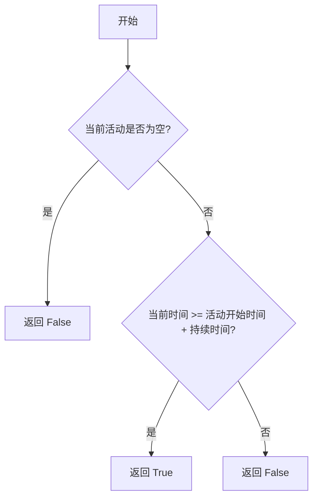

#### 带注释源码

```python
def act_check_finished(self):
    """
    检查当前活动是否已完成。
    通过比较当前时间与活动开始时间加上持续时间来判断。
    如果当前时间大于等于活动结束时间，则活动已完成。
    """
    # 如果当前活动描述为空，说明没有活动，直接返回 False
    if self.scratch.act_description == "":
        return False
    
    # 计算活动结束时间：活动开始时间 + 活动持续时间
    end_time = self.scratch.act_start_time + datetime.timedelta(minutes=self.scratch.act_duration)
    
    # 如果当前时间大于等于结束时间，则活动已完成
    if self.scratch.curr_time >= end_time:
        return True
    else:
        return False
```

### `STRole.add_new_action`

该方法用于向角色的日程中添加一个新的动作，并更新相关的状态信息。它接收动作的详细参数（如地址、持续时间、描述等），并将这些信息存储到角色的临时数据（scratch）中，以反映角色即将执行或正在执行的动作。

参数：

- `act_address`：`str`，动作发生的地点或对象描述，例如“<persona> John”或“<waiting> 10 20”
- `act_dur`：`int`，动作的持续时间（以分钟为单位）
- `act_description`：`str`，动作的详细描述
- `act_pronunciatio`：`str`，动作的符号表示（如表情符号）
- `act_event`：`Tuple`，表示动作的事件元组，格式为（角色名，动作类型，目标）
- `chatting_with`：`str`，聊天对象的名称（如果动作为聊天）
- `chat`：`list`，聊天记录（如果动作为聊天）
- `chatting_with_buffer`：`dict`，聊天缓冲字典，记录与各角色的聊天冷却时间
- `chatting_end_time`：`datetime`，聊天结束时间（如果动作为聊天）
- `act_obj_description`：`str`，动作对象的描述（可选）
- `act_obj_pronunciatio`：`str`，动作对象的符号表示（可选）
- `act_obj_event`：`Tuple`，动作对象的事件元组（可选）
- `act_start_time`：`datetime`，动作开始时间（可选）

返回值：`None`，该方法不返回任何值，仅更新角色的内部状态。

#### 流程图

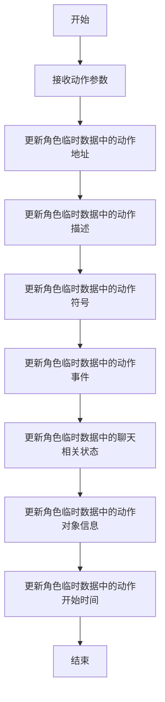

#### 带注释源码

```python
def add_new_action(
    self,
    act_address: str,
    act_dur: int,
    act_description: str,
    act_pronunciatio: str,
    act_event: Tuple,
    chatting_with: str,
    chat: list,
    chatting_with_buffer: dict,
    chatting_end_time: datetime,
    act_obj_description: str,
    act_obj_pronunciatio: str,
    act_obj_event: Tuple,
    act_start_time=None,
):
    """
    向角色的日程中添加一个新的动作，并更新相关状态。
    
    参数：
        act_address: 动作发生的地点或对象描述。
        act_dur: 动作的持续时间（分钟）。
        act_description: 动作的详细描述。
        act_pronunciatio: 动作的符号表示（如表情符号）。
        act_event: 动作的事件元组（角色名，动作类型，目标）。
        chatting_with: 聊天对象的名称（如果动作为聊天）。
        chat: 聊天记录（如果动作为聊天）。
        chatting_with_buffer: 聊天缓冲字典，记录与各角色的聊天冷却时间。
        chatting_end_time: 聊天结束时间（如果动作为聊天）。
        act_obj_description: 动作对象的描述（可选）。
        act_obj_pronunciatio: 动作对象的符号表示（可选）。
        act_obj_event: 动作对象的事件元组（可选）。
        act_start_time: 动作开始时间（可选）。
    """
    # 更新动作地址
    self.scratch.act_address = act_address
    # 更新动作持续时间
    self.scratch.act_duration = act_dur
    # 更新动作描述
    self.scratch.act_description = act_description
    # 更新动作符号
    self.scratch.act_pronunciatio = act_pronunciatio
    # 更新动作事件
    self.scratch.act_event = act_event
    # 更新聊天对象
    self.scratch.chatting_with = chatting_with
    # 更新聊天记录
    self.scratch.chat = chat
    # 更新聊天缓冲
    self.scratch.chatting_with_buffer = chatting_with_buffer
    # 更新聊天结束时间
    self.scratch.chatting_end_time = chatting_end_time
    # 更新动作对象描述
    self.scratch.act_obj_description = act_obj_description
    # 更新动作对象符号
    self.scratch.act_obj_pronunciatio = act_obj_pronunciatio
    # 更新动作对象事件
    self.scratch.act_obj_event = act_obj_event
    # 更新动作开始时间
    self.scratch.act_start_time = act_start_time
```

### `STRole.get_f_daily_schedule_index`

该方法用于获取角色（`STRole`）当前在每日计划（`f_daily_schedule`）中的索引位置。它根据当前时间计算已过去的总分钟数，然后遍历每日计划，累加每个活动的持续时间，直到累加时间超过当前已过去的时间，从而确定当前应执行的活动在计划列表中的索引。

参数：
-  `self`：`STRole`，当前角色实例。
-  `advance`：`int`，可选参数，默认为0。表示在计算索引时额外提前的分钟数。例如，如果`advance=60`，则方法会返回一个索引，该索引对应的活动开始时间比当前时间晚60分钟。

返回值：`int`，返回当前活动（或根据`advance`参数调整后的活动）在`f_daily_schedule`列表中的索引位置。

#### 流程图

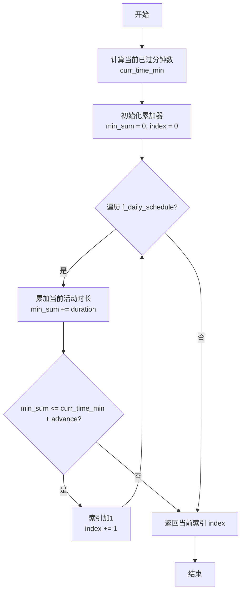

#### 带注释源码

```python
def get_f_daily_schedule_index(self, advance=0):
    """
    获取当前时间点在每日计划 f_daily_schedule 中的索引。
    通过累加计划中每个活动的持续时间，直到超过（当前时间 + advance）对应的分钟数，
    来确定当前应该执行哪个活动。

    Args:
        advance (int, optional): 额外提前的分钟数，用于查找未来某个时间点的计划索引。默认为0。

    Returns:
        int: 当前活动在 f_daily_schedule 列表中的索引。
    """
    # 获取当前时间对象
    curr_time = self.scratch.curr_time
    # 计算从当天0点开始到当前时间所经过的总分钟数
    curr_time_min = curr_time.hour * 60 + curr_time.minute

    # 初始化累加器和索引
    min_sum = 0
    index = 0
    # 遍历每日计划中的每个活动（活动描述， 持续时间）
    for activity, duration in self.scratch.f_daily_schedule:
        # 累加当前活动的持续时间
        min_sum += duration
        # 判断累加时间是否超过了（当前时间 + 提前量）对应的分钟数
        if min_sum <= curr_time_min + advance:
            # 如果没超过，索引加1，继续检查下一个活动
            index += 1
        else:
            # 如果超过了，跳出循环，当前索引即为目标索引
            break
    # 返回计算得到的索引
    return index
```

### `STRole.get_f_daily_schedule_hourly_org_index`

该方法用于获取角色当前在原始每日小时级计划（`f_daily_schedule_hourly_org`）中的索引位置。该索引指示了角色当前时间点对应在原始计划中的哪个时间段。它通过累加计划中每个活动的时间，直到超过当前时间（以分钟计）来确定索引。

参数：
- `self`：`STRole`，当前角色实例。

返回值：`int`，表示在`f_daily_schedule_hourly_org`列表中的索引位置。

#### 流程图

```mermaid
flowchart TD
    A[开始] --> B[初始化累计时间<br>sum = 0, index = 0]
    B --> C{index < 计划长度?}
    C -- 是 --> D[sum += 计划[index]的持续时间]
    D --> E{sum > 当前分钟数?}
    E -- 否 --> F[index += 1]
    F --> C
    E -- 是 --> G[返回 index]
    C -- 否 --> H[返回 计划长度 - 1]
```

#### 带注释源码

```python
def get_f_daily_schedule_hourly_org_index(self):
    """
    计算并返回当前时间点在原始每日小时级计划中的索引。
    该方法遍历`f_daily_schedule_hourly_org`列表，累加每个活动的时间（分钟），
    直到累计时间超过从当天0点开始到当前时间所经过的分钟数。
    返回的索引指向第一个累计时间超过当前分钟数的活动。
    如果遍历完所有活动仍未超过，则返回最后一个索引。
    """
    # 计算从当天0点到当前时间所经过的总分钟数
    curr_min = self.curr_time.hour * 60 + self.curr_time.minute
    # 初始化累计时间和索引
    sum_min = 0
    for i, schedule in enumerate(self.f_daily_schedule_hourly_org):
        # 累加当前活动的时间
        sum_min += schedule[1]
        # 如果累计时间超过了当前分钟数，返回当前索引
        if sum_min > curr_min:
            return i
    # 如果所有活动的时间总和仍未超过当前分钟数（例如在一天的最后），返回最后一个索引
    return len(self.f_daily_schedule_hourly_org) - 1
```


### `STRole.get_str_curr_date_str`

该方法用于获取角色（`STRole`）当前时间（`scratch.curr_time`）的日期字符串表示。它通过调用 `strftime` 方法，将 `datetime` 对象格式化为 `"%A %B %d"` 的字符串形式，例如 "Monday January 01"。此方法通常用于生成计划、记忆或状态描述中需要人类可读日期的场景。

参数：
-  `self`：`STRole`，当前角色实例的引用。

返回值：`str`，返回格式化为 `"%A %B %d"` 的当前日期字符串。

#### 流程图

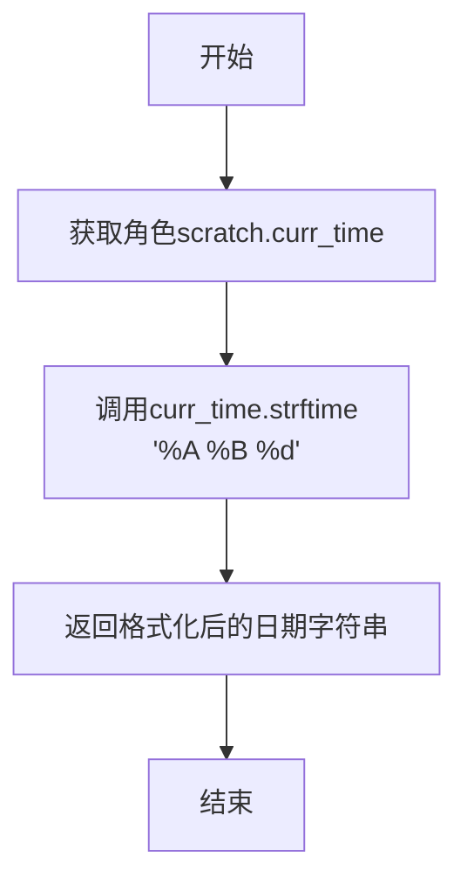

#### 带注释源码

```
# 注意：此方法在提供的代码片段中并未直接定义，
# 但其调用方式 `role.scratch.get_str_curr_date_str()` 暗示了它的存在。
# 根据上下文，其典型实现应如下：

def get_str_curr_date_str(self) -> str:
    """
    返回当前日期（scratch.curr_time）的格式化字符串。
    格式为：星期几 月份 日期，例如 'Monday January 01'。
    """
    # 使用strftime方法将datetime对象格式化为指定字符串
    return self.scratch.curr_time.strftime("%A %B %d")
```


### `STRole.get_str_iss`

该方法用于获取角色（STRole）的当前身份、状态和计划信息的字符串表示。它通过组合角色的姓名、当前状态、每日计划要求以及当前日期，生成一个格式化的字符串，用于后续的对话生成或计划制定。

参数：
- `self`：`STRole`，当前角色实例

返回值：`str`，返回一个格式化的字符串，包含角色的姓名、当前状态、每日计划要求和当前日期。

#### 流程图

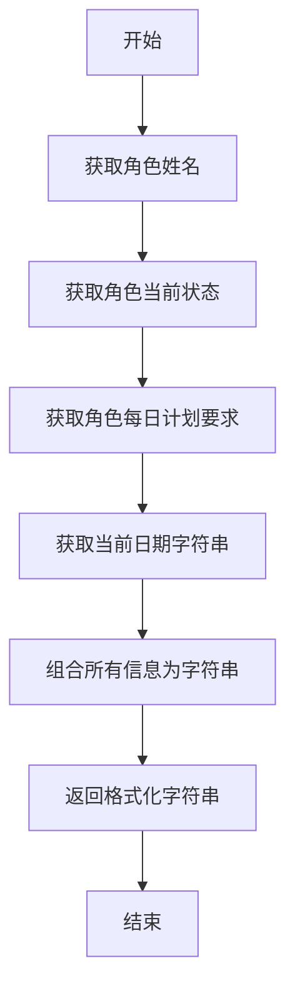

#### 带注释源码

```python
def get_str_iss(self):
    """
    获取角色的身份、状态和计划信息的字符串表示。
    组合角色的姓名、当前状态、每日计划要求和当前日期，生成一个格式化的字符串。
    
    返回:
        str: 格式化的字符串，包含角色的姓名、当前状态、每日计划要求和当前日期。
    """
    # 获取角色的姓名
    name = self.scratch.name
    # 获取角色的当前状态
    currently = self.scratch.currently
    # 获取角色的每日计划要求
    daily_req = self.scratch.daily_req
    # 获取当前日期的字符串表示
    curr_date = self.scratch.get_str_curr_date_str()
    
    # 组合所有信息为格式化字符串
    return f"Name: {name}\n" \
           f"Status: {currently}\n" \
           f"Plan: {daily_req}\n" \
           f"Current Date: {curr_date}"
```

## 关键组件


### 长期规划与日程生成

负责在每天开始时，为角色生成宏观的每日需求（`daily_req`）和详细的每小时日程安排（`f_daily_schedule`）。这是角色行为的基础蓝图。

### 任务分解与动作细化

将日程中的宏观活动（如“吃午饭”）分解为一系列具体的、可执行的子任务（如“走到餐厅”、“点餐”、“吃饭”），并生成每个动作的详细描述、地点和对象。

### 事件感知与反应决策

处理角色从记忆中检索到的事件（如看到其他角色），并决策如何反应。决策包括：忽略、等待、或发起对话。

### 对话管理与生成

当决策结果为发起对话时，负责在两个角色之间生成自然的对话内容，计算对话时长，并生成对话摘要。

### 日程动态调整与插入

当角色需要执行新动作（如对话）或等待时，能够动态地调整其现有的日程安排，将新活动插入到合适的时间段，并重新规划受影响时段的任务。

### 身份与状态修订

在“新的一天”开始时，根据角色过去的记忆和经历，修订其当前状态（`currently`）和身份认知，使其行为更具连贯性和发展性。


## 问题及建议


### 已知问题

-   **硬编码日期与时间逻辑**：代码中存在多处硬编码的日期（如 `datetime.datetime(2022, 10, 31, 0, 0)`）和时间逻辑（如 `scratch.curr_time.hour == 23` 的判断）。这使得代码与特定日期强耦合，难以适应不同的模拟起始日期或时间规则，降低了灵活性和可测试性。
-   **魔法数字与模糊逻辑**：代码中使用了大量未解释的“魔法数字”，例如在 `_chat_react` 中设置聊天缓冲值为 `800`，在 `_long_term_planning` 中设置想法重要性为 `5`，以及在 `generate_convo` 中计算对话长度的公式 `math.ceil(int(len(all_utt) / 8) / 30)`。这些数字缺乏上下文说明，使得逻辑难以理解和维护。
-   **错误处理与边界条件缺失**：代码对许多潜在的错误情况（如字典键不存在、列表索引越界、`retrieved` 为空、`roles` 字典中找不到目标角色等）缺乏明确的检查和处理。例如，`_choose_retrieved` 函数在 `retrieved` 可能为空或处理后变为空时，未做充分防护。
-   **代码注释与调试信息残留**：代码中包含了大量已注释掉的调试代码（如 `# DEC 7 DEBUG;.. is the +1 the right thing to do???`）和临时的 `logger.debug` 语句。这些残留信息干扰了代码的清晰度，且部分注释表明开发者对某些逻辑（如时间调整的 `+1`）存在不确定性。
-   **函数职责过重与耦合度高**：`plan` 函数作为主入口，承担了调度、事件选择、反应决策、状态清理等多重职责，导致函数过长且逻辑复杂。同时，多个函数（如 `_create_react`）深度依赖 `STRole` 对象内部复杂的 `scratch` 数据结构，耦合度高，难以独立测试和复用。
-   **潜在的性能问题**：`revise_identity` 函数中连续调用了三次 `LLM().ask()`，这是昂贵的语言模型调用，且是同步操作（在异步函数中未使用 `await`），可能会阻塞事件循环，影响系统整体性能与响应速度。
-   **类型注解不完整**：虽然部分函数有类型注解，但关键数据结构（如 `retrieved` 字典的具体结构、`STRole` 类）的注解缺失或不完整，降低了代码的可读性和静态类型检查工具的有效性。

### 优化建议

-   **提取配置与常量**：将所有魔法数字（如缓冲值、重要性分数、时间阈值）和硬编码日期提取到配置文件或模块级常量中，并附上清晰的注释说明其含义和用途。
-   **增强错误处理与防御性编程**：在函数开始处和关键操作前，增加对输入参数有效性、数据结构状态的检查（如空值、类型、键/索引存在性）。使用 `try...except` 块捕获可能的外部依赖异常（如LLM调用失败）。
-   **重构大函数，解耦逻辑**：
    -   将 `plan` 函数拆分为更小的、职责单一的子函数，例如 `_schedule_planning`, `_event_reaction_handling`, `_state_cleanup`。
    -   考虑引入策略模式或状态模式来管理不同的反应模式（聊天、等待、忽略），降低 `_should_react` 和 `_chat_react` 等函数的复杂度。
    -   减少函数间对 `scratch` 内部结构的直接操作，封装成更清晰的接口方法。
-   **清理代码与完善文档**：移除所有已注释掉的调试代码和无关的 `logger.debug` 语句。为复杂的算法步骤（如 `generate_new_decomp_schedule` 中的时间切片与重组逻辑）和关键函数添加清晰的文档字符串，解释其目的、输入、输出和主要流程。
-   **优化性能与异步化**：
    -   评估 `revise_identity` 中多个LLM调用的必要性，考虑是否可以合并提示词或缓存结果。
    -   确保所有耗时的I/O操作（尤其是LLM调用）使用异步方式（`await`）执行，避免阻塞。
    -   对于频繁访问和修改的数据结构（如 `scratch`），评估其性能瓶颈。
-   **完善类型注解**：为所有函数参数、返回值以及重要的局部变量添加完整的类型注解。为 `STRole`、`ConceptNode` 等核心类创建类型定义（Type Hints或Protocol），明确 `retrieved` 等复杂字典的结构。
-   **引入单元测试与集成测试**：为关键函数（如 `_choose_retrieved`, `_should_react`, `generate_new_decomp_schedule`）编写单元测试，模拟各种边界条件。建立集成测试以验证角色规划、对话和反应的整体流程。
-   **考虑引入更明确的状态机**：角色的行为（如“空闲”、“规划中”、“聊天中”、“等待中”）可以通过一个显式的状态机来管理，这比分散在多个 `scratch` 标志中更清晰，有助于减少状态不一致的错误。


## 其它


### 设计目标与约束

本模块是斯坦福小镇（Stanford Town）智能体模拟系统的核心规划与执行引擎。其主要设计目标是驱动虚拟角色（`STRole`）在模拟环境中进行自主、连贯且符合其身份设定的日常活动与社交互动。核心约束包括：1) **时间驱动**：所有行动严格遵循模拟的虚拟时间线，以分钟为单位推进；2) **事件响应**：角色需能感知环境事件（如遇到其他角色）并做出合理反应（交谈、等待等）；3) **记忆与规划**：依赖角色的长期记忆（`a_mem`）和短期状态（`scratch`）来生成和调整计划；4) **模块化动作**：通过一系列预定义的`Action`类（如`DecideToTalk`, `GenActionDetails`）实现具体行为的生成与决策，保持核心流程与具体实现的解耦。

### 错误处理与异常设计

当前代码的错误处理较为隐式，主要依赖Python的默认异常传播和零星的日志记录（`logger.info`/`logger.debug`）。缺乏系统性的错误处理机制，存在以下风险：1) **外部依赖故障**：对`LLM().ask()`的调用没有超时、重试或降级策略，LLM服务异常将直接导致流程中断；2) **数据一致性**：在修改`scratch.f_daily_schedule`等关键数据结构时，没有事务性或回滚机制，部分失败可能导致状态不一致；3) **边界条件**：如`_choose_retrieved`可能返回`None`，但后续部分逻辑未充分处理此情况。建议增加`try-catch`块、定义自定义异常类、对关键操作（如LLM调用、计划重组）实现更健壮的错误恢复逻辑。

### 数据流与状态机

系统的核心数据流围绕`STRole`实例的`scratch`（临时状态）和`a_mem`（联想记忆）展开，并受模拟时钟驱动。
1.  **状态机**：每个角色的行为可视为一个状态机，状态包括：`常规行动`、`等待`、`聊天中`。`plan`函数是状态转换的触发器，根据`new_day`、`act_check_finished()`和`retrieved`（感知到的事件）决定下一状态。
2.  **主数据流**：
    *   **输入**：模拟时钟、角色自身状态、从记忆检索到的事件信息(`retrieved`)。
    *   **处理**：
        *   **新天计划**：若为新天，触发`_long_term_planning`，生成全天粗略计划(`daily_req`)和小时级计划(`f_daily_schedule`)。
        *   **行动执行**：当前行动结束时，触发`_determine_action`，将小时计划分解为具体行动细节并设置到`scratch`。
        *   **事件反应**：感知到事件后，通过`_should_react`决策反应模式（聊天/等待/忽略），并通过`_chat_react`或`_wait_react`修改当前计划，插入新的行动。
    *   **输出**：更新`role.rc.scratch`中的行动地址(`act_address`)、描述、持续时间、聊天对象等，并可能更新记忆。

### 外部依赖与接口契约

1.  **LLM服务**：通过`from metagpt.llm import LLM`导入，并在`revise_identity`函数中直接调用`LLM().ask()`。这是核心外部依赖，用于生成文本（如计划总结、身份修订）。**接口契约**：期望输入一个字符串提示词，返回一个字符串响应。缺乏明确的速率限制、格式约定和错误响应处理。
2.  **嵌入模型**：通过`from metagpt.ext.stanford_town.utils.utils import get_embedding`导入，用于为记忆中的思想生成向量。**接口契约**：输入字符串，返回数值向量。其性能直接影响记忆检索的准确性。
3.  **动作类**：依赖多个导入的`Action`类（如`DecideToTalk`, `GenActionDetails`等）。**接口契约**：这些类均需实现异步的`run`方法，并接受特定的参数（通常是`STRole`实例及其他相关数据），返回特定的结构化数据。核心流程与这些类的具体实现松耦合，但依赖其接口稳定。
4.  **`STRole`类**：这是最关键的内部依赖。代码严重依赖于`STRole`类的特定接口，尤其是`role.scratch`和`role.a_mem`的属性与方法（如`scratch.act_check_finished`, `scratch.add_new_action`, `a_mem.add_thought`）。任何这些接口的变动都会直接影响本模块的功能。

    