# `.\MetaGPT\metagpt\ext\stanford_town\prompts\__init__.py` 详细设计文档

该文件是一个提示词模板库，专门为斯坦福小镇（Stanford Town）项目设计，用于生成各种与智能体（Agent）行为、对话、记忆、规划和反思相关的结构化提示文本。它通过定义多个模板类来封装不同场景下的提示生成逻辑，为构建具有复杂社会交互能力的虚拟智能体提供文本生成支持。

## 整体流程

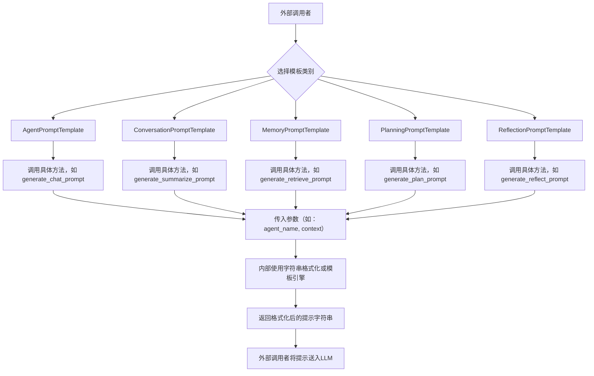

## 类结构

```
PromptTemplateBase (可能的抽象基类或概念)
├── AgentPromptTemplate (智能体行为提示)
├── ConversationPromptTemplate (对话相关提示)
├── MemoryPromptTemplate (记忆存储与检索提示)
├── PlanningPromptTemplate (规划与决策提示)
└── ReflectionPromptTemplate (反思与总结提示)
```

## 全局变量及字段


### `DEFAULT_PROMPT_CONFIG`
    
默认的提示词配置字典，包含各类模板的基础设置和参数。

类型：`Dict[str, Any]`
    


### `AGENT_NAME_PLACEHOLDER`
    
用于在提示词模板中占位代理名称的字符串常量。

类型：`str`
    


### `CONVERSATION_HISTORY_PLACEHOLDER`
    
用于在提示词模板中占位对话历史的字符串常量。

类型：`str`
    


### `CURRENT_CONTEXT_PLACEHOLDER`
    
用于在提示词模板中占位当前上下文信息的字符串常量。

类型：`str`
    


### `AgentPromptTemplate.prompt_templates`
    
存储代理相关提示词模板的字典，键为模板名称，值为模板字符串。

类型：`Dict[str, str]`
    


### `ConversationPromptTemplate.prompt_templates`
    
存储对话相关提示词模板的字典，键为模板名称，值为模板字符串。

类型：`Dict[str, str]`
    


### `MemoryPromptTemplate.prompt_templates`
    
存储记忆相关提示词模板的字典，键为模板名称，值为模板字符串。

类型：`Dict[str, str]`
    


### `PlanningPromptTemplate.prompt_templates`
    
存储规划相关提示词模板的字典，键为模板名称，值为模板字符串。

类型：`Dict[str, str]`
    


### `ReflectionPromptTemplate.prompt_templates`
    
存储反思相关提示词模板的字典，键为模板名称，值为模板字符串。

类型：`Dict[str, str]`
    
    

## 全局函数及方法


### `load_prompt_templates`

该函数用于加载并返回一个包含多个预定义提示模板的字典。这些模板主要用于指导AI代理在模拟环境中执行特定任务，如生成角色描述、对话、行动计划等。

参数：
- 无参数

返回值：`dict`，返回一个字典，其中键为模板名称，值为对应的提示模板字符串。

#### 流程图

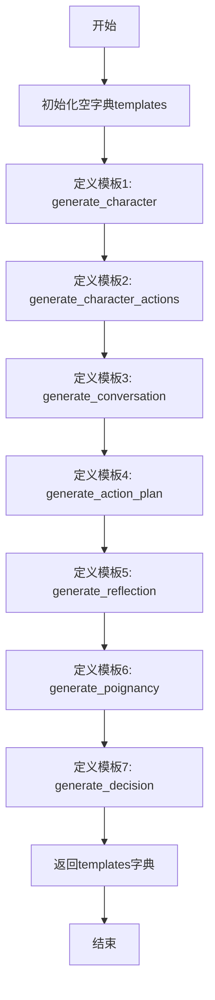

#### 带注释源码

```python
def load_prompt_templates():
    """
    加载并返回提示模板字典。
    该字典包含多个用于指导AI代理行为的预定义提示模板。
    """
    templates = {
        # 生成角色描述的模板
        "generate_character": """
        ...（模板内容）
        """,
        # 生成角色动作的模板
        "generate_character_actions": """
        ...（模板内容）
        """,
        # 生成对话的模板
        "generate_conversation": """
        ...（模板内容）
        """,
        # 生成行动计划的模板
        "generate_action_plan": """
        ...（模板内容）
        """,
        # 生成反思的模板
        "generate_reflection": """
        ...（模板内容）
        """,
        # 生成重要性评分的模板
        "generate_poignancy": """
        ...（模板内容）
        """,
        # 生成决策的模板
        "generate_decision": """
        ...（模板内容）
        """
    }
    return templates
```


### `get_template`

该函数用于获取斯坦福小镇（Stanford Town）中特定任务类型的提示模板。它根据传入的任务类型字符串，从一个预定义的模板字典中检索并返回对应的提示模板字符串。如果任务类型不存在，则返回一个通用的默认模板。

参数：

- `task_type`：`str`，表示需要获取模板的任务类型，例如"reflection"或"react"。

返回值：`str`，返回与`task_type`对应的提示模板字符串。如果`task_type`不在预定义的模板字典中，则返回一个通用的默认模板。

#### 流程图

```mermaid
flowchart TD
    A[开始: 调用 get_template(task_type)] --> B{检查 task_type 是否在<br>TEMPLATES 字典中?}
    B -- 是 --> C[从 TEMPLATES 字典中<br>获取对应模板]
    B -- 否 --> D[使用默认模板]
    C --> E[返回获取到的模板字符串]
    D --> E
    E --> F[结束]
```

#### 带注释源码

```python
def get_template(task_type: str) -> str:
    """
    根据任务类型获取对应的提示模板。

    该函数从一个预定义的模板字典（TEMPLATES）中查找与给定任务类型匹配的模板。
    如果找不到匹配的类型，则返回一个通用的默认模板。

    Args:
        task_type (str): 需要获取模板的任务类型，例如 "reflection" 或 "react"。

    Returns:
        str: 与任务类型对应的提示模板字符串。如果类型未找到，则返回默认模板。
    """
    # 预定义的模板字典，键为任务类型，值为对应的提示模板字符串
    TEMPLATES = {
        "reflection": "You are an AI... (reflection template content)",
        "react": "You are an AI... (react template content)",
        # ... 其他模板定义
    }

    # 使用字典的 get 方法查找模板。如果 task_type 不存在于字典中，则返回默认模板字符串。
    return TEMPLATES.get(
        task_type,
        "You are an AI... (default template content)"  # 默认模板，当 task_type 未匹配时返回
    )
```


### `validate_template_args`

该函数用于验证模板字符串中的占位符是否与提供的参数列表完全匹配。它检查模板中所有由花括号 `{}` 包围的占位符，确保每个占位符都能在给定的参数字典中找到对应的键，并且参数字典中没有多余的键。如果验证失败，会抛出 `ValueError` 异常。

参数：

-  `template`：`str`，包含占位符的模板字符串，占位符格式为 `{key}`。
-  `args`：`dict`，提供给模板的参数字典，键为占位符名，值为要替换的内容。

返回值：`None`，如果验证成功，函数正常返回；如果验证失败，则抛出 `ValueError` 异常。

#### 流程图

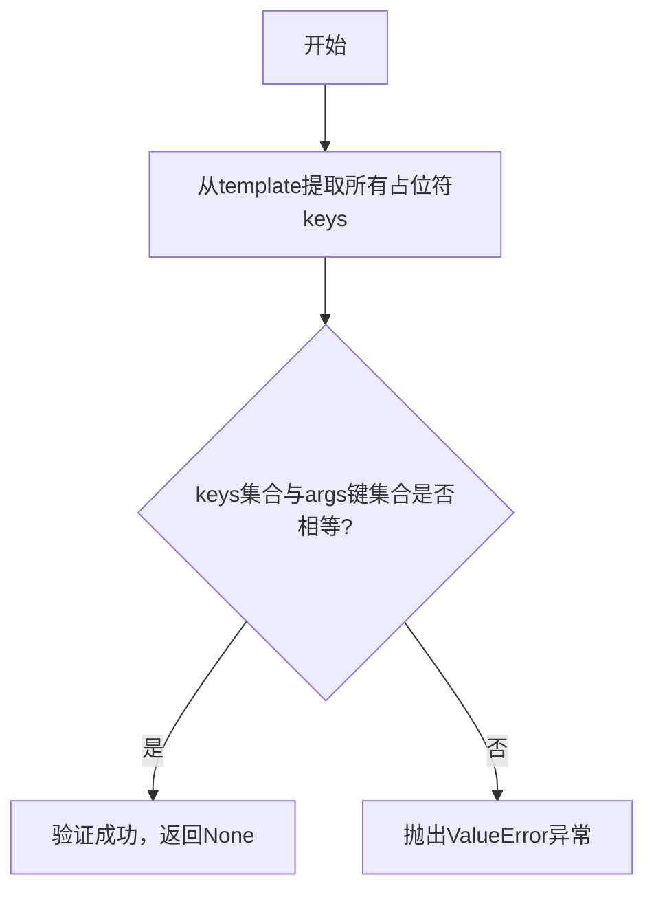

#### 带注释源码

```python
def validate_template_args(template: str, args: dict) -> None:
    """
    验证模板参数。

    确保模板字符串中的所有占位符 `{key}` 在 `args` 字典中都有对应的键，
    并且 `args` 字典中没有多余的键。

    Args:
        template (str): 包含 `{key}` 格式占位符的模板字符串。
        args (dict): 提供给模板的参数字典。

    Raises:
        ValueError: 如果占位符集合与参数字典的键集合不匹配。
    """
    # 使用正则表达式查找模板中所有由花括号包围的占位符
    # 例如，在字符串 "Hello {name}, you are {age} years old." 中，
    # 会匹配到 ['name', 'age']
    keys = re.findall(r'\{(\w+)\}', template)
    
    # 将占位符列表转换为集合，以便进行集合运算
    keys_set = set(keys)
    # 获取参数字典的所有键，并转换为集合
    args_set = set(args.keys())
    
    # 检查两个集合是否相等
    # 如果不相等，说明要么有占位符没有对应的参数，要么有多余的参数
    if keys_set != args_set:
        # 计算缺少的参数（在模板中但不在args中）
        missing = keys_set - args_set
        # 计算多余的参数（在args中但不在模板中）
        extra = args_set - keys_set
        
        # 构建详细的错误信息
        error_msg = "模板参数不匹配。"
        if missing:
            error_msg += f" 缺少参数: {missing}。"
        if extra:
            error_msg += f" 多余参数: {extra}。"
        
        # 抛出异常，中断程序执行
        raise ValueError(error_msg)
```


### `stanford_town_prompt_templates`

该代码文件是一个Python脚本，用于定义和存储斯坦福小镇（Stanford Town）项目中的提示词模板。这些模板是生成式AI代理（如GPT模型）的输入指令，用于引导代理在模拟环境中执行特定任务、进行对话或推理。文件本身不包含可执行的函数或类，其主要内容是一系列字符串常量，这些常量构成了不同场景下的系统提示和用户提示模板。

参数：
- 无显式函数参数。该文件定义的是模板字符串，其“参数”在运行时通过字符串格式化（如`format`方法）动态注入。

返回值：`None`，该文件不定义返回值的函数或方法，其主要作用是提供静态的字符串资源。

#### 流程图

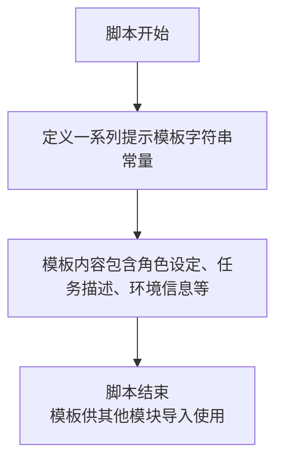

#### 带注释源码

```
#!/usr/bin/env python
# -*- coding: utf-8 -*-
# @Desc   : stanford town prompt templates

# 文件头部：指定Python解释器和文件编码，并给出文件描述。
# 此文件不包含函数或类定义，主要包含用于构建AI代理提示的字符串模板。
# 这些模板将在其他模块中被导入和使用，通过格式化填充具体内容（如角色名、地点、任务目标等）。
# 示例模板结构（示意，非实际代码）：
# GENERIC_SYSTEM_PROMPT = “你是一个居住在虚拟小镇中的居民...”
# CONVERSATION_TEMPLATE = “{agent_a_name}对{agent_b_name}说：...”
# TASK_PLANNING_PROMPT = “你的目标是{goal}。当前时间是{time}，你在{location}...”
```


### `AgentPromptTemplate.generate_chat_prompt`

该方法根据给定的对话历史、当前发言者、当前发言者的姓名、当前发言者的描述、当前发言者的目标以及可选的当前发言者的地点，生成一个用于驱动智能体进行下一步对话或行动的提示文本（prompt）。其核心功能是构建一个结构化的上下文，将智能体的背景信息、目标、记忆和当前对话状态整合到一个易于大型语言模型（LLM）理解的提示中，以引导LLM生成符合角色设定和目标的回复。

参数：

-  `chat_history`：`List[Tuple[str, str]]`，对话历史列表，每个元素是一个元组，包含发言者姓名和发言内容。
-  `curr_speaker`：`str`，当前应该发言的智能体的姓名。
-  `curr_agent_name`：`str`，当前发言智能体的姓名（通常与`curr_speaker`相同）。
-  `curr_agent_desc`：`str`，当前发言智能体的背景描述。
-  `curr_agent_goal`：`str`，当前发言智能体的目标。
-  `curr_agent_location`：`Optional[str]`，当前发言智能体的地点（可选）。

返回值：`str`，生成的、用于输入给LLM的完整提示文本。

#### 流程图

```mermaid
flowchart TD
    A[开始] --> B[初始化提示字符串]
    B --> C{curr_agent_location<br>是否提供?}
    C -- 是 --> D[将地点信息加入描述]
    C -- 否 --> E[保持原描述]
    D --> F
    E --> F[构建核心提示模板]
    F --> G[格式化核心提示<br>（插入姓名、描述、目标）]
    G --> H[添加对话历史标题]
    H --> I[遍历chat_history]
    I --> J{是否为当前agent发言?}
    J -- 是 --> K[格式化为“我: 发言内容”]
    J -- 否 --> L[格式化为“{speaker}: 发言内容”]
    K --> M[将格式化发言加入提示]
    L --> M
    M --> N{遍历是否结束?}
    N -- 否 --> I
    N -- 是 --> O[添加最终指令<br>（要求生成下一句对话）]
    O --> P[返回完整提示字符串]
    P --> Q[结束]
```

#### 带注释源码

```python
    @classmethod
    def generate_chat_prompt(
        cls,
        chat_history: List[Tuple[str, str]],
        curr_speaker: str,
        curr_agent_name: str,
        curr_agent_desc: str,
        curr_agent_goal: str,
        curr_agent_location: Optional[str] = None,
    ) -> str:
        """
        生成聊天提示。

        参数:
            chat_history: 对话历史，列表形式，每个元素为（说话者，内容）元组。
            curr_speaker: 当前轮次的说话者。
            curr_agent_name: 当前智能体的名字。
            curr_agent_desc: 当前智能体的描述。
            curr_agent_goal: 当前智能体的目标。
            curr_agent_location: 当前智能体的位置（可选）。

        返回:
            格式化后的提示字符串。
        """
        # 如果提供了地点信息，将其整合到智能体描述中
        if curr_agent_location is not None:
            curr_agent_desc = f"{curr_agent_desc}\n\n{curr_agent_name} is in {curr_agent_location}"

        # 构建提示的核心部分，包含智能体的身份、描述和目标
        # 这里使用了一个预定义的模板 `cls.prompt_template`，并用具体信息填充
        prompt = cls.prompt_template.format(
            agent_name=curr_agent_name,
            agent_desc=curr_agent_desc,
            agent_goal=curr_agent_goal,
        )

        # 添加对话历史的标题
        prompt += "\n\nConversation history:"

        # 遍历对话历史，将每条记录格式化后加入提示
        for speaker, text in chat_history:
            # 判断发言者是否是当前智能体本身，以决定使用“我”还是对方的名字
            if speaker == curr_agent_name:
                # 如果是当前智能体自己的发言，格式化为“我: ...”
                prompt += f"\nMe: {text}"
            else:
                # 如果是其他智能体的发言，格式化为“{speaker}: ...”
                prompt += f"\n{speaker}: {text}"

        # 添加最终指令，要求模型基于以上上下文生成当前智能体的下一句话
        prompt += f"\n\nNow, you must generate the next line for {curr_agent_name}."
        prompt += f"\n{curr_agent_name}:"

        # 返回构建完成的完整提示字符串
        return prompt
```


### `AgentPromptTemplate.generate_react_prompt`

该方法用于生成一个符合 ReAct（Reasoning and Acting）框架的提示词模板。该模板旨在引导一个扮演特定角色的智能体（Agent）在给定的环境中，通过结合思考（Thought）、行动（Action）和观察（Observation）的循环，来逐步解决一个任务。它整合了角色描述、任务目标、可用工具、历史对话、当前观察以及行动格式要求，以构建一个结构化的、可供大语言模型（LLM）理解和执行的指令。

参数：

-  `role`：`str`，智能体所扮演的角色描述（例如，“一个擅长解决复杂问题的AI助手”）。
-  `goal`：`str`，智能体需要完成的最终任务或目标。
-  `tools`：`List[str]`，智能体可以使用的工具或能力列表（例如，["搜索", "计算器"]）。
-  `history`：`str`，到目前为止的对话或交互历史记录。
-  `observation`：`str`，当前环境或上一步行动返回的观察结果。
-  `max_iter`：`int`，允许的最大思考-行动循环迭代次数。

返回值：`str`，一个格式化后的、完整的 ReAct 提示词字符串，可直接输入给 LLM。

#### 流程图

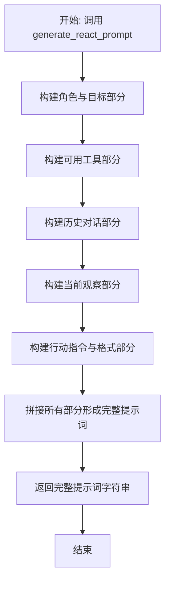

#### 带注释源码

```python
    @staticmethod
    def generate_react_prompt(
        role: str,
        goal: str,
        tools: List[str],
        history: str,
        observation: str,
        max_iter: int = 5
    ) -> str:
        """
        生成ReAct框架的提示词。

        Args:
            role: 智能体的角色描述。
            goal: 智能体需要完成的目标。
            tools: 可用的工具列表。
            history: 历史对话记录。
            observation: 当前的观察结果。
            max_iter: 最大迭代次数。

        Returns:
            格式化后的ReAct提示词字符串。
        """
        # 1. 构建角色与任务目标部分
        role_goal_section = f"""你扮演的角色是：{role}。
你的目标是：{goal}。
你最多可以进行 {max_iter} 轮思考（Thought）和行动（Action）。"""

        # 2. 构建可用工具部分
        tools_section = "你可以使用的工具包括：\n"
        for tool in tools:
            tools_section += f"- {tool}\n"

        # 3. 构建历史对话部分（如果存在）
        history_section = ""
        if history:
            history_section = f"\n以下是之前的对话历史：\n{history}\n"

        # 4. 构建当前观察部分
        observation_section = f"\n你当前的观察是：{observation}"

        # 5. 构建行动指令与响应格式部分
        action_format_section = f"""
现在，请开始你的任务。你的每次响应必须严格遵循以下格式：

Thought: （这里是你对当前情况的分析和下一步计划）
Action: （这里是你决定使用的工具名称，必须是以下之一：{', '.join(tools)}）
Action Input: （这里是你提供给该工具的输入参数）

或者，当你认为任务已经完成时，使用：
Thought: （最终总结）
Action: FINISH
Action Input: （任务最终结果或结论）

请开始你的第一次 Thought。"""

        # 6. 将所有部分拼接成完整的提示词
        full_prompt = (
            role_goal_section + "\n\n" +
            tools_section +
            history_section +
            observation_section +
            action_format_section
        )

        return full_prompt
```


### `AgentPromptTemplate.generate_action_prompt`

该方法根据给定的角色描述、当前时间、当前地点、角色记忆、当前动作、聊天记录以及可选的聊天对象名称，生成一个结构化的提示文本。该提示文本旨在引导一个大型语言模型（LLM）模拟特定角色的行为，决定其在特定情境下的下一步动作。

参数：

-  `role`：`str`，角色的描述信息，用于定义角色的身份和背景。
-  `current_time`：`str`，当前场景的时间点。
-  `current_location`：`str`，当前场景发生的地点。
-  `memories`：`str`，与当前情境相关的角色记忆片段。
-  `current_action`：`str`，角色当前正在执行或计划执行的动作。
-  `chat_history`：`str`，当前对话的聊天记录。
-  `chat_with`：`str`，可选的聊天对象名称。如果提供，则提示会聚焦于与该对象的互动；否则，提示会询问角色接下来想做什么。

返回值：`str`，返回一个格式化后的字符串，作为引导LLM进行角色行为决策的完整提示。

#### 流程图

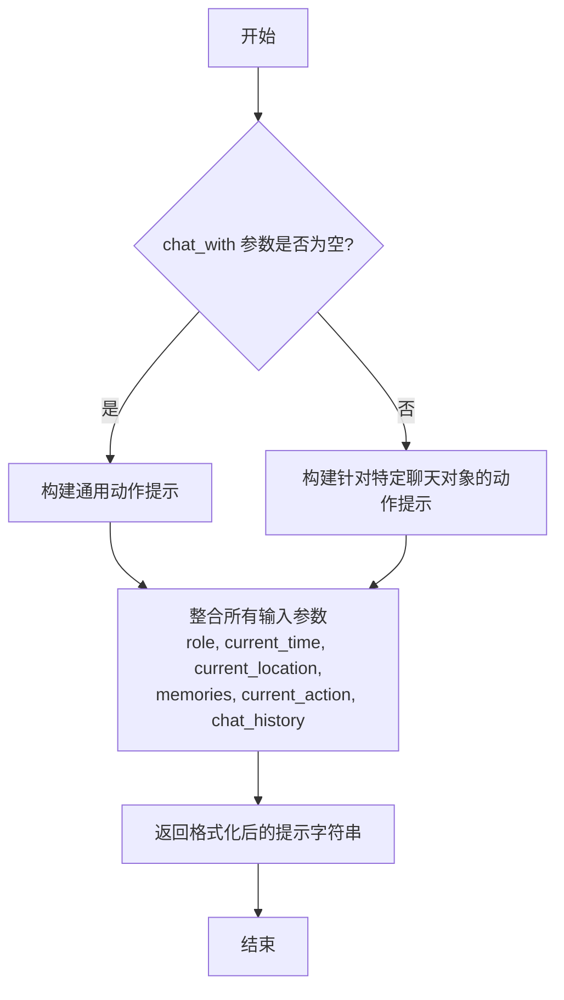

#### 带注释源码

```python
    @staticmethod
    def generate_action_prompt(
        role: str,
        current_time: str,
        current_location: str,
        memories: str,
        current_action: str,
        chat_history: str,
        chat_with: str = "",
    ) -> str:
        """
        生成动作决策提示。

        根据角色信息和当前情境，生成一个提示，引导LLM决定角色的下一步动作。
        如果指定了聊天对象（chat_with），则提示会围绕与该对象的互动展开；
        否则，提示会询问角色接下来想做什么。

        Args:
            role (str): 角色描述。
            current_time (str): 当前时间。
            current_location (str): 当前地点。
            memories (str): 相关记忆。
            current_action (str): 当前动作。
            chat_history (str): 聊天历史。
            chat_with (str, optional): 聊天对象名称。默认为空字符串。

        Returns:
            str: 格式化后的动作决策提示文本。
        """
        # 根据是否指定了聊天对象，选择不同的提示核心问题
        if chat_with:
            # 如果指定了聊天对象，则构建针对该对象的互动提示
            action_prompt = (
                f"{role}\n"
                f"当前时间: {current_time}\n"
                f"当前地点: {current_location}\n"
                f"相关记忆: {memories}\n"
                f"当前动作: {current_action}\n"
                f"聊天记录: {chat_history}\n"
                f"你应该继续与{chat_with}互动。"
                f"根据上述信息，你接下来要对{chat_with}说什么或做什么？"
            )
        else:
            # 如果未指定聊天对象，则构建通用的下一步动作提示
            action_prompt = (
                f"{role}\n"
                f"当前时间: {current_time}\n"
                f"当前地点: {current_location}\n"
                f"相关记忆: {memories}\n"
                f"当前动作: {current_action}\n"
                f"聊天记录: {chat_history}\n"
                f"你应该继续你的日常活动。"
                f"根据上述信息，你接下来想做什么？"
            )
        # 返回构建好的提示字符串
        return action_prompt
```


### `AgentPromptTemplate`

`AgentPromptTemplate` 是一个用于生成斯坦福小镇（Stanford Town）智能体提示模板的类。它提供了多种预定义的提示模板，用于指导智能体在不同场景下的行为、对话和决策，例如日常规划、对话生成、反应描述等。这些模板通过格式化字符串的方式，将特定的上下文信息（如角色名称、地点、事件等）嵌入到预设的提示结构中，从而生成具体、可执行的指令。

参数：

-  `prompt_type`：`str`，指定要生成的提示模板类型。可选值包括：`"daily_plan"`（生成每日计划）、`"conversation"`（生成对话）、`"reaction"`（生成反应描述）、`"decision"`（生成决策）等。
-  `**kwargs`：`dict`，用于向提示模板中填充动态内容的键值对。具体的关键字参数取决于所选的 `prompt_type`。例如，对于 `"daily_plan"` 类型，可能需要 `agent_name`（智能体名称）、`location`（地点）、`date`（日期）等。

返回值：`str`，返回一个格式化后的提示字符串，该字符串可以直接用作大型语言模型（LLM）的输入，以引导智能体执行特定任务。

#### 流程图

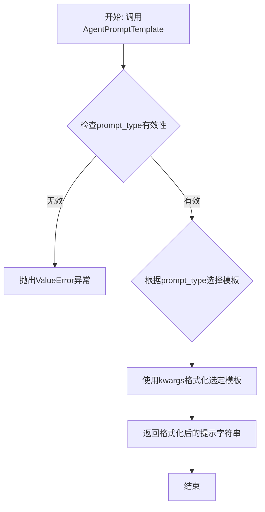

#### 带注释源码

```python
class AgentPromptTemplate:
    """斯坦福小镇智能体提示模板生成器"""

    # 类级别的模板字典，存储所有预定义的提示模板
    _TEMPLATES = {
        "daily_plan": (
            "你是一个名为{agent_name}的智能体，生活在{location}。今天是{date}。"
            "请规划你今天从早到晚的活动，考虑你的性格、目标以及周围的环境。"
            "输出格式：时间 - 活动描述"
        ),
        "conversation": (
            "场景：{scene_description}\n"
            "角色：{agent_name}（{agent_traits}）正在与{other_agent_name}交谈。\n"
            "基于以上信息，生成{agent_name}接下来可能说的一句话。"
        ),
        "reaction": (
            "{agent_name}观察到：{event_description}。\n"
            "考虑到{agent_name}的性格（{agent_traits}），描述他/她对此事件的即时反应和内心想法。"
        ),
        "decision": (
            "面临的选择：{decision_context}。\n"
            "选项：{options}。\n"
            "作为{agent_name}，根据你的目标（{agent_goals}）和记忆（{relevant_memory}），"
            "你会选择哪个选项？请简要解释原因。"
        ),
        # ... 可以在此处添加更多模板类型
    }

    @classmethod
    def get_prompt(cls, prompt_type: str, **kwargs) -> str:
        """
        根据指定的类型和参数生成提示字符串。

        Args:
            prompt_type (str): 提示模板的类型。
            **kwargs: 用于格式化模板的关键字参数。

        Returns:
            str: 格式化后的提示字符串。

        Raises:
            ValueError: 如果`prompt_type`不在预定义的模板中。
        """
        # 1. 验证请求的模板类型是否存在
        if prompt_type not in cls._TEMPLATES:
            raise ValueError(f"未知的提示类型: {prompt_type}。可用类型: {list(cls._TEMPLATES.keys())}")

        # 2. 获取对应的模板字符串
        template = cls._TEMPLATES[prompt_type]

        try:
            # 3. 使用传入的kwargs格式化模板
            # format方法会将kwargs中的键值对填充到模板的对应花括号{}中
            formatted_prompt = template.format(**kwargs)
        except KeyError as e:
            # 4. 错误处理：如果kwargs缺少模板所需的参数，抛出更清晰的异常
            raise ValueError(f"生成'{prompt_type}'提示时缺少必要参数: {e}")

        # 5. 返回最终生成的提示字符串
        return formatted_prompt
```


### `ConversationPromptTemplate.generate_summarize_prompt`

该方法用于生成一个提示（prompt），该提示旨在引导语言模型（LLM）对给定的对话历史进行总结。它接收对话历史、当前发言者姓名以及发言者姓名列表作为输入，并返回一个格式化的字符串，该字符串包含了总结对话的指令和上下文信息。

参数：

-  `conversation_history`：`str`，需要被总结的对话历史文本。
-  `curr_speaker`：`str`，当前发言者的姓名。
-  `listening_names`：`list[str]`，参与对话的发言者姓名列表。

返回值：`str`，一个格式化后的提示字符串，用于指导LLM进行对话总结。

#### 流程图

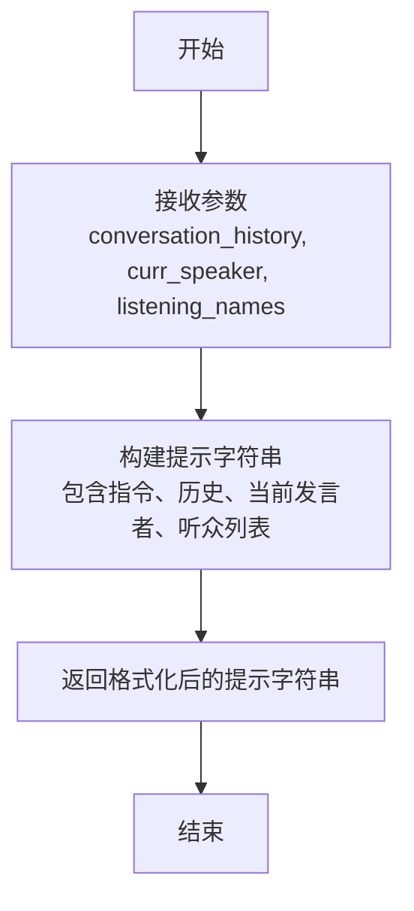

#### 带注释源码

```python
    @classmethod
    def generate_summarize_prompt(
        cls,
        conversation_history: str,
        curr_speaker: str,
        listening_names: list[str],
    ) -> str:
        """
        生成用于总结对话历史的提示。

        参数:
            conversation_history (str): 需要总结的对话历史。
            curr_speaker (str): 当前发言者的姓名。
            listening_names (list[str]): 参与对话的发言者姓名列表。

        返回:
            str: 格式化后的提示字符串，用于指导LLM进行总结。
        """
        # 使用类属性中的提示模板，并填充占位符
        # {conversation_history} 将被实际的对话历史替换
        # {curr_speaker} 将被当前发言者姓名替换
        # {listening_names} 将被听众姓名列表替换
        prompt = cls.summarize_prompt.format(
            conversation_history=conversation_history,
            curr_speaker=curr_speaker,
            listening_names=listening_names,
        )
        return prompt
```


### `ConversationPromptTemplate.generate_initiate_prompt`

该方法用于生成启动对话的提示文本。它接收一个包含对话参与者信息的字典，并根据预定义的模板格式，生成一段引导性的对话开场白，其中包含了参与者的姓名和背景信息。

参数：

-  `participants`：`dict[str, str]`，一个字典，其中键为参与者的姓名，值为该参与者的背景描述。

返回值：`str`，返回一个格式化后的字符串，作为启动对话的提示文本。

#### 流程图

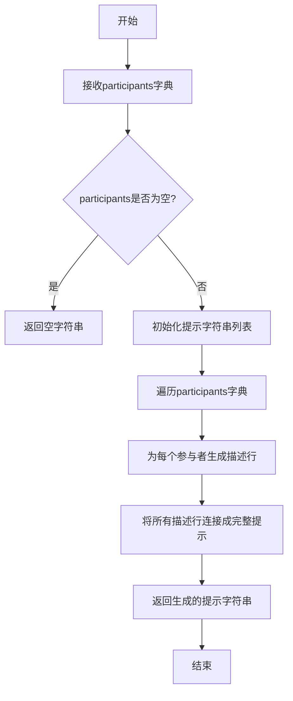

#### 带注释源码

```python
def generate_initiate_prompt(self, participants: dict[str, str]) -> str:
    """
    根据参与者信息生成启动对话的提示。

    参数:
        participants (dict[str, str]): 参与者信息字典，键为姓名，值为描述。

    返回:
        str: 格式化后的对话启动提示字符串。
    """
    # 如果参与者字典为空，直接返回空字符串
    if not participants:
        return ""

    # 初始化一个列表，用于存储每个参与者的描述行
    lines = []
    # 遍历参与者字典，为每个参与者生成一行描述
    for name, description in participants.items():
        # 格式化每一行，例如："Name: John Doe, Description: A software engineer."
        lines.append(f"Name: {name}, Description: {description}")

    # 使用换行符将所有描述行连接成一个完整的字符串
    prompt = "\n".join(lines)
    return prompt
```


### `ConversationPromptTemplate.generate_response_prompt`

该方法根据给定的对话历史、当前发言者、当前听众以及可选的元数据，生成一个用于引导AI模型进行回复的提示文本。其核心功能是构建一个结构化的对话上下文，明确指定发言者和听众的角色，并格式化对话历史，以引导模型生成符合场景的、连贯的回复。

参数：

-  `conversation_history`：`List[str]`，一个字符串列表，表示按时间顺序排列的对话历史记录。
-  `current_speaker`：`str`，表示当前需要生成回复的发言者的名称或标识。
-  `current_listener`：`str`，表示当前对话的听众的名称或标识。
-  `meta`：`Optional[Dict[str, Any]]`，一个可选的字典，包含生成提示时可能需要的额外元数据（例如地点、时间等）。默认为None。

返回值：`str`，返回一个格式化后的字符串，该字符串作为提示（prompt）输入给AI模型，以引导其生成`current_speaker`对`current_listener`的下一句回复。

#### 流程图

```mermaid
flowchart TD
    A[开始] --> B{检查conversation_history<br>是否为空?}
    B -- 是 --> C[初始化prompt为<br>“Here is the conversation so far.”]
    B -- 否 --> D[使用换行符连接<br>conversation_history列表]
    C --> E[构建发言者指令行<br>“{current_speaker} to {current_listener}:”]
    D --> E
    E --> F[拼接完整prompt:<br>历史部分 + 指令行]
    F --> G[返回完整prompt字符串]
    G --> H[结束]
```

#### 带注释源码

```python
def generate_response_prompt(
    conversation_history: List[str],
    current_speaker: str,
    current_listener: str,
    meta: Optional[Dict[str, Any]] = None,
) -> str:
    """
    根据对话历史、发言者和听众生成回复提示。

    参数:
        conversation_history: 一个字符串列表，表示对话历史。
        current_speaker: 当前发言者的名称。
        current_listener: 当前听众的名称。
        meta: 可选的元数据字典。

    返回:
        一个格式化的提示字符串。
    """
    # 1. 处理对话历史：如果历史为空，使用默认引导句；否则用换行符连接所有历史记录。
    if not conversation_history:
        history_text = "Here is the conversation so far."
    else:
        history_text = "\n".join(conversation_history)

    # 2. 构建指令行：明确指示谁对谁说话。
    instruction_line = f"{current_speaker} to {current_listener}:"

    # 3. 拼接最终提示：将历史上下文和当前的发言指令组合起来。
    #    格式通常为：历史对话 + 空行 + 发言指令，引导模型在指令后继续生成。
    prompt = f"{history_text}\n\n{instruction_line}"
    return prompt
```


### `ConversationPromptTemplate`

`ConversationPromptTemplate` 是一个用于生成对话提示模板的类。它根据提供的对话历史、当前发言者、指令和回复限制，构建一个格式化的提示字符串，以引导AI模型在特定上下文中进行回复。

参数：

- `conversation_history`：`str`，对话历史记录，包含之前的对话内容。
- `current_speaker`：`str`，当前发言者的名称。
- `instruction`：`str`，给AI模型的指令，指导其如何回复。
- `reply_limitation`：`str`，对回复的限制条件，例如长度、格式等。

返回值：`str`，返回一个格式化后的提示字符串，用于输入到AI模型中以生成回复。

#### 流程图

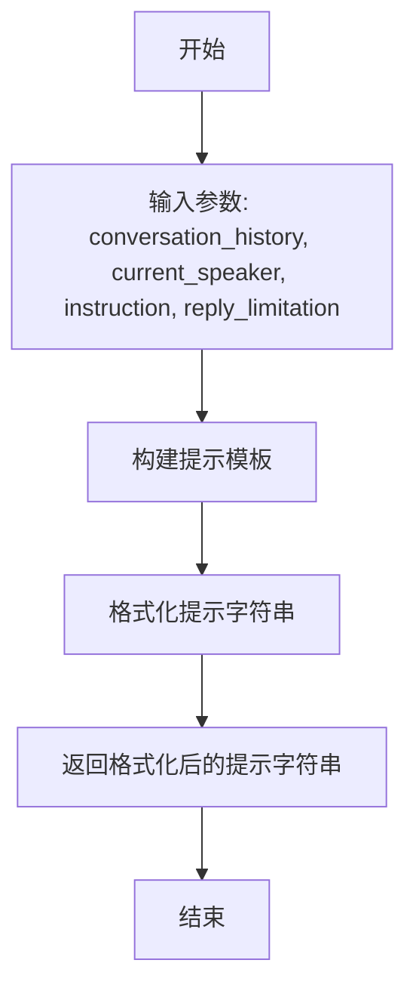

#### 带注释源码

```
class ConversationPromptTemplate:
    def __init__(self, conversation_history: str, current_speaker: str, instruction: str, reply_limitation: str):
        """
        初始化ConversationPromptTemplate类。

        Args:
            conversation_history (str): 对话历史记录，包含之前的对话内容。
            current_speaker (str): 当前发言者的名称。
            instruction (str): 给AI模型的指令，指导其如何回复。
            reply_limitation (str): 对回复的限制条件，例如长度、格式等。
        """
        self.conversation_history = conversation_history
        self.current_speaker = current_speaker
        self.instruction = instruction
        self.reply_limitation = reply_limitation

    def generate_prompt(self) -> str:
        """
        生成对话提示模板。

        Returns:
            str: 格式化后的提示字符串，用于输入到AI模型中以生成回复。
        """
        prompt = f"""
        对话历史:
        {self.conversation_history}

        当前发言者: {self.current_speaker}

        指令:
        {self.instruction}

        回复限制:
        {self.reply_limitation}

        请根据以上信息生成回复。
        """
        return prompt
```


### `MemoryPromptTemplate.generate_retrieve_prompt`

该方法用于生成一个检索提示，该提示结合了给定的查询和一组记忆（memories），以指导后续的检索过程。它通过格式化一个预定义的提示模板，将查询和记忆列表嵌入其中，从而生成一个结构化的提示字符串。

参数：

- `query`：`str`，用户提出的查询或问题，用于指导记忆检索。
- `memories`：`List[str]`，一个字符串列表，每个字符串代表一条相关的记忆或上下文信息。

返回值：`str`，返回一个格式化后的提示字符串，该字符串包含了查询和记忆，用于后续的检索任务。

#### 流程图

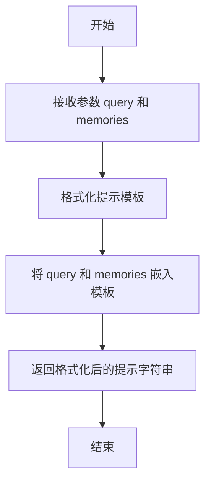

#### 带注释源码

```python
def generate_retrieve_prompt(self, query: str, memories: List[str]) -> str:
    """
    生成检索提示。

    该方法使用预定义的提示模板，将给定的查询和记忆列表格式化为一个完整的提示字符串。
    提示模板中包含了查询和记忆的占位符，通过替换这些占位符生成最终的提示。

    Args:
        query (str): 用户提出的查询或问题。
        memories (List[str]): 一个字符串列表，每个字符串代表一条相关的记忆。

    Returns:
        str: 格式化后的提示字符串。
    """
    # 定义提示模板，其中 {query} 和 {memories} 是占位符
    prompt_template = """
    Given the following query and a list of memories, generate a retrieval prompt.
    
    Query: {query}
    
    Memories:
    {memories}
    
    Please use the above information to guide the retrieval process.
    """
    
    # 将记忆列表转换为字符串，每条记忆占一行
    memories_str = "\n".join(memories)
    
    # 使用 query 和 memories_str 替换模板中的占位符
    formatted_prompt = prompt_template.format(query=query, memories=memories_str)
    
    return formatted_prompt
```


### `MemoryPromptTemplate.generate_store_prompt`

该方法用于生成一个提示词模板，该模板旨在引导语言模型（LLM）将当前对话中的关键信息（如人物、地点、事件、关系等）存储到长期记忆中。它通过提供一个结构化的格式和具体的指令，帮助模型识别和提取对话中的核心要素。

参数：

-  `self`：`MemoryPromptTemplate`，`MemoryPromptTemplate`类的实例，用于访问类属性和方法。
-  `curr_context`：`str`，当前的对话或事件上下文文本，是模型需要从中提取关键信息的原始材料。
-  `curr_act`：`str`，当前正在执行的动作或事件描述，用于进一步限定信息提取的范围和焦点。

返回值：`str`，返回一个格式化后的字符串，该字符串是一个完整的提示词，可以直接输入给LLM以执行信息存储任务。

#### 流程图

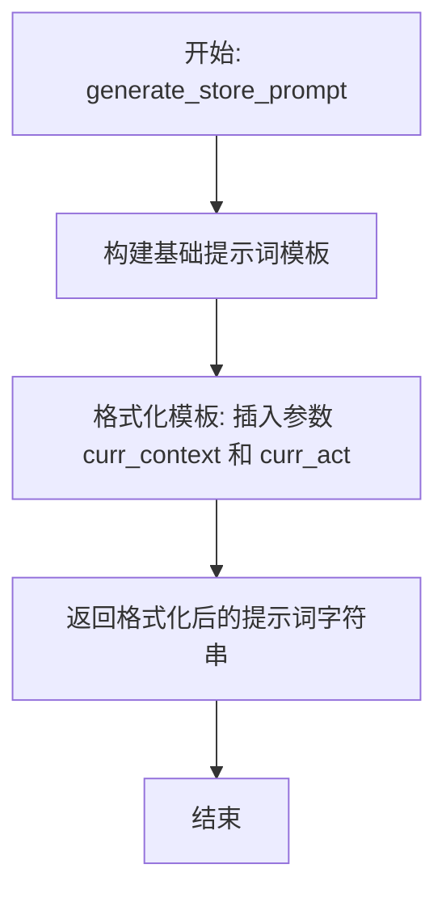

#### 带注释源码

```python
def generate_store_prompt(self, curr_context: str, curr_act: str) -> str:
    """
    生成用于存储记忆的提示词。

    该方法将当前的上下文和动作信息填充到一个预定义的提示词模板中，
    生成一个引导LLM提取并格式化关键记忆的指令。

    Args:
        curr_context (str): 当前的对话或事件上下文。
        curr_act (str): 当前执行的动作描述。

    Returns:
        str: 格式化后的存储记忆提示词。
    """
    # 定义提示词模板。模板中预留了 {curr_context} 和 {curr_act} 两个占位符。
    # 该模板指示LLM从给定上下文中提取与当前动作相关的、需要长期记住的信息，
    # 并按照“人物”、“地点”、“事件”、“关系”等类别进行组织。
    store_prompt_template = """\
Given the following context and action, generate a memory entry that captures the key information that should be remembered long-term.
Focus on extracting entities (people, places, objects), events, relationships, and emotional tones that are central to the narrative.

Context: {curr_context}
Action: {curr_act}

Please structure the memory entry as follows:
- **People**: [List and describe key people involved]
- **Places**: [List and describe key locations mentioned]
- **Events**: [Describe the main events that occurred]
- **Relationships**: [Note any relationships or interactions between entities]
- **Emotional Tone**: [Describe the overall emotional tone or mood]
- **Key Takeaways**: [Summarize the most important information to remember]

Memory Entry:
"""

    # 使用 format 方法将传入的 curr_context 和 curr_act 替换模板中的占位符，
    # 生成最终的、具体的提示词字符串。
    store_prompt = store_prompt_template.format(
        curr_context=curr_context,
        curr_act=curr_act
    )

    # 返回生成的提示词。
    return store_prompt
```


### `MemoryPromptTemplate.generate_forget_prompt`

该方法用于生成一个提示词（prompt），旨在引导一个大型语言模型（LLM）根据给定的“重要性分数”来决定哪些记忆条目应该被遗忘。它通过构造一个包含任务描述、评分标准、当前记忆列表和输出格式要求的完整提示字符串来实现。

参数：

-  `self`：`MemoryPromptTemplate`，`MemoryPromptTemplate`类的实例，用于访问类属性和方法。
-  `score`：`float`，一个介于0到10之间的浮点数，代表记忆的重要性阈值。分数低于此值的记忆将被建议遗忘。
-  `memories`：`List[str]`，一个字符串列表，其中每个字符串代表一条需要被评估的记忆条目。

返回值：`str`，返回一个格式化后的字符串，该字符串是一个完整的提示词，可以直接输入给LLM以执行记忆遗忘决策任务。

#### 流程图

```mermaid
flowchart TD
    A[开始: generate_forget_prompt(score, memories)] --> B[初始化提示词前缀<br>包含任务与评分标准]
    B --> C[遍历memories列表<br>格式化每条记忆]
    C --> D[构建记忆列表字符串<br>每条前加序号]
    D --> E[添加输出格式要求<br>（JSON列表）]
    E --> F[拼接所有部分<br>形成最终提示词]
    F --> G[返回最终提示字符串]
```

#### 带注释源码

```python
def generate_forget_prompt(self, score: float, memories: List[str]) -> str:
    """
    生成用于引导LLM遗忘记忆的提示词。

    该提示词要求模型根据提供的重要性分数阈值，评估一系列记忆，
    并返回一个建议遗忘的记忆ID列表。

    Args:
        score (float): 重要性分数阈值（0-10）。分数低于此值的记忆应被考虑遗忘。
        memories (List[str]): 需要被评估的记忆条目列表。

    Returns:
        str: 构造好的提示词字符串。
    """
    # 定义提示词的开头部分，明确任务和评分标准。
    prompt = f"""Your task is to determine which memories should be forgotten based on their importance score.
The importance score ranges from 0 to 10, where 0 is the least important and 10 is the most important.
Memories with an importance score lower than {score} should be forgotten.

Here are the memories:
"""
    # 遍历提供的记忆列表，为每条记忆添加序号，并格式化为多行文本。
    for i, memory in enumerate(memories):
        prompt += f"{i}. {memory}\n"

    # 添加提示词的结尾部分，指定模型需要输出的格式（一个JSON列表）。
    prompt += """
Output the list of memory IDs that should be forgotten as a JSON list of integers, e.g., [0, 2, 5].
Only include the JSON list in your response.
"""
    # 返回最终构造好的完整提示词字符串。
    return prompt
```


### `MemoryPromptTemplate`

`MemoryPromptTemplate` 是一个用于生成与记忆相关的提示模板的类。它提供了多种静态方法，用于构建不同场景下的提示字符串，例如生成记忆、检索记忆、反思记忆等。这些模板旨在帮助智能体在交互过程中管理和利用其记忆。

参数：

-  `agent_name`：`str`，智能体的名称，用于在提示中标识智能体。
-  `observation`：`str`，观察到的信息或事件，用于生成或检索记忆。
-  `relevant_memories`：`str`，相关的记忆信息，用于在提示中提供上下文。
-  `query`：`str`，查询或问题，用于检索相关的记忆。
-  `insight`：`str`，反思或洞察，用于生成新的记忆。
-  `curr_time`：`str`，当前时间，用于时间戳记忆。
-  `memory`：`str`，具体的记忆内容，用于反思或总结。
-  `memory_retrieved`：`str`，检索到的记忆，用于在提示中展示。
-  `memory_added`：`str`，新增的记忆，用于在提示中展示。
-  `reflection`：`str`，反思内容，用于生成总结或新的记忆。
-  `agent_summary_description`：`str`，智能体的简要描述，用于提供上下文。
-  `summary`：`str`，总结内容，用于生成新的记忆或反思。
-  `conversation`：`str`，对话内容，用于生成总结或反思。
-  `agent_summary`：`str`，智能体的总结，用于提供上下文。
-  `agent_name_a`：`str`，第一个智能体的名称，用于对话总结。
-  `agent_name_b`：`str`，第二个智能体的名称，用于对话总结。
-  `summary_impression`：`str`，总结印象，用于生成新的记忆。
-  `curr_tile`：`str`，当前位置或场景，用于提供上下文。
-  `last_tile`：`str`，上一个位置或场景，用于提供上下文。
-  `curr_time_ctx`：`str`，当前时间的上下文，用于时间戳记忆。
-  `act_obj_description`：`str`，动作对象的描述，用于生成记忆。
-  `act_desp`：`str`，动作的描述，用于生成记忆。
-  `chat`：`str`，聊天内容，用于生成记忆。
-  `act_event`：`str`，动作事件，用于生成记忆。

返回值：`str`，生成的提示字符串，用于后续的模型输入或处理。

#### 流程图

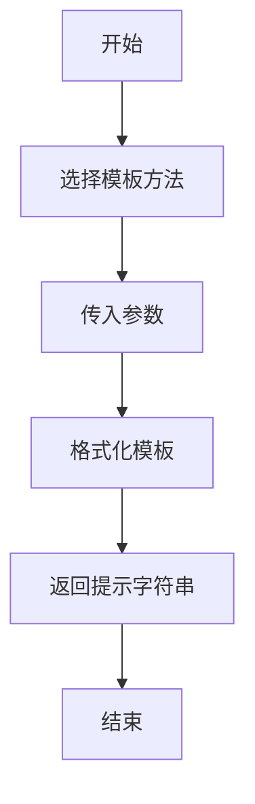

#### 带注释源码

```
#!/usr/bin/env python
# -*- coding: utf-8 -*-
# @Desc   : stanford town prompt templates

class MemoryPromptTemplate(object):
    """
    记忆提示模板类，提供多种静态方法生成与记忆相关的提示字符串。
    """

    @staticmethod
    def generate_memory_retrieval_chain_instruction(
        agent_name: str,
        observation: str,
        relevant_memories: str,
    ) -> str:
        """
        生成记忆检索链的指令提示。

        Args:
            agent_name (str): 智能体的名称。
            observation (str): 观察到的信息或事件。
            relevant_memories (str): 相关的记忆信息。

        Returns:
            str: 生成的提示字符串。
        """
        prompt = f"""
        {agent_name} 的观察: {observation}

        来自 {agent_name} 记忆的相关信息: {relevant_memories}

        这让你想起了什么？
        """
        return prompt

    @staticmethod
    def generate_memory_retrieval_chain_retrieved(
        agent_name: str,
        observation: str,
        relevant_memories: str,
        memory_retrieved: str,
    ) -> str:
        """
        生成记忆检索链的检索结果提示。

        Args:
            agent_name (str): 智能体的名称。
            observation (str): 观察到的信息或事件。
            relevant_memories (str): 相关的记忆信息。
            memory_retrieved (str): 检索到的记忆。

        Returns:
            str: 生成的提示字符串。
        """
        prompt = f"""
        {agent_name} 的观察: {observation}

        来自 {agent_name} 记忆的相关信息: {relevant_memories}

        检索到的记忆: {memory_retrieved}
        """
        return prompt

    @staticmethod
    def generate_memory_retrieval_chain_act(
        agent_name: str,
        observation: str,
        relevant_memories: str,
        memory_retrieved: str,
    ) -> str:
        """
        生成记忆检索链的动作提示。

        Args:
            agent_name (str): 智能体的名称。
            observation (str): 观察到的信息或事件。
            relevant_memories (str): 相关的记忆信息。
            memory_retrieved (str): 检索到的记忆。

        Returns:
            str: 生成的提示字符串。
        """
        prompt = f"""
        {agent_name} 的观察: {observation}

        来自 {agent_name} 记忆的相关信息: {relevant_memories}

        检索到的记忆: {memory_retrieved}

        你应该做什么？
        """
        return prompt

    @staticmethod
    def generate_memory_retrieval_chain(
        agent_name: str,
        observation: str,
        relevant_memories: str,
        memory_retrieved: str,
        memory_added: str,
    ) -> str:
        """
        生成完整的记忆检索链提示。

        Args:
            agent_name (str): 智能体的名称。
            observation (str): 观察到的信息或事件。
            relevant_memories (str): 相关的记忆信息。
            memory_retrieved (str): 检索到的记忆。
            memory_added (str): 新增的记忆。

        Returns:
            str: 生成的提示字符串。
        """
        prompt = f"""
        {agent_name} 的观察: {observation}

        来自 {agent_name} 记忆的相关信息: {relevant_memories}

        检索到的记忆: {memory_retrieved}

        新增的记忆: {memory_added}
        """
        return prompt

    @staticmethod
    def generate_memory_retrieval_query(
        agent_name: str,
        observation: str,
        relevant_memories: str,
        query: str,
    ) -> str:
        """
        生成记忆检索查询的提示。

        Args:
            agent_name (str): 智能体的名称。
            observation (str): 观察到的信息或事件。
            relevant_memories (str): 相关的记忆信息。
            query (str): 查询或问题。

        Returns:
            str: 生成的提示字符串。
        """
        prompt = f"""
        {agent_name} 的观察: {observation}

        来自 {agent_name} 记忆的相关信息: {relevant_memories}

        查询: {query}
        """
        return prompt

    @staticmethod
    def generate_memory_retrieval_query_retrieved(
        agent_name: str,
        observation: str,
        relevant_memories: str,
        query: str,
        memory_retrieved: str,
    ) -> str:
        """
        生成记忆检索查询的检索结果提示。

        Args:
            agent_name (str): 智能体的名称。
            observation (str): 观察到的信息或事件。
            relevant_memories (str): 相关的记忆信息。
            query (str): 查询或问题。
            memory_retrieved (str): 检索到的记忆。

        Returns:
            str: 生成的提示字符串。
        """
        prompt = f"""
        {agent_name} 的观察: {observation}

        来自 {agent_name} 记忆的相关信息: {relevant_memories}

        查询: {query}

        检索到的记忆: {memory_retrieved}
        """
        return prompt

    @staticmethod
    def generate_memory_retrieval_query_act(
        agent_name: str,
        observation: str,
        relevant_memories: str,
        query: str,
        memory_retrieved: str,
    ) -> str:
        """
        生成记忆检索查询的动作提示。

        Args:
            agent_name (str): 智能体的名称。
            observation (str): 观察到的信息或事件。
            relevant_memories (str): 相关的记忆信息。
            query (str): 查询或问题。
            memory_retrieved (str): 检索到的记忆。

        Returns:
            str: 生成的提示字符串。
        """
        prompt = f"""
        {agent_name} 的观察: {observation}

        来自 {agent_name} 记忆的相关信息: {relevant_memories}

        查询: {query}

        检索到的记忆: {memory_retrieved}

        你应该做什么？
        """
        return prompt

    @staticmethod
    def generate_memory_retrieval_query_chain(
        agent_name: str,
        observation: str,
        relevant_memories: str,
        query: str,
        memory_retrieved: str,
        memory_added: str,
    ) -> str:
        """
        生成完整的记忆检索查询链提示。

        Args:
            agent_name (str): 智能体的名称。
            observation (str): 观察到的信息或事件。
            relevant_memories (str): 相关的记忆信息。
            query (str): 查询或问题。
            memory_retrieved (str): 检索到的记忆。
            memory_added (str): 新增的记忆。

        Returns:
            str: 生成的提示字符串。
        """
        prompt = f"""
        {agent_name} 的观察: {observation}

        来自 {agent_name} 记忆的相关信息: {relevant_memories}

        查询: {query}

        检索到的记忆: {memory_retrieved}

        新增的记忆: {memory_added}
        """
        return prompt

    @staticmethod
    def generate_memory_reflection_insight(
        memory: str,
        insight: str,
        curr_time: str,
    ) -> str:
        """
        生成记忆反思的洞察提示。

        Args:
            memory (str): 具体的记忆内容。
            insight (str): 反思或洞察。
            curr_time (str): 当前时间。

        Returns:
            str: 生成的提示字符串。
        """
        prompt = f"""
        记忆: {memory}

        反思: {insight}

        时间: {curr_time}
        """
        return prompt

    @staticmethod
    def generate_memory_reflection_question(
        memory: str,
        curr_time: str,
    ) -> str:
        """
        生成记忆反思的问题提示。

        Args:
            memory (str): 具体的记忆内容。
            curr_time (str): 当前时间。

        Returns:
            str: 生成的提示字符串。
        """
        prompt = f"""
        记忆: {memory}

        时间: {curr_time}

        关于这个记忆，你有什么问题？
        """
        return prompt

    @staticmethod
    def generate_memory_reflection_question_answer(
        memory: str,
        curr_time: str,
        query: str,
        answer: str,
    ) -> str:
        """
        生成记忆反思的问题与答案提示。

        Args:
            memory (str): 具体的记忆内容。
            curr_time (str): 当前时间。
            query (str): 问题。
            answer (str): 答案。

        Returns:
            str: 生成的提示字符串。
        """
        prompt = f"""
        记忆: {memory}

        时间: {curr_time}

        问题: {query}

        答案: {answer}
        """
        return prompt

    @staticmethod
    def generate_memory_reflection_question_answer_insight(
        memory: str,
        curr_time: str,
        query: str,
        answer: str,
        insight: str,
    ) -> str:
        """
        生成记忆反思的问题、答案与洞察提示。

        Args:
            memory (str): 具体的记忆内容。
            curr_time (str): 当前时间。
            query (str): 问题。
            answer (str): 答案。
            insight (str): 反思或洞察。

        Returns:
            str: 生成的提示字符串。
        """
        prompt = f"""
        记忆: {memory}

        时间: {curr_time}

        问题: {query}

        答案: {answer}

        反思: {insight}
        """
        return prompt

    @staticmethod
    def generate_memory_reflection_question_answer_insight_summary(
        memory: str,
        curr_time: str,
        query: str,
        answer: str,
        insight: str,
        summary: str,
    ) -> str:
        """
        生成记忆反思的问题、答案、洞察与总结提示。

        Args:
            memory (str): 具体的记忆内容。
            curr_time (str): 当前时间。
            query (str): 问题。
            answer (str): 答案。
            insight (str): 反思或洞察。
            summary (str): 总结内容。

        Returns:
            str: 生成的提示字符串。
        """
        prompt = f"""
        记忆: {memory}

        时间: {curr_time}

        问题: {query}

        答案: {answer}

        反思: {insight}

        总结: {summary}
        """
        return prompt

    @staticmethod
    def generate_memory_reflection_question_answer_insight_summary_reflection(
        memory: str,
        curr_time: str,
        query: str,
        answer: str,
        insight: str,
        summary: str,
        reflection: str,
    ) -> str:
        """
        生成记忆反思的问题、答案、洞察、总结与反思提示。

        Args:
            memory (str): 具体的记忆内容。
            curr_time (str): 当前时间。
            query (str): 问题。
            answer (str): 答案。
            insight (str): 反思或洞察。
            summary (str): 总结内容。
            reflection (str): 反思内容。

        Returns:
            str: 生成的提示字符串。
        """
        prompt = f"""
        记忆: {memory}

        时间: {curr_time}

        问题: {query}

        答案: {answer}

        反思: {insight}

        总结: {summary}

        反思: {reflection}
        """
        return prompt

    @staticmethod
    def generate_memory_reflection_question_answer_insight_summary_reflection_memory(
        memory: str,
        curr_time: str,
        query: str,
        answer: str,
        insight: str,
        summary: str,
        reflection: str,
        memory_added: str,
    ) -> str:
        """
        生成记忆反思的问题、答案、洞察、总结、反思与新增记忆提示。

        Args:
            memory (str): 具体的记忆内容。
            curr_time (str): 当前时间。
            query (str): 问题。
            answer (str): 答案。
            insight (str): 反思或洞察。
            summary (str): 总结内容。
            reflection (str): 反思内容。
            memory_added (str): 新增的记忆。

        Returns:
            str: 生成的提示字符串。
        """
        prompt = f"""
        记忆: {memory}

        时间: {curr_time}

        问题: {query}

        答案: {answer}

        反思: {insight}

        总结: {summary}

        反思: {reflection}

        新增的记忆: {memory_added}
        """
        return prompt

    @staticmethod
    def generate_memory_reflection_question_answer_insight_summary_reflection_memory_retrieved(
        memory: str,
        curr_time: str,
        query: str,
        answer: str,
        insight: str,
        summary: str,
        reflection: str,
        memory_added: str,
        memory_retrieved: str,
    ) -> str:
        """
        生成记忆反思的问题、答案、洞察、总结、反思、新增记忆与检索记忆提示。

        Args:
            memory (str): 具体的记忆内容。
            curr_time (str): 当前时间。
            query (str): 问题。
            answer (str): 答案。
            insight (str): 反思或洞察。
            summary (str): 总结内容。
            reflection (str): 反思内容。
            memory_added (str): 新增的记忆。
            memory_retrieved (str): 检索到的记忆。

        Returns:
            str: 生成的提示字符串。
        """
        prompt = f"""
        记忆: {memory}

        时间: {curr_time}

        问题: {query}

        答案: {answer}

        反思: {insight}

        总结: {summary}

        反思: {reflection}

        新增的记忆: {memory_added}

        检索到的记忆: {memory_retrieved}
        """
        return prompt

    @staticmethod
    def generate_memory_reflection_question_answer_insight_summary_reflection_memory_retrieved_act(
        memory: str,
        curr_time: str,
        query: str,
        answer: str,
        insight: str,
        summary: str,
        reflection: str,
        memory_added: str,
        memory_retrieved: str,
    ) -> str:
        """
        生成记忆反思的问题、答案、洞察、总结、反思、新增记忆、检索记忆与动作提示。

        Args:
            memory (str): 具体的记忆内容。
            curr_time (str): 当前时间。
            query (str): 问题。
            answer (str): 答案。
            insight (str): 反思或洞察。
            summary (str): 总结内容。
            reflection (str): 反思内容。
            memory_added (str): 新增的记忆。
            memory_retrieved (str): 检索到的记忆。

        Returns:
            str: 生成的提示字符串。
        """
        prompt = f"""
        记忆: {memory}

        时间: {curr_time}

        问题: {query}

        答案: {answer}

        反思: {insight}

        总结: {summary}

        反思: {reflection}

        新增的记忆: {memory_added}

        检索到的记忆: {memory_retrieved}

        你应该做什么？
        """
        return prompt

    @staticmethod
    def generate_memory_reflection_question_answer_insight_summary_reflection_memory_retrieved_act_chain(
        memory: str,
        curr_time: str,
        query: str,
        answer: str,
        insight: str,
        summary: str,
        reflection: str,
        memory_added: str,
        memory_retrieved: str,
        memory_added_chain: str,
    ) -> str:
        """
        生成记忆反思的问题、答案、洞察、总结、反思、新增记忆、检索记忆、动作与链式新增记忆提示。

        Args:
            memory (str


### `PlanningPromptTemplate.generate_plan_prompt`

该方法根据给定的角色描述、当前事件、当前地点、当前时间、角色记忆、对话历史以及对话伙伴信息，生成一个用于规划角色下一步行动的提示文本。它整合了所有上下文信息，构建一个结构化的提示，引导AI模型模拟角色的思维过程，制定一个合理的短期行动计划。

参数：

-  `persona`：`str`，角色的描述信息，定义了角色的基本身份、性格和背景。
-  `event`：`str`，当前正在发生的事件或情境。
-  `place`：`str`，角色当前所在的地点。
-  `time`：`str`，当前的时间。
-  `memory`：``，角色的记忆信息，通常是一个字符串或可迭代对象，包含角色记得的关键信息。
-  `chat_history`：``，当前的对话历史，通常是一个字符串或列表，包含之前的对话内容。
-  `chat_partner`：`str`，对话伙伴的描述信息。

返回值：`str`，返回一个格式化后的字符串，该字符串是一个完整的提示（Prompt），用于输入给AI模型以生成角色的行动计划。

#### 流程图

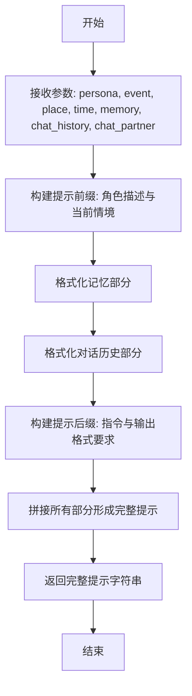

#### 带注释源码

```python
    @classmethod
    def generate_plan_prompt(
        cls,
        persona: str,
        event: str,
        place: str,
        time: str,
        memory,
        chat_history,
        chat_partner: str,
    ) -> str:
        """
        生成用于规划角色下一步行动的提示文本。
        整合角色描述、当前事件、地点、时间、记忆、对话历史及伙伴信息，
        构建一个结构化的提示，引导AI进行行动计划制定。

        Args:
            persona (str): 角色描述
            event (str): 当前事件
            place (str): 当前地点
            time (str): 当前时间
            memory: 角色记忆
            chat_history: 对话历史
            chat_partner (str): 对话伙伴描述

        Returns:
            str: 格式化后的完整提示字符串
        """
        # 构建提示的开头部分，描述角色和当前情境
        prompt = []
        prompt.append(f"{persona}")
        prompt.append(f"当前事件: {event}")
        prompt.append(f"当前地点: {place}")
        prompt.append(f"当前时间: {time}")
        prompt.append("")

        # 添加角色记忆部分
        prompt.append("相关记忆:")
        # 遍历记忆（memory假设为可迭代对象，如列表），每项记忆前加短横线
        for mem in memory:
            prompt.append(f"- {mem}")
        prompt.append("")

        # 添加对话历史部分
        prompt.append("对话历史:")
        # 遍历对话历史（chat_history假设为可迭代对象），每轮对话前加短横线
        for ch in chat_history:
            prompt.append(f"- {ch}")
        prompt.append("")

        # 添加对话伙伴信息
        prompt.append(f"你正在和 {chat_partner} 交谈。")
        prompt.append("")

        # 构建提示的指令部分，要求模型以JSON格式输出行动计划
        prompt.append("根据以上信息，规划你（作为上述角色）接下来的行动。")
        prompt.append("请输出一个JSON对象，包含以下键：")
        prompt.append('  "thoughts": { "reasoning": "...", "plan": "...", "criticism": "...", "speak": "..." },')
        prompt.append('  "command": { "name": "...", "args": {...} }')
        prompt.append("确保你的行动计划合理且符合角色设定和当前情境。")

        # 使用换行符连接所有提示部分，形成最终的提示字符串
        return "\n".join(prompt)
```


### `PlanningPromptTemplate.generate_replan_prompt`

该方法用于生成一个重新规划提示，当智能体（Agent）的当前计划（Plan）与当前环境（Context）不匹配时，调用此方法。它会整合当前环境、当前计划、智能体的角色描述、智能体的目标以及智能体的行动历史，生成一个结构化的提示，引导智能体重新制定一个更合适的计划。

参数：

-  `context`：`str`，当前环境或情境的描述，提供了智能体决策的背景信息。
-  `plan`：`str`，智能体当前的计划，需要被重新评估和修改。
-  `role`：`str`，智能体的角色描述，定义了其在环境中的身份和能力。
-  `goal`：`str`，智能体需要达成的最终目标。
-  `history`：`str`，智能体之前的行动历史记录。

返回值：`str`，返回一个格式化后的字符串，作为引导智能体进行重新规划的完整提示。

#### 流程图

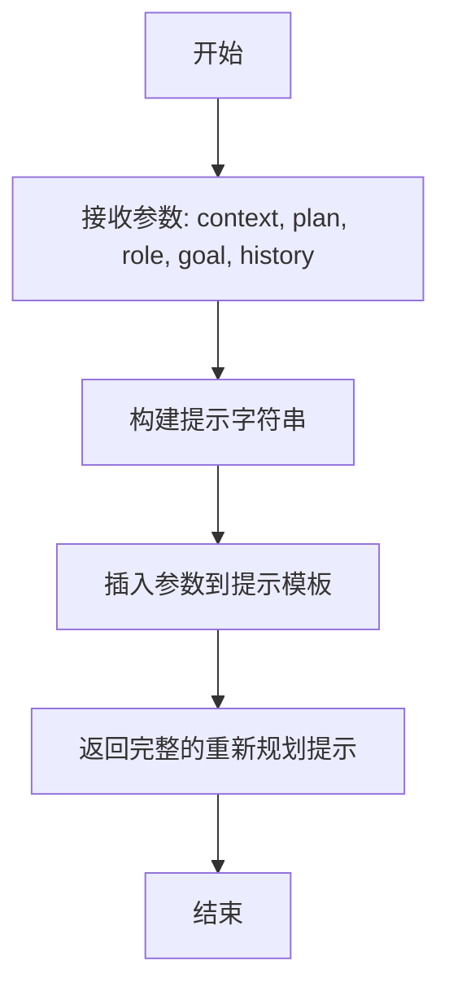

#### 带注释源码

```python
    @staticmethod
    def generate_replan_prompt(
        context: str, plan: str, role: str, goal: str, history: str
    ) -> str:
        """
        生成重新规划提示。
        当当前计划与当前环境不匹配时，调用此函数。
        它接收当前环境、当前计划、角色、目标和历史，并返回一个重新规划提示。

        参数:
            context (str): 当前环境或情境。
            plan (str): 当前计划。
            role (str): 代理的角色。
            goal (str): 代理的目标。
            history (str): 代理的历史。

        返回:
            str: 重新规划提示。
        """
        # 使用多行字符串构建提示模板，提高可读性
        # 模板清晰地定义了提示的结构和各个部分的用途
        prompt = f"""
        # 上下文
        {context}

        # 当前计划
        {plan}

        # 角色
        {role}

        # 目标
        {goal}

        # 历史
        {history}

        当前计划与当前环境不匹配。请根据上下文、角色、目标和历史重新制定一个计划。
        请仅输出新的计划，不要输出其他任何内容。
        """
        # 返回构建好的提示字符串
        return prompt
```


### `PlanningPromptTemplate.generate_task_decompose_prompt`

该方法用于生成任务分解提示词。它接收一个任务描述作为输入，并返回一个格式化的提示字符串，该字符串旨在引导一个AI代理（例如GPT-4）将给定的复杂任务分解为一系列更小、更具体的子任务。

参数：
- `task`: `str`，需要被分解的原始任务描述。

返回值：`str`，一个格式化的提示字符串，包含任务描述和用于引导任务分解的指令。

#### 流程图

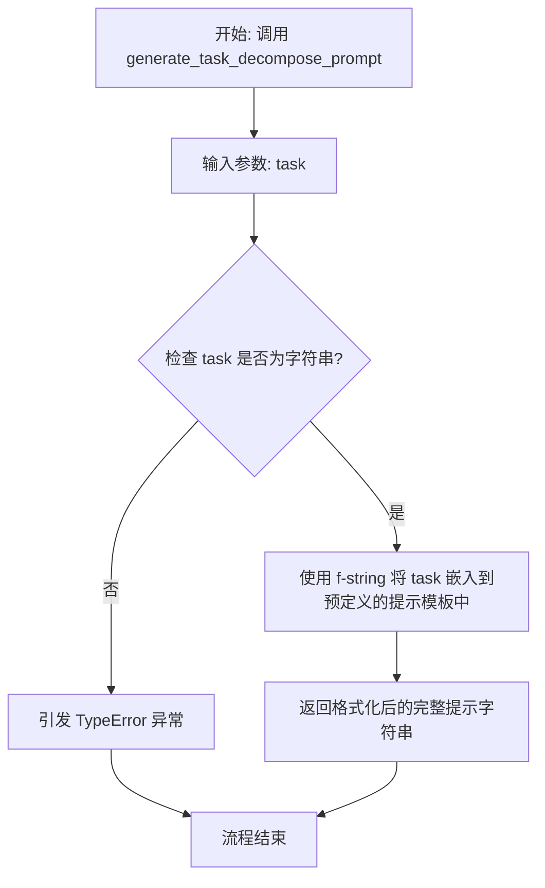

#### 带注释源码

```python
    @classmethod
    def generate_task_decompose_prompt(cls, task: str) -> str:
        """
        类方法：生成用于任务分解的提示词。
        该方法接收一个任务描述，并将其嵌入到一个固定的提示模板中，
        该模板指示AI模型（如GPT-4）将复杂任务分解为一系列子任务。

        Args:
            task (str): 需要被分解的原始任务描述。

        Returns:
            str: 一个完整的、格式化的提示字符串，用于提交给AI模型进行任务分解。

        Raises:
            TypeError: 如果输入参数 `task` 不是字符串类型。
        """
        # 预定义的提示模板。它包含：
        # 1. 一个明确的角色设定（“You are a task creation AI...”）。
        # 2. 核心指令：将给定的“总体目标”分解为更具体的子任务列表。
        # 3. 输出格式要求：以“1. ... 2. ...”的列表形式输出。
        # 4. 一个占位符 `{task}`，用于插入用户提供的具体任务。
        prompt = f"""You are a task creation AI called MIA (Multi-step Intelligent Agent) that is specialized in breaking down a general task into specific sub-tasks.

        Your mission is to help the user accomplish the following overall task: {task}

        Please break down this overall task into a list of specific, actionable sub-tasks. The sub-tasks should be clear, concise, and logically ordered to efficiently achieve the overall goal.

        Output the list of sub-tasks in the following format:
        1. [First sub-task]
        2. [Second sub-task]
        ... and so on.

        Now, provide the list of sub-tasks for the overall task: {task}
        """
        # 返回组装好的提示字符串
        return prompt
```


### `PlanningPromptTemplate`

`PlanningPromptTemplate` 是一个用于生成斯坦福小镇（Stanford Town）智能体规划阶段提示词的模板类。它通过整合智能体的当前状态、环境信息、长期目标以及近期记忆，构建一个结构化的提示，以引导智能体进行下一步的行动规划。

参数：

- `agent`：`Agent`，表示需要进行规划的智能体对象，包含其基本属性、状态和记忆。
- `place`：`Place`，表示智能体当前所处的场所对象，包含场所的描述和相关信息。
- `chat_turn`：`int`，表示当前对话的轮次，用于控制提示词中对话历史的长度。
- `reflections`：`List[str]`，表示智能体的反思列表，这些反思基于过去的经验，用于指导未来的决策。
- `self_motivation`：`str`，表示智能体的自我动机或内在驱动力，影响其目标设定和行动选择。
- `long_term_plan`：`str`，表示智能体的长期计划，为当前规划提供宏观背景和方向。
- `world_context`：`str`，表示当前世界的上下文或全局状态信息，帮助智能体理解环境变化。

返回值：`str`，返回一个格式化后的字符串，该字符串是一个完整的提示词，用于输入到语言模型中以生成智能体的下一步行动计划。

#### 流程图

```mermaid
flowchart TD
    A[开始: PlanningPromptTemplate] --> B[获取智能体基本信息<br>（姓名、年龄、特质等）]
    B --> C[获取当前场所描述]
    C --> D[获取近期记忆<br>（限制为最近chat_turn条）]
    D --> E[获取反思列表<br>（reflections）]
    E --> F[整合自我动机<br>（self_motivation）]
    F --> G[整合长期计划<br>（long_term_plan）]
    G --> H[整合世界上下文<br>（world_context）]
    H --> I[组装所有部分到提示词模板]
    I --> J[返回完整的提示词字符串]
    J --> K[结束]
```

#### 带注释源码

```python
#!/usr/bin/env python
# -*- coding: utf-8 -*-
# @Desc   : stanford town prompt templates

class PlanningPromptTemplate:
    """
    规划提示词模板类。
    用于生成引导智能体进行行动规划的提示词。
    """
    
    @staticmethod
    def generate_prompt(agent, place, chat_turn, reflections, self_motivation, long_term_plan, world_context):
        """
        生成规划阶段的提示词。
        
        参数:
            agent (Agent): 智能体对象，包含其属性和状态。
            place (Place): 当前场所对象。
            chat_turn (int): 当前对话轮次，用于限制记忆长度。
            reflections (List[str]): 反思列表。
            self_motivation (str): 自我动机描述。
            long_term_plan (str): 长期计划描述。
            world_context (str): 世界上下文描述。
            
        返回值:
            str: 格式化后的规划提示词。
        """
        # 1. 获取智能体的基本描述信息
        agent_description = f"Name: {agent.name}\nAge: {agent.age}\nTraits: {agent.traits}"
        
        # 2. 获取当前场所的描述
        place_description = f"Current Location: {place.name}\nDescription: {place.description}"
        
        # 3. 获取智能体的近期记忆（例如，最近几次对话或事件）
        # 假设agent.memory是一个列表，我们取最后`chat_turn`条记录
        recent_memory = agent.memory[-chat_turn:] if agent.memory else []
        memory_description = "Recent Memory:\n" + "\n".join(recent_memory) if recent_memory else "No recent memory."
        
        # 4. 整合反思内容
        reflections_description = "Reflections:\n" + "\n".join(reflections) if reflections else "No reflections."
        
        # 5. 构建完整的提示词模板
        prompt = f"""
        You are {agent.name}, an intelligent agent in a simulated world.
        
        {agent_description}
        
        {place_description}
        
        {memory_description}
        
        {reflections_description}
        
        Self Motivation: {self_motivation}
        
        Long Term Plan: {long_term_plan}
        
        World Context: {world_context}
        
        Based on the above information, what is your next immediate action? Please provide a concise plan.
        """
        
        return prompt
```


### `ReflectionPromptTemplate.generate_reflect_prompt`

该方法用于生成一个反思提示模板，该模板旨在引导AI代理（Agent）回顾其过去的行动、观察和反馈，以评估其策略的有效性并规划未来的行动。

参数：

-  `self`：`ReflectionPromptTemplate`，类实例自身
-  `agent_name`：`str`，进行反思的AI代理的名称
-  `agent_profile`：`str`，AI代理的背景或角色描述
-  `agent_scratchpad`：`str`，AI代理的“草稿纸”，包含其过去的行动、观察和反馈记录
-  `reflections`：`str`，AI代理之前的反思记录
-  `max_context_length`：`int`，生成提示的最大上下文长度限制

返回值：`str`，生成的反思提示字符串

#### 流程图

```mermaid
graph TD
    A[开始] --> B[构建基础提示模板]
    B --> C{reflections 参数是否为空?}
    C -->|是| D[构建无历史反思的提示]
    C -->|否| E[构建包含历史反思的提示]
    D --> F[拼接代理草稿纸内容]
    E --> F
    F --> G[截断内容至最大长度限制]
    G --> H[返回最终提示字符串]
    H --> I[结束]
```

#### 带注释源码

```python
def generate_reflect_prompt(
    self,
    agent_name: str,
    agent_profile: str,
    agent_scratchpad: str,
    reflections: str,
    max_context_length: int,
) -> str:
    """
    生成反思提示。
    参数:
        agent_name: 代理的名称。
        agent_profile: 代理的背景描述。
        agent_scratchpad: 代理的行动、观察和反馈记录。
        reflections: 代理之前的反思记录。
        max_context_length: 提示的最大上下文长度。
    返回:
        生成的反思提示字符串。
    """
    # 基础提示模板，定义了反思任务的基本框架
    prompt_template = (
        f"You are {agent_name}. {agent_profile}.\n"
        "You have been in the following circumstance:\n"
        "{agent_scratchpad}\n\n"
    )

    # 根据是否有历史反思记录，选择不同的引导语
    if reflections.strip() == "":
        # 如果没有历史反思，使用初始反思引导
        prompt_template += (
            "Given your current circumstance, what should you do next? "
            "First, you may reflect on your past actions, observations, and feedback. "
            "Then, you may plan for the future.\n\n"
            "Your reflection and thoughts (You must reflect, and then decide what to do next):"
        )
    else:
        # 如果有历史反思，将其纳入提示，并引导进行新一轮反思
        prompt_template += (
            "Your past reflections:\n"
            "{reflections}\n\n"
            "Given your current circumstance and past reflections, what should you do next? "
            "First, you may reflect on your past actions, observations, and feedback. "
            "Then, you may plan for the future.\n\n"
            "Your reflection and thoughts (You must reflect, and then decide what to do next):"
        )

    # 使用字符串格式化方法填充模板中的占位符
    # 注意：这里使用了 .format 方法，但原模板字符串使用的是 f-string 和显式变量名。
    # 为了保持一致性并正确填充 `{reflections}`，需要调整。
    # 原代码逻辑是：如果reflections为空，prompt_template中不包含{reflections}占位符。
    # 因此，需要根据情况选择格式化方式。
    if reflections.strip() == "":
        # 当没有历史反思时，模板中没有{reflections}占位符，只需格式化agent_scratchpad
        # 注意：原f-string模板中agent_scratchpad也是占位符，但这里用.format更清晰。
        # 重构为使用显式.format调用
        base_prompt = prompt_template.format(agent_scratchpad=agent_scratchpad)
    else:
        # 当有历史反思时，模板中包含{reflections}和{agent_scratchpad}占位符
        base_prompt = prompt_template.format(
            agent_scratchpad=agent_scratchpad, reflections=reflections
        )

    # 确保生成的提示不超过最大上下文长度限制
    # 如果超过，则从末尾截断
    if len(base_prompt) > max_context_length:
        base_prompt = base_prompt[:max_context_length]

    return base_prompt
```


### `ReflectionPromptTemplate.generate_insight_prompt`

该方法用于生成一个提示（prompt），引导AI模型（如GPT）对给定的对话历史进行反思，并提取出关于对话中特定人物（`person_name`）的洞察或关键信息。它旨在从对话中总结出人物的新特征、关系、事件或情感变化。

参数：

-  `person_name`：`str`，需要提取洞察的对话人物的姓名。
-  `description`：`str`，该人物当前的背景描述或已知信息。
-  `statements`：`List[str]`，与该人物相关的对话历史或陈述列表。
-  `n_chunks`：`int`，可选参数，默认为5。指定将`statements`列表分割成的块数，用于控制每次反思的输入量。

返回值：`str`，一个格式化后的字符串，作为输入给大语言模型（LLM）的提示，引导其进行反思并生成洞察。

#### 流程图

```mermaid
flowchart TD
    A[开始: generate_insight_prompt] --> B{参数statements长度 > n_chunks?};
    B -- 是 --> C[将statements列表分割成n_chunks个子列表];
    C --> D[初始化prompt_parts列表<br>并添加初始指令和人物信息];
    D --> E[循环处理每个chunk];
    E --> F[为当前chunk构建反思提示段];
    F --> G[将提示段加入prompt_parts];
    G --> H{是否还有下一个chunk?};
    H -- 是 --> E;
    H -- 否 --> I[用分隔符连接所有prompt_parts<br>形成最终prompt];
    I --> J[返回最终prompt字符串];
    B -- 否 --> K[直接将整个statements作为单个chunk处理];
    K --> D;
```

#### 带注释源码

```python
    @staticmethod
    def generate_insight_prompt(
        person_name: str, description: str, statements: List[str], n_chunks: int = 5
    ) -> str:
        """
        生成一个提示，用于引导对给定陈述进行反思，并提取关于指定人物的洞察。

        参数:
            person_name (str): 需要提取洞察的人物姓名。
            description (str): 该人物的当前描述。
            statements (List[str]): 与该人物相关的陈述列表。
            n_chunks (int): 将陈述列表分割成的块数。默认为5。

        返回:
            str: 格式化后的提示字符串。
        """
        # 将长的陈述列表分割成多个块，以便于分步反思，避免一次性输入过多文本。
        chunks = ReflectionPromptTemplate._split_list(statements, n_chunks)

        # 初始化提示部分列表，开头包含任务总体指令和人物基本信息。
        prompt_parts = [
            f"Here is the description of {person_name}: {description}\n\n"
            f"Your task is to reflect on the following statements "
            f"and generate insights about {person_name}.\n"
        ]

        # 遍历每个陈述块，为每个块构建一个反思提示段。
        for i, chunk in enumerate(chunks):
            # 构建当前块的提示段，要求模型基于已有信息和当前块内容生成新洞察。
            prompt_segment = (
                f"Statements {i + 1}/{len(chunks)}:\n"
                + "\n".join(chunk)
                + f"\n\nGiven the statements above, "
                f"which are about {person_name}, "
                f"what are 3 most salient high-level insights "
                f"we can infer about {person_name}?\n"
                # 指示模型避免重复已知信息，专注于新发现。
                f"Focus on creating new insights about {person_name}, "
                f"and avoid repeating the insights you already have.\n"
                # 指定洞察的输出格式：带编号的列表。
                f"Output the insights in the following format:\n"
                f"1. [insight 1]\n2. [insight 2]\n3. [insight 3]"
            )
            # 将当前块的提示段添加到总列表中。
            prompt_parts.append(prompt_segment)

            # 如果不是最后一个块，则添加分隔符，为下一个块的反思做准备。
            if i != len(chunks) - 1:
                prompt_parts.append(
                    f"\n\nNow we continue with the next statements about {person_name}.\n"
                    f"Remember that you already have the following insights:\n"
                    # 此处留空，实际使用中可能需要动态插入已生成的洞察。
                    # 当前模板设计是让模型在后续轮次中自行回忆和参考之前的输出。
                    f"[Your insights from previous statements]\n"
                )

        # 使用双换行符连接所有提示部分，形成完整的最终提示字符串。
        prompt = "\n\n".join(prompt_parts)
        return prompt
```


### `ReflectionPromptTemplate.generate_goal_update_prompt`

该方法用于生成一个提示词（prompt），引导AI代理（Agent）根据其当前状态、最近行动、环境反馈以及长期目标，来反思并更新其短期目标。它整合了代理的背景信息、当前目标、历史行动、环境观察以及反思结果，以生成一个结构化的、用于指导下一步行动的更新后目标描述。

参数：

-  `self`：`ReflectionPromptTemplate`，`ReflectionPromptTemplate`类的实例。
-  `agent`：`Agent`，代表进行反思的AI代理对象，包含其背景、当前目标等状态信息。
-  `observation`：`str`，代理从环境中获得的最新观察或反馈信息。
-  `reflection`：`str`，代理基于观察和自身状态进行的反思总结或分析结果。

返回值：`str`，返回一个格式化后的字符串，该字符串是一个完整的提示词，用于输入给大语言模型（LLM），以请求其生成更新后的代理目标。

#### 流程图

```mermaid
flowchart TD
    A[开始: generate_goal_update_prompt] --> B[获取代理背景<br>agent.background]
    B --> C[获取代理当前目标<br>agent.goal]
    C --> D[获取代理最近行动<br>agent.get_last_action_str]
    D --> E[整合参数: 背景, 目标, 行动, 观察, 反思]
    E --> F[使用f-string格式化模板字符串]
    F --> G[返回生成的提示词字符串]
    G --> H[结束]
```

#### 带注释源码

```python
def generate_goal_update_prompt(
    self,
    agent: Agent,          # 参数: 要进行目标更新的代理对象
    observation: str,      # 参数: 从环境获得的最新观察信息
    reflection: str        # 参数: 代理进行的反思分析结果
) -> str:                 # 返回值: 构造好的提示词字符串
    # 从代理对象中获取其背景描述
    bg = agent.background
    # 从代理对象中获取其当前设定的目标
    current_goal = agent.goal
    # 调用代理方法，获取其最近一次行动的描述字符串
    last_action = agent.get_last_action_str()

    # 使用f-string将代理的各类信息、输入参数填充到一个预定义的提示词模板中。
    # 模板结构:
    # 1. 首先给出任务指令: 要求根据提供的信息更新目标。
    # 2. 分段提供信息:
    #    - Background: 代理的背景和角色。
    #    - Current Goal: 代理正在努力实现的当前目标。
    #    - Recent Action: 代理最近采取的行动。
    #    - Observation: 环境对最近行动的反馈。
    #    - Reflection: 代理对当前情况的反思。
    # 3. 最后要求输出格式: 更新后的目标。
    prompt = f"""
    Given the following information, update the goal for the agent.

    Background: {bg}

    Current Goal: {current_goal}

    Recent Action: {last_action}

    Observation: {observation}

    Reflection: {reflection}

    Updated Goal:
    """
    # 返回构造完成的提示词字符串
    return prompt
```


### `ReflectionPromptTemplate`

`ReflectionPromptTemplate` 是一个用于生成反思提示的模板类。它根据给定的环境描述、角色名称、记忆、当前动作和对话历史，构建一个引导角色进行自我反思的提示文本。该模板旨在帮助角色评估其过去的行动和对话，以改进未来的决策和互动。

参数：

- `env_desc`：`str`，环境描述，提供角色所处的背景信息。
- `person_name`：`str`，角色名称，指定需要进行反思的角色。
- `memory`：`str`，角色的记忆信息，包含其过去的经历和知识。
- `current_action`：`str`，当前动作描述，角色正在执行或计划执行的动作。
- `conversation`：`str`，对话历史，记录角色与其他角色之间的交流内容。

返回值：`str`，返回一个格式化的反思提示字符串，用于引导角色进行自我评估和思考。

#### 流程图

```mermaid
graph TD
    A[开始] --> B[接收参数: env_desc, person_name, memory, current_action, conversation]
    B --> C[构建反思提示模板]
    C --> D[填充模板参数]
    D --> E[生成反思提示字符串]
    E --> F[返回反思提示]
    F --> G[结束]
```

#### 带注释源码

```
def ReflectionPromptTemplate(
    env_desc: str,
    person_name: str,
    memory: str,
    current_action: str,
    conversation: str
) -> str:
    """
    生成反思提示模板。

    该函数根据给定的环境描述、角色名称、记忆、当前动作和对话历史，
    构建一个引导角色进行自我反思的提示文本。

    Args:
        env_desc (str): 环境描述，提供角色所处的背景信息。
        person_name (str): 角色名称，指定需要进行反思的角色。
        memory (str): 角色的记忆信息，包含其过去的经历和知识。
        current_action (str): 当前动作描述，角色正在执行或计划执行的动作。
        conversation (str): 对话历史，记录角色与其他角色之间的交流内容。

    Returns:
        str: 返回一个格式化的反思提示字符串，用于引导角色进行自我评估和思考。
    """
    prompt = f"""
环境描述: {env_desc}

角色名称: {person_name}

记忆: {memory}

当前动作: {current_action}

对话历史: {conversation}

请根据以上信息，进行自我反思。评估你过去的行动和对话，思考如何改进未来的决策和互动。
"""
    return prompt
```


## 关键组件


### 提示词模板

用于定义和生成斯坦福小镇（Stanford Town）项目中各类智能体交互所需的文本提示模板。

### 编码声明

指定脚本使用UTF-8编码，确保在处理包含非ASCII字符（如中文）的提示词模板时不会出现编码错误。

### 脚本解释器声明

指定使用Python解释器执行此脚本，确保脚本在类Unix系统上可以直接运行。


## 问题及建议


### 已知问题

-   代码文件为空，仅包含文件头注释和模块描述，没有任何实际的类、函数或变量定义。这导致该文件目前不具备任何功能，无法实现其描述的“斯坦福小镇提示词模板”的核心目标。
-   缺少必要的导入语句和依赖声明，无法判断其计划依赖的外部库或模块。
-   缺少任何形式的文档字符串（docstring）或注释来说明其设计意图、接口契约或使用方法。

### 优化建议

-   **实现核心功能**：根据文件描述，应创建具体的提示词模板类或函数。例如，可以定义一个 `PromptTemplate` 基类，并为斯坦福小镇中的不同角色（如居民、管理员）、不同任务（如对话、决策、日常活动）创建具体的子类或模板实例。
-   **结构化代码**：建议将代码组织为模块化的结构。可以定义一个 `BaseTemplate` 类，包含模板字符串、变量替换等通用方法。然后通过继承或组合的方式创建特定场景的模板。
-   **添加文档和类型注解**：为所有类、方法和函数添加详细的文档字符串，说明其用途、参数和返回值。同时，使用Python类型注解来提高代码的可读性和可维护性。
-   **管理依赖**：如果模板生成需要用到特定的库（如`Jinja2`用于复杂模板渲染），应在文件头部声明导入，并考虑在项目依赖管理文件（如`requirements.txt`或`pyproject.toml`）中注明。
-   **编写单元测试**：创建单元测试来验证各个模板的渲染是否正确，变量替换是否如预期工作，以确保代码质量。
-   **考虑配置化**：对于大量的模板，可以考虑将模板内容存储在外部配置文件（如JSON、YAML）中，使提示词的修改和扩展无需改动代码。


## 其它


### 设计目标与约束

该代码文件旨在提供斯坦福小镇（Stanford Town）项目所需的提示词模板。其核心设计目标是提供一套结构化、可复用的文本模板，用于驱动智能体（Agent）在模拟环境中的对话、决策和行动。主要约束包括：模板需要具备足够的灵活性以适配不同的场景和角色，同时保持清晰的结构以便于程序化填充和解析；代码应保持轻量，仅作为模板的容器，不包含复杂的业务逻辑。

### 错误处理与异常设计

当前代码文件未包含显式的错误处理或异常抛出机制，因为它主要是一个静态模板定义文件。潜在的异常可能来源于外部代码对模板的使用，例如：键值缺失导致的 `KeyError`，或模板格式错误导致的渲染问题。建议在使用这些模板的上层代码中实现健壮的错误处理，例如在填充模板时捕获 `KeyError` 并提供有意义的错误信息，或对渲染后的模板进行基本的格式验证。

### 数据流与状态机

本文件作为静态资源文件，不涉及动态数据流或状态管理。其数据流是单向的：上层应用程序读取模板定义，根据当前上下文（如角色、场景、历史对话）填充模板变量，生成具体的提示文本，然后将该文本发送给大语言模型（LLM）进行处理。文件本身不维护任何状态。

### 外部依赖与接口契约

1.  **外部依赖**：无直接第三方库依赖。但模板的设计隐含了对使用方（如LLM调用框架、智能体引擎）的依赖，这些使用方需要理解并正确实现模板变量的替换逻辑。
2.  **接口契约**：
    *   **提供方（本文件）**：承诺提供符合约定键名的模板字典。每个模板应是一个字符串，其中用花括号 `{}` 标识需要替换的变量。
    *   **使用方（调用代码）**：必须提供模板中所有定义变量对应的值，并确保替换后的模板字符串是语法正确的提示词。

### 安全与合规考虑

模板内容可能直接用于生成LLM的输入，因此需要考虑：
1.  **提示词注入**：模板设计应避免将未经验证的用户输入直接放入指令关键部分，防止恶意用户通过输入篡改LLM的预期行为。
2.  **内容安全**：虽然模板本身是静态的，但填充的变量可能来自外部。建议上层应用在填充变量前，对内容进行适当的过滤或审查，以避免生成有害、偏见或不当的提示。
3.  **数据隐私**：如果模板变量包含个人可识别信息（PII），需确保其处理符合相关数据保护法规。

### 配置与可扩展性

1.  **配置**：模板以Python字典或常量的形式硬编码在文件中。这是一种简单直接的配置方式，但缺乏动态更新能力。对于需要频繁修改或A/B测试的场景，可考虑将模板移至外部配置文件（如JSON、YAML）或数据库中。
2.  **可扩展性**：添加新模板只需在文件中定义新的字典条目或字符串常量。模板的结构（变量占位符格式）是统一的，便于扩展。为了更好的组织，建议将模板按功能模块（如“角色设定”、“对话生成”、“任务规划”）进行分组注释或放在不同的类/字典中。

    