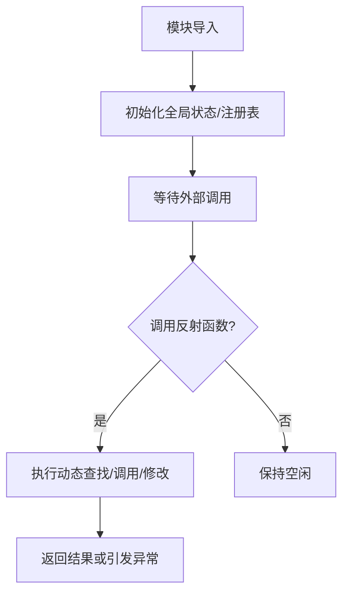

# `.\MetaGPT\metagpt\ext\stanford_town\reflect\__init__.py` 详细设计文档

该代码文件是一个反射模块的初始框架，目前仅包含文件头注释和模块描述，尚未实现具体的反射功能。其核心功能旨在提供运行时动态操作对象（如类、方法、属性）的能力，可能用于插件系统、依赖注入、序列化或动态调用等场景。

## 整体流程



## 类结构

```
该文件目前未定义任何类结构。
预期可能的类结构（根据模块名推测）:
├── Reflector (核心反射器)
│   ├── 负责类/方法的动态发现与调用
├── ClassRegistry (类注册表)
│   ├── 维护名称到类的映射
└── ...
```

## 全局变量及字段


    

## 全局函数及方法


## 关键组件


### 反射模块

该代码文件定义了一个反射模块，用于实现动态的代码加载、执行和自省功能，支持在运行时根据配置或用户输入灵活地调用不同的代码组件。

### 张量索引与惰性加载

通过特定的数据结构（如字典或映射表）管理张量索引，并结合惰性加载机制，仅在需要时才从存储（如文件或数据库）中加载张量数据，以减少内存占用并提高初始化速度。

### 反量化支持

提供将量化后的低精度数据（如INT8）转换回原始高精度数据（如FP32）的功能，包括反量化算法的实现和参数（如缩放因子、零点）的管理，以支持量化模型的推理或后续处理。

### 量化策略

定义和管理不同的量化策略（如动态量化、静态量化、感知训练量化），包括策略的配置、选择和应用逻辑，以优化模型在特定硬件上的性能和精度平衡。


## 问题及建议


### 已知问题

-   **代码不完整**：提供的代码片段仅包含文件头注释和模块描述，没有实现任何实际功能。这导致无法分析其设计、逻辑、性能或潜在缺陷。
-   **功能缺失**：`reflection module` 的描述暗示了其可能用于动态自省或元编程，但当前没有任何类、函数或逻辑来实现这些功能，模块无法使用。

### 优化建议

-   **实现核心功能**：根据模块名称 `reflection`，应实现核心的反射功能，例如：动态导入模块、检查类/对象属性、调用方法、修改属性等。可以创建 `Reflector` 或 `Inspector` 等类来封装这些操作。
-   **添加类型注解**：在实现函数和方法时，应使用类型注解（Type Hints）来提高代码的可读性和可维护性，并方便静态类型检查工具（如 mypy）进行分析。
-   **编写单元测试**：为实现的反射功能编写全面的单元测试，确保其在不同场景下的行为符合预期，并防止未来修改引入回归错误。
-   **完善文档字符串**：为模块、类和方法添加详细的文档字符串（docstring），说明其用途、参数、返回值和示例用法。
-   **考虑安全性**：反射功能强大但危险。在实现动态代码执行（如 `eval`、`exec`）或属性访问时，必须仔细考虑安全边界，避免代码注入等安全漏洞。可以提供安全模式或严格的输入验证。
-   **性能考量**：反射操作通常比直接调用慢。如果性能是关键考量，需要评估使用频率，并考虑提供缓存机制（例如，缓存类的方法列表、属性字典等）来优化重复操作。


## 其它


### 设计目标与约束

该代码文件旨在实现一个“反思”模块，其核心设计目标是提供一个框架或机制，用于在程序运行时进行自我检查、行为调整或元编程。主要约束包括：保持代码的简洁性和可读性，确保模块化设计以便于扩展，以及可能需要在特定Python环境下运行（如通过shebang指定的Python解释器）。

### 错误处理与异常设计

当前代码仅为模块声明，尚未实现具体功能，因此没有定义明确的错误处理机制。在后续开发中，应考虑定义模块特定的异常类（例如`ReflectionError`），并在可能失败的操作（如动态导入、属性访问、方法调用）中使用`try-except`块来捕获和处理`ImportError`、`AttributeError`、`TypeError`等标准异常，确保模块的健壮性并向调用者提供清晰的错误信息。

### 数据流与状态机

由于当前模块为空实现，不存在具体的数据流或状态机。未来若模块涉及配置加载、动态对象创建或行为链，则需要描述数据（如配置字典、类对象、函数引用）如何在模块的各个组件（如加载器、分析器、执行器）之间流动。如果模块具有不同的操作模式或阶段（如初始化、分析、执行、清理），则应设计并描述一个状态机来管理这些状态转换。

### 外部依赖与接口契约

模块目前没有显式的外部依赖（除了Python标准库）。在后续开发中，如果模块需要与外部系统（如数据库、网络服务）、其他第三方库或项目内的其他模块交互，则需要明确列出这些依赖。同时，应定义清晰的接口契约，包括模块对外暴露的公共函数、类及其方法（即API），以及这些接口所期望的输入参数、返回值和可能抛出的异常，确保模块的易用性和可维护性。

### 安全与权限考虑

如果“反思”模块涉及执行动态代码（如`eval`、`exec`）、访问敏感系统属性或进行网络操作，则必须考虑安全性。设计文档应指出潜在的安全风险（如代码注入、信息泄露）并提出缓解措施，例如：限制可执行代码的范围、对输入进行严格的验证和清理、在沙箱环境中运行不受信任的代码、以及明确模块运行所需的最小权限。

### 性能考量

虽然当前为空实现，但设计文档应预估未来可能影响性能的操作，例如：频繁的反射操作（如`getattr`/`setattr`）、深度对象图遍历、动态代码编译等。建议提出性能优化方向，如缓存反射结果、使用惰性加载、避免不必要的深度复制，并为关键操作考虑时间复杂度。

### 测试策略

为确保模块质量，需要制定测试策略。这应包括：单元测试（针对每个类和函数）、集成测试（测试模块与其他组件的交互）、以及可能的性能测试。特别对于反射这种动态特性，测试应覆盖各种边界情况，例如：不存在的属性、私有方法、继承链上的查找等。建议使用 mocking 来隔离测试依赖。

### 配置与可扩展性

模块可能需要通过配置文件、环境变量或函数参数进行行为定制（例如，启用/禁用某些反射特性、设置缓存大小、指定类搜索路径）。设计文档应描述配置机制。同时，模块设计应支持扩展，例如通过插件架构允许用户添加自定义的反射处理器或分析器，并说明扩展点（如基类、注册函数）的设计。

### 日志与监控

为了便于调试和运维，模块应集成日志记录功能，在关键步骤（如开始反射分析、发现特定模式、遇到错误）输出不同级别（DEBUG, INFO, WARNING, ERROR）的日志。设计文档应规定日志格式、输出位置以及可配置的日志级别。对于生产环境，还可考虑添加监控指标，如反射操作次数、平均耗时、错误率等。

    