# `.\MetaGPT\metagpt\ext\stanford_town\reflect\reflect.py` 详细设计文档

该代码是斯坦福小镇（Stanford Town）智能体模拟框架中角色（Role）的反思（Reflection）功能模块。其核心功能是驱动智能体（角色）基于其近期记忆（事件和想法）进行周期性或触发式的深度思考，生成新的见解（insights）、规划（planning）和记忆（memory），并将这些结构化信息存储回角色的记忆系统中，以模拟人类的自省、学习和长期规划能力。

## 整体流程

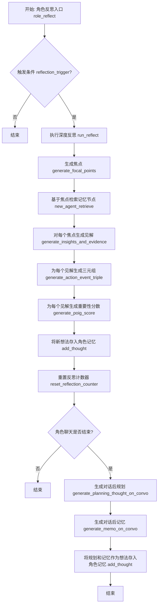

## 类结构

```
reflect_function.py (模块)
├── 全局异步函数
│   ├── generate_focal_points
│   ├── generate_insights_and_evidence
│   ├── generate_action_event_triple
│   ├── generate_poig_score
│   ├── generate_planning_thought_on_convo
│   ├── generate_memo_on_convo
│   ├── run_reflect
│   └── role_reflect
├── 全局同步函数
│   ├── reflection_trigger
│   └── reset_reflection_counter
└── 外部导入类 (来自 metagpt.ext.stanford_town.actions.run_reflect_action)
    ├── AgentFocusPt
    ├── AgentInsightAndGuidance
    ├── AgentEventTriple
    ├── AgentEventPoignancy
    ├── AgentChatPoignancy
    ├── AgentPlanThoughtOnConvo
    └── AgentMemoryOnConvo
```

## 全局变量及字段


    

## 全局函数及方法

### `generate_focal_points`

该函数用于为给定的角色（`role`）生成焦点（focal points）。它首先从角色的记忆（`memory`）中筛选出非空闲的事件和想法节点，然后按最后访问时间排序，并选择最近的重要节点。最后，通过调用 `AgentFocusPt` 类的 `run` 方法生成指定数量的焦点。

参数：

- `role`：`STRole`，表示当前的角色对象，包含角色的记忆、状态等信息。
- `n`：`int`，可选参数，默认值为 3，表示需要生成的焦点数量。

返回值：`list`，返回一个包含生成的焦点的列表。

#### 流程图

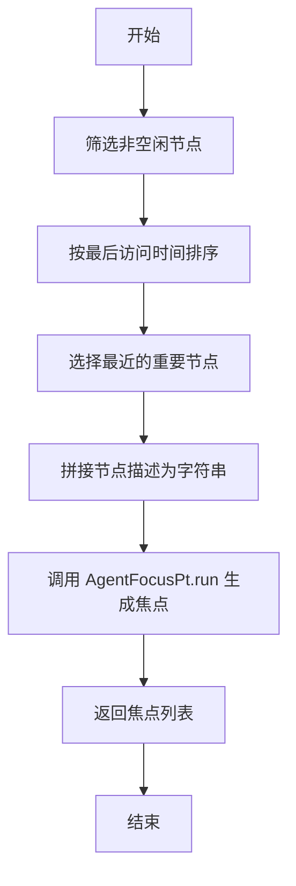

#### 带注释源码

```python
async def generate_focal_points(role: "STRole", n: int = 3):
    # 从角色的记忆（事件列表和想法列表）中筛选出非空闲的节点
    nodes = [
        [i.last_accessed, i] for i in role.memory.event_list + role.memory.thought_list if "idle" not in i.embedding_key
    ]
    # 按节点的最后访问时间排序
    nodes = sorted(nodes, key=lambda x: x[0])
    # 提取排序后的节点对象
    nodes = [i for _, i in nodes]

    # 拼接最近的重要节点的描述为字符串
    statements = ""
    for node in nodes[-1 * role.scratch.importance_ele_n :]:
        statements += node.embedding_key + "\n"
    # 创建 AgentFocusPt 实例并调用其 run 方法生成焦点
    run_focal_pt = AgentFocusPt()
    return await run_focal_pt.run(role, statements, n)
```

### `generate_insights_and_evidence`

该函数是斯坦福小镇（Stanford Town）智能体反思机制的核心组件之一。它接收一个智能体（角色）和一组记忆节点（`nodes`），通过调用 `AgentInsightAndGuidance` 动作，基于这些节点生成一组“洞察”（insights）或“指导性想法”（guidance thoughts）。每个洞察都关联到提供证据的原始记忆节点ID。该函数将自然语言处理生成的洞察与具体的记忆证据关联起来，是构建智能体连贯自传式记忆和进行高级推理的关键步骤。

参数：
- `role`：`STRole`，当前执行反思的智能体（角色）对象，提供了记忆、状态等上下文信息。
- `nodes`：`list`，一个记忆节点（`Node`对象）列表，通常是通过检索（retrieve）功能获取的、与某个焦点（focal point）相关的记忆。
- `n`：`int`，可选参数，默认为5。指定要生成的洞察（insights）的最大数量。

返回值：`dict`，返回一个字典。字典的键（`str`类型）是生成的洞察文本（thought），值（`list`类型）是支持该洞察的证据节点ID列表（`memory_id`）。如果处理过程中发生异常，则返回一个包含默认键值对的字典 `{"this is blank": "node_1"}`。

#### 流程图

```mermaid
flowchart TD
    A[开始: generate_insights_and_evidence] --> B[将nodes列表格式化为带编号的语句字符串]
    B --> C[实例化AgentInsightAndGuidance动作]
    C --> D[异步执行动作的run方法<br/>传入role, statements, n]
    D --> E{执行成功?}
    E -- 是 --> F[遍历返回的字典ret<br/>将证据索引转换为节点ID]
    F --> G[返回处理后的洞察-证据字典]
    E -- 否<br/>发生异常 --> H[记录错误日志]
    H --> I[返回默认字典<br/>{"this is blank": "node_1"}]
    G --> J[结束]
    I --> J
```

#### 带注释源码

```python
async def generate_insights_and_evidence(role: "STRole", nodes: list, n: int = 5):
    # 1. 数据准备：将输入的节点列表格式化为一个带编号的文本字符串。
    #    每个节点的 `embedding_key` 属性（通常是节点内容的文本摘要）被提取出来。
    #    这个字符串将作为提示词的一部分，提供给后续的LLM调用。
    statements = ""
    for count, node in enumerate(nodes):
        statements += f"{str(count)}. {node.embedding_key}\n"

    # 2. 动作执行：实例化专门负责生成洞察和指导的 `AgentInsightAndGuidance` 动作类，
    #    并异步调用其 `run` 方法。
    #    该方法内部会构造提示词，调用语言模型，请求模型基于 `statements` 生成 `n` 个洞察。
    run_insight_and_guidance = AgentInsightAndGuidance()
    ret = await run_insight_and_guidance.run(role, statements, n)

    # 3. 日志记录：记录LLM返回的原始结果，便于调试。
    logger.info(ret)

    # 4. 结果后处理：尝试将LLM返回的结果进行转换。
    #    预期的原始返回值 `ret` 是一个字典，结构为 `{“洞察文本”: [证据节点索引列表]}`。
    #    例如：`{"喜欢读书": [0, 2], "害怕孤独": [1]}`。
    try:
        for thought, evi_raw in ret.items():
            # 将证据索引列表 `evi_raw` 转换为对应节点的唯一内存ID `memory_id`。
            # `nodes[i].memory_id` 根据索引 `i` 从输入的 `nodes` 列表中获取。
            evidence_node_id = [nodes[i].memory_id for i in evi_raw]
            # 更新字典，将值替换为节点ID列表。
            ret[thought] = evidence_node_id
        # 5. 返回处理后的字典，建立了“洞察”到“具体记忆证据ID”的映射。
        return ret
    except Exception as exp:
        # 6. 异常处理：如果上述任何步骤失败（如格式不符、索引越界等），
        #    记录错误并返回一个安全的默认值，防止整个反思流程中断。
        #    默认值包含一个虚拟的洞察和证据，保证调用者能获得一个有效的字典结构。
        logger.error(f"generate_insights_and_evidence error:{exp}")
        return {"this is blank": "node_1"}
```

### `generate_action_event_triple`

该函数用于根据给定的动作描述和角色实例，生成一个动作事件的三元组（主语、谓语、宾语）。它通过调用`AgentEventTriple`类的`run`方法来实现，将动作描述和角色作为输入，返回一个表示事件的三元组。

参数：

- `act_desp`：`str`，动作的描述（例如："sleeping"）
- `role`：`STRole`，角色实例，包含角色的属性和状态信息

返回值：`tuple`，返回一个三元组（主语、谓语、宾语），表示动作事件的结构。

#### 流程图

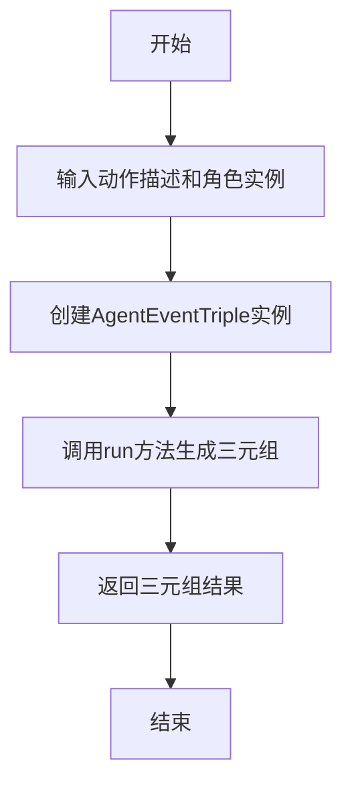

#### 带注释源码

```python
async def generate_action_event_triple(act_desp: str, role: "STRole"):
    """TODO

    INPUT:
        act_desp: the description of the action (e.g., "sleeping")
        role: The Persona class instance
    OUTPUT:
        a string of emoji that translates action description.
    EXAMPLE OUTPUT:
        "🧈🍞"
    """
    # 创建AgentEventTriple实例，用于生成动作事件的三元组
    run_event_triple = AgentEventTriple()
    # 调用run方法，传入动作描述和角色实例，生成三元组
    result = await run_event_triple.run(act_desp, role)
    # 返回生成的三元组结果
    return result
```

### `generate_poig_score`

该函数根据事件类型（event/thought/chat）和描述，计算并返回一个“重要性/显著性”（poignancy）分数。对于“idle”事件，直接返回最低分数1；对于其他事件类型，则调用相应的代理（AgentEventPoignancy 或 AgentChatPoignancy）来计算分数。

参数：
- `role`：`STRole`，表示当前的角色（Persona）实例，包含角色的状态、记忆和行为描述等信息。
- `event_type`：`str`，表示事件的类型，可以是 "event"、"thought" 或 "chat"。
- `description`：`str`，表示事件的描述文本。

返回值：`int`，返回一个表示事件重要性的整数分数。

#### 流程图

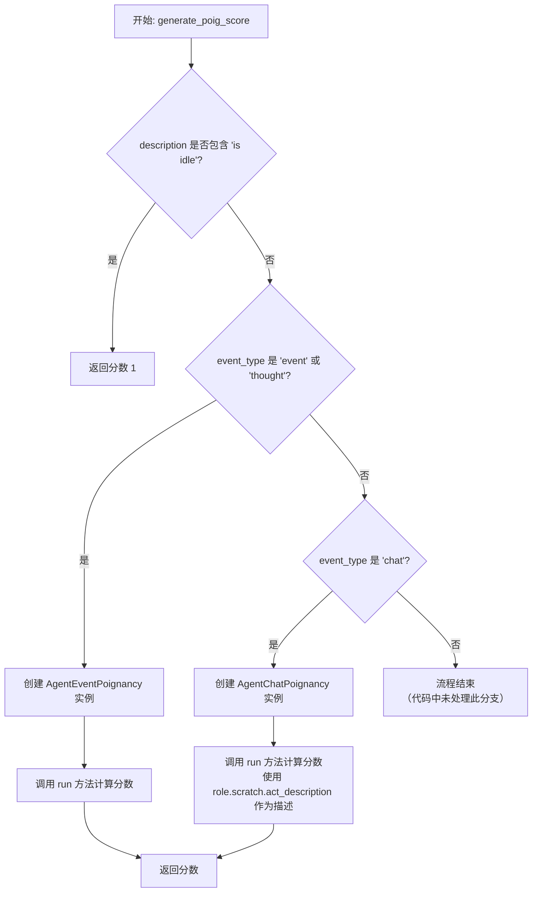

#### 带注释源码

```python
async def generate_poig_score(role: "STRole", event_type: str, description: str):
    # 如果描述中包含“is idle”，则直接返回最低的重要性分数1。
    if "is idle" in description:
        return 1

    # 根据事件类型，选择不同的代理来计算重要性分数。
    if event_type == "event" or event_type == "thought":
        # 对于“事件”或“想法”类型，使用 AgentEventPoignancy 代理。
        run_event_poignancy = AgentEventPoignancy()
        # 调用代理的 run 方法，传入角色和事件描述，并等待返回分数。
        return await run_event_poignancy.run(role, description)
    elif event_type == "chat":
        # 对于“聊天”类型，使用 AgentChatPoignancy 代理。
        run_chat_poignancy = AgentChatPoignancy()
        # 调用代理的 run 方法，传入角色和角色的当前行为描述，并等待返回分数。
        return await run_chat_poignancy.run(role, role.scratch.act_description)
    # 注意：代码中没有为其他 event_type 值提供默认处理或错误抛出。
```

### `generate_planning_thought_on_convo`

该函数用于在对话结束后，基于整个对话内容生成一个规划性思考。它通过调用 `AgentPlanThoughtOnConvo` 类的 `run` 方法，将角色和完整的对话文本作为输入，生成一个关于未来行动或决策的规划性思考。

参数：

- `role`：`STRole`，表示当前的角色对象，包含角色的状态、记忆和行为等信息。
- `all_utt`：`str`，表示完整的对话文本，包含所有参与者的发言内容。

返回值：`str`，返回一个字符串，表示基于对话生成的规划性思考内容。

#### 流程图

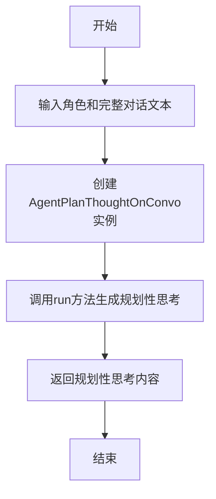

#### 带注释源码

```python
async def generate_planning_thought_on_convo(role: "STRole", all_utt: str):
    # 创建AgentPlanThoughtOnConvo类的实例，用于生成规划性思考
    run_planning_on_convo = AgentPlanThoughtOnConvo()
    # 调用run方法，传入角色和完整对话文本，生成规划性思考并返回结果
    return await run_planning_on_convo.run(role, all_utt)
```

### `generate_memo_on_convo`

该函数用于生成关于对话的记忆摘要。它接收一个角色对象和完整的对话文本，通过调用 `AgentMemoryOnConvo` 类的 `run` 方法，生成一个关于对话的记忆摘要，并返回该摘要。

参数：

- `role`：`STRole`，表示当前的角色对象，包含角色的状态、记忆等信息。
- `all_utt`：`str`，表示完整的对话文本，包含所有参与者的发言。

返回值：`str`，返回生成的关于对话的记忆摘要。

#### 流程图

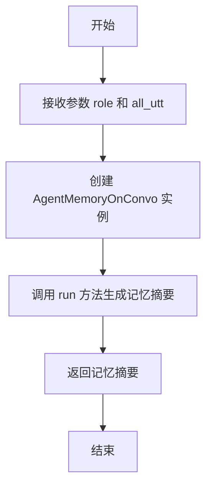

#### 带注释源码

```python
async def generate_memo_on_convo(role: "STRole", all_utt: str):
    # 创建 AgentMemoryOnConvo 类的实例，用于生成对话的记忆摘要
    run_memo_on_convo = AgentMemoryOnConvo()
    # 调用 run 方法，传入角色对象和完整的对话文本，生成记忆摘要
    return await run_memo_on_convo.run(role, all_utt)
```

### `run_reflect`

该函数是角色反思机制的核心执行函数。它首先生成反思的焦点，然后检索与这些焦点相关的记忆节点，接着为每个焦点生成洞察和证据，最后将这些洞察作为“思想”存储到角色的长期记忆中。

参数：

- `role`：`STRole`，当前进行反思的角色对象。

返回值：`None`，该函数不返回任何值，其作用是将生成的反思内容存入角色的记忆系统。

#### 流程图

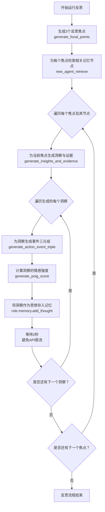

#### 带注释源码

```python
async def run_reflect(role: "STRole"):
    """
    Run the actual reflection. We generate the focal points, retrieve any
    relevant nodes, and generate thoughts and insights.

    INPUT:
        role: Current Persona object
    Output:
        None
    """
    # 1. 生成反思的焦点。这些焦点是反思的起始点或主题。
    focal_points = await generate_focal_points(role, 3)
    # 2. 为每个焦点检索相关的记忆节点（事件或思想）。
    # <retrieved> 是一个字典，键是焦点，值是与该焦点相关的节点列表。
    retrieved = new_agent_retrieve(role, focal_points)

    # 3. 遍历每个焦点及其相关的节点。
    for focal_pt, nodes in retrieved.items():
        # 记录日志：输出检索到的节点内容，用于调试。
        xx = [i.embedding_key for i in nodes]
        for xxx in xx:
            logger.info(f"Nodes retrieved for `{focal_pt}` are `{xxx}`.")

        # 4. 为当前焦点和节点生成洞察（thoughts）及其证据（evidence）。
        # 返回一个字典，键是洞察内容，值是证据节点的ID列表。
        thoughts = await generate_insights_and_evidence(role, nodes, 5)
        # 5. 遍历生成的每一个洞察。
        for thought, evidence in thoughts.items():
            # 设置该思想记忆的创建时间和过期时间（30天后）。
            created = role.scratch.curr_time
            expiration = created + datetime.timedelta(days=30)
            # 6. 为洞察生成一个事件三元组（主语、谓语、宾语），用于结构化表示。
            s, p, o = await generate_action_event_triple("(" + thought + ")", role)
            # 从三元组中提取关键词。
            keywords = set([s, p, o])
            # 7. 计算该洞察的情感强度（poignancy score）。
            thought_poignancy = await generate_poig_score(role, "thought", thought)
            # 获取洞察的文本嵌入向量。
            thought_embedding_pair = (thought, get_embedding(thought))

            # 8. 将生成的洞察作为一条“思想”记录添加到角色的长期记忆中。
            role.memory.add_thought(
                created, expiration, s, p, o, thought, keywords, thought_poignancy, thought_embedding_pair, evidence
            )
            # 记录添加成功的日志。
            logger.info(f"add thought memory: {thought}, evidence: {evidence}")
            # 9. 为避免调用外部API（如嵌入模型）时触发速率限制，每次添加后暂停2秒。
            time.sleep(2)  # avoid Rate limit
```

### `reflection_trigger`

该函数用于判断给定的角色（`role`）是否应该触发反思（reflection）过程。它通过检查角色的当前重要性触发计数器（`importance_trigger_curr`）是否小于等于0，并且角色的记忆事件列表和思考列表是否非空，来决定是否返回`True`以触发反思。

参数：

- `role`：`STRole`，当前的角色对象，包含角色的状态、记忆和属性等信息。

返回值：`bool`，如果满足触发条件则返回`True`，否则返回`False`。

#### 流程图

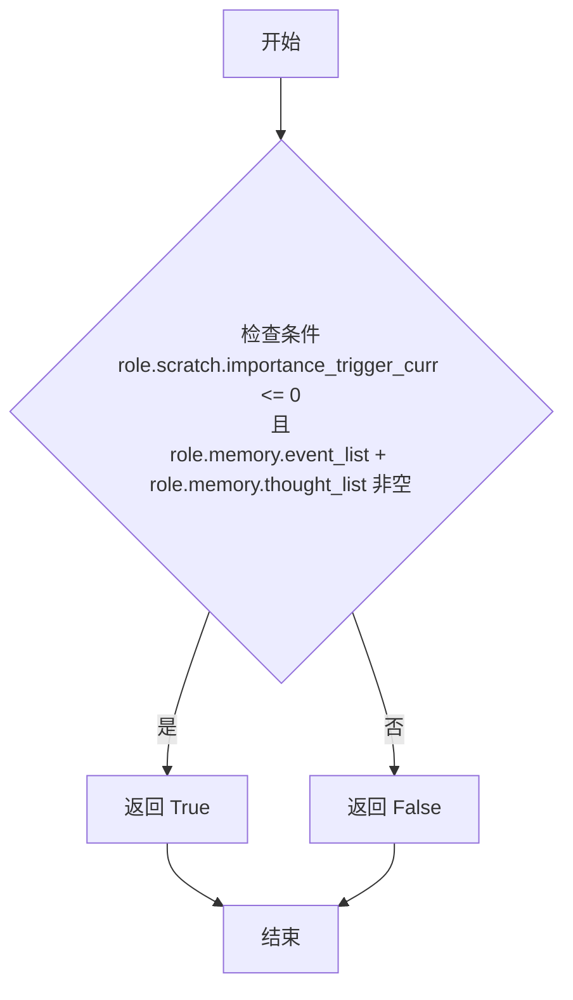

#### 带注释源码

```python
def reflection_trigger(role: "STRole"):
    """
    给定当前角色，判断该角色是否应该运行反思。

    我们当前的实现检查新的重要性度量之和是否达到了设定的（超参数）阈值。

    输入：
        role: 当前的角色对象
    输出：
        如果运行新的反思，则返回 True。
        否则返回 False。
    """
    # 记录当前角色的重要性触发计数器的值，用于调试或日志记录
    logger.info(f"{role.scratch.name} role.scratch.importance_trigger_curr:: {role.scratch.importance_trigger_curr}"),

    # 检查触发条件：重要性触发计数器小于等于0，并且事件列表和思考列表非空
    if role.scratch.importance_trigger_curr <= 0 and [] != role.memory.event_list + role.memory.thought_list:
        return True  # 满足条件，触发反思
    return False  # 不满足条件，不触发反思
```

### `reset_reflection_counter`

重置用于触发反思的计数器。具体来说，它将角色的重要性触发计数器重置为最大值，并将重要性元素数量重置为0。

参数：

- `role`：`STRole`，当前的角色对象，包含角色的状态和记忆信息。

返回值：`None`，无返回值。

#### 流程图

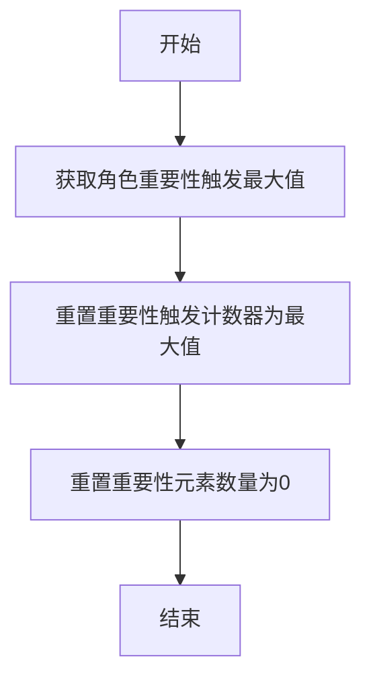

#### 带注释源码

```python
def reset_reflection_counter(role: "STRole"):
    """
    重置用于触发反思的计数器。

    输入：
        role: 当前的角色对象
    输出：
        无
    """
    # 获取角色的重要性触发最大值
    role_imt_max = role.scratch.importance_trigger_max
    # 将当前的重要性触发计数器重置为最大值
    role.scratch.importance_trigger_curr = role_imt_max
    # 将重要性元素数量重置为0
    role.scratch.importance_ele_n = 0
```

### `role_reflect`

`role_reflect` 是角色（Persona）的主要反思模块。它首先检查触发条件是否满足，如果满足，则执行反思过程并重置相关的计数器。此外，如果角色处于聊天结束状态，它还会生成关于对话的规划思考和记忆思考，并将它们添加到角色的记忆中。

参数：

- `role`：`STRole`，当前的角色（Persona）对象

返回值：`None`，无返回值

#### 流程图

```mermaid
flowchart TD
    A[开始: role_reflect] --> B{reflection_trigger(role) 为真?}
    B -- 是 --> C[执行 run_reflect(role)]
    C --> D[重置计数器 reset_reflection_counter(role)]
    D --> E{角色聊天结束时间 chatting_end_time 存在?}
    B -- 否 --> E
    E -- 是 --> F[检查是否到达聊天结束时间]
    F -- 是 --> G[获取所有聊天记录 all_utt]
    G --> H[获取最后一条聊天记录作为证据]
    H --> I[生成规划思考 planning_thought]
    I --> J[将规划思考添加到记忆]
    J --> K[生成记忆思考 memo_thought]
    K --> L[将记忆思考添加到记忆]
    L --> M[结束]
    E -- 否 --> M
    F -- 否 --> M
```

#### 带注释源码

```python
async def role_reflect(role: "STRole"):
    """
    The main reflection module for the role. We first check if the trigger
    conditions are met, and if so, run the reflection and reset any of the
    relevant counters.

    INPUT:
        role: Current Persona object
    Output:
        None
    """
    # 步骤1: 检查反思触发条件
    if reflection_trigger(role):
        # 步骤2: 执行核心反思流程
        await run_reflect(role)
        # 步骤3: 重置反思计数器
        reset_reflection_counter(role)

    # 步骤4: 检查角色是否处于聊天结束状态
    if role.scratch.chatting_end_time:
        # 步骤5: 检查当前时间是否到达聊天结束时间
        # update 10 to it's real sec_per_step value
        if role.scratch.curr_time + datetime.timedelta(0, role.sec_per_step) == role.scratch.chatting_end_time:
            # 步骤6: 拼接所有聊天记录
            all_utt = ""
            if role.scratch.chat:
                for row in role.scratch.chat:
                    all_utt += f"{row[0]}: {row[1]}\n"

            # 步骤7: 获取最后一条聊天记录作为证据节点ID
            last_chat = role.memory.get_last_chat(role.scratch.chatting_with)
            if last_chat:
                evidence = [last_chat.memory_id]
            else:
                logger.info(f"Role: {role.name} get_last_chat: {last_chat}")
                return

            # 步骤8: 生成关于对话的规划思考
            planning_thought = await generate_planning_thought_on_convo(role, all_utt)
            planning_thought = f"For {role.scratch.name}'s planning: {planning_thought}"
            logger.info(f"Role: {role.name} planning_thought: {planning_thought}")

            # 步骤9: 将规划思考作为“思想”节点添加到角色记忆中
            created = role.scratch.curr_time
            expiration = created + datetime.timedelta(days=30)
            s, p, o = await generate_action_event_triple(planning_thought, role)
            keywords = set([s, p, o])
            thought_poignancy = await generate_poig_score(role, "thought", planning_thought)
            thought_embedding_pair = (planning_thought, get_embedding(planning_thought))

            role.memory.add_thought(
                created,
                expiration,
                s,
                p,
                o,
                planning_thought,
                keywords,
                thought_poignancy,
                thought_embedding_pair,
                evidence,
            )

            # 步骤10: 生成关于对话的记忆思考
            memo_thought = await generate_memo_on_convo(role, all_utt)
            memo_thought = f"{role.scratch.name} {memo_thought}"

            # 步骤11: 将记忆思考作为另一个“思想”节点添加到角色记忆中
            created = role.scratch.curr_time
            expiration = created + datetime.timedelta(days=30)
            s, p, o = await generate_action_event_triple(memo_thought, role)
            keywords = set([s, p, o])
            thought_poignancy = await generate_poig_score(role, "thought", memo_thought)
            thought_embedding_pair = (memo_thought, get_embedding(memo_thought))

            role.memory.add_thought(
                created,
                expiration,
                s,
                p,
                o,
                memo_thought,
                keywords,
                thought_poignancy,
                thought_embedding_pair,
                evidence,
            )
```

### `AgentFocusPt.run`

该方法用于生成角色的焦点（focal points），即从角色的记忆（事件和想法）中提取关键信息，并通过某种机制（如语言模型）生成若干焦点描述。

参数：

- `role`：`STRole`，表示当前角色对象，包含角色的记忆、状态等信息。
- `statements`：`str`，表示从角色记忆中提取的文本描述，用于生成焦点。
- `n`：`int`，表示需要生成的焦点数量，默认为3。

返回值：`list`，返回一个包含生成的焦点描述的列表。

#### 流程图

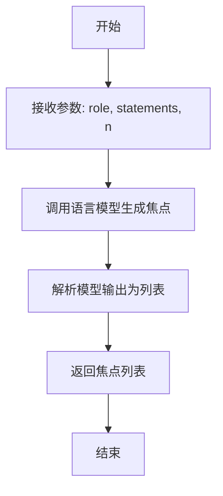

#### 带注释源码

```python
async def run(self, role: "STRole", statements: str, n: int = 3) -> list:
    """
    生成角色的焦点（focal points）。

    该方法通过语言模型从提供的 statements 中提取关键信息，生成指定数量的焦点描述。

    Args:
        role (STRole): 当前角色对象，包含角色的记忆和状态信息。
        statements (str): 从角色记忆中提取的文本描述，用于生成焦点。
        n (int, optional): 需要生成的焦点数量，默认为3。

    Returns:
        list: 包含生成的焦点描述的列表。
    """
    # 调用语言模型生成焦点
    prompt = self._generate_prompt(statements, n)
    response = await self.llm.aask(prompt)
    
    # 解析模型输出为列表
    focal_points = self._parse_response(response)
    
    return focal_points
```

### `AgentInsightAndGuidance.run`

该方法用于生成角色的洞察和指导。它接收一个角色对象和一系列陈述语句，通过某种机制（如调用大语言模型）分析这些陈述，生成指定数量的洞察（thoughts），并为每个洞察提供相应的证据索引列表。

参数：

- `role`：`STRole`，表示当前的角色对象，包含角色的记忆、状态等信息。
- `statements`：`str`，包含一系列陈述语句的字符串，通常是从角色的记忆节点中提取的关键信息。
- `n`：`int`，指定需要生成的洞察数量，默认为5。

返回值：`dict`，返回一个字典，其中键是生成的洞察（字符串），值是对应的证据节点索引列表（列表）。

#### 流程图

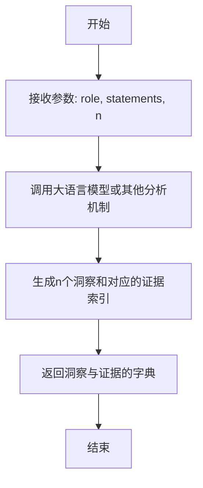

#### 带注释源码

```python
async def run(self, role: "STRole", statements: str, n: int = 5) -> dict:
    """
    生成角色的洞察和指导。

    该方法通过分析提供的陈述语句，生成指定数量的洞察，并为每个洞察提供证据索引。

    Args:
        role (STRole): 当前角色对象，包含角色的记忆和状态信息。
        statements (str): 包含一系列陈述语句的字符串，通常是从记忆节点中提取的关键信息。
        n (int, optional): 需要生成的洞察数量，默认为5。

    Returns:
        dict: 一个字典，键为生成的洞察（字符串），值为对应的证据节点索引列表。
    """
    # 这里通常包含调用大语言模型或其他分析逻辑的代码
    # 例如：response = await llm_call(statements, n)
    # 然后解析response，构建返回的字典
    # 由于具体实现未提供，这里用注释表示核心逻辑
    pass
```

### `AgentEventTriple.run`

该方法用于根据给定的动作描述和角色信息，生成一个事件三元组（主语、谓语、宾语），以结构化的方式表示动作或事件。

参数：

- `act_desp`：`str`，动作的描述，例如 "sleeping"。
- `role`：`STRole`，当前的角色实例，包含角色的状态和记忆信息。

返回值：`tuple`，返回一个包含三个字符串的元组 `(s, p, o)`，分别表示事件三元组中的主语、谓语和宾语。

#### 流程图

```mermaid
graph TD
    A[开始] --> B[接收参数 act_desp 和 role]
    B --> C[调用 AgentEventTriple 实例的 run 方法]
    C --> D[生成事件三元组 s, p, o]
    D --> E[返回三元组 (s, p, o)]
    E --> F[结束]
```

#### 带注释源码

```python
async def generate_action_event_triple(act_desp: str, role: "STRole"):
    """TODO

    INPUT:
        act_desp: the description of the action (e.g., "sleeping")
        role: The Persona class instance
    OUTPUT:
        a string of emoji that translates action description.
    EXAMPLE OUTPUT:
        "🧈🍞"
    """
    run_event_triple = AgentEventTriple()  # 创建 AgentEventTriple 实例
    result = await run_event_triple.run(act_desp, role)  # 调用 run 方法生成事件三元组
    return result  # 返回生成的三元组
```


### `AgentEventPoignancy.run`

该方法用于计算事件或想法的“重要性/显著性”（poignancy）分数。它接收一个角色对象和事件描述，通过调用大语言模型（LLM）来评估该描述对角色而言的情感或记忆重要性，并返回一个1到10之间的整数分数。

参数：

-  `role`：`STRole`，表示当前的角色对象，包含角色的记忆、性格等上下文信息。
-  `description`：`str`，需要评估重要性的事件或想法的文本描述。

返回值：`int`，表示计算出的重要性分数，范围在1到10之间。

#### 流程图

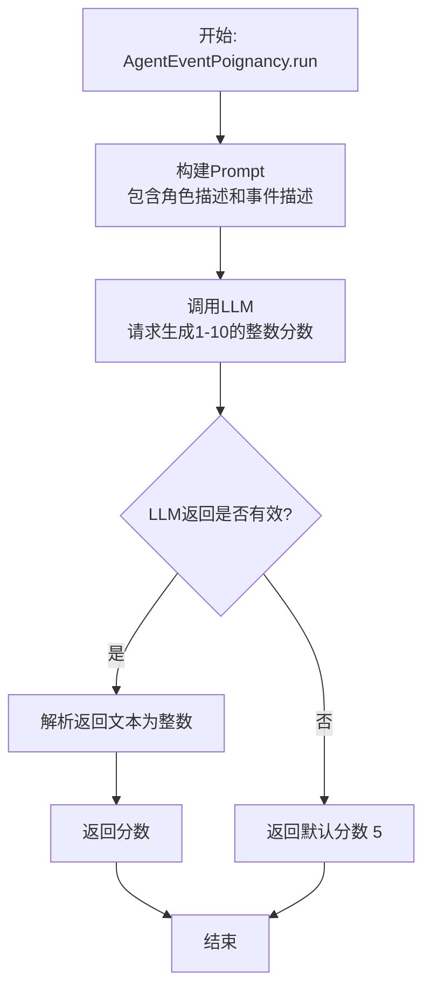

#### 带注释源码

```
# 注意：以下源码是基于代码库上下文推断的 AgentEventPoignancy.run 方法的典型实现。
# 实际代码可能位于 `metagpt/ext/stanford_town/actions/run_reflect_action.py` 中。

async def run(self, role: "STRole", description: str) -> int:
    """
    计算给定事件描述对特定角色的重要性分数。

    该方法通过构造一个提示词（prompt）给大语言模型（LLM），
    要求模型基于角色的背景和当前描述，评估事件的重要性，并返回1-10的整数。

    Args:
        role (STRole): 当前的角色实例，用于提供上下文（如姓名、性格）。
        description (str): 需要评估的事件或想法的描述。

    Returns:
        int: 重要性分数，范围1-10。如果解析失败，默认返回5。
    """
    # 1. 构建Prompt：结合角色信息和事件描述，指导LLM进行评分。
    prompt = f"""
    {role.scratch.name}的背景信息:
    {role.scratch.get_background()}

    请评估以下事件或想法对{role.scratch.name}的重要性（情感冲击、记忆深刻程度等）。
    请只返回一个1到10之间的整数，1表示非常普通/不重要，10表示极其重要/难忘。

    事件/想法描述: {description}
    重要性分数（1-10）:
    """
    # 2. 调用LLM接口获取响应
    # 假设 `self.llm` 是配置好的大语言模型客户端
    response = await self.llm.aask(prompt)

    # 3. 解析响应，提取数字
    try:
        # 尝试从响应文本中提取第一个出现的整数
        import re
        match = re.search(r'\b([1-9]|10)\b', response.strip())
        if match:
            score = int(match.group(1))
            # 确保分数在有效范围内
            score = max(1, min(10, score))
            return score
        else:
            # 如果未找到有效数字，记录警告并返回默认值
            logger.warning(f"无法从LLM响应中解析出有效分数，响应内容: '{response}'，使用默认值5。")
            return 5
    except Exception as e:
        # 处理任何解析过程中的异常
        logger.error(f"解析重要性分数时发生错误: {e}，使用默认值5。")
        return 5
```


### `AgentChatPoignancy.run`

该方法用于计算聊天事件的"重要性"或"显著性"分数。它接收一个角色对象和聊天描述作为输入，通过调用外部模型（如OpenAI的GPT模型）来评估该聊天对角色而言的情感或认知重要性，并返回一个数值分数。

参数：

-  `role`：`STRole`，表示当前的角色对象，包含角色的记忆、状态等信息。
-  `description`：`str`，表示聊天事件的描述文本。

返回值：`int`，表示计算出的聊天事件重要性分数。

#### 流程图

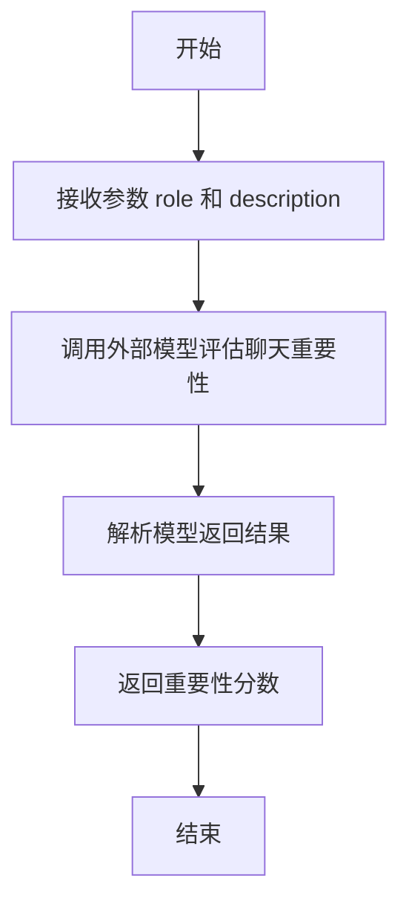

#### 带注释源码

```python
async def run(self, role: "STRole", description: str) -> int:
    """
    计算聊天事件的重要性分数。

    参数:
        role (STRole): 当前角色对象。
        description (str): 聊天事件的描述。

    返回:
        int: 聊天事件的重要性分数。
    """
    # 调用外部模型（如OpenAI GPT）来评估聊天的重要性
    prompt = f"Evaluate the poignancy of the following chat for {role.scratch.name}: {description}"
    response = await self.llm.aask(prompt)
    
    # 解析模型返回的文本，提取重要性分数
    # 假设模型返回的文本中包含一个整数分数
    try:
        score = int(response.strip())
    except ValueError:
        # 如果解析失败，返回默认值（例如1）
        score = 1
    
    return score
```

### `AgentPlanThoughtOnConvo.run`

该方法用于生成角色在对话后的规划性思考。它接收一个角色对象和完整的对话文本，通过调用底层模型或逻辑，生成一个关于角色未来行动或意图的规划性思考描述。

参数：

- `role`：`STRole`，表示当前的角色对象，包含角色的记忆、状态、属性等信息。
- `all_utt`：`str`，表示完整的对话文本，通常包含对话双方的所有发言内容。

返回值：`str`，返回一个字符串，描述角色基于对话内容生成的规划性思考。

#### 流程图

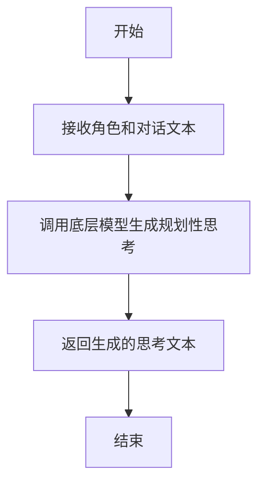

#### 带注释源码

```python
async def generate_planning_thought_on_convo(role: "STRole", all_utt: str):
    # 创建AgentPlanThoughtOnConvo实例
    run_planning_on_convo = AgentPlanThoughtOnConvo()
    # 调用run方法，传入角色和对话文本，生成规划性思考
    return await run_planning_on_convo.run(role, all_utt)
```

### `AgentMemoryOnConvo.run`

该方法用于生成角色在对话后的记忆总结。它接收一个角色对象和完整的对话文本，通过调用底层模型生成一个关于对话内容的记忆性总结，并将其返回。

参数：

- `role`：`STRole`，当前的角色对象，包含角色的记忆、状态等信息。
- `all_utt`：`str`，完整的对话文本，包含所有参与者的发言。

返回值：`str`，返回一个字符串，表示生成的关于对话的记忆总结。

#### 流程图

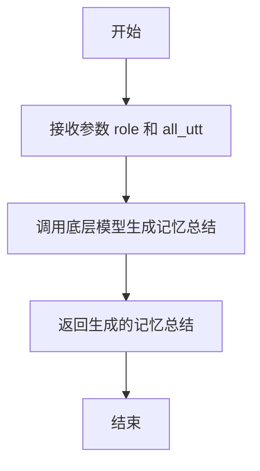

#### 带注释源码

```python
async def generate_memo_on_convo(role: "STRole", all_utt: str):
    # 实例化 AgentMemoryOnConvo 类
    run_memo_on_convo = AgentMemoryOnConvo()
    # 调用 run 方法，传入角色和对话文本，生成记忆总结
    return await run_memo_on_convo.run(role, all_utt)
```

## 关键组件


### 反思触发机制

通过检查角色记忆中新事件/想法的重要性总和是否达到预设阈值，来决定是否触发反思过程。

### 焦点生成

基于角色记忆（事件和想法）的最近访问记录和重要性，生成用于引导反思过程的若干核心焦点。

### 记忆检索

根据生成的焦点，从角色的长期记忆中检索出相关的记忆节点，作为反思的素材。

### 洞察与证据生成

基于检索到的记忆节点，生成新的、具有概括性的“洞察”想法，并关联其来源证据（记忆节点ID）。

### 事件三元组生成

将自然语言描述的动作或想法，转换为结构化的（主语，谓语，宾语）三元组形式，用于记忆存储。

### 显著性评分

为不同类型的内容（事件、想法、对话）计算一个“显著性”分数，用于衡量该内容对角色记忆的重要性。

### 对话后处理

在角色结束一段对话后，自动生成关于对话的“规划性思考”和“记忆性总结”两种想法，并将其存入角色记忆。


## 问题及建议


### 已知问题

-   **硬编码的休眠时间**：在 `run_reflect` 函数中，每次添加一个思考记忆后，会调用 `time.sleep(2)` 以避免速率限制。这种硬编码的休眠时间缺乏灵活性，且可能在不同环境或API限制下不适用。
-   **异常处理不充分**：在 `generate_insights_and_evidence` 函数中，虽然捕获了异常并记录了错误，但返回了一个默认的字典 `{"this is blank": "node_1"}`。这种处理方式可能掩盖了真实的错误原因，并且返回的默认值可能不符合调用方的预期，导致后续逻辑出错。
-   **魔法数字**：代码中存在多处硬编码的数字，例如 `generate_focal_points` 和 `generate_insights_and_evidence` 中的默认参数 `n` 值（3和5），以及 `run_reflect` 中记忆的过期时间（`datetime.timedelta(days=30)`）。这些魔法数字降低了代码的可读性和可维护性。
-   **潜在的循环依赖**：代码中大量使用了 `"STRole"` 类型注解，这表明它严重依赖于外部定义的 `STRole` 类。这种紧耦合使得模块难以独立测试和理解，也增加了重构的难度。
-   **日志级别不一致**：在 `generate_insights_and_evidence` 函数中，使用 `logger.info` 记录 `ret` 字典的内容，这可能包含敏感或冗长的信息。而在其他地方（如 `run_reflect`）则用于记录更一般的操作信息。日志级别的使用缺乏统一标准。
-   **条件判断逻辑可能不严谨**：在 `reflection_trigger` 函数中，判断条件为 `role.scratch.importance_trigger_curr <= 0 and [] != role.memory.event_list + role.memory.thought_list`。`importance_trigger_curr` 小于等于0即触发，这个阈值的设定逻辑和业务含义不够清晰。同时，第二个条件检查列表是否非空，但直接使用 `+` 运算符合并列表可能效率不高，且意图不如 `if role.memory.event_list or role.memory.thought_list` 明确。
-   **`role_reflect` 函数职责混杂**：该函数不仅处理常规的反思触发，还在聊天结束时处理特定的对话后反思（生成计划思考和记忆）。这违反了单一职责原则，使得函数逻辑复杂，难以理解和维护。

### 优化建议

-   **将休眠时间配置化**：将 `time.sleep(2)` 中的等待时间提取为配置参数或常量，例如 `REFLECTION_RATE_LIMIT_DELAY`，以便根据不同的运行环境或API限制进行调整。
-   **改进异常处理**：在 `generate_insights_and_evidence` 函数中，应考虑更精细的异常处理。至少应该区分不同类型的异常（如网络错误、数据处理错误），并向上抛出更具信息量的异常或返回一个明确的错误标识，而不是一个可能误导后续流程的默认字典。同时，确保所有异步操作都有适当的异常捕获和处理。
-   **消除魔法数字**：将硬编码的数字定义为模块级常量或配置文件中的配置项。例如，可以定义 `DEFAULT_FOCAL_POINTS_NUM = 3`、`DEFAULT_INSIGHTS_NUM = 5`、`MEMORY_EXPIRATION_DAYS = 30` 等，提高代码的可读性和可配置性。
-   **降低耦合度**：考虑通过接口或抽象基类来定义 `STRole` 所需的最小功能契约，而不是直接依赖具体的类。这可以提高模块的独立性和可测试性。如果无法改变依赖，至少应确保导入语句清晰，并考虑在函数签名中使用更通用的类型提示（如`Any`并辅以详细文档），但这不是最佳实践。
-   **规范日志记录**：制定统一的日志记录规范。对于调试信息使用 `logger.debug`，对于正常的流程信息使用 `logger.info`，并避免在 `info` 级别记录可能过大的数据结构（如整个 `ret` 字典）。可以考虑只记录摘要或关键标识。
-   **重构触发条件逻辑**：重新审视 `reflection_trigger` 的逻辑。明确 `importance_trigger_curr` 的含义和触发阈值（例如，是否应为 `<=0`）。优化列表非空检查，使用更高效、意图更明确的方式，如 `if role.memory.event_list or role.memory.thought_list`。考虑将触发阈值也配置化。
-   **拆分函数职责**：将 `role_reflect` 函数拆分为两个独立的函数：一个处理基于重要性触发的常规反思 (`triggered_reflect`)，另一个处理聊天结束后的特定反思 (`post_chat_reflect`)。这可以使每个函数的意图更清晰，逻辑更简单，也便于单独测试和维护。
-   **添加代码注释和文档**：为复杂的逻辑块（如 `generate_action_event_triple` 函数中的 `TODO` 部分）和关键算法步骤添加更详细的注释。特别是 `generate_action_event_triple` 函数，其文档字符串描述的是生成表情符号，但函数名和实际使用的 `AgentEventTriple` 暗示它生成的是事件三元组 (S, P, O)，这里存在不一致，需要修正文档或函数实现。
-   **性能考虑**：在 `generate_focal_points` 函数中，对 `event_list` 和 `thought_list` 进行合并、排序和切片操作。如果这些列表非常大，频繁操作可能影响性能。可以考虑优化数据结构的访问方式或引入缓存机制。


## 其它


### 设计目标与约束

本模块是斯坦福小镇（Stanford Town）智能体（Agent）反思系统的核心实现。其主要设计目标是：在模拟环境中，为智能体提供一种机制，使其能够周期性地或基于特定事件（如对话结束）对其记忆（事件和想法）进行回顾、分析和总结，从而生成更高层次的“见解”（insights）和“规划”（planning），以模拟人类的反思和内省能力，并更新其长期记忆。核心约束包括：1) 性能约束：反思过程涉及大量记忆检索和LLM调用，需通过触发条件（如重要性累加阈值）控制频率，避免过度计算。2) 资源约束：依赖外部嵌入模型和LLM服务，代码中通过`time.sleep(2)`规避速率限制，体现了对第三方API调用成本的考量。3) 一致性约束：生成的反思内容（如事件三元组、重要性评分）需与智能体的现有记忆模式和世界观保持一致。

### 错误处理与异常设计

模块采用了基础的防御性编程和日志记录进行错误处理。在`generate_insights_and_evidence`函数中，使用`try-except`块捕获处理LLM返回结果时的潜在异常，记录错误日志并返回一个默认的字典，防止因单点失败导致整个反思流程中断。在其他异步函数（如`generate_action_event_triple`, `generate_poig_score`）中，异常被传递到调用方`run_reflect`或`role_reflect`。整体上，错误处理策略偏向于“记录并降级”（log and degrade），确保主流程的继续执行，但可能掩盖深层问题。缺乏对网络超时、API配额耗尽等特定异常的重试或回退机制。

### 数据流与状态机

反思模块的数据流始于智能体的记忆池（`role.memory.event_list` 和 `role.memory.thought_list`）。主要流程分为两条路径：
1.  **周期性反思路径**：由`reflection_trigger`函数监控`role.scratch.importance_trigger_curr`（当前重要性累加值）。当该值降至0或以下时触发。随后`run_reflect`执行：a) 生成焦点（`generate_focal_points`）；b) 基于焦点检索相关记忆节点（`new_agent_retrieve`）；c) 为每个焦点生成见解及证据（`generate_insights_and_evidence`）；d) 将每个见解封装为新的“想法”节点，并附上证据链、三元组、重要性评分等元数据，通过`role.memory.add_thought`存入长期记忆。
2.  **对话后反思路径**：在`role_reflect`中，当检测到聊天结束时（通过`chatting_end_time`），触发对话总结。该路径生成两种新的想法节点：一是关于后续行动的“规划思考”（`generate_planning_thought_on_convo`），二是对对话内容的“记忆总结”（`generate_memo_on_convo`）。这两种想法均以最后一次聊天记录作为证据。

状态机体现在`role.scratch`中的计数器：`importance_trigger_curr`（当前触发值）在每次反思后通过`reset_reflection_counter`重置为`importance_trigger_max`（最大阈值），并在智能体日常活动中递减，形成一个“累积-触发-重置”的循环。

### 外部依赖与接口契约

1.  **LLM服务**：通过`AgentFocusPt`, `AgentInsightAndGuidance`, `AgentEventTriple`, `AgentEventPoignancy`, `AgentChatPoignancy`, `AgentPlanThoughtOnConvo`, `AgentMemoryOnConvo` 等一系列动作类隐式依赖。这些类的`run`方法预期接收特定参数并返回结构化文本或数据。这是模块最核心的外部依赖，其稳定性和输出格式直接影响功能。
2.  **嵌入模型**：通过`get_embedding`函数依赖外部文本嵌入服务（如OpenAI API），用于为生成的思考文本创建向量表示，以便后续检索。
3.  **记忆检索系统**：依赖`new_agent_retrieve`函数，该函数内部可能依赖向量数据库或相似度计算，其契约是接收一个智能体对象和焦点列表，返回一个字典（焦点->相关记忆节点列表）。
4.  **智能体对象模型**：强依赖`STRole`类（在代码中用字符串标注）的特定接口，包括：
    *   `memory`属性（需有`event_list`, `thought_list`, `add_thought`, `get_last_chat`方法）。
    *   `scratch`属性（需有`importance_ele_n`, `importance_trigger_curr`, `importance_trigger_max`, `curr_time`, `name`, `act_description`, `chatting_end_time`, `chatting_with`, `chat`等字段）。
    *   `sec_per_step`属性。
    模块的行为严重依赖于这些接口的稳定性和数据语义。

### 安全与合规考量

1.  **数据隐私**：反思内容可能处理智能体记忆中的敏感模拟对话或事件。虽然当前为模拟环境，但若应用于处理真实用户数据，需确保LLM调用和嵌入过程符合数据隐私法规（如GDPR），考虑数据匿名化或本地化处理。
2.  **内容安全**：依赖的LLM可能生成不当或有偏见的“见解”或“规划”。模块本身没有内置的内容过滤或审核机制，需要上游LLM服务或额外层来保障输出内容的安全性。
3.  **资源滥用防护**：当前的`time.sleep(2)`是一种简单的速率限制规避。在并发或大规模模拟场景下，需要更系统的配额管理和队列机制，防止对LLM和嵌入服务的意外过量请求，导致成本激增或服务被封禁。

    