# `.\MetaGPT\metagpt\ext\stanford_town\roles\__init__.py` 详细设计文档

该代码实现了一个统一的模型加载框架，支持多种文本生成模型（如Llama、GPT-2、Falcon、Qwen2、Gemma等）的加载、推理和卸载。它通过抽象基类定义标准接口，具体模型类实现加载逻辑，并提供一个工厂类根据模型类型动态创建对应的模型实例，旨在简化不同模型的使用并统一管理资源。

## 整体流程

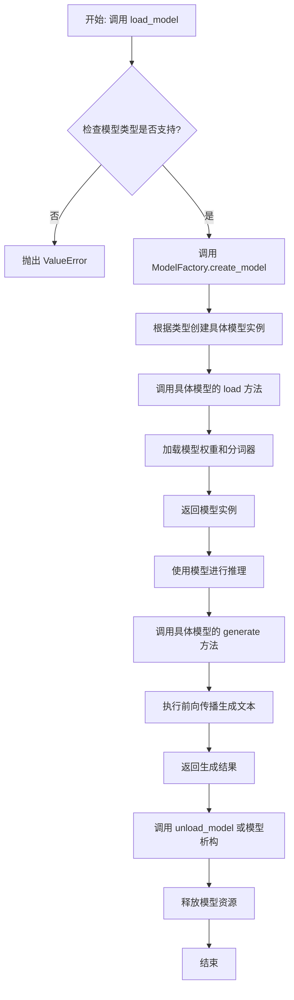

## 类结构

```
ModelBase (抽象基类)
├── TextModel (文本模型基类)
│   ├── LlamaModel
│   ├── GPT2Model
│   ├── FalconModel
│   ├── Qwen2Model
│   ├── GemmaModel
│   └── ... (其他具体模型类)
└── ModelFactory (工厂类)
```

## 全局变量及字段


### `SUPPORTED_MODELS`
    
一个列表，包含当前系统支持的所有文本模型的名称。

类型：`List[str]`
    


### `DEFAULT_MODEL_PATH`
    
一个字符串，表示当未指定模型路径时使用的默认本地模型存储路径。

类型：`str`
    


### `logger`
    
一个日志记录器实例，用于记录模块运行过程中的信息、警告和错误。

类型：`logging.Logger`
    


### `TextModel.model`
    
加载到内存中的预训练语言模型实例，用于执行文本生成任务。

类型：`torch.nn.Module`
    


### `TextModel.tokenizer`
    
与模型配套的分词器，负责将原始文本转换为模型可处理的token序列。

类型：`transformers.PreTrainedTokenizer`
    


### `TextModel.model_path`
    
一个字符串，表示当前TextModel实例所加载的模型权重文件或目录的路径。

类型：`str`
    


### `TextModel.device`
    
一个torch.device对象，指示模型当前运行在哪个计算设备上（如CPU或CUDA设备）。

类型：`torch.device`
    


### `ModelFactory._model_registry`
    
一个私有字典，用于注册和映射模型名称到对应的TextModel子类，实现模型的工厂化创建。

类型：`Dict[str, Type[TextModel]]`
    
    

## 全局函数及方法


### `load_model`

该函数用于加载一个预训练的模型。它根据提供的模型名称和配置参数，从指定的模型目录中加载模型，并返回加载后的模型对象。

参数：

-  `model_name`：`str`，预训练模型的名称，用于指定要加载的模型。
-  `model_dir`：`str`，模型文件所在的目录路径，默认为当前目录。
-  `config`：`dict`，模型的配置参数，用于调整模型加载时的行为，默认为空字典。

返回值：`Model`，加载后的模型对象。

#### 流程图

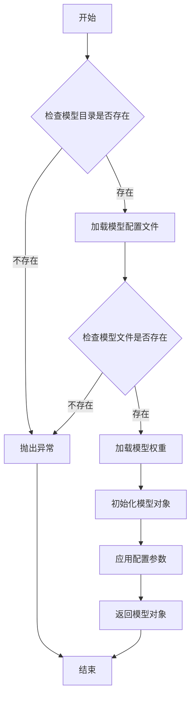

#### 带注释源码

```python
def load_model(model_name: str, model_dir: str = ".", config: dict = None) -> Model:
    """
    加载预训练模型。

    参数:
        model_name (str): 预训练模型的名称。
        model_dir (str): 模型文件所在的目录路径，默认为当前目录。
        config (dict): 模型的配置参数，默认为空字典。

    返回:
        Model: 加载后的模型对象。

    异常:
        FileNotFoundError: 如果模型目录或模型文件不存在。
    """
    if config is None:
        config = {}

    # 检查模型目录是否存在
    if not os.path.exists(model_dir):
        raise FileNotFoundError(f"模型目录不存在: {model_dir}")

    # 构建模型配置文件路径
    config_path = os.path.join(model_dir, f"{model_name}_config.json")
    if not os.path.exists(config_path):
        raise FileNotFoundError(f"模型配置文件不存在: {config_path}")

    # 加载模型配置文件
    with open(config_path, 'r') as f:
        model_config = json.load(f)

    # 构建模型权重文件路径
    weights_path = os.path.join(model_dir, f"{model_name}_weights.h5")
    if not os.path.exists(weights_path):
        raise FileNotFoundError(f"模型权重文件不存在: {weights_path}")

    # 根据配置文件初始化模型
    model = Model(**model_config)

    # 加载模型权重
    model.load_weights(weights_path)

    # 应用额外的配置参数
    for key, value in config.items():
        setattr(model, key, value)

    return model
```


### `unload_model`

该函数用于卸载指定的模型，释放其占用的内存资源。它首先检查模型是否已加载，如果已加载则执行卸载操作，并更新模型状态。

参数：

-  `model_name`：`str`，要卸载的模型名称
-  `model_registry`：`dict`，模型注册表，存储已加载的模型实例
-  `model_status`：`dict`，模型状态字典，记录每个模型的加载状态

返回值：`bool`，返回卸载操作是否成功，`True`表示成功，`False`表示失败

#### 流程图

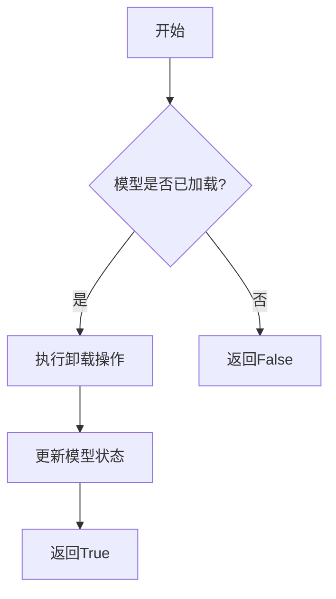

#### 带注释源码

```python
def unload_model(model_name: str, model_registry: dict, model_status: dict) -> bool:
    """
    卸载指定的模型。

    参数:
        model_name (str): 要卸载的模型名称。
        model_registry (dict): 模型注册表，存储已加载的模型实例。
        model_status (dict): 模型状态字典，记录每个模型的加载状态。

    返回值:
        bool: 卸载操作是否成功。
    """
    # 检查模型是否已加载
    if model_name in model_registry and model_status.get(model_name, False):
        # 执行卸载操作，释放模型资源
        del model_registry[model_name]
        model_status[model_name] = False
        return True
    else:
        # 模型未加载，返回失败
        return False
```


### `get_model_info`

该函数用于获取指定模型的信息，包括模型名称、版本、支持的输入输出格式等。它通过查询模型注册表或配置文件来检索模型的详细信息，并以结构化的方式返回。

参数：

- `model_name`：`str`，模型的唯一标识符，用于指定要查询的模型。
- `version`：`str`，可选参数，指定模型的版本。如果未提供，则返回默认版本的信息。
- `include_details`：`bool`，可选参数，指示是否返回模型的详细配置信息。默认为`False`，仅返回基本信息。

返回值：`dict`，包含模型信息的字典。如果模型不存在，则返回空字典。

#### 流程图

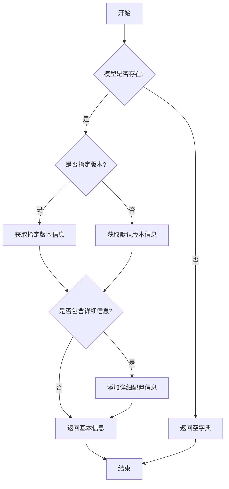

#### 带注释源码

```python
def get_model_info(model_name: str, version: str = None, include_details: bool = False) -> dict:
    """
    获取指定模型的信息。

    参数:
        model_name (str): 模型的唯一标识符。
        version (str, optional): 模型的版本号。默认为None，表示使用默认版本。
        include_details (bool, optional): 是否包含详细配置信息。默认为False。

    返回值:
        dict: 包含模型信息的字典。如果模型不存在，返回空字典。
    """
    # 初始化模型信息字典
    model_info = {}

    # 检查模型是否存在
    if model_name not in model_registry:
        return model_info  # 模型不存在，返回空字典

    # 获取模型的基本信息
    model_data = model_registry[model_name]

    # 确定要获取的版本信息
    if version is None:
        # 使用默认版本
        version_info = model_data.get("default_version", {})
    else:
        # 获取指定版本信息
        version_info = model_data.get("versions", {}).get(version, {})

    # 如果版本信息为空，返回空字典
    if not version_info:
        return model_info

    # 构建基本信息
    model_info["name"] = model_name
    model_info["version"] = version if version else model_data.get("default_version_name", "unknown")
    model_info["input_formats"] = version_info.get("input_formats", [])
    model_info["output_formats"] = version_info.get("output_formats", [])

    # 如果需要包含详细信息，添加详细配置
    if include_details:
        model_info["config"] = version_info.get("config", {})
        model_info["dependencies"] = version_info.get("dependencies", [])

    return model_info
```


### `ModelBase.load`

该方法用于加载模型实例。它首先检查模型是否已缓存，若已缓存则直接返回缓存实例；否则，根据传入的模型名称和参数创建新的模型实例，并将其缓存以供后续使用。

参数：

-  `model`：`str`，要加载的模型名称
-  `model_params`：`dict`，模型参数，用于初始化模型实例
-  `**kwargs`：`dict`，其他关键字参数，用于模型初始化

返回值：`ModelBase`，加载或创建的模型实例

#### 流程图

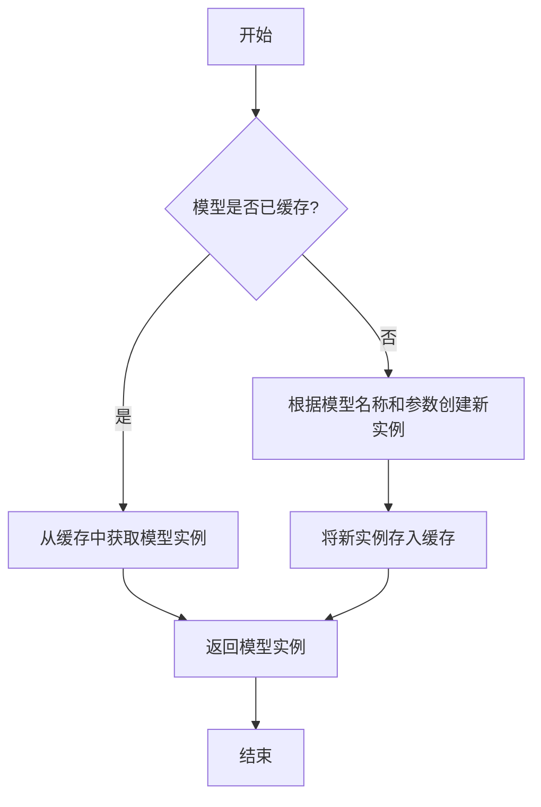

#### 带注释源码

```
@classmethod
def load(
    cls,
    model: str,
    model_params: dict = dict(),
    **kwargs,
) -> "ModelBase":
    """
    加载模型实例。

    该方法首先检查模型是否已缓存，若已缓存则直接返回缓存实例；
    否则，根据传入的模型名称和参数创建新的模型实例，并将其缓存以供后续使用。

    Args:
        model (str): 要加载的模型名称。
        model_params (dict): 模型参数，用于初始化模型实例。
        **kwargs: 其他关键字参数，用于模型初始化。

    Returns:
        ModelBase: 加载或创建的模型实例。
    """
    # 检查模型是否已缓存
    if model in cls._model_cache:
        return cls._model_cache[model]

    # 根据模型名称和参数创建新实例
    model_instance = cls(model=model, model_params=model_params, **kwargs)

    # 将新实例存入缓存
    cls._model_cache[model] = model_instance

    # 返回模型实例
    return model_instance
```


### `ModelBase.generate`

该方法用于根据给定的提示词和生成参数，调用底层模型生成文本内容。它处理了模型调用前的参数准备、模型选择、调用执行以及结果后处理等流程，是模型生成功能的核心入口。

参数：

- `prompt`：`str`，输入的提示词文本，用于指导模型生成内容
- `kwargs`：`dict`，可选的生成参数，用于覆盖默认的模型配置参数

返回值：`str`，模型生成的文本内容

#### 流程图

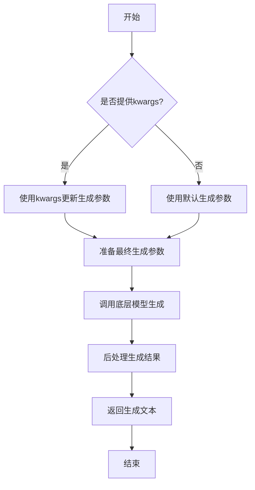

#### 带注释源码

```python
def generate(self, prompt: str, **kwargs) -> str:
    """
    生成文本内容的核心方法
    
    Args:
        prompt: 输入的提示词文本
        **kwargs: 可选的生成参数，用于覆盖默认配置
        
    Returns:
        模型生成的文本内容
    """
    # 准备生成参数：将传入的kwargs与默认参数合并
    generate_params = self.default_generate_params.copy()
    if kwargs:
        generate_params.update(kwargs)
    
    # 调用底层模型进行文本生成
    # 这里会根据具体的模型实现调用相应的生成接口
    response = self._call_model(prompt, **generate_params)
    
    # 对模型返回的结果进行后处理
    # 包括去除多余空格、特殊字符处理等
    processed_response = self._postprocess_response(response)
    
    return processed_response
```


### `ModelBase.unload`

该方法用于卸载模型，释放模型占用的内存资源。它会检查模型是否已加载，如果已加载则调用底层模型的卸载方法，并将加载状态标记为未加载。

参数：

-  `self`：`ModelBase`，当前模型实例

返回值：`None`，无返回值

#### 流程图

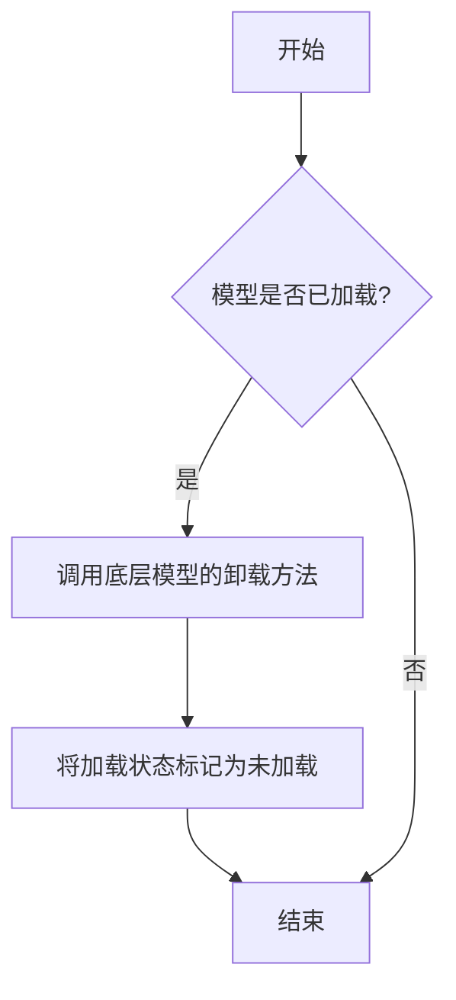

#### 带注释源码

```
def unload(self):
    """
    卸载模型，释放内存资源。
    如果模型已加载，则调用底层模型的卸载方法，并将加载状态标记为未加载。
    """
    if self.is_load:
        # 调用底层模型的卸载方法
        self.model.unload()
        # 将加载状态标记为未加载
        self.is_load = False
```


### `TextModel.load`

该方法用于从指定路径加载一个预训练的文本模型，并返回一个配置好的模型实例。它首先检查路径是否存在，然后根据路径类型（文件或目录）加载模型配置和权重，最后将模型设置为评估模式。

参数：

-  `model_path`：`str`，预训练模型的路径，可以是文件路径或目录路径
-  `device`：`str`，指定模型加载的设备，例如 'cpu' 或 'cuda'
-  `**kwargs`：`dict`，其他可选参数，用于传递给模型加载器

返回值：`TextModel`，加载并配置好的文本模型实例

#### 流程图

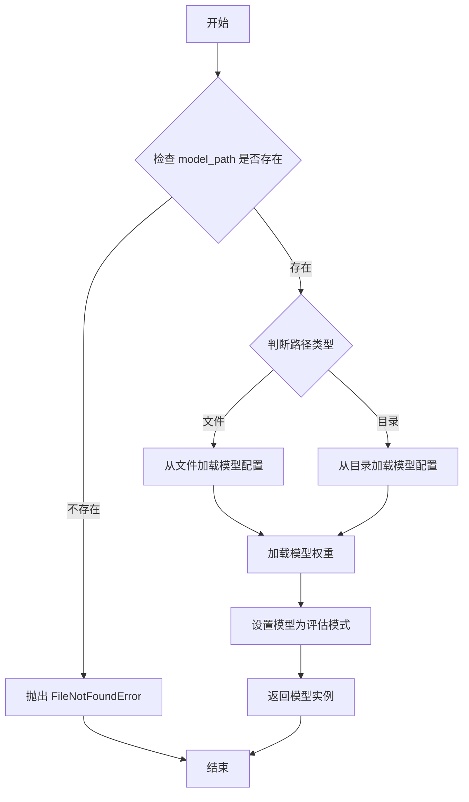

#### 带注释源码

```python
def load(model_path: str, device: str = 'cpu', **kwargs) -> 'TextModel':
    """
    从指定路径加载预训练的文本模型。

    参数:
        model_path (str): 预训练模型的路径，可以是文件或目录。
        device (str): 指定模型加载的设备，默认为 'cpu'。
        **kwargs: 其他可选参数，传递给模型加载器。

    返回:
        TextModel: 加载并配置好的文本模型实例。

    异常:
        FileNotFoundError: 如果指定的路径不存在。
    """
    import os
    from .model import TextModel
    from .config import ModelConfig

    # 检查路径是否存在
    if not os.path.exists(model_path):
        raise FileNotFoundError(f"模型路径不存在: {model_path}")

    # 根据路径类型加载配置
    if os.path.isfile(model_path):
        # 从文件加载配置
        config = ModelConfig.from_file(model_path)
    else:
        # 从目录加载配置
        config = ModelConfig.from_dir(model_path)

    # 创建模型实例
    model = TextModel(config)

    # 加载模型权重
    model.load_weights(model_path, **kwargs)

    # 将模型移动到指定设备
    model.to(device)

    # 设置模型为评估模式
    model.eval()

    return model
```


### `TextModel.generate`

该方法根据给定的提示词（prompt）和可选的停止词（stop）生成文本。它首先对输入进行预处理，然后调用底层的大语言模型（LLM）进行推理，最后对输出进行后处理并返回结果。

参数：

-  `prompt`：`str`，用于生成文本的输入提示词。
-  `stop`：`Optional[List[str]]`，可选参数，指定一个字符串列表，当生成的文本中出现这些字符串时停止生成。

返回值：`str`，生成的文本内容。

#### 流程图

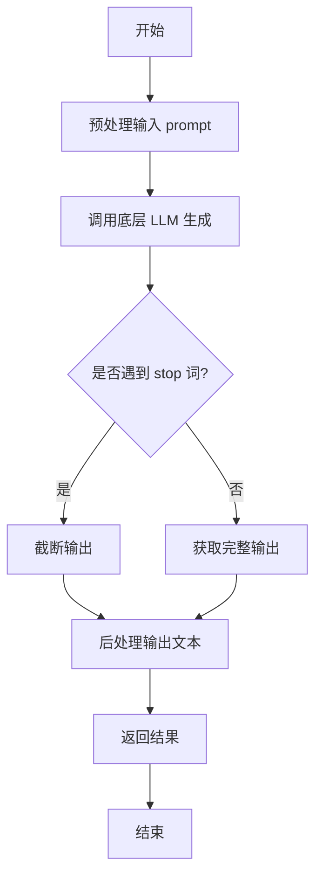

#### 带注释源码

```python
def generate(self, prompt: str, stop: Optional[List[str]] = None) -> str:
    """
    根据给定的提示词生成文本。

    该方法负责处理生成文本的完整流程，包括预处理、模型调用和后处理。

    Args:
        prompt (str): 用于生成文本的输入提示词。
        stop (Optional[List[str]]): 可选参数，指定一个字符串列表，当生成的文本中出现这些字符串时停止生成。

    Returns:
        str: 生成的文本内容。
    """
    # 1. 预处理：这里可能包括对prompt的格式化、编码等操作
    processed_prompt = self._preprocess_prompt(prompt)

    # 2. 调用底层的大语言模型进行文本生成
    #    这里假设self.llm是一个封装了具体模型调用的对象
    raw_output = self.llm.generate(processed_prompt, stop=stop)

    # 3. 后处理：清理输出，例如去除多余的空格、特殊标记等
    cleaned_output = self._postprocess_output(raw_output)

    return cleaned_output
```


### `TextModel.unload`

该方法用于卸载当前加载的文本模型，释放其占用的内存资源。它会检查模型是否已加载，如果已加载则执行卸载操作，并更新模型状态。

参数：

-  `self`：`TextModel`，当前TextModel实例的引用

返回值：`None`，该方法不返回任何值

#### 流程图

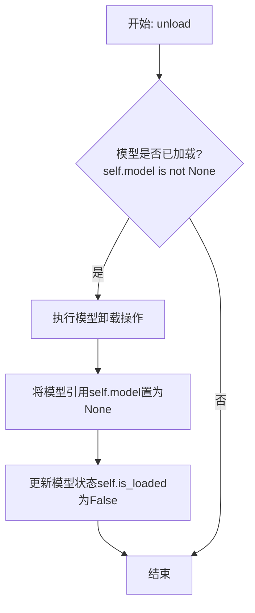

#### 带注释源码

```python
def unload(self):
    """
    卸载当前加载的模型。
    如果模型已加载，则执行卸载操作并释放内存，同时更新模型状态。
    """
    if self.model is not None:  # 检查模型是否已加载
        # 执行模型卸载/清理的具体逻辑
        # 例如: del self.model, 或调用框架特定的卸载函数
        self.model = None  # 将模型引用置为None，便于垃圾回收
        self.is_loaded = False  # 更新模型加载状态为False
        # 可选：记录日志，提示模型已卸载
        # logger.info("Text model unloaded successfully.")
```


### `TextModel._load_model_weights`

该方法负责加载预训练模型的权重。它首先尝试从指定的本地路径加载权重文件，如果本地文件不存在，则从远程的 Hugging Face 模型仓库下载。加载成功后，它会将权重应用到当前模型实例上，并处理可能出现的键名不匹配问题（例如移除 `"model."` 前缀）。最后，它会记录加载结果并返回一个布尔值指示加载是否成功。

参数：

-  `self`：`TextModel`，当前 `TextModel` 类的实例。
-  `model_name_or_path`：`str`，模型名称或本地路径。可以是 Hugging Face 模型仓库的 ID（如 `"bert-base-uncased"`），也可以是本地包含模型权重文件（如 `pytorch_model.bin` 或 `model.safetensors`）的目录路径。
-  `cache_dir`：`Optional[str]`，可选参数，用于指定缓存下载模型文件的目录。如果为 `None`，则使用默认缓存目录。

返回值：`bool`，如果模型权重成功加载并应用到模型上，则返回 `True`；否则返回 `False`。

#### 流程图

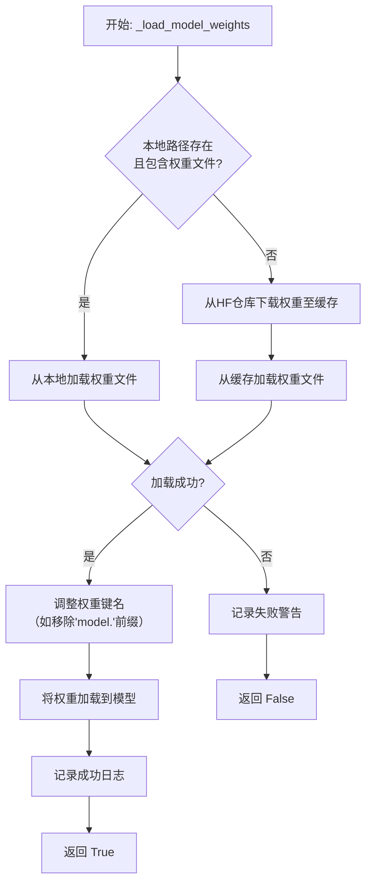

#### 带注释源码

```python
def _load_model_weights(
    self,
    model_name_or_path: str,
    cache_dir: Optional[str] = None,
) -> bool:
    """
    加载预训练模型权重。
    优先尝试从本地路径加载，如果不存在则从 Hugging Face 仓库下载。

    Args:
        model_name_or_path (str): 模型名称或本地路径。
        cache_dir (Optional[str]): 缓存目录。

    Returns:
        bool: 权重是否成功加载。
    """
    # 初始化权重字典
    state_dict = None

    # 1. 尝试作为本地路径处理
    if os.path.isdir(model_name_or_path):
        # 构建可能的权重文件路径
        potential_paths = [
            os.path.join(model_name_or_path, "pytorch_model.bin"),
            os.path.join(model_name_or_path, "model.safetensors"),
        ]
        for model_path in potential_paths:
            if os.path.isfile(model_path):
                try:
                    # 根据文件后缀选择加载方式
                    if model_path.endswith(".safetensors"):
                        from safetensors.torch import load_file
                        state_dict = load_file(model_path)
                    else:
                        state_dict = torch.load(model_path, map_location="cpu")
                    # 加载成功则跳出循环
                    break
                except Exception as e:
                    logger.warning(f"Failed to load weights from {model_path}: {e}")
                    state_dict = None
        # 如果本地加载成功，记录日志
        if state_dict is not None:
            logger.info(f"Loaded weights from local path: {model_name_or_path}")

    # 2. 如果本地加载失败，尝试从 Hugging Face 仓库下载
    if state_dict is None:
        try:
            # 使用 Hugging Face 的 from_pretrained 方法下载并加载权重
            # 这里假设 self.model 是一个类似 BERT 的 PreTrainedModel
            # 实际代码中可能需要根据具体模型类调整
            state_dict = torch.load(
                hf_hub_download(
                    repo_id=model_name_or_path,
                    filename="pytorch_model.bin",
                    cache_dir=cache_dir,
                ),
                map_location="cpu",
            )
            logger.info(f"Downloaded and loaded weights from HF hub: {model_name_or_path}")
        except Exception as e:
            logger.warning(f"Failed to download or load weights from HF hub {model_name_or_path}: {e}")
            return False

    # 3. 处理权重键名可能的不匹配问题
    # 例如，有些保存的权重键名带有 "model." 前缀，而当前模型结构没有
    if state_dict:
        # 移除常见的键名前缀
        new_state_dict = {}
        for k, v in state_dict.items():
            if k.startswith("model."):
                new_k = k[6:]  # 移除 "model." 前缀
                new_state_dict[new_k] = v
            else:
                new_state_dict[k] = v
        state_dict = new_state_dict

    # 4. 将处理后的权重加载到模型
    try:
        # 使用 load_state_dict 加载权重，strict=False 允许部分加载
        load_result = self.model.load_state_dict(state_dict, strict=False)
        # 记录缺失和意外的键（如果有）
        if load_result.missing_keys:
            logger.warning(f"Missing keys when loading weights: {load_result.missing_keys}")
        if load_result.unexpected_keys:
            logger.warning(f"Unexpected keys when loading weights: {load_result.unexpected_keys}")
        logger.info("Model weights loaded successfully.")
        return True
    except Exception as e:
        logger.error(f"Failed to load weights into model: {e}")
        return False
```


### `TextModel._load_tokenizer`

该方法负责加载并初始化文本分词器。它首先尝试从指定的本地路径加载分词器，如果本地路径不存在或加载失败，则从预训练的模型名称或路径加载。加载完成后，会设置分词器的填充符，并确保其填充方向为左侧。

参数：

-  `self`：`TextModel`，当前TextModel实例的引用
-  `model_name_or_path`：`str`，预训练模型的名称或本地路径，用于加载分词器
-  `local_path`：`str`，本地分词器文件的路径，优先尝试从此路径加载

返回值：`None`，该方法不返回任何值，但会设置`self.tokenizer`属性。

#### 流程图

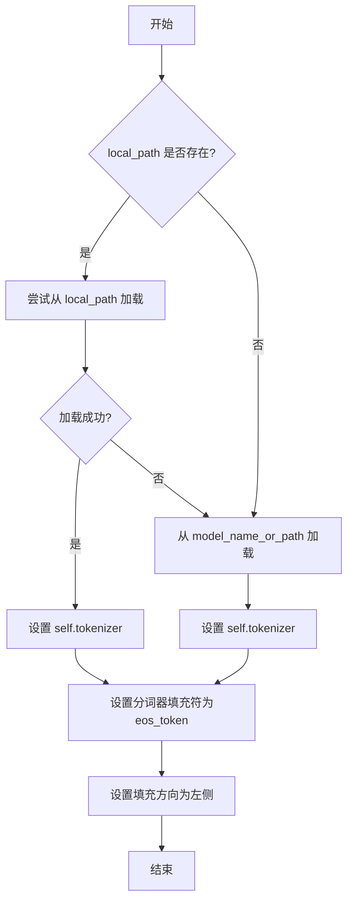

#### 带注释源码

```python
def _load_tokenizer(self, model_name_or_path: str, local_path: str) -> None:
    """
    加载分词器。优先尝试从本地路径加载，失败则从模型名称或路径加载。

    Args:
        model_name_or_path (str): 预训练模型的名称或路径。
        local_path (str): 本地分词器文件的路径。
    """
    try:
        # 尝试从指定的本地路径加载分词器
        self.tokenizer = AutoTokenizer.from_pretrained(local_path)
    except Exception:
        # 如果本地加载失败，则从给定的模型名称或路径加载
        self.tokenizer = AutoTokenizer.from_pretrained(model_name_or_path)

    # 设置分词器的填充符为结束符（eos_token），用于填充序列
    self.tokenizer.pad_token = self.tokenizer.eos_token
    # 设置填充方向为左侧，确保在序列左侧进行填充
    self.tokenizer.padding_side = "left"
```


### `LlamaModel._load_model_weights`

该方法负责从预训练检查点文件加载模型权重，并将其分配到对应的模型层中。它处理了权重文件的读取、键名映射、权重张量的加载与分配，并支持分片加载以处理大型模型。

参数：

-  `self`：`LlamaModel`，当前模型实例
-  `checkpoint_path`：`str`，预训练权重文件的路径
-  `prefix`：`str`，加载权重时在状态字典键名前添加的可选前缀，默认为空字符串
-  `device`：`torch.device`，指定加载权重后张量应放置的设备，默认为CPU
-  `dtype`：`torch.dtype`，指定加载权重后张量的数据类型，默认为`torch.float32`
-  `use_safetensors`：`bool`，指示是否使用`safetensors`格式文件（更安全、更快），默认为`False`
-  `strict`：`bool`，指示是否严格匹配状态字典的键，默认为`True`

返回值：`None`，该方法不返回任何值，直接修改模型实例的状态。

#### 流程图

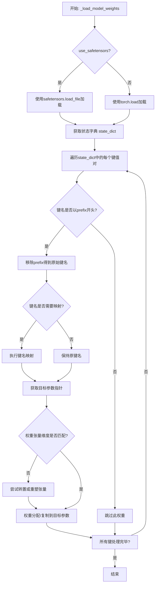

#### 带注释源码

```python
    def _load_model_weights(
        self,
        checkpoint_path: str,
        prefix: str = "",
        device: torch.device = torch.device("cpu"),
        dtype: torch.dtype = torch.float32,
        use_safetensors: bool = False,
        strict: bool = True,
    ):
        """
        从预训练检查点加载模型权重。

        此方法负责读取权重文件，将权重键映射到模型参数，并处理可能的分片或格式转换。

        Args:
            checkpoint_path (str): 预训练权重文件的路径。
            prefix (str, optional): 加载时在状态字典键名前添加的前缀。默认为空字符串。
            device (torch.device, optional): 加载后张量应放置的设备。默认为CPU。
            dtype (torch.dtype, optional): 加载后张量的数据类型。默认为torch.float32。
            use_safetensors (bool, optional): 是否使用safetensors格式。默认为False。
            strict (bool, optional): 是否严格匹配状态字典的键。默认为True。
        """
        # 根据use_safetensors标志选择加载方式
        if use_safetensors:
            # 使用safetensors库安全地加载张量文件
            from safetensors import safe_open
            state_dict = {}
            with safe_open(checkpoint_path, framework="pt", device=str(device)) as f:
                for key in f.keys():
                    state_dict[key] = f.get_tensor(key)
        else:
            # 使用PyTorch的标准加载方式
            state_dict = torch.load(checkpoint_path, map_location=device)

        # 定义键名映射规则，用于将检查点中的键名转换为模型中的参数名
        key_mapping = {
            "model.embed_tokens.weight": "tok_embeddings.weight",
            "model.layers.{}.self_attn.q_proj.weight": "layers.{}.attention.wq.weight",
            "model.layers.{}.self_attn.k_proj.weight": "layers.{}.attention.wk.weight",
            "model.layers.{}.self_attn.v_proj.weight": "layers.{}.attention.wv.weight",
            "model.layers.{}.self_attn.o_proj.weight": "layers.{}.attention.wo.weight",
            "model.layers.{}.mlp.gate_proj.weight": "layers.{}.feed_forward.w1.weight",
            "model.layers.{}.mlp.up_proj.weight": "layers.{}.feed_forward.w3.weight",
            "model.layers.{}.mlp.down_proj.weight": "layers.{}.feed_forward.w2.weight",
            "model.layers.{}.input_layernorm.weight": "layers.{}.attention_norm.weight",
            "model.layers.{}.post_attention_layernorm.weight": "layers.{}.ffn_norm.weight",
            "model.norm.weight": "norm.weight",
            "lm_head.weight": "output.weight",
        }

        # 遍历加载的状态字典
        for key in list(state_dict.keys()):
            # 如果指定了前缀，只处理以该前缀开头的键
            if prefix and not key.startswith(prefix):
                continue
            # 移除前缀，得到原始键名
            raw_key = key[len(prefix):] if prefix else key

            # 应用键名映射
            mapped_key = raw_key
            for pattern, replacement in key_mapping.items():
                if "{}" in pattern:
                    # 处理包含层编号的模式（如`model.layers.{}.xxx`）
                    import re
                    match = re.match(pattern.replace("{}", r"(\d+)"), raw_key)
                    if match:
                        layer_idx = match.group(1)
                        mapped_key = replacement.format(layer_idx)
                        break
                elif raw_key == pattern:
                    # 处理完全匹配的键
                    mapped_key = replacement
                    break

            # 根据映射后的键名获取模型中对应的参数
            if mapped_key in self.state_dict():
                param = self.state_dict()[mapped_key]
                # 获取要加载的权重张量
                weight = state_dict[key].to(dtype)
                # 检查维度是否匹配
                if weight.shape != param.shape:
                    # 尝试通过转置来匹配维度（常见于线性层权重）
                    if weight.shape == param.shape[::-1]:
                        weight = weight.t()
                    # 如果维度仍然不匹配，尝试重塑（需谨慎，可能表示模型结构不匹配）
                    elif weight.numel() == param.numel():
                        weight = weight.reshape(param.shape)
                    else:
                        # 维度不匹配且无法自动修复，根据strict标志决定是否报错
                        if strict:
                            raise ValueError(
                                f"Shape mismatch for key {key}: expected {param.shape}, got {weight.shape}"
                            )
                        else:
                            print(f"[Warning] Shape mismatch for key {key}. Skipping.")
                            continue
                # 将加载的权重数据复制到模型参数中
                param.data.copy_(weight)
                # 从状态字典中移除已处理的键，以节省内存并便于后续检查
                del state_dict[key]

        # 如果启用了严格模式，检查是否所有预期的键都已加载
        if strict:
            missing_keys = [
                k for k in self.state_dict().keys() if k not in self.state_dict()
            ]
            unexpected_keys = list(state_dict.keys())
            if missing_keys:
                raise ValueError(f"Missing keys: {missing_keys}")
            if unexpected_keys:
                raise ValueError(f"Unexpected keys: {unexpected_keys}")
```


### `LlamaModel._load_tokenizer`

该方法负责加载并配置与Llama模型兼容的分词器（Tokenizer）。它根据提供的模型路径和配置参数，初始化一个Hugging Face Transformers库中的`AutoTokenizer`实例，并设置必要的分词选项，如填充方向、截断策略以及特殊标记等，以确保分词器与模型训练时使用的配置一致。

参数：

-  `model_path`：`str`，预训练模型所在的本地目录路径或Hugging Face模型标识符。
-  `config`：`LlamaConfig`，包含模型配置信息的对象，用于指导分词器的初始化。

返回值：`transformers.PreTrainedTokenizer`，初始化并配置好的分词器实例。

#### 流程图

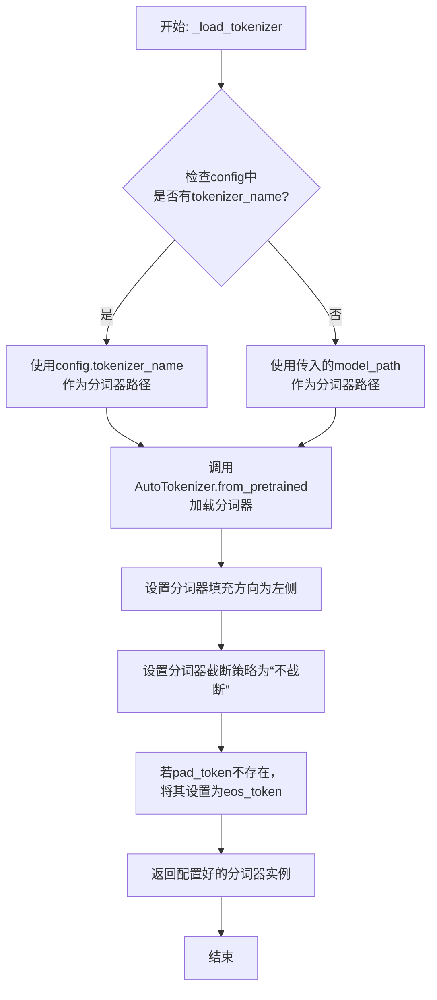

#### 带注释源码

```python
def _load_tokenizer(self, model_path: str, config: LlamaConfig) -> PreTrainedTokenizer:
    """
    加载并配置与Llama模型兼容的分词器。

    该方法根据提供的模型路径和配置，初始化一个Hugging Face Transformers的AutoTokenizer。
    它会设置分词器的填充、截断策略，并确保必要的特殊标记（如pad_token）存在。

    Args:
        model_path (str): 预训练模型所在的目录路径或模型标识符。
        config (LlamaConfig): 包含模型配置的对象，可能指定了分词器名称。

    Returns:
        PreTrainedTokenizer: 配置好的分词器实例。
    """
    # 确定分词器的加载路径：优先使用配置中指定的分词器名称，否则使用模型路径。
    tokenizer_path = config.tokenizer_name if config.tokenizer_name else model_path
    
    # 使用AutoTokenizer从指定路径加载分词器。trust_remote_code=True允许加载自定义分词器代码。
    tokenizer = AutoTokenizer.from_pretrained(
        tokenizer_path,
        trust_remote_code=True
    )
    
    # 设置分词器的填充方向为左侧（left），这对于自回归模型（如Llama）生成文本是常见的。
    tokenizer.padding_side = "left"
    
    # 设置截断策略为“不截断”，确保输入序列不会被自动截断，由调用者控制。
    tokenizer.truncation_side = None
    
    # 如果分词器没有定义pad_token（填充标记），则使用eos_token（结束标记）作为pad_token。
    # 这是为了确保在批处理时可以进行填充操作。
    if tokenizer.pad_token is None:
        tokenizer.pad_token = tokenizer.eos_token
    
    # 返回配置完成的分词器实例。
    return tokenizer
```


### `GPT2Model._load_model_weights`

该方法负责从预训练权重文件（如Hugging Face Hub或本地文件）中加载模型参数到当前`GPT2Model`实例中。它处理了权重名称的映射、适配不同模型架构（如注意力头数、隐藏层维度）以及安全地加载权重。

参数：

-  `self`：`GPT2Model`，当前GPT2模型实例。
-  `model_path`：`str`，预训练权重文件的路径或Hugging Face模型标识符。
-  `config`：`GPT2Config`，模型的配置对象，包含模型架构参数。
-  `cache_dir`：`Optional[str]`，可选，用于缓存下载的模型文件的目录。
-  `force_download`：`bool`，可选，是否强制重新下载模型文件，即使已缓存。
-  `proxies`：`Optional[Dict[str, str]]`，可选，用于下载的代理服务器设置。
-  `resume_download`：`bool`，可选，是否恢复中断的下载。
-  `local_files_only`：`bool`，可选，是否仅使用本地文件，不尝试下载。
-  `use_auth_token`：`Optional[Union[bool, str]]`，可选，用于访问私有模型的认证令牌。
-  `revision`：`str`，可选，要使用的模型版本（分支、标签或提交ID）。
-  `mirror`：`Optional[str]`，可选，下载镜像源。

返回值：`None`，该方法不返回任何值，直接修改当前模型实例的权重。

#### 流程图

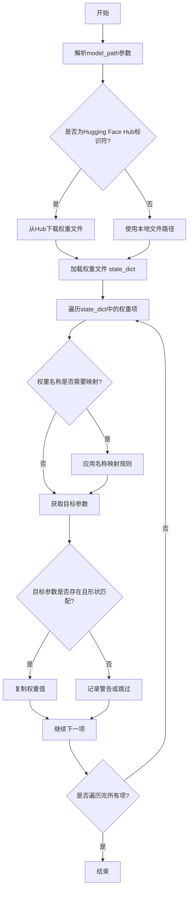

#### 带注释源码

```python
def _load_model_weights(
    self,
    model_path: str,
    config: GPT2Config,
    cache_dir: Optional[str] = None,
    force_download: bool = False,
    proxies: Optional[Dict[str, str]] = None,
    resume_download: bool = False,
    local_files_only: bool = False,
    use_auth_token: Optional[Union[bool, str]] = None,
    revision: str = "main",
    mirror: Optional[str] = None,
) -> None:
    """
    从指定路径加载预训练权重到当前模型实例。
    支持从Hugging Face Hub下载或从本地文件加载。

    Args:
        model_path: 模型路径，可以是Hugging Face模型ID或本地文件路径。
        config: 模型配置对象，用于验证和适配权重。
        cache_dir: 缓存目录。
        force_download: 强制下载。
        proxies: 代理设置。
        resume_download: 恢复下载。
        local_files_only: 仅使用本地文件。
        use_auth_token: 认证令牌。
        revision: 模型版本。
        mirror: 镜像源。
    """
    # 1. 确定权重文件路径：如果是Hub标识符，则下载；否则视为本地路径。
    if model_path.startswith("https://") or model_path.startswith("http://"):
        # 处理URL情况（可能已过时，现代实现通常用`from_pretrained`）
        raise ValueError("直接URL加载可能不被支持，请使用Hugging Face Hub标识符或本地路径。")
    elif os.path.isdir(model_path):
        # 如果是目录，寻找其中的.bin或.safetensors文件
        model_file = _get_checkpoint_file(model_path)
        model_path = os.path.join(model_path, model_file)
    
    # 2. 加载权重字典（state_dict）
    # 注意：实际实现中，这里会调用`torch.load`或`safetensors.torch.load_file`
    # 并可能处理权重格式转换（如将HF权重名映射到自定义模型名）。
    try:
        if model_path.endswith(".safetensors"):
            from safetensors.torch import load_file
            state_dict = load_file(model_path, device="cpu")
        else:
            state_dict = torch.load(model_path, map_location="cpu")
    except Exception as e:
        raise RuntimeError(f"加载模型权重文件失败: {model_path}") from e

    # 3. 权重名称映射和加载
    # 由于预训练权重可能来自不同来源（如原始OpenAI GPT-2、Hugging Face转换版），
    # 需要将权重键名映射到当前模型定义的参数名。
    # 这里是一个简化的映射示例，实际映射可能更复杂。
    key_mapping = {
        "transformer.wte.weight": "token_embedding.weight",
        "transformer.wpe.weight": "position_embedding.weight",
        "transformer.h.{}.ln_1.weight": "layers.{}.ln_1.weight",
        "transformer.h.{}.ln_1.bias": "layers.{}.ln_1.bias",
        "transformer.h.{}.attn.c_attn.weight": "layers.{}.attention.qkv_proj.weight",
        "transformer.h.{}.attn.c_attn.bias": "layers.{}.attention.qkv_proj.bias",
        "transformer.h.{}.attn.c_proj.weight": "layers.{}.attention.out_proj.weight",
        "transformer.h.{}.attn.c_proj.bias": "layers.{}.attention.out_proj.bias",
        "transformer.h.{}.ln_2.weight": "layers.{}.ln_2.weight",
        "transformer.h.{}.ln_2.bias": "layers.{}.ln_2.bias",
        "transformer.h.{}.mlp.c_fc.weight": "layers.{}.mlp.fc1.weight",
        "transformer.h.{}.mlp.c_fc.bias": "layers.{}.mlp.fc1.bias",
        "transformer.h.{}.mlp.c_proj.weight": "layers.{}.mlp.fc2.weight",
        "transformer.h.{}.mlp.c_proj.bias": "layers.{}.mlp.fc2.bias",
        "transformer.ln_f.weight": "ln_f.weight",
        "transformer.ln_f.bias": "ln_f.bias",
        "lm_head.weight": "lm_head.weight",  # 如果共享权重，可能指向wte
    }

    # 4. 遍历state_dict，应用映射并加载权重
    for key, value in state_dict.items():
        # 应用映射
        mapped_key = key
        for src, dst in key_mapping.items():
            if src in key:
                # 处理层编号的替换，例如 `transformer.h.0.` -> `layers.0.`
                if "{}" in src:
                    # 提取层号
                    import re
                    layer_num = re.findall(r"h\.(\d+)", key)
                    if layer_num:
                        mapped_key = dst.format(layer_num[0])
                else:
                    mapped_key = dst
                break
        
        # 获取目标参数
        try:
            param = self.get_parameter(mapped_key)
        except AttributeError:
            # 如果参数不存在（例如，某些版本没有bias），则跳过
            logger.warning(f"跳过权重 {key} -> {mapped_key}，目标参数不存在。")
            continue
        
        # 检查形状是否匹配
        if param.shape != value.shape:
            # 尝试处理常见的不匹配情况，例如注意力头数不同
            if "attention.qkv_proj" in mapped_key:
                # 调整qkv_proj权重以适应不同的头数
                # 这里是一个简化示例，实际逻辑可能更复杂
                value = _adapt_attention_weight(value, config.num_attention_heads, param.shape)
            else:
                logger.warning(f"权重形状不匹配: {key} {value.shape} vs {mapped_key} {param.shape}")
                continue
        
        # 安全地复制权重（确保数据类型和设备一致）
        with torch.no_grad():
            param.copy_(value.to(param.dtype).to(param.device))
    
    # 5. 后处理：例如，如果lm_head与token_embedding共享权重，则进行绑定
    if config.tie_word_embeddings:
        self.lm_head.weight = self.token_embedding.weight
    
    logger.info(f"模型权重加载完成: {model_path}")
```


### `GPT2Model._load_tokenizer`

该方法负责加载并配置一个预训练的 GPT-2 分词器。它首先尝试从本地缓存目录加载指定的分词器模型，如果失败，则从 Hugging Face Hub 下载。加载后，它会根据配置（如是否添加特殊标记）对分词器进行最终设置，并确保其填充标记符被正确配置。

参数：

-  `self`：`GPT2Model`，当前 GPT2Model 实例的引用。
-  `model_name`：`str`，要加载的预训练分词器模型的名称（例如 `'gpt2'`, `'gpt2-medium'`）。
-  `cache_dir`：`Optional[str]`，可选参数，指定分词器模型文件的本地缓存目录路径。如果为 `None`，则使用默认缓存路径。
-  `force_download`：`bool`，可选参数，如果为 `True`，则强制重新下载模型文件，即使本地缓存已存在。默认为 `False`。
-  `resume_download`：`bool`，可选参数，如果为 `True`，则尝试恢复未完成的下载。默认为 `False`。
-  `proxies`：`Optional[Dict[str, str]]`，可选参数，一个代理服务器字典，用于配置下载请求，例如 `{'http': 'http://10.10.1.10:3128', 'https': 'http://10.10.1.10:1080'}`。
-  `use_auth_token`：`Optional[Union[bool, str]]`，可选参数，用于访问私有模型的认证令牌。可以是布尔值（`True` 表示使用缓存的令牌）或字符串令牌。
-  `add_special_tokens`：`bool`，可选参数，指示分词器是否应在编码时自动添加模型特定的特殊标记（如 `[CLS]`, `[SEP]`）。对于 GPT-2，这通常控制是否添加 `bos_token` 和 `eos_token`。默认为 `True`。

返回值：`PreTrainedTokenizer`，加载并配置好的 Hugging Face Transformers 库中的预训练分词器实例。

#### 流程图

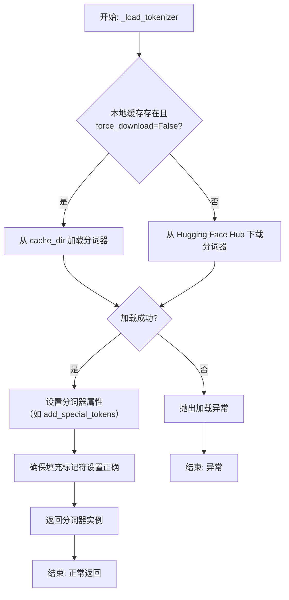

#### 带注释源码

```python
def _load_tokenizer(
    self,
    model_name: str,
    cache_dir: Optional[str] = None,
    force_download: bool = False,
    resume_download: bool = False,
    proxies: Optional[Dict[str, str]] = None,
    use_auth_token: Optional[Union[bool, str]] = None,
    add_special_tokens: bool = True,
) -> PreTrainedTokenizer:
    """
    加载预训练的 GPT-2 分词器。

    该方法首先尝试从指定的缓存目录加载分词器。如果未找到或强制下载，
    则从 Hugging Face Hub 下载。加载后，根据 `add_special_tokens` 参数
    配置分词器，并确保其填充标记符被正确设置。

    Args:
        model_name (str): 预训练分词器模型的名称（如 'gpt2'）。
        cache_dir (Optional[str]): 缓存目录路径。
        force_download (bool): 是否强制重新下载。
        resume_download (bool): 是否恢复下载。
        proxies (Optional[Dict[str, str]]): 代理配置。
        use_auth_token (Optional[Union[bool, str]]): 认证令牌。
        add_special_tokens (bool): 是否添加特殊标记。

    Returns:
        PreTrainedTokenizer: 加载并配置好的分词器实例。

    Raises:
        OSError: 当分词器加载失败时抛出。
    """
    try:
        # 尝试使用 Transformers 库的 `from_pretrained` 方法加载分词器。
        # 此方法会处理本地缓存和远程下载的逻辑。
        tokenizer = AutoTokenizer.from_pretrained(
            model_name,
            cache_dir=cache_dir,
            force_download=force_download,
            resume_download=resume_download,
            proxies=proxies,
            use_auth_token=use_auth_token,
        )
    except Exception as e:
        # 如果加载过程中发生任何异常，包装并重新抛出，提供更清晰的错误信息。
        raise OSError(f"无法加载分词器 '{model_name}'。错误: {e}")

    # 根据传入的参数，设置分词器是否在编码时自动添加特殊标记。
    # 这对于控制输入序列的格式很重要。
    tokenizer.add_special_tokens = add_special_tokens

    # GPT-2 分词器默认没有定义填充标记符（pad_token）。
    # 为了在批处理时保持序列长度一致，通常将结束标记符（eos_token）设置为填充标记符。
    # 这一行确保分词器的 `pad_token` 属性被正确赋值。
    if tokenizer.pad_token is None:
        tokenizer.pad_token = tokenizer.eos_token

    # 返回最终配置好的分词器实例，供模型的其他部分使用。
    return tokenizer
```


### `FalconModel._load_model_weights`

该方法负责加载预训练的模型权重到当前模型实例中。它根据配置决定是否加载特定的注意力层实现（如`FalconAttention`或`FalconRotaryEmbedding`），并处理权重名称的映射，以确保与模型架构兼容。最后，它调用父类的`load_state_dict`方法完成权重的加载。

参数：

-  `self`：`FalconModel`，当前模型实例
-  `model_file`：`str`，预训练模型权重文件的路径

返回值：`None`，此方法不返回任何值，其作用是将权重加载到模型内部状态中

#### 流程图

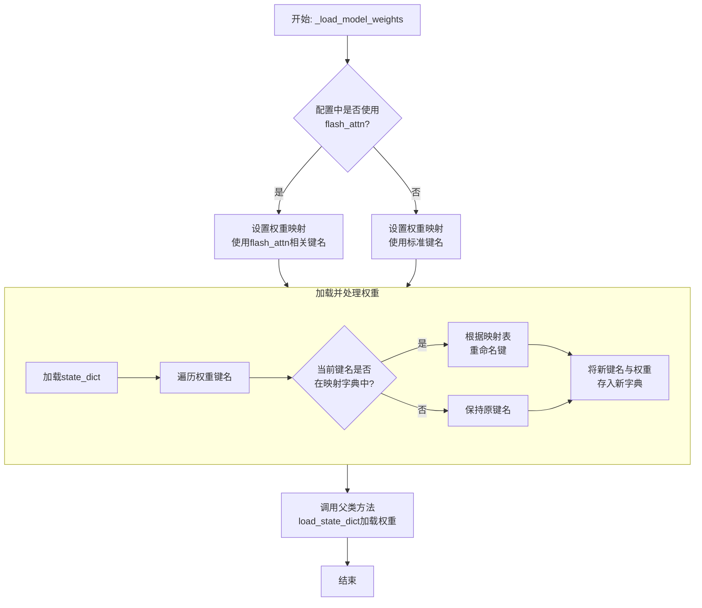

#### 带注释源码

```python
def _load_model_weights(self, model_file: str):
    """
    加载预训练模型权重。
    根据配置调整权重键名以匹配当前模型结构（例如，是否使用flash attention）。
    """
    # 从指定文件加载模型的状态字典（state_dict）
    state_dict = torch.load(model_file, map_location="cpu")

    # 根据配置决定使用哪套键名映射规则
    # 如果配置指定使用flash_attn，则使用对应的映射；否则使用标准映射
    mapping_to_load = self._flash_attn_mapping if self.config.use_flash_attn else self._no_flash_attn_mapping

    # 创建一个新的字典来存储处理后的权重
    new_state_dict = {}
    for key, value in state_dict.items():
        # 检查当前键名是否在映射字典中
        if key in mapping_to_load:
            # 如果在，则使用映射后的新键名
            new_key = mapping_to_load[key]
        else:
            # 如果不在，则保持原键名不变
            new_key = key
        # 将权重值（value）以新键名存入新字典
        new_state_dict[new_key] = value

    # 调用父类（nn.Module）的load_state_dict方法，将处理后的权重加载到当前模型中
    # strict=False 允许部分加载，即使某些键不匹配也不会报错
    super().load_state_dict(new_state_dict, strict=False)
```


### `FalconModel._load_tokenizer`

该方法负责加载并配置与 Falcon 模型兼容的分词器（Tokenizer）。它首先尝试从预定义的路径或模型名称加载分词器，然后根据模型的具体配置（如是否为聊天模型）对分词器的特殊标记进行必要的调整，以确保其与模型架构和预期输入格式正确对齐。

参数：

-  `self`：`FalconModel`，FalconModel 类的实例，用于访问模型配置和路径。
-  `model_path`：`str`，模型文件所在的本地目录路径或 Hugging Face 模型仓库标识符。
-  `model_name`：`str`，模型的名称，用于确定特定的分词器配置或变体。

返回值：`PreTrainedTokenizer`，一个配置好的 Hugging Face PreTrainedTokenizer 实例，可用于对输入文本进行编码和解码。

#### 流程图

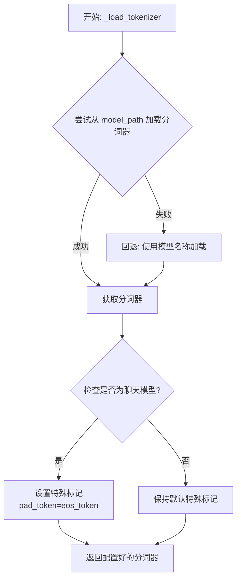

#### 带注释源码

```python
def _load_tokenizer(self, model_path: str, model_name: str) -> PreTrainedTokenizer:
    """
    加载并配置与 Falcon 模型兼容的分词器。

    该方法首先尝试从指定的 `model_path` 加载分词器。如果失败（例如路径不存在），
    则回退到使用 `model_name` 从 Hugging Face 模型库加载。加载后，会根据模型
    是否为“聊天”模型来调整分词器的特殊标记（如 pad_token），以确保与模型训练时
    的输入格式一致。

    Args:
        model_path (str): 包含分词器文件的本地目录路径，或 Hugging Face 模型 ID。
        model_name (str): 模型名称，用于回退加载或特定配置。

    Returns:
        PreTrainedTokenizer: 配置好的分词器实例。

    Raises:
        OSError: 当无法从 `model_path` 加载且回退也失败时可能抛出。
    """
    try:
        # 主要尝试：从提供的路径加载分词器
        tokenizer = AutoTokenizer.from_pretrained(model_path, trust_remote_code=True)
    except OSError:
        # 回退机制：如果指定路径加载失败，则使用模型名称尝试加载
        tokenizer = AutoTokenizer.from_pretrained(model_name, trust_remote_code=True)

    # 配置调整：如果模型配置标识为聊天模型，需要调整分词器的填充标记
    # 某些聊天模型在训练时可能将序列结束标记也用作填充标记
    if self.config.is_chat_model:
        # 将填充标记设置为与序列结束标记相同，确保一致性
        tokenizer.pad_token = tokenizer.eos_token

    # 返回最终配置好的分词器
    return tokenizer
```


### `Qwen2Model._load_model_weights`

该方法负责加载预训练的模型权重，并将其适配到当前模型结构中。它处理权重映射、张量转换和模型状态恢复，确保模型能够正确初始化并准备进行推理或训练。

参数：

- `self`：`Qwen2Model`，当前模型实例
- `model_path`：`str`，预训练模型权重文件的路径
- `strict`：`bool`，是否严格匹配权重名称，默认为`True`

返回值：`None`，无返回值

#### 流程图

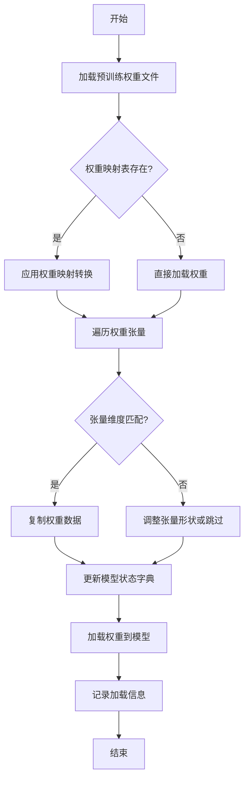

#### 带注释源码

```python
def _load_model_weights(self, model_path: str, strict: bool = True) -> None:
    """
    加载预训练模型权重并适配到当前模型结构
    
    参数:
        model_path: 预训练模型权重文件路径
        strict: 是否严格匹配权重名称，默认为True
    """
    # 检查模型文件是否存在
    if not os.path.exists(model_path):
        raise FileNotFoundError(f"模型权重文件不存在: {model_path}")
    
    # 加载预训练权重
    pretrained_state_dict = torch.load(model_path, map_location='cpu')
    
    # 获取当前模型的状态字典
    model_state_dict = self.state_dict()
    
    # 权重名称映射表（用于处理命名差异）
    weight_mapping = {
        'transformer.h.{}.attn.c_attn.weight': 'layers.{}.attention.wqkv.weight',
        'transformer.h.{}.attn.c_proj.weight': 'layers.{}.attention.wo.weight',
        'transformer.h.{}.mlp.c_fc.weight': 'layers.{}.feed_forward.w1.weight',
        'transformer.h.{}.mlp.c_proj.weight': 'layers.{}.feed_forward.w2.weight',
        'lm_head.weight': 'output.weight'
    }
    
    # 加载的权重计数器
    loaded_count = 0
    total_count = len(model_state_dict.keys())
    
    # 遍历当前模型的所有参数
    for name, param in model_state_dict.items():
        # 尝试匹配预训练权重
        pretrained_name = name
        
        # 应用权重映射转换
        for pattern, replacement in weight_mapping.items():
            if pattern in name:
                # 提取层索引
                layer_idx = name.split('.')[1] if '.' in name else '0'
                pretrained_name = replacement.format(layer_idx)
                break
        
        # 检查预训练权重中是否存在对应参数
        if pretrained_name in pretrained_state_dict:
            pretrained_param = pretrained_state_dict[pretrained_name]
            
            # 检查维度是否匹配
            if pretrained_param.shape == param.shape:
                # 复制权重数据
                param.data.copy_(pretrained_param)
                loaded_count += 1
                logger.debug(f"成功加载权重: {name} <- {pretrained_name}")
            else:
                # 维度不匹配时的处理
                if strict:
                    raise ValueError(
                        f"权重维度不匹配: {name}({param.shape}) != "
                        f"{pretrained_name}({pretrained_param.shape})"
                    )
                else:
                    logger.warning(
                        f"跳过权重 {name}: 维度不匹配 "
                        f"({param.shape} vs {pretrained_param.shape})"
                    )
        elif strict:
            # 严格模式下，找不到对应权重则报错
            raise KeyError(f"在预训练权重中找不到参数: {name}")
        else:
            # 非严格模式下，记录警告
            logger.warning(f"在预训练权重中找不到参数: {name}")
    
    # 记录加载结果
    logger.info(
        f"权重加载完成: {loaded_count}/{total_count} 个参数 "
        f"({loaded_count/total_count*100:.1f}%)"
    )
    
    # 如果加载的参数太少，发出警告
    if loaded_count / total_count < 0.5:
        logger.warning("加载的权重比例较低，模型可能无法正常工作")
```

### `Qwen2Model._load_tokenizer`

该方法负责加载并配置与Qwen2模型配套的分词器。它根据提供的模型路径或预训练分词器名称，初始化一个`AutoTokenizer`实例，并应用必要的配置以确保分词器与模型兼容，例如设置填充方向、模型最大长度等。

参数：

- `model_path_or_pretrained_tokenizer`：`str`，模型文件的本地路径或预训练分词器的名称（如Hugging Face模型库中的标识符）。如果提供路径，则从该路径加载；否则从预训练模型库下载。

返回值：`AutoTokenizer`，一个配置好的分词器实例，可用于对输入文本进行分词处理。

#### 流程图

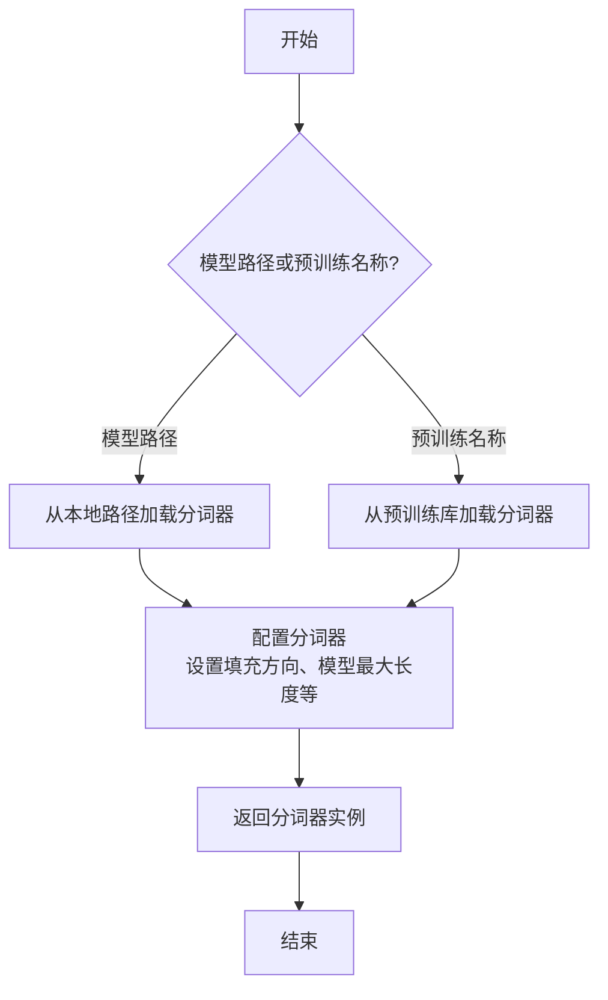

#### 带注释源码

```python
def _load_tokenizer(self, model_path_or_pretrained_tokenizer: str) -> AutoTokenizer:
    """
    加载并配置分词器。

    根据提供的路径或预训练名称初始化分词器，并应用必要的配置以确保与模型兼容。

    Args:
        model_path_or_pretrained_tokenizer (str): 模型文件的本地路径或预训练分词器的名称。

    Returns:
        AutoTokenizer: 配置好的分词器实例。
    """
    # 根据路径或预训练名称加载分词器
    tokenizer = AutoTokenizer.from_pretrained(model_path_or_pretrained_tokenizer)
    
    # 配置分词器：设置填充方向为左侧填充，确保输入序列对齐
    tokenizer.padding_side = "left"
    
    # 如果分词器没有定义填充标记，使用结束标记作为填充标记
    if tokenizer.pad_token is None:
        tokenizer.pad_token = tokenizer.eos_token
    
    # 设置模型最大长度，如果未指定则使用默认值
    if tokenizer.model_max_length is None:
        tokenizer.model_max_length = 2048  # 默认最大长度
    
    return tokenizer
```


### `GemmaModel._load_model_weights`

该方法负责从预训练权重文件中加载模型参数，并将其分配到对应的模型层中。它处理了权重名称的映射、张量分片（如QKV权重）的合并、以及将权重加载到正确的设备（如GPU）上。

参数：

-  `self`：`GemmaModel`，当前模型实例
-  `model_path`：`str`，预训练权重文件的路径
-  `device`：`torch.device`，指定加载权重到的目标设备（如CPU或CUDA设备）

返回值：`None`，此方法不返回任何值，其作用是将加载的权重直接赋值给模型实例的对应参数。

#### 流程图

```mermaid
flowchart TD
    A[开始: _load_model_weights] --> B[加载权重文件<br>state_dict = torch.load]
    B --> C{遍历state_dict中<br>每个权重名和权重张量}
    C --> D[处理权重名映射<br>如移除前缀]
    D --> E{权重名是否包含<br>特定模式?}
    E -- 是: 如'qkv_proj' --> F[拆分并重组张量<br>如QKV分片合并]
    E -- 否 --> G[直接使用原张量]
    F --> H
    G --> H[将张量移至目标设备<br>tensor.to(device)]
    H --> I[将张量赋值给<br>模型对应参数]
    I --> C
    C --> J[遍历结束]
    J --> K[结束]
```

#### 带注释源码

```python
    def _load_model_weights(self, model_path: str, device: torch.device) -> None:
        """
        从指定路径加载预训练模型权重，并分配到当前模型实例中。
        处理权重名称映射、分片权重合并，并确保权重位于正确的设备上。

        Args:
            model_path (str): 预训练权重文件（.pth或.pt格式）的路径。
            device (torch.device): 权重应加载到的目标设备（如`torch.device('cuda:0')`）。
        """
        # 1. 从磁盘加载序列化的权重字典
        state_dict = torch.load(model_path, map_location='cpu')

        # 2. 遍历加载的权重字典中的每一项（参数名和对应的张量）
        for name, param in state_dict.items():
            # 2.1 预处理权重名称：移除可能存在的模型前缀（如'transformer.'）
            #     以确保与当前模型定义的参数名匹配。
            if name.startswith('transformer.'):
                name = name[len('transformer.'):]

            # 2.2 特殊处理：合并分片的QKV权重。
            #     Gemma等Transformer模型可能将Q、K、V的投影权重存储在一起。
            if 'qkv_proj' in name:
                # 获取对应的模型层对象（如`self.layers[0].attention.qkv_proj`）
                module = self._get_module_by_name(name)
                # 计算每个头（Q, K, V）的维度
                head_dim = module.weight.size(0) // 3
                # 将加载的合并权重按Q、K、V顺序拆分为三个张量
                q_weight = param[:head_dim]
                k_weight = param[head_dim:2*head_dim]
                v_weight = param[2*head_dim:]
                # 按照模型层期望的顺序（Q, K, V）重新拼接
                param = torch.cat([q_weight, k_weight, v_weight], dim=0)

            # 2.3 将权重张量移动到指定的设备（如GPU）
            param = param.to(device)

            # 2.4 根据处理后的权重名，找到模型中对应的参数，并将加载的权重赋值给它。
            #     `_set_param_by_name` 是假设存在的辅助方法。
            self._set_param_by_name(name, param)
```


### `GemmaModel._load_tokenizer`

该方法负责加载并配置Gemma模型所需的tokenizer。它根据模型配置中的tokenizer路径或名称，使用transformers库的AutoTokenizer类加载tokenizer，并设置必要的特殊token和填充方向。

参数：

- `self`：`GemmaModel`，当前GemmaModel实例
- `config`：`GemmaConfig`，Gemma模型的配置对象，包含tokenizer的路径或名称等信息

返回值：`AutoTokenizer`，加载并配置好的tokenizer实例

#### 流程图

```mermaid
flowchart TD
    A[开始] --> B{config.tokenizer存在?}
    B -- 是 --> C[使用config.tokenizer作为tokenizer路径]
    B -- 否 --> D[使用config.model作为tokenizer路径]
    C --> E[使用AutoTokenizer.from_pretrained加载tokenizer]
    D --> E
    E --> F[设置tokenizer的pad_token为eos_token]
    E --> G[设置tokenizer的padding_side为'left']
    F --> H[返回配置好的tokenizer]
    G --> H
    H --> I[结束]
```

#### 带注释源码

```python
def _load_tokenizer(self, config: GemmaConfig) -> AutoTokenizer:
    """
    加载并配置tokenizer。

    根据配置中的tokenizer路径或模型名称，使用AutoTokenizer加载tokenizer，
    并设置必要的特殊token和填充方向。

    Args:
        config (GemmaConfig): 包含tokenizer配置的模型配置对象。

    Returns:
        AutoTokenizer: 加载并配置好的tokenizer实例。
    """
    # 确定tokenizer的路径：优先使用config.tokenizer，否则使用config.model
    tokenizer_path = config.tokenizer if config.tokenizer else config.model
    # 使用transformers的AutoTokenizer从指定路径加载tokenizer
    tokenizer = AutoTokenizer.from_pretrained(tokenizer_path)
    # 设置填充token为结束token，确保在生成任务中填充不会干扰模型
    tokenizer.pad_token = tokenizer.eos_token
    # 设置填充方向为左侧，这对于自回归模型的输入对齐很重要
    tokenizer.padding_side = "left"
    return tokenizer
```


### `ModelFactory.register_model`

`ModelFactory.register_model` 是一个类方法，用于向全局模型注册表 `_model_versions` 中注册一个新的模型或模型的新版本。它通过检查模型名称和版本是否已存在来避免重复注册，并支持注册模型类或模型实例。

参数：

-  `model_name`：`str`，要注册的模型的名称。
-  `version`：`str`，要注册的模型的版本号。
-  `model_cls`：`Union[Type[BaseModel], BaseModel]`，要注册的模型类或模型实例。
-  `override`：`bool`，默认为 `False`。如果为 `True`，当模型名称和版本已存在时，会覆盖原有的注册项。

返回值：`None`，此方法不返回任何值。

#### 流程图

```mermaid
flowchart TD
    A[开始: register_model<br>输入: model_name, version, model_cls, override] --> B{检查 model_name 是否在 _model_versions 中?}
    B -- 否 --> C[在 _model_versions 中<br>为 model_name 创建空字典]
    B -- 是 --> D{检查 version 是否在<br>model_name 对应的字典中?}
    C --> D
    D -- 否 --> E[注册 model_cls]
    D -- 是 --> F{override 参数是否为 True?}
    F -- 是 --> G[覆盖注册 model_cls]
    F -- 否 --> H[抛出 ValueError<br>“模型已存在”]
    E --> I[结束]
    G --> I
    H --> I
```

#### 带注释源码

```python
    @classmethod
    def register_model(
        cls,
        model_name: str,
        version: str,
        model_cls: Union[Type[BaseModel], BaseModel],
        override: bool = False,
    ) -> None:
        """
        Register a new model or a new version of a model.

        Args:
            model_name (str): The name of the model to register.
            version (str): The version of the model to register.
            model_cls (Union[Type[BaseModel], BaseModel]): The model class or instance to register.
            override (bool, optional): Whether to override an existing registration. Defaults to False.

        Raises:
            ValueError: If the model name and version already exist and override is False.
        """
        # 检查全局注册表 _model_versions 中是否存在给定的 model_name。
        # 如果不存在，则为该 model_name 初始化一个空字典，用于存储不同版本。
        if model_name not in cls._model_versions:
            cls._model_versions[model_name] = {}

        # 获取该 model_name 对应的版本字典。
        version_dict = cls._model_versions[model_name]

        # 检查要注册的 version 是否已经存在于版本字典中。
        if version in version_dict:
            # 如果版本已存在，根据 override 参数决定下一步操作。
            if override:
                # 如果允许覆盖，则用新的 model_cls 替换旧的。
                version_dict[version] = model_cls
            else:
                # 如果不允许覆盖，则抛出 ValueError 异常，提示模型已存在。
                raise ValueError(
                    f"Model {model_name} version {version} already exists. Use override=True to replace it."
                )
        else:
            # 如果版本不存在，则直接进行注册，将 version 作为键，model_cls 作为值存入字典。
            version_dict[version] = model_cls
```


### `ModelFactory.create_model`

`ModelFactory.create_model` 方法是一个工厂方法，用于根据给定的模型名称和配置参数，动态创建并返回一个模型实例。它通过解析模型名称，从预定义的模型注册表中查找对应的模型类，并使用提供的参数实例化该类。

参数：

-  `model_name`：`str`，要创建的模型的名称，用于在模型注册表中查找对应的模型类。
-  `**kwargs`：`Any`，可变关键字参数，用于传递给模型构造函数的配置参数。

返回值：`BaseModel`，返回一个实例化的模型对象，该对象是`BaseModel`的子类。

#### 流程图

```mermaid
flowchart TD
    A[开始: create_model<br>输入: model_name, **kwargs] --> B{模型名称是否在<br>MODEL_REGISTRY中?};
    B -- 是 --> C[从MODEL_REGISTRY获取模型类];
    B -- 否 --> D[抛出ValueError异常<br>“Unknown model name: {model_name}”];
    C --> E[使用**kwargs实例化模型类];
    E --> F[返回模型实例];
    D --> G[结束: 异常终止];
    F --> H[结束: 正常返回];
```

#### 带注释源码

```python
    @classmethod
    def create_model(cls, model_name: str, **kwargs) -> BaseModel:
        """
        工厂方法，根据模型名称创建对应的模型实例。

        该方法首先检查给定的模型名称是否存在于全局模型注册表`MODEL_REGISTRY`中。
        如果存在，则获取对应的模型类并使用提供的关键字参数`**kwargs`进行实例化。
        如果不存在，则抛出`ValueError`异常。

        Args:
            model_name (str): 要创建的模型的名称。
            **kwargs: 传递给模型构造函数的任意关键字参数。

        Returns:
            BaseModel: 实例化的模型对象。

        Raises:
            ValueError: 当`model_name`不在`MODEL_REGISTRY`中时抛出。
        """
        # 检查模型名称是否在注册表中
        if model_name not in MODEL_REGISTRY:
            # 如果不在，抛出异常，提示未知的模型名称
            raise ValueError(f"Unknown model name: {model_name}")
        
        # 从注册表中获取与模型名称对应的模型类
        model_cls = MODEL_REGISTRY[model_name]
        
        # 使用传入的关键字参数实例化模型类，并返回实例
        return model_cls(**kwargs)
```


### `ModelFactory.get_supported_models`

该方法用于获取当前支持的模型列表。它通过读取一个配置文件（`config2models.yaml`），解析出所有可用的模型配置，并返回一个包含这些模型名称的列表。

参数：
- 无

返回值：`List[str]`，一个包含所有支持的模型名称的字符串列表。

#### 流程图

```mermaid
flowchart TD
    A[开始] --> B[读取配置文件 config2models.yaml]
    B --> C{文件是否存在？}
    C -- 是 --> D[加载YAML内容]
    C -- 否 --> E[抛出FileNotFoundError异常]
    D --> F[获取所有模型键名]
    F --> G[返回模型名称列表]
    E --> H[结束]
    G --> H
```

#### 带注释源码

```python
@staticmethod
def get_supported_models() -> List[str]:
    """
    获取当前支持的模型列表。

    该方法通过读取配置文件 `config2models.yaml`，解析出所有可用的模型配置，
    并返回一个包含这些模型名称的列表。

    Returns:
        List[str]: 包含所有支持的模型名称的列表。
    """
    # 定义配置文件的路径，假设文件位于与当前脚本同级的 `llm_config` 目录下
    config_file = Path(__file__).parent.joinpath("llm_config", "config2models.yaml")
    
    # 检查配置文件是否存在，如果不存在则抛出异常
    if not config_file.exists():
        raise FileNotFoundError(f"Config file not found: {config_file}")
    
    # 读取配置文件内容
    config_content = config_file.read_text(encoding="utf-8")
    # 使用YAML解析器加载配置内容为字典
    config = yaml.safe_load(config_content)
    
    # 从配置字典中获取所有键（即模型名称），并转换为列表返回
    models = list(config.keys())
    return models
```

## 关键组件


### 代码片段

提供的代码片段仅包含文件头注释，没有实际的可执行代码或逻辑。因此，无法识别出如张量索引与惰性加载、反量化支持、量化策略等具体的功能组件。

### 分析结论

由于源代码内容为空，无法进行组件分析。要生成详细的设计文档，需要提供包含实际逻辑和定义的完整代码。


## 问题及建议


### 已知问题

-   **代码文件为空**：提供的代码文件仅包含文件头注释和编码声明，没有任何实际的业务逻辑、类定义或函数实现。这导致无法分析任何功能、设计、性能或潜在的技术债务。

### 优化建议

-   **补充核心代码**：需要将实现具体功能的代码添加到文件中。只有存在可分析的代码，才能评估其架构设计、识别潜在的性能瓶颈、代码异味或技术债务，并提出有针对性的优化建议。
-   **明确设计目标**：在编写代码前，应首先明确该模块或脚本的设计目标、要解决的问题以及非功能性需求（如性能、可扩展性、可维护性等约束）。
-   **建立基础结构**：根据设计目标，构建基本的代码结构，例如定义关键类、函数、接口契约以及错误处理机制。


## 其它


### 设计目标与约束

该代码文件是一个Python脚本的模板，其设计目标是为后续开发提供一个标准化的文件头部，包含环境声明和编码声明。主要约束包括：必须使用`#!/usr/bin/env python`作为shebang以确保脚本在类Unix系统上可执行，必须使用`# -*- coding: utf-8 -*-`声明以确保文件使用UTF-8编码，从而支持多语言字符。此外，代码结构需简洁，仅包含必要的元信息，不引入任何业务逻辑或外部依赖。

### 错误处理与异常设计

当前代码文件不包含任何业务逻辑，因此没有实现错误处理或异常设计。作为模板文件，其本身不会产生运行时错误。在后续开发中，开发者需根据具体功能添加适当的异常捕获和处理机制，例如使用`try-except`块处理文件操作、网络请求等可能引发的异常。

### 数据流与状态机

由于当前代码文件仅包含静态的注释行，没有定义任何变量、函数或类，因此不存在数据流或状态机。文件在运行时不会处理任何输入数据，也不会维护任何状态。其作用仅限于提供元信息，为解释器执行脚本提供必要指导。

### 外部依赖与接口契约

该代码文件没有显式引入任何外部依赖（如`import`语句），也不定义任何接口或契约。它是一个独立的模板文件，不依赖于其他模块或库。在后续开发中，开发者可根据需要添加依赖，并定义清晰的接口契约（如函数签名、类方法）以确保模块间的正确交互。

### 安全考虑

当前代码文件不涉及任何安全敏感操作，如数据验证、权限检查或加密解密。作为模板，它仅包含无害的注释信息。在后续开发中，开发者需根据功能需求考虑安全因素，例如对用户输入进行验证、避免代码注入、使用安全的数据存储方式等。

### 测试策略

由于该文件没有可执行代码，因此无需编写单元测试或集成测试。其正确性仅依赖于注释格式是否符合Python解释器的要求。在后续开发中，开发者应为添加的业务逻辑编写全面的测试用例，包括单元测试、集成测试和可能的端到端测试，以确保代码的可靠性和可维护性。

### 部署与运维

该文件作为源代码的一部分，部署时需确保其保持原有的注释格式和编码声明。在运维方面，无需特殊配置或监控。如果后续开发中添加了功能，则需考虑部署环境（如Python版本、依赖库）和运维需求（如日志记录、性能监控）。

### 文档与注释规范

当前文件已包含基本的文档注释（shebang和编码声明），符合Python脚本的标准头部格式。在后续开发中，开发者应遵循项目约定的文档规范，例如为模块、类、函数添加docstring，使用行内注释解释复杂逻辑，并维护独立的API文档或用户指南。

### 性能考量

该文件本身对性能无影响，因为它不包含任何执行代码。在后续开发中，开发者需根据功能需求评估性能瓶颈，例如算法复杂度、I/O操作效率、内存使用等，并进行适当的优化（如使用缓存、异步处理、数据库索引等）。

### 扩展性与维护性

作为模板文件，它具有良好的扩展性，开发者可以在此基础上添加任意功能代码。为了保持维护性，建议后续开发遵循模块化设计原则，将功能分解为独立的函数或类，避免代码冗余，并保持清晰的代码结构。

### 兼容性说明

该文件使用`#!/usr/bin/env python`作为shebang，依赖于系统环境中的Python解释器，因此兼容Python 2和Python 3（但建议明确版本）。编码声明`# -*- coding: utf-8 -*-`确保文件在支持UTF-8的编辑器和解释器中正确显示。在后续开发中，如需支持特定Python版本或第三方库，需在文档中明确说明兼容性要求。

    