# `.\MetaGPT\metagpt\ext\stanford_town\roles\st_role.py` 详细设计文档

该代码实现了一个斯坦福小镇模拟环境中的智能体角色（Agent）。该角色基于感知-检索-规划-反思-执行的认知循环，在一个网格化的迷宫环境中自主行动。它能够感知周围环境事件，从记忆中检索相关信息，制定长期和短期行动计划，进行高级反思以更新记忆，并最终在环境中移动或执行交互动作。该角色整合了空间记忆、联想记忆和角色状态（Scratch），用于模拟具有持续记忆和个性化行为的虚拟人物。

## 整体流程

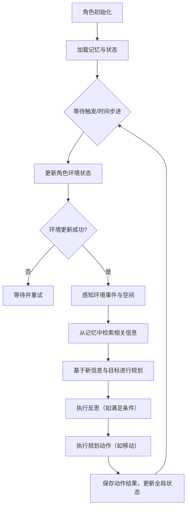

## 类结构

```
Role (MetaGPT基础角色类)
└── STRole (斯坦福小镇智能体角色)
    └── STRoleContext (角色运行时上下文)
```

## 全局变量及字段


### `STRoleContext.env`
    
角色所处的斯坦福小镇模拟环境实例，用于感知和交互。

类型：`StanfordTownEnv`
    


### `STRoleContext.memory`
    
角色的关联记忆系统，用于存储和检索事件、想法和聊天记录。

类型：`AgentMemory`
    


### `STRoleContext.scratch`
    
角色的临时工作区，存储当前状态、计划路径、活动事件等运行时信息。

类型：`Scratch`
    


### `STRoleContext.spatial_memory`
    
角色的空间记忆树，用于存储和索引环境中的位置和区域信息。

类型：`MemoryTree`
    


### `STRole.name`
    
角色的名称，用于标识和区分不同的模拟角色。

类型：`str`
    


### `STRole.profile`
    
角色的配置文件或类型标识，默认为'STMember'。

类型：`str`
    


### `STRole.rc`
    
角色的运行时上下文，包含环境、记忆、临时状态等核心组件。

类型：`STRoleContext`
    


### `STRole.sim_code`
    
当前模拟会话的唯一标识码，用于区分不同的模拟运行。

类型：`str`
    


### `STRole.step`
    
角色在模拟中已执行的步数计数器，用于跟踪进度。

类型：`int`
    


### `STRole.start_time`
    
模拟开始的日期时间，用于计算模拟内的相对时间。

类型：`Optional[datetime]`
    


### `STRole.curr_time`
    
模拟内的当前日期时间，随步数递增，驱动角色决策和事件。

类型：`Optional[datetime]`
    


### `STRole.sec_per_step`
    
模拟中每一步代表的真实秒数，用于控制时间流逝速度。

类型：`int`
    


### `STRole.game_obj_cleanup`
    
用于清理游戏对象事件的字典，键为事件，值为坐标，确保环境状态正确。

类型：`dict`
    


### `STRole.inner_voice`
    
标志位，表示当前步骤是否由内部声音（用户需求）触发，影响行为逻辑。

类型：`bool`
    


### `STRole.has_inner_voice`
    
标志位，表示该角色是否具备处理内部声音（用户需求）的能力。

类型：`bool`
    


### `STRole.role_storage_path`
    
角色数据（记忆、状态）在文件系统中的存储路径，用于持久化。

类型：`Optional[Path]`
    
    

## 全局函数及方法

### `STRole.check_curr_time`

`check_curr_time` 是 `STRole` 类的一个类方法，用作 `curr_time` 字段的验证器。它负责将传入的字符串格式的日期时间转换为 `datetime` 对象，确保 `curr_time` 字段在实例化或更新时具有正确的数据类型。

参数：

- `cls`：`type[STRole]`，指向 `STRole` 类本身的引用。
- `curr_time`：`str`，需要被验证和转换的日期时间字符串，预期格式为 `"%B %d, %Y, %H:%M:%S"`（例如 `"July 20, 2023, 14:30:00"`）。

返回值：`datetime`，转换后的 `datetime` 对象。

#### 流程图

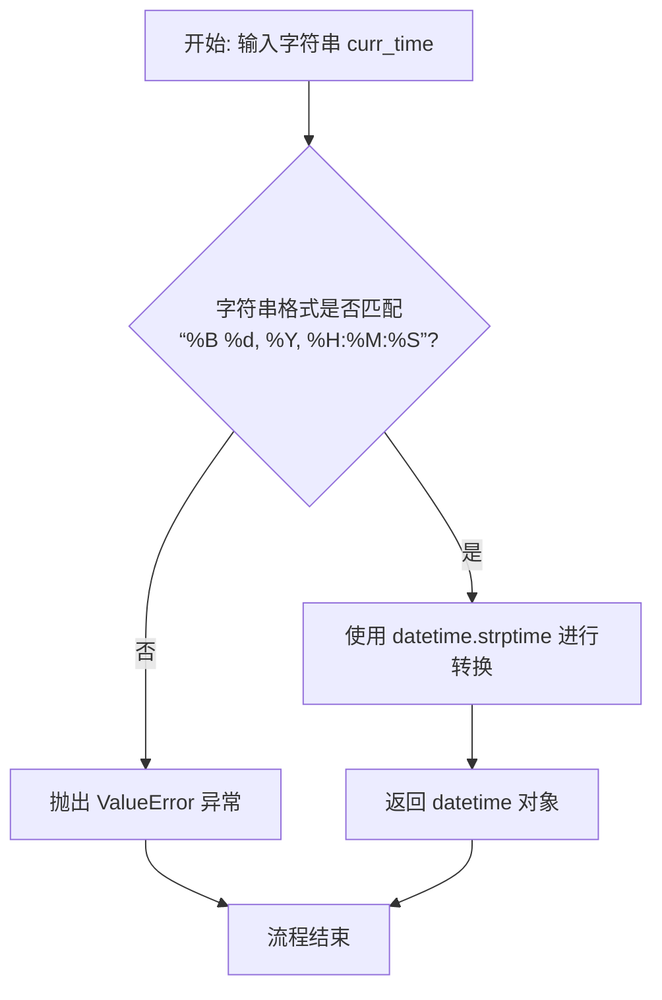

#### 带注释源码

```python
    @field_validator("curr_time", mode="before")
    @classmethod
    def check_curr_time(cls, curr_time: str) -> datetime:
        # 使用 datetime.strptime 方法，根据预定义的格式 "%B %d, %Y, %H:%M:%S"
        # 将输入的字符串 curr_time 解析并转换为 datetime 对象。
        # 如果字符串格式不匹配，此方法将抛出 ValueError 异常。
        return datetime.strptime(curr_time, "%B %d, %Y, %H:%M:%S")
```

### `STRole.check_start_time`

`check_start_time` 是一个类方法，用于将字符串格式的起始时间转换为 `datetime` 对象。它作为 `STRole` 类中 `start_time` 字段的验证器，确保传入的字符串符合特定的日期时间格式，并正确解析为 `datetime` 对象。

参数：

- `cls`：`type`，当前类对象，用于类方法的上下文。
- `start_time`：`str`，表示起始时间的字符串，格式为 `"%B %d, %Y"`（例如："January 01, 2023"）。

返回值：`datetime`，解析后的 `datetime` 对象，时间部分固定为 "00:00:00"。

#### 流程图

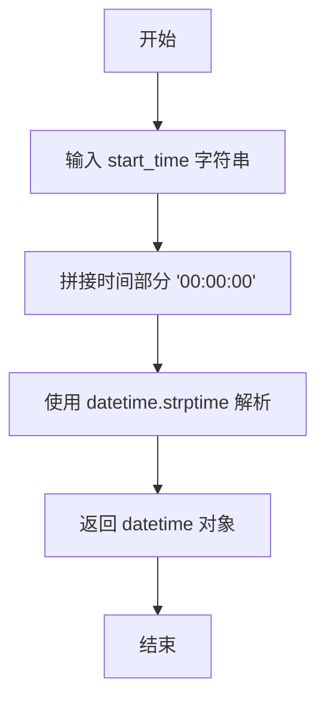

#### 带注释源码

```python
@field_validator("start_time", mode="before")
@classmethod
def check_start_time(cls, start_time: str) -> datetime:
    # 将传入的日期字符串与固定的时间部分拼接
    # 例如：将 "January 01, 2023" 转换为 "January 01, 2023, 00:00:00"
    full_datetime_str = f"{start_time}, 00:00:00"
    
    # 使用 datetime.strptime 方法将拼接后的字符串解析为 datetime 对象
    # 格式字符串 "%B %d, %Y, %H:%M:%S" 对应 "Month Day, Year, Hour:Minute:Second"
    # 例如："January 01, 2023, 00:00:00" 解析为 datetime(2023, 1, 1, 0, 0, 0)
    return datetime.strptime(full_datetime_str, "%B %d, %Y, %H:%M:%S")
```

### `STRole.validate_st_role_after`

该方法在`STRole`模型验证后执行，用于初始化角色的存储路径、加载角色记忆数据，并根据角色是否具有“内心独白”能力来设置其关注的动作列表。

参数：
- `self`：`STRole`，当前`STRole`实例

返回值：`None`，无返回值

#### 流程图

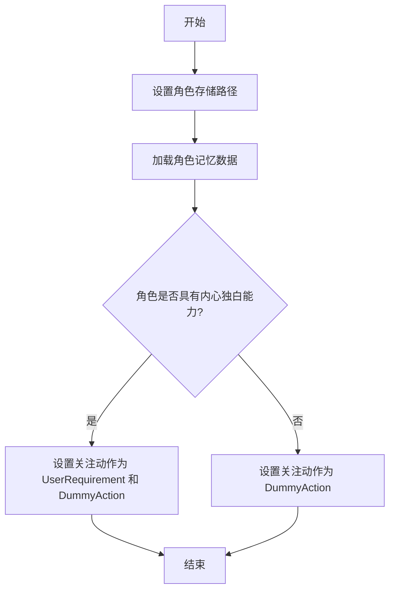

#### 带注释源码

```python
    @model_validator(mode="after")
    def validate_st_role_after(self):
        # 设置角色的存储路径，基于模拟代码和角色名称
        self.role_storage_path = STORAGE_PATH.joinpath(f"{self.sim_code}/personas/{self.name}")

        # 从存储路径加载角色的记忆数据（包括关联记忆、空间记忆和临时状态）
        self.load_from()  # load role's memory

        # 初始化角色的动作列表为空
        self.set_actions([])

        # 根据角色是否具有“内心独白”能力，设置其关注（watch）的动作类型
        if self.has_inner_voice:
            # TODO add communication action
            # 如果具有内心独白，则关注用户需求（UserRequirement）和虚拟动作（DummyAction）
            self._watch([UserRequirement, DummyAction])
        else:
            # 如果不具有内心独白，则只关注虚拟动作（DummyAction）
            self._watch([DummyAction])
```

### `STRole.init_curr_tile`

该方法用于初始化角色在环境中的当前位置。它首先从外部存储中获取角色的环境信息（包括坐标），然后将该坐标设置为角色的当前瓦片位置。接着，它向环境发送一个动作，将角色当前的事件和描述添加到该瓦片上，从而在环境中标记角色的初始位置和状态。

参数：

-  `self`：`STRole`，当前角色实例

返回值：`None`，无返回值

#### 流程图

```mermaid
flowchart TD
    A[开始] --> B[获取角色环境信息]
    B --> C[提取坐标 (pt_x, pt_y)]
    C --> D[设置角色当前瓦片位置]
    D --> E[向环境发送添加瓦片事件动作]
    E --> F[结束]
```

#### 带注释源码

```python
async def init_curr_tile(self):
    # init role
    # 从外部存储获取角色的环境信息，包括坐标
    role_env: dict = get_role_environment(self.sim_code, self.name, self.step)
    pt_x = role_env["x"]
    pt_y = role_env["y"]
    # 将获取的坐标设置为角色的当前瓦片位置
    self.rc.scratch.curr_tile = (pt_x, pt_y)

    # 向环境发送一个动作，将角色当前的事件和描述添加到该坐标的瓦片上
    self.rc.env.step(
        EnvAction(
            action_type=EnvActionType.ADD_TILE_EVENT,
            coord=(pt_x, pt_y),
            event=self.scratch.get_curr_event_and_desc(),
        )
    )
```

### `STRole.scratch`

`scratch` 是 `STRole` 类的一个属性（property），它提供了对角色内部状态对象 `self.rc.scratch` 的便捷访问。`Scratch` 类存储了角色在模拟世界中的实时状态信息，如当前位置、当前时间、当前活动、计划路径等。通过这个属性，可以方便地获取和操作角色的当前状态。

参数：
- 无

返回值：`Scratch`，返回角色当前的状态对象，包含位置、时间、活动等实时信息。

#### 流程图

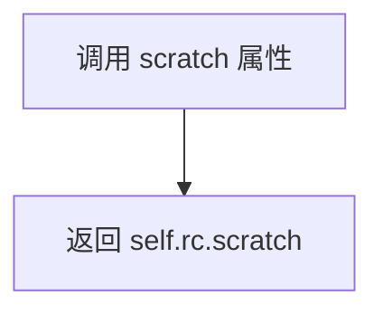

#### 带注释源码

```python
    @property
    def scratch(self):
        # 返回角色上下文（rc）中的 scratch 对象
        # scratch 对象存储了角色的实时状态，如当前位置、当前时间、当前活动等
        return self.rc.scratch
```

### `STRole.role_tile`

这是一个只读属性，用于获取角色当前在环境网格（Maze）中所处的坐标位置。

参数：
- 无

返回值：`tuple`，返回一个包含两个整数的元组 `(x, y)`，表示角色当前所在的网格坐标。

#### 流程图

```mermaid
flowchart TD
    A[调用 role_tile 属性] --> B[访问 self.scratch.curr_tile]
    B --> C[返回坐标元组 (x, y)]
```

#### 带注释源码

```python
@property
def role_tile(self):
    # 该属性是 self.scratch.curr_tile 的快捷访问器。
    # self.scratch 是 Scratch 类的实例，用于存储角色的临时状态和运行时数据。
    # curr_tile 字段记录了角色在当前模拟步骤中所处的网格坐标。
    return self.scratch.curr_tile
```

### `STRole.a_mem`

`a_mem` 是 `STRole` 类的一个属性（property），它提供了对角色关联记忆（Associative Memory）的便捷访问。该属性直接返回 `STRole` 实例的 `rc`（角色上下文）中存储的 `memory` 对象，即 `AgentMemory` 类的实例。这允许角色在感知、规划、反思和执行等过程中，方便地读取和操作其长期记忆。

参数：
- 无显式参数。这是一个属性访问器，通过 `self` 隐式访问当前实例。

返回值：`AgentMemory`，返回当前角色实例的关联记忆对象，用于存储和检索事件、想法、聊天记录等记忆。

#### 流程图

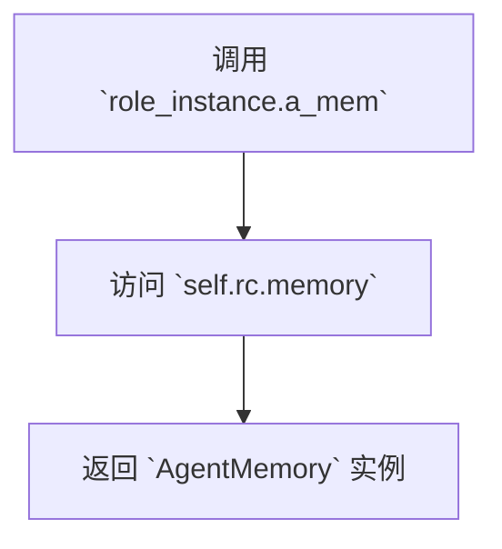

#### 带注释源码

```python
    @property
    def a_mem(self):
        """
        属性访问器，用于获取角色的关联记忆（Associative Memory）。
        此属性提供了对 `self.rc.memory`（一个 `AgentMemory` 实例）的便捷访问。
        关联记忆负责存储角色的事件、想法、聊天记录等长期记忆。
        """
        return self.rc.memory
```

### `STRole.s_mem`

`s_mem` 是 `STRole` 类的一个属性，用于获取角色（Agent）的空间记忆（Spatial Memory）。空间记忆以树状结构（`MemoryTree`）存储，记录了角色在环境中感知到的空间信息，如地图瓦片（tile）的布局和属性。该属性提供了对角色空间记忆的便捷访问，是角色进行路径规划、环境感知等行为的基础。

参数：无

返回值：`MemoryTree`，角色的空间记忆实例，用于存储和管理角色在环境中的空间信息。

#### 流程图

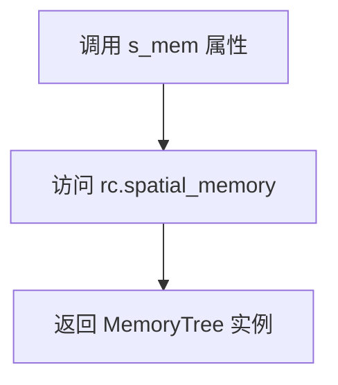

#### 带注释源码

```python
@property
def s_mem(self):
    """
    获取角色的空间记忆（Spatial Memory）。
    空间记忆以 MemoryTree 形式存储，记录了角色在环境中感知到的空间信息，
    如地图瓦片的布局和属性。该属性提供了对空间记忆的便捷访问。
    
    返回：
        MemoryTree: 角色的空间记忆实例。
    """
    return self.rc.spatial_memory
```

### `STRole.memory`

`STRole.memory` 是一个属性方法，用于获取角色（STRole）的关联记忆（AgentMemory）实例。它通过访问 `self.rc.memory` 来返回角色的记忆对象，该对象负责存储和管理角色的所有记忆数据，包括事件、想法和聊天记录等。

参数：无

返回值：`AgentMemory`，返回角色当前的关联记忆实例，用于后续的记忆操作，如添加、检索和保存记忆。

#### 流程图

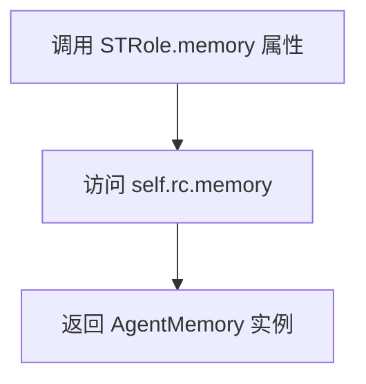

#### 带注释源码

```python
@property
def memory(self):
    """
    获取角色的关联记忆（AgentMemory）实例。
    这是一个属性方法，通过访问 `self.rc.memory` 返回角色的记忆对象。
    该记忆对象负责存储和管理角色的所有记忆数据，包括事件、想法和聊天记录等。

    Returns:
        AgentMemory: 角色当前的关联记忆实例。
    """
    return self.rc.memory
```

### `STRole.load_from`

该方法用于从存储路径加载角色的记忆数据，包括关联记忆、空间记忆和角色状态（Scratch）。它不接收外部参数，直接使用类内部属性 `role_storage_path` 来确定加载路径。

参数：无

返回值：`None`，无返回值

#### 流程图

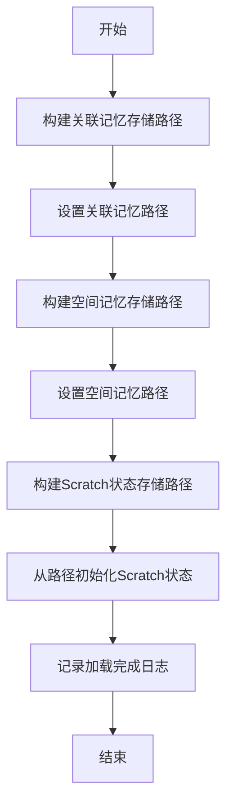

#### 带注释源码

```python
def load_from(self):
    """
    load role data from `storage/{simulation_name}/personas/{role_name}`
    """
    # 1. 构建关联记忆（AgentMemory）的存储路径
    memory_saved = self.role_storage_path.joinpath("bootstrap_memory/associative_memory")
    # 2. 调用内存对象的 set_mem_path 方法设置其数据源路径
    self.rc.memory.set_mem_path(memory_saved)

    # 3. 构建空间记忆（MemoryTree）的存储路径
    sp_mem_saved = self.role_storage_path.joinpath("bootstrap_memory/spatial_memory.json")
    # 4. 调用空间内存对象的 set_mem_path 方法设置其数据源路径
    self.rc.spatial_memory.set_mem_path(f_saved=sp_mem_saved)

    # 5. 构建角色状态（Scratch）的存储路径
    scratch_f_saved = self.role_storage_path.joinpath("bootstrap_memory/scratch.json")
    # 6. 调用 Scratch 类的静态方法，从指定路径加载数据并初始化一个新的 Scratch 实例，替换掉原有的
    self.rc.scratch = Scratch.init_scratch_from_path(f_saved=scratch_f_saved)

    # 7. 记录加载完成的日志信息
    logger.info(f"Role: {self.name} loaded role's memory from {str(self.role_storage_path)}")
```

### `STRole.save_into`

该方法用于将角色的数据（包括记忆、空间记忆和临时状态）保存到指定的存储路径中。

参数：
- 无显式参数，但依赖于实例属性 `self.role_storage_path` 和 `self.rc` 中的相关组件。

返回值：`None`，无返回值。

#### 流程图

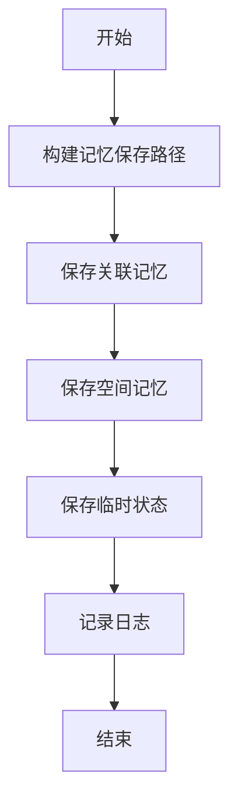

#### 带注释源码

```python
def save_into(self):
    """
    保存角色数据到 `storage/{simulation_name}/personas/{role_name}`
    """
    # 构建关联记忆的保存路径
    memory_saved = self.role_storage_path.joinpath("bootstrap_memory/associative_memory")
    # 调用关联记忆对象的 save 方法进行保存
    self.rc.memory.save(memory_saved)

    # 构建空间记忆的保存路径
    sp_mem_saved = self.role_storage_path.joinpath("bootstrap_memory/spatial_memory.json")
    # 调用空间记忆对象的 save 方法进行保存
    self.rc.spatial_memory.save(sp_mem_saved)

    # 构建临时状态（Scratch）的保存路径
    scratch_f_saved = self.role_storage_path.joinpath("bootstrap_memory/scratch.json")
    # 调用临时状态对象的 save 方法进行保存
    self.rc.scratch.save(scratch_f_saved)

    # 记录保存操作的日志
    logger.info(f"Role: {self.name} saved role's memory into {str(self.role_storage_path)}")
```

### `STRole._observe`

该方法用于观察角色环境中的新消息，并根据消息类型触发内部思考（inner voice）的生成和记忆存储。它首先检查是否存在环境对象，然后从消息缓冲区中获取新消息，过滤出角色关注的消息，并处理特定的用户需求消息以生成内部思考。

参数：

-  `self`：`STRole`，当前角色实例

返回值：`int`，返回1表示成功执行，以触发角色的`_react`方法

#### 流程图

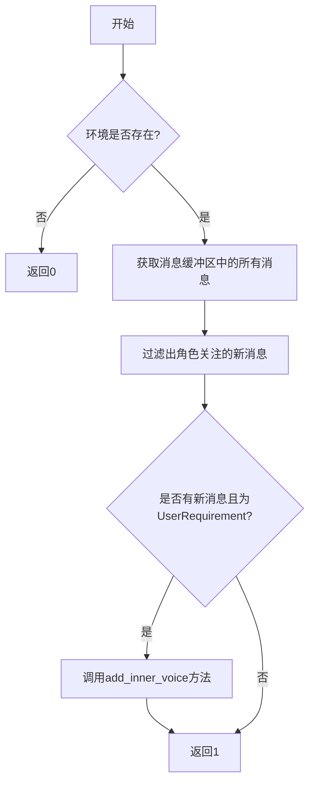

#### 带注释源码

```python
async def _observe(self) -> int:
    # 检查是否存在环境对象，如果不存在则返回0
    if not self.rc.env:
        return 0
    news = []
    # 从消息缓冲区中获取所有新消息
    if not news:
        news = self.rc.msg_buffer.pop_all()
    # 获取旧消息，如果启用了记忆功能
    old_messages = [] if not self.enable_memory else self.rc.memory.get()
    # 过滤出角色关注的新消息，即消息的发送者或接收者包含角色名，且不在旧消息中
    self.rc.news = [
        n for n in news if (n.cause_by in self.rc.watch or self.name in n.send_to) and n not in old_messages
    ]

    # 如果新消息中有一条且为UserRequirement类型，则触发内部思考
    if len(self.rc.news) == 1 and self.rc.news[0].cause_by == any_to_str(UserRequirement):
        logger.warning(f"Role: {self.name} add inner voice: {self.rc.news[0].content}")
        await self.add_inner_voice(self.rc.news[0].content)

    # 返回1以触发角色的`_react`方法
    return 1
```

### `STRole.add_inner_voice`

该方法用于为角色添加一个“内心独白”（inner voice）。它接收一个外部传入的“低语”（whisper）字符串，通过`AgentWhisperThoughtAction`生成一个内部思考（thought），然后将这个思考作为一个事件（event）存储到角色的关联记忆中。这个过程会创建事件的三元组（主语、谓语、宾语），计算其重要性（poignancy），并生成嵌入向量，最终将完整的思考记录添加到记忆系统中。

参数：
- `whisper`：`str`，外部传入的提示或信息，用于触发角色的内部思考。

返回值：`None`，该方法没有返回值。

#### 流程图

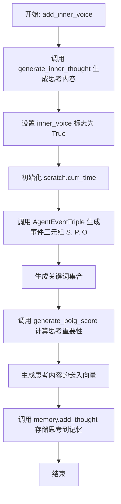

#### 带注释源码

```python
async def add_inner_voice(self, whisper: str):
    # 定义一个内部异步函数，用于生成基于whisper的思考内容
    async def generate_inner_thought(whisper: str):
        # 实例化 AgentWhisperThoughtAction 动作
        run_whisper_thought = AgentWhisperThoughtAction()
        # 执行该动作，传入当前角色实例和whisper，生成内部思考
        inner_thought = await run_whisper_thought.run(self, whisper)
        return inner_thought

    # 调用内部函数，生成思考内容
    thought = await generate_inner_thought(whisper)

    # 设置标志，表示角色正在处理内心独白
    self.inner_voice = True
    # 将当前角色的时间同步到 scratch（临时状态）中
    self.rc.scratch.curr_time = self.curr_time

    # 确定记忆的创建时间和过期时间
    created = self.rc.scratch.curr_time if self.rc.scratch.curr_time else datetime.now()
    expiration = created + timedelta(days=30)
    # 实例化 AgentEventTriple 动作，用于从思考中提取事件三元组
    run_event_triple = AgentEventTriple()
    # 执行动作，提取主语(S)、谓语(P)、宾语(O)
    s, p, o = await run_event_triple.run(thought, self)
    # 基于三元组创建关键词集合
    keywords = set([s, p, o])
    # 计算此“事件”类型思考的重要性分数
    thought_poignancy = await generate_poig_score(self, "event", whisper)
    # 生成思考内容的嵌入向量对（文本，向量）
    thought_embedding_pair = (thought, get_embedding(thought))
    # 调用记忆系统的 add_thought 方法，将完整的思考记录存储到关联记忆中
    self.rc.memory.add_thought(
        created, expiration, s, p, o, thought, keywords, thought_poignancy, thought_embedding_pair, None
    )
```

### `STRole.observe`

该方法用于感知角色周围环境中的事件和空间信息，并将其存储到角色的记忆中。它首先获取角色视野范围内的附近瓦片，并更新空间记忆。然后，它感知同一区域内的所有事件，根据距离和注意力带宽筛选出最相关的事件。对于每个新事件，它会计算事件的嵌入向量和重要性分数，并将其添加到角色的联想记忆中。最后，返回一个包含所有新感知到的事件的`BasicMemory`实例列表。

参数：

- `self`：`STRole`，当前角色实例

返回值：`list[BasicMemory]`，包含所有新感知到的事件的`BasicMemory`实例列表

#### 流程图

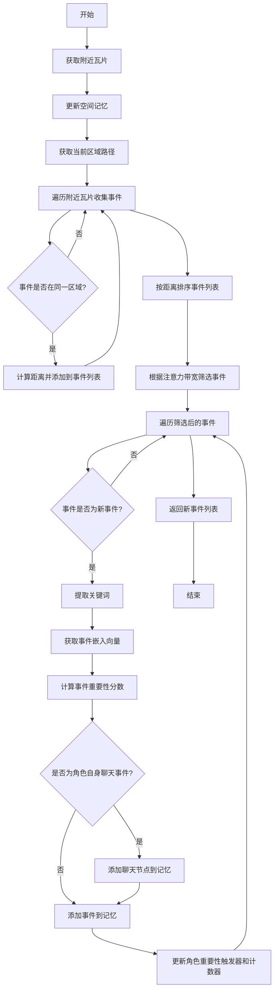

#### 带注释源码

```python
async def observe(self) -> list[BasicMemory]:
    # TODO observe info from maze_env
    """
    Perceive events around the role and saves it to the memory, both events
    and spaces.

    We first perceive the events nearby the role, as determined by its
    <vision_r>. If there are a lot of events happening within that radius, we
    take the <att_bandwidth> of the closest events. Finally, we check whether
    any of them are new, as determined by <retention>. If they are new, then we
    save those and return the <BasicMemory> instances for those events.

    OUTPUT:
        ret_events: a list of <BasicMemory> that are perceived and new.
    """
    # PERCEIVE SPACE
    # We get the nearby tiles given our current tile and the persona's vision
    # radius.
    nearby_tiles = self.rc.env.observe(
        EnvObsParams(
            obs_type=EnvObsType.TILE_NBR, coord=self.rc.scratch.curr_tile, vision_radius=self.rc.scratch.vision_r
        )
    )

    # We then store the perceived space. Note that the s_mem of the persona is
    # in the form of a tree constructed using dictionaries.
    for tile in nearby_tiles:
        tile_info = self.rc.env.observe(EnvObsParams(obs_type=EnvObsType.GET_TITLE, coord=tile))
        self.rc.spatial_memory.add_tile_info(tile_info)

    # PERCEIVE EVENTS.
    # We will perceive events that take place in the same arena as the
    # persona's current arena.

    curr_arena_path = self.rc.env.observe(
        EnvObsParams(obs_type=EnvObsType.TILE_PATH, coord=self.rc.scratch.curr_tile, level="arena")
    )

    # We do not perceive the same event twice (this can happen if an object is
    # extended across multiple tiles).
    percept_events_set = set()
    # We will order our percept based on the distance, with the closest ones
    # getting priorities.
    percept_events_list = []
    # First, we put all events that are occurring in the nearby tiles into the
    # percept_events_list
    for tile in nearby_tiles:
        tile_details = self.rc.env.observe(EnvObsParams(obs_type=EnvObsType.GET_TITLE, coord=tile))
        if tile_details["events"]:
            tmp_arena_path = self.rc.env.observe(
                EnvObsParams(obs_type=EnvObsType.TILE_PATH, coord=tile, level="arena")
            )

            if tmp_arena_path == curr_arena_path:
                # This calculates the distance between the persona's current tile,
                # and the target tile.
                dist = math.dist([tile[0], tile[1]], [self.rc.scratch.curr_tile[0], self.rc.scratch.curr_tile[1]])
                # Add any relevant events to our temp set/list with the distant info.
                for event in tile_details["events"]:
                    if event not in percept_events_set:
                        percept_events_list += [[dist, event]]
                        percept_events_set.add(event)

    # We sort, and perceive only self.rc.scratch.att_bandwidth of the closest
    # events. If the bandwidth is larger, then it means the persona can perceive
    # more elements within a small area.
    percept_events_list = sorted(percept_events_list, key=itemgetter(0))
    perceived_events = []
    for dist, event in percept_events_list[: self.rc.scratch.att_bandwidth]:
        perceived_events += [event]

    # Storing events.
    # <ret_events> is a list of <BasicMemory> instances from the persona's
    # associative memory.
    ret_events = []
    for p_event in perceived_events:
        s, p, o, desc = p_event
        if not p:
            # If the object is not present, then we default the event to "idle".
            p = "is"
            o = "idle"
            desc = "idle"
        desc = f"{s.split(':')[-1]} is {desc}"
        p_event = (s, p, o)

        # We retrieve the latest self.rc.scratch.retention events. If there is
        # something new that is happening (that is, p_event not in latest_events),
        # then we add that event to the a_mem and return it.
        latest_events = self.rc.memory.get_summarized_latest_events(self.rc.scratch.retention)
        if p_event not in latest_events:
            # We start by managing keywords.
            keywords = set()
            sub = p_event[0]
            obj = p_event[2]
            if ":" in p_event[0]:
                sub = p_event[0].split(":")[-1]
            if ":" in p_event[2]:
                obj = p_event[2].split(":")[-1]
            keywords.update([sub, obj])

            # Get event embedding
            desc_embedding_in = desc
            if "(" in desc:
                desc_embedding_in = desc_embedding_in.split("(")[1].split(")")[0].strip()
            if desc_embedding_in in self.rc.memory.embeddings:
                event_embedding = self.rc.memory.embeddings[desc_embedding_in]
            else:
                event_embedding = get_embedding(desc_embedding_in)
            event_embedding_pair = (desc_embedding_in, event_embedding)

            # Get event poignancy.
            event_poignancy = await generate_poig_score(self, "event", desc_embedding_in)
            logger.debug(f"Role {self.name} event_poignancy: {event_poignancy}")

            # If we observe the persona's self chat, we include that in the memory
            # of the persona here.
            chat_node_ids = []
            if p_event[0] == f"{self.name}" and p_event[1] == "chat with":
                curr_event = self.rc.scratch.act_event
                if self.rc.scratch.act_description in self.rc.memory.embeddings:
                    chat_embedding = self.rc.memory.embeddings[self.rc.scratch.act_description]
                else:
                    chat_embedding = get_embedding(self.rc.scratch.act_description)
                chat_embedding_pair = (self.rc.scratch.act_description, chat_embedding)
                chat_poignancy = await generate_poig_score(self, "chat", self.rc.scratch.act_description)
                chat_node = self.rc.memory.add_chat(
                    self.rc.scratch.curr_time,
                    None,
                    curr_event[0],
                    curr_event[1],
                    curr_event[2],
                    self.rc.scratch.act_description,
                    keywords,
                    chat_poignancy,
                    chat_embedding_pair,
                    self.rc.scratch.chat,
                )
                chat_node_ids = [chat_node.memory_id]

            # Finally, we add the current event to the agent's memory.
            ret_events += [
                self.rc.memory.add_event(
                    self.rc.scratch.curr_time,
                    None,
                    s,
                    p,
                    o,
                    desc,
                    keywords,
                    event_poignancy,
                    event_embedding_pair,
                    chat_node_ids,
                )
            ]
            self.rc.scratch.importance_trigger_curr -= event_poignancy
            self.rc.scratch.importance_ele_n += 1

    return ret_events
```

### `STRole.retrieve`

该方法用于从智能体的记忆中检索与当前观察到的事件相关的过往事件和想法。它接收一个观察到的事件列表，针对每个事件，从关联记忆中检索出相关的事件和想法，并将结果组织成一个字典返回。

参数：
- `observed`：`list`，一个包含`BasicMemory`实例的列表，代表智能体在当前时间步观察到的事件。

返回值：`dict`，一个字典，其键是观察到的事件的描述，值是一个嵌套字典，包含`curr_event`（当前事件）、`events`（相关事件列表）和`thoughts`（相关想法列表）。

#### 流程图

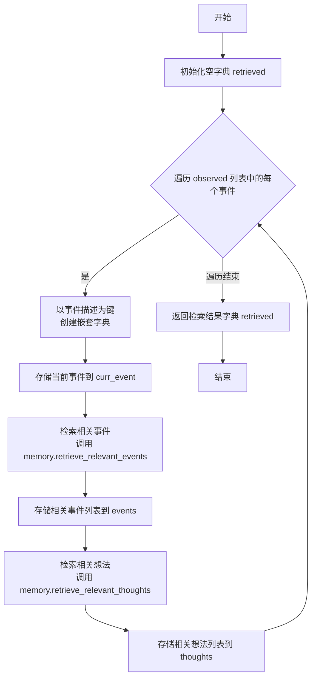

#### 带注释源码

```python
def retrieve(self, observed: list) -> dict:
    # TODO retrieve memories from agent_memory
    # 初始化一个空字典，用于存储检索结果
    retrieved = dict()
    # 遍历观察到的每一个事件
    for event in observed:
        # 以当前事件的描述作为键，创建一个新的嵌套字典
        retrieved[event.description] = dict()
        # 将当前事件本身存储到 'curr_event' 键下
        retrieved[event.description]["curr_event"] = event

        # 从关联记忆中检索与当前事件（主语、谓语、宾语）相关的事件
        relevant_events = self.rc.memory.retrieve_relevant_events(event.subject, event.predicate, event.object)
        # 将相关事件列表存储到 'events' 键下
        retrieved[event.description]["events"] = list(relevant_events)

        # 从关联记忆中检索与当前事件（主语、谓语、宾语）相关的想法
        relevant_thoughts = self.rc.memory.retrieve_relevant_thoughts(event.subject, event.predicate, event.object)
        # 将相关想法列表存储到 'thoughts' 键下
        retrieved[event.description]["thoughts"] = list(relevant_thoughts)

    # 返回包含所有检索结果的字典
    return retrieved
```

### `STRole.reflect`

该方法用于执行角色的高级反思过程。当满足反思条件时，角色会基于其记忆（包括事件和想法）进行深度思考，生成新的见解，并将这些见解作为新的记忆条目重新存入记忆库中，以促进角色的学习和行为演化。

参数：
- `self`：`STRole`，当前角色实例的引用。

返回值：`None`，该方法不返回任何值，但会更新角色的内部记忆状态。

#### 流程图

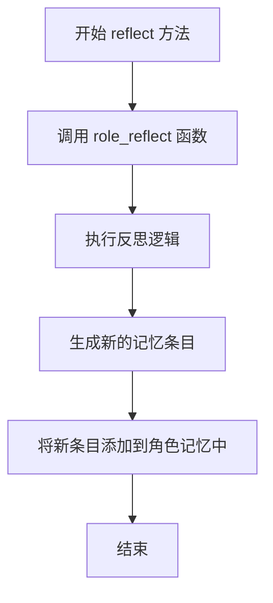

#### 带注释源码

```python
async def reflect(self):
    # TODO reflection if meet reflect condition
    await role_reflect(self)  # 调用外部的反思函数，执行具体的反思逻辑
    # TODO re-add result to memory
    # 已封装到Reflect函数之中  # 注释说明：反思结果的重新添加已集成在 role_reflect 函数内部完成
```

### `STRole.execute`

该方法负责执行角色在斯坦福小镇环境中的具体行动计划。它根据传入的计划字符串（表示目标位置或交互对象），计算路径并移动到目标位置，最终返回执行结果（包括下一个目标坐标、发音描述和动作描述）。

参数：

- `plan`：`str`，表示需要执行的动作地址，格式为“{世界}:{区域}:{场景}:{游戏对象}”，例如“dolores double studio:double studio:bedroom 1:bed”。特殊标记如“<persona>”表示角色间交互，“<waiting>”表示等待，“<random>”表示随机位置。

返回值：`tuple`，包含三个元素：
  - `ret`：`tuple`，表示下一个目标坐标（x, y）。
  - `self.rc.scratch.act_pronunciatio`：`str`，动作的发音描述。
  - `description`：`str`，动作的详细描述。

#### 流程图

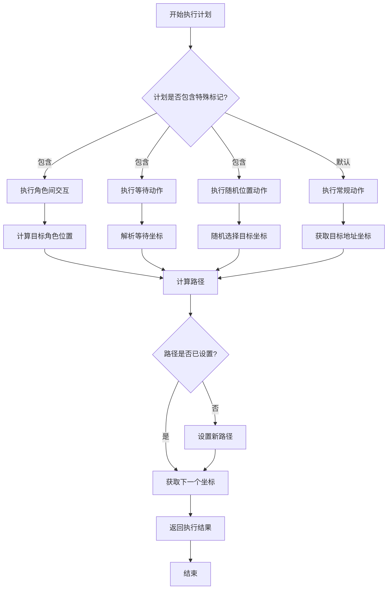

#### 带注释源码

```python
async def execute(self, plan: str):
    """
    Args:
        plan: This is a string address of the action we need to execute.
        It comes in the form of "{world}:{sector}:{arena}:{game_objects}".
        It is important that you access this without doing negative
        indexing (e.g., [-1]) because the latter address elements may not be
        present in some cases.
        e.g., "dolores double studio:double studio:bedroom 1:bed"
    """
    roles = self.rc.env.get_roles()
    if "<random>" in plan and self.rc.scratch.planned_path == []:
        self.rc.scratch.act_path_set = False

    # <act_path_set> is set to True if the path is set for the current action.
    # It is False otherwise, and means we need to construct a new path.
    if not self.rc.scratch.act_path_set:
        # <target_tiles> is a list of tile coordinates where the persona may go
        # to execute the current action. The goal is to pick one of them.
        target_tiles = None
        logger.info(f"Role {self.name} plan: {plan}")

        if "<persona>" in plan:
            # Executing persona-persona interaction.
            target_p_tile = roles[plan.split("<persona>")[-1].strip()].scratch.curr_tile
            collision_maze = self.rc.env.observe()["collision_maze"]
            potential_path = path_finder(
                collision_maze, self.rc.scratch.curr_tile, target_p_tile, collision_block_id
            )
            if len(potential_path) <= 2:
                target_tiles = [potential_path[0]]
            else:
                collision_maze = self.rc.env.observe()["collision_maze"]
                potential_1 = path_finder(
                    collision_maze,
                    self.rc.scratch.curr_tile,
                    potential_path[int(len(potential_path) / 2)],
                    collision_block_id,
                )

                potential_2 = path_finder(
                    collision_maze,
                    self.rc.scratch.curr_tile,
                    potential_path[int(len(potential_path) / 2) + 1],
                    collision_block_id,
                )
                if len(potential_1) <= len(potential_2):
                    target_tiles = [potential_path[int(len(potential_path) / 2)]]
                else:
                    target_tiles = [potential_path[int(len(potential_path) / 2 + 1)]]

        elif "<waiting>" in plan:
            # Executing interaction where the persona has decided to wait before
            # executing their action.
            x = int(plan.split()[1])
            y = int(plan.split()[2])
            target_tiles = [[x, y]]

        elif "<random>" in plan:
            # Executing a random location action.
            plan = ":".join(plan.split(":")[:-1])

            address_tiles = self.rc.env.observe()["address_tiles"]
            target_tiles = address_tiles[plan]
            target_tiles = random.sample(list(target_tiles), 1)

        else:
            # This is our default execution. We simply take the persona to the
            # location where the current action is taking place.
            # Retrieve the target addresses. Again, plan is an action address in its
            # string form. <maze.address_tiles> takes this and returns candidate
            # coordinates.
            address_tiles = self.rc.env.observe()["address_tiles"]
            if plan not in address_tiles:
                address_tiles["Johnson Park:park:park garden"]  # ERRORRRRRRR
            else:
                target_tiles = address_tiles[plan]

        # There are sometimes more than one tile returned from this (e.g., a tabe
        # may stretch many coordinates). So, we sample a few here. And from that
        # random sample, we will take the closest ones.
        if len(target_tiles) < 4:
            target_tiles = random.sample(list(target_tiles), len(target_tiles))
        else:
            target_tiles = random.sample(list(target_tiles), 4)
        # If possible, we want personas to occupy different tiles when they are
        # headed to the same location on the maze. It is ok if they end up on the
        # same time, but we try to lower that probability.
        # We take care of that overlap here.
        persona_name_set = set(roles.keys())
        new_target_tiles = []
        for i in target_tiles:
            access_tile = self.rc.env.observe(EnvObsParams(obs_type=EnvObsType.GET_TITLE, coord=i))
            curr_event_set = access_tile["events"]
            pass_curr_tile = False
            for j in curr_event_set:
                if j[0] in persona_name_set:
                    pass_curr_tile = True
            if not pass_curr_tile:
                new_target_tiles += [i]
        if len(new_target_tiles) == 0:
            new_target_tiles = target_tiles
        target_tiles = new_target_tiles

        # Now that we've identified the target tile, we find the shortest path to
        # one of the target tiles.
        curr_tile = self.rc.scratch.curr_tile
        closest_target_tile = None
        path = None
        for i in target_tiles:
            # path_finder takes a collision_mze and the curr_tile coordinate as
            # an input, and returns a list of coordinate tuples that becomes the
            # path.
            # e.g., [(0, 1), (1, 1), (1, 2), (1, 3), (1, 4)...]
            collision_maze = self.rc.env.observe()["collision_maze"]
            curr_path = path_finder(collision_maze, curr_tile, i, collision_block_id)
            if not closest_target_tile:
                closest_target_tile = i
                path = curr_path
            elif len(curr_path) < len(path):
                closest_target_tile = i
                path = curr_path

        # Actually setting the <planned_path> and <act_path_set>. We cut the
        # first element in the planned_path because it includes the curr_tile.
        self.rc.scratch.planned_path = path[1:]
        self.rc.scratch.act_path_set = True

    # Setting up the next immediate step. We stay at our curr_tile if there is
    # no <planned_path> left, but otherwise, we go to the next tile in the path.
    ret = self.rc.scratch.curr_tile
    if self.rc.scratch.planned_path:
        ret = self.rc.scratch.planned_path[0]
        self.rc.scratch.planned_path = self.rc.scratch.planned_path[1:]

    description = f"{self.rc.scratch.act_description}"
    description += f" @ {self.rc.scratch.act_address}"

    execution = ret, self.rc.scratch.act_pronunciatio, description
    return execution
```

### `STRole.update_role_env`

该方法用于更新角色在环境中的状态，包括清理旧的事件、更新角色位置、处理游戏对象清理逻辑，并返回更新是否成功的布尔值。

参数：

- `self`：`STRole`，当前角色实例

返回值：`bool`，表示角色环境更新是否成功。`True` 表示成功更新，`False` 表示更新失败（例如环境数据不存在）。

#### 流程图

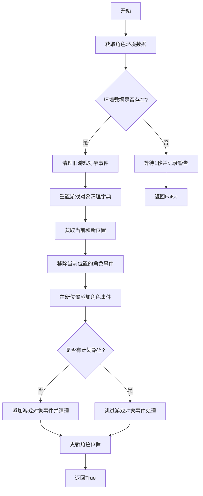

#### 带注释源码

```python
async def update_role_env(self) -> bool:
    # 获取当前步骤的角色环境数据（如位置坐标）
    role_env = get_role_environment(self.sim_code, self.name, self.step)
    ret = True
    if role_env:
        # 清理之前标记的游戏对象事件，将其状态设置为空闲
        for key, val in self.game_obj_cleanup.items():
            self.rc.env.step(EnvAction(action_type=EnvActionType.TURN_TILE_EVENT_IDLE, coord=val, event=key))

        # 重置游戏对象清理字典，准备记录新的清理任务
        self.game_obj_cleanup = dict()
        # 获取当前角色位置和新位置
        curr_tile = self.role_tile
        new_tile = (role_env["x"], role_env["y"])
        # 从当前格子移除该角色的事件
        self.rc.env.step(
            EnvAction(action_type=EnvActionType.RM_TITLE_SUB_EVENT, coord=curr_tile, subject=self.name)
        )
        # 在新格子添加角色当前事件和描述
        self.rc.env.step(
            EnvAction(
                action_type=EnvActionType.ADD_TILE_EVENT,
                coord=new_tile,
                event=self.scratch.get_curr_event_and_desc(),
            )
        )

        # 如果角色没有计划路径（即已到达目的地），则激活游戏对象事件
        if not self.scratch.planned_path:
            # 记录需要清理的游戏对象事件及其位置
            self.game_obj_cleanup[self.scratch.get_curr_event_and_desc()] = new_tile
            # 添加游戏对象事件到新位置
            self.rc.env.step(
                EnvAction(
                    action_type=EnvActionType.ADD_TILE_EVENT,
                    coord=new_tile,
                    event=self.scratch.get_curr_event_and_desc(),
                )
            )
            # 移除新位置上的空白事件（占位符）
            blank = (self.scratch.get_curr_obj_event_and_desc()[0], None, None, None)
            self.rc.env.step(EnvAction(action_type=EnvActionType.RM_TILE_EVENT, coord=new_tile, event=blank))

        # 更新角色的当前位置为新位置
        self.rc.scratch.curr_tile = new_tile
    else:
        # 如果环境数据不存在，更新失败，等待1秒并记录警告
        ret = False
        time.sleep(1)
        logger.warning(
            f"{self.sim_code}/environment/{self.step}.json not exist or parses failed, " f"sleep 1s and re-check"
        )
    # 返回更新结果
    return ret
```

### `STRole._react`

`STRole._react` 方法是 `STRole` 角色的核心反应循环，它在一个模拟时间步长内执行感知、检索、规划、反思和执行等一系列操作，以驱动角色在斯坦福小镇环境中的行为。该方法首先更新角色在环境中的状态，然后感知周围事件，检索相关记忆，制定行动计划，进行高级反思，最后执行移动或交互动作，并保存结果。

参数：

- `self`：`STRole` 类型，表示当前角色实例。

返回值：`Message` 类型，返回一个 `DummyMessage` 实例，表示该步骤的完成。

#### 流程图

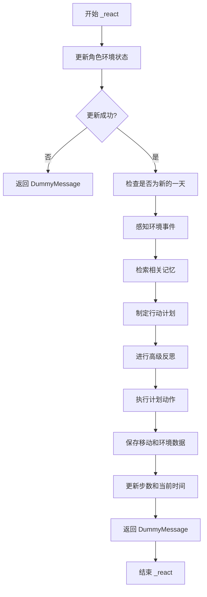

#### 带注释源码

```python
async def _react(self) -> Message:
    # 更新角色在环境中的状态（位置、事件等）
    ret = await self.update_role_env()
    if not ret:
        # 如果更新失败，记录日志并返回一个空的 DummyMessage
        logger.info(f"Role: {self.name} update_role_env return False")
        return DummyMessage()

    # 检查当前时间步是否代表新的一天开始
    new_day = False
    if not self.scratch.curr_time or self.inner_voice:
        new_day = "First day"
    elif self.scratch.curr_time.strftime("%A %B %d") != self.curr_time.strftime("%A %B %d"):
        new_day = "New day"
    logger.info(f"Role: {self.name} new_day: {new_day}")
    # 将角色的当前时间设置为模拟的当前时间
    self.rc.scratch.curr_time = self.curr_time

    # 1. 感知：从环境中观察并获取周围的事件信息
    observed = await self.observe()

    # 2. 检索：从角色的记忆中检索与观察到的事件相关的历史记忆
    retrieved = self.retrieve(observed)

    # 3. 规划：基于当前状态、新的一天标志、检索到的记忆以及其他角色信息，制定行动计划
    plans = await plan(self, self.rc.env.get_roles(), new_day, retrieved)

    # 4. 反思：进行高级思考，可能生成新的见解并存入记忆
    await self.reflect()

    # 5. 执行：执行规划好的动作，获取下一个目标位置、动作发音和描述
    next_tile, pronunciatio, description = await self.execute(plans)
    # 构建移动数据字典
    role_move = {
        "movement": next_tile,
        "pronunciatio": pronunciatio,
        "description": description,
        "chat": self.scratch.chat,
    }
    # 保存角色的移动数据到存储
    save_movement(self.name, role_move, step=self.step, sim_code=self.sim_code, curr_time=self.curr_time)

    # 模拟步进：更新步数计数器，保存新的环境状态，并推进模拟时间
    logger.info(f"Role: {self.name} run at {self.step} step on {self.curr_time} at tile: {self.scratch.curr_tile}")
    self.step += 1
    save_environment(self.name, self.step, self.sim_code, next_tile)
    self.curr_time += timedelta(seconds=self.sec_per_step)
    # 重置内部语音标志
    self.inner_voice = False

    # 短暂暂停以模拟实时步进
    time.sleep(0.5)
    # 返回一个 DummyMessage 表示此反应步骤完成
    return DummyMessage()
```

## 关键组件


### 感知模块 (Perception Module)

负责从环境中获取信息，包括角色周围的事件和空间信息，并将其存储到角色的记忆系统中。

### 记忆系统 (Memory System)

包含关联记忆 (`AgentMemory`) 和空间记忆 (`MemoryTree`)，用于存储、检索和管理角色经历的事件、想法和空间位置信息。

### 规划模块 (Planning Module)

基于当前观察、记忆检索结果和日期状态，为角色生成长期和短期的行动计划。

### 反思模块 (Reflection Module)

在特定条件下触发，对记忆中的事件进行高级别思考，生成新的见解并重新存入记忆。

### 执行模块 (Execution Module)

根据规划模块生成的计划，计算路径并执行移动或交互动作，与环境进行交互。

### 环境交互接口 (Environment Interaction Interface)

通过 `StanfordTownEnv` 对象与迷宫环境进行交互，包括感知环境状态、执行动作（如添加/移除事件、移动角色）等。

### 内部语音系统 (Inner Voice System)

允许外部（如用户）向角色注入“内心独白”或想法，这些想法会像普通事件一样被处理并存入记忆，影响角色的后续行为。

### 角色状态管理 (Role State Management)

管理角色的核心状态，包括当前位置 (`curr_tile`)、当前时间 (`curr_time`)、计划路径 (`planned_path`) 以及行动描述 (`act_description`) 等，这些状态驱动着感知、规划、执行循环。

### 数据持久化 (Data Persistence)

负责将角色的记忆（关联记忆、空间记忆、临时状态 `Scratch`）保存到文件系统，并在初始化时从文件系统加载，确保模拟的连续性和可恢复性。


## 问题及建议


### 已知问题

-   **硬编码错误处理**：在 `execute` 方法中，当 `plan` 不在 `address_tiles` 字典中时，代码使用了硬编码的键 `"Johnson Park:park:park garden"` 来触发错误。这是一种不规范的错误处理方式，会掩盖真实的错误原因，并可能导致程序行为不可预测。
-   **同步阻塞调用**：在 `update_role_env` 方法中，当环境文件不存在时，代码使用了 `time.sleep(1)` 进行同步阻塞等待。这会阻塞整个异步事件循环，影响系统并发性能和响应能力。
-   **缺乏输入验证**：`execute` 方法接收一个字符串类型的 `plan` 参数，但代码中对该参数的格式和有效性缺乏充分的验证。例如，对 `<persona>`、`<waiting>`、`<random>` 等特殊标记的解析逻辑可能因输入格式错误而失败。
-   **潜在的竞态条件**：`update_role_env` 方法在更新环境状态（如移除和添加事件）时，没有考虑其他角色或系统组件可能同时修改同一环境状态的情况，在并发场景下可能导致数据不一致。
-   **魔法字符串与硬编码**：代码中多处使用了魔法字符串（如 `"is"`、`"idle"`、`"chat with"`）和硬编码的数字（如 `att_bandwidth` 的切片索引 `[: self.rc.scratch.att_bandwidth]` 中的 `4`），降低了代码的可读性和可维护性。
-   **异常处理不完善**：多个异步方法（如 `observe`, `reflect`, `execute`）缺乏对内部可能抛出的异常（如网络请求失败、内存访问错误）的捕获和处理，可能导致角色运行意外中断。
-   **资源泄漏风险**：代码中打开了外部文件（通过 `get_role_environment`）和可能持有网络连接（通过 `get_embedding`），但没有显式的资源清理逻辑（如使用 `with` 语句或 `try-finally` 块）。

### 优化建议

-   **改进错误处理**：将 `execute` 方法中的硬编码错误触发替换为明确的异常抛出，例如 `raise ValueError(f"Plan address '{plan}' not found in environment.")`。同时，在更高层级（如 `_react` 方法）添加异常捕获和日志记录，确保角色状态可恢复或优雅降级。
-   **使用异步等待替代同步阻塞**：将 `update_role_env` 方法中的 `time.sleep(1)` 替换为异步等待，例如 `asyncio.sleep(1)`，以避免阻塞事件循环。更好的做法是实现一个带指数退避的重试机制。
-   **增强输入验证与解析**：为 `execute` 方法的 `plan` 参数定义清晰的结构化格式（如使用正则表达式或 Pydantic 模型），并在方法入口处进行验证。可以创建一个专门的 `PlanParser` 类来封装解析逻辑。
-   **引入状态操作的事务性或锁机制**：在 `update_role_env` 和 `execute` 等修改共享环境状态的方法中，考虑引入锁机制（如 `asyncio.Lock`）或利用环境（`StanfordTownEnv`）本身提供的原子操作接口，以确保状态变更的原子性。
-   **使用常量或枚举替代魔法值**：将字符串常量（如事件类型、动作标记）和配置数字（如路径采样数 `4`）提取为模块级常量或枚举类，集中管理，方便查找和修改。
-   **补充异常处理逻辑**：在关键的业务方法（特别是涉及 I/O 和外部调用的方法）周围添加 `try-except` 块，记录详细的错误上下文，并根据错误类型决定是重试、跳过当前步骤还是触发角色失效流程。
-   **确保资源妥善管理**：检查 `get_role_environment`、`get_embedding` 等函数的实现，确保它们在使用后正确关闭了文件句柄或网络会话。如果它们是外部依赖，应在调用方使用 `try-finally` 或 `async with` 来保证清理。
-   **性能优化**：在 `observe` 方法中，对每个感知到的事件都计算嵌入向量和显著性分数，这可能成为性能瓶颈。可以考虑缓存已计算过的描述文本的嵌入结果（代码中已有部分缓存逻辑 `self.rc.memory.embeddings`，可评估其覆盖范围），或对显著性计算进行批量处理。
-   **代码结构优化**：`_react` 方法承担了过多的协调职责（更新环境、感知、检索、规划、反思、执行、保存）。可以考虑引入一个更清晰的“角色生命周期”状态机，或将不同步骤（如 `感知-规划-执行` 循环）拆分为更细粒度的、可测试的组件方法。
-   **增强日志与可观测性**：当前日志主要用于信息记录。可以增加更细粒度的调试日志（如进入/退出关键函数、关键决策点的变量值），并考虑集成 Metrics 来监控角色的健康状况、循环延迟、内存使用等指标。


## 其它


### 设计目标与约束

本模块旨在实现斯坦福小镇模拟中智能体（角色）的核心行为循环。其核心设计目标是构建一个能够自主感知环境、检索记忆、制定计划、进行反思并执行动作的类人智能体。主要约束包括：1) 必须与预定义的`StanfordTownEnv`环境交互，遵循其动作与观察接口；2) 必须与`AgentMemory`、`Scratch`、`MemoryTree`等记忆组件协同工作，维持角色的长期状态；3) 行为逻辑需模拟人类日常活动的节奏与决策过程，如按时间步推进、处理突发事件、进行高级反思等；4) 性能上需支持多个角色同时运行，确保单步反应时间可控。

### 错误处理与异常设计

代码中错误处理较为分散，主要采用防御性编程和日志记录。例如，在`execute`方法中访问`address_tiles`字典时，若键不存在会触发KeyError，但代码中仅有一处注释了`# ERRORRRRRRR`，未进行实际处理。在`update_role_env`方法中，当获取角色环境失败时，会返回`False`并睡眠1秒，由调用者`_react`处理并记录日志。整体缺乏统一的异常捕获、分类和恢复机制。对于文件I/O（如`load_from`/`save_into`）、网络请求（如嵌入向量生成）等潜在故障点，未显式处理异常。建议引入更结构化的异常类（如`EnvironmentError`、`MemoryError`）并在关键路径进行捕获与恢复尝试。

### 数据流与状态机

角色的核心数据流遵循“感知-检索-计划-反思-执行”的固定循环，由`_react`方法驱动。状态主要存储在三个核心组件中：1) `Scratch`：存储临时状态，如当前时间(`curr_time`)、位置(`curr_tile`)、当前动作描述、计划路径等，随每一步更新。2) `AgentMemory`：存储长期关联记忆（事件、想法、对话），通过`add_event`、`add_thought`等方法写入，通过`retrieve_relevant_events/thoughts`方法读取。3) `MemoryTree`：存储空间记忆。环境数据流：通过`env.observe`获取环境信息，通过`env.step`提交动作（如移动、添加事件）来影响环境。角色自身状态（如位置、步骤数）通过`save_environment`和`save_movement`函数持久化到外部存储。整体构成一个以`_react`为循环体、以记忆组件为状态存储、以环境为输入/输出接口的确定性数据流系统。

### 外部依赖与接口契约

1.  **环境接口 (`StanfordTownEnv`)**: 依赖其`observe`方法（需`EnvObsParams`参数）获取环境观察信息，依赖其`step`方法（需`EnvAction`参数）执行动作改变环境。契约要求环境能提供坐标事件、邻近区块、寻路碰撞矩阵等信息。
2.  **记忆组件接口**:
    *   `AgentMemory`: 契约包括`add_event`, `add_thought`, `add_chat`, `retrieve_relevant_events`, `retrieve_relevant_thoughts`, `get_summarized_latest_events`, `set_mem_path`, `save`等方法。
    *   `Scratch`: 作为数据容器，需提供`curr_tile`, `curr_time`, `act_description`等字段及`get_curr_event_and_desc`等方法。
    *   `MemoryTree`: 需提供`add_tile_info`, `set_mem_path`, `save`方法。
3.  **工具函数**: 依赖`get_embedding`（生成文本向量）、`path_finder`（寻路）、`generate_poig_score`（生成事件显著性分数）、`role_reflect`（反思）、`plan`（规划）等外部函数，这些函数定义了输入输出格式的隐式契约。
4.  **持久化存储**: 依赖`STORAGE_PATH`定义的目录结构，通过`get_role_environment`、`save_environment`、`save_movement`等函数读写文件系统，约定特定的JSON文件格式和路径命名规则。
5.  **框架依赖**: 继承自`Role`基类，依赖MetaGPT框架的`RoleContext`、`Message`、`logger`等机制。

### 并发与同步考虑

当前设计为每个`STRole`实例独立运行其`_react`循环，通过`time.sleep(0.5)`控制节奏，本质上是顺序执行。然而，在多角色模拟中，角色通过共享的`StanfordTownEnv`环境进行交互（例如，一个角色在某个坐标添加事件，另一个角色能感知到）。代码中并未显式处理对共享环境状态（如`address_tiles`、`collision_maze`）的并发访问。`env.step`方法可能不是原子操作。在`execute`方法中，多个角色可能同时计算路径并试图移动到同一坐标，仅通过检查当前事件集进行简单避让，存在竞争条件风险。若模拟器向异步并发架构演进，需要引入锁、事务或事件队列等机制来保证环境状态变更的原子性和一致性。

### 配置与初始化

角色通过`validate_st_role_after`验证器进行初始化，关键步骤包括：1) 根据`sim_code`和`name`构建存储路径(`role_storage_path`)。2) 调用`load_from`从文件系统加载记忆和初始状态。3) 根据`has_inner_voice`标志位设置观察的动作类型(`_watch`)。配置参数通过Pydantic字段定义，如`sim_code`（模拟标识）、`start_time`/`curr_time`（模拟时间）、`sec_per_step`（每步秒数）、`inner_voice`（内部语音触发标志）。初始化强依赖于外部存储中存在的引导文件（bootstrap memory），缺少这些文件将导致角色无法正常启动。配置的灵活性较高，但初始化过程与文件系统紧密耦合，错误处理不足。

### 测试策略建议

1.  **单元测试**: 针对`observe`、`retrieve`、`execute`等方法，模拟`env`和`memory`的返回，验证逻辑正确性。重点测试路径查找、事件感知过滤、记忆检索逻辑。
2.  **集成测试**: 实例化完整的`STRole`与`StanfordTownEnv`，运行多步`_react`循环，验证角色能正确感知、计划、移动并与环境交互。检查记忆是否被正确添加和检索。
3.  **契约测试**: 针对`env.observe/step`、记忆组件方法等外部接口，验证输入输出格式符合预期，确保接口变更能被及时发现。
4.  **场景测试**: 构造特定场景，如角色相遇、内部语音触发、跨天计划生成，验证端到端行为符合设计。
5.  **持久化测试**: 测试`load_from`和`save_into`，验证角色状态能正确保存和恢复。
6.  **性能测试**: 针对多角色同时运行场景，评估单步耗时和内存占用，确保可扩展性。

    