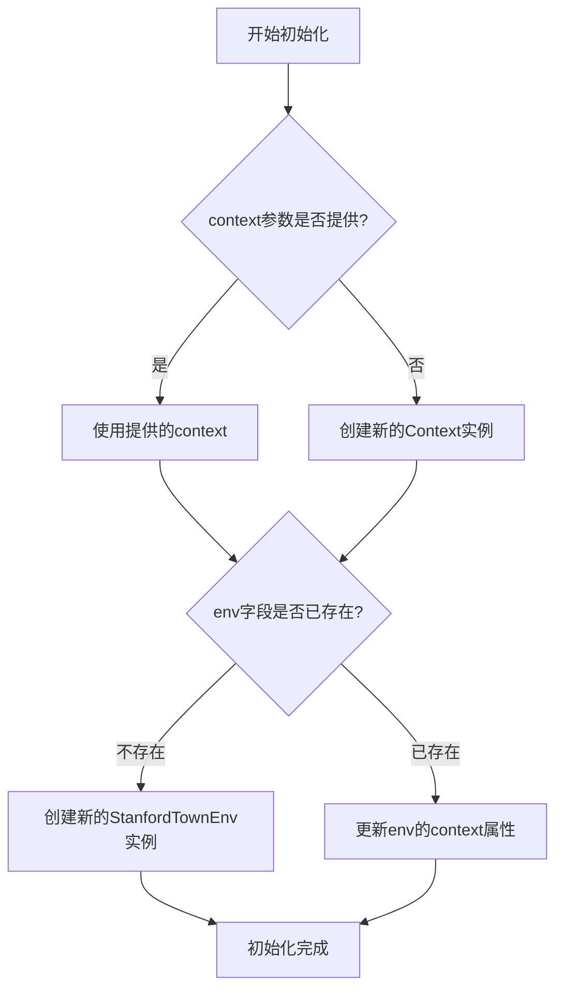
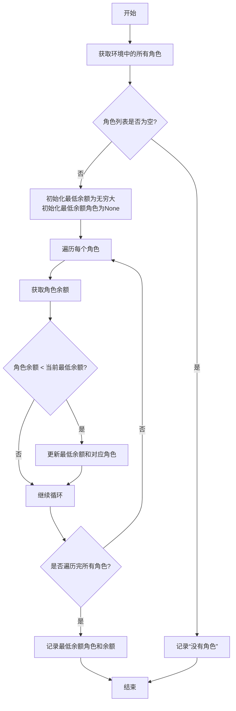

# `.\MetaGPT\metagpt\ext\stanford_town\stanford_town.py` 详细设计文档

该代码是StanfordTown项目的核心入口，它继承自Team类，用于模拟一个类似软件公司的虚拟小镇环境。其主要功能是初始化一个包含特定环境（StanfordTownEnv）和角色（STRole）的团队，通过多轮次（n_round）的异步运行来驱动角色在迷宫环境中进行交互和活动，并在运行结束后保存所有角色的状态和历史记录。

## 整体流程

```mermaid
graph TD
    A[开始: 初始化StanfordTown] --> B{环境env是否存在?}
    B -- 否 --> C[创建新的StanfordTownEnv环境]
    B -- 是 --> D[更新现有env的上下文]
    D --> E[调用hire方法雇佣角色]
    E --> F[为每个角色初始化当前位置]
    F --> G[进入运行循环: while n_round > 0]
    G --> H[检查团队资金余额]
    H --> I[异步执行环境的一轮运行: env.run()]
    I --> J[n_round -= 1]
    J --> K{n_round > 0?}
    K -- 是 --> G
    K -- 否 --> L[循环结束，保存所有角色状态]
    L --> M[返回环境历史记录]
```

## 类结构

```
Team (父类)
└── StanfordTown (主类)
    ├── 依赖: StanfordTownEnv (环境类)
    ├── 依赖: STRole (角色基类)
    └── 依赖: Context (上下文类)
```

## 全局变量及字段


### `MAZE_ASSET_PATH`
    
存储迷宫资源文件路径的全局常量，用于初始化StanfordTownEnv环境

类型：`str`
    


### `logger`
    
全局日志记录器实例，用于记录StanfordTown运行过程中的调试、警告等信息

类型：`logging.Logger`
    


### `StanfordTown.env`
    
StanfordTown团队运行的环境实例，管理角色交互和空间状态

类型：`Optional[StanfordTownEnv]`
    
    

## 全局函数及方法

### `StanfordTown.__init__`

该方法用于初始化StanfordTown实例，设置环境上下文并确保环境对象正确配置。

参数：

- `context`：`Context`，可选的上下文对象，用于初始化环境。如果未提供，则创建新的Context实例。
- `**data`：`Any`，其他关键字参数，用于传递给父类的初始化方法。

返回值：`None`，无返回值。

#### 流程图



#### 带注释源码

```python
def __init__(self, context: Context = None, **data: Any):
    # 调用父类Team的初始化方法，传递额外的关键字参数
    super(Team, self).__init__(**data)
    
    # 如果context参数未提供，则创建一个新的Context实例
    ctx = context or Context()
    
    # 检查当前实例的env字段是否已存在
    if not self.env:
        # 如果env不存在，创建一个新的StanfordTownEnv实例
        # 使用提供的context和预定义的迷宫资源路径
        self.env = StanfordTownEnv(context=ctx, maze_asset_path=MAZE_ASSET_PATH)
    else:
        # 如果env已存在（例如通过反序列化分配），则更新其context属性
        self.env.context = ctx
```


### `StanfordTown.hire`

该方法用于向StanfordTown团队中雇佣（添加）多个角色，并在雇佣完成后初始化每个角色的当前位置。

参数：

- `roles`：`list[STRole]`，要雇佣的角色列表，每个角色都是`STRole`类的实例。

返回值：`None`，该方法没有返回值。

#### 流程图

```mermaid
flowchart TD
    A[开始: hire(roles)] --> B[记录雇佣角色数量]
    B --> C[调用父类Team的hire方法]
    C --> D{遍历角色列表roles}
    D --> E[初始化角色当前位置]
    E --> D
    D --> F[结束]
```

#### 带注释源码

```python
async def hire(self, roles: list[STRole]):
    # 记录日志，提示开始雇佣指定数量的角色
    logger.warning(f"The Town add {len(roles)} roles, and start to operate.")
    # 调用父类Team的hire方法，执行基础的雇佣逻辑（如将角色添加到团队列表等）
    super().hire(roles)
    # 遍历传入的每一个角色
    for role in roles:
        # 异步初始化每个角色的当前位置（例如，在迷宫环境中的起始瓦片）
        await role.init_curr_tile()
```


### `StanfordTown.run`

该方法运行StanfordTown模拟，执行指定轮次（n_round）的模拟循环。在每一轮中，它会检查团队的余额，然后运行环境以推进模拟。所有轮次完成后，它会保存所有角色的状态并返回环境的历史记录。

参数：

-  `n_round`：`int`，指定要运行的模拟轮次数，默认值为3。

返回值：`Any`（根据代码推断为`self.env.history`的类型），返回环境的历史记录，其中包含了模拟过程中发生的事件和状态变化。

#### 流程图

```mermaid
flowchart TD
    A[开始运行 run(n_round)] --> B{n_round > 0?};
    B -- 是 --> C[n_round -= 1];
    C --> D[记录当前轮次];
    D --> E[检查团队余额];
    E --> F[运行环境 env.run];
    F --> B;
    B -- 否 --> G[保存所有角色状态];
    G --> H[返回环境历史记录];
    H --> I[结束];
```

#### 带注释源码

```
async def run(self, n_round: int = 3):
    """运行公司直到目标轮次或没有资金"""
    while n_round > 0:  # 当还有剩余轮次时继续循环
        n_round -= 1    # 减少剩余轮次计数
        logger.debug(f"{n_round=}")  # 记录当前轮次（调试级别）
        self._check_balance()  # 检查团队余额，确保有足够资金继续运行
        await self.env.run()   # 运行环境，推进模拟一步

    # 所有轮次完成后，保存模拟结果，包括环境和角色状态
    roles = self.env.get_roles()  # 从环境中获取所有角色
    for profile, role in roles.items():  # 遍历每个角色
        role.save_into()  # 保存角色状态到存储

    return self.env.history  # 返回环境的历史记录
```


### `StanfordTown._check_balance`

该方法用于检查团队中所有角色的“余额”属性，并记录下余额最低的角色及其余额值。它是一个内部辅助方法，旨在为团队运行流程提供状态监控。

参数：
-  `self`：`StanfordTown`，当前StanfordTown实例的引用。

返回值：`None`，此方法不返回任何值。

#### 流程图



#### 带注释源码

```python
    def _check_balance(self):
        """
        检查所有角色的余额，并记录最低余额的角色。
        这是一个内部方法，用于监控团队状态。
        """
        # 从环境中获取所有角色，返回一个字典，键为角色profile，值为角色对象
        roles = self.env.get_roles()
        # 检查是否有角色存在
        if not roles:
            # 如果没有角色，记录一条警告日志
            logger.warning("No roles in the environment.")
            return
        # 初始化最低余额为一个非常大的数，确保第一个角色的余额一定会比它小
        min_balance = float('inf')
        # 初始化持有最低余额的角色为None
        min_role = None
        # 遍历所有角色
        for profile, role in roles.items():
            # 获取当前角色的余额属性
            balance = role.attrs.get("balance", 0)
            # 如果当前角色的余额小于当前记录的最低余额
            if balance < min_balance:
                # 更新最低余额为当前角色的余额
                min_balance = balance
                # 更新持有最低余额的角色为当前角色
                min_role = profile
        # 循环结束后，记录日志，显示余额最低的角色及其余额
        logger.info(f"Role with minimum balance: {min_role}, balance: {min_balance}")
```


## 关键组件


### StanfordTownEnv

StanfordTownEnv是StanfordTown项目的核心环境组件，它模拟了一个虚拟小镇的环境，负责管理角色（Agent）的交互空间（如迷宫地图）、处理角色间的通信以及驱动整个模拟的运行循环。

### STRole

STRole是StanfordTown项目中定义角色（Agent）的基类，它封装了角色的基本属性（如姓名、记忆、目标等）和行为逻辑（如移动、决策、与其他角色交互），是构成小镇模拟世界的基本单位。

### 张量索引与惰性加载

通过`MAZE_ASSET_PATH`常量指向的迷宫资产路径，系统可能实现了对大型环境数据（如迷宫地图）的惰性加载机制，仅在需要时从磁盘加载，以优化内存使用和启动速度。

### 反量化支持

代码中未直接体现显式的反量化逻辑。该功能可能内嵌在环境或角色的状态管理、决策制定或记忆存储过程中，用于将压缩或编码后的数据（如量化后的角色状态）还原为可用的高精度格式。

### 量化策略

代码中未直接体现显式的量化策略。该策略可能应用于角色状态、环境信息或历史记录的存储与传输过程中，通过降低数据精度来减少内存占用和网络负载，同时保持模拟的核心逻辑。


## 问题及建议


### 已知问题

-   **初始化逻辑不一致**：`__init__` 方法中调用了 `super(Team, self).__init__(**data)`，这绕过了 `StanfordTown` 的直接父类 `Team` 的初始化逻辑，可能导致 `Team` 类中定义的字段或初始化步骤未被正确执行，从而引发潜在的运行时错误或状态不一致。
-   **环境对象状态管理不清晰**：在 `__init__` 方法中，如果 `self.env` 已存在（例如在反序列化场景下），代码会直接修改 `self.env.context`。这种隐式的状态更新方式不够明确，可能使环境对象的完整状态管理（如其他字段的同步更新）变得复杂且容易出错。
-   **循环条件可能提前终止**：`run` 方法使用 `while n_round > 0:` 循环，并在循环开始处执行 `n_round -= 1`。这意味着如果传入的 `n_round` 值为 0，循环将不会执行，但方法仍会尝试保存角色状态并返回历史记录。虽然这可能符合“运行0轮”的语义，但未对 `n_round` 的非正值进行明确检查或日志记录，可能使调用者困惑。
-   **异常处理缺失**：`run` 方法中的 `await self.env.run()` 以及 `hire` 方法中的 `await role.init_curr_tile()` 都是异步调用，但代码中没有包含任何异常处理（`try-except` 块）。如果这些异步操作抛出异常，整个 `run` 或 `hire` 流程将中断，可能导致状态不一致（例如，部分角色已初始化而部分未初始化）且错误信息未被妥善记录或处理。
-   **硬编码的资产路径依赖**：`MAZE_ASSET_PATH` 作为常量被导入并使用，这降低了代码的灵活性。如果资产文件的位置需要改变（例如，在不同部署环境中），必须修改常量定义或通过其他机制覆盖，而不是通过配置注入。

### 优化建议

-   **修正父类初始化调用**：将 `__init__` 方法中的 `super(Team, self).__init__(**data)` 改为 `super().__init__(context=context, **data)`，以确保 `Team` 类的初始化逻辑被正确执行，并传递可能的 `context` 参数。
-   **明确环境对象的创建与重置逻辑**：考虑将环境对象的创建和状态重置逻辑分离。例如，可以提供一个 `reset_env` 方法来专门处理反序列化后环境状态的更新，使初始化流程更清晰。或者，在 `__init__` 中始终创建新的环境实例，并通过一个标志位控制是否从序列化状态加载。
-   **增强 `run` 方法的健壮性**：在 `run` 方法开始处，添加对 `n_round` 参数的检查。如果 `n_round <= 0`，可以记录一条警告日志并提前返回，避免执行无意义的循环和保存操作。同时，为异步操作添加基本的异常处理，至少记录错误并决定是继续执行、回滚还是向上传播异常。
-   **引入配置化管理**：将 `MAZE_ASSET_PATH` 这类路径配置从常量定义改为通过 `Context`、配置文件或环境变量注入。这样可以在不修改代码的情况下适应不同的部署环境。
-   **考虑添加运行状态检查**：在 `run` 方法的循环中，除了检查资金余额 (`_check_balance`)，还可以考虑添加其他运行状态检查（例如，所有角色是否就绪、环境是否有效），并在条件不满足时优雅地停止或等待。
-   **提高日志信息级别**：`hire` 方法中使用了 `logger.warning` 来记录角色添加信息。除非这是一个需要引起警告的异常情况，否则考虑改为 `logger.info` 级别，以符合其作为常规操作日志的语义。


## 其它


### 设计目标与约束

本模块旨在将StanfordTown项目集成到MetaGPT框架中，使其能够模拟一个类似软件公司的多智能体协作环境。核心设计目标包括：1) 复用并扩展MetaGPT的`Team`基类，以管理一组具有特定行为（`STRole`）的角色；2) 集成并管理一个专为StanfordTown设计的特殊环境（`StanfordTownEnv`），该环境提供了空间模拟（如迷宫）和角色交互的上下文；3) 实现一个简化的运行循环，控制模拟的轮次，并在结束时持久化角色状态。主要约束包括：需要与MetaGPT的上下文（`Context`）机制、角色基类以及团队运行模式保持兼容；同时需要处理StanfordTown特有的环境初始化和角色位置初始化逻辑。

### 错误处理与异常设计

当前代码中的错误处理较为基础，主要依赖于Python的默认异常传播机制和日志记录。在`__init__`方法中，通过条件判断来区分全新创建和反序列化后创建的场景，以避免环境对象的重复初始化，这是一种防御性编程，但并未显式处理可能的环境创建失败（如`MAZE_ASSET_PATH`无效）。`hire`和`run`方法使用了`async/await`，但未包含针对异步操作（如`role.init_curr_tile()`或`env.run()`）失败的`try-except`块。`run`方法中的`_check_balance()`方法（假设来自父类`Team`）可能抛出异常，但未被捕获。整体上，错误处理策略是“快速失败”（fail-fast），依赖调用方进行更上层的异常捕获和处理。日志记录（`logger.warning`, `logger.debug`）用于跟踪关键流程和调试信息。

### 数据流与状态机

系统的核心数据流围绕`StanfordTown`实例、其管理的`StanfordTownEnv`环境以及一组`STRole`角色展开。1) **初始化阶段**：数据从`Context`和`MAZE_ASSET_PATH`流入，用于构建`StanfordTownEnv`环境对象，并关联到`StanfordTown`实例。2) **角色雇佣阶段**：通过`hire`方法，外部的`STRole`列表被添加到团队中，随后触发每个角色的`init_curr_tile()`方法，完成角色在环境（迷宫）中的初始位置设置。3) **模拟运行阶段**：`run`方法控制一个简单的计数循环（`n_round`）。每轮循环中，先执行可能的团队内部检查（`_check_balance`），然后驱动环境执行一个时间步的模拟（`env.run()`），环境内部会协调所有角色的行动与交互，并更新环境状态和历史记录。4) **结果持久化阶段**：模拟结束后，从环境中获取所有角色，并调用每个角色的`save_into()`方法，将最终状态保存到外部存储（如文件或数据库）。环境的历史记录（`env.history`）作为最终结果返回。状态可以简化为：`初始化` -> `就绪（角色已雇佣）` -> `运行中（n_round > 0）` -> `结束（持久化并返回历史）`。

### 外部依赖与接口契约

1.  **父类与框架依赖**：强依赖于`metagpt.team.Team`基类，继承了其团队管理的基本能力（如`hire`的部分逻辑）。依赖于`metagpt.context.Context`用于提供运行时上下文。
2.  **环境依赖**：强依赖于`metagpt.environment.StanfordTownEnv`，该环境提供了StanfordTown特有的模拟逻辑和空间模型。通过`maze_asset_path`参数（`MAZE_ASSET_PATH`）依赖外部资源文件。
3.  **角色依赖**：强依赖于`metagpt.ext.stanford_town.roles.st_role.STRole`及其定义的接口，特别是`init_curr_tile()`和`save_into()`方法。这构成了与具体角色实现的核心契约。
4.  **工具与常量依赖**：依赖于`metagpt.ext.stanford_town.utils.const.MAZE_ASSET_PATH`常量定义资源路径。依赖于`metagpt.logs.logger`进行日志记录。
5.  **序列化/反序列化契约**：`__init__`方法中的逻辑（`if not self.env:`）暗示了该类需要支持通过反序列化（例如，从数据库或文件加载）进行实例化，此时`env`字段可能已存在，只需更新其上下文，而非重新创建。这构成了与持久化机制的一个隐式契约。

    