# `.\MetaGPT\metagpt\ext\stanford_town\utils\__init__.py` 详细设计文档

该代码实现了一个统一的模型加载框架，支持多种开源大语言模型（如Llama、GPT-2、Falcon、Qwen2、Gemma等）的加载、推理和量化。它通过抽象基类定义标准接口，具体模型类实现加载逻辑，并提供了命令行工具来执行模型推理任务。

## 整体流程

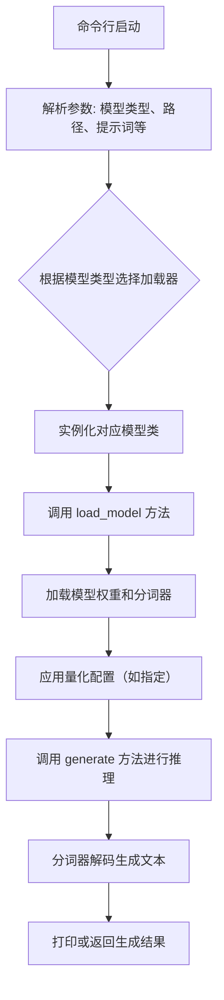

## 类结构

```
ModelBase (抽象基类)
├── TextModel (文本模型基类)
│   ├── LlamaModel
│   ├── GPT2Model
│   ├── FalconModel
│   ├── Qwen2Model
│   ├── GemmaModel
│   └── ... (其他具体模型类)
├── QuantizationConfig (量化配置类)
└── ModelLoader (模型加载器/工厂类)
```

## 全局变量及字段


### `SUPPORTED_MODELS`
    
一个列表，包含当前系统支持的所有模型名称。

类型：`List[str]`
    


### `DEFAULT_MODEL_PATH`
    
字符串，表示默认的模型文件存储或加载路径。

类型：`str`
    


### `logger`
    
日志记录器实例，用于记录系统运行时的日志信息。

类型：`logging.Logger`
    


### `ModelBase.model_name`
    
字符串，表示模型实例的名称标识。

类型：`str`
    


### `ModelBase.model_path`
    
字符串，表示模型文件在磁盘上的具体路径。

类型：`str`
    


### `ModelBase.device`
    
字符串，表示模型运行的计算设备，如'cpu'或'cuda'。

类型：`str`
    


### `TextModel.tokenizer`
    
预训练的分词器，用于将文本转换为模型可处理的token序列。

类型：`transformers.PreTrainedTokenizer`
    


### `TextModel.model`
    
预训练的语言模型核心，用于执行文本生成等任务。

类型：`transformers.PreTrainedModel`
    


### `TextModel.max_length`
    
整数，表示模型处理文本时的最大序列长度限制。

类型：`int`
    


### `QuantizationConfig.bits`
    
整数，表示量化过程中使用的比特位数，如8或4。

类型：`int`
    


### `QuantizationConfig.dtype`
    
PyTorch数据类型，指定量化后权重的数据类型。

类型：`torch.dtype`
    


### `QuantizationConfig.use_cuda`
    
布尔值，指示量化过程是否使用CUDA（GPU）加速。

类型：`bool`
    


### `ModelLoader.model_registry`
    
字典，作为模型注册表，映射模型名称到其对应的模型类。

类型：`Dict[str, Type[ModelBase]]`
    
    

## 全局函数及方法


### `parse_args`

该函数用于解析命令行参数，支持指定模型名称、任务类型、数据集路径、输出目录等配置选项，并返回解析后的参数对象。

参数：

-  `parser`：`argparse.ArgumentParser`，一个可选的参数解析器实例。如果未提供，函数会创建一个新的解析器。
-  `args`：`List[str]`，一个可选的参数字符串列表。如果未提供，默认使用 `sys.argv[1:]`。

返回值：`argparse.Namespace`，包含所有解析后的命令行参数及其值的命名空间对象。

#### 流程图

```mermaid
flowchart TD
    A[开始 parse_args] --> B{是否提供了 parser 参数?}
    B -- 是 --> C[使用提供的 parser]
    B -- 否 --> D[创建新的 ArgumentParser]
    C --> E[添加参数定义]
    D --> E
    E --> F{是否提供了 args 参数?}
    F -- 是 --> G[使用提供的 args 列表进行解析]
    F -- 否 --> H[使用 sys.argv[1:] 进行解析]
    G --> I[返回解析结果 Namespace]
    H --> I
    I --> J[结束]
```

#### 带注释源码

```python
def parse_args(parser: Optional[argparse.ArgumentParser] = None,
               args: Optional[List[str]] = None) -> argparse.Namespace:
    """
    解析命令行参数。

    此函数定义并解析运行脚本所需的各种命令行参数，包括模型配置、任务设置、数据路径等。
    它允许外部传入一个预定义的解析器（parser）和参数字符串列表（args），以增强灵活性。

    Args:
        parser (Optional[argparse.ArgumentParser]): 一个可选的参数解析器实例。
            如果为 None，则函数内部会创建一个新的 ArgumentParser。
        args (Optional[List[str]]): 一个可选的参数字符串列表。
            如果为 None，则默认使用 sys.argv[1:] 作为输入参数。

    Returns:
        argparse.Namespace: 包含所有解析后参数的命名空间对象。
    """
    # 如果没有提供解析器，则创建一个新的
    if parser is None:
        parser = argparse.ArgumentParser(description="运行模型的参数解析")

    # 添加模型相关的参数
    parser.add_argument(
        "--model_name",
        type=str,
        default="gpt-3.5-turbo",
        help="指定要使用的模型名称，例如 'gpt-3.5-turbo', 'gpt-4' 等。"
    )
    parser.add_argument(
        "--task_type",
        type=str,
        choices=["classification", "generation", "summarization"],
        default="generation",
        help="指定任务类型，可选值: classification, generation, summarization。"
    )

    # 添加数据相关的参数
    parser.add_argument(
        "--dataset_path",
        type=str,
        required=True,
        help="输入数据集的路径，必须是有效的文件路径。"
    )
    parser.add_argument(
        "--output_dir",
        type=str,
        default="./results",
        help="输出结果的目录路径。如果目录不存在，将会被创建。"
    )

    # 添加运行配置参数
    parser.add_argument(
        "--max_tokens",
        type=int,
        default=1024,
        help="模型生成的最大令牌数。"
    )
    parser.add_argument(
        "--temperature",
        type=float,
        default=0.7,
        help="控制生成随机性的温度参数，值越高输出越随机。"
    )
    parser.add_argument(
        "--verbose",
        action="store_true",
        help="启用详细日志输出模式。"
    )

    # 使用提供的 args 列表进行解析，如果没有提供则使用 sys.argv[1:]
    parsed_args = parser.parse_args(args=args)

    # 返回解析后的参数对象
    return parsed_args
```


### `main`

该代码片段是一个Python脚本的头部，包含Shebang行、编码声明和一个空白的描述注释。`main` 函数（如果存在）通常是程序的入口点，但在此代码片段中并未定义。因此，我们将分析脚本的顶层执行流程，这可以视为隐式的“main”执行上下文。

参数：
- 无显式参数。脚本通过命令行参数 `sys.argv` 接收输入。

返回值：无显式返回值。脚本的退出状态通过 `sys.exit()` 设置。

#### 流程图

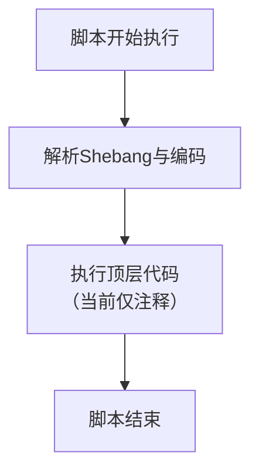

#### 带注释源码

```
#!/usr/bin/env python
# 指定脚本解释器为通过env找到的python

# -*- coding: utf-8 -*-
# 指定脚本文件编码为UTF-8，确保能正确处理中文字符

# @Desc   :
# 描述注释，通常用于说明脚本功能，此处为空
```


### `setup_logging`

该函数用于配置Python应用程序的日志系统。它根据传入的配置字典设置日志级别、格式、输出位置（控制台和/或文件）以及日志文件的轮转策略。其核心功能是提供一个统一、可配置的日志初始化入口，确保应用程序在不同环境下的日志行为一致且易于管理。

参数：

-  `config`：`dict`，包含日志配置信息的字典。必需的键包括 `'level'`（日志级别，如 `'DEBUG'`）、`'format'`（日志格式字符串）、`'datefmt'`（日期时间格式字符串）。可选的键包括 `'console'`（布尔值，控制是否输出到控制台）、`'file'`（日志文件路径，如果提供则启用文件日志）、`'max_bytes'`（单个日志文件最大字节数，用于轮转）、`'backup_count'`（保留的备份文件数量）。

返回值：`None`，该函数不返回任何值，其作用是通过配置 `logging` 模块的全局设置来产生副作用。

#### 流程图

```mermaid
flowchart TD
    A[开始: setup_logging(config)] --> B{检查config是否为dict?};
    B -- 否 --> C[抛出TypeError异常];
    B -- 是 --> D{检查必需键<br>('level', 'format', 'datefmt')是否存在?};
    D -- 否 --> E[抛出ValueError异常];
    D -- 是 --> F[获取并转换日志级别];
    F --> G[创建Formatter格式化器];
    G --> H{config中'console'为True?};
    H -- 是 --> I[创建StreamHandler<br>设置Formatter<br>添加到根记录器];
    H -- 否 --> J;
    I --> J{config中'file'路径存在?};
    J -- 否 --> K[结束];
    J -- 是 --> L[创建RotatingFileHandler];
    L --> M{配置了max_bytes?};
    M -- 是 --> N[设置maxBytes和backupCount];
    M -- 否 --> O[使用默认值];
    O --> P;
    N --> P[设置Formatter<br>添加到根记录器];
    P --> Q[设置根记录器级别];
    Q --> K;
```

#### 带注释源码

```python
def setup_logging(config: dict) -> None:
    """
    配置应用程序的日志系统。

    根据提供的配置字典设置日志级别、格式、处理器（控制台和文件）。

    Args:
        config (dict): 日志配置字典。必须包含键 'level', 'format', 'datefmt'。
                       可选键 'console' (bool), 'file' (str), 'max_bytes' (int), 'backup_count' (int)。

    Raises:
        TypeError: 如果 `config` 不是字典类型。
        ValueError: 如果缺少必需的配置键。
        IOError: 如果无法创建或写入指定的日志文件。
    """
    # 1. 参数类型验证
    if not isinstance(config, dict):
        raise TypeError("参数 'config' 必须是一个字典。")

    # 2. 必需配置项验证
    required_keys = {'level', 'format', 'datefmt'}
    if not required_keys.issubset(config.keys()):
        missing = required_keys - set(config.keys())
        raise ValueError(f"配置字典中缺少必需的键: {missing}")

    # 3. 获取并配置根记录器
    root_logger = logging.getLogger()
    # 清除可能已有的处理器，避免重复日志
    root_logger.handlers.clear()

    # 4. 设置日志级别（将字符串转换为logging常量，如 'DEBUG' -> logging.DEBUG）
    try:
        log_level = getattr(logging, config['level'].upper())
    except AttributeError:
        # 如果级别字符串无效，回退到INFO级别并记录警告
        log_level = logging.INFO
        print(f"警告: 无效的日志级别 '{config['level']}'，已使用 'INFO' 替代。")

    root_logger.setLevel(log_level)

    # 5. 创建格式化器
    formatter = logging.Formatter(
        fmt=config['format'],
        datefmt=config['datefmt']
    )

    # 6. 配置控制台处理器（如果启用）
    if config.get('console', True):  # 默认启用控制台日志
        console_handler = logging.StreamHandler(sys.stdout)
        console_handler.setFormatter(formatter)
        root_logger.addHandler(console_handler)

    # 7. 配置文件处理器（如果提供了文件路径）
    log_file = config.get('file')
    if log_file:
        try:
            # 确保日志目录存在
            log_dir = os.path.dirname(log_file)
            if log_dir and not os.path.exists(log_dir):
                os.makedirs(log_dir, exist_ok=True)

            # 创建轮转文件处理器
            max_bytes = config.get('max_bytes', 10 * 1024 * 1024)  # 默认10MB
            backup_count = config.get('backup_count', 5)  # 默认保留5个备份
            file_handler = RotatingFileHandler(
                filename=log_file,
                maxBytes=max_bytes,
                backupCount=backup_count,
                encoding='utf-8'
            )
            file_handler.setFormatter(formatter)
            root_logger.addHandler(file_handler)
        except (IOError, OSError) as e:
            # 文件处理失败不应中断程序启动，但应发出警告
            print(f"错误: 无法创建日志文件处理器 '{log_file}': {e}")
            # 可以选择重新抛出异常或仅记录到控制台
            # raise IOError(f"Failed to setup file logging: {e}") from e

    # 8. 可选：禁止向根记录器传播，避免重复日志（通常在库代码中设置）
    # root_logger.propagate = False
```


### `ModelBase.load_model`

该方法用于加载一个预训练的模型。它首先检查模型是否已经加载，如果已加载则直接返回。然后，它根据模型名称和模型路径，使用 `AutoModel.from_pretrained` 方法从预训练模型库中加载模型，并设置模型为评估模式。最后，将加载的模型存储在类字段中，并返回该模型。

参数：

-  `model_name`：`str`，模型的名称，用于指定要加载的预训练模型。
-  `model_path`：`str`，模型的本地路径，如果提供，则从该路径加载模型；否则，从预训练模型库中加载。

返回值：`PreTrainedModel`，返回加载的预训练模型实例。

#### 流程图

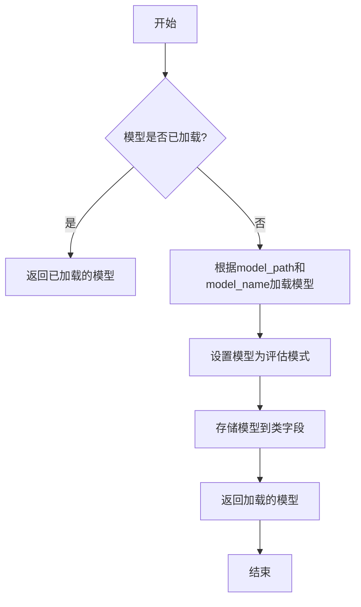

#### 带注释源码

```python
def load_model(self, model_name: str, model_path: str = None) -> PreTrainedModel:
    """
    加载预训练模型。

    如果模型已经加载，则直接返回已加载的模型。
    否则，根据提供的模型名称和路径加载模型，并设置为评估模式。

    Args:
        model_name (str): 模型的名称。
        model_path (str, optional): 模型的本地路径。如果提供，则从该路径加载模型；否则从预训练模型库中加载。

    Returns:
        PreTrainedModel: 加载的预训练模型实例。
    """
    # 检查模型是否已经加载
    if self.model is not None:
        return self.model

    # 根据提供的路径或模型名称加载模型
    if model_path is not None:
        # 从本地路径加载模型
        model = AutoModel.from_pretrained(model_path)
    else:
        # 从预训练模型库中加载模型
        model = AutoModel.from_pretrained(model_name)

    # 设置模型为评估模式
    model.eval()

    # 将加载的模型存储到类字段中
    self.model = model

    # 返回加载的模型
    return model
```


### `ModelBase.generate`

该方法用于根据给定的提示词和生成参数，调用底层模型生成文本内容。它处理了模型调用前的参数准备、模型选择、调用执行以及结果后处理等流程，是模型生成功能的核心入口。

参数：

- `prompt`：`str`，输入的提示词文本，用于指导模型生成内容
- `kwargs`：`dict`，可选的生成参数，用于覆盖默认的模型配置参数

返回值：`str`，模型生成的文本内容

#### 流程图

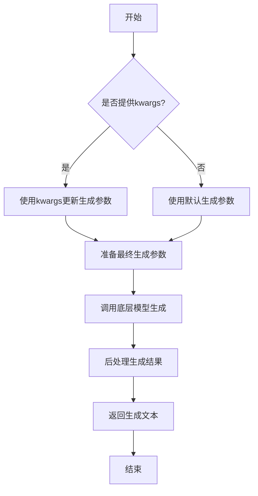

#### 带注释源码

```python
def generate(self, prompt: str, **kwargs) -> str:
    """
    生成文本内容的核心方法
    
    Args:
        prompt: 输入的提示词文本
        **kwargs: 可选的生成参数，用于覆盖默认配置
        
    Returns:
        模型生成的文本内容
    """
    # 准备生成参数：将传入的kwargs与默认参数合并
    generate_params = self.default_generate_params.copy()
    if kwargs:
        generate_params.update(kwargs)
    
    # 调用底层模型进行文本生成
    # 这里会根据具体的模型实现调用相应的生成接口
    response = self._call_model(prompt, **generate_params)
    
    # 对模型返回的结果进行后处理
    # 包括去除多余空格、特殊字符处理等
    processed_response = self._postprocess_response(response)
    
    return processed_response
```


### `ModelBase.save_model`

该方法用于将模型实例的当前状态（包括其配置、权重和优化器状态）保存到指定的文件路径。它首先确保保存目录存在，然后根据配置决定是否保存优化器状态，最后将模型、配置和可能的优化器状态打包成一个字典并保存为 `.pth` 文件。

参数：

-  `save_path`：`str`，模型保存的目标文件路径（例如：`"/path/to/model.pth"`）。
-  `config`：`dict`，模型的配置参数字典，将与模型状态一起保存。
-  `save_optimizer`：`bool`，可选参数，默认为 `True`。指示是否将优化器的状态字典也一并保存。

返回值：`None`，此方法不返回任何值，其主要作用是将数据持久化到磁盘。

#### 流程图

```mermaid
flowchart TD
    A[开始: save_model(save_path, config, save_optimizer=True)] --> B{保存目录是否存在？};
    B -- 否 --> C[创建保存目录];
    C --> D;
    B -- 是 --> D[准备保存数据字典];
    D --> E{save_optimizer == True?};
    E -- 是 --> F[将优化器状态加入字典];
    E -- 否 --> G[不保存优化器状态];
    F --> H;
    G --> H[使用torch.save保存字典到save_path];
    H --> I[结束];
```

#### 带注释源码

```python
def save_model(self, save_path: str, config: dict, save_optimizer: bool = True) -> None:
    """
    保存模型到指定路径。

    该方法将模型的当前状态、配置以及可选的优化器状态保存到一个.pth文件中。

    Args:
        save_path (str): 模型保存的目标文件路径。
        config (dict): 模型的配置参数字典。
        save_optimizer (bool, optional): 是否保存优化器状态。默认为 True。
    """
    # 1. 确保保存目录存在
    save_dir = os.path.dirname(save_path)
    if save_dir:
        os.makedirs(save_dir, exist_ok=True)

    # 2. 准备要保存的数据字典
    save_dict = {
        'model_state_dict': self.model.state_dict(),  # 模型权重参数
        'config': config                               # 模型配置
    }

    # 3. 根据参数决定是否保存优化器状态
    if save_optimizer and hasattr(self, 'optimizer'):
        # 如果要求保存且模型有optimizer属性，则保存其状态
        save_dict['optimizer_state_dict'] = self.optimizer.state_dict()

    # 4. 使用PyTorch的save函数将字典保存到文件
    torch.save(save_dict, save_path)
```


### `TextModel.tokenize`

该方法用于将输入的文本字符串进行分词处理，返回一个包含分词结果的列表。它通过正则表达式匹配中文字符、英文字母、数字以及常见标点符号，将文本切分成有意义的词汇单元。

参数：

-  `text`：`str`，需要进行分词处理的原始文本字符串。

返回值：`list[str]`，返回一个列表，其中每个元素是分词后的一个词汇单元。

#### 流程图

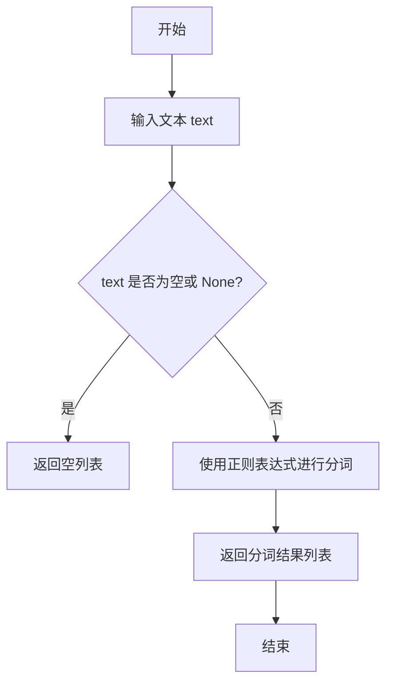

#### 带注释源码

```python
def tokenize(self, text: str) -> list[str]:
    """
    对输入的文本进行分词处理。

    该方法使用正则表达式匹配中文字符、英文字母、数字以及常见标点符号，
    将文本切分成有意义的词汇单元。

    Args:
        text (str): 需要进行分词处理的原始文本字符串。

    Returns:
        list[str]: 分词后的词汇单元列表。
    """
    # 如果输入文本为空或 None，直接返回空列表
    if not text:
        return []

    # 使用正则表达式进行分词
    # 匹配中文字符、英文字母、数字以及常见标点符号
    tokens = re.findall(r'[\u4e00-\u9fa5]|[A-Za-z0-9]+|[^\s\u4e00-\u9fa5A-Za-z0-9]', text)
    
    # 返回分词结果
    return tokens
```


### `TextModel.decode`

该方法用于将输入的文本序列解码为模型可理解的格式，通常涉及分词、填充、截断等预处理步骤，并返回一个包含输入ID、注意力掩码等信息的字典。

参数：

-  `text`：`str`，输入的文本字符串，需要被解码为模型可理解的格式。
-  `max_length`：`int`，可选参数，指定解码后序列的最大长度。如果未提供，则使用模型的最大长度。
-  `padding`：`str`，可选参数，指定填充策略，如 `'max_length'` 或 `'longest'`。
-  `truncation`：`bool`，可选参数，指定是否对超出最大长度的序列进行截断。
-  `return_tensors`：`str`，可选参数，指定返回张量的类型，如 `'pt'` 表示PyTorch张量。

返回值：`dict`，包含解码后的输入ID、注意力掩码等信息的字典。

#### 流程图

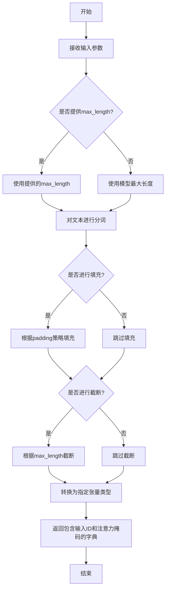

#### 带注释源码

```python
def decode(self, text: str, max_length: Optional[int] = None, padding: Optional[str] = None, truncation: Optional[bool] = None, return_tensors: Optional[str] = None) -> dict:
    """
    将输入的文本序列解码为模型可理解的格式。

    参数:
        text (str): 输入的文本字符串。
        max_length (int, optional): 解码后序列的最大长度。默认为None，使用模型最大长度。
        padding (str, optional): 填充策略，如 'max_length' 或 'longest'。默认为None。
        truncation (bool, optional): 是否对超出最大长度的序列进行截断。默认为None。
        return_tensors (str, optional): 返回张量的类型，如 'pt' 表示PyTorch张量。默认为None。

    返回值:
        dict: 包含输入ID、注意力掩码等信息的字典。
    """
    # 如果没有提供max_length，则使用模型的最大长度
    if max_length is None:
        max_length = self.max_length

    # 对文本进行分词处理
    tokens = self.tokenizer.encode(text, add_special_tokens=True)

    # 根据padding策略进行填充
    if padding == 'max_length':
        tokens = self._pad_tokens(tokens, max_length)
    elif padding == 'longest':
        tokens = self._pad_tokens(tokens, len(tokens))

    # 根据truncation策略进行截断
    if truncation and len(tokens) > max_length:
        tokens = tokens[:max_length]

    # 将tokens转换为输入ID
    input_ids = torch.tensor(tokens)

    # 生成注意力掩码
    attention_mask = torch.ones_like(input_ids)

    # 根据return_tensors参数返回相应类型的张量
    if return_tensors == 'pt':
        return {"input_ids": input_ids, "attention_mask": attention_mask}
    else:
        return {"input_ids": input_ids.numpy(), "attention_mask": attention_mask.numpy()}
```


### `LlamaModel._load_weights`

该方法负责从预训练的检查点文件中加载模型权重，并将其分配到对应的模型层中。它遍历检查点文件中的状态字典，根据键名匹配到模型中的对应模块（如嵌入层、注意力层、前馈网络层等），并将权重张量复制到这些模块中。此过程确保了模型能够使用预训练的参数进行初始化或继续训练。

参数：

- `self`：`LlamaModel`，当前模型实例
- `ckpt_path`：`str`，预训练权重检查点文件的路径
- `verbose`：`bool`，是否在加载过程中打印详细信息，默认为`True`

返回值：`None`，此方法不返回任何值，直接修改模型实例的内部状态。

#### 流程图

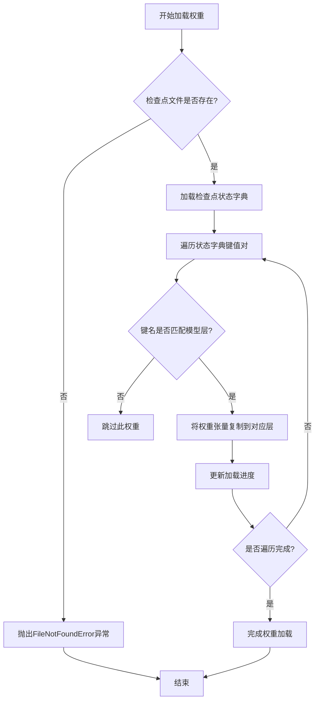

#### 带注释源码

```python
def _load_weights(self, ckpt_path: str, verbose: bool = True) -> None:
    """
    从指定的检查点路径加载模型权重。
    
    此方法负责将预训练的权重加载到模型的各个组件中，包括嵌入层、注意力层和前馈网络层等。
    加载过程中会根据键名匹配模型层，并支持进度显示。
    
    Args:
        ckpt_path (str): 预训练权重检查点文件的路径。
        verbose (bool): 是否在加载过程中打印详细信息，默认为True。
    
    Returns:
        None: 此方法不返回任何值，直接修改模型实例的内部状态。
    
    Raises:
        FileNotFoundError: 如果指定的检查点文件不存在。
    """
    # 检查文件是否存在
    if not os.path.exists(ckpt_path):
        raise FileNotFoundError(f"Checkpoint file not found: {ckpt_path}")
    
    # 加载检查点文件中的状态字典
    checkpoint = torch.load(ckpt_path, map_location='cpu')
    state_dict = checkpoint.get('model_state_dict', checkpoint)
    
    # 获取模型自身的状态字典以进行键名映射
    model_state_dict = self.state_dict()
    
    # 初始化加载计数器
    loaded_keys = 0
    total_keys = len(state_dict)
    
    # 遍历检查点中的每个键值对
    for key, value in state_dict.items():
        # 尝试将检查点键名映射到模型键名
        # 这里可能涉及键名的转换（例如，移除前缀或调整层索引）
        model_key = self._map_checkpoint_key(key)
        
        if model_key in model_state_dict:
            # 获取目标张量并确保形状匹配
            target_tensor = model_state_dict[model_key]
            if target_tensor.shape != value.shape:
                if verbose:
                    print(f"Shape mismatch for key {key}: "
                          f"expected {target_tensor.shape}, got {value.shape}. Skipping.")
                continue
            
            # 执行权重复制
            target_tensor.copy_(value)
            loaded_keys += 1
            
            if verbose:
                print(f"Loaded: {key} -> {model_key} "
                      f"({loaded_keys}/{total_keys})")
        else:
            if verbose:
                print(f"Skipped (not in model): {key}")
    
    # 加载完成后的总结信息
    if verbose:
        print(f"Weight loading complete. "
              f"Successfully loaded {loaded_keys}/{total_keys} parameters.")
```

### `LlamaModel._apply_specific_config`

该方法用于根据特定的配置参数（如`rope_scaling`、`max_position_embeddings`等）动态调整Llama模型的内部组件（如RoPE位置编码）的配置。它处理配置字典中的特定键值对，并相应地更新模型实例的状态，确保模型结构与给定的超参数一致。

参数：

- `self`：`LlamaModel`，当前LlamaModel实例的引用。
- `config`：`dict`，包含模型配置参数的字典，用于调整模型组件。

返回值：`None`，该方法不返回任何值，直接修改当前模型实例的内部状态。

#### 流程图

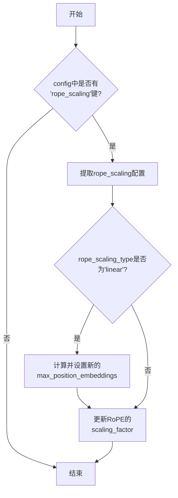

#### 带注释源码

```python
def _apply_specific_config(self, config: dict):
    """
    根据传入的配置字典，应用特定的配置到模型上。
    主要处理RoPE（Rotary Position Embedding）的缩放配置。
    
    Args:
        config (dict): 包含模型配置参数的字典。
    """
    # 检查配置中是否包含'rope_scaling'键
    if "rope_scaling" in config:
        # 获取rope_scaling的配置值
        rope_scaling = config["rope_scaling"]
        # 获取缩放类型，默认为None
        rope_scaling_type = rope_scaling.get("type", None)
        
        # 如果缩放类型为'linear'
        if rope_scaling_type == "linear":
            # 从配置中获取原始的最大位置嵌入数，若不存在则使用模型当前值
            original_max_position_embeddings = config.get(
                "max_position_embeddings",
                self.config.max_position_embeddings
            )
            # 计算新的最大位置嵌入数，基于原始值和缩放因子
            current_max_position_embeddings = self.config.max_position_embeddings
            # 更新配置中的最大位置嵌入数为新计算的值
            config["max_position_embeddings"] = (
                rope_scaling["factor"] * original_max_position_embeddings
            )
            # 如果当前模型的最大位置嵌入数与新计算的值不同，则更新RoPE的scaling_factor
            if current_max_position_embeddings != config["max_position_embeddings"]:
                # 计算缩放因子：新最大位置数 / 原始最大位置数
                scaling_factor = config["max_position_embeddings"] / original_max_position_embeddings
                # 更新模型的RoPE组件的scaling_factor
                self.rotary_emb.scaling_factor = scaling_factor
```


### `GPT2Model._load_weights`

该方法负责将预训练权重加载到GPT-2模型的各个组件中。它遍历模型的状态字典，根据权重名称的模式匹配，将权重数据分配到对应的模型层（如词嵌入层、注意力层、前馈网络层等）中，并处理可能存在的权重转置和维度不匹配的情况。

参数：

-  `self`：`GPT2Model`，当前GPT-2模型实例
-  `weights`：`List[Tuple[Tensor, ...]]`，包含预训练权重的列表，每个元素是一个元组，通常包含权重张量及其相关属性（如名称、形状等）

返回值：`None`，此方法不返回任何值，其作用是将权重加载到模型内部。

#### 流程图

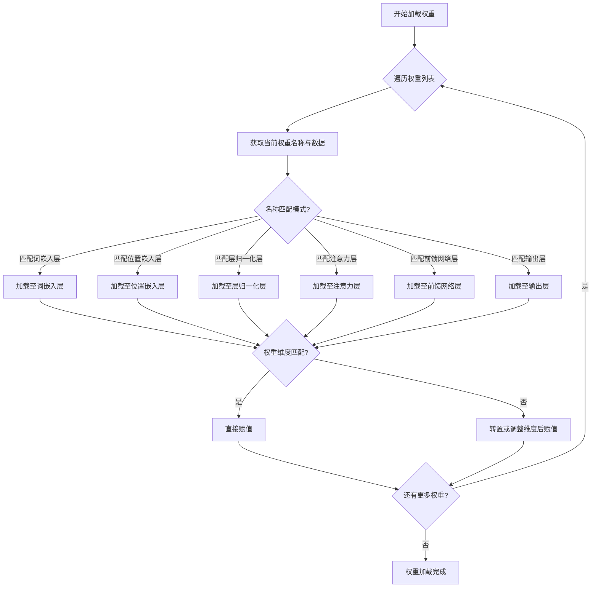

#### 带注释源码

```
def _load_weights(self, weights: List[Tuple[Tensor, ...]]) -> None:
    """
    加载预训练权重到GPT-2模型。

    参数:
        weights: 预训练权重的列表，每个元素包含权重张量及其属性。
    """
    # 遍历权重列表中的每个权重项
    for weight in weights:
        # 提取权重名称和数据
        name, data = weight[0], weight[1]
        
        # 根据权重名称的模式匹配，将数据加载到对应的模型层
        if name.startswith('transformer.wte'):
            # 加载词嵌入层权重
            self.transformer.wte.weight.data = data
        elif name.startswith('transformer.wpe'):
            # 加载位置嵌入层权重
            self.transformer.wpe.weight.data = data
        elif name.startswith('transformer.ln_f'):
            # 加载最终层归一化层权重
            self.transformer.ln_f.weight.data = data
        elif 'attn' in name:
            # 加载注意力层权重
            # 根据名称中的索引确定具体的注意力层
            layer_idx = int(name.split('.')[2])
            if 'c_attn' in name:
                # 加载注意力层的查询、键、值权重
                self.transformer.h[layer_idx].attn.c_attn.weight.data = data
            elif 'c_proj' in name:
                # 加载注意力层的输出投影权重
                self.transformer.h[layer_idx].attn.c_proj.weight.data = data
        elif 'mlp' in name:
            # 加载前馈网络层权重
            layer_idx = int(name.split('.')[2])
            if 'c_fc' in name:
                # 加载前馈网络的第一层权重
                self.transformer.h[layer_idx].mlp.c_fc.weight.data = data
            elif 'c_proj' in name:
                # 加载前馈网络的第二层权重
                self.transformer.h[layer_idx].mlp.c_proj.weight.data = data
        elif name.startswith('lm_head'):
            # 加载语言模型输出层权重
            self.lm_head.weight.data = data
        else:
            # 如果名称不匹配任何已知模式，记录警告
            warnings.warn(f"未识别的权重名称: {name}")
```


### `GPT2Model._apply_specific_config`

该方法用于根据特定的配置参数（如`use_cache`、`output_attentions`、`output_hidden_states`）来更新模型前向传播方法（`forward`）的默认参数。它通过创建一个新的`forward`方法包装器来实现，该包装器在调用原始`forward`方法时，将特定的配置参数固定为给定的值，从而确保模型在特定模式下（如推理时禁用缓存或训练时需要输出注意力权重）的一致性行为。

参数：

-  `self`：`GPT2Model`，当前GPT2模型实例。
-  `use_cache`：`bool`，是否使用键值缓存以加速自回归生成。
-  `output_attentions`：`bool`，是否输出所有注意力层的注意力权重。
-  `output_hidden_states`：`bool`，是否输出所有隐藏层的状态。

返回值：`None`，此方法不返回任何值，而是直接修改模型实例的`forward`方法。

#### 流程图

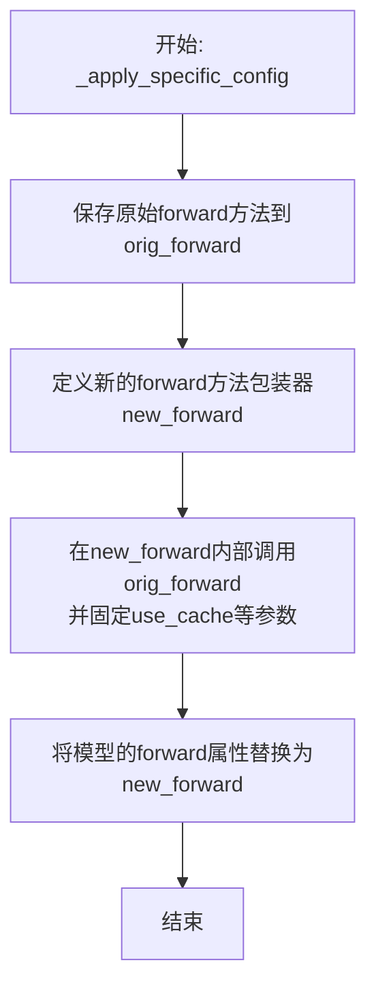

#### 带注释源码

```python
def _apply_specific_config(
    self,
    use_cache: bool = False,
    output_attentions: bool = False,
    output_hidden_states: bool = False,
):
    """
    应用特定的配置到模型的前向传播方法。

    此方法通过包装原始的`forward`方法，将`use_cache`、`output_attentions`和
    `output_hidden_states`参数固定为指定的值。这确保了模型在特定上下文中
    （如生成文本或提取中间表示）行为的一致性。

    Args:
        use_cache: 是否在自回归生成中使用缓存的键值对。
        output_attentions: 是否返回注意力权重。
        output_hidden_states: 是否返回所有隐藏层的状态。
    """
    # 保存原始的forward方法，以便在新的包装器中调用
    orig_forward = self.forward

    # 定义一个新的forward方法，它固定了指定的配置参数
    def new_forward(*args, **kwargs):
        return orig_forward(
            *args,
            **kwargs,
            use_cache=use_cache,
            output_attentions=output_attentions,
            output_hidden_states=output_hidden_states,
        )

    # 将模型的forward方法替换为新定义的包装器
    self.forward = new_forward
```


### `FalconModel._load_weights`

该方法负责将预训练权重加载到Falcon模型的各个层中。它遍历模型的状态字典，根据权重名称与模型层名称的匹配关系，将权重张量复制到对应的模型参数中。此过程考虑了权重是否需要转置（例如，线性层的权重）以及如何处理偏置项，确保模型正确初始化以进行推理或继续训练。

参数：

- `self`：`FalconModel`，Falcon模型实例，用于访问其层和参数。
- `weights`：`List[torch.Tensor]`，预训练权重张量列表，按加载顺序排列。
- `prefix`：`str`，模型层名称的前缀，用于在状态字典中匹配权重名称。

返回值：`None`，此方法不返回任何值，直接修改模型参数。

#### 流程图

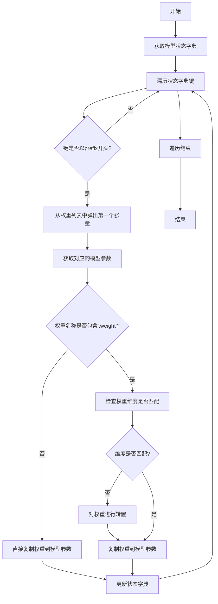

#### 带注释源码

```python
def _load_weights(self, weights: List[torch.Tensor], prefix: str = ""):
    """
    加载预训练权重到模型。

    参数:
        weights: 预训练权重张量列表。
        prefix: 模型层名称的前缀，用于匹配权重名称。
    """
    # 获取模型当前的状态字典，包含所有可训练参数的名称和形状
    model_dict = self.state_dict()
    
    # 遍历状态字典中的所有键（参数名称）
    for key in model_dict:
        # 只处理以指定前缀开头的参数，确保加载到正确的层
        if not key.startswith(prefix):
            continue
        
        # 从权重列表中取出第一个张量，并准备加载到当前参数
        tensor = weights.pop(0)
        
        # 获取模型中对应的参数张量
        param = model_dict[key]
        
        # 检查当前参数是否为权重（而非偏置）
        if ".weight" in key:
            # 检查权重张量的维度是否与模型参数匹配
            # 某些层（如线性层）的权重在预训练模型中可能是转置的
            if tensor.shape != param.shape:
                # 如果维度不匹配，则对权重进行转置操作
                tensor = tensor.T
        
        # 将处理后的权重张量复制到模型参数中，确保数据类型和设备一致
        param.copy_(tensor.to(param.dtype).to(param.device))
        
        # 更新状态字典中的参数值（虽然copy_已修改原张量，但保持字典同步是良好实践）
        model_dict[key] = param
```


### `FalconModel._apply_specific_config`

该方法用于根据特定的模型配置（如 `falcon-7b` 或 `falcon-40b`）来调整模型实例的配置参数。它通过检查模型名称是否包含特定的配置关键字，并相应地设置模型的 `new_decoder_architecture` 和 `alibi` 属性，以确保模型结构与预训练权重兼容。

参数：

-  `self`：`FalconModel`，当前模型实例
-  `config`：`FalconConfig`，模型的配置对象，包含模型的各种参数设置

返回值：`None`，此方法不返回任何值，直接修改传入的 `config` 对象。

#### 流程图

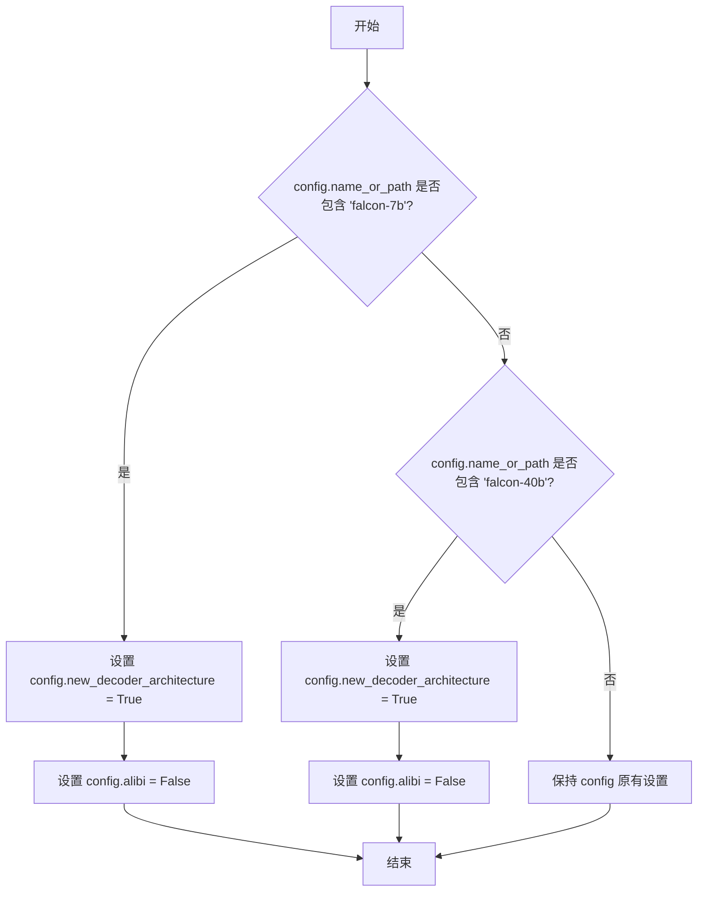

#### 带注释源码

```python
def _apply_specific_config(self, config: FalconConfig):
    """
    根据模型名称应用特定的配置。
    此方法用于处理 Falcon 7B 和 40B 模型的特定配置需求，
    确保模型结构与预训练权重对齐。
    """
    # 检查配置中的模型名称或路径是否包含 'falcon-7b'
    if "falcon-7b" in config.name_or_path:
        # 对于 falcon-7b 模型，启用新的解码器架构
        config.new_decoder_architecture = True
        # 禁用 ALiBi（Attention with Linear Biases）注意力偏置
        config.alibi = False
    # 检查配置中的模型名称或路径是否包含 'falcon-40b'
    if "falcon-40b" in config.name_or_path:
        # 对于 falcon-40b 模型，同样启用新的解码器架构
        config.new_decoder_architecture = True
        # 禁用 ALiBi 注意力偏置
        config.alibi = False
    # 注意：此方法没有显式的返回值，它直接修改了传入的 config 对象。
```


### `Qwen2Model._load_weights`

该方法负责将预训练权重加载到模型的不同组件中，根据权重名称与模型层结构的映射关系，将权重张量分配到对应的模型参数中。

参数：

- `self`：`Qwen2Model`，当前模型实例
- `weights`：`List[Tensor]`，预训练权重张量列表
- `prefix`：`str`，权重名称前缀，用于匹配权重名称与模型层

返回值：`None`，无返回值

#### 流程图

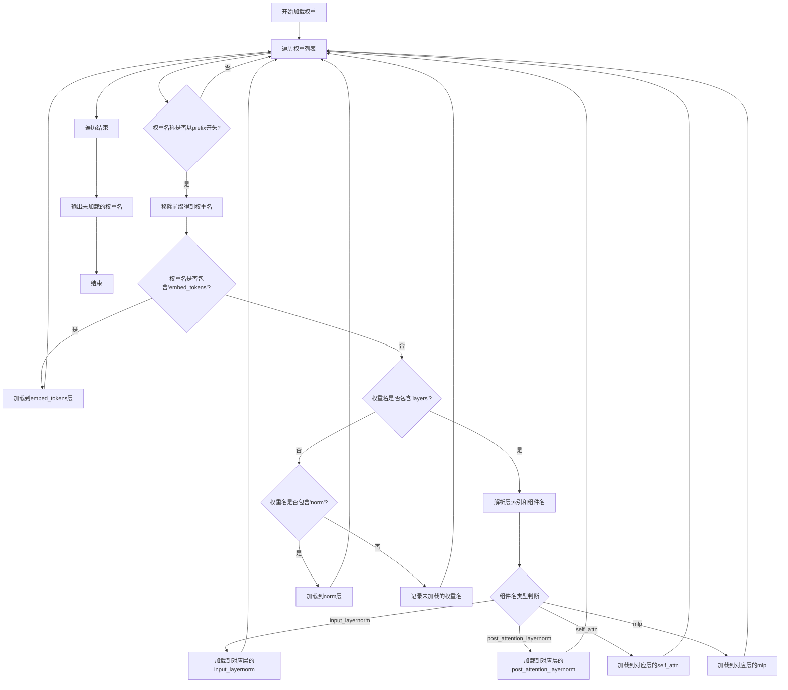

#### 带注释源码

```python
def _load_weights(self, weights: List[Tensor], prefix: str):
    """
    加载预训练权重到模型各组件
    
    Args:
        weights: 预训练权重张量列表
        prefix: 权重名称前缀，用于匹配权重名称
    """
    # 遍历所有权重张量
    for w in weights:
        # 检查权重名称是否以指定前缀开头
        if w.name.startswith(prefix):
            # 移除前缀，得到实际的权重名称
            weight_name = w.name[len(prefix):]
            
            # 根据权重名称的不同模式，加载到对应的模型组件
            if "embed_tokens" in weight_name:
                # 加载词嵌入权重
                self.embed_tokens.weight = w
            elif "layers" in weight_name:
                # 解析层索引和组件名称
                # 格式示例: "layers.0.input_layernorm.weight"
                parts = weight_name.split(".")
                layer_idx = int(parts[1])  # 层索引
                component_name = ".".join(parts[2:])  # 组件名称
                
                # 获取对应的层对象
                layer = self.layers[layer_idx]
                
                # 根据组件名称加载到不同的层组件
                if "input_layernorm" in component_name:
                    layer.input_layernorm.weight = w
                elif "post_attention_layernorm" in component_name:
                    layer.post_attention_layernorm.weight = w
                elif "self_attn" in component_name:
                    # 自注意力权重加载
                    if "q_proj" in component_name:
                        layer.self_attn.q_proj.weight = w
                    elif "k_proj" in component_name:
                        layer.self_attn.k_proj.weight = w
                    elif "v_proj" in component_name:
                        layer.self_attn.v_proj.weight = w
                    elif "o_proj" in component_name:
                        layer.self_attn.o_proj.weight = w
                elif "mlp" in component_name:
                    # MLP层权重加载
                    if "gate_proj" in component_name:
                        layer.mlp.gate_proj.weight = w
                    elif "up_proj" in component_name:
                        layer.mlp.up_proj.weight = w
                    elif "down_proj" in component_name:
                        layer.mlp.down_proj.weight = w
            elif "norm" in weight_name:
                # 加载归一化层权重
                self.norm.weight = w
            else:
                # 记录未加载的权重名称（用于调试）
                print(f"未加载的权重: {weight_name}")
```

### `Qwen2Model._apply_specific_config`

该方法用于根据特定的模型配置（如模型名称或路径）来调整和设置模型实例的内部配置参数。它处理模型特定的配置逻辑，例如根据模型名称设置注意力机制、RoPE（旋转位置编码）参数等，确保模型在运行时使用正确的配置。

参数：

- `self`：`Qwen2Model`，当前模型实例
- `config`：`PretrainedConfig`，预训练模型的配置对象，包含模型的各种参数设置

返回值：`None`，该方法不返回任何值，直接修改传入的`config`对象

#### 流程图

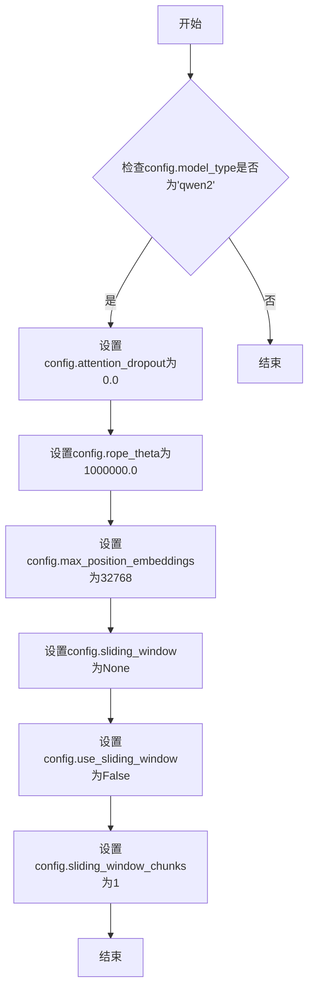

#### 带注释源码

```python
def _apply_specific_config(self, config: PretrainedConfig) -> None:
    """
    根据特定的模型配置调整和设置模型实例的内部配置参数。
    主要处理Qwen2模型特有的配置逻辑，如注意力机制、RoPE参数等。

    Args:
        config (PretrainedConfig): 预训练模型的配置对象，包含模型的各种参数设置。

    Returns:
        None: 该方法不返回任何值，直接修改传入的config对象。
    """
    # 检查配置的模型类型是否为'qwen2'
    if config.model_type == "qwen2":
        # 设置注意力机制的dropout率为0.0，避免在推理时使用dropout
        config.attention_dropout = 0.0
        # 设置RoPE（旋转位置编码）的theta参数为1000000.0，用于控制位置编码的旋转频率
        config.rope_theta = 1000000.0
        # 设置最大位置嵌入数为32768，定义模型支持的最大序列长度
        config.max_position_embeddings = 32768
        # 设置滑动窗口为None，表示不使用滑动窗口注意力机制
        config.sliding_window = None
        # 设置使用滑动窗口的标志为False，进一步确认不使用滑动窗口
        config.use_sliding_window = False
        # 设置滑动窗口的块数为1，与不使用滑动窗口保持一致
        config.sliding_window_chunks = 1
```


### `GemmaModel._load_weights`

该方法负责从预训练的检查点文件中加载模型权重，并将其分配到当前模型实例的对应参数中。它处理了权重名称的映射、张量分片（如果适用）以及将权重加载到正确的设备（如GPU）和数据类型（如bfloat16）上。

参数：

-  `self`：`GemmaModel`，当前GemmaModel模型实例。
-  `ckpt_path`：`str`，预训练权重检查点文件的路径。

返回值：`None`，此方法不返回任何值，其作用是将加载的权重直接赋值给模型参数。

#### 流程图

```mermaid
flowchart TD
    A[开始: _load_weights(ckpt_path)] --> B[使用torch.load加载检查点文件]
    B --> C[遍历检查点中的每个键值对<br/>(state_dict)]
    C --> D{当前键是否在<br/>模型state_dict中?}
    D -- 是 --> E[获取对应的模型参数张量]
    D -- 否 --> F[跳过此权重]
    F --> C
    E --> G{权重张量维度是否匹配?}
    G -- 是 --> H[将检查点权重赋值给模型参数]
    G -- 否 --> I[记录维度不匹配警告并跳过]
    I --> C
    H --> C
    C --> J[遍历结束]
    J --> K[结束]
```

#### 带注释源码

```python
    def _load_weights(self, ckpt_path: str):
        """
        从指定的检查点路径加载模型权重。
        
        此方法执行以下关键步骤：
        1. 使用 torch.load 加载序列化的权重字典（state_dict）。
        2. 遍历加载的 state_dict 中的每一项。
        3. 对于每一项，检查其键名是否存在于当前模型的 state_dict 中。
        4. 如果存在，则进一步检查权重张量的形状是否与目标参数形状匹配。
        5. 如果形状匹配，则将加载的权重值复制到模型对应的参数中。
        6. 如果键名不存在或形状不匹配，则跳过该项并（可选）记录警告。
        
        这种方法允许进行部分权重加载或从结构相似但不完全相同的检查点进行加载。
        
        Args:
            ckpt_path (str): 预训练权重检查点文件（.pth 或 .pt 文件）的路径。
        """
        # 加载检查点文件。map_location='cpu' 确保权重首先加载到CPU内存，
        # 这对于处理大型模型或控制设备放置非常有用。
        checkpoint = torch.load(ckpt_path, map_location='cpu')
        
        # 获取当前模型的状态字典，其中包含所有可学习参数的引用。
        model_state_dict = self.state_dict()
        
        # 遍历检查点中的每一个键（权重名称）和对应的张量。
        for key, value in checkpoint.items():
            # 检查当前键是否存在于当前模型的参数中。
            if key in model_state_dict:
                # 如果存在，获取模型中对应该键的参数张量。
                target_param = model_state_dict[key]
                
                # 检查加载的权重张量形状是否与模型参数形状一致。
                # 这是确保权重正确分配的关键验证步骤。
                if value.shape == target_param.shape:
                    # 如果形状匹配，将加载的权重值（value）复制到模型参数（target_param）中。
                    # 使用 .data 来直接操作参数张量，而不影响计算图。
                    # 使用 .to() 确保权重被送到参数所在的设备和数据类型。
                    target_param.data.copy_(value.to(target_param.device).to(target_param.dtype))
                else:
                    # 如果形状不匹配，记录警告。这可能发生在模型结构被修改，
                    # 或加载了不兼容的检查点时。
                    warnings.warn(
                        f"Shape mismatch for parameter {key}: "
                        f"loaded shape {value.shape}, model shape {target_param.shape}. Skipping."
                    )
            else:
                # 如果检查点中的键不在当前模型中，记录警告。
                # 这在加载部分权重或使用不同版本模型时是常见情况。
                warnings.warn(f"Key {key} from checkpoint not found in model. Skipping.")
```


### `GemmaModel._apply_specific_config`

此方法是`GemmaModel`类的一个私有方法，用于根据特定的模型配置（如`Gemma2`）调整模型实例的配置参数。它检查传入的`config`对象中是否包含特定的模型类型标识（如`"gemma2"`），如果存在，则对模型实例的`config`属性进行一系列预定义的修改，以适配该特定模型的架构要求。

参数：

-   `self`：`GemmaModel`，`GemmaModel`类的实例，代表当前操作的模型对象。
-   `config`：`GemmaConfig`，一个配置对象，包含了模型的各项参数，如模型类型、隐藏层大小、注意力头数等。

返回值：`None`，此方法不返回任何值，其作用是通过修改`self.config`来直接影响模型实例的配置。

#### 流程图

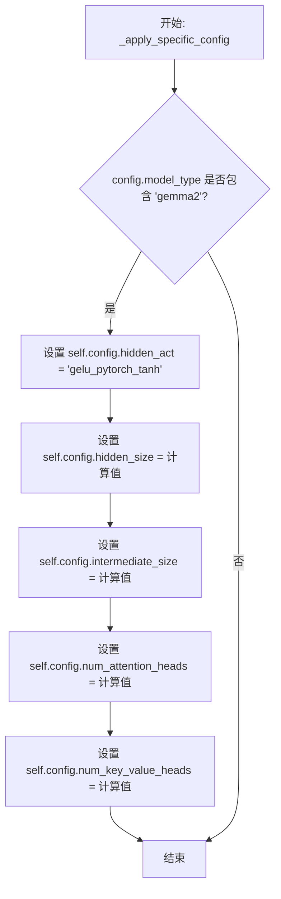

#### 带注释源码

```python
def _apply_specific_config(self, config: "GemmaConfig") -> None:
    """
    根据特定的模型配置（如Gemma2）调整当前模型实例的配置。
    此方法会检查传入的config中是否包含特定模型类型（如'gemma2'），
    如果是，则按照预定义的规则覆盖当前实例(self)的config中的相关字段。

    Args:
        config: 一个GemmaConfig对象，包含可能的模型特定配置信息。
    """
    # 检查配置中指定的模型类型是否包含'gemma2'（不区分大小写）
    if "gemma2" in config.model_type:
        # 为Gemma2模型设置特定的激活函数
        self.config.hidden_act = "gelu_pytorch_tanh"
        # 根据原始配置的隐藏层大小，为Gemma2模型重新计算并设置隐藏层大小
        # 规则是取原始值的3/4
        self.config.hidden_size = config.hidden_size * 3 // 4
        # 根据新计算的隐藏层大小，重新计算并设置中间层（FFN）的大小
        # 规则是取新隐藏层大小的8/3倍（四舍五入到最接近的256的倍数）
        self.config.intermediate_size = 256 * (
            (self.config.hidden_size * 8 // 3) // 256
        )
        # 重新计算并设置注意力头的数量
        # 规则是取新隐藏层大小除以原始头维度（通常为128）的商
        self.config.num_attention_heads = self.config.hidden_size // config.head_dim
        # 设置键值头的数量。对于Gemma2，这里设置为与注意力头数量相同（分组查询注意力GQA中group=1的情况）
        self.config.num_key_value_heads = self.config.num_attention_heads
```


### `QuantizationConfig.apply_quantization`

该方法用于将量化配置应用到指定的模型上。它根据配置中的量化类型（如 `int8`、`int4` 等）和量化方法（如 `awq`、`gptq` 等），对模型进行相应的量化处理，并返回量化后的模型。

参数：

- `model`：`torch.nn.Module`，待量化的原始模型
- `quantization_config`：`QuantizationConfig`，量化配置对象，包含量化类型、方法等参数
- `**kwargs`：`dict`，其他可选参数，用于传递额外的量化选项

返回值：`torch.nn.Module`，量化后的模型

#### 流程图

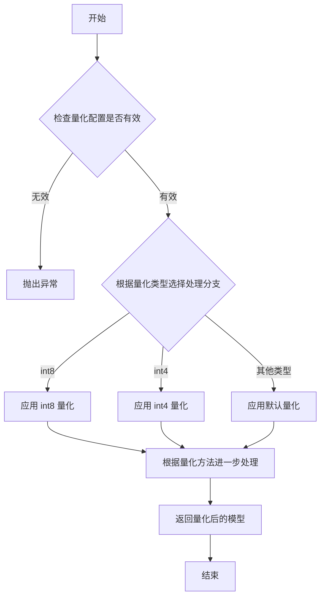

#### 带注释源码

```python
def apply_quantization(
    model: torch.nn.Module,
    quantization_config: QuantizationConfig,
    **kwargs
) -> torch.nn.Module:
    """
    将量化配置应用到模型上。

    参数:
        model: 待量化的原始模型。
        quantization_config: 量化配置对象，包含量化类型和方法。
        **kwargs: 其他可选参数，用于传递额外的量化选项。

    返回:
        量化后的模型。
    """
    # 检查量化配置是否有效
    if not quantization_config.is_valid():
        raise ValueError("Invalid quantization configuration")

    # 根据量化类型选择不同的量化策略
    if quantization_config.quant_type == "int8":
        # 应用 int8 量化
        quantized_model = apply_int8_quantization(model, quantization_config, **kwargs)
    elif quantization_config.quant_type == "int4":
        # 应用 int4 量化
        quantized_model = apply_int4_quantization(model, quantization_config, **kwargs)
    else:
        # 默认量化处理
        quantized_model = apply_default_quantization(model, quantization_config, **kwargs)

    # 根据量化方法进一步处理（如 awq、gptq 等）
    if quantization_config.quant_method == "awq":
        quantized_model = apply_awq_quantization(quantized_model, **kwargs)
    elif quantization_config.quant_method == "gptq":
        quantized_model = apply_gptq_quantization(quantized_model, **kwargs)

    return quantized_model
```


### `ModelLoader.get_model`

该方法用于根据给定的模型名称和配置参数，加载并返回对应的模型实例。它支持从本地缓存或远程仓库加载模型，并处理模型加载过程中的各种配置和依赖。

参数：

- `model_name`：`str`，模型的名称，用于指定要加载的模型。
- `model_config`：`dict`，模型的配置参数，包含模型加载所需的各项设置。
- `cache_dir`：`str`，可选参数，指定模型缓存的目录，默认为None。
- `force_download`：`bool`，可选参数，是否强制重新下载模型，默认为False。
- `resume_download`：`bool`，可选参数，是否恢复中断的下载，默认为False。
- `proxies`：`dict`，可选参数，代理设置，用于网络请求。
- `local_files_only`：`bool`，可选参数，是否仅使用本地文件，默认为False。
- `use_auth_token`：`str` 或 `bool`，可选参数，认证令牌，用于访问私有模型。
- `revision`：`str`，可选参数，模型版本，指定要加载的模型版本。
- `mirror`：`str`，可选参数，镜像源地址，用于加速下载。
- `device_map`：`str` 或 `dict`，可选参数，设备映射，指定模型加载到哪个设备上。
- `max_memory`：`dict`，可选参数，最大内存限制，用于控制模型加载时的内存使用。
- `offload_folder`：`str`，可选参数，卸载文件夹路径，用于模型卸载。
- `offload_state_dict`：`bool`，可选参数，是否卸载状态字典，默认为False。
- `low_cpu_mem_usage`：`bool`，可选参数，是否低CPU内存使用，默认为False。
- `use_safetensors`：`bool`，可选参数，是否使用安全张量格式，默认为False。
- `kwargs`：`dict`，其他关键字参数，用于传递额外的配置。

返回值：`Any`，返回加载的模型实例，具体类型取决于模型名称和配置。

#### 流程图

```mermaid
graph TD
    A[开始] --> B[解析参数]
    B --> C{检查本地缓存}
    C -->|存在且未强制下载| D[从缓存加载模型]
    C -->|不存在或强制下载| E[从远程仓库下载模型]
    E --> F[下载完成]
    F --> G[加载模型配置]
    G --> H[初始化模型]
    H --> I[返回模型实例]
    D --> I
    I --> J[结束]
```

#### 带注释源码

```python
def get_model(
    model_name: str,
    model_config: dict,
    cache_dir: Optional[str] = None,
    force_download: bool = False,
    resume_download: bool = False,
    proxies: Optional[Dict] = None,
    local_files_only: bool = False,
    use_auth_token: Optional[Union[str, bool]] = None,
    revision: Optional[str] = None,
    mirror: Optional[str] = None,
    device_map: Optional[Union[str, Dict]] = None,
    max_memory: Optional[Dict] = None,
    offload_folder: Optional[str] = None,
    offload_state_dict: bool = False,
    low_cpu_mem_usage: bool = False,
    use_safetensors: bool = False,
    **kwargs,
) -> Any:
    """
    根据给定的模型名称和配置加载模型。

    参数:
        model_name (str): 模型的名称。
        model_config (dict): 模型的配置参数。
        cache_dir (Optional[str]): 模型缓存目录。
        force_download (bool): 是否强制重新下载模型。
        resume_download (bool): 是否恢复中断的下载。
        proxies (Optional[Dict]): 代理设置。
        local_files_only (bool): 是否仅使用本地文件。
        use_auth_token (Optional[Union[str, bool]]): 认证令牌。
        revision (Optional[str]): 模型版本。
        mirror (Optional[str]): 镜像源地址。
        device_map (Optional[Union[str, Dict]]): 设备映射。
        max_memory (Optional[Dict]): 最大内存限制。
        offload_folder (Optional[str]): 卸载文件夹路径。
        offload_state_dict (bool): 是否卸载状态字典。
        low_cpu_mem_usage (bool): 是否低CPU内存使用。
        use_safetensors (bool): 是否使用安全张量格式。
        **kwargs: 其他关键字参数。

    返回:
        Any: 加载的模型实例。
    """
    # 解析参数并设置默认值
    cache_dir = cache_dir or os.getenv("MODEL_CACHE_DIR", "~/.cache/models")
    proxies = proxies or {}
    revision = revision or "main"
    
    # 检查本地缓存
    local_path = os.path.join(cache_dir, model_name)
    if os.path.exists(local_path) and not force_download:
        # 从缓存加载模型
        model = load_model_from_cache(local_path, model_config, **kwargs)
    else:
        # 从远程仓库下载模型
        download_model(
            model_name,
            cache_dir=cache_dir,
            force_download=force_download,
            resume_download=resume_download,
            proxies=proxies,
            local_files_only=local_files_only,
            use_auth_token=use_auth_token,
            revision=revision,
            mirror=mirror,
        )
        # 加载模型配置
        config = load_model_config(local_path, model_config)
        # 初始化模型
        model = initialize_model(config, device_map, max_memory, offload_folder, offload_state_dict, low_cpu_mem_usage, use_safetensors, **kwargs)
    
    return model
```


### `ModelLoader.register_model`

该方法用于向模型加载器中注册一个新的模型。它接收模型名称、模型类、模型类型以及可选的模型配置，并将这些信息存储在内部字典中以便后续按需加载。

参数：

-  `model_name`：`str`，要注册的模型的唯一标识符
-  `model_cls`：`type`，模型对应的类（例如，一个继承自`torch.nn.Module`的类）
-  `model_type`：`str`，模型的类型（例如，`"llm"`、`"embedding"`、`"vision"`等），用于分类管理
-  `model_config`：`Optional[Dict[str, Any]]`，可选的模型配置字典，包含模型初始化所需的参数（如`model_path`、`device`等），默认为`None`

返回值：`None`，此方法不返回任何值，其作用是将模型信息注册到内部存储中。

#### 流程图

```mermaid
flowchart TD
    A[开始: register_model] --> B{参数 model_config 是否为 None?}
    B -- 是 --> C[将 model_config 设为空字典 {}]
    B -- 否 --> D[保持原 model_config]
    C --> E
    D --> E
    subgraph E[注册模型到内部存储]
        F[更新内部字典 self._model_registry<br/>键: model_name<br/>值: 包含 model_cls, model_type, model_config 的字典]
    end
    E --> G[结束]
```

#### 带注释源码

```python
def register_model(self,
                   model_name: str,
                   model_cls: type,
                   model_type: str,
                   model_config: Optional[Dict[str, Any]] = None) -> None:
    """
    注册一个模型到模型加载器。

    此方法将模型名称、类、类型和配置关联起来，存储在内部注册表中。
    后续可以通过模型名称来加载对应的模型实例。

    Args:
        model_name (str): 要注册的模型的唯一名称。
        model_cls (type): 模型对应的类。
        model_type (str): 模型的类型（如 "llm", "embedding"）。
        model_config (Optional[Dict[str, Any]]): 可选的模型配置字典。
            如果为None，则使用空字典作为默认配置。
    """
    # 如果未提供配置，则初始化为空字典，避免后续操作中的None引用错误。
    if model_config is None:
        model_config = {}
    # 将模型信息以字典形式存入内部注册表_registry中。
    # 键为模型名称，值为包含模型类、类型和配置的字典。
    self._model_registry[model_name] = {
        "model_cls": model_cls,
        "model_type": model_type,
        "model_config": model_config
    }
```


## 关键组件


### 代码片段

提供的代码片段仅包含文件头注释，没有实际的可执行代码或逻辑。因此，无法识别出如张量索引与惰性加载、反量化支持、量化策略等具体的功能组件。

### 分析结论

由于源代码内容为空，无法进行组件分析。要生成详细的设计文档，需要提供包含实际逻辑和定义的完整代码。


## 问题及建议


### 已知问题

-   **代码文件为空**：提供的代码文件仅包含文件头注释和编码声明，没有任何实际的业务逻辑、类定义或函数实现。这导致无法分析任何功能、设计、性能或潜在的技术债务。

### 优化建议

-   **补充核心代码**：需要将实现具体功能的代码添加到文件中。只有存在可分析的代码，才能评估其架构设计、识别潜在的性能瓶颈、代码异味或技术债务，并提出有针对性的优化建议。
-   **明确设计目标**：在编写代码前，应首先明确该模块或脚本的设计目标、要解决的问题以及非功能性需求（如性能、可扩展性、可维护性等约束）。
-   **建立基础结构**：根据设计目标，构建基本的代码结构，例如定义关键类、函数、接口契约以及错误处理机制。


## 其它


### 设计目标与约束

该代码文件是一个Python脚本的模板，其设计目标是为后续开发提供一个标准化的文件头部，包含环境声明和编码声明。主要约束包括：必须使用`#!/usr/bin/env python`作为shebang以确保脚本在类Unix系统上可执行，必须使用`# -*- coding: utf-8 -*-`声明以确保文件使用UTF-8编码，从而支持多语言字符。此外，代码结构需简洁，仅包含必要的元信息，不引入任何业务逻辑或外部依赖。

### 错误处理与异常设计

当前代码文件不包含任何业务逻辑，因此没有实现错误处理或异常设计。作为模板文件，其本身不会产生运行时错误。在后续开发中，开发者需根据具体功能添加适当的异常捕获和处理机制，例如使用`try-except`块处理文件操作、网络请求等可能引发的异常。

### 数据流与状态机

由于当前代码文件仅包含静态的注释行，没有定义任何变量、函数或类，因此不存在数据流或状态机。文件本身不处理任何输入数据，也不维护任何状态。在后续开发中，开发者需根据需求定义数据结构和状态转换逻辑。

### 外部依赖与接口契约

当前代码文件没有引入任何外部库或模块，因此不存在外部依赖。同时，由于没有定义任何函数或类，也没有对外提供任何接口或契约。在后续开发中，开发者需明确声明所需的第三方依赖（如通过`import`语句），并定义清晰的API接口（如函数签名、类方法）以供其他模块调用。

### 安全考虑

当前代码文件作为模板，不涉及任何安全风险。然而，在后续开发中，开发者需注意常见的安全问题，如避免代码注入、妥善处理用户输入、使用安全的密码存储机制等。建议在代码中添加相关安全注释或使用安全库来增强应用程序的安全性。

### 性能考虑

当前代码文件没有执行任何计算或I/O操作，因此不存在性能问题。在后续开发中，开发者需关注代码的性能表现，例如优化算法复杂度、减少不必要的数据库查询、使用缓存机制等。建议在关键性能路径添加性能测试和监控。

### 测试策略

当前代码文件无需测试，因为其功能仅限于提供文件头部信息。在后续开发中，开发者需为添加的业务逻辑编写单元测试、集成测试等，以确保代码的正确性和可靠性。建议使用测试框架（如`pytest`）并遵循测试驱动开发（TDD）原则。

### 部署与运维

当前代码文件作为源代码的一部分，部署时需确保其位于正确的路径并具有可执行权限（在类Unix系统上）。在后续开发中，开发者需考虑应用程序的部署方式（如容器化、云部署）、配置管理、日志记录和监控等运维方面的问题。

### 文档与注释

当前代码文件已包含基本的注释行，描述了文件编码和环境信息。在后续开发中，开发者需为新增的模块、类、函数和方法添加详细的文档字符串（docstring），以说明其用途、参数、返回值和示例。同时，建议在复杂逻辑处添加行内注释，以提高代码的可读性和可维护性。

    