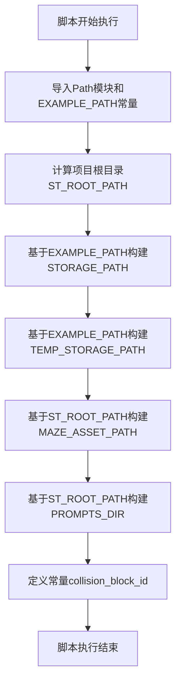

# `.\MetaGPT\metagpt\ext\stanford_town\utils\const.py` 详细设计文档

该代码文件是一个配置模块，主要用于定义和初始化斯坦福小镇（Stanford Town）项目相关的文件系统路径和常量。它通过导入项目常量并基于当前文件位置计算，设置了项目根目录、数据存储路径、临时存储路径、迷宫资源路径以及提示词目录等关键路径，并定义了一个用于碰撞检测的块ID常量。

## 整体流程



## 类结构

```
该文件不包含类定义，仅包含全局变量和常量。
```

## 全局变量及字段


### `ST_ROOT_PATH`
    
指向当前脚本父目录的父目录的路径对象，用于定位项目根目录。

类型：`pathlib.Path`
    


### `STORAGE_PATH`
    
指向示例目录下stanford_town/storage子目录的路径对象，用于存储持久化数据。

类型：`pathlib.Path`
    


### `TEMP_STORAGE_PATH`
    
指向示例目录下stanford_town/temp_storage子目录的路径对象，用于存储临时数据。

类型：`pathlib.Path`
    


### `MAZE_ASSET_PATH`
    
指向项目根目录下static_dirs/assets/the_ville子目录的路径对象，用于存放迷宫相关资源文件。

类型：`pathlib.Path`
    


### `PROMPTS_DIR`
    
指向项目根目录下prompts子目录的路径对象，用于存放提示词模板文件。

类型：`pathlib.Path`
    


### `collision_block_id`
    
表示碰撞块标识的字符串常量，用于在迷宫或地图中标识特定的障碍物或不可通行区域。

类型：`str`
    


    

## 全局函数及方法


## 关键组件


### 路径配置管理

定义了项目运行所需的关键文件系统路径，包括根目录、持久化存储路径、临时存储路径、静态资源路径和提示词模板目录，为代码的模块化和环境无关性提供了基础支持。

### 常量定义

定义了用于标识碰撞块的常量 `collision_block_id`，为游戏或模拟环境中的物理交互逻辑提供了明确的标识符。


## 问题及建议


### 已知问题

-   **硬编码路径与常量**：代码中大量使用了硬编码的路径字符串（如 `"stanford_town/storage"`）和常量（如 `collision_block_id = "32125"`）。这降低了代码的灵活性和可维护性。如果项目结构或外部依赖（如 `EXAMPLE_PATH`）发生变化，需要手动修改多处代码，容易出错且难以管理。
-   **缺乏配置管理**：路径和关键参数（如 `collision_block_id`）直接定义在代码中，而不是通过配置文件或环境变量进行管理。这使得在不同环境（开发、测试、生产）中切换配置变得困难，也不利于安全地管理敏感信息。
-   **潜在的路径解析错误**：`ST_ROOT_PATH` 使用 `Path(__file__).parent.parent` 进行推导。如果此模块被以非预期的方式导入或执行（例如，作为符号链接的目标），`__file__` 的路径可能不准确，导致根路径计算错误，进而影响所有依赖于此路径的变量（`STORAGE_PATH`, `TEMP_STORAGE_PATH`, `PROMPTS_DIR`）。
-   **魔法数字/字符串**：`collision_block_id = "32125"` 是一个典型的“魔法字符串”，其含义和用途没有在代码中明确说明。这降低了代码的可读性，其他开发者难以理解其作用，也增加了未来修改时引入错误的风险。

### 优化建议

-   **引入集中式配置**：建议将所有的路径配置和常量（如 `collision_block_id`）移入一个统一的配置文件（如 `config.yaml` 或 `.env` 文件）或配置类中。使用配置管理库（如 `pydantic-settings`）来加载和验证这些配置。这提高了可维护性，并支持环境隔离。
-   **使用环境变量增强灵活性**：对于像 `EXAMPLE_PATH` 这样的基础路径，可以考虑允许通过环境变量进行覆盖。例如，可以设计一个配置加载逻辑，优先读取环境变量，如果未设置则使用代码中的默认值。
-   **改进根路径推导的鲁棒性**：对于 `ST_ROOT_PATH`，可以考虑使用更可靠的方法来确定项目根目录，例如查找包含特定标记文件（如 `pyproject.toml`）的目录，或者通过已安装包的 `__file__` 属性来定位。
-   **将常量定义为枚举或常量类**：对于 `collision_block_id` 这类具有特定业务含义的常量，建议将其定义在一个专门的常量模块或类中，并添加清晰的文档字符串说明其用途和上下文。例如：
    ```python
    class GameConstants:
        """游戏相关常量"""
        COLLISION_BLOCK_ID = "32125"  # 用于标识游戏中不可穿越的障碍物区块
    ```
-   **添加输入验证**：在代码使用这些路径或常量之前，可以添加简单的验证逻辑，例如检查路径是否存在、是否具有必要的读写权限等，以便在早期发现问题。
-   **编写单元测试**：为路径解析和配置加载逻辑编写单元测试，确保在不同运行环境下都能正确工作，防止因环境变化导致的回归错误。


## 其它


### 设计目标与约束

本代码模块的核心设计目标是提供斯坦福小镇（Stanford Town）项目运行所需的静态路径配置和常量定义。它作为一个配置模块，旨在实现以下目标：
1.  **集中管理路径**：将项目中分散的、硬编码的文件路径集中定义，便于统一管理和修改。
2.  **环境解耦**：通过相对路径和常量组合的方式定义关键目录，降低代码对绝对路径的依赖，提高可移植性。
3.  **提供基础常量**：定义项目运行所需的基础常量（如 `collision_block_id`），为其他模块提供清晰的配置接口。

主要约束包括：
*   **路径依赖**：定义的路径依赖于项目结构的稳定性（如 `ST_ROOT_PATH` 基于 `__file__` 的父目录）。项目根目录或 `EXAMPLE_PATH` 的结构变化可能导致路径失效。
*   **静态配置**：所有配置在模块导入时即被计算并固定，不支持运行时动态修改（例如，通过环境变量覆盖）。
*   **最小化功能**：当前模块仅包含路径和常量定义，不包含任何逻辑或验证代码。

### 错误处理与异常设计

当前模块不包含任何显式的错误处理或异常抛出逻辑。其行为完全依赖于Python标准库（如 `pathlib.Path`）和外部常量（`metagpt.const.EXAMPLE_PATH`）的默认行为。
*   **潜在风险**：如果 `EXAMPLE_PATH` 未正确初始化或指向不存在的目录，后续使用 `STORAGE_PATH`、`TEMP_STORAGE_PATH` 等路径时可能会在调用方代码中引发 `FileNotFoundError` 或其他异常。
*   **设计考量**：作为纯配置模块，通常将路径有效性的检查责任委托给使用这些路径的代码。这种设计保持了配置模块的简洁性，但要求调用方具备健壮的错误处理。

### 数据流与状态机

本模块不涉及动态数据流或状态机。它定义的是静态的、在模块首次导入时即被初始化的常量数据。
*   **初始化流程**：当本模块被导入时，Python解释器会顺序执行代码，计算各个 `Path` 对象并赋值给相应的全局变量。整个过程是线性的、无状态的。
*   **数据使用**：其他模块通过导入本模块的变量（如 `from this_module import STORAGE_PATH`）来获取这些路径常量。这些常量是只读的，在整个程序生命周期内保持不变。

### 外部依赖与接口契约

本模块的对外接口是其定义的全局变量。其他模块通过导入这些变量来使用本模块的功能。
*   **提供的接口（导出契约）**：
    *   `ST_ROOT_PATH` (Path): 项目根目录路径。
    *   `STORAGE_PATH` (Path): 持久化存储目录路径。
    *   `TEMP_STORAGE_PATH` (Path): 临时存储目录路径。
    *   `MAZE_ASSET_PATH` (Path): 迷宫资源文件目录路径。
    *   `PROMPTS_DIR` (Path): 提示词模板目录路径。
    *   `collision_block_id` (str): 碰撞块标识符。
*   **外部依赖**：
    *   `metagpt.const.EXAMPLE_PATH` (Path): 从 `metagpt.const` 模块导入的基础示例路径。本模块定义的多个路径都基于此路径构建。这是本模块最关键的外部依赖，其有效性直接影响本模块导出的所有路径常量。
    *   `pathlib.Path`: Python标准库，用于面向对象的路径操作。
*   **隐式契约**：本模块假设 `metagpt.const.EXAMPLE_PATH` 是一个有效的、可访问的目录路径。模块使用者应确保在导入本模块之前，`EXAMPLE_PATH` 已被正确初始化。

### 安全与合规考量

当前代码不涉及敏感数据处理、网络通信或用户输入，因此主要的安全考量在于文件系统访问：
*   **路径遍历风险**：由于路径基于相对位置和外部常量构建，如果 `EXAMPLE_PATH` 被恶意设置为系统敏感目录（如 `/etc` 或 `C:\Windows`），结合使用本模块路径的代码可能无意中访问或修改系统文件。这依赖于上游对 `EXAMPLE_PATH` 的控制。
*   **建议**：在使用本模块导出的路径进行文件操作（尤其是写操作）的代码中，应考虑添加路径安全性验证，确保操作限定在预期的项目工作区内。

### 测试策略建议

针对此配置模块的测试应聚焦于其路径计算的正确性。
1.  **单元测试**：模拟不同的 `EXAMPLE_PATH` 和 `__file__` 位置，验证 `ST_ROOT_PATH`、`STORAGE_PATH` 等变量的计算结果是否符合预期。
2.  **集成测试**：在调用方代码的测试中，验证使用本模块提供的路径能够正确找到或创建预期的资源文件。
3.  **测试替身**：在测试其他模块时，可以通过猴子补丁（monkey-patching）临时替换本模块导出的路径变量，以隔离文件系统依赖。

### 部署与配置管理

本模块的配置是硬编码的，部署时需要注意：
*   **环境一致性**：确保部署环境的目录结构与开发/测试环境一致，特别是 `EXAMPLE_PATH` 所指向的目录及其子目录（`stanford_town/storage`, `stanford_town/temp_storage`）必须存在或可由程序创建。
*   **配置外部化**：作为优化方向，可以考虑将关键路径（如 `EXAMPLE_PATH` 的基础路径）通过环境变量或配置文件注入，以增强部署灵活性，而不是完全硬编码在常量模块中。

    