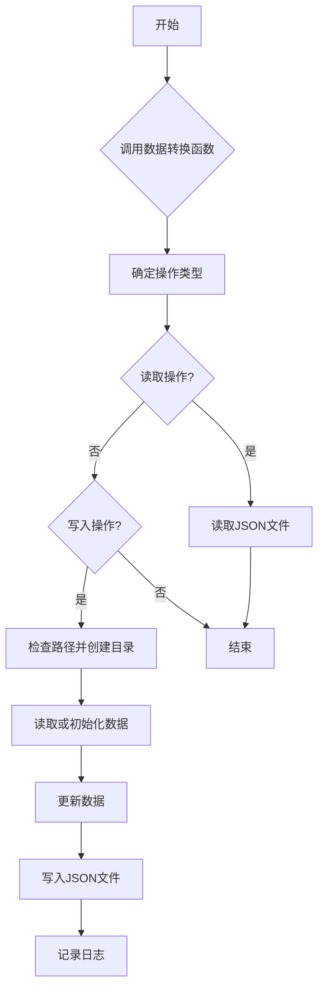
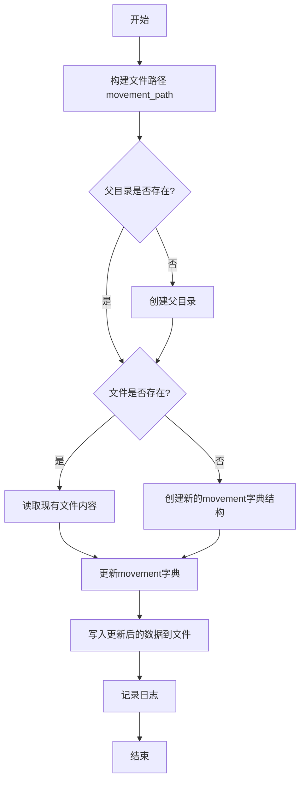
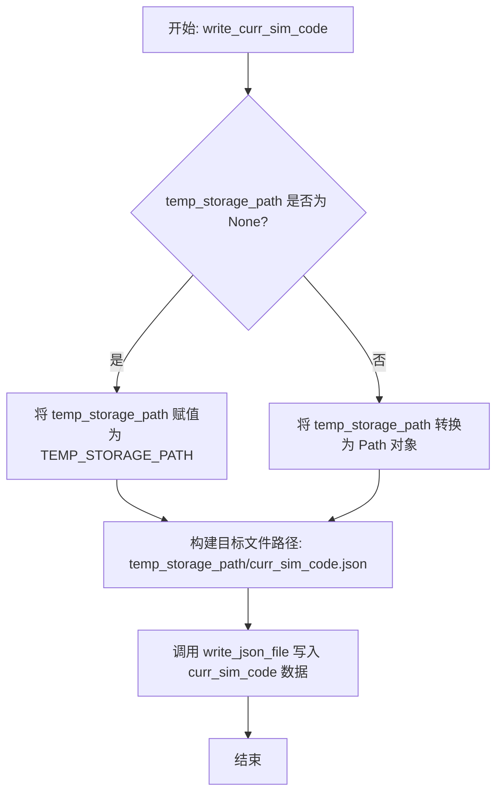
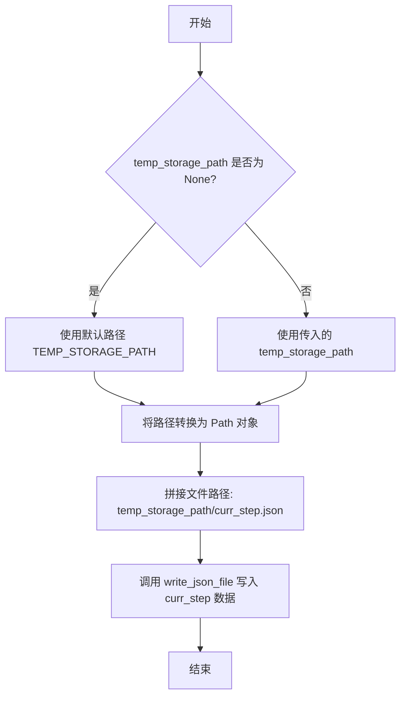

# `.\MetaGPT\metagpt\ext\stanford_town\utils\mg_ga_transform.py` 详细设计文档

该代码文件是MetaGPT框架中Stanford Town扩展的一部分，主要负责在存储系统中进行元数据（mg）与游戏存档（ga）之间的数据转换。具体功能包括读取模拟环境的元数据、保存角色移动状态、保存环境状态、获取角色环境信息以及写入当前模拟代码和步骤到临时存储中。

## 整体流程



## 类结构

```
数据转换模块
├── 全局函数
│   ├── get_reverie_meta
│   ├── save_movement
│   ├── save_environment
│   ├── get_role_environment
│   ├── write_curr_sim_code
│   └── write_curr_step
```

## 全局变量及字段


    

## 全局函数及方法


### `get_reverie_meta`

该函数用于读取指定模拟代码（`sim_code`）对应的“reverie”元数据文件（`meta.json`），并将其内容以字典形式返回。

参数：

-  `sim_code`：`str`，模拟场景的唯一标识代码，用于定位存储路径。

返回值：`dict`，从 `meta.json` 文件中读取并解析出的元数据字典。

#### 流程图

```mermaid
graph TD
    A[开始: get_reverie_meta(sim_code)] --> B[构建文件路径: STORAGE_PATH/sim_code/reverie/meta.json]
    B --> C[调用 read_json_file 读取文件]
    C --> D{文件读取成功?}
    D -- 是 --> E[返回解析后的字典 reverie_meta]
    D -- 否 --> F[抛出异常或返回空结构]
    F --> E
    E --> G[结束]
```

#### 带注释源码

```python
def get_reverie_meta(sim_code: str) -> dict:
    # 根据传入的模拟代码 sim_code，拼接出元数据文件 meta.json 的完整路径。
    # 路径结构为: STORAGE_PATH/sim_code/reverie/meta.json
    meta_file_path = STORAGE_PATH.joinpath(sim_code).joinpath("reverie/meta.json")
    
    # 调用工具函数 read_json_file 读取指定路径的 JSON 文件，并将其内容解析为 Python 字典。
    reverie_meta = read_json_file(meta_file_path)
    
    # 返回解析得到的元数据字典。
    return reverie_meta
```


### `save_movement`

该函数用于保存角色在特定模拟步骤中的移动信息。它将角色的移动数据（`role_move`）与当前时间戳一起写入到指定路径的JSON文件中。如果目标文件已存在，则读取并更新其内容；如果不存在，则创建新的文件结构。该函数主要用于在模拟过程中持久化角色的位置和状态变化。

参数：

-  `role_name`：`str`，角色名称，用于标识移动数据所属的角色
-  `role_move`：`dict`，角色的移动数据，包含位置、方向等信息
-  `step`：`int`，模拟步骤编号，用于确定保存文件的名称
-  `sim_code`：`str`，模拟代码标识，用于构建存储路径
-  `curr_time`：`str`，当前时间，将被格式化为字符串并保存到文件的meta部分

返回值：`None`，该函数没有返回值，其主要作用是执行文件写入操作

#### 流程图



#### 带注释源码

```python
def save_movement(role_name: str, role_move: dict, step: int, sim_code: str, curr_time: str):
    # 构建存储移动数据的文件路径，路径格式为：{STORAGE_PATH}/{sim_code}/movement/{step}.json
    movement_path = STORAGE_PATH.joinpath(f"{sim_code}/movement/{step}.json")
    
    # 检查父目录是否存在，如果不存在则创建（exist_ok=True确保目录已存在时不会报错）
    if not movement_path.parent.exists():
        movement_path.parent.mkdir(exist_ok=True)
    
    # 检查目标文件是否已存在
    if movement_path.exists():
        # 如果文件存在，读取现有的JSON数据
        movement = read_json_file(movement_path)
    else:
        # 如果文件不存在，创建新的数据结构，包含persona和meta两个空字典
        movement = {"persona": dict(), "meta": dict()}
    
    # 将当前角色的移动数据添加到movement字典的persona部分，以角色名称为键
    movement["persona"][role_name] = role_move
    
    # 将当前时间格式化为字符串（格式：月 日, 年, 时:分:秒）并保存到meta部分
    movement["meta"]["curr_time"] = curr_time.strftime("%B %d, %Y, %H:%M:%S")
    
    # 将更新后的movement字典写入到JSON文件中
    write_json_file(movement_path, movement)
    
    # 记录日志，包含步骤编号和当前时间信息
    logger.info(f"save_movement at step: {step}, curr_time: {movement['meta']['curr_time']}")
```


### `save_environment`

该函数用于将指定角色在特定模拟步骤中的环境位置信息（坐标）保存到JSON文件中。它首先确保目标目录存在，然后读取或初始化环境数据文件，接着更新或添加该角色的位置信息，最后将更新后的数据写回文件并记录日志。

参数：

-  `role_name`：`str`，需要保存环境信息的角色名称。
-  `step`：`int`，当前的模拟步骤编号。
-  `sim_code`：`str`，模拟场景的唯一标识码。
-  `movement`：`list[int]`，一个包含两个整数的列表，分别代表角色在环境中的x坐标和y坐标。

返回值：`None`，该函数不返回任何值，其主要作用是将数据写入文件系统。

#### 流程图

```mermaid
flowchart TD
    A[开始: save_environment] --> B[构建文件路径 environment_path]
    B --> C{检查父目录是否存在?}
    C -- 否 --> D[创建父目录]
    C -- 是 --> E
    D --> E{检查文件是否存在?}
    E -- 是 --> F[读取现有JSON数据到environment]
    E -- 否 --> G[初始化environment为空字典]
    F --> H
    G --> H[更新environment字典<br>environment[role_name] = {'maze': 'the_ville', 'x': movement[0], 'y': movement[1]}]
    H --> I[将environment字典写入JSON文件]
    I --> J[记录日志]
    J --> K[结束]
```

#### 带注释源码

```python
def save_environment(role_name: str, step: int, sim_code: str, movement: list[int]):
    # 根据模拟代码和步骤号，构建环境数据文件的存储路径。
    environment_path = STORAGE_PATH.joinpath(f"{sim_code}/environment/{step}.json")
    # 检查目标文件的父目录是否存在，如果不存在则创建它（包括任何必要的中间目录）。
    if not environment_path.parent.exists():
        environment_path.parent.mkdir(exist_ok=True)
    # 检查目标文件是否已经存在。
    if environment_path.exists():
        # 如果文件存在，读取其JSON内容到environment变量中。
        environment = read_json_file(environment_path)
    else:
        # 如果文件不存在，初始化environment为一个空字典。
        environment = {}

    # 更新environment字典，为指定的角色名设置其环境信息。
    # 信息包括固定的迷宫名称'the_ville'以及从movement列表中获取的x, y坐标。
    environment[role_name] = {"maze": "the_ville", "x": movement[0], "y": movement[1]}
    # 将更新后的environment字典写回到JSON文件中。
    write_json_file(environment_path, environment)
    # 记录一条信息日志，表明在哪个步骤保存了环境信息。
    logger.info(f"save_environment at step: {step}")
```


### `get_role_environment`

该函数用于从指定模拟环境（sim_code）的特定步骤（step）的存储文件中，读取并返回指定角色（role_name）的环境信息（如迷宫名称和坐标）。如果文件不存在或角色信息不存在，则返回 `None`。

参数：

-  `sim_code`：`str`，模拟环境的唯一标识符，用于定位存储路径。
-  `role_name`：`str`，需要获取环境信息的角色名称。
-  `step`：`int`，模拟的步骤编号，默认为0，用于定位特定步骤的环境文件。

返回值：`dict`，包含指定角色在指定步骤的环境信息字典（例如 `{"maze": "the_ville", "x": 10, "y": 20}`）。如果文件不存在或角色信息不存在，则返回 `None`。

#### 流程图

```mermaid
flowchart TD
    A[开始: get_role_environment(sim_code, role_name, step)] --> B[构造环境文件路径 env_path]
    B --> C{env_path 文件是否存在?}
    C -- 是 --> D[读取 env_path 文件内容到 env_info]
    D --> E[从 env_info 中获取 role_name 对应的值到 role_env]
    E --> F[返回 role_env]
    C -- 否 --> G[设置 role_env 为 None]
    G --> F
```

#### 带注释源码

```python
def get_role_environment(sim_code: str, role_name: str, step: int = 0) -> dict:
    # 根据 sim_code 和 step 构造环境信息 JSON 文件的存储路径
    env_path = STORAGE_PATH.joinpath(f"{sim_code}/environment/{step}.json")
    role_env = None
    # 检查目标文件是否存在
    if env_path.exists():
        # 如果文件存在，则读取其 JSON 内容到 env_info 字典
        env_info = read_json_file(env_path)
        # 从 env_info 字典中尝试获取指定 role_name 对应的值
        # 如果 role_name 不存在，则 get 方法返回 None
        role_env = env_info.get(role_name, None)

    # 返回获取到的角色环境信息（可能为字典或 None）
    return role_env
```


### `write_curr_sim_code`

该函数用于将当前的模拟代码信息（`curr_sim_code`）写入到一个JSON文件中。它接受一个可选的临时存储路径参数，如果未提供，则使用默认的临时存储路径。函数的核心操作是序列化传入的字典数据并将其保存到指定路径下的 `curr_sim_code.json` 文件中。

参数：

-  `curr_sim_code`：`dict`，包含当前模拟代码信息的字典，将被写入JSON文件。
-  `temp_storage_path`：`Optional[Path]`，可选的临时存储路径。如果为 `None`，则使用模块常量 `TEMP_STORAGE_PATH` 作为默认路径。

返回值：`None`，该函数没有返回值，其主要作用是执行文件写入的副作用。

#### 流程图



#### 带注释源码

```python
def write_curr_sim_code(curr_sim_code: dict, temp_storage_path: Optional[Path] = None):
    # 步骤1: 确定临时存储路径
    # 如果调用者没有提供 `temp_storage_path` 参数，则使用模块中定义的默认常量 `TEMP_STORAGE_PATH`。
    if temp_storage_path is None:
        temp_storage_path = TEMP_STORAGE_PATH
    else:
        # 如果提供了路径，确保它是一个 `Path` 对象，以便后续进行路径操作。
        temp_storage_path = Path(temp_storage_path)

    # 步骤2: 构建完整的文件路径并写入数据
    # 在确定的临时存储路径下，创建名为 `curr_sim_code.json` 的文件路径。
    # 调用 `write_json_file` 工具函数，将 `curr_sim_code` 字典序列化为JSON格式并写入该文件。
    write_json_file(temp_storage_path.joinpath("curr_sim_code.json"), curr_sim_code)
```


### `write_curr_step`

该函数用于将当前步骤信息（`curr_step`）以JSON格式写入到指定的临时存储路径下的`curr_step.json`文件中。如果未提供临时存储路径，则使用默认的`TEMP_STORAGE_PATH`。

参数：

-  `curr_step`：`dict`，包含当前步骤信息的字典。
-  `temp_storage_path`：`Optional[Path]`，可选的临时存储路径。如果为None，则使用默认路径。

返回值：`None`，该函数没有返回值，其主要作用是执行文件写入操作。

#### 流程图



#### 带注释源码

```python
def write_curr_step(curr_step: dict, temp_storage_path: Optional[Path] = None):
    # 检查是否提供了临时存储路径参数
    if temp_storage_path is None:
        # 如果未提供，则使用模块中定义的默认临时存储路径常量
        temp_storage_path = TEMP_STORAGE_PATH
    else:
        # 如果提供了路径（可能是字符串），则确保其转换为 Path 对象以便后续操作
        temp_storage_path = Path(temp_storage_path)
    # 构建目标文件的完整路径：临时存储路径下的 "curr_step.json"
    # 调用 write_json_file 函数，将 curr_step 字典序列化为 JSON 并写入该文件
    write_json_file(temp_storage_path.joinpath("curr_step.json"), curr_step)
```


## 关键组件


### 存储路径管理

定义了核心存储路径常量（`STORAGE_PATH`, `TEMP_STORAGE_PATH`），并基于这些路径构建了用于读写模拟数据（如元数据、角色移动、环境状态）的文件路径，是数据持久化的基础。

### 模拟元数据管理

通过 `get_reverie_meta` 函数，从指定模拟代码（`sim_code`）对应的存储路径中读取并返回 `meta.json` 文件的内容，为系统提供模拟的全局配置和状态信息。

### 角色移动数据持久化

通过 `save_movement` 函数，将特定角色在特定时间步（`step`）的移动数据（`role_move`）和当前模拟时间（`curr_time`）以JSON格式保存到文件系统中，支持增量更新（读取现有文件后追加新数据）。

### 环境状态数据持久化

通过 `save_environment` 函数，将特定角色在特定时间步（`step`）的环境坐标信息（`movement`）以JSON格式保存到文件系统中，同样支持增量更新，用于记录角色在虚拟空间中的位置。

### 环境状态查询

通过 `get_role_environment` 函数，根据模拟代码（`sim_code`）、角色名（`role_name`）和时间步（`step`）从文件系统中读取并返回特定角色的环境状态信息，支持按需数据检索。

### 运行时状态暂存

通过 `write_curr_sim_code` 和 `write_curr_step` 函数，将当前正在运行的模拟代码和模拟步数信息写入临时存储路径（默认为 `TEMP_STORAGE_PATH`），用于维护跨进程或会话的运行时状态。


## 问题及建议


### 已知问题

-   **硬编码路径与配置**：代码中大量使用了 `STORAGE_PATH` 和 `TEMP_STORAGE_PATH` 等硬编码的全局常量来构建文件路径。这使得代码与特定的目录结构强耦合，降低了可配置性和可移植性。例如，`get_reverie_meta`、`save_movement` 等函数都直接依赖这些常量。
-   **重复的路径构建与目录检查逻辑**：`save_movement` 和 `save_environment` 函数中存在几乎相同的代码块，用于检查父目录是否存在并创建，以及读取或初始化JSON文件。这种重复违反了DRY（Don‘t Repeat Yourself）原则，增加了维护成本和出错风险。
-   **脆弱的文件存在性检查**：`get_role_environment` 函数在读取环境文件时，如果文件不存在或角色数据不存在，会静默地返回 `None`。调用方必须处理这个潜在的 `None` 返回值，否则可能导致后续操作失败。这种隐式的错误处理方式不够健壮。
-   **函数职责不单一**：`save_movement` 函数不仅保存角色移动数据，还负责处理 `curr_time` 的格式化并更新到 `meta` 字段中。这混合了数据持久化和数据格式转换的职责，使得函数功能不够内聚。
-   **缺乏输入验证**：函数如 `save_movement`、`save_environment` 等接受外部输入（如 `sim_code`, `role_name`, `step`），但代码中没有对这些输入进行有效性或安全性检查（例如，防止路径遍历攻击）。
-   **日志级别可能不恰当**：`save_movement` 和 `save_environment` 函数在每次成功保存时都使用 `logger.info` 记录日志。在频繁调用的场景下，这可能会产生大量日志输出，影响性能并淹没更重要的日志信息。

### 优化建议

-   **引入配置管理或依赖注入**：将存储路径等配置项抽象出来，通过配置文件、环境变量或构造函数参数传入，而不是硬编码在模块级别。可以创建一个 `StorageManager` 类，在初始化时接收基础路径，从而解耦代码与具体路径。
-   **抽象公共的路径与文件操作**：将创建目录、检查文件存在性、读取/初始化JSON文件等公共操作提取为独立的辅助函数或基类方法。例如，可以创建一个 `_ensure_and_read_json(file_path, default_data)` 私有函数供其他函数调用。
-   **改进错误处理机制**：对于 `get_role_environment` 这类查询函数，当数据不存在时，可以考虑返回一个明确的空字典 `{}` 或抛出一个自定义的、语义更清晰的异常（如 `EnvironmentNotFoundError`），让调用方必须显式处理缺失情况，提高代码的健壮性。
-   **重构函数以遵循单一职责原则**：将 `save_movement` 函数中格式化时间等业务逻辑分离出去。可以创建一个专门用于准备或格式化要保存的数据结构的函数，而 `save_movement` 只负责将给定的数据结构写入文件。
-   **增加输入验证与清理**：在函数开始处，对输入的 `sim_code`、`role_name` 等参数进行验证，确保它们不包含非法字符（如 `/`, `\`, `..` 等），防止路径注入攻击。可以使用 `pathlib` 的安全路径连接功能。
-   **调整日志策略**：考虑将 `save_movement` 和 `save_environment` 的成功日志级别从 `info` 调整为 `debug`，或者添加一个条件判断（例如，仅在特定调试模式下记录），以减少生产环境中的日志噪音。关键的错误或状态变更仍应使用 `info` 或更高级别记录。
-   **考虑使用更高效的数据结构或序列化方式**：如果存储的数据量非常大或读写非常频繁，评估当前JSON格式是否是最佳选择。可以考虑使用更高效的二进制格式（如 `pickle`，但需注意安全性）或专门的序列化库，或者引入缓存机制来减少磁盘I/O。


## 其它


### 设计目标与约束

本模块的核心设计目标是实现斯坦福小镇（Stanford Town）模拟器中游戏引擎（GA）与MetaGPT框架（MG）之间的数据转换与持久化存储。它作为两个系统间的数据桥梁，专注于将模拟过程中的角色移动（movement）、环境状态（environment）以及模拟元数据（meta）以JSON格式序列化到文件系统中，并从文件系统中读取这些数据。主要约束包括：1) 强依赖特定的文件系统目录结构（`STORAGE_PATH`和`TEMP_STORAGE_PATH`定义的路径）；2) 数据格式需与斯坦福小镇原项目的存储约定保持一致；3) 操作需是幂等的（如目录创建使用`exist_ok=True`）；4) 性能上非关键路径，但需保证读写操作的可靠性。

### 错误处理与异常设计

模块采用隐式的错误处理策略，主要依赖底层函数（如`read_json_file`, `write_json_file`）和标准库（如`pathlib`）抛出异常。例如，当JSON文件不存在或格式错误时，`read_json_file`可能抛出`FileNotFoundError`或`JSONDecodeError`；当目录创建失败时，`mkdir`可能抛出`PermissionError`。模块本身未显式捕获或处理这些异常，意味着调用方需要负责处理。日志记录用于跟踪操作状态（如`logger.info`），但未记录错误。这是一种“故障快速”（fail-fast）的设计，将错误处理的责任上移。对于`get_role_environment`函数，在文件不存在或键缺失时返回`None`，这是一种温和的错误处理方式。

### 数据流与状态机

数据流是单向和离散的，围绕“步骤”（step）概念组织。核心数据流包括：1) **写入流**：`save_movement`和`save_environment`函数接收来自上游（可能是游戏引擎事件）的角色名称、移动数据、环境坐标、当前步骤和模拟时间，将其合并或更新到以步骤命名的JSON文件中。`write_curr_sim_code`和`write_curr_step`将当前模拟的标识和步骤写入临时存储。2) **读取流**：`get_reverie_meta`读取模拟的元数据文件；`get_role_environment`根据模拟代码、角色名和步骤读取特定的环境状态。系统没有维护一个集中的运行时状态机，状态完全由文件系统中的JSON文件序列体现，每个文件代表模拟在某个步骤的快照。

### 外部依赖与接口契约

1.  **文件系统路径**：强依赖两个全局常量`STORAGE_PATH`和`TEMP_STORAGE_PATH`（从`metagpt.ext.stanford_town.utils.const`导入），定义了存储的根目录结构。模块假设这些路径是可访问且具有适当权限的。
2.  **工具函数**：依赖`metagpt.utils.common`中的`read_json_file`和`write_json_file`函数进行JSON的序列化与反序列化。契约是这些函数接收`Path`对象并返回字典或写入文件。
3.  **日志系统**：依赖`metagpt.logs.logger`进行信息级日志输出。
4.  **数据格式契约**：
    *   与`reverie/meta.json`的格式约定。
    *   `movement/{step}.json`文件需包含`"persona"`和`"meta"`顶级键。
    *   `environment/{step}.json`文件是一个字典，键为角色名，值为包含`"maze"`、`"x"`、`"y"`的字典。
    *   `curr_sim_code.json`和`curr_step.json`的格式由调用方决定。
5.  **调用方契约**：函数期望调用方提供正确格式的输入，特别是`curr_time`参数在`save_movement`中应为包含`strftime`方法的对象（如`datetime`）。

### 安全与权限考虑

模块设计未包含显式的安全机制。它直接操作文件系统，因此其安全性完全依赖于运行环境的配置：1) 应用程序应运行在具有适当文件系统权限的用户上下文中，以避免`PermissionError`。2) `STORAGE_PATH`和`TEMP_STORAGE_PATH`应指向受控的、非公开目录，防止路径遍历攻击。虽然代码中使用了`Path`对象（相对于`os.path.join`）提供了一定的路径安全性，但未对输入参数（如`sim_code`, `role_name`）进行净化以防范目录遍历。在实际部署中，应由上层调用确保这些参数是安全的。

### 配置管理

模块的配置极其简单且硬编码，主要通过导入的常量`STORAGE_PATH`和`TEMP_STORAGE_PATH`进行管理。这些常量决定了所有数据文件的存储位置。模块提供了有限的灵活性：`write_curr_sim_code`和`write_curr_step`函数允许通过可选参数`temp_storage_path`覆盖临时的存储路径，但主要的持久化存储路径（`STORAGE_PATH`）是不可配置的。这种设计将配置责任完全交给了定义这些常量的模块（`const.py`），使得存储结构的变更需要修改代码并重新部署，而非通过配置文件。

    