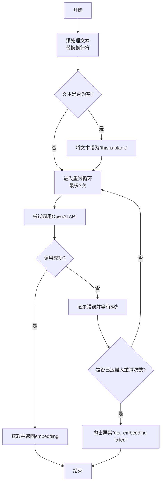
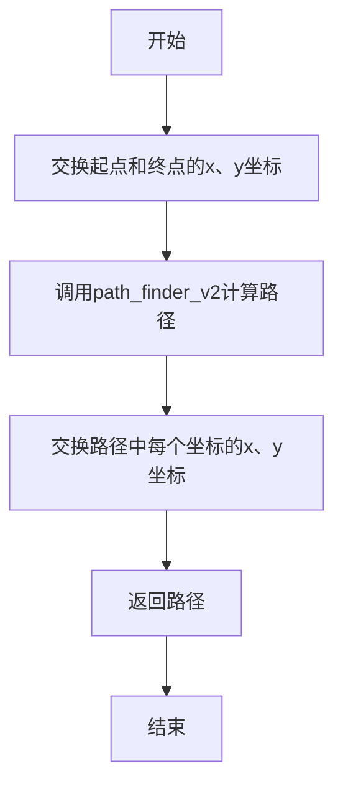
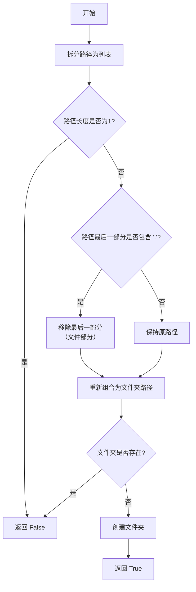
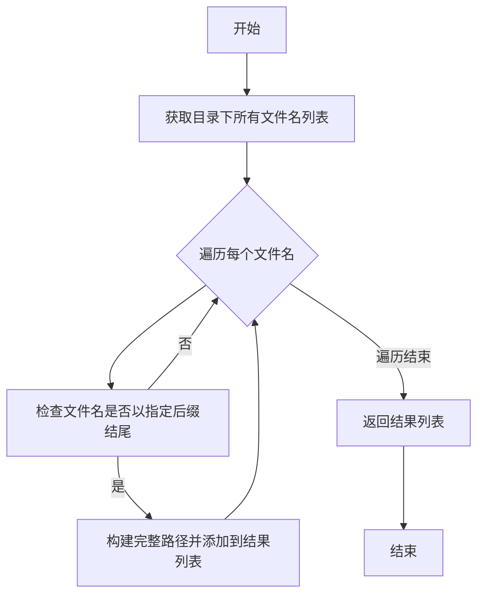

# `.\MetaGPT\metagpt\ext\stanford_town\utils\utils.py` 详细设计文档

该文件是一个通用工具集，提供了多种辅助功能，包括：读取CSV文件并转换为列表结构、通过OpenAI API获取文本的嵌入向量、从字符串中提取第一个JSON字典、在二维网格中实现路径查找算法（支持障碍物）、创建目录、查找特定后缀的文件以及复制文件夹。这些功能主要用于数据处理、文件操作和基础AI服务集成。

## 整体流程

```mermaid
graph TD
    A[开始] --> B{调用工具函数}
    B --> C[read_csv_to_list]
    C --> D[读取CSV文件]
    D --> E{是否包含表头?}
    E -- 否 --> F[返回所有行列表]
    E -- 是 --> G[返回(表头, 数据行)]
    B --> H[get_embedding]
    H --> I[调用OpenAI Embedding API]
    I --> J{成功?}
    J -- 是 --> K[返回嵌入向量]
    J -- 否 --> L[重试最多3次]
    L --> M{重试成功?}
    M -- 是 --> K
    M -- 否 --> N[抛出ValueError]
    B --> O[extract_first_json_dict]
    O --> P[在字符串中查找第一个JSON对象]
    P --> Q{找到并解析成功?}
    Q -- 是 --> R[返回字典]
    Q -- 否 --> S[返回None]
    B --> T[path_finder]
    T --> U[转换坐标并调用path_finder_v2]
    U --> V[执行路径查找算法]
    V --> W[返回路径坐标列表]
    B --> X[create_folder_if_not_there]
    X --> Y{路径对应的文件夹是否存在?}
    Y -- 否 --> Z[创建文件夹并返回True]
    Y -- 是 --> AA[返回False]
    B --> AB[find_filenames]
    AB --> AC[列出目录下所有文件]
    AC --> AD[过滤出指定后缀的文件]
    AD --> AE[返回文件路径列表]
    B --> AF[copy_folder]
    AF --> AG{目标文件夹是否存在?}
    AG -- 是 --> AH[删除目标文件夹]
    AG -- 否 --> AI[复制源文件夹到目标位置]
    AI --> AJ[处理可能的OSError异常]
    AJ --> AK[完成复制]
```

## 类结构

```
utils.py (工具函数集合)
├── 文件操作类
│   ├── read_csv_to_list
│   ├── create_folder_if_not_there
│   ├── find_filenames
│   └── copy_folder
├── 数据处理类
│   ├── get_embedding
│   └── extract_first_json_dict
└── 算法类
    ├── path_finder_v2
    └── path_finder
```

## 全局变量及字段


    

## 全局函数及方法

### `read_csv_to_list`

读取CSV文件并将其内容转换为列表的列表。如果指定了`header`参数，则返回一个元组，包含表头行和所有数据行。

参数：

- `curr_file`：`str`，CSV文件的路径。
- `header`：`bool`，可选参数，默认为`False`。如果为`True`，则返回一个元组，包含表头行和所有数据行。
- `strip_trail`：`bool`，可选参数，默认为`True`。如果为`True`，则去除每个单元格值的前后空格。

返回值：`list` 或 `tuple`，如果`header`为`False`，返回一个列表的列表，每个子列表代表CSV文件的一行；如果`header`为`True`，返回一个元组，第一个元素是表头行（列表），第二个元素是数据行（列表的列表）。

#### 流程图

```mermaid
flowchart TD
    A[开始] --> B{是否包含表头?}
    B -- 否 --> C[初始化空列表 analysis_list]
    C --> D[打开CSV文件]
    D --> E[逐行读取CSV文件]
    E --> F{是否去除空格?}
    F -- 是 --> G[去除每行单元格的前后空格]
    F -- 否 --> H[保持原样]
    G --> I[将处理后的行添加到 analysis_list]
    H --> I
    I --> J[返回 analysis_list]
    B -- 是 --> K[初始化空列表 analysis_list]
    K --> L[打开CSV文件]
    L --> M[逐行读取CSV文件]
    M --> N{是否去除空格?}
    N -- 是 --> O[去除每行单元格的前后空格]
    N -- 否 --> P[保持原样]
    O --> Q[将处理后的行添加到 analysis_list]
    P --> Q
    Q --> R[返回表头行和数据行]
    R --> S[返回元组 (analysis_list[0], analysis_list[1:])]
```

#### 带注释源码

```python
def read_csv_to_list(curr_file: str, header=False, strip_trail=True):
    """
    Reads in a csv file to a list of list. If header is True, it returns a
    tuple with (header row, all rows)
    ARGS:
      curr_file: path to the current csv file.
    RETURNS:
      List of list where the component lists are the rows of the file.
    """
    logger.debug(f"start read csv: {curr_file}")  # 记录开始读取CSV文件的日志
    if not header:  # 如果不包含表头
        analysis_list = []  # 初始化空列表
        with open(curr_file) as f_analysis_file:  # 打开CSV文件
            data_reader = csv.reader(f_analysis_file, delimiter=",")  # 创建CSV读取器
            for count, row in enumerate(data_reader):  # 逐行读取CSV文件
                if strip_trail:  # 如果指定去除空格
                    row = [i.strip() for i in row]  # 去除每行单元格的前后空格
                analysis_list += [row]  # 将处理后的行添加到列表中
        return analysis_list  # 返回列表的列表
    else:  # 如果包含表头
        analysis_list = []  # 初始化空列表
        with open(curr_file) as f_analysis_file:  # 打开CSV文件
            data_reader = csv.reader(f_analysis_file, delimiter=",")  # 创建CSV读取器
            for count, row in enumerate(data_reader):  # 逐行读取CSV文件
                if strip_trail:  # 如果指定去除空格
                    row = [i.strip() for i in row]  # 去除每行单元格的前后空格
                analysis_list += [row]  # 将处理后的行添加到列表中
        return analysis_list[0], analysis_list[1:]  # 返回表头行和数据行的元组
```

### `get_embedding`

该函数用于调用OpenAI的Embedding API，将输入的文本转换为向量表示（embedding）。它会对文本进行预处理（如替换换行符），并内置了重试机制以应对可能的API调用失败。

参数：

- `text`：`str`，需要转换为embedding的文本内容。
- `model`：`str`，可选，指定使用的OpenAI embedding模型，默认为`"text-embedding-ada-002"`。

返回值：`list[float]`，返回文本对应的embedding向量（浮点数列表）。

#### 流程图



#### 带注释源码

```python
def get_embedding(text, model: str = "text-embedding-ada-002"):
    # 1. 文本预处理：将换行符替换为空格，确保文本格式符合API要求。
    text = text.replace("\n", " ")
    # 2. 初始化embedding变量。
    embedding = None
    # 3. 处理空文本：如果输入文本为空，则使用默认文本“this is blank”。
    if not text:
        text = "this is blank"
    # 4. 重试机制：最多尝试3次调用API。
    for idx in range(3):
        try:
            # 5. 调用OpenAI Embedding API。
            #    - 使用配置中的API密钥初始化OpenAI客户端。
            #    - 创建embedding请求，输入文本和模型。
            #    - 从响应中提取第一个（也是唯一一个）embedding数据。
            embedding = (
                OpenAI(api_key=config.llm.api_key).embeddings.create(input=[text], model=model).data[0].embedding
            )
        except Exception as exp:
            # 6. 异常处理：如果调用失败，记录日志并等待5秒后重试。
            logger.info(f"get_embedding failed, exp: {exp}, will retry.")
            time.sleep(5)
    # 7. 最终检查：如果3次尝试后仍未获得embedding，抛出异常。
    if not embedding:
        raise ValueError("get_embedding failed")
    # 8. 返回成功的embedding结果。
    return embedding
```

### `extract_first_json_dict`

该函数用于从一个字符串中提取第一个完整的JSON字典（即从第一个 `{` 开始到匹配的 `}` 结束的部分），并尝试将其解析为Python字典。如果字符串中没有找到有效的JSON字典，则返回 `None`。

参数：

- `data_str`：`str`，输入的字符串，可能包含JSON数据或其他文本。

返回值：`Union[None, dict]`，如果成功提取并解析JSON字典，则返回该字典；否则返回 `None`。

#### 流程图

```mermaid
flowchart TD
    A[开始] --> B[查找第一个 '{' 的位置 start_idx]
    B --> C{start_idx 是否找到?}
    C -->|否| D[返回 None]
    C -->|是| E[从 start_idx 开始查找第一个 '}' 的位置 end_idx]
    E --> F{end_idx 是否找到?}
    F -->|否| D
    F -->|是| G[提取子字符串 json_str]
    G --> H[尝试解析 json_str 为字典]
    H --> I{解析是否成功?}
    I -->|是| J[返回解析后的字典]
    I -->|否| D
```

#### 带注释源码

```python
def extract_first_json_dict(data_str: str) -> Union[None, dict]:
    # Find the first occurrence of a JSON object within the string
    # 在字符串中查找第一个 '{' 的位置
    start_idx = data_str.find("{")
    # 从 start_idx 开始查找第一个 '}' 的位置，并加1以包含该字符
    end_idx = data_str.find("}", start_idx) + 1

    # Check if both start and end indices were found
    # 检查是否成功找到起始和结束位置
    if start_idx == -1 or end_idx == 0:
        # 如果未找到 '{' 或 '}'，返回 None
        return None

    # Extract the first JSON dictionary
    # 提取第一个 JSON 字典的字符串表示
    json_str = data_str[start_idx:end_idx]

    try:
        # Attempt to parse the JSON data
        # 尝试将字符串解析为 JSON 字典
        json_dict = json.loads(json_str)
        return json_dict
    except json.JSONDecodeError:
        # If parsing fails, return None
        # 如果解析失败（例如字符串不是有效的 JSON），返回 None
        return None
```


### `path_finder_v2`

`path_finder_v2` 是一个基于波前传播（Wavefront Propagation）或 Lee 算法的迷宫寻路函数。它接收一个二维网格（迷宫）、起点坐标、终点坐标以及一个表示障碍物的字符，返回从起点到终点的一条最短路径（如果存在）。该算法通过从起点开始逐步向外标记距离，直到到达终点，然后反向回溯构建路径。

参数：

-  `a`：`list`，一个二维列表，表示迷宫地图。每个元素通常是一个字符或数字，用于标识该位置是空地还是障碍物。
-  `start`：`tuple[int, int]`，起点坐标，格式为 `(行索引, 列索引)`。
-  `end`：`tuple[int, int]`，终点坐标，格式为 `(行索引, 列索引)`。
-  `collision_block_char`：`str`，一个字符，用于在输入迷宫 `a` 中标识障碍物位置。

返回值：`list[tuple[int, int]]`，一个坐标列表，表示从起点到终点的路径。每个坐标是一个 `(行索引, 列索引)` 元组。如果找不到路径，可能返回一个不包含终点的路径或空列表（取决于异常处理逻辑）。

#### 流程图

```mermaid
flowchart TD
    A[开始: 输入迷宫a, 起点start, 终点end, 障碍字符] --> B[预处理迷宫: 将障碍字符转换为1，空地转换为0]
    B --> C[初始化距离矩阵m: 与迷宫同大小，初始值为0]
    C --> D[标记起点: m[start] = 1]
    D --> E{终点是否已被标记?}
    E -- 是 --> F[进入回溯阶段]
    E -- 否 --> G[执行一步波前传播: make_step(m, k)]
    G --> H[迭代计数器k加1]
    H --> I[安全计数器except_handle减1]
    I --> J{安全计数器是否耗尽?}
    J -- 是 --> K[强制跳出循环]
    J -- 否 --> E
    K --> F
    F --> L[从终点end开始回溯]
    L --> M{当前距离k是否大于1?}
    M -- 是 --> N[检查上下左右四个邻居<br>寻找距离值为k-1的单元格]
    N --> O[移动到该邻居单元格<br>将其坐标加入路径<br>k减1]
    O --> M
    M -- 否 --> P[路径列表反转]
    P --> Q[返回路径]
```

#### 带注释源码

```python
def path_finder_v2(a, start, end, collision_block_char) -> list[int]:
    # 内部函数：执行单步波前传播。将距离值为k的单元格的四个相邻空地（在迷宫a和距离矩阵m中均为0）标记为k+1。
    def make_step(m, k):
        for i in range(len(m)):
            for j in range(len(m[i])):
                if m[i][j] == k:
                    # 检查上、左、下、右四个方向
                    if i > 0 and m[i - 1][j] == 0 and a[i - 1][j] == 0:
                        m[i - 1][j] = k + 1
                    if j > 0 and m[i][j - 1] == 0 and a[i][j - 1] == 0:
                        m[i][j - 1] = k + 1
                    if i < len(m) - 1 and m[i + 1][j] == 0 and a[i + 1][j] == 0:
                        m[i + 1][j] = k + 1
                    if j < len(m[i]) - 1 and m[i][j + 1] == 0 and a[i][j + 1] == 0:
                        m[i][j + 1] = k + 1

    # 1. 预处理迷宫：将字符表示的障碍物转换为0/1矩阵，1代表障碍物，0代表可通行。
    new_maze = []
    for row in a:
        new_row = []
        for j in row:
            if j == collision_block_char:
                new_row += [1]  # 障碍物
            else:
                new_row += [0]  # 空地
        new_maze += [new_row]
    a = new_maze  # 此后，a是一个0/1矩阵

    # 2. 初始化距离矩阵m，大小与迷宫相同，所有值初始为0。
    m = []
    for i in range(len(a)):
        m.append([])
        for j in range(len(a[i])):
            m[-1].append(0)

    # 3. 标记起点，距离值为1。
    i, j = start
    m[i][j] = 1

    # 4. 波前传播阶段：不断传播，直到终点被标记，或达到最大迭代次数。
    k = 0  # 当前传播的距离值
    except_handle = 150  # 安全计数器，防止无限循环（例如在无解的大迷宫中）
    while m[end[0]][end[1]] == 0:  # 终点尚未被访问
        k += 1
        make_step(m, k)  # 执行一步传播

        if except_handle == 0:
            break  # 安全计数器耗尽，强制退出
        except_handle -= 1

    # 5. 回溯阶段：从终点开始，根据距离矩阵反向查找一条路径回起点。
    i, j = end
    k = m[i][j]  # 终点处的距离值
    the_path = [(i, j)]  # 路径列表，初始包含终点
    while k > 1:  # 当还未回溯到起点（距离值1）时
        # 检查四个邻居，寻找距离值为k-1的单元格
        if i > 0 and m[i - 1][j] == k - 1:
            i, j = i - 1, j
            the_path.append((i, j))
            k -= 1
        elif j > 0 and m[i][j - 1] == k - 1:
            i, j = i, j - 1
            the_path.append((i, j))
            k -= 1
        elif i < len(m) - 1 and m[i + 1][j] == k - 1:
            i, j = i + 1, j
            the_path.append((i, j))
            k -= 1
        elif j < len(m[i]) - 1 and m[i][j + 1] == k - 1:
            i, j = i, j + 1
            the_path.append((i, j))
            k -= 1

    # 6. 反转路径，使其从起点指向终点，然后返回。
    the_path.reverse()
    return the_path
```


### `path_finder`

该函数是一个路径查找函数，用于在给定的碰撞迷宫（collision_maze）中，从起点（start）到终点（end）找到一条避开碰撞块（collision_block_char）的路径。它首先对起点和终点坐标进行紧急补丁（交换x和y坐标），然后调用`path_finder_v2`函数计算路径，最后将路径中的坐标再次交换回原始格式并返回。

参数：

- `collision_maze`：`list`，表示碰撞迷宫的二维列表，其中包含碰撞块字符和其他可通行字符。
- `start`：`list[int]`，表示起点的坐标列表，格式为`[x, y]`。
- `end`：`list[int]`，表示终点的坐标列表，格式为`[x, y]`。
- `collision_block_char`：`str`，表示碰撞块的字符标识。

返回值：`list[int]`，返回从起点到终点的路径坐标列表，每个坐标以`(x, y)`元组形式表示。

#### 流程图



#### 带注释源码

```python
def path_finder(collision_maze: list, start: list[int], end: list[int], collision_block_char: str) -> list[int]:
    # EMERGENCY PATCH
    # 紧急补丁：交换起点和终点的x、y坐标
    start = (start[1], start[0])
    end = (end[1], end[0])
    # END EMERGENCY PATCH

    # 调用path_finder_v2函数计算路径
    path = path_finder_v2(collision_maze, start, end, collision_block_char)

    # 将路径中的每个坐标的x、y坐标交换回原始格式
    new_path = []
    for i in path:
        new_path += [(i[1], i[0])]
    path = new_path

    # 返回最终路径
    return path
```

### `create_folder_if_not_there`

检查指定路径的文件夹是否存在，如果不存在则创建该文件夹。如果路径指向一个文件，则操作其所在的父文件夹。

参数：
- `curr_path`：`str`，需要检查或创建的路径。可以是文件路径或文件夹路径。

返回值：`bool`，如果创建了新文件夹则返回 `True`，否则返回 `False`。

#### 流程图



#### 带注释源码

```python
def create_folder_if_not_there(curr_path):
    """
    Checks if a folder in the curr_path exists. If it does not exist, creates
    the folder.
    Note that if the curr_path designates a file location, it will operate on
    the folder that contains the file. But the function also works even if the
    path designates to just a folder.
    Args:
        curr_list: list to write. The list comes in the following form:
                   [['key1', 'val1-1', 'val1-2'...],
                    ['key2', 'val2-1', 'val2-2'...],]
        outfile: name of the csv file to write
    RETURNS:
        True: if a new folder is created
        False: if a new folder is not created
    """
    # 将路径按 '/' 分割成列表
    outfolder_name = curr_path.split("/")
    # 判断路径是否只包含一个部分（即可能是一个简单的文件名或当前目录）
    if len(outfolder_name) != 1:
        # 检查路径的最后一部分是否包含 '.'，以判断是否为文件
        if "." in outfolder_name[-1]:
            # 如果是文件，则移除文件名部分，只保留文件夹路径
            outfolder_name = outfolder_name[:-1]

        # 将列表重新组合成文件夹路径字符串
        outfolder_name = "/".join(outfolder_name)
        # 检查文件夹是否存在
        if not os.path.exists(outfolder_name):
            # 如果不存在，则创建文件夹（包括所有必要的父目录）
            os.makedirs(outfolder_name)
            # 创建了新文件夹，返回 True
            return True

    # 如果路径长度为1（例如只是一个文件名）或文件夹已存在，返回 False
    return False
```

### `find_filenames`

该函数用于在指定目录中查找所有以特定后缀结尾的文件，并返回这些文件的完整路径列表。

参数：

- `path_to_dir`：`str`，要搜索的目录路径。
- `suffix`：`str`，目标文件后缀，默认为`.csv`。

返回值：`list[str]`，包含所有匹配后缀的文件的完整路径列表。

#### 流程图



#### 带注释源码

```python
def find_filenames(path_to_dir, suffix=".csv"):
    """
    给定一个目录，查找所有以指定后缀结尾的文件并返回它们的路径。
    ARGS:
        path_to_dir: 目标目录的路径。
        suffix: 目标文件后缀。
    RETURNS:
        一个包含目录中所有匹配后缀文件的完整路径列表。
    """
    # 获取指定目录下的所有文件和文件夹名称列表
    filenames = os.listdir(path_to_dir)
    # 使用列表推导式，筛选出以指定后缀结尾的文件名，并构建其完整路径
    return [path_to_dir + "/" + filename for filename in filenames if filename.endswith(suffix)]
```

### `copy_folder`

该函数用于将源文件夹复制到目标文件夹。如果目标文件夹已存在，则先删除目标文件夹，然后执行复制操作。在复制过程中，如果遇到非目录错误，会尝试使用文件复制方式处理。

参数：

- `src_folder`：`str`，源文件夹的路径
- `dest_folder`：`str`，目标文件夹的路径

返回值：`None`，无返回值

#### 流程图


#### 带注释源码

```python
def copy_folder(src_folder: str, dest_folder: str):
    try:
        # 检查目标文件夹是否存在
        if Path(dest_folder).exists():
            # 如果存在，记录警告并删除目标文件夹
            logger.warning(f"{dest_folder} exist, start to remove.")
            shutil.rmtree(dest_folder)
        # 复制源文件夹到目标文件夹
        shutil.copytree(src_folder, dest_folder)
    except OSError as exc:  # python >2.5
        # 如果发生OSError，检查错误号是否为ENOTDIR或EINVAL
        if exc.errno in (errno.ENOTDIR, errno.EINVAL):
            # 如果是，使用shutil.copy复制文件
            shutil.copy(src_folder, dest_folder)
        else:
            # 否则，抛出异常
            raise
```

## 关键组件


### 文件操作与路径处理

提供了一系列用于文件系统操作的实用函数，包括创建目录、查找特定后缀文件、复制文件夹以及读取CSV文件到列表结构。

### 文本嵌入生成

通过调用OpenAI的Embedding API，将输入文本转换为向量表示，并内置了简单的重试机制以增强鲁棒性。

### JSON数据提取

从给定的字符串中提取并解析第一个有效的JSON字典对象，用于处理可能包含非JSON前缀或后缀的文本数据。

### 路径查找算法

实现了一个基于广度优先搜索（BFS）的二维网格路径查找算法（`path_finder_v2`），并提供了一个包装函数（`path_finder`）用于处理坐标转换，用于在字符表示的迷宫中寻找从起点到终点的最短路径。


## 问题及建议


### 已知问题

-   **`get_embedding` 函数的重试逻辑不完整**：函数在循环中尝试调用 OpenAI API，但仅在成功时设置 `embedding` 变量。如果所有重试都失败，`embedding` 变量仍为 `None`，最终会抛出 `ValueError`。然而，循环结束后没有检查 `embedding` 是否为 `None` 的逻辑，虽然最后的 `if not embedding:` 检查会捕获此情况，但重试循环的逻辑结构不够清晰和健壮，异常处理与重试逻辑耦合不紧密。
-   **`path_finder` 函数存在硬编码的“紧急补丁”**：函数开头有注释为 `# EMERGENCY PATCH` 的代码块，用于交换起点和终点的坐标。这表明原始算法或数据接口存在坐标系统不一致的问题，但通过临时交换坐标来修复。这种硬编码的补丁降低了代码的可读性和可维护性，且未在函数签名或文档中说明，容易引发误解。
-   **`create_folder_if_not_there` 函数对路径的处理有缺陷**：函数使用字符串分割 (`split("/")`) 来判断路径是文件还是文件夹，并据此决定创建目录。这种方法在 Windows 系统（使用反斜杠 `\` 作为路径分隔符）上会失效，导致逻辑错误。应使用 `os.path` 模块中的函数进行路径操作以提高跨平台兼容性。
-   **`copy_folder` 函数的异常处理可能过于宽泛**：函数捕获 `OSError` 并检查特定的错误码 (`errno.ENOTDIR`, `errno.EINVAL`)，如果不是这些错误则重新抛出。然而，`shutil.copytree` 和 `shutil.copy` 可能抛出其他类型的异常（如 `PermissionError`, `FileNotFoundError`），当前的异常处理逻辑可能无法妥善处理所有情况，导致程序意外终止或行为不明确。
-   **`read_csv_to_list` 函数存在代码重复**：无论 `header` 参数是 `True` 还是 `False`，函数都执行了几乎相同的读取和数据处理逻辑，仅在返回时有所不同。这违反了 DRY（Don't Repeat Yourself）原则，增加了维护成本，并可能引入不一致的修改。

### 优化建议

-   **重构 `get_embedding` 的重试逻辑**：建议使用更清晰的重试结构，例如使用 `for-else` 循环或在循环内成功获取结果后立即返回。同时，可以考虑引入指数退避策略以更友好地处理临时性 API 故障，并记录每次重试的详细信息以便于调试。
-   **消除 `path_finder` 中的硬编码补丁**：应调查坐标不一致的根本原因，并在数据传入函数前或算法内部统一坐标系统。修改 `path_finder_v2` 或调整调用方的数据准备逻辑，使得 `path_finder` 函数无需进行坐标交换，从而提高代码的清晰度和可靠性。
-   **使用 `pathlib` 或 `os.path` 重构路径处理函数**：将 `create_folder_if_not_there` 和 `find_filenames` 函数中的字符串操作替换为 `pathlib.Path` 对象或 `os.path` 函数（如 `os.path.dirname`, `os.path.splitext`）。这能显著提高代码的跨平台兼容性和可读性。例如，`create_folder_if_not_there` 可以直接使用 `Path(curr_path).parent.mkdir(parents=True, exist_ok=True)`。
-   **完善 `copy_folder` 的异常处理**：明确函数可能抛出的异常类型，并在文档中说明。考虑是否需要对更多特定异常（如 `PermissionError`）进行捕获和处理，或者将异常向上层抛出，由调用者决定如何处理。同时，确保在删除目标文件夹 (`shutil.rmtree`) 失败时也有适当的错误处理或日志记录。
-   **重构 `read_csv_to_list` 以消除重复代码**：将共同的读取逻辑提取到一个内部函数或通过条件判断来共享代码。例如，可以先统一读取所有行到 `analysis_list`，然后根据 `header` 参数决定是返回整个列表还是拆分出头行和剩余行。这能简化函数结构，减少未来修改时出错的风险。
-   **增加类型注解和文档字符串的完整性**：部分函数（如 `path_finder_v2`, `make_step`）缺少详细的参数和返回值的类型注解及文档说明。补充这些信息可以提升代码的可读性和 IDE 支持，方便其他开发者理解和使用。
-   **考虑性能优化**：对于 `path_finder_v2` 算法，如果处理的迷宫网格很大，其 `O(n*m)` 的复杂度可能成为瓶颈。可以评估是否有更高效的路径查找算法（如 A* 算法）适用于该场景，尤其是在起点和终点距离较远时。同时，`read_csv_to_list` 对于大文件可能效率不高，可以考虑使用 `pandas` 库（如果项目允许引入此依赖）进行更高效的 CSV 读取和处理。


## 其它


### 设计目标与约束

本模块旨在提供一系列通用的工具函数，以支持上层业务逻辑。其核心设计目标是实现功能解耦、代码复用和可维护性。主要约束包括：保持函数的独立性和无状态性，避免引入外部依赖（除必要的配置和日志），以及确保函数在异常情况下的健壮性。

### 错误处理与异常设计

模块中的函数采用了多种错误处理策略：
1. **静默处理与默认值**：如 `read_csv_to_list` 函数在读取文件时依赖 Python 内置的 `open` 和 `csv.reader`，文件不存在或格式错误将抛出异常并由调用者处理。
2. **重试机制**：`get_embedding` 函数在调用 OpenAI API 失败时，会进行最多 3 次重试，每次间隔 5 秒。若最终失败，则抛出 `ValueError` 异常。
3. **异常捕获与转换**：`extract_first_json_dict` 函数在解析 JSON 失败时捕获 `json.JSONDecodeError` 并返回 `None`，将解析异常转换为可处理的返回值。
4. **操作系统错误处理**：`copy_folder` 函数捕获 `OSError`，并根据错误号 (`errno`) 区分是目录错误还是其他错误，分别采取不同的复制策略。
整体上，错误处理倾向于在工具函数内部解决或转换，避免污染上层业务逻辑，但对于关键错误（如 API 调用彻底失败）仍会抛出异常。

### 数据流与状态机

本模块为工具函数集合，不维护内部状态，因此不涉及复杂的状态机。数据流主要体现在函数的输入和输出上：
1. **文件 I/O 流**：`read_csv_to_list`、`find_filenames`、`copy_folder` 等函数涉及文件系统的读写操作。
2. **文本处理流**：`extract_first_json_dict` 接受字符串输入，输出解析后的字典或 `None`。
3. **API 调用流**：`get_embedding` 函数接受文本，通过 OpenAI API 获取向量表示，是一个同步的网络 I/O 过程。
4. **路径计算流**：`path_finder` 及其内部函数 `path_finder_v2` 接受迷宫矩阵和起止点，通过波阵面扩散算法计算路径，是一个纯计算过程。
所有函数均为纯函数或副作用函数（执行 I/O），数据流简单清晰。

### 外部依赖与接口契约

1. **OpenAI API**：`get_embedding` 函数强依赖于 `openai` 库和 `config.llm.api_key` 配置。其接口契约是输入一个文本字符串和可选的模型名，返回一个浮点数列表表示的嵌入向量。调用者需确保网络连通且 API Key 有效。
2. **文件系统**：多个函数（如 `read_csv_to_list`、`create_folder_if_not_there`、`copy_folder`）依赖于操作系统文件路径的约定和权限。它们假设传入的路径字符串符合当前操作系统的规范。
3. **标准库**：依赖 `csv`、`json`、`os`、`shutil`、`time`、`pathlib` 等 Python 标准库，这些是稳定的接口。
4. **项目内部配置**：`get_embedding` 函数依赖 `metagpt.config2.config` 来获取 API 密钥，这是一个项目内部的配置管理契约。
5. **项目内部日志**：所有函数使用 `metagpt.logs.logger` 进行日志记录，依赖于项目定义的日志格式和级别设置。
外部依赖关系清晰，但将 API 密钥和日志实现细节暴露给了本工具模块，增加了模块间的耦合度。

### 性能考虑

1. **算法复杂度**：`path_finder_v2` 函数使用 BFS（广度优先搜索）算法寻找最短路径，在最坏情况下时间复杂度为 O(N*M)，其中 N 和 M 是迷宫矩阵的维度。对于超大迷宫可能存在性能瓶颈。
2. **I/O 操作**：`read_csv_to_list` 一次性将整个 CSV 文件加载到内存列表，对于超大文件可能导致内存压力。`copy_folder` 递归复制目录，对于包含大量文件的目录可能耗时较长。
3. **网络调用**：`get_embedding` 函数是同步阻塞调用，且包含重试等待，延迟较高，不适合在性能敏感的循环中调用。
4. **字符串处理**：`extract_first_json_dict` 使用 `find` 方法查找 JSON 边界，对于极长的字符串可能效率不高，且未考虑嵌套 JSON 对象的情况。
当前实现以满足功能正确性为首要目标，在性能方面有较多优化空间。

### 安全考虑

1. **路径遍历**：`create_folder_if_not_there`、`find_filenames`、`copy_folder` 等函数直接使用传入的路径字符串进行操作，如果传入用户可控的路径（如 `../../../etc/passwd`），可能存在路径遍历风险。当前实现未进行规范化或校验。
2. **API 密钥**：`get_embedding` 函数从配置中读取 API 密钥，密钥本身未在代码中硬编码，但依赖配置模块的安全性。
3. **资源耗尽**：`path_finder_v2` 中的 `except_handle` 循环上限为 150，是一个防止无限循环的简单保护，但并非基于问题规模的动态限制。
4. **临时文件**：代码未涉及临时文件操作。
总体而言，该工具模块假设在受信任的内部环境中使用，未引入针对恶意输入的高级安全防护。

### 测试策略建议

1. **单元测试**：每个工具函数都应编写独立的单元测试。
    - `read_csv_to_list`：测试正常读取、空文件、包含换行符或空格的数据、`header` 参数为 True/False 的情况。
    - `get_embedding`：模拟 OpenAI API 调用，测试成功返回、失败重试、最终失败抛异常等场景。需使用 Mock 对象。
    - `extract_first_json_dict`：测试包含有效 JSON、无效 JSON、多个 JSON、无 JSON 的字符串。
    - `path_finder` 和 `path_finder_v2`：测试不同形状的迷宫、不可达的起止点、边界情况。
    - `create_folder_if_not_there`：测试路径为文件、路径为已存在文件夹、路径为需新建文件夹的情况。
    - `copy_folder`：测试源为文件、源为目录、目标已存在等场景。
2. **集成测试**：测试 `get_embedding` 与实际 OpenAI API 的集成（需在测试环境使用测试密钥）。
3. **性能测试**：针对 `path_finder` 和文件操作函数，使用大规模数据测试其性能和内存使用情况。
4. **异常测试**：模拟文件权限错误、磁盘空间不足、网络中断等异常情况，验证错误处理逻辑。

    