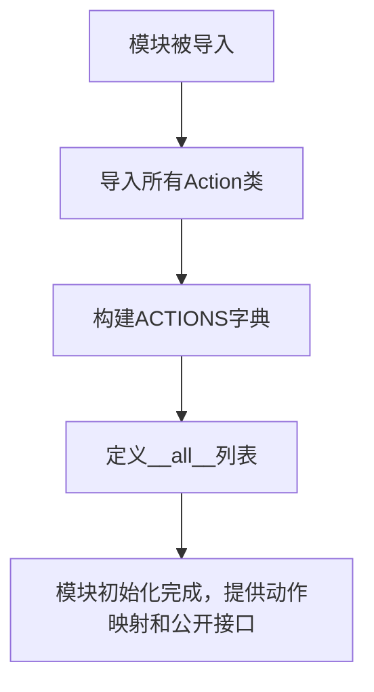

# `.\MetaGPT\metagpt\ext\werewolf\actions\__init__.py` 详细设计文档

该文件是一个狼人杀游戏扩展模块的入口文件，主要功能是导入并组织游戏中的各种角色动作（Action）类，通过一个字典映射将动作名称与对应的类关联起来，并定义模块的公开接口。

## 整体流程



## 类结构

```
Action Classes (从不同模块导入)
├── werewolf_actions
│   ├── Hunt
│   └── Impersonate
├── guard_actions
│   └── Protect
├── seer_actions
│   └── Verify
├── witch_actions
│   ├── Save
│   └── Poison
├── common_actions
│   ├── Speak
│   ├── NighttimeWhispers
│   └── Reflect
├── experience_operation
│   ├── AddNewExperiences
│   └── RetrieveExperiences
└── moderator_actions
    └── InstructSpeak
```

## 全局变量及字段


### `ACTIONS`
    
一个字典，将动作名称映射到对应的动作类，用于在狼人杀游戏中根据角色或指令动态创建和执行不同的游戏动作。

类型：`Dict[str, Type[Action]]`
    


    

## 全局函数及方法


## 关键组件


### 狼人杀游戏动作系统

定义了狼人杀游戏中不同角色（如狼人、守卫、预言家、女巫等）可执行的核心动作类，并通过一个统一的字典进行映射和管理，为游戏逻辑提供基础的行为单元。

### 动作注册与导出机制

通过 `ACTIONS` 字典集中注册游戏内可用的核心动作类，便于运行时动态调用；同时通过 `__all__` 列表显式导出游戏流程管理相关的辅助动作类，明确了模块的公共接口。


## 问题及建议


### 已知问题

-   **硬编码的 `ACTIONS` 字典**：`ACTIONS` 字典在模块级别被硬编码。这降低了代码的灵活性和可维护性。如果需要添加、移除或修改一个动作，必须直接修改此源文件，而不是通过配置或依赖注入等方式。
-   **潜在的循环导入风险**：该模块从多个子模块（如 `werewolf_actions`、`guard_actions` 等）导入类。如果这些子模块反过来尝试导入此模块（例如，为了使用 `ACTIONS` 字典），可能会导致循环导入错误，尤其是在项目结构复杂时。
-   **`__all__` 列表不完整**：`__all__` 列表定义了模块的公共接口，但其中未包含 `ACTIONS` 字典。这意味着当使用 `from module import *` 语法时，`ACTIONS` 不会被导入，可能导致使用者的困惑或错误。同时，`ACTIONS` 中定义的类（如 `Speak`, `Hunt`）也未在 `__all__` 中显式导出，但它们通过 `ACTIONS` 间接可用，这种不一致性可能令人困惑。
-   **缺乏类型注解**：`ACTIONS` 字典的值是类对象，但代码中没有使用类型注解（如 `Dict[str, Type[Action]]`）来明确其结构，这不利于静态类型检查工具（如 mypy）的分析和 IDE 的智能提示。

### 优化建议

-   **将 `ACTIONS` 配置化**：考虑将 `ACTIONS` 字典的定义移出代码，改为从配置文件（如 JSON、YAML）或环境变量中加载。这样可以实现不修改代码即可调整动作集合，更符合十二要素应用原则。
-   **使用注册机制替代硬编码**：为各个动作类实现一个装饰器或元类注册机制。每个动作类在定义时自行注册到中央仓库中，从而消除中心化的 `ACTIONS` 字典，使系统更易于扩展。
-   **重构导入结构以避免循环依赖**：审查 `metagpt.ext.werewolf.actions` 下的子模块之间的导入关系。确保模块间依赖是单向的，或者将共享的常量、工具函数提取到独立的公共模块中。
-   **完善 `__all__` 列表**：更新 `__all__` 列表，使其包含所有希望公开的符号，例如 `__all__ = ["NighttimeWhispers", "Reflect", "AddNewExperiences", "RetrieveExperiences", "InstructSpeak", "ACTIONS"]`。更佳实践是避免使用 `from module import *`，而是鼓励显式导入。
-   **添加类型注解**：为 `ACTIONS` 变量添加类型注解，例如 `ACTIONS: Dict[str, Type[Action]] = {...}`。这能显著提升代码的可读性和可维护性，并利用现代Python开发工具的优势。
-   **考虑使用枚举（Enum）定义动作键**：将 `"Speak"`、`"Hunt"` 等字符串常量定义为枚举成员，可以减少拼写错误，并利用枚举的类型安全特性。


## 其它


### 设计目标与约束

该模块的核心设计目标是提供一个可扩展的、模块化的动作（Action）注册与导出机制，用于支持“狼人杀”游戏模拟。它作为游戏角色（如狼人、守卫、预言家、女巫等）可执行行为的中央注册表。主要约束包括：1) 必须与MetaGPT框架的Action基类兼容；2) 需要清晰地分离通用动作、角色专属动作和管理员动作；3) 导出列表需明确区分内部使用的动作和可供外部模块调用的公共接口。

### 错误处理与异常设计

当前代码片段未显式包含错误处理逻辑。潜在的异常场景及设计考虑包括：1) **导入错误**：若`from ... import ...`语句中引用的模块或类不存在，Python解释器将抛出`ModuleNotFoundError`或`ImportError`。这属于系统级错误，通常意味着项目依赖或文件结构不正确。2) **键冲突**：在`ACTIONS`字典中注册同名动作会导致后者覆盖前者，这属于逻辑错误，需通过开发规范或构建时检查来避免。3) **使用方错误**：外部代码若错误地使用了`__all__`中未导出的类，或错误地使用了`ACTIONS`字典，将引发`AttributeError`或`KeyError`。建议在使用方代码中增加适当的异常捕获和类型检查。

### 数据流与状态机

本模块自身不管理状态或复杂数据流，它主要提供静态定义。其数据流角色是**提供映射关系**：1) **`ACTIONS` 字典**：建立了动作名称（字符串）到动作类（Class）的映射。这通常是游戏引擎或角色对象查找并实例化具体动作的查询表。数据流向为：游戏逻辑确定需要执行的动作名称 -> 查询本字典 -> 获取对应的类 -> 实例化并执行。2) **`__all__` 列表**：定义了模块的公共接口，控制着`from module import *`语句时可导入的对象。这是Python模块级别的数据导出约定。

### 外部依赖与接口契约

1.  **外部依赖**：
    *   **MetaGPT框架**：强依赖。所有导入的动作类（如`Speak`, `Hunt`）必须继承自MetaGPT定义的`Action`基类，并实现其接口（如`run`方法）。
    *   **子模块路径**：强依赖`metagpt.ext.werewolf.actions`下的各个子模块（`werewolf_actions`, `guard_actions`, `seer_actions`, `witch_actions`, `common_actions`, `experience_operation`, `moderator_actions`）。这些模块的目录结构和类定义必须稳定。

2.  **接口契约**：
    *   **对上游（调用方）的契约**：通过`ACTIONS`字典和`__all__`列表提供稳定的、文档化的动作名称和类引用。调用方可以信赖这些键和名称的有效性。
    *   **对下游（被导入动作类）的契约**：无强制性契约，但隐含期望每个动作类能独立、正确地实现其游戏逻辑。本模块仅负责收集和暴露它们。

### 安全与权限考虑

在“狼人杀”游戏上下文中，本模块涉及动作权限的隐式划分：1) **`ACTIONS` 字典**：包含了游戏内角色（狼人、守卫等）可执行的特权动作。游戏引擎必须根据角色身份和游戏阶段，控制对角色的动作访问权限，防止角色执行未授权的动作（例如平民执行`Hunt`）。2) **`__all__` 导出**：`NighttimeWhispers`（夜间私语）、`Reflect`（反思）等动作被导出，可能意味着它们具有更广泛的用途或需要被特殊系统（如经验学习系统、复盘系统）调用，但这不属于安全边界，而是模块封装边界。当前代码未实现任何运行时安全检查，安全逻辑依赖于上层游戏引擎的状态管理和规则验证。

    