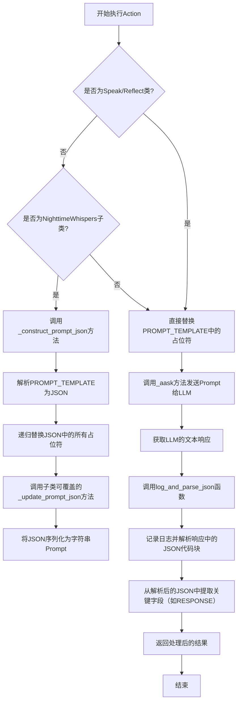
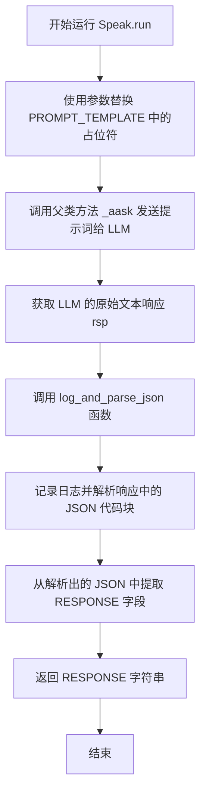
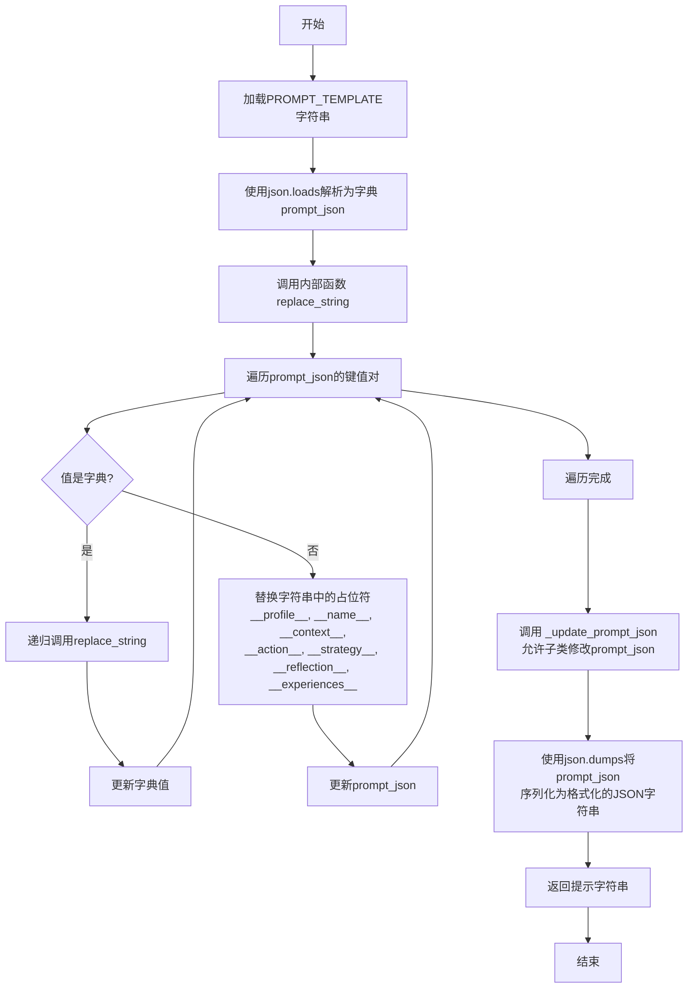
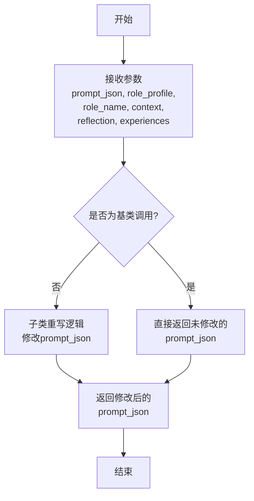
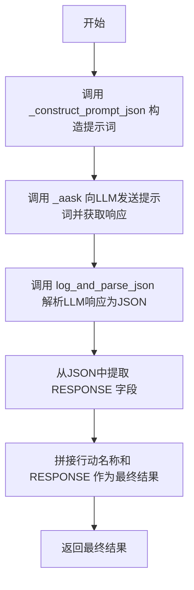
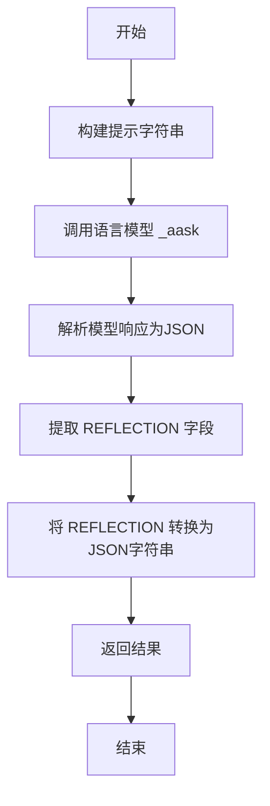

# `.\MetaGPT\metagpt\ext\werewolf\actions\common_actions.py` 详细设计文档

该文件定义了狼人杀游戏中的一系列智能体动作类，包括发言、夜间行动（如狩猎、保护、查验、拯救、毒杀）和反思。这些类继承自一个通用的Action基类，通过构造特定的提示词模板与大型语言模型交互，以模拟游戏角色在特定规则下的决策过程，并返回格式化的响应。

## 整体流程



## 类结构

```
Action (来自metagpt.actions)
├── Speak
├── NighttimeWhispers
│   ├── Hunt (示例子类)
│   ├── Protect (示例子类)
│   ├── Verify (示例子类)
│   ├── Save (示例子类，重写_update_prompt_json)
│   └── Poison (示例子类，重写_update_prompt_json)
└── Reflect
```

## 全局变量及字段


### `Speak.PROMPT_TEMPLATE`
    
定义狼人杀游戏中发言动作的提示词模板，包含游戏背景、历史对话、规则和输出格式等结构化信息。

类型：`str`
    


### `Speak.STRATEGY`
    
定义狼人杀游戏中发言动作的通用策略，指导角色如何权衡身份暴露、提供信息和投票决策。

类型：`str`
    


### `Speak.name`
    
标识该动作的名称，固定为'Speak'，用于日志记录和动作识别。

类型：`str`
    


### `NighttimeWhispers.PROMPT_TEMPLATE`
    
定义狼人杀游戏中夜间行动（如狩猎、保护、查验等）的提示词模板，包含行动特定指令和输出格式。

类型：`str`
    


### `NighttimeWhispers.STRATEGY`
    
定义狼人杀游戏中夜间行动的通用策略，指导角色如何选择最具威胁或最需要支持的目标。

类型：`str`
    


### `NighttimeWhispers.name`
    
标识该动作的名称，固定为'NightTimeWhispers'，用于日志记录和动作识别。

类型：`str`
    


### `Reflect.PROMPT_TEMPLATE`
    
定义狼人杀游戏中反思动作的提示词模板，用于引导角色分析游戏状态、玩家行为和推断真实身份。

类型：`str`
    


### `Reflect.name`
    
标识该动作的名称，固定为'Reflect'，用于日志记录和动作识别。

类型：`str`
    
    

## 全局函数及方法

### `log_and_parse_json`

该函数是一个全局工具函数，用于处理从大语言模型（LLM）或其他来源返回的字符串响应。其核心功能是：首先将响应字符串中的换行符替换为空格，然后记录日志，接着使用专门的解析函数提取字符串中可能存在的JSON代码块，最后将第一个JSON代码块解析为Python字典对象并返回。这确保了即使响应中包含非JSON前缀或后缀（如代码块标记），也能正确提取并解析出结构化的JSON数据。

参数：

- `name`：`str`，用于日志记录的操作或上下文名称，有助于追踪日志来源。
- `rsp`：`str`，待处理的原始响应字符串，通常包含JSON格式的数据，可能被包裹在代码块标记中。

返回值：`dict`，解析后的JSON数据，以Python字典形式返回。

#### 流程图

```mermaid
graph TD
    A[开始: log_and_parse_json(name, rsp)] --> B[预处理: 将rsp中的换行符替换为空格];
    B --> C[记录日志: 使用logger.debug输出name和rsp];
    C --> D[解析JSON块: 调用parse_json_code_block(rsp)提取JSON代码块列表];
    D --> E{检查列表是否为空?};
    E -- 是 --> F[抛出异常或返回空字典];
    E -- 否 --> G[加载JSON: 使用json.loads解析列表中的第一个元素];
    G --> H[返回: 解析后的字典对象rsp_json];
    H --> I[结束];
```

#### 带注释源码

```python
def log_and_parse_json(name: str, rsp: str) -> dict:
    # 1. 预处理：将响应字符串中的换行符替换为空格，确保日志可读性并可能避免解析问题。
    rsp = rsp.replace("\n", " ")
    # 2. 记录日志：使用调试级别记录操作名称和原始/处理后的响应，便于调试和追踪。
    logger.debug(f"{name} result: {rsp}")
    # 3. 解析JSON代码块：调用`parse_json_code_block`函数，该函数能从包含代码块标记（如```json ... ```）的字符串中提取出纯JSON字符串列表。
    json_blocks = parse_json_code_block(rsp)
    # 4. 加载JSON：假设至少有一个JSON块，取第一个块并将其解析为Python字典对象。
    rsp_json = json.loads(json_blocks[0])
    # 5. 返回结果：将解析后的字典返回给调用者。
    return rsp_json
```

### `Speak.run`

`Speak.run` 是 `Speak` 类的异步方法，其核心功能是根据狼人杀游戏的当前状态（包括玩家角色、历史对话、最新指令等），通过构造一个结构化的提示词（Prompt）来调用大语言模型（LLM），获取模型生成的响应，并从中解析出符合游戏规则的发言或投票内容。

参数：

- `profile`：`str`，玩家的游戏角色（如“狼人”、“村民”、“预言家”等）。
- `name`：`str`，玩家的名称。
- `context`：`str`，游戏的历史对话和上下文信息。
- `latest_instruction`：`str`，游戏主持人（Moderator）的最新指令（例如“SPEAK”或“VOTE”）。
- `reflection`：`str`，玩家对当前游戏状态的反思和分析，默认为空字符串。
- `experiences`：`str`，玩家从过往游戏经历中总结的经验，默认为空字符串。

返回值：`str`，返回从大语言模型响应中解析出的 `RESPONSE` 字段内容，即玩家在当前回合应该发表的言论（如果指令是“SPEAK”）或投票声明（如果指令是“VOTE”）。

#### 流程图



#### 带注释源码

```python
    @retry(stop=stop_after_attempt(2), wait=wait_fixed(1))  # 使用 tenacity 库进行重试装饰器，失败后最多重试2次，每次间隔1秒
    async def run(  # 定义异步方法 run
        self,
        profile: str,  # 参数：玩家角色
        name: str,  # 参数：玩家名称
        context: str,  # 参数：游戏历史上下文
        latest_instruction: str,  # 参数：主持人最新指令
        reflection: str = "",  # 参数：反思内容，默认空
        experiences: str = "",  # 参数：过往经验，默认空
    ):
        # 步骤1: 构造提示词。将类属性 PROMPT_TEMPLATE 中的占位符替换为传入的参数。
        prompt = (
            self.PROMPT_TEMPLATE.replace("__context__", context)
            .replace("__profile__", profile)
            .replace("__name__", name)
            .replace("__latest_instruction__", latest_instruction)
            .replace("__strategy__", self.STRATEGY)  # 替换策略文本
            .replace("__reflection__", reflection)
            .replace("__experiences__", experiences)
        )

        # 步骤2: 调用父类 Action 的 _aask 方法，将构造好的提示词发送给大语言模型，并获取响应。
        rsp = await self._aask(prompt)

        # 步骤3: 使用工具函数 log_and_parse_json 处理响应。
        #       该函数会记录日志，并从响应文本中解析出第一个 JSON 代码块，将其转换为 Python 字典。
        rsp_json = log_and_parse_json(self.name, rsp)

        # 步骤4: 从解析后的 JSON 字典中，提取出 "RESPONSE" 字段的值并返回。
        #        这个值就是模型根据游戏规则生成的发言或投票内容。
        return rsp_json["RESPONSE"]
```

### `NighttimeWhispers._construct_prompt_json`

该方法用于构建一个JSON格式的提示字符串，该字符串将作为输入传递给大语言模型（LLM）。它通过替换`PROMPT_TEMPLATE`中的占位符（如`__profile__`、`__name__`等）来生成一个针对特定游戏角色、上下文和动作的定制化提示。最后，它调用`_update_prompt_json`方法允许子类进一步修改生成的提示字典。

参数：

- `role_profile`：`str`，游戏角色的描述（例如，“狼人”、“村民”）。
- `role_name`：`str`，游戏角色的名称（例如，“Player1”）。
- `context`：`str`，游戏的历史对话或上下文信息。
- `reflection`：`str`，角色对当前游戏状态的反思或分析。
- `experiences`：`str`，角色过去的游戏经验。
- `**kwargs`：`Any`，可变关键字参数，用于传递给`_update_prompt_json`方法以支持子类的自定义扩展。

返回值：`str`，一个格式化的JSON字符串，用作LLM的输入提示。

#### 流程图



#### 带注释源码

```python
def _construct_prompt_json(
    self, role_profile: str, role_name: str, context: str, reflection: str, experiences: str, **kwargs
):
    # 获取类中定义的原始提示模板字符串
    prompt_template = self.PROMPT_TEMPLATE

    # 定义内部递归函数，用于遍历并替换字典中的所有字符串值
    def replace_string(prompt_json: dict):
        k: str
        for k in prompt_json.keys():
            if isinstance(prompt_json[k], dict):
                # 如果值是字典，则递归处理
                prompt_json[k] = replace_string(prompt_json[k])
                continue
            # 对字符串值进行一系列占位符替换，将其定制为当前角色和上下文
            prompt_json[k] = prompt_json[k].replace("__profile__", role_profile)
            prompt_json[k] = prompt_json[k].replace("__name__", role_name)
            prompt_json[k] = prompt_json[k].replace("__context__", context)
            prompt_json[k] = prompt_json[k].replace("__action__", self.name)  # self.name 是动作名称，如"Hunt"
            prompt_json[k] = prompt_json[k].replace("__strategy__", self.STRATEGY)
            prompt_json[k] = prompt_json[k].replace("__reflection__", reflection)
            prompt_json[k] = prompt_json[k].replace("__experiences__", experiences)

        return prompt_json

    # 将字符串模板解析为Python字典对象
    prompt_json: dict = json.loads(prompt_template)

    # 调用内部函数，替换所有占位符
    prompt_json = replace_string(prompt_json)

    # 调用可覆盖的方法，为子类提供修改最终提示字典的钩子
    prompt_json: dict = self._update_prompt_json(
        prompt_json, role_profile, role_name, context, reflection, experiences, **kwargs
    )
    # 确保返回的是一个字典
    assert isinstance(prompt_json, dict)

    # 将字典序列化为格式化的JSON字符串，准备发送给LLM
    prompt: str = json.dumps(prompt_json, indent=4, ensure_ascii=False)

    return prompt
```

### `NighttimeWhispers._update_prompt_json`

该方法是一个“钩子”方法，旨在被子类重写，以允许子类在父类`_construct_prompt_json`方法构建基础提示词JSON后，对其进行自定义修改。在基类`NighttimeWhispers`中，此方法直接返回未经修改的输入字典，作为默认实现。

参数：

- `prompt_json`：`dict`，由父类`_construct_prompt_json`方法构建的初始提示词JSON字典。
- `role_profile`：`str`，当前行动执行者的角色描述（如“werewolf”、“seer”）。
- `role_name`：`str`，当前行动执行者的玩家名称。
- `context`：`str`，游戏历史对话和信息的上下文。
- `reflection`：`str`，玩家对当前游戏状态的反思总结。
- `experiences`：`str`，玩家过去的游戏经验。

返回值：`dict`，返回经过子类自定义修改后的提示词JSON字典。

#### 流程图



#### 带注释源码

```python
def _update_prompt_json(
    self, prompt_json: dict, role_profile: str, role_name: str, context: str, reflection: str, experiences: str
) -> dict:
    # one can modify the prompt_json dictionary here
    # 这是一个“钩子”方法，允许子类在父类构建的基础提示词JSON上进行自定义修改。
    # 基类实现直接返回原字典，不做任何改动。
    # 子类（如Save、Poison）应重写此方法来调整提示词结构，例如删除特定键、修改输出格式等。
    return prompt_json
```

### `NighttimeWhispers.run`

该方法用于执行狼人杀游戏中的夜间行动（如猎杀、保护、查验、拯救、毒杀等）。它根据给定的游戏上下文、玩家角色、玩家名称、反思和经验，构造一个结构化的提示词，调用大语言模型（LLM）生成决策，并解析返回的JSON结果，最终返回一个格式化的行动响应字符串。

参数：

- `context`：`str`，游戏的历史对话和事件上下文。
- `profile`：`str`，当前执行行动玩家的角色（如“werewolf”、“seer”等）。
- `name`：`str`，当前执行行动玩家的名称。
- `reflection`：`str`，玩家对当前游戏状态的反思和分析。
- `experiences`：`str`，玩家从过往游戏经验中获得的教训。

返回值：`str`，格式为“{行动名称} {目标玩家名称}”，例如“Hunt PlayerA”。

#### 流程图



#### 带注释源码

```python
    @retry(stop=stop_after_attempt(2), wait=wait_fixed(1))  # 使用重试装饰器，失败后最多重试2次，每次间隔1秒
    async def run(self, context: str, profile: str, name: str, reflection: str = "", experiences: str = ""):
        # 1. 构造提示词：将角色、名称、上下文、反思和经验等信息填充到预设的模板中，并可能被子类修改。
        prompt = self._construct_prompt_json(
            role_profile=profile, role_name=name, context=context, reflection=reflection, experiences=experiences
        )

        # 2. 调用LLM：通过父类Action的_aask方法，将构造好的提示词发送给大语言模型，并获取其文本响应。
        rsp = await self._aask(prompt)

        # 3. 解析响应：使用工具函数log_and_parse_json处理LLM返回的文本，提取其中的JSON代码块并解析为字典。
        rsp_json = log_and_parse_json(self.name, rsp)

        # 4. 格式化返回：将当前行动的名称（如'Hunt'）与LLM决策的目标玩家名称拼接，作为最终的行动指令返回。
        return f"{self.name} " + rsp_json["RESPONSE"]
```

### `Reflect.run`

`Reflect.run` 是 `Reflect` 类的一个异步方法，用于在狼人杀游戏中执行“反思”动作。该方法根据给定的游戏上下文、玩家角色和最新指令，生成一个结构化的提示，调用语言模型进行分析，并返回对当前游戏状态的反思总结，以帮助玩家在后续行动中做出更明智的决策。

参数：

- `profile`：`str`，玩家的角色描述（例如，“werewolf”、“villager”、“seer”等）。
- `name`：`str`，玩家的名称。
- `context`：`str`，游戏的历史对话和事件上下文。
- `latest_instruction`：`str`，游戏主持人（Moderator）的最新指令。

返回值：`str`，返回一个JSON格式的字符串，包含了对游戏中每个玩家角色的推断以及游戏状态的总结。

#### 流程图



#### 带注释源码

```python
    @retry(stop=stop_after_attempt(2), wait=wait_fixed(1))  # 使用重试装饰器，最多重试2次，每次间隔1秒
    async def run(self, profile: str, name: str, context: str, latest_instruction: str):
        # 使用字符串替换方法，将提示词模板中的占位符替换为实际参数
        prompt = (
            self.PROMPT_TEMPLATE.replace("__context__", context)
            .replace("__profile__", profile)
            .replace("__name__", name)
            .replace("__latest_instruction__", latest_instruction)
        )

        # 异步调用父类 Action 的 _aask 方法，向语言模型发送提示并获取响应
        rsp = await self._aask(prompt)
        # 使用辅助函数 log_and_parse_json 记录日志并解析响应中的JSON代码块
        rsp_json = log_and_parse_json(self.name, rsp)

        # 从解析后的JSON中提取 "REFLECTION" 字段，并将其转换为JSON格式的字符串返回
        return json.dumps(rsp_json["REFLECTION"])
```

## 关键组件

### Speak Action

一个用于在狼人杀游戏中执行“发言”或“投票”动作的类。它根据游戏背景、历史对话、策略和玩家经验，生成符合游戏规则和主持人指令的文本响应。

### NighttimeWhispers Action

一个用于在狼人杀游戏夜间阶段执行特定动作（如狩猎、保护、查验、拯救、毒杀）的基类。它通过构造和修改JSON格式的提示词，引导AI进行思考并选择目标玩家，支持子类通过重写方法来自定义提示逻辑。

### Reflect Action

一个用于在狼人杀游戏中执行“反思”动作的类。它引导AI分析当前游戏状态，包括每位玩家的状态、声称的角色、阵营归属和指控关系，并基于此推断玩家的真实角色，最终生成对游戏局势的总结。

### 提示词模板与JSON处理

代码的核心机制，通过预定义的JSON字符串模板（如`PROMPT_TEMPLATE`）来结构化地引导大语言模型（LLM）的思考过程。这些模板包含游戏背景、历史、策略、输出格式等关键部分，并通过字符串替换（`replace`）或JSON字典遍历修改（`_construct_prompt_json`）的方式动态填充上下文信息，确保LLM能基于正确的游戏状态和角色信息进行推理。

### 重试与容错机制

通过`tenacity`库的`@retry`装饰器为`run`方法添加了自动重试逻辑。当LLM调用失败时（如网络问题或响应格式错误），系统会自动重试最多2次，每次间隔1秒，提高了动作执行的鲁棒性。

### 响应解析与日志记录

`log_and_parse_json`函数负责处理LLM返回的文本。它首先清理换行符并记录日志，然后使用`parse_json_code_block`函数从响应中提取JSON代码块，最后将其解析为Python字典。这确保了即使LLM的响应包含额外文本，也能正确提取出结构化的数据。

## 问题及建议


### 已知问题

-   **硬编码的游戏配置**：`PROMPT_TEMPLATE` 中的游戏背景（如“2 werewolves, 2 villagers, 1 guard, 1 witch, 1 seer”）是硬编码的。这限制了代码的通用性，无法直接适配不同人数或角色配置的狼人杀游戏。
-   **脆弱的 JSON 解析**：`log_and_parse_json` 函数依赖于 `parse_json_code_block` 提取第一个 JSON 代码块。如果大语言模型（LLM）的响应格式不符合预期（例如，没有代码块标记、JSON 格式错误），将导致 `json.loads` 失败，进而使整个 Action 执行失败。当前的 `@retry` 装饰器仅能重试网络请求，无法处理解析失败。
-   **字符串替换的潜在错误**：`Speak` 和 `Reflect` 类的 `run` 方法使用简单的字符串替换（`.replace()`）来构建提示词。如果替换的变量值（如 `context`, `profile`）中包含与模板占位符（如 `__profile__`）相似的子串，可能导致意外的替换或替换不全，破坏提示词结构。
-   **`NighttimeWhispers` 的继承设计模糊**：`NighttimeWhispers` 类的文档示例展示了通过继承和重写 `_update_prompt_json` 方法来创建具体行动（如 `Hunt`, `Save`）。然而，基类的 `name` 属性被用于提示词中的 `__action__` 占位符，这要求子类必须正确设置 `name` 属性，且该设计未在基类中通过抽象方法明确约束，容易导致子类实现不一致。
-   **`Reflect` 类的输出格式复杂且易变**：`Reflect.PROMPT_TEMPLATE` 要求 LLM 输出一个包含嵌套复杂结构（`GAME_STATES` 列表和 `REFLECTION` 字典）的 JSON。这极大地增加了 LLM 输出格式错误的概率，使得 `log_and_parse_json` 解析失败的风险更高。
-   **缺乏输入验证与错误处理**：所有 `run` 方法都直接使用输入参数构建提示词，没有对参数的有效性（如非空、类型）进行检查。当 `rsp_json` 中预期的键（如 `"RESPONSE"`）不存在时，会直接引发 `KeyError`，导致程序崩溃。
-   **代码重复**：`Speak`、`Reflect` 和 `NighttimeWhispers` 的 `PROMPT_TEMPLATE` 中都有大段相同的背景描述。`log_and_parse_json` 函数和 `@retry` 装饰器在多个类中重复出现。这违反了 DRY（Don‘t Repeat Yourself）原则，增加了维护成本。

### 优化建议

-   **将游戏配置参数化**：建议将游戏角色配置（如玩家数量、角色列表）从硬编码的提示词模板中剥离，作为可配置参数（例如，通过 `__init__` 方法传入或从配置文件加载）动态注入到提示词中。这能提升代码的灵活性和可复用性。
-   **增强 JSON 解析的鲁棒性**：
    1.  在 `log_and_parse_json` 中增加更全面的 JSON 解析尝试，例如使用 `json.JSONDecodeError` 异常捕获，并尝试直接解析整个响应字符串或使用更宽松的解析器。
    2.  为 `parse_json_code_block` 函数增加日志，记录原始响应，便于调试。
    3.  考虑在解析失败时返回一个结构化的错误信息或默认值，而不是直接抛出异常，允许上游逻辑进行降级处理。
-   **使用更安全的模板渲染方法**：采用成熟的模板引擎（如 Python 的 `string.Template` 或 `str.format` 方法配合关键字参数）来构建提示词。这可以避免子串意外匹配的问题，并使模板与数据的绑定更清晰、更安全。
-   **明确 `NighttimeWhispers` 的抽象契约**：
    1.  将 `NighttimeWhispers` 类改为抽象基类（ABC），并声明一个抽象方法（如 `get_action_name`）或属性，强制子类必须提供行动名称。
    2.  或者，将行动名称作为构造函数的必需参数，在基类中统一处理，减少子类的负担。
    3.  在文档中更清晰地说明继承和重写 `_update_prompt_json` 的约定。
-   **简化 `Reflect` 的输出格式**：重新设计 `Reflect` 的提示词，要求 LLM 输出更扁平、更简单的 JSON 结构。例如，可以分步请求：先输出玩家状态列表，再基于此输出总结。或者，接受更自由的文本总结格式，后期再进行处理。
-   **增加输入验证与防御性编程**：
    1.  在 `run` 方法开始处，检查关键输入参数（如 `profile`, `name`, `context`）是否有效。
    2.  在访问 `rsp_json` 的键之前，使用 `.get()` 方法并提供默认值，或者使用 `try...except KeyError` 进行包裹。
    3.  考虑为 Action 执行结果定义一个统一的数据类（Dataclass），包含响应内容、状态码和可能的错误信息。
-   **重构以减少重复代码**：
    1.  创建一个基类（例如 `BaseWerewolfAction`），将公共的 `PROMPT_TEMPLATE` 背景部分、`STRATEGY`、`log_and_parse_json` 的调用以及公共的 `@retry` 逻辑封装其中。
    2.  `Speak` 和 `Reflect` 的简单字符串替换逻辑可以合并为一个公共的模板渲染方法，放在基类中。
    3.  将 `log_and_parse_json` 函数移至一个独立的工具模块，确保所有相关类都能导入使用。
-   **提升可观测性**：在关键步骤（如提示词构建完成、收到 LLM 响应、解析 JSON 前后）增加更详细的信息级别（INFO）或调试级别（DEBUG）日志，便于跟踪执行流程和诊断问题。


## 其它


### 设计目标与约束

本模块的设计目标是实现一个基于大语言模型（LLM）的狼人杀游戏智能体行为决策系统。核心约束包括：1) 所有决策必须基于给定的游戏上下文、角色信息和历史经验；2) 输出必须严格遵循预定义的JSON格式，以确保下游系统能够可靠解析；3) 系统需具备一定的容错性，通过重试机制处理LLM API可能的不稳定性；4) 设计需支持扩展，能够方便地添加新的游戏角色或特殊行动（如夜间行动）。

### 错误处理与异常设计

1.  **JSON解析错误处理**：`log_and_parse_json` 函数通过 `parse_json_code_block` 提取并解析LLM返回的JSON代码块。如果解析失败（如格式错误、非JSON内容），`json.loads` 将抛出 `json.JSONDecodeError`。当前代码未显式捕获此异常，这可能导致上层调用失败。
2.  **网络/API错误处理**：所有 `run` 方法均使用 `@retry` 装饰器，在LLM调用失败时自动重试（最多2次，间隔1秒）。这主要处理网络超时或LLM服务暂时不可用的情况。重试后若仍失败，异常将向上抛出。
3.  **输入数据验证**：当前代码未对输入参数（如 `profile`, `name`, `context`）进行有效性或完整性验证。例如，空的 `context` 可能导致LLM生成不符合预期的内容。
4.  **断言（Assert）**：在 `NighttimeWhispers._construct_prompt_json` 方法中，使用 `assert isinstance(prompt_json, dict)` 来确保 `_update_prompt_json` 方法返回的是字典。这在开发调试中有用，但在生产环境中，断言可能被禁用，且更健壮的方式是进行类型检查并抛出明确的异常。

### 数据流与状态机

1.  **核心数据流**：
    *   **输入**：角色配置（`profile`, `name`）、游戏上下文（`context`）、最新指令（`latest_instruction`）、反思（`reflection`）、经验（`experiences`）。
    *   **处理**：根据具体Action类（`Speak`, `NighttimeWhispers`子类, `Reflect`）的模板，将输入参数填充至提示词（Prompt）中。提示词被发送给LLM。
    *   **输出解析**：LLM的文本响应被 `log_and_parse_json` 函数处理，提取JSON块并解析为字典。
    *   **输出**：从解析后的字典中提取关键字段（如 `RESPONSE`）作为Action的执行结果返回。
2.  **状态机（隐式）**：代码本身未定义显式的状态机，但通过不同的 `Action` 类和行为逻辑，隐式地对应了狼人杀游戏的不同阶段：
    *   `Speak`: 对应白天发言或投票阶段。
    *   `NighttimeWhispers` 及其子类（如 `Hunt`, `Protect`）：对应夜间各种特殊角色的行动阶段。
    *   `Reflect`: 对应游戏中的信息整理与推理阶段，可在行动前后触发。
    *   游戏状态的推进（如玩家生死、回合更替）由外部系统（调用者）管理，并通过 `context` 和 `latest_instruction` 参数传递给本模块。

### 外部依赖与接口契约

1.  **外部依赖**：
    *   **MetaGPT框架**：继承自 `metagpt.actions.Action` 基类，依赖其提供的 `_aask` 方法与LLM进行交互，以及 `logger` 进行日志记录。
    *   **Tenacity库**：用于实现重试逻辑。
    *   **Python标准库 (json)**：用于JSON序列化与反序列化。
    *   **大语言模型（LLM）服务**：通过 `Action._aask` 方法间接依赖，是核心的外部服务。
2.  **接口契约**：
    *   **父类契约**：所有Action类必须实现 `async run(...)` 方法，这是MetaGPT框架对Action的核心约定。
    *   **`log_and_parse_json` 函数**：期望输入一个字符串，该字符串包含至少一个由反引号包裹的JSON代码块。返回解析该代码块后得到的Python字典。
    *   **`NighttimeWhispers._update_prompt_json` 方法**：子类可重写此方法以自定义提示词结构。它接收并应返回一个字典，且不应破坏原始字典的基本结构（除非明确需要）。基类实现原样返回输入字典。
    *   **调用方契约**：调用 `Speak.run` 和 `Reflect.run` 时必须提供 `latest_instruction` 参数。调用 `NighttimeWhispers.run` 及其子类时不需要此参数。所有 `run` 方法均返回字符串格式的决策结果。

### 安全性与合规性考虑

1.  **提示词注入（Prompt Injection）**：代码使用简单的字符串替换（`.replace()`）来构建提示词。如果输入参数（如 `context`, `reflection`）中包含与模板占位符（如 `__profile__`）相同的子串，可能导致意外的替换和提示词破坏。当前风险较低，因为占位符格式特殊，但并非绝对安全。
2.  **内容安全**：生成的发言（`Speak`）或行动目标（`NighttimeWhispers`）完全由LLM根据游戏上下文生成。需要确保上游的 `context` 和指令不包含不当内容，并且考虑对LLM输出进行必要的过滤或审查，尽管当前代码未体现。
3.  **数据隐私**：提示词中可能包含模拟玩家的对话历史（`context`）。在真实应用场景中，如果这些数据源自真实用户交互，需考虑隐私保护和数据脱敏。
4.  **合规使用LLM**：需遵守所使用LLM服务商的内容政策和使用条款。

### 测试策略建议

1.  **单元测试**：
    *   `log_and_parse_json` 函数：测试其处理包含/不包含代码块、多代码块、非法JSON等情况。
    *   各Action类的 `run` 方法：使用Mock对象模拟 `_aask` 方法返回预定义的JSON字符串，验证输出解析是否正确。
    *   `NighttimeWhispers._construct_prompt_json` 和 `_update_prompt_json`：测试提示词构建和自定义修改逻辑。
2.  **集成测试**：将Action类与真实的LLM服务（或一个稳定的测试用LLM模拟器）连接，使用典型的游戏场景数据作为输入，验证端到端的决策生成是否符合游戏规则和预期格式。
3.  **健壮性测试**：模拟网络异常、LLM返回非标准格式、输入参数缺失或异常等情况，检验系统的错误处理和恢复能力。

    