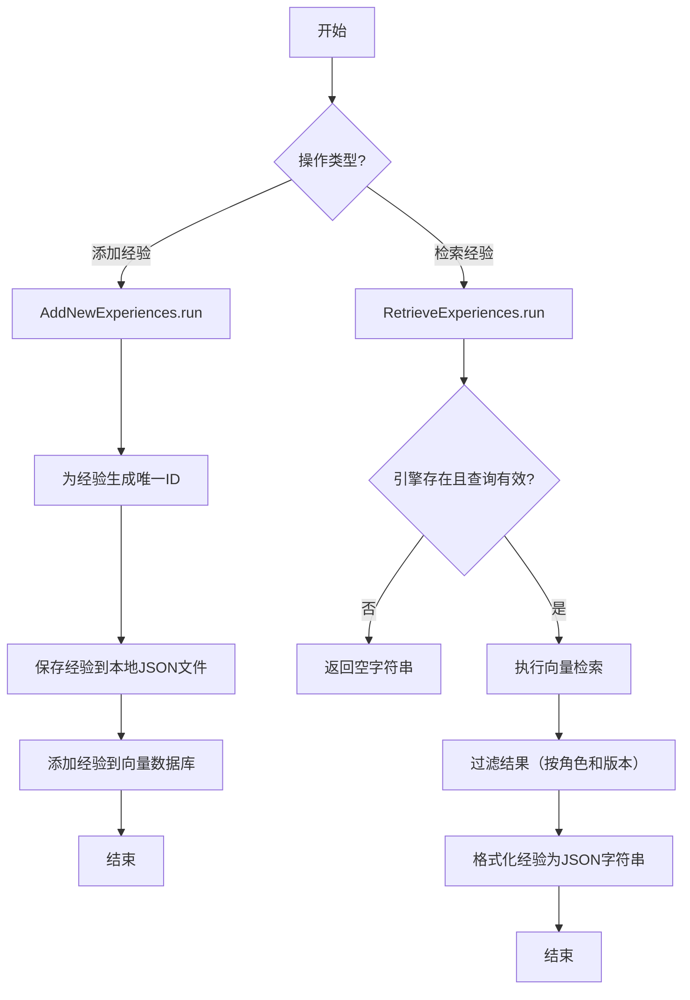
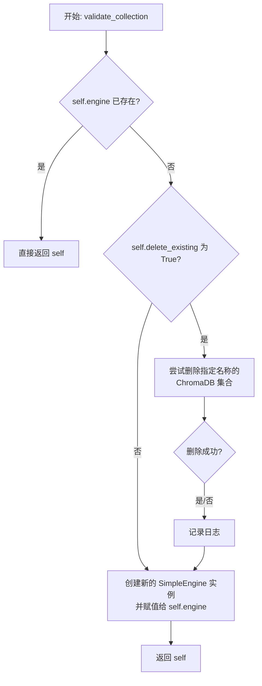
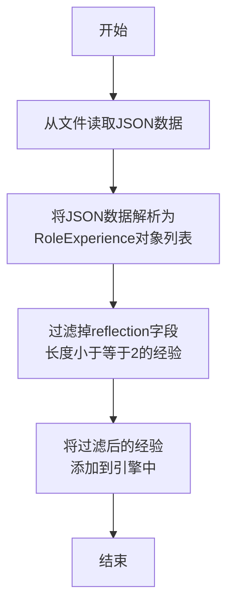
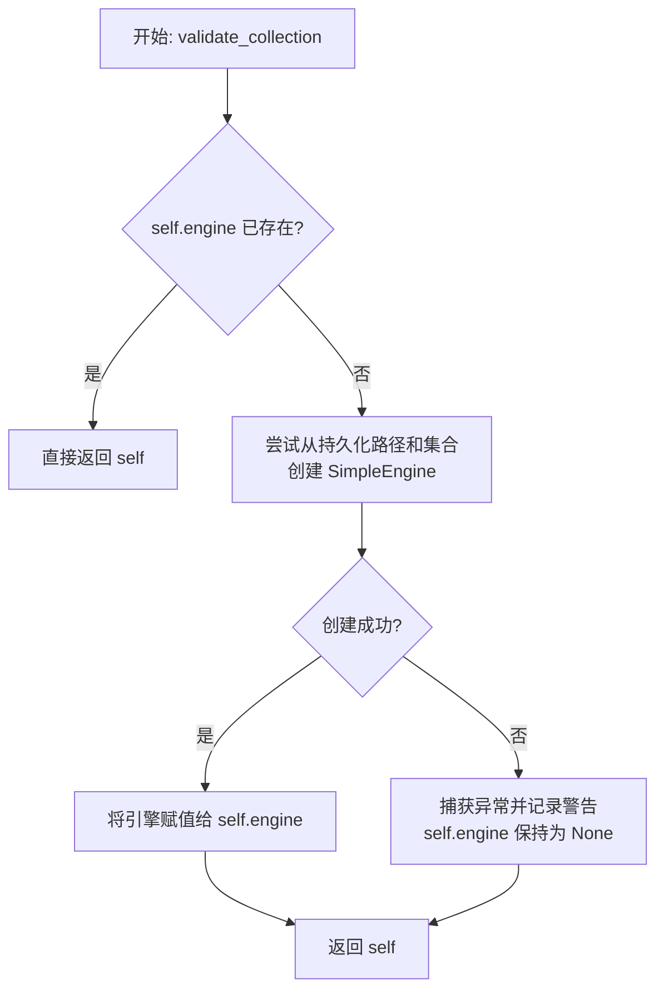

# `.\MetaGPT\metagpt\ext\werewolf\actions\experience_operation.py` 详细设计文档

该代码文件是狼人杀游戏智能体经验管理系统的一部分，主要功能是管理游戏角色的经验数据。它包含两个核心类：`AddNewExperiences` 用于将新的角色经验（`RoleExperience`）持久化存储到本地JSON文件和Chroma向量数据库中；`RetrieveExperiences` 用于根据查询（如当前角色的反思）从向量数据库中检索相似的历史经验，并格式化返回，以供智能体在决策时参考。系统通过向量检索实现了经验的记忆与复用。

## 整体流程



## 类结构

```
Action (基类，来自metagpt.actions)
├── AddNewExperiences
└── RetrieveExperiences
```

## 全局变量及字段


### `DEFAULT_COLLECTION_NAME`
    
默认的向量数据库集合名称，用于存储角色经验数据。

类型：`str`
    


### `PERSIST_PATH`
    
向量数据库持久化存储的默认路径，指向工作空间下的特定目录。

类型：`pathlib.Path`
    


### `AddNewExperiences.name`
    
动作的名称，标识此Action的具体功能。

类型：`str`
    


### `AddNewExperiences.collection_name`
    
指定用于存储经验的向量数据库集合名称。

类型：`str`
    


### `AddNewExperiences.delete_existing`
    
标志位，指示在初始化引擎时是否删除已存在的同名集合。

类型：`bool`
    


### `AddNewExperiences.engine`
    
用于操作向量数据库的RAG引擎实例，负责添加和检索文档。

类型：`Optional[SimpleEngine]`
    


### `RetrieveExperiences.name`
    
动作的名称，标识此Action的具体功能。

类型：`str`
    


### `RetrieveExperiences.collection_name`
    
指定用于检索经验的向量数据库集合名称。

类型：`str`
    


### `RetrieveExperiences.has_experiences`
    
标志位，指示经验池是否存在或是否可用。

类型：`bool`
    


### `RetrieveExperiences.engine`
    
用于操作向量数据库的RAG引擎实例，负责检索文档。

类型：`Optional[SimpleEngine]`
    


### `RetrieveExperiences.topk`
    
检索时返回的最相似结果数量。

类型：`int`
    
    

## 全局函数及方法


### `AddNewExperiences.validate_collection`

`validate_collection` 是 `AddNewExperiences` 类的一个模型验证器方法，在类实例化后自动调用。它的核心功能是确保 `engine` 字段被正确初始化。如果 `engine` 已经存在，则直接返回；否则，它会根据配置（特别是 `delete_existing` 标志）决定是否删除现有的 ChromaDB 集合，然后创建一个新的 `SimpleEngine` 实例并赋值给 `self.engine`。

参数：
-  `self`：`AddNewExperiences`，`AddNewExperiences` 类的实例。

返回值：`AddNewExperiences`，返回经过验证和初始化的 `AddNewExperiences` 类实例本身。

#### 流程图



#### 带注释源码

```
    @model_validator(mode="after")  # 这是一个 Pydantic 模型验证器，在模型实例化后运行
    def validate_collection(self):
        # 如果 engine 字段已经初始化，则无需后续操作，直接返回实例
        if self.engine:
            return
        # 检查是否需要删除已存在的 ChromaDB 集合
        if self.delete_existing:
            try:
                # 创建一个持久化的 ChromaDB 客户端，并尝试删除指定名称的集合
                # TODO: 后续应实现 engine 的 DELETE 方法，以封装此操作
                chromadb.PersistentClient(PERSIST_PATH.as_posix()).delete_collection(self.collection_name)
            except Exception as exp:
                # 如果删除失败（例如集合不存在），记录错误日志，但不中断流程
                logger.error(f"delete chroma collection: {self.collection_name} failed, exp: {exp}")

        # 无论是否删除旧集合，都创建一个新的 SimpleEngine 实例
        # 该引擎配置了基于 ChromaDB 的检索器，使用指定的持久化路径和集合名称
        self.engine = SimpleEngine.from_objs(
            retriever_configs=[
                ChromaRetrieverConfig(
                    persist_path=PERSIST_PATH, collection_name=self.collection_name, metadata={"hnsw:space": "cosine"}
                )
            ]
        )
```


### `AddNewExperiences.run`

该方法用于处理一批新的角色经验数据。其核心功能是为传入的经验数据生成唯一标识符，将数据持久化到本地JSON文件，并最终将数据添加到向量数据库（ChromaDB）的检索引擎中，以供后续的相似性检索。

参数：

- `experiences`：`list[RoleExperience]`，一个包含`RoleExperience`对象的列表，代表需要被处理和存储的新经验数据。

返回值：`None`，该方法不返回任何值。

#### 流程图

```mermaid
flowchart TD
    A[开始: run(experiences)] --> B{experiences列表是否为空?}
    B -- 是 --> C[结束]
    B -- 否 --> D[遍历experiences列表]
    D --> E[为每个经验对象exp<br>生成唯一ID: exp.id]
    E --> F[调用静态方法<br>_record_experiences_local<br>将数据保存到本地JSON文件]
    F --> G[调用引擎的add_objs方法<br>将经验数据添加到向量数据库]
    G --> H[结束]
```

#### 带注释源码

```python
def run(self, experiences: list[RoleExperience]):
    # 1. 输入验证：如果传入的经验列表为空，则直接返回，不执行任何操作。
    if not experiences:
        return

    # 2. 数据预处理：遍历经验列表，为每个`RoleExperience`对象生成一个唯一的标识符（ID）。
    #    ID的格式为：`{角色档案}-{角色名}-step{索引}-round_{轮次ID}`。
    for i, exp in enumerate(experiences):
        exp.id = f"{exp.profile}-{exp.name}-step{i}-round_{exp.round_id}"

    # 3. 本地持久化：调用私有静态方法，将处理后的经验数据列表保存到本地文件系统。
    #    文件路径基于经验的版本和轮次ID组织。
    AddNewExperiences._record_experiences_local(experiences)

    # 4. 向量化存储：通过`SimpleEngine`实例，将经验数据添加到向量数据库中。
    #    这使得后续可以通过`RetrieveExperiences`类进行基于语义的相似性检索。
    self.engine.add_objs(experiences)
```


### `AddNewExperiences.add_from_file`

该方法从指定的JSON文件中读取角色经验数据，将其解析并过滤后，添加到向量数据库引擎中。

参数：
- `file_path`：`str`，包含角色经验数据的JSON文件路径。

返回值：`None`，无返回值。

#### 流程图



#### 带注释源码

```python
def add_from_file(self, file_path):
    # 从指定路径读取JSON文件，返回一个Python列表
    experiences = read_json_file(file_path)
    # 将列表中的每个字典项通过Pydantic的model_validate方法验证并转换为RoleExperience对象
    experiences = [RoleExperience.model_validate(item) for item in experiences]
    # 过滤掉reflection字段长度小于等于2的经验（例如空字符串或仅包含引号的字符串）
    experiences = [exp for exp in experiences if len(exp.reflection) > 2]  # not "" or not '""'
    # 调用引擎的add_objs方法，将处理后的经验对象列表添加到向量数据库中
    self.engine.add_objs(experiences)
```


### `AddNewExperiences._record_experiences_local`

这是一个静态方法，用于将一组`RoleExperience`对象序列化为JSON格式，并保存到本地文件系统中。其核心功能是根据经验数据中的版本(`version`)和轮次(`round_id`)信息，在预定义的目录结构下创建或定位文件，并将经验数据持久化存储，同时记录日志。

参数：

-  `experiences`：`list[RoleExperience]`，需要被记录和保存的角色经验对象列表。

返回值：`None`，此方法不返回任何值。

#### 流程图

```mermaid
flowchart TD
    A[开始: _record_experiences_local] --> B{输入列表experiences是否为空?}
    B -- 是 --> C[结束]
    B -- 否 --> D[从列表中第一个经验对象<br>提取 round_id 和 version]
    D --> E{version 是否存在?}
    E -- 否 --> F[将 version 设置为 'test']
    E -- 是 --> G[使用提取的 version]
    F --> H
    G --> H[构建文件保存路径<br>DEFAULT_WORKSPACE_ROOT/werewolf_game/experiences/{version}/{round_id}.json]
    H --> I[将 experiences 列表中的每个对象<br>转换为字典 (model_dump)]
    I --> J[确保目标目录存在<br>(mkdir with parents, exist_ok)]
    J --> K[将字典列表写入JSON文件]
    K --> L[记录日志: 文件已保存]
    L --> C
```

#### 带注释源码

```python
@staticmethod
def _record_experiences_local(experiences: list[RoleExperience]):
    # 从传入的经验列表中第一个对象获取本轮游戏的轮次ID和版本号
    round_id = experiences[0].round_id
    version = experiences[0].version
    # 如果版本号不存在（例如为None或空字符串），则使用默认值"test"
    version = "test" if not version else version
    # 将Pydantic模型对象列表转换为字典列表，以便后续JSON序列化
    experiences = [exp.model_dump() for exp in experiences]

    # 构建基于版本号的子目录路径
    experience_path = DEFAULT_WORKSPACE_ROOT.joinpath(f"werewolf_game/experiences/{version}")
    # 创建目录（如果不存在），`parents=True`允许创建多级目录，`exist_ok=True`避免目录已存在时报错
    experience_path.mkdir(parents=True, exist_ok=True)
    # 构建完整的文件保存路径，文件名格式为 {round_id}.json
    save_path = f"{experience_path}/{round_id}.json"
    # 调用工具函数，将字典列表写入指定路径的JSON文件
    write_json_file(save_path, experiences)
    # 记录信息日志，表明经验数据已成功保存到指定路径
    logger.info(f"experiences saved to {save_path}")
```


### `RetrieveExperiences.validate_collection`

该方法是一个Pydantic模型验证器，在`RetrieveExperiences`类实例化后自动调用。其核心功能是初始化或验证用于检索经验的`SimpleEngine`引擎。如果引擎尚未初始化，它会尝试从指定的ChromaDB持久化存储路径和集合名称加载索引和配置来创建引擎。如果加载失败（例如，指定的集合不存在），它会捕获异常并记录警告，将引擎保持为`None`状态。

参数：

-  `self`：`RetrieveExperiences`，`RetrieveExperiences`类的当前实例

返回值：`RetrieveExperiences`，返回经过验证和可能修改后的`RetrieveExperiences`类实例本身。

#### 流程图



#### 带注释源码

```
    @model_validator(mode="after")  # 这是一个Pydantic模型验证器装饰器，指定在模型字段赋值后运行。
    def validate_collection(self):
        # 如果引擎已经存在（例如，在外部被设置），则无需初始化，直接返回。
        if self.engine:
            return
        try:
            # 尝试从持久化的ChromaDB索引创建SimpleEngine。
            # 使用ChromaIndexConfig指定索引位置和集合名。
            # 使用ChromaRetrieverConfig配置检索器，其中包含检索时返回的最相似结果数量（topk）。
            self.engine = SimpleEngine.from_index(
                index_config=ChromaIndexConfig(
                    persist_path=PERSIST_PATH, collection_name=self.collection_name, metadata={"hnsw:space": "cosine"}
                ),
                retriever_configs=[
                    ChromaRetrieverConfig(
                        similarity_top_k=self.topk,  # 使用实例的topk属性配置检索数量
                        persist_path=PERSIST_PATH,
                        collection_name=self.collection_name,
                        metadata={"hnsw:space": "cosine"},
                    )
                ],
            )
        except Exception as exp:
            # 如果创建引擎失败（例如，指定的集合不存在），则捕获异常。
            # 记录警告日志，表明经验池可能不存在。self.engine将保持为None。
            logger.warning(f"No experience pool: {self.collection_name}, exp: {exp}")
```


### `RetrieveExperiences.run`

该方法用于从向量数据库中检索与当前查询（通常是角色的反思文本）相似的过往经验。它首先验证引擎是否可用，然后执行检索，并根据角色类型、版本等条件过滤结果。最后，将过滤后的经验数据格式化为一个结构化的JSON字符串返回。

参数：

-  `query`：`str`，用于检索相似经验的查询文本，通常是当前角色的反思内容。
-  `profile`：`str`，当前角色的身份标识（如“villager”、“werewolf”），用于过滤检索结果，确保只返回相同角色的经验。
-  `excluded_version`：`str`，默认为空字符串，指定要排除的经验版本，用于避免检索到来自特定版本（如测试版本）的经验。
-  `verbose`：`bool`，默认为`False`，控制是否输出详细的调试日志信息。

返回值：`str`，一个JSON格式的字符串，包含了经过筛选和格式化后的过往经验列表。如果检索失败或没有符合条件的经验，则返回空字符串。

#### 流程图

```mermaid
flowchart TD
    A[开始: run(query, profile, excluded_version, verbose)] --> B{引擎存在且<br>query长度 > 2?};
    B -- 否 --> C[记录警告日志<br>返回空字符串];
    B -- 是 --> D{profile是否为<br>狼人角色?};
    D -- 是 --> E[记录警告日志<br>返回空字符串];
    D -- 否 --> F[调用引擎检索<br>self.engine.retrieve(query)];
    F --> G[从结果中提取<br>经验对象列表];
    G --> H[初始化空列表<br>past_experiences];
    H --> I{遍历每个经验对象};
    I -- 是 --> J{经验对象的profile匹配<br>且version不等于excluded_version?};
    J -- 是 --> K[将经验对象加入<br>past_experiences列表];
    J -- 否 --> I;
    K --> I;
    I -- 遍历结束 --> L{verbose为True且<br>有检索结果?};
    L -- 是 --> M[记录详细的经验和距离信息];
    L -- 否 --> N;
    M --> N[使用模板格式化<br>每个经验对象];
    N --> O[将格式化后的列表<br>转换为JSON字符串];
    O --> P[记录完成日志<br>返回JSON字符串];
    C --> Q[结束];
    E --> Q;
    P --> Q;
```

#### 带注释源码

```python
def run(self, query: str, profile: str, excluded_version: str = "", verbose: bool = False) -> str:
    """_summary_

    Args:
        query (str): 用当前的reflection作为query去检索过去相似的reflection
        profile (str): _description_

    Returns:
        _type_: _description_
    """
    # 1. 前置检查：确保检索引擎已初始化且查询有效
    if not self.engine or len(query) <= 2:  # not "" or not '""'
        logger.warning("engine is None or query too short")
        return ""

    # 2. 消融实验逻辑：狼人角色作为基线，不使用经验库
    if profile == RoleType.WEREWOLF.value:  # role werewolf as baseline, don't use experiences
        logger.warning("Disable werewolves' experiences")
        return ""

    # 3. 核心检索：调用RAG引擎进行相似性搜索
    results = self.engine.retrieve(query)

    logger.info(f"retrieve {profile}'s experiences")
    # 4. 提取元数据：从检索结果中获取原始经验对象
    experiences = [res.metadata["obj"] for res in results]

    # 5. 后置过滤：根据角色身份和版本号筛选经验
    past_experiences = []  # currently use post-process to filter, and later add `filters` in rag
    for exp in experiences:
        if exp.profile == profile and exp.version != excluded_version:
            past_experiences.append(exp)

    # 6. 调试输出：如果verbose为True，则打印详细结果
    if verbose and results:
        logger.info("past_experiences: {}".format("\n\n".join(past_experiences)))
        distances = results[0].score
        logger.info(f"distances: {distances}")

    # 7. 格式化输出：使用模板将经验对象转换为结构化的文本块
    template = """
    {
        "Situation __i__": "__situation__"
        ,"Moderator's instruction": "__instruction__"
        ,"Your action or speech during that time": "__response__"
        ,"Reality": "In fact, it turned out the true roles are __game_step__",
        ,"Outcome": "You __outcome__ in the end"
    }
    """
    past_experiences = [
        (
            template.replace("__i__", str(i))
            .replace("__situation__", exp.reflection)
            .replace("__instruction__", exp.instruction)
            .replace("__response__", exp.response)
            .replace("__game_step__", exp.game_setup.replace("0 | Game setup:\n", "").replace("\n", " "))
            .replace("__outcome__", exp.outcome)
        )
        for i, exp in enumerate(past_experiences)
    ]
    logger.info("past_experiences: {}".format("\n".join(past_experiences)))
    logger.info("retrieval done")

    # 8. 返回结果：将格式化后的列表序列化为JSON字符串
    return json.dumps(past_experiences)
```


## 关键组件


### 经验存储与检索引擎 (SimpleEngine)

基于 ChromaDB 向量数据库，提供角色经验的向量化存储和相似性检索功能，支持持久化存储和余弦相似度计算。

### 角色经验数据模型 (RoleExperience)

定义了狼人杀游戏中角色经验的数据结构，包含角色档案、反思、指令、响应、游戏设置、结果和元数据等字段，用于标准化经验信息的表示。

### 经验管理动作 (AddNewExperiences)

负责将新的角色经验添加到向量数据库中，包含经验ID生成、本地文件记录和批量导入功能，支持在初始化时清理现有集合。

### 经验检索动作 (RetrieveExperiences)

根据查询字符串和角色档案从向量数据库中检索相似的历史经验，包含结果过滤、模板格式化输出和特定角色（如狼人）的检索禁用逻辑。

### 持久化配置管理 (ChromaIndexConfig/ChromaRetrieverConfig)

配置 ChromaDB 索引和检索器的参数，包括持久化路径、集合名称和相似度计算空间（如余弦相似度），确保存储和检索行为的一致性。

### 经验数据本地持久化

将角色经验以 JSON 格式保存到本地文件系统，按版本和游戏轮次组织目录结构，实现经验的离线备份和版本管理。


## 问题及建议


### 已知问题

-   **硬编码的配置**：代码中存在多处硬编码，例如 `DEFAULT_COLLECTION_NAME`、`PERSIST_PATH` 的构建逻辑以及 `metadata={"hnsw:space": "cosine"}`。这使得配置缺乏灵活性，难以适应不同的部署环境或需求变更。
-   **异常处理不完善**：在 `AddNewExperiences.validate_collection` 方法中，删除集合时捕获了通用异常 `Exception` 但仅记录错误日志，未进行更细致的错误分类或恢复处理，可能导致后续操作在非预期状态下进行。
-   **潜在的资源泄漏与状态不一致**：`AddNewExperiences` 类的 `delete_existing` 逻辑直接操作底层 ChromaDB 客户端删除集合，但 `self.engine` 可能仍持有对旧集合的引用，导致状态不一致。且删除操作缺少与 `engine` 状态的同步。
-   **查询过滤逻辑耦合**：`RetrieveExperiences.run` 方法中，通过后处理（`past_experiences = []` 循环）来根据 `profile` 和 `excluded_version` 过滤结果，而非利用检索引擎（如 `SimpleEngine`）内置的过滤能力。这降低了检索效率，并增加了代码的维护复杂度。
-   **魔法数字与字符串操作**：代码中存在如 `if len(exp.reflection) > 2` 和 `if len(query) <= 2` 的“魔法数字”判断，意图是过滤空字符串，但逻辑不够清晰且容易出错。模板字符串的替换操作 (`template.replace(...)`) 也较为脆弱，容易因字段内容包含替换标记而导致错误。
-   **日志级别使用不当**：在 `RetrieveExperiences.validate_collection` 中，当集合不存在时记录 `logger.warning`，但这可能是一个正常的初始化场景（如首次运行），使用 `warning` 级别可能产生误导。`AddNewExperiences.validate_collection` 中的删除失败也使用了 `error` 级别，但未伴随相应的操作失败处理。
-   **缺乏输入验证**：`run` 和 `add_from_file` 等方法直接使用输入参数，未对输入数据的有效性（如 `experiences` 列表是否为空、`file_path` 是否存在、`query` 和 `profile` 的格式）进行充分验证。
-   **代码重复**：`AddNewExperiences.validate_collection` 和 `RetrieveExperiences.validate_collection` 中构建 `SimpleEngine` 的代码逻辑高度相似，存在重复，违反了 DRY（Don't Repeat Yourself）原则。

### 优化建议

-   **配置外部化与参数化**：将 `DEFAULT_COLLECTION_NAME`、`PERSIST_PATH` 的构建规则、`metadata` 设置等提取为类参数或配置文件（如 Pydantic `Settings`），通过依赖注入或在初始化时传入，提高代码的可配置性和可测试性。
-   **细化异常处理**：将通用的 `Exception` 捕获替换为更具体的异常类型（如 `chromadb.errors.InvalidCollectionException`），并根据异常类型决定是记录警告、重试还是抛出更明确的业务异常。确保关键操作（如删除集合）失败后，对象状态是明确且安全的。
-   **解耦删除逻辑与引擎状态管理**：考虑在 `SimpleEngine` 中实现一个 `delete_collection` 或 `reset` 方法，由它来协调底层存储的删除和引擎内部状态的清理。或者，在 `AddNewExperiences` 中，在删除集合后显式地将 `self.engine` 设置为 `None` 并重新初始化，确保状态一致。
-   **利用检索引擎的过滤功能**：调研 `SimpleEngine` 或其底层 `ChromaRetrieverConfig` 是否支持元数据过滤（`filter` 参数）。如果支持，将 `profile` 和 `version` 的过滤条件通过配置传入，让检索在数据库层面完成，提升效率并简化应用层代码。
-   **消除魔法数字与强化模板**：将 `2` 这样的魔法数字定义为有意义的常量（如 `MIN_VALID_TEXT_LENGTH`）。对于模板替换，考虑使用更安全的字符串格式化方法（如 `str.format` 或 f-string 配合字典），或者使用专门的模板引擎（如 Jinja2），以避免替换冲突并提高可读性。
-   **调整日志级别与策略**：根据场景调整日志级别。例如，集合不存在的日志可改为 `info` 或 `debug` 级别。对于关键操作失败（如删除集合），除了记录 `error` 日志，应考虑是否向上抛出异常或采取明确的降级/恢复措施。
-   **增加输入验证**：在方法开始处使用 Pydantic 验证器或简单的条件判断对输入参数进行验证。对于文件路径，可以检查文件是否存在及格式是否正确。对于字符串参数，检查其是否为空或仅包含空白字符。验证失败时应尽早返回或抛出清晰的异常。
-   **重构消除代码重复**：提取创建 `SimpleEngine` 实例的公共逻辑到一个辅助函数或基类方法中。两个 `validate_collection` 方法可以共享大部分配置构建代码，仅根据 `delete_existing` 或检索参数（如 `topk`）进行微调。
-   **考虑性能与扩展性**：`AddNewExperiences.run` 中的 `_record_experiences_local` 是同步写入文件，如果 `experiences` 量很大，可能成为瓶颈。可以考虑异步写入或批量写入。此外，`RetrieveExperiences.run` 中构建 `past_experiences` 字符串列表的循环，如果结果集很大，也可能影响响应时间，需关注性能。


## 其它


### 设计目标与约束

该代码模块的设计目标是实现一个基于RAG（检索增强生成）架构的狼人杀游戏角色经验管理系统。核心目标包括：1. 持久化存储游戏过程中产生的角色经验（`RoleExperience`）；2. 支持基于语义相似度检索历史经验，为AI角色决策提供上下文参考。主要约束包括：1. 依赖`chromadb`作为向量数据库进行存储和检索；2. 经验数据需同时持久化到本地JSON文件作为备份和调试用途；3. 当前实现包含针对特定角色（狼人）的消融实验逻辑，作为不使用经验的基线。

### 错误处理与异常设计

代码中的错误处理主要采用日志记录和静默容错策略。在`AddNewExperiences.validate_collection`中，删除现有集合时若发生异常，仅记录错误日志而不中断流程。在`RetrieveExperiences.validate_collection`中，若索引初始化失败（如集合不存在），则记录警告并将`engine`置为`None`，后续`run`方法会因此返回空字符串。`run`方法中对空查询或短查询也进行了检查并返回空结果。整体设计倾向于保证主流程的可用性，非致命错误通过日志上报。

### 数据流与状态机

1.  **数据写入流**：外部调用`AddNewExperiences.run` -> 为经验生成唯一ID -> 调用`_record_experiences_local`将经验写入本地JSON文件 -> 调用`engine.add_objs`将经验向量化并存入ChromaDB。
2.  **数据读取流**：外部调用`RetrieveExperiences.run` -> 验证查询有效性 -> 调用`engine.retrieve`进行向量相似度检索 -> 对结果进行后处理（按角色和版本过滤）-> 将过滤后的经验填充到模板中 -> 格式化为JSON字符串返回。
3.  **状态机**：两个核心类（`AddNewExperiences`, `RetrieveExperiences`）的`engine`字段状态是关键。其初始化延迟到首次`run`调用前，通过`@model_validator`触发。`RetrieveExperiences`的`has_experiences`状态由`engine`是否成功初始化决定。

### 外部依赖与接口契约

1.  **外部依赖**：
    *   **ChromaDB**：作为向量数据库，用于存储和检索经验向量。通过`chromadb.PersistentClient`和`SimpleEngine`（内部封装）进行交互。
    *   **Pydantic**：用于数据模型验证（`@model_validator`）和序列化（`model_dump`, `model_validate`）。
    *   **`metagpt`框架内部模块**：依赖`Action`基类、`SimpleEngine`、`RoleExperience`数据模式、常量及工具函数。
2.  **接口契约**：
    *   `AddNewExperiences.run(experiences: list[RoleExperience]) -> None`：契约是接收经验列表，无返回值。成功执行后，经验应被持久化到本地文件和向量库。
    *   `RetrieveExperiences.run(query: str, profile: str, excluded_version: str = "", verbose: bool = False) -> str`：契约是接收查询字符串和角色档案，返回一个格式化后的JSON字符串，其中包含检索到的相关历史经验。当无经验可用或查询无效时，返回空字符串。
    *   `AddNewExperiences.add_from_file(file_path)`：契约是从指定JSON文件路径读取并添加经验。

### 配置管理与常量

1.  **硬编码配置**：`DEFAULT_COLLECTION_NAME`（集合名）、`PERSIST_PATH`（ChromaDB持久化路径）以及本地经验文件的存储路径模式（`werewolf_game/experiences/{version}/{round_id}.json`）在当前代码中是硬编码的，缺乏灵活性。
2.  **检索配置**：在`RetrieveExperiences`初始化时，通过`ChromaRetrieverConfig`设置了`similarity_top_k`（默认为10）和`metadata={"hnsw:space": "cosine"}`（使用余弦相似度）。这些参数直接影响检索结果的质量和性能。
3.  **经验过滤阈值**：在`add_from_file`方法中，通过`if len(exp.reflection) > 2`对经验进行过滤，这是一个简单的启发式规则，用于排除无效或空的经验记录。

### 性能考量

1.  **向量检索性能**：依赖于ChromaDB的HNSW索引配置（`hnsw:space`）。当前使用`"cosine"`相似度，适用于文本向量。`topk`参数控制每次检索返回的结果数量，影响响应时间和结果精度。
2.  **初始化开销**：`SimpleEngine`的初始化（包括连接ChromaDB、加载索引）有一定开销，但通过`@model_validator`延迟初始化，每个动作实例只执行一次。
3.  **序列化/反序列化**：`RoleExperience`对象的`model_dump`和`model_validate`操作在批量处理（如`add_from_file`）时可能成为瓶颈。本地JSON文件的读写是I/O操作，在经验数据量很大时可能影响性能。
4.  **内存使用**：`run`方法中，会将检索到的所有结果（最多`topk`个）的元数据对象（`res.metadata["obj"]`）一次性加载到内存列表中进行后处理，若`topk`值很大或经验对象很大，可能占用较多内存。

### 安全与隐私

1.  **数据存储安全**：经验数据（包含游戏对话、角色反思、结局等）以明文JSON格式存储在本地文件系统（`DEFAULT_WORKSPACE_ROOT`下），未加密。ChromaDB中的向量数据同样未加密。
2.  **输入验证**：代码中对输入的`experiences`列表和从文件读取的JSON数据进行了Pydantic模型验证，确保了数据结构的正确性。对`query`的长度进行了简单检查。
3.  **信息泄露**：检索功能返回的历史经验可能包含过往游戏的具体细节。当前通过`excluded_version`参数允许调用方排除特定版本的经验，但更细粒度的访问控制（如基于角色、游戏阶段）尚未实现。

    