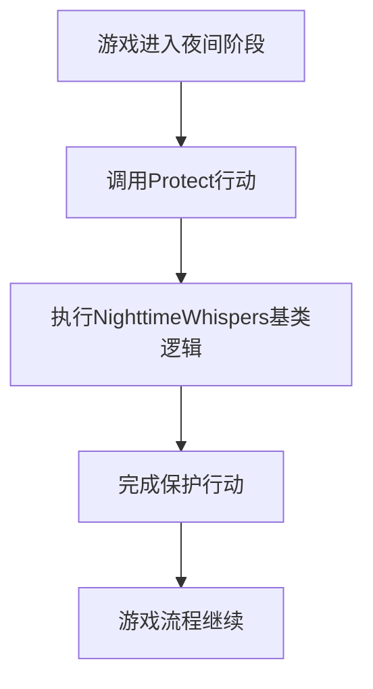

# `.\MetaGPT\metagpt\ext\werewolf\actions\guard_actions.py` 详细设计文档

该代码定义了一个名为`Protect`的类，该类继承自`NighttimeWhispers`，用于在狼人杀游戏扩展中实现“保护”这一夜间行动。它通过继承复用基础逻辑，并指定了该行动的具体名称。

## 整体流程



## 类结构

```
NighttimeWhispers (基类，来自metagpt.ext.werewolf.actions.common_actions)
└── Protect (子类，实现具体的保护行动)
```

## 全局变量及字段


### `Protect.name`
    
表示该动作的名称，其值为固定的字符串'Protect'，用于标识这是一个保护动作。

类型：`str`
    
    

## 全局函数及方法


## 关键组件


### NighttimeWhispers

一个用于处理狼人杀游戏中夜间行动（如保护、查验等）的通用基类，定义了夜间行动的基本结构和行为。

### Protect

继承自NighttimeWhispers的具体行动类，代表游戏中守卫（Guardian）角色的“保护”行动，用于在夜间保护一名玩家免受伤害。


## 问题及建议


### 已知问题

-   **类定义过于简单，缺乏具体实现**：`Protect` 类仅继承了 `NighttimeWhispers` 并设置了 `name` 属性，没有重写或实现任何核心方法（如 `run` 方法）。这可能导致其无法执行预期的“保护”逻辑，功能不完整或依赖于父类的默认行为，这可能不符合设计意图。
-   **潜在的命名与职责混淆**：类名 `Protect` 暗示了其保护功能，但其父类 `NighttimeWhispers` 的名称暗示了“夜间低语”或夜间行动。如果 `Protect` 是一个需要在夜间执行的行动，继承关系是合理的；但若保护行动可能发生在白天或其他阶段，此继承关系可能限制了类的通用性，造成语义上的不一致。
-   **缺乏配置或状态灵活性**：`name` 属性被硬编码为 `"Protect"`。虽然这明确了行动标识，但如果未来需要支持同一行动的不同变体（如“强力保护”、“单体保护”），当前设计缺乏扩展性。

### 优化建议

-   **实现核心行动逻辑**：应在 `Protect` 类中重写关键方法（例如 `run` 方法），明确实现保护目标玩家的具体逻辑，包括如何选择目标、保护生效的规则以及与其他游戏元素的交互。这能确保该类具备独立且明确的功能。
-   **审查继承关系的合理性**：评估 `NighttimeWhispers` 基类的职责。如果所有夜间行动共享大量公共逻辑（如执行时间检查、目标选择验证等），则继承是合适的。否则，考虑是否应定义一个更通用的 `Action` 基类或使用组合模式来整合“夜间执行”这一特性，以提高代码的清晰度和灵活性。
-   **增强类的可配置性**：考虑将 `name` 属性改为通过类变量或实例初始化参数进行设置，以便于未来扩展或动态创建不同名称的保护行动实例。同时，可以添加其他实例属性（如 `protection_strength`, `target_type` 等）来使保护行为更具可定制性。
-   **添加文档字符串和类型注解**：为 `Protect` 类添加详细的文档字符串，说明其用途、行为以及如何与其他组件交互。同时，确保所有方法和属性都有完整的类型注解，以提高代码的可读性和可维护性。


## 其它


### 设计目标与约束

该代码旨在实现狼人杀游戏中的“保护”行动，作为夜间行动的一种特殊类型。设计目标包括：继承夜间行动的基础功能，确保行动名称正确标识为“保护”，并保持与游戏规则的一致性。约束条件包括：必须继承自`NighttimeWhispers`类，以确保夜间行动的基本逻辑和行为模式得以保留，同时不能修改父类的核心行为，仅通过设置`name`字段来定制化行动名称。

### 错误处理与异常设计

当前代码未显式定义错误处理或异常捕获机制。错误处理依赖于父类`NighttimeWhispers`的实现。潜在异常可能包括：继承关系错误、字段赋值异常或运行时行为异常。建议在后续开发中，考虑添加输入验证、异常捕获和日志记录，以提高代码的健壮性和可维护性。

### 数据流与状态机

该类的数据流相对简单：初始化时设置`name`字段为“Protect”，继承父类的状态和行为。在游戏运行时，该行动作为夜间阶段的一个状态节点，触发保护逻辑。状态机依赖于父类`NighttimeWhispers`定义的夜间行动流程，保护行动作为其中一个状态转移动作，影响游戏状态（如玩家状态更新）。

### 外部依赖与接口契约

外部依赖包括：`metagpt.ext.werewolf.actions.common_actions`模块中的`NighttimeWhispers`类。接口契约方面，该类通过继承`NighttimeWhispers`，隐式遵守了夜间行动的公共接口（如行动执行方法）。未来扩展时，需确保不破坏父类的接口契约，同时可定义额外的保护相关方法。

### 测试策略与验证要点

测试策略应包括：单元测试验证`Protect`类正确继承父类、字段`name`初始化为“Protect”、行动执行是否符合保护逻辑。集成测试需验证在游戏环境中，保护行动能否正确触发并影响游戏状态。验证要点：继承关系正确性、字段默认值、与父类行为的兼容性、以及行动在游戏流程中的集成效果。

### 部署与配置说明

部署时，该类作为狼人杀游戏行动模块的一部分，需确保`metagpt.ext.werewolf.actions.common_actions`模块可用。配置方面，无需额外配置，`name`字段已硬编码为“Protect”。在扩展或修改时，可通过子类化或配置注入来支持动态行动名称，但当前版本为静态实现。

### 安全与权限考虑

在当前上下文中，安全风险较低，主要涉及游戏逻辑的正确性。权限方面，保护行动应仅在夜间阶段由特定角色（如守卫）执行。需确保游戏状态机正确限制行动触发条件和执行者权限，防止未授权或不合规的行动执行，避免游戏平衡被破坏。

### 性能与可扩展性

性能方面，该类为轻量级实现，无复杂计算或资源消耗。可扩展性良好：通过继承机制，可轻松创建新的夜间行动类型。建议未来考虑使用策略模式或插件架构，以支持动态行动注册和管理，提升模块的灵活性和可维护性。

### 文档与示例代码

文档应包含类的作用、继承关系、字段说明和使用示例。示例代码可展示如何实例化`Protect`类、集成到游戏流程中。建议补充详细的API文档和游戏规则上下文说明，以帮助其他开发者理解和使用该行动类。

### 兼容性与迁移计划

该类与父类`NighttimeWhispers`完全兼容，无需迁移。未来若父类接口变更，需评估影响并更新子类。建议保持向后兼容性，或提供迁移指南，确保现有游戏逻辑不受破坏。在引入新功能时，考虑版本控制和渐进式更新策略。

    