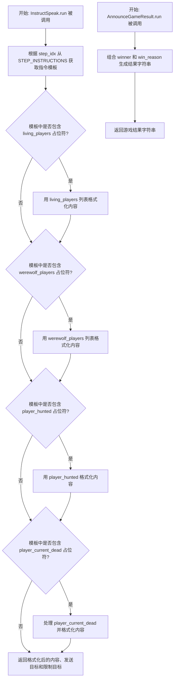
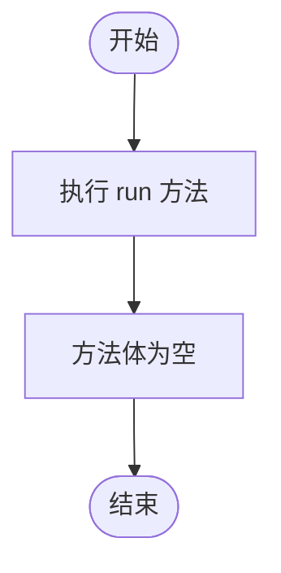
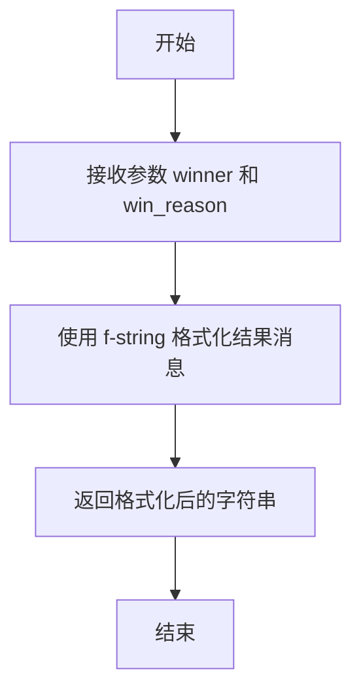

# `.\MetaGPT\metagpt\ext\werewolf\actions\moderator_actions.py` 详细设计文档

该代码定义了狼人杀游戏中的三个核心动作类，主要用于处理游戏流程中的指令生成、发言解析和结果宣布。`InstructSpeak` 根据游戏阶段和状态生成并格式化发送给玩家的指令；`ParseSpeak` 预留了玩家发言的解析功能；`AnnounceGameResult` 用于宣布游戏最终结果。

## 整体流程



## 类结构

```
Action (基类，来自 metagpt.actions)
├── InstructSpeak
├── ParseSpeak
└── AnnounceGameResult
```

## 全局变量及字段


### `STEP_INSTRUCTIONS`
    
一个字典常量，用于存储狼人杀游戏不同步骤的指令信息，包含指令内容、发送对象和限制对象。

类型：`dict`
    


### `InstructSpeak.name`
    
动作类的名称标识，固定为'InstructSpeak'。

类型：`str`
    


### `ParseSpeak.name`
    
动作类的名称标识，固定为'ParseSpeak'。

类型：`str`
    
    

## 全局函数及方法

### `InstructSpeak.run`

该方法根据游戏当前步骤的索引，从预定义的指令映射中获取对应的指令信息，并根据传入的游戏状态参数（如存活玩家、狼人玩家等）对指令内容进行动态格式化，最终返回格式化后的指令内容、指令发送对象和指令接收限制对象。

参数：

- `step_idx`：`int`，当前游戏步骤的索引，用于从`STEP_INSTRUCTIONS`中查找对应的指令。
- `living_players`：`list`，当前存活玩家的列表。
- `werewolf_players`：`list`，当前狼人玩家的列表。
- `player_hunted`：`str`，被猎人带走的玩家名称。
- `player_current_dead`：`str`，当前夜晚或白天死亡的玩家名称。

返回值：`tuple`，一个包含三个元素的元组，分别是格式化后的指令内容字符串、指令发送对象字典和指令接收限制对象字典。

#### 流程图

```mermaid
flowchart TD
    A[开始] --> B[根据step_idx从STEP_INSTRUCTIONS获取指令信息]
    B --> C{获取成功?}
    C -- 是 --> D[提取content, send_to, restricted_to]
    C -- 否 --> E[使用默认未知指令信息]
    E --> D
    D --> F{content包含<br>{living_players}和<br>{werewolf_players}?}
    F -- 是 --> G[格式化living_players, werewolf_players, werewolf_num]
    F -- 否 --> H{content包含<br>{living_players}?}
    G --> H
    H -- 是 --> I[格式化living_players]
    H -- 否 --> J{content包含<br>{werewolf_players}?}
    I --> J
    J -- 是 --> K[格式化werewolf_players]
    J -- 否 --> L{content包含<br>{player_hunted}?}
    K --> L
    L -- 是 --> M[格式化player_hunted]
    L -- 否 --> N{content包含<br>{player_current_dead}?}
    M --> N
    N -- 是 --> O[处理player_current_dead默认值并格式化]
    N -- 否 --> P[返回content, send_to, restricted_to]
    O --> P
    P --> Q[结束]
```

#### 带注释源码

```python
async def run(self, step_idx, living_players, werewolf_players, player_hunted, player_current_dead):
    # 1. 根据步骤索引获取指令信息，若未找到则使用默认值
    instruction_info = STEP_INSTRUCTIONS.get(
        step_idx, {"content": "Unknown instruction.", "send_to": {}, "restricted_to": {}}
    )
    # 2. 提取指令内容模板
    content = instruction_info["content"]
    # 3. 按优先级和存在性，使用传入的游戏状态参数对指令内容模板进行格式化
    #    优先级：同时包含两个变量的格式化 > 单个变量的格式化
    if "{living_players}" in content and "{werewolf_players}" in content:
        content = content.format(
            living_players=living_players, werewolf_players=werewolf_players, werewolf_num=len(werewolf_players)
        )
    if "{living_players}" in content:
        content = content.format(living_players=living_players)
    if "{werewolf_players}" in content:
        content = content.format(werewolf_players=werewolf_players)
    if "{player_hunted}" in content:
        content = content.format(player_hunted=player_hunted)
    if "{player_current_dead}" in content:
        # 对player_current_dead参数进行空值处理，若为空则设为“No one”
        player_current_dead = "No one" if not player_current_dead else player_current_dead
        content = content.format(player_current_dead=player_current_dead)
    # 4. 返回格式化后的内容、发送目标和限制目标
    return content, instruction_info["send_to"], instruction_info["restricted_to"]
```

### `ParseSpeak.run`

该方法当前为空实现，未定义任何功能。根据其类名和上下文推断，其设计目标可能是解析游戏中的发言内容，但具体逻辑尚未实现。

参数：
-  `self`：`ParseSpeak`，`ParseSpeak` 类的实例

返回值：`None`，该方法当前不返回任何值

#### 流程图



#### 带注释源码

```
async def run(self):
    # 当前方法为空实现，未包含任何业务逻辑。
    # 根据类名 `ParseSpeak` 推断，未来可能需要在此处添加解析发言内容的代码。
    pass
```

### `AnnounceGameResult.run`

该方法用于宣布游戏结果，根据传入的获胜方和获胜原因，生成并返回一条格式化的游戏结束消息。

参数：

- `winner`：`str`，获胜方的名称或标识。
- `win_reason`：`str`，描述获胜原因的字符串。

返回值：`str`，一条格式化的字符串，内容为“Game over! {win_reason}. The winner is the {winner}”。

#### 流程图



#### 带注释源码

```python
async def run(self, winner: str, win_reason: str):
    # 使用 f-string 格式化字符串，将传入的获胜方和获胜原因嵌入到预设的消息模板中。
    return f"Game over! {win_reason}. The winner is the {winner}"
```

## 关键组件

### InstructSpeak

一个用于根据游戏步骤索引和当前游戏状态，从预定义的指令模板中生成并格式化特定指令内容的动作类。它负责处理占位符替换，并返回格式化后的指令内容、发送目标和限制目标。

### ParseSpeak

一个用于解析玩家发言的动作类。当前代码中其 `run` 方法为空，表明这是一个待实现或预留的组件，预期功能是处理和分析游戏中的语音或文本发言。

### AnnounceGameResult

一个用于宣布游戏最终结果的动作类。它接收获胜方和获胜原因作为输入，生成并返回格式化的游戏结束公告字符串。

## 问题及建议


### 已知问题

-   **`ParseSpeak` 类功能不完整**：`ParseSpeak` 类的 `run` 方法仅包含 `pass` 语句，未实现任何解析发言的逻辑，这会导致调用此功能时无法正常工作。
-   **`InstructSpeak.run` 方法参数过多且职责混杂**：该方法接收了 `step_idx`, `living_players`, `werewolf_players`, `player_hunted`, `player_current_dead` 等多个参数，并同时负责根据步骤索引查找指令、格式化内容以及返回发送和限制信息。这违反了单一职责原则，使得方法难以理解、测试和维护。
-   **硬编码的字符串格式化逻辑脆弱**：`InstructSpeak.run` 方法中通过多个 `if` 语句检查并格式化字符串中的占位符（如 `{living_players}`）。这种逻辑是硬编码的，如果 `STEP_INSTRUCTIONS` 中的指令模板新增或修改了占位符，必须同步修改此处的代码，否则会导致格式化失败或信息缺失，容易出错且扩展性差。
-   **`AnnounceGameResult` 类缺少 `name` 属性**：该类继承自 `Action`，但未定义 `name: str` 类属性。根据基类设计或序列化需求，这可能是一个必须字段，缺失可能导致运行时错误或序列化问题。
-   **`player_current_dead` 的默认值处理不一致**：在格式化 `{player_current_dead}` 时，如果值为空，会将其设置为 `"No one"`。这个逻辑内嵌在格式化过程中，不够清晰，且 `"No one"` 这个字符串是硬编码的，如果需求变更（例如需要翻译或多语言支持），修改起来不便。
-   **缺乏输入验证和错误处理**：代码中没有对输入参数（如 `step_idx` 是否有效、`living_players` 等是否为预期类型）进行验证。如果传入无效的 `step_idx`，会使用一个默认的 `"Unknown instruction."`，但更健壮的做法可能是抛出明确的异常。对于 `instruction_info` 字典的键访问也缺少安全性检查（虽然使用了 `.get` 方法，但后续直接访问 `["send_to"]` 等键，若 `.get` 返回的字典结构不符合预期会引发 `KeyError`）。

### 优化建议

-   **实现 `ParseSpeak.run` 方法**：根据类的命名和上下文，实现解析玩家发言内容、提取关键信息（如投票对象、角色声明等）的逻辑，并返回结构化的数据。
-   **重构 `InstructSpeak.run` 方法，分离关注点**：
    -   将根据 `step_idx` 获取指令信息的逻辑提取到一个独立的方法中。
    -   将字符串格式化的逻辑提取到一个独立的方法或函数中。可以考虑使用更通用的方法，如遍历一个预定义的占位符到实际值的映射字典来进行格式化，而不是写死多个 `if` 判断。
    -   `run` 方法本身主要负责协调这些子步骤。
-   **使用更灵活的字符串格式化机制**：建议使用 Python 的 `str.format` 或 `f-string` 配合 `**kwargs` 的方式。可以预先构建一个包含所有可能占位符及其对应值的字典，然后一次性进行格式化。这样即使指令模板变化，也只需更新构建字典的逻辑，而无需修改格式化代码本身。
-   **为 `AnnounceGameResult` 类添加 `name` 属性**：明确定义 `name: str = "AnnounceGameResult"` 类属性，以符合基类约定和潜在的工具要求。
-   **将默认值处理逻辑外置或参数化**：将 `"No one"` 这样的默认值定义为类常量或通过参数传入，提高可配置性。同时，考虑在方法更靠前的位置统一处理参数默认值，使逻辑更清晰。
-   **增加输入验证和防御性编程**：
    -   验证 `step_idx` 的有效性，若无效可抛出 `ValueError` 或返回一个明确的错误结果。
    -   在访问 `instruction_info` 的 `"send_to"` 和 `"restricted_to"` 等键时，使用 `.get()` 方法并提供合理的默认值（如空字典 `{}`），以避免 `KeyError`。
    -   对关键输入参数进行类型检查（例如使用 `isinstance`），确保它们符合预期。
-   **考虑引入配置或常量管理**：将 `STEP_INSTRUCTIONS` 这个外部依赖以及 `"Unknown instruction."` 这样的字符串常量，通过更明确的配置类或模块来管理，提高可维护性。
-   **补充文档和类型注解**：为类和方法添加详细的文档字符串（docstring），说明其用途、参数、返回值和可能抛出的异常。为 `run` 方法的参数和返回值添加更精确的类型注解（例如使用 `List[str]`, `Dict` 等），以提升代码可读性和工具支持（如静态类型检查）。


## 其它


### 设计目标与约束

该模块的设计目标是提供一个可扩展的指令生成框架，用于在“狼人杀”游戏环境中，根据不同的游戏阶段和状态，动态生成并格式化发送给玩家的指令文本。其核心约束包括：1) 必须严格遵循预定义的 `STEP_INSTRUCTIONS` 指令模板字典；2) 必须能够处理多种游戏状态变量（如存活玩家、狼人玩家、被猎杀玩家等）的格式化替换；3) 必须保持与 `Action` 基类的兼容性，确保 `run` 异步方法的签名和行为符合框架预期。

### 错误处理与异常设计

当前代码的错误处理较为基础。主要依赖于 `STEP_INSTRUCTIONS.get` 方法提供默认值来应对未知的 `step_idx`。然而，对于格式化过程中可能出现的键缺失或类型不匹配问题（例如，模板中包含 `{werewolf_players}` 但传入的 `werewolf_players` 为 `None`），代码没有显式的异常捕获或验证，这可能导致运行时 `KeyError` 或格式化错误。建议增加对输入参数的验证，并在格式化失败时提供更明确的错误信息或回退内容。

### 数据流与状态机

数据流始于游戏引擎传入的当前步骤索引 (`step_idx`) 和游戏状态数据（`living_players` 等）。`InstructSpeak.run` 方法根据 `step_idx` 从 `STEP_INSTRUCTIONS` 状态-指令映射表中检索出对应的指令模板和元数据（发送对象 `send_to` 和限制对象 `restricted_to`）。接着，方法将游戏状态数据按需填充到指令模板的占位符中，生成最终的指令内容 (`content`)。输出是一个三元组：`(格式化后的指令内容, 发送目标, 限制目标)`。这清晰地体现了从游戏状态到具体指令的转换过程，`STEP_INSTRUCTIONS` 实质上定义了一个隐式的游戏步骤状态机。

### 外部依赖与接口契约

1.  **外部依赖**:
    *   `metagpt.actions.Action`: 所有类继承自此基类，依赖其定义的接口和可能的基础设施。
    *   `metagpt.environment.werewolf.const.STEP_INSTRUCTIONS`: 一个关键的全局常量字典，定义了游戏所有步骤的指令模板和元数据。模块的功能严重依赖此字典的完整性和正确性。
2.  **接口契约**:
    *   `InstructSpeak.run` 方法：调用者必须提供 `step_idx`（整数）和一系列游戏状态参数。它承诺返回一个 `(str, dict, dict)` 元组。
    *   `AnnounceGameResult.run` 方法：调用者必须提供 `winner` 和 `win_reason` 字符串。它承诺返回一个格式化的游戏结束字符串。
    *   `ParseSpeak` 类：当前仅定义了空方法 `run`，其接口契约（输入、输出）尚未明确，需要后续实现来定义。

### 安全与合规考虑

模块本身不直接处理用户输入或执行敏感操作。主要风险在于 `STEP_INSTRUCTIONS` 中模板内容的定义。如果模板内容来自不可信源或包含可执行代码格式，在格式化时可能存在注入风险。当前使用 `str.format()` 方法相对安全，但仍需确保模板内容本身是受信任的。`send_to` 和 `restricted_to` 字典用于控制指令的接收范围，其正确配置对于游戏逻辑的公平性和正确性至关重要，属于业务逻辑安全的一部分。

    