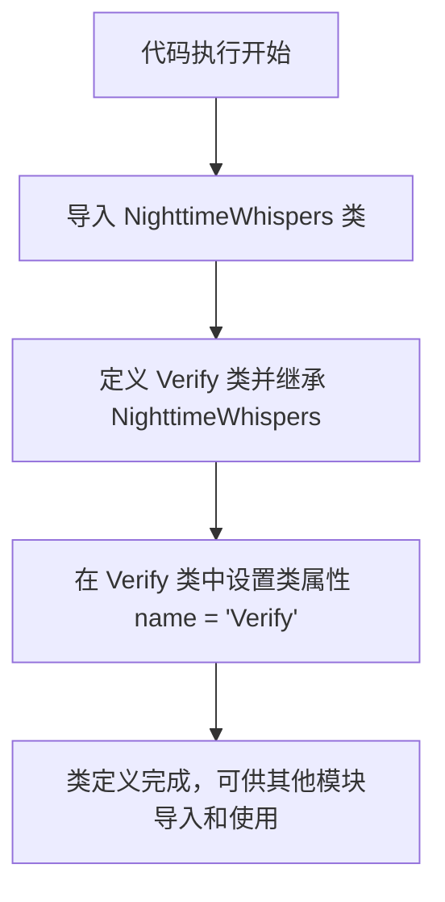

# `.\MetaGPT\metagpt\ext\werewolf\actions\seer_actions.py` 详细设计文档

该代码定义了一个名为 `Verify` 的类，它继承自 `NighttimeWhispers` 类。`Verify` 类用于在狼人杀游戏环境中执行“验证”动作，其核心功能是重写父类的 `name` 属性，将其固定为 'Verify'，从而在游戏逻辑中标识此特定类型的夜间行动。

## 整体流程



## 类结构

```
NighttimeWhispers (父类，来自 metagpt.ext.werewolf.actions.common_actions)
└── Verify (子类，重写 name 属性)
```

## 全局变量及字段


### `Verify.name`
    
表示该动作的名称，固定为'Verify'，用于标识预言家查验身份的动作。

类型：`str`
    
    

## 全局函数及方法


## 关键组件


### NighttimeWhispers

NighttimeWhispers 是一个基础动作类，为狼人杀游戏中的夜间私语或信息验证类行动提供了通用的框架和结构。

### Verify

Verify 是一个具体的行动类，继承自 NighttimeWhispers，专门用于实现游戏角色“预言家”在夜间查验其他玩家身份的核心功能。


## 问题及建议


### 已知问题

-   **类定义过于简单，缺乏具体实现**：`Verify` 类仅继承了 `NighttimeWhispers` 并设置了 `name` 属性，没有定义任何新的方法或覆盖父类方法。这可能导致其功能与父类完全一致，`Verify` 这一特定行为名存实亡，或者其核心逻辑完全依赖于父类的默认实现，缺乏明确的、可验证的行为定义。
-   **潜在的继承滥用**：如果 `Verify` 类的目的是执行一个特定的“验证”动作，但当前除了改名外没有增加任何新特性，这可能是一种为了复用而继承的“为继承而继承”设计。如果 `NighttimeWhispers` 并非一个逻辑上合适的基类（例如，其核心行为与“验证”无关），这种继承关系会误导代码的阅读者，并增加未来维护的复杂度。
-   **缺乏行为定制化**：`NighttimeWhispers` 类可能包含了一些默认的夜间私语行为。`Verify` 类作为其子类，如果没有重写关键方法（如 `run` 或 `_run` 方法），则无法根据“验证”这一特殊场景调整行为，例如生成特定的提示词、处理不同的输入或输出格式。

### 优化建议

-   **明确类职责并实现具体逻辑**：应在 `Verify` 类中实现其独有的“验证”行为。至少应重写从父类继承的核心行动方法（例如 `run` 方法），在该方法中实现验证玩家身份、检查信息真伪等具体逻辑。即使部分逻辑可复用父类，也应通过调用 `super()` 并添加额外步骤来明确差异。
-   **审查继承关系的合理性**：重新评估 `Verify` 继承自 `NighttimeWhispers` 是否合适。如果“验证”与“夜间私语”在行为模式上存在本质不同，应考虑使用组合而非继承，或者让两者共同继承自一个更抽象的基础行动类（如 `RoleAction`），然后在各自类中实现细节。
-   **添加文档字符串**：为 `Verify` 类添加详细的文档字符串，说明其设计意图、与父类的区别、以及 `name` 属性被固定为 “Verify” 的原因。这有助于其他开发者理解这个看似简单的类存在的价值。
-   **考虑使用配置或参数化**：如果 `Verify` 的行为需要根据游戏规则或角色变化，可以考虑将部分逻辑参数化，而不是硬编码在方法内部。例如，可以将验证的目标类型、成功条件等作为类属性或方法参数。


## 其它


### 设计目标与约束

该代码定义了一个名为 `Verify` 的类，其核心设计目标是作为狼人杀游戏中的一个特定夜间行动（查验身份）。它继承自 `NighttimeWhispers`，表明其行为遵循夜间私语（如预言家查验）的通用规则和流程。主要约束包括：必须与 `NighttimeWhispers` 基类保持接口和行为一致性，确保在游戏状态机中正确触发和执行，并返回符合游戏引擎预期的结果格式。

### 错误处理与异常设计

当前代码片段未显式定义错误处理逻辑。错误处理主要依赖于基类 `NighttimeWhispers` 的实现。预期的异常可能包括：游戏状态不正确（如非夜间阶段调用）、目标玩家无效或已死亡、行动能力已使用等。这些异常应由基类或游戏上下文环境捕获和处理，可能通过抛出特定异常或返回错误状态码来中断行动流程，并通知游戏引擎进行相应状态回滚或提示。

### 数据流与状态机

1.  **触发**：在游戏状态机进入“预言家行动”或特定的夜间阶段时，由游戏引擎实例化并调用 `Verify` 行动。
2.  **输入**：通常接收游戏上下文（包含所有玩家状态、历史等）以及行动执行者（预言家）指定的目标玩家ID作为参数。这些输入可能来自基类方法的参数。
3.  **处理**：`Verify` 类的 `run` 方法（继承或重写）被调用。其内部逻辑应访问目标玩家的身份信息。
4.  **输出**：生成一个行动结果，通常包含被查验玩家的阵营信息（如“好人”或“狼人”）。此结果可能被格式化为特定的消息结构（如 `Message` 对象）。
5.  **状态更新**：行动结果被提交给游戏引擎。引擎据此更新预言家的“已行动”状态，并可能记录查验结果到游戏日志或特定玩家的知识库中。游戏状态机随后推进到下一个环节。

### 外部依赖与接口契约

1.  **继承依赖**：强依赖于 `metagpt.ext.werewolf.actions.common_actions.NighttimeWhispers` 基类。需要该基类明确定义夜间行动的共同接口（如 `run` 方法）、属性以及与游戏引擎交互的约定。
2.  **游戏上下文依赖**：依赖于外部的游戏状态管理、玩家信息存储等上下文环境。这些通常通过基类方法参数或类字段注入。
3.  **接口契约**：`Verify` 类通过其基类，隐式遵守了狼人杀行动模块的接口契约。它必须提供一个 `name` 属性（已定义）并实现预期的行动执行方法。其 `run` 方法的签名和返回值类型必须与基类及其他行动类兼容，以确保游戏引擎能统一调度和处理。

    