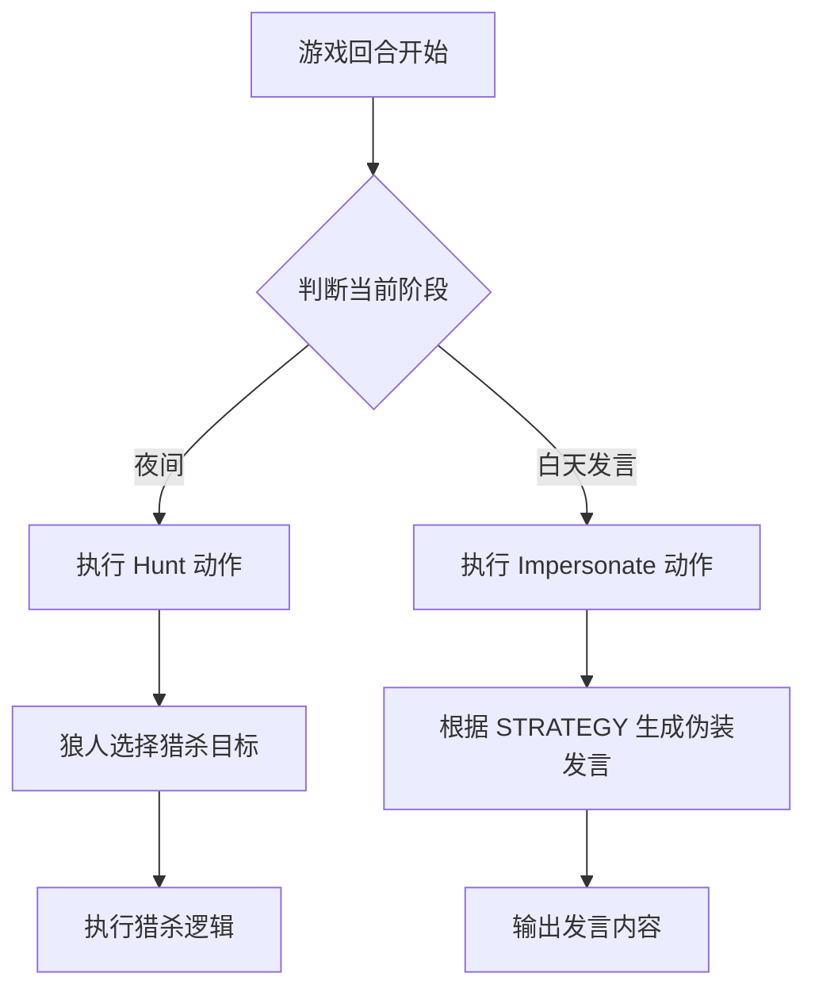

# `.\MetaGPT\metagpt\ext\werewolf\actions\werewolf_actions.py` 详细设计文档

该文件定义了两个狼人杀游戏中的角色动作类：`Hunt`（狼人夜间猎杀）和`Impersonate`（狼人白天伪装发言）。它们继承自基础动作类，分别用于处理夜间行动和白天发言阶段的策略性伪装行为。

## 整体流程



## 类结构

```
NighttimeWhispers (夜间低语基类)
└── Hunt (狼人猎杀)
Speak (发言基类)
└── Impersonate (狼人伪装发言)
```

## 全局变量及字段


### `Hunt.name`
    
定义Hunt动作的名称，固定为'Hunt'，用于标识该动作。

类型：`str`
    


### `Impersonate.STRATEGY`
    
定义Impersonate动作的策略文本，指导狼人如何在白天发言时伪装成好人角色以隐藏身份。

类型：`str`
    


### `Impersonate.name`
    
定义Impersonate动作的名称，固定为'Impersonate'，用于标识该动作。

类型：`str`
    
    

## 全局函数及方法


## 关键组件


### NighttimeWhispers

NighttimeWhispers 是一个动作类，用于定义狼人杀游戏中夜间阶段（如狼人行动、预言家查验等）角色可以执行的特定操作。

### Speak

Speak 是一个动作类，用于定义狼人杀游戏中白天发言阶段角色可以执行的公开讲话行为。

### Hunt

Hunt 是一个继承自 NighttimeWhispers 的动作类，专门表示狼人角色在夜间阶段执行的“猎杀”玩家行动。

### Impersonate

Impersonate 是一个继承自 Speak 的动作类，专门表示狼人角色在白天发言阶段执行的“伪装”行动，其核心策略是通过模仿好人阵营角色来隐藏狼人身份并误导其他玩家。


## 问题及建议


### 已知问题

-   **类 `Hunt` 定义过于简单**：`Hunt` 类仅继承了 `NighttimeWhispers` 并设置了一个 `name` 属性，没有定义任何新的方法或覆盖父类行为。这可能导致其功能与父类完全一致，使得创建这个独立类的必要性存疑，可能只是一个占位符或未完成的实现。
-   **`Impersonate` 类的策略字符串硬编码**：`STRATEGY` 类变量以硬编码字符串形式定义了行动策略。这降低了灵活性，使得策略难以根据游戏上下文、玩家配置或学习结果进行动态调整或国际化。
-   **潜在的继承滥用**：`Impersonate` 继承自 `Speak`。虽然逻辑上“模仿发言”是一种“发言”，但如果 `Speak` 类包含大量与白天公开讨论相关的特定逻辑（如发言顺序、格式校验），而 `Impersonate` 仅需复用其基础框架但核心行为（生成欺骗性内容）完全不同，那么继承可能导致 `Impersonate` 承担不必要的父类约束或接口。组合或更明确的接口实现可能是更清晰的选择。
-   **缺乏运行时策略验证**：`Impersonate.STRATEGY` 中的提示（如“DONT claim the same role...”）是给语言模型的自然语言指令，但在代码层面没有机制来确保生成的发言内容符合这些策略约束，或者对违反策略的输出进行过滤或修正。

### 优化建议

-   **充实 `Hunt` 类的功能**：如果 `Hunt` 旨在表示狼人的夜间猎杀行动，应为其定义专属的方法（例如 `_act` 或 `run` 方法），覆盖父类 `NighttimeWhispers` 的行为，实现选择猎杀目标、生成行动描述等具体逻辑。如果当前无特殊逻辑，可考虑是否直接使用 `NighttimeWhispers` 或将其功能合并。
-   **将策略外部化或配置化**：将 `Impersonate.STRATEGY` 这样的策略文本移出代码，放入配置文件（如 YAML、JSON）、数据库或环境变量中。这样可以方便地进行策略更新、A/B测试或为不同游戏对局加载不同策略，也便于实现多语言支持。
-   **审查继承关系，考虑组合模式**：重新评估 `Impersonate` 与 `Speak` 的继承关系。如果 `Impersonate` 的核心是“生成具有欺骗性的发言内容”，而 `Speak` 主要提供“在游戏回合中发表言论”的框架，可以考虑让 `Impersonate` 持有一个“内容生成器”组件（可能基于LLM），并通过组合方式复用 `Speak` 的发言流程控制部分，而非直接继承。这可以提高模块的单一职责和可测试性。
-   **引入策略执行器或验证层**：创建一个策略执行或验证组件。该组件可以解析 `STRATEGY`（或从配置加载的策略规则），并在 `Impersonate` 行动生成发言内容后，检查内容是否与策略冲突（例如，是否意外声称了与狼队友相同的角色）。这可以作为内容生成后处理的一个步骤，提高行动的质量和安全性。初期可以实现简单的关键字匹配或规则检查。
-   **添加类型注解和文档**：为 `Hunt` 类添加明确的文档字符串，说明其设计意图和与 `NighttimeWhispers` 的区别。确保所有方法都有完整的类型注解，以提高代码可读性和静态检查能力。


## 其它


### 设计目标与约束

本模块的设计目标是为狼人杀游戏中的狼人角色提供两个关键的行为动作类：`Hunt`（狩猎）和`Impersonate`（伪装）。`Hunt`继承自`NighttimeWhispers`，旨在实现狼人在夜间阶段的私下交流与行动协调。`Impersonate`继承自`Speak`，旨在实现狼人在白天发言阶段伪装成其他角色（如预言家、守卫、村民等）以误导好人阵营、隐藏自身身份的策略性发言。核心约束包括：1. 确保`Impersonate`的行为逻辑严格遵循其定义的`STRATEGY`策略，避免与同阵营狼人声称相同角色而暴露。2. 保持与基类（`NighttimeWhispers`, `Speak`）接口和行为的一致性，以便集成到更大的游戏动作执行框架中。3. 代码需清晰、可扩展，便于未来新增或修改狼人的特定策略。

### 错误处理与异常设计

当前代码片段中未显式定义错误处理逻辑。错误处理主要依赖于其父类`NighttimeWhispers`和`Speak`的实现。潜在的错误场景包括：1. 在`Impersonate`执行过程中，如果策略解析失败或生成的内容不符合游戏规则（如意外暴露狼人身份），应能捕获异常并可能回退到默认的发言行为或记录错误日志。2. 父类动作执行时可能遇到的通用错误，如环境状态不满足动作触发条件（例如在非白天时段尝试执行`Impersonate`）。建议的改进是：在`Impersonate`类中重写执行方法，加入对`STRATEGY`应用结果的校验，或在更上层的动作调度器中实现状态校验和异常处理机制，确保游戏流程的健壮性。

### 数据流与状态机

`Hunt`和`Impersonate`动作的执行依赖于游戏的状态机。`Hunt`关联于“夜晚”状态，特别是狼人活动子状态，其触发和数据流（如选择狩猎目标）应在夜间行动逻辑内管理。`Impersonate`关联于“白天发言”状态，其触发由游戏回合管理机制控制。输入数据通常包括当前游戏上下文（如玩家列表、历史发言、角色信息）。对于`Impersonate`，其核心数据流是：游戏引擎提供上下文 -> `Impersonate`实例根据`STRATEGY`和上下文生成伪装发言文本 -> 输出文本被提交到游戏公共频道。这两个类本身不维护内部状态，是无状态的行动执行器，其行为由每次调用时传入的上下文决定。

### 外部依赖与接口契约

1.  **继承依赖**：`Hunt`类依赖`metagpt.ext.werewolf.actions.common_actions.NighttimeWhispers`基类，继承了其夜间私聊的协议和执行框架。`Impersonate`类依赖`metagpt.ext.werewolf.actions.common_actions.Speak`基类，继承了公开发言的协议和执行框架。任何对基类接口或行为的更改都可能影响这两个子类。
2.  **策略依赖**：`Impersonate`类的行为高度依赖其硬编码的`STRATEGY`字符串。该策略定义了伪装行为的核心逻辑，是其功能性契约的关键部分。修改`STRATEGY`将直接改变`Impersonate`的行为输出。
3.  **游戏引擎契约**：这两个类需要被集成到一个更大的狼人杀游戏模拟引擎中。引擎需要按照正确的游戏阶段（夜晚/白天）实例化并调用相应的动作类，并提供必要的上下文信息（`RoleContext` 或类似对象）。它们对外暴露的接口（主要是`name`属性和从父类继承的`run`或等效方法）必须符合游戏引擎对“动作”的调用约定。

    