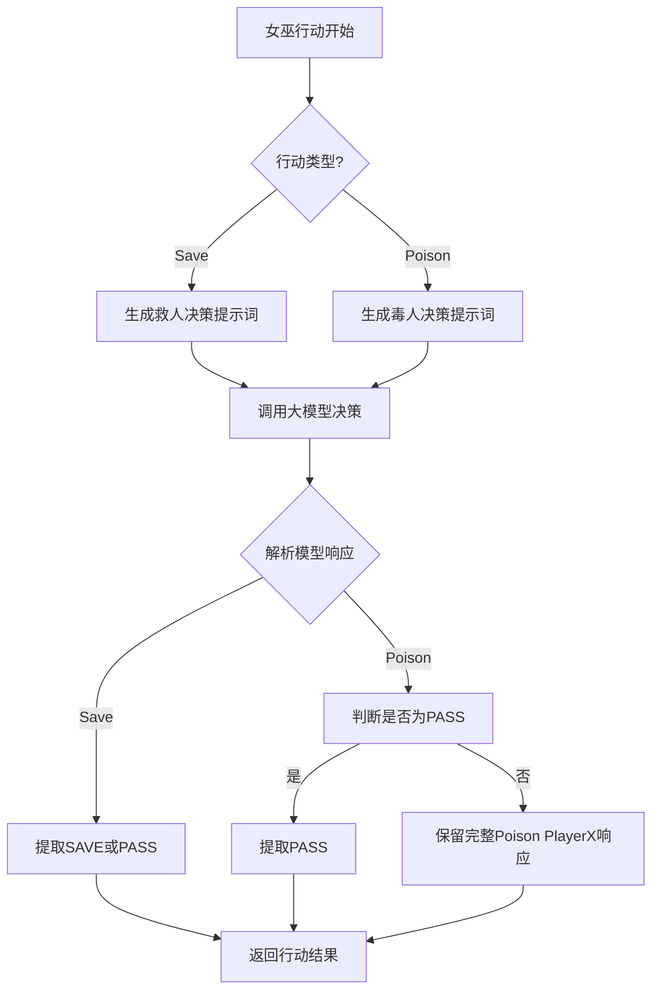
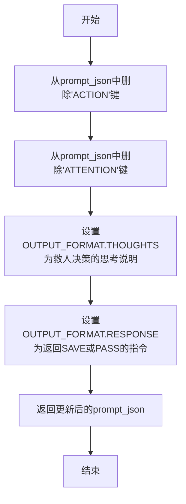
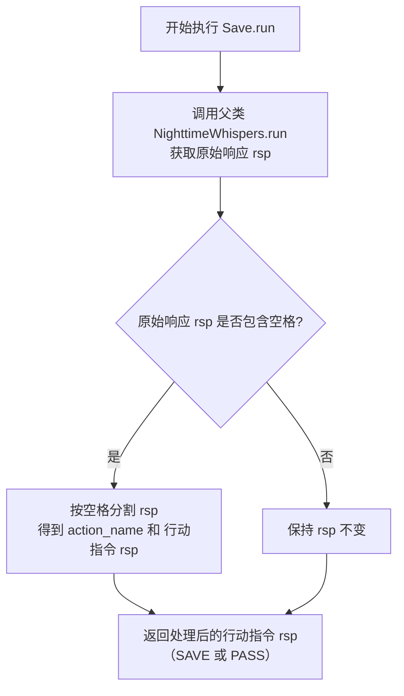
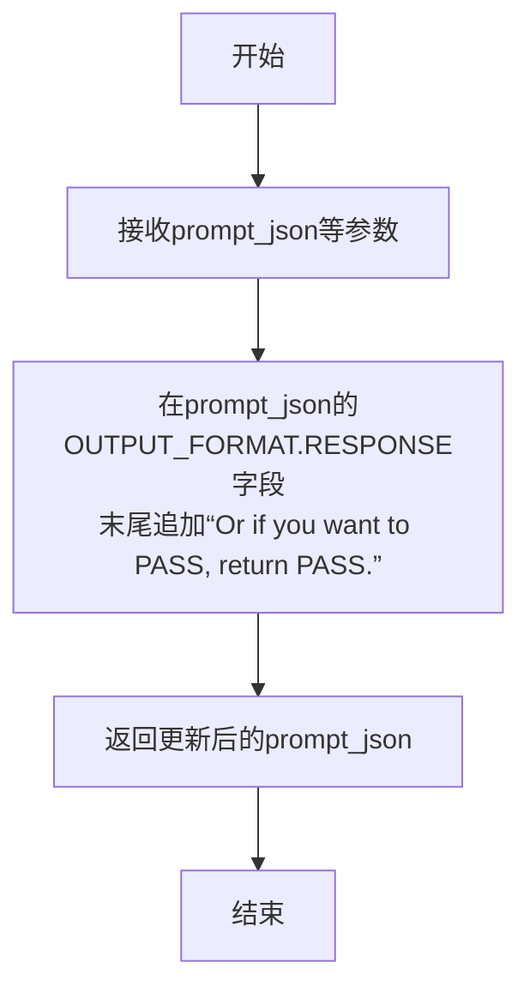
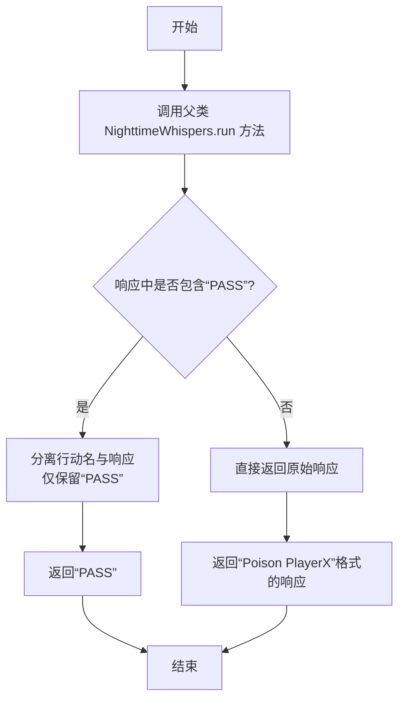

# `.\MetaGPT\metagpt\ext\werewolf\actions\witch_actions.py` 详细设计文档

该文件定义了狼人杀游戏中女巫角色的两个核心夜间行动类：`Save`（救人）和`Poison`（毒人）。它们继承自通用的`NighttimeWhispers`基类，通过覆写提示词生成方法和响应处理逻辑，实现了女巫在夜间决定是否使用解药拯救被狼人击杀的玩家，或使用毒药击杀一名可疑玩家的决策流程。

## 整体流程



## 类结构

```
NighttimeWhispers (夜间行动基类)
├── Save (女巫救人行动)
└── Poison (女巫毒人行动)
```

## 全局变量及字段


### `Save.name`
    
定义动作的名称，固定为'Save'，用于标识女巫的救人行为。

类型：`str`
    


### `Poison.STRATEGY`
    
定义女巫使用毒药时的策略指导，包含何时应该或不应该毒杀玩家的规则。

类型：`str`
    


### `Poison.name`
    
定义动作的名称，固定为'Poison'，用于标识女巫的毒人行为。

类型：`str`
    
    

## 全局函数及方法


### `Save._update_prompt_json`

该方法用于更新女巫（Save 动作）的提示词 JSON 模板。它移除了通用的动作和注意力字段，并针对“救人”这一特定场景，定制了思考步骤（THOUGHTS）和响应格式（RESPONSE）的说明。

参数：

-  `prompt_json`：`dict`，原始的提示词 JSON 模板。
-  `role_profile`：`str`，角色背景描述。
-  `role_name`：`str`，角色名称。
-  `context`：`str`，当前游戏上下文信息。
-  `reflection`：`str`，角色的反思。
-  `experiences`：`str`，角色的经验。

返回值：`dict`，更新后的、针对“救人”动作定制的提示词 JSON 字典。

#### 流程图



#### 带注释源码

```python
    def _update_prompt_json(
        self, prompt_json: dict, role_profile: str, role_name: str, context: str, reflection: str, experiences: str
    ) -> dict:
        # 1. 删除通用字段：由于Save动作的提示词是特化的，不需要通用的ACTION和ATTENTION指令。
        del prompt_json["ACTION"]
        del prompt_json["ATTENTION"]

        # 2. 定制思考步骤(THOUGHTS)：指导AI在夜间思考是否要拯救被杀的玩家。
        prompt_json["OUTPUT_FORMAT"][
            "THOUGHTS"
        ] = "It is night time. Return the thinking steps of your decision of whether to save the player JUST killed this night."
        # 3. 定制响应格式(RESPONSE)：明确要求AI的最终输出只能是"SAVE"或"PASS"。
        prompt_json["OUTPUT_FORMAT"][
            "RESPONSE"
        ] = "Follow the Moderator's instruction, decide whether you want to save that person or not. Return SAVE or PASS."

        # 4. 返回更新后的提示词字典，供后续的LLM调用使用。
        return prompt_json
```


### `Save.run`

该方法用于执行女巫的“救人”行动。它继承自`NighttimeWhispers`基类的`run`方法，获取AI代理的决策响应后，对响应进行格式化处理，提取出纯粹的行动指令（`SAVE`或`PASS`）。

参数：

-  `*args`：`tuple`，可变位置参数，传递给父类`NighttimeWhispers.run`方法。
-  `**kwargs`：`dict`，可变关键字参数，传递给父类`NighttimeWhispers.run`方法。

返回值：`str`，返回经过处理的行动指令，为`"SAVE"`或`"PASS"`字符串。

#### 流程图



#### 带注释源码

```python
async def run(self, *args, **kwargs):
    # 1. 调用父类NighttimeWhispers的run方法，获取AI代理的原始决策响应。
    #    父类方法负责与LLM交互，生成包含行动和可能附加信息的字符串。
    rsp = await super().run(*args, **kwargs)
    
    # 2. 对原始响应进行后处理。
    #    预期格式为“ActionName SAVE”或“ActionName PASS”，需要拆分并提取后半部分。
    action_name, rsp = rsp.split()
    
    # 3. 返回处理后的、纯粹的行动指令。
    #    只需回复SAVE或PASS，不需要带上action名
    return rsp  # 只需回复SAVE或PASS，不需要带上action名
```


### `Poison._update_prompt_json`

该方法用于更新女巫（Poison）行动在夜间阶段的提示信息JSON模板。其核心功能是在继承自父类`NighttimeWhispers`的默认提示格式基础上，为女巫的“毒药”行动定制输出格式的响应部分，明确指示代理人可以返回“PASS”来放弃使用毒药。

参数：

-  `prompt_json`：`dict`，包含行动指令和输出格式的JSON模板
-  `role_profile`：`str`，当前代理人的角色背景描述
-  `role_name`：`str`，当前代理人的角色名称
-  `context`：`str`，当前游戏上下文信息
-  `reflection`：`str`，代理人之前的反思总结
-  `experiences`：`str`，代理人之前的经验总结

返回值：`dict`，更新后的提示信息JSON字典

#### 流程图



#### 带注释源码

```python
def _update_prompt_json(
    self, prompt_json: dict, role_profile: str, role_name: str, context: str, reflection: str, experiences: str
) -> dict:
    # 在现有的输出格式（RESPONSE）字符串末尾追加文本，
    # 明确告知代理人除了执行特定行动外，还可以选择“PASS”（放弃行动）。
    # 这为女巫的“毒药”行动提供了“不使用”的选项。
    prompt_json["OUTPUT_FORMAT"]["RESPONSE"] += "Or if you want to PASS, return PASS."
    # 返回修改后的提示信息JSON字典
    return prompt_json
```


### `Poison.run`

该方法用于执行女巫的“毒药”行动。它首先调用父类 `NighttimeWhispers` 的 `run` 方法来获取行动决策的原始响应。然后，它会检查响应中是否包含“PASS”指令。如果包含，则从响应中分离出行动名称，仅返回“PASS”；否则，直接返回原始响应（格式应为“Poison PlayerX”）。

参数：

- `*args`：`tuple`，可变位置参数，传递给父类 `run` 方法的参数。
- `**kwargs`：`dict`，可变关键字参数，传递给父类 `run` 方法的关键字参数。

返回值：`str`，返回处理后的行动决策字符串。如果选择“PASS”，则返回“PASS”；如果选择毒杀某玩家，则返回格式为“Poison PlayerX”的字符串。

#### 流程图



#### 带注释源码

```
async def run(self, *args, **kwargs):
    # 调用父类 NighttimeWhispers 的 run 方法，获取行动决策的原始响应
    rsp = await super().run(*args, **kwargs)
    
    # 检查原始响应中是否包含“PASS”指令（不区分大小写）
    if RoleActionRes.PASS.value in rsp.lower():
        # 如果包含“PASS”，则从响应中分离出行动名称（例如“Poison”）
        # 仅保留“PASS”作为最终响应
        action_name, rsp = rsp.split()  # 带PASS，只需回复PASS，不需要带上action名，否则是Poison PlayerX，无需改动
    
    # 返回处理后的响应：如果是“PASS”则返回“PASS”，否则返回“Poison PlayerX”格式的字符串
    return rsp
```


## 关键组件


### NighttimeWhispers 基类

作为女巫专属夜间行动（拯救和毒杀）的抽象基类，定义了更新提示模板和异步执行的核心流程。

### Save 类

继承自 `NighttimeWhispers`，代表女巫的“拯救”行动，负责处理女巫决定是否使用解药拯救当晚被狼人杀害的玩家。

### Poison 类

继承自 `NighttimeWhispers`，代表女巫的“毒杀”行动，包含毒杀策略，负责处理女巫决定是否使用毒药毒杀一名玩家。

### 提示模板动态更新机制

通过 `_update_prompt_json` 方法，允许子类（`Save` 和 `Poison`）根据具体行动需求，动态修改发送给大语言模型（LLM）的提示指令和输出格式。

### 行动响应后处理逻辑

在 `run` 方法中，对从基类或LLM返回的原始行动响应字符串进行解析和清理，确保返回给游戏引擎的指令格式（如 `SAVE`、`PASS` 或 `Poison PlayerX`）是标准且一致的。


## 问题及建议


### 已知问题

-   **`Save.run` 方法存在潜在的字符串解析错误**：该方法假设 `super().run()` 的返回值格式为 `"ActionName ResponseContent"`（例如 `"Save SAVE"`），并通过 `rsp.split()` 进行分割。如果父类 `NighttimeWhispers.run` 的返回值格式发生变化或不包含空格，此代码将抛出 `ValueError` 异常。
-   **`Poison.run` 方法逻辑不一致且脆弱**：该方法仅在响应中包含 `"PASS"` 时才尝试分割字符串以移除动作名。对于 `"Poison PlayerX"` 格式的响应则直接返回。这种条件性处理逻辑不一致，且同样依赖于父类返回值的特定格式，使得代码耦合度高且难以维护。
-   **硬编码的策略字符串**：`Poison` 类中的 `STRATEGY` 字段是一个硬编码的字符串。这限制了策略的动态调整能力，例如无法根据游戏的不同阶段或从外部配置加载不同的策略。
-   **缺乏输入验证**：`_update_prompt_json` 方法直接操作传入的 `prompt_json` 字典，假设其具有特定的键（如 `"ACTION"`, `"ATTENTION"`, `"OUTPUT_FORMAT"`）。如果传入的字典结构不符合预期，可能导致 `KeyError` 或产生错误的输出格式。
-   **代码重复**：`Save` 和 `Poison` 类都重写了 `_update_prompt_json` 方法，且 `Save` 类中的方法进行了大量的键删除操作。这种模式若在更多子类中重复，会导致维护成本增加。

### 优化建议

-   **重构 `run` 方法，解耦响应解析逻辑**：建议将响应解析逻辑从 `run` 方法中剥离。可以创建一个专门的父类方法（如 `_parse_response`）来处理从父类返回的原始响应，将其转换为标准格式（例如，始终返回动作结果，如 `"SAVE"`, `"PASS"`, `"PlayerX"`）。子类的 `run` 方法只需调用此解析方法，从而降低对父类实现细节的依赖。
-   **将策略外部化或参数化**：考虑将 `Poison.STRATEGY` 这样的策略性内容移至配置文件、数据库或作为类初始化参数传入。这样可以实现策略的热更新，并提高代码的灵活性。
-   **增强 `_update_prompt_json` 方法的健壮性**：在方法内部添加对 `prompt_json` 字典键的存在性检查，例如使用 `dict.get()` 方法或 `try-except` 块。或者，可以定义明确的输入数据契约（如使用Pydantic模型），并在方法开始时进行验证。
-   **提取公共逻辑到基类**：分析 `Save` 和 `Poison` 的 `_update_prompt_json` 方法，将共同的模式（如设置 `OUTPUT_FORMAT` 的部分内容）提取到 `NighttimeWhispers` 基类中。`Save` 类中删除特定键的操作如果具有普遍性，也可以考虑在基类中提供可配置的选项。
-   **添加更详细的日志记录和错误处理**：在 `run` 和 `_update_prompt_json` 方法的关键步骤添加日志记录，便于调试。对于字符串解析等可能失败的操作，使用更精确的异常捕获（如 `ValueError`）并提供有意义的错误信息或回退行为。
-   **编写单元测试**：为 `Save.run` 和 `Poison.run` 方法编写单元测试，覆盖各种可能的响应格式（包括边缘情况），以确保解析逻辑的正确性，并在未来重构时提供保障。


## 其它


### 设计目标与约束

本模块旨在实现《狼人杀》游戏中女巫角色的两个核心夜间行动：“救人”（Save）和“毒人”（Poison）。设计目标包括：1) 继承并复用父类 `NighttimeWhispers` 的通用夜间行动框架，确保行为一致性；2) 通过重写提示词生成逻辑，定制女巫行动的特殊决策流程和输出格式；3) 在 `run` 方法中对父类返回结果进行后处理，确保返回给游戏引擎的指令格式简洁、规范（如“SAVE”、“PASS”或“Poison PlayerX”）。主要约束是必须遵循父类定义的接口契约，并确保输出格式与游戏 Moderator 的解析逻辑兼容。

### 错误处理与异常设计

当前代码未显式定义错误处理逻辑，依赖父类 `NighttimeWhispers` 和更底层框架的异常处理机制。潜在风险点包括：1) `run` 方法中对字符串 `rsp` 进行 `split()` 操作时，若返回格式不符合预期（如不包含空格），可能引发 `ValueError` 或导致逻辑错误；2) `Poison.run` 方法中检查 `RoleActionRes.PASS.value` 的逻辑依赖于字符串的大小写转换 (`lower()`)，若枚举值定义变更可能失效。建议增加对 `split()` 结果长度的检查，或使用更健壮的字符串解析方法（如正则表达式），并对关键操作进行 `try-except` 包装，将解析异常转化为游戏逻辑层可处理的错误状态。

### 数据流与状态机

1.  **输入数据流**：`run` 方法通过 `*args, **kwargs` 接收来自游戏引擎的上下文信息，通常包含当前游戏状态、玩家列表、历史记录等，这些数据由父类处理并传递给 `_update_prompt_json` 方法。
2.  **提示词处理流**：`_update_prompt_json` 方法接收父类构造的初始提示词 JSON 字典，并对其进行修改。`Save` 类会删除“ACTION”和“ATTENTION”键，并重写“THOUGHTS”和“RESPONSE”指引。`Poison` 类则在现有“RESPONSE”指引上追加“Or if you want to PASS, return PASS.”。修改后的提示词用于驱动 LLM 进行决策。
3.  **输出处理流**：LLM 返回的原始响应 (`rsp`) 在子类的 `run` 方法中被处理。`Save` 类提取“SAVE”或“PASS”指令。`Poison` 类判断是否包含“PASS”，若是则提取“PASS”指令，否则保留完整的“Poison PlayerX”格式。处理后的指令返回给游戏引擎，驱动游戏状态转移。
4.  **状态机**：女巫行动作为夜间阶段的一个子状态被触发。其内部决策可视为一个简化的状态机：根据游戏上下文和策略（`Poison` 类的 `STRATEGY`）决定行动（SAVE、PASS、POISON），行动结果直接影响玩家状态（如被救、被毒杀），进而推动游戏进入下一阶段（如讨论、投票）。

### 外部依赖与接口契约

1.  **父类依赖**：强依赖于 `metagpt.ext.werewolf.actions.common_actions.NighttimeWhispers`。必须遵守其定义的接口，特别是 `_update_prompt_json` 的方法签名和 `run` 方法的异步约定。父类负责与 LLM 交互、基础提示词构建等核心功能。
2.  **常量依赖**：`Poison` 类使用了 `metagpt.environment.werewolf.const.RoleActionRes.PASS` 枚举值来识别“放弃行动”的响应。此常量的值必须与游戏规则和 LLM 训练数据中的表述保持一致。
3.  **游戏引擎契约**：`run` 方法的返回值（“SAVE”、“PASS”、“Poison PlayerX”）必须符合游戏 Moderator 或引擎的预期输入格式，否则会导致行动解析失败。
4.  **隐式依赖**：`STRATEGY` 类变量中的自然语言策略描述，隐含了对 LLM 理解和遵循指令能力的依赖。策略的有效性受限于 LLM 的推理能力和训练数据。

### 配置与策略管理

`Poison` 类中定义了 `STRATEGY` 类变量，以自然语言形式编码了女巫使用毒药的高级策略。这是一种硬编码的策略管理方式。优点是与代码紧耦合，清晰直接。缺点是缺乏灵活性，若需调整策略（如针对不同游戏模式或平衡性调整）必须修改源代码。未来可考虑将策略外置为配置文件或通过更动态的策略引擎来管理，以提高模块的可配置性和适应性。`Save` 类的策略则隐含在重写的提示词中（“Return the thinking steps of your decision...”），同样缺乏外部配置能力。

### 测试考量

针对此模块的测试应覆盖：1) **单元测试**：验证 `_update_prompt_json` 方法是否正确修改了提示词 JSON 结构；验证 `run` 方法能否正确解析各种可能的 LLM 响应字符串（包括边界情况，如多余空格、大小写变异、意外格式）。2) **集成测试**：与父类 `NighttimeWhispers` 结合，测试完整的行动决策流程，确保在模拟游戏上下文中能产生正确的行动指令。3) **策略测试**：对于 `Poison` 类，需要设计测试用例来验证 `STRATEGY` 是否能在不同游戏场景下引导 LLM 做出符合预期的决策（例如，不首夜盲毒，针对声称是女巫的玩家下毒）。这可能需要结合 LLM 模拟或规则引擎进行。

    