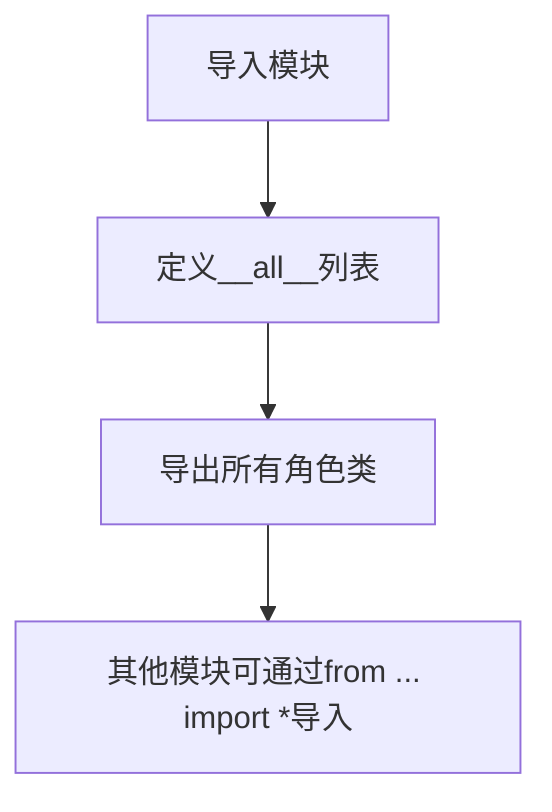

# `.\MetaGPT\metagpt\ext\werewolf\roles\__init__.py` 详细设计文档

该文件是一个包初始化文件，用于导出狼人杀游戏扩展模块中的核心角色类，包括基础玩家类和各种具体角色类（守卫、预言家、村民、狼人、女巫、主持人），为游戏系统提供统一的角色接口。

## 整体流程



## 类结构

```
BasePlayer (基础玩家类)
├── Guard (守卫)
├── Seer (预言家)
├── Villager (村民)
├── Werewolf (狼人)
├── Witch (女巫)
└── Moderator (主持人)
```

## 全局变量及字段


### `__all__`
    
定义模块的公共接口，控制使用 'from module import *' 时导出的符号列表，包含所有狼人杀游戏角色类和主持人类。

类型：`List[str]`
    


    

## 全局函数及方法


## 关键组件


### BasePlayer

狼人杀游戏中的基础玩家角色类，定义了所有具体角色（如村民、狼人等）共有的属性和行为。

### Guard

守卫角色，每晚可以保护一名玩家免受狼人袭击，但不能连续两晚保护同一名玩家。

### Seer

预言家角色，每晚可以查验一名玩家的身份，得知其是好人还是狼人。

### Villager

村民角色，没有特殊能力，白天通过讨论和投票找出狼人。

### Werewolf

狼人角色，每晚可以共同商议并杀害一名玩家，白天伪装成村民参与讨论。

### Witch

女巫角色，拥有一瓶解药和一瓶毒药，每晚可以使用其中一瓶（解药救活被狼人杀害的玩家，毒药毒死一名玩家），全程只能各使用一次。

### Moderator

主持人/法官角色，负责控制游戏流程，包括宣布昼夜交替、收集并执行玩家的行动（如狼人杀人、预言家查验等）、宣布游戏结果。


## 问题及建议


### 已知问题

-   **模块导入与`__all__`声明不一致**：代码中导入了`Moderator`类，但在`__all__`列表中，`Moderator`被错误地拼写为`Moderator`（首字母大写），这可能导致在使用`from module import *`语法时，`Moderator`类无法被正确导出，而`Moderator`类则可以。这是一个潜在的拼写错误或命名不一致问题。
-   **缺乏抽象工厂或角色注册机制**：当前代码通过显式导入所有角色类并手动维护`__all__`列表来暴露接口。随着角色类型的增加（例如，添加`Hunter`, `Idiot`等），需要不断修改此初始化文件。这种方式不够灵活，容易出错，且不符合开闭原则。
-   **潜在的循环导入风险**：虽然当前代码片段没有显示，但如果`base_player.py`、`guard.py`等模块之间存在复杂的相互引用（例如，`Moderator`引用了所有玩家角色，而某些角色又可能引用`Moderator`），在大型或复杂的包结构中，不谨慎的导入可能导致循环导入错误。
-   **缺少包级别的类型提示或文档**：该文件作为包的入口点，没有提供任何包级别的文档字符串（docstring）来说明这个包的功能、包含的主要组件或基本用法，不利于新开发者快速理解。

### 优化建议

-   **修正`__all__`列表中的拼写**：将`__all__`列表中的`Moderator`更正为`Moderator`，以确保导出一致性。即：`__all__ = ["BasePlayer", "Guard", "Moderator", "Seer", "Villager", "Witch", "Werewolf"]`。
-   **实现动态角色发现与注册机制**：建议引入一个角色注册表。可以定义一个装饰器或利用元类，让每个角色类在定义时自动向一个中央注册表注册。然后，在此`__init__.py`文件中，可以从注册表中动态获取所有角色类并构建`__all__`列表，甚至可以直接提供`get_role_class`这样的工厂函数。这样增加新角色时，只需创建新文件，无需修改此初始化文件。
-   **重构导入结构以明确依赖关系**：审查所有角色类之间的导入关系。确保依赖是单向的，例如，所有具体角色继承自`BasePlayer`，而`Moderator`可能引用`BasePlayer`作为类型提示，但应避免具体角色直接导入`Moderator`。如果存在循环依赖，考虑使用导入局部化（如将导入语句放在方法内部）或引入抽象接口来解耦。
-   **添加包文档字符串**：在文件顶部添加一个模块文档字符串，简要描述该包是“狼人杀游戏的角色定义模块”，并列出核心角色类型及其简要职责，提升代码的可读性和可维护性。
-   **考虑使用`typing`模块**：虽然当前代码片段简单，但在角色类的定义文件中，广泛使用类型提示（如`from typing import List, Optional`等）可以极大地提高代码的清晰度和IDE的支持能力，建议在包内的各个模块中实施。


## 其它


### 设计目标与约束

该代码模块的设计目标是提供一个狼人杀游戏角色的基础框架，包含游戏中的核心角色类（如狼人、村民、预言家、女巫、守卫、主持人）以及一个所有角色的基类。其核心约束包括：
1.  **模块化与可扩展性**：通过`BasePlayer`基类定义统一的角色接口和行为模板，确保所有具体角色类（如`Werewolf`, `Villager`等）遵循相同的设计模式，便于未来添加新的角色类型。
2.  **职责分离**：`Moderator`（主持人）角色与其他玩家角色分离，负责控制游戏流程、规则判定和状态管理，体现了单一职责原则。
3.  **命名空间管理**：通过`__all__`列表明确导出模块的公共接口，控制外部可见的类，避免内部实现细节的暴露，便于模块的使用和维护。

### 错误处理与异常设计

当前代码片段主要进行模块导入和导出，未包含显式的错误处理逻辑。错误处理应主要在设计的具体角色类（如`BasePlayer`及其子类）和`Moderator`类中实现。预期的异常设计可能包括：
1.  **游戏逻辑异常**：例如，当角色尝试执行不符合其身份或当前游戏阶段的操作时（如村民在夜晚尝试杀人），应抛出特定的异常（如`InvalidActionError`）。
2.  **状态异常**：当游戏状态不满足某个操作的前提条件时（如尝试在游戏未开始时投票），应抛出状态异常（如`GameStateError`）。
3.  **输入验证异常**：在处理玩家输入或指令时，对无效输入进行验证并抛出相应的`ValueError`或自定义异常。
4.  **导入与初始化异常**：确保依赖模块（如`metagpt.ext.werewolf.roles`下的子模块）存在，否则在导入阶段会引发`ImportError`。

### 数据流与状态机

该模块定义了游戏角色的静态结构，但角色间的交互和游戏动态流程构成了核心数据流与状态机：
1.  **数据流**：
    *   **指令流**：`Moderator`接收并解析游戏指令，分发给对应的`BasePlayer`子类实例（角色）。
    *   **信息流**：角色通过`Moderator`或直接（根据规则）接收游戏状态信息（如夜晚结果、投票结果），并可能向`Moderator`提交行动选择（如狼人选择击杀目标、预言家查验身份）。
    *   **状态流**：`Moderator`维护并更新全局游戏状态（如昼夜交替、玩家存活状态），状态变更触发新的信息广播和行动回合。
2.  **状态机**：游戏进程是一个典型的状态机，状态由`Moderator`管理。状态可能包括：“游戏准备”、“夜晚（狼人行动、女巫行动等）”、“白天（讨论、投票）”、“游戏结束（好人胜利/狼人胜利）”。每个状态决定了哪些角色可以行动、可以接收哪些信息以及后续可能的状态转移。

### 外部依赖与接口契约

1.  **外部依赖**：
    *   **Python 环境**：依赖特定版本的Python解释器。
    *   **父级/同级模块**：依赖`metagpt.ext.werewolf.roles`包下的具体实现模块（`base_player.py`, `guard.py`, `seer.py`等）。这些模块必须存在且可导入，定义了各个类的具体行为。
    *   **MetaGPT 框架**：作为`metagpt.ext`的一部分，可能隐式依赖MetaGPT框架提供的某些基础能力或约定（如角色基类的定义方式、环境交互接口等），但当前代码未直接体现。
2.  **接口契约**：
    *   **导出契约**：通过`__all__`列表，本模块(`__init__.py`)承诺对外提供`BasePlayer`, `Guard`, `Moderator`, `Seer`, `Villager`, `Witch`, `Werewolf`这七个类的访问。这是模块对使用者的主要接口承诺。
    *   **继承契约**：所有具体角色类（`Guard`, `Seer`, `Villager`, `Werewolf`, `Witch`）必须继承自`BasePlayer`，并实现或重写基类定义的接口方法（如行动方法、发言方法），以符合游戏引擎的调用期望。`Moderator`类可能遵循不同的接口契约，用于游戏控制。

    