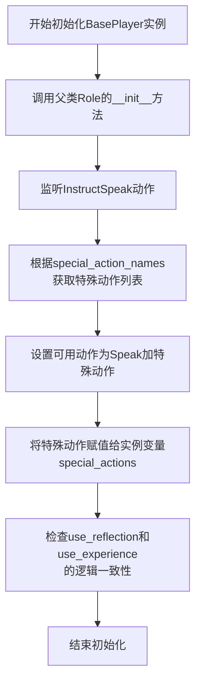
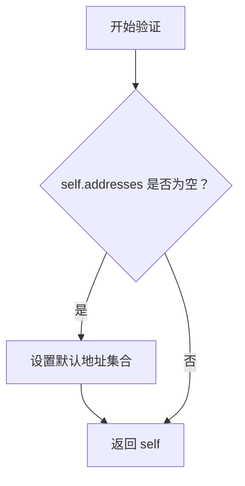
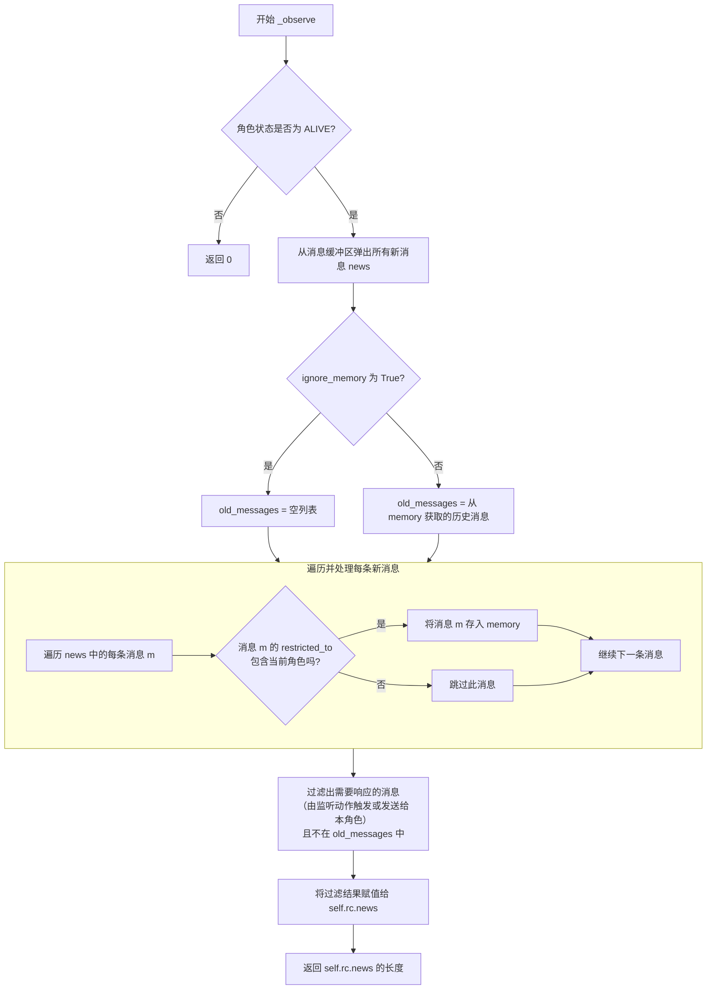
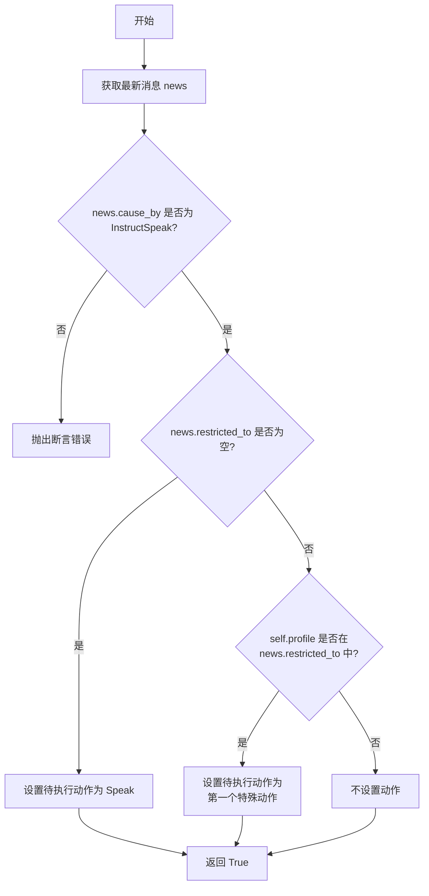
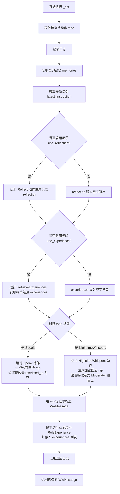
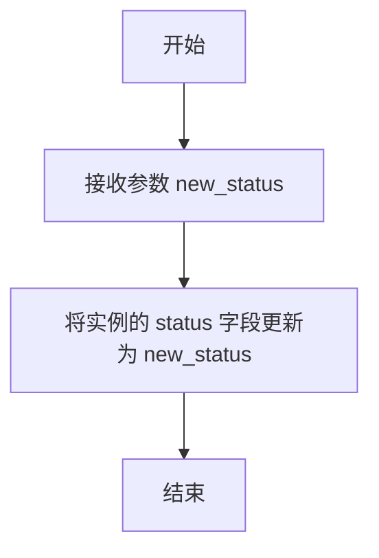

# `.\MetaGPT\metagpt\ext\werewolf\roles\base_player.py` 详细设计文档

该文件定义了一个狼人杀游戏中的基础玩家角色类 `BasePlayer`，它继承自 `Role` 基类，负责模拟玩家在游戏中的核心行为，包括监听游戏指令、根据指令思考并决定行动（如公开发言或执行特殊技能）、执行行动（调用相应的 `Action` 类），并在过程中可选地进行反思和利用经验库。该类是构建具体狼人杀角色（如预言家、狼人）的基类。

## 整体流程

```mermaid
graph TD
    A[BasePlayer 实例化] --> B[初始化: 设置监听、行动能力、特殊技能]
    C[游戏回合开始] --> D[Moderator 广播 InstructSpeak 指令]
    D --> E[BasePlayer._observe: 接收并过滤消息]
    E --> F{玩家是否存活?}
    F -- 否 --> G[结束，不参与]
    F -- 是 --> H[BasePlayer._think: 解析指令决定行动]
    H --> I{指令接收范围?}
    I -- 全体 --> J[行动设为 Speak (公开发言)]
    I -- 仅自己 --> K[行动设为 special_actions[0] (如 NighttimeWhispers)]
    J --> L[BasePlayer._act: 执行行动]
    K --> L
    L --> M[准备执行参数: 获取记忆、最新指令]
    M --> N{是否启用反思?}
    N -- 是 --> O[调用 Reflect Action 生成反思文本]
    N -- 否 --> P[反思文本为空]
    O --> Q{是否启用经验库?}
    P --> Q
    Q -- 是 --> R[调用 RetrieveExperiences Action 检索相关经验]
    Q -- 否 --> S[经验文本为空]
    R --> T[根据行动类型调用对应 Action.run]
    S --> T
    T --> U[生成 WwMessage 作为行动结果]
    U --> V[将本次经历记录到 experiences 列表]
    V --> W[返回 WwMessage 给环境]
    W --> X[回合结束]
```

## 类结构

```
Role (MetaGPT 角色基类)
└── BasePlayer (狼人杀玩家基类)
```

## 全局变量及字段


### `BasePlayer.name`
    
玩家的名称，默认为'PlayerXYZ'，用于标识游戏中的具体玩家实例。

类型：`str`
    


### `BasePlayer.profile`
    
玩家的角色身份描述，默认为'BasePlayer'，用于表示玩家在游戏中的角色（如狼人、预言家等）。

类型：`str`
    


### `BasePlayer.special_action_names`
    
特殊动作名称列表，用于定义该角色可以执行的特殊技能（如狼人杀人、预言家验人等）。

类型：`list[str]`
    


### `BasePlayer.use_reflection`
    
是否启用反思功能，用于在行动前对当前局势和记忆进行思考分析。

类型：`bool`
    


### `BasePlayer.use_experience`
    
是否启用经验检索功能，用于从历史经验中学习并指导当前决策。

类型：`bool`
    


### `BasePlayer.use_memory_selection`
    
是否启用记忆选择功能（当前代码中未使用，保留为未来扩展）。

类型：`bool`
    


### `BasePlayer.new_experience_version`
    
新经验版本标识符，用于标记当前游戏回合生成的经验记录版本。

类型：`str`
    


### `BasePlayer.status`
    
玩家的游戏状态（如存活、死亡等），用于控制玩家是否参与游戏进程。

类型：`RoleState`
    


### `BasePlayer.special_actions`
    
特殊动作对象列表，根据special_action_names动态加载的具体Action实例。

类型：`list[SerializeAsAny[Action]]`
    


### `BasePlayer.experiences`
    
角色经验记录列表，存储玩家在游戏中的反思、指令和响应等经验数据。

类型：`list[RoleExperience]`
    
    

## 全局函数及方法

### `BasePlayer.__init__`

该方法用于初始化`BasePlayer`类的实例，继承自`Role`类，并设置狼人杀游戏中玩家的基本属性、监听行为、可用动作以及特殊技能。

参数：

- `kwargs`：`dict`，关键字参数，用于传递给父类`Role`的初始化方法

返回值：`None`，无返回值

#### 流程图



#### 带注释源码

```python
def __init__(self, **kwargs):
    # 调用父类Role的初始化方法，传入所有关键字参数
    super().__init__(**kwargs)
    
    # 技能和监听配置
    # 监听Moderator的指令以做行动
    self._watch([InstructSpeak])
    
    # 根据实例的special_action_names列表，从全局ACTIONS映射中获取对应的特殊动作类
    special_actions = [ACTIONS[action_name] for action_name in self.special_action_names]
    
    # 设置该角色的可用动作：基础发言动作Speak加上所有特殊动作
    capable_actions = [Speak] + special_actions
    self.set_actions(capable_actions)  # 给角色赋予行动技能
    
    # 将特殊动作列表保存到实例变量中
    self.special_actions = special_actions

    # 逻辑检查：如果未启用反思（use_reflection）但启用了经验（use_experience），则发出警告并禁用经验功能
    if not self.use_reflection and self.use_experience:
        logger.warning("You must enable use_reflection before using experience")
        self.use_experience = False
```

### `BasePlayer.check_addresses`

该方法是一个模型验证器，用于在`BasePlayer`类实例初始化后，自动检查和设置其`addresses`属性。如果`addresses`为空，则根据实例的`name`和`profile`属性为其设置一个默认的地址集合。

参数：
- 无显式参数。作为`@model_validator(mode="after")`装饰的方法，它接收并处理整个模型实例（`self`）。

返回值：`BasePlayer`，返回经过验证和可能修改后的模型实例自身。

#### 流程图



#### 带注释源码

```python
@model_validator(mode="after")  # 这是一个Pydantic模型验证器，在模型实例化后（所有字段赋值后）运行。
def check_addresses(self):
    # 检查实例的`addresses`字段是否为空列表或None。
    if not self.addresses:
        # 如果`addresses`为空，则根据条件构建一个默认的地址集合。
        # `any_to_str(self)` 生成一个代表实例本身的唯一字符串标识。
        # 如果`self.name`存在（非空），则将`self.name`和`self.profile`也加入集合。
        # 否则，只包含`any_to_str(self)`。
        self.addresses = {any_to_str(self), self.name, self.profile} if self.name else {any_to_str(self)}
    # 验证器必须返回模型实例（或包含模型实例的字典）。
    return self
```

### `BasePlayer._observe`

`BasePlayer._observe` 方法是狼人杀游戏角色基类中用于处理消息观察的核心逻辑。它负责从消息缓冲区中获取新消息，根据消息的接收范围（`restricted_to`）过滤出当前角色有权接收的消息，并将其存入角色的记忆（`memory`）中。同时，它会更新角色的新闻列表（`news`），该列表包含了当前角色需要响应（`_react`）的消息，即那些由角色监听（`watch`）的动作触发或明确发送给该角色的消息。该方法确保了角色只能看到和响应与其相关的游戏信息。

参数：

- `self`：`BasePlayer`，`BasePlayer` 类的实例，代表当前游戏角色。
- `ignore_memory`：`bool`，指示是否忽略现有记忆进行消息处理。如果为 `True`，则不会从现有记忆中排除已处理过的消息。默认值为 `False`。

返回值：`int`，返回一个整数，表示经过过滤后，当前角色需要响应的新消息（`self.rc.news`）的数量。

#### 流程图



#### 带注释源码

```python
async def _observe(self, ignore_memory=False) -> int:
    # 检查角色状态，如果角色已死亡（非 ALIVE 状态），则不参与游戏，直接返回 0
    if self.status != RoleState.ALIVE:
        # 死者不再参与游戏
        return 0

    # 初始化新闻列表，从角色的消息缓冲区中获取所有待处理的新消息
    news = []
    if not news:
        news = self.rc.msg_buffer.pop_all()

    # 根据 ignore_memory 参数决定是否获取旧消息用于去重
    old_messages = [] if ignore_memory else self.rc.memory.get()

    # 遍历所有新消息，根据接收范围决定是否存入角色记忆
    for m in news:
        # 如果消息有特定的接收者限制，且当前角色（profile 或 name）不在接收列表中，
        # 则跳过此消息，不存入记忆。空列表表示发送给全体。
        if len(m.restricted_to) and self.profile not in m.restricted_to and self.name not in m.restricted_to:
            # if the msg is not send to the whole audience ("") nor this role (self.profile or self.name),
            # then this role should not be able to receive it and record it into its memory
            continue
        # 符合条件的消息存入角色记忆
        self.rc.memory.add(m)

    # 更新角色的新闻列表（rc.news）：
    # 1. 消息的触发动作（cause_by）在角色的监听列表（rc.watch）中，或者
    # 2. 消息明确发送给当前角色（self.profile 在 send_to 中）
    # 并且该消息不在旧消息列表（old_messages）中，以避免重复处理。
    self.rc.news = [
        n for n in news if (n.cause_by in self.rc.watch or self.profile in n.send_to) and n not in old_messages
    ]

    # 返回需要响应的新消息数量
    return len(self.rc.news)
```

### `BasePlayer._think`

该方法用于根据接收到的消息决定玩家下一步要执行的动作。它检查消息的来源和接收范围，以确定是进行公开发言还是执行特殊动作。

参数：

- 无显式参数，但方法内部使用 `self` 访问实例属性。

返回值：`bool`，总是返回 `True`，表示思考过程已完成并成功设置了待执行动作。

#### 流程图



#### 带注释源码

```python
async def _think(self):
    # 从角色的新闻缓冲区中获取最新的消息
    news = self.rc.news[0]
    # 断言：确保该消息是由 InstructSpeak 动作触发的，即来自 Moderator 的指令
    assert news.cause_by == any_to_str(InstructSpeak)  # 消息为来自Moderator的指令时，才去做动作
    
    if not news.restricted_to:
        # 情况1：如果消息的接收范围（restricted_to）为空，表示这是发给全体角色的公开消息。
        # 玩家需要做出公开发言（例如，投票或讨论）。
        self.rc.todo = Speak()
    elif self.profile in news.restricted_to:
        # 情况2：如果消息的接收范围中包含当前玩家的角色（profile），
        # 表示这是 Moderator 加密发送给该玩家的私密指令，要求执行其特殊动作（如狼人杀人、预言家验人等）。
        # FIXME: hard code to split, restricted为"Moderator"或"Moderator, 角色profile"
        self.rc.todo = self.special_actions[0]()
    # 如果消息的接收范围不为空且不包含当前玩家，则玩家不应做出任何反应（此逻辑隐含在代码中，未显式写出）。
    # 方法始终返回 True，表示思考步骤已完成。
    return True
```

### `BasePlayer._act`

`BasePlayer._act` 方法是狼人杀游戏中玩家角色的核心行动方法。它根据 `_think` 阶段确定的待执行动作（`todo`），结合角色的记忆、反思和经验，执行相应的行动（如公开发言或使用夜间技能），并生成一条游戏消息。同时，该方法会记录本次行动的经验，用于后续的学习和优化。

参数：
- `self`：`BasePlayer`，当前玩家角色的实例。

返回值：`WwMessage`，返回一个封装了行动结果（如发言内容或技能使用结果）的游戏消息对象，该消息包含了发送者、接收者、触发动作等信息。

#### 流程图



#### 带注释源码

```python
async def _act(self):
    # todo为_think时确定的，有两种情况，Speak或Protect
    todo = self.rc.todo
    logger.info(f"{self._setting}: ready to {str(todo)}")

    # 可以用这个函数获取该角色的全部记忆和最新的instruction
    memories = self.get_all_memories()
    latest_instruction = self.get_latest_instruction()

    # 如果启用了反思功能，则运行Reflect动作来生成基于当前记忆和指令的反思文本
    reflection = (
        await Reflect().run(
            profile=self.profile, name=self.name, context=memories, latest_instruction=latest_instruction
        )
        if self.use_reflection
        else ""
    )

    # 如果启用了经验功能，则根据反思文本检索相关的历史经验
    experiences = (
        RetrieveExperiences().run(
            query=reflection, profile=self.profile, excluded_version=self.new_experience_version
        )
        if self.use_experience
        else ""
    )

    # 根据自己定义的角色Action，对应地去run，run的入参可能不同
    if isinstance(todo, Speak):
        # 执行公开发言动作，生成回应内容rsp，并设置消息接收者为全体（空集）
        rsp = await todo.run(
            profile=self.profile,
            name=self.name,
            context=memories,
            latest_instruction=latest_instruction,
            reflection=reflection,
            experiences=experiences,
        )
        restricted_to = set()

    elif isinstance(todo, NighttimeWhispers):
        # 执行夜间私语（特殊技能）动作，生成加密回应rsp，并设置消息仅对Moderator和自己可见
        rsp = await todo.run(
            profile=self.profile, name=self.name, context=memories, reflection=reflection, experiences=experiences
        )
        restricted_to = {RoleType.MODERATOR.value, self.profile}  # 给Moderator发送使用特殊技能的加密消息

    # 使用行动结果、角色信息等构造一个完整的游戏消息对象
    msg = WwMessage(
        content=rsp,
        role=self.profile,
        sent_from=self.name,
        cause_by=type(todo),
        send_to={},
        restricted_to=restricted_to,
    )

    # 将本次行动（包括反思、指令、回应等）记录为一个经验对象，并添加到经验列表中
    self.experiences.append(
        RoleExperience(
            name=self.name,
            profile=self.profile,
            reflection=reflection,
            instruction=latest_instruction,
            response=rsp,
            version=self.new_experience_version,
        )
    )

    logger.info(f"{self._setting}: {rsp}")

    # 返回构造的消息，该消息将被放入环境或发送给其他角色
    return msg
```

### `BasePlayer.get_all_memories`

该方法用于获取并格式化当前角色（`BasePlayer` 实例）的所有记忆。它从角色的记忆存储中检索所有消息，移除每条消息内容中的时间戳，并将消息格式化为一个字符串，其中每条消息以“发送者: 内容”的形式呈现。

参数：
- 无

返回值：`str`，一个字符串，包含所有格式化后的记忆，每条记忆占一行。

#### 流程图

```mermaid
flowchart TD
    A[开始] --> B[从 self.rc.memory.get() 获取所有记忆]
    B --> C[遍历每条记忆]
    C --> D[使用正则表达式移除内容中的时间戳]
    D --> E[格式化记忆为“发送者: 内容”]
    E --> F{是否还有记忆？}
    F -- 是 --> C
    F -- 否 --> G[将所有格式化记忆用换行符连接]
    G --> H[返回格式化后的字符串]
    H --> I[结束]
```

#### 带注释源码

```python
def get_all_memories(self) -> str:
    # 从角色的记忆组件中获取所有存储的消息对象列表
    memories = self.rc.memory.get()
    # 定义用于匹配时间戳的正则表达式模式，例如 "123 | "
    time_stamp_pattern = r"[0-9]+ \| "
    # 遍历每条消息，移除内容中的时间戳，并格式化为“发送者: 内容”的字符串
    # 注意：这里使用 m.sent_from（玩家名）而非 m.role（玩家角色），因为其他角色不知道说话者的真实身份
    memories = [f"{m.sent_from}: {re.sub(time_stamp_pattern, '', m.content)}" for m in memories]
    # 将所有格式化后的字符串用换行符连接成一个完整的字符串
    memories = "\n".join(memories)
    # 返回格式化后的记忆字符串
    return memories
```

### `BasePlayer.get_latest_instruction`

该方法用于获取角色最新接收到的指令内容。它从角色的重要记忆（`important_memory`）中提取最近一条指令的内容，该指令通常由游戏主持人（Moderator）通过`InstructSpeak`动作发出。

参数：无

返回值：`str`，返回最新指令的文本内容。

#### 流程图

```mermaid
flowchart TD
    A[开始] --> B[访问 self.rc.important_memory[-1]]
    B --> C[获取其 content 属性]
    C --> D[返回指令内容字符串]
    D --> E[结束]
```

#### 带注释源码

```python
def get_latest_instruction(self) -> str:
    # 从角色的重要记忆列表中获取最后一条记录
    # self.rc.important_memory[-1] 指向最新的一条重要记忆
    # 该记忆的内容（content）即为最新的指令
    return self.rc.important_memory[-1].content
```

### `BasePlayer.set_status`

该方法用于设置玩家的状态，例如将状态从“存活”更改为“死亡”。

参数：

- `new_status`：`RoleState`，新的角色状态值，例如 `RoleState.ALIVE` 或 `RoleState.DEAD`。

返回值：`None`，此方法不返回任何值。

#### 流程图



#### 带注释源码

```python
def set_status(self, new_status: RoleState):
    # 将当前实例的 `status` 字段更新为传入的 `new_status` 参数。
    # 这通常用于在游戏过程中改变玩家的状态，例如在狼人杀游戏中，当玩家被淘汰时，将其状态从 `ALIVE` 改为 `DEAD`。
    self.status = new_status
```

### `BasePlayer.record_experiences`

该方法用于处理并记录玩家在当前游戏回合中的经验。它会筛选出包含有效反思（非空字符串）的经验条目，为这些条目附加回合ID、游戏结果和游戏设置信息，然后通过`AddNewExperiences`动作将这些处理后的经验持久化存储。

参数：

- `round_id`：`str`，当前游戏回合的唯一标识符。
- `outcome`：`str`，当前游戏回合的结果（例如，好人阵营胜利、狼人阵营胜利）。
- `game_setup`：`str`，当前游戏的配置信息（例如，玩家角色分布）。

返回值：`None`，此方法不返回任何值。

#### 流程图

```mermaid
flowchart TD
    A[开始] --> B[筛选经验列表<br>过滤掉反思内容长度小于等于2的经验]
    B --> C{遍历筛选后的<br>每一条经验}
    C --> D[为当前经验条目设置<br>round_id, outcome, game_setup]
    D --> C
    C --> E[遍历结束]
    E --> F[调用AddNewExperiences().run<br>持久化处理后的经验列表]
    F --> G[结束]
```

#### 带注释源码

```python
def record_experiences(self, round_id: str, outcome: str, game_setup: str):
    # 1. 筛选经验：从self.experiences列表中，只保留那些反思内容长度大于2的经验条目。
    #    长度判断用于过滤掉反思内容为空字符串（""）或仅包含两个引号（'""'）的无效经验。
    experiences = [exp for exp in self.experiences if len(exp.reflection) > 2]  # not "" or not '""'

    # 2. 信息附加：遍历筛选后的经验列表，为每一条经验设置本回合的元数据。
    for exp in experiences:
        exp.round_id = round_id  # 设置回合ID
        exp.outcome = outcome    # 设置游戏结果
        exp.game_setup = game_setup # 设置游戏配置

    # 3. 持久化存储：调用AddNewExperiences动作的run方法，将处理后的经验列表提交给系统进行存储。
    #    这通常涉及将经验写入数据库或外部知识库。
    AddNewExperiences().run(experiences)
```

## 关键组件


### 角色状态管理

通过 `status` 字段和 `set_status` 方法管理角色在游戏中的生存状态（如 `ALIVE`），并控制其是否参与游戏流程（如在 `_observe` 方法中，死者不再处理消息）。

### 特殊动作与监听机制

通过 `special_action_names` 和 `special_actions` 字段定义并初始化角色的特殊技能（如 `NighttimeWhispers`），并通过 `_watch` 和 `set_actions` 方法配置角色监听的事件（如 `InstructSpeak`）和可执行的动作列表。

### 记忆与经验系统

通过 `rc.memory` 和 `experiences` 字段分别存储角色的对话记忆和游戏经验。`get_all_memories` 方法用于格式化记忆，而 `record_experiences` 方法则将本轮经验与游戏结果关联后持久化存储。

### 反思与经验检索

通过 `use_reflection` 和 `use_experience` 标志控制是否启用反思和经验检索功能。在 `_act` 方法中，`Reflect` 动作基于记忆生成反思，`RetrieveExperiences` 动作则根据反思查询历史经验，以辅助决策。

### 消息处理与路由

在 `_observe` 方法中，根据消息的 `restricted_to` 字段过滤接收范围，确保角色只能收到发送给全体或自己的消息。在 `_act` 方法中，根据动作类型（如 `Speak` 或 `NighttimeWhispers`）设置消息的接收者，实现公开发言或私密通信。


## 问题及建议


### 已知问题

-   **硬编码的 `special_actions` 索引**：在 `_think` 方法中，当消息接收者为特定角色时，代码直接使用 `self.special_actions[0]()` 来获取待执行动作。这假设了 `special_actions` 列表至少有一个元素，并且角色只有一个特殊动作。如果 `special_action_names` 配置了多个动作或为空，此逻辑将导致 `IndexError` 或执行错误的动作。
-   **脆弱的 `restricted_to` 解析逻辑**：`_think` 方法中的注释提到 `restricted_to` 字段的格式为 `"Moderator"` 或 `"Moderator, 角色profile"`，但代码中仅通过 `self.profile in news.restricted_to` 进行成员检查。如果 `restricted_to` 是一个集合（如 `_act` 方法中创建消息时所设），此检查有效；但如果它是一个用逗号分隔的字符串（如注释所述），此检查将失败，导致逻辑错误。代码中存在不一致的假设。
-   **未使用的 `use_memory_selection` 字段**：类中定义了 `use_memory_selection: bool = False` 字段，但在代码的任何地方都未使用该字段，这可能是未完成的功能或残留的代码，增加了维护成本。
-   **`_observe` 方法中的死代码和潜在逻辑错误**：
    1.  方法开头有 `if not news:` 的判断，但此时 `news` 刚被初始化为空列表 `[]`，因此 `news = self.rc.msg_buffer.pop_all()` 这行代码永远会执行，开头的条件判断是多余的。
    2.  方法中有一段被注释掉的 `TODO to delete` 代码块，调用了 `super()._observe()` 并进行了额外的消息过滤。这段注释代码的存在造成了混淆，不清楚是否应该被删除或替代当前逻辑。
    3.  消息过滤逻辑 `self.rc.news = [n for n in news if (n.cause_by in self.rc.watch or self.profile in n.send_to) and n not in old_messages]` 可能过于宽松。`self.profile in n.send_to` 检查允许发送给任何包含该角色 `profile` 的集合的消息通过，这可能与 `restricted_to` 的意图冲突。
-   **经验记录的条件可能过于宽松**：在 `record_experiences` 方法中，筛选经验的条件是 `len(exp.reflection) > 2`，旨在过滤掉空字符串或仅包含两个引号的字符串。然而，一个长度为3但无意义的字符串（如 `"a"`）也会被保留，而一个长度为2的有效反射（如 `"no"`）则会被过滤。这个启发式规则可能不可靠。
-   **`check_addresses` 验证器的潜在问题**：`@model_validator(mode="after")` 装饰的 `check_addresses` 方法在初始化后运行。如果 `addresses` 在父类 `Role` 的初始化逻辑中被设置，此方法可能会覆盖它。此外，它依赖于 `any_to_str(self)`，如果 `self` 尚未完全初始化，可能会产生意外结果。

### 优化建议

-   **增强 `special_actions` 的调度逻辑**：重构 `_think` 方法，使其能够根据消息内容或类型从 `special_actions` 列表中智能选择或匹配正确的动作，而不是硬编码索引 `[0]`。可以考虑在消息中携带动作标识符。
-   **统一并明确 `restricted_to` 的数据契约**：明确 `restricted_to` 字段应该是 `Set[str]` 类型（如 `WwMessage` 的创建所示），并在整个代码库中坚持使用。移除关于逗号分隔字符串的注释，更新所有相关逻辑（包括 Moderator 的发送逻辑）以使用集合操作。如果必须支持字符串格式，应添加明确的解析和转换逻辑。
-   **清理未使用的字段和代码**：移除未使用的 `use_memory_selection` 字段。审查并决定是删除 `_observe` 方法中注释掉的 `TODO` 代码块，还是用它替换当前逻辑，以消除混淆。
-   **重构 `_observe` 方法**：
    1.  移除冗余的 `if not news:` 判断和 `news = []` 的初始化，直接使用 `news = self.rc.msg_buffer.pop_all()`。
    2.  重新评估消息过滤逻辑。考虑将过滤条件与 `restricted_to` 字段的检查更紧密地结合，确保只有明确发送给该角色（或全体）的消息才会被加入 `self.rc.news` 并触发反应。当前逻辑可能允许角色对非定向消息做出反应。
-   **改进经验筛选逻辑**：将 `record_experiences` 中的筛选条件从 `len(exp.reflection) > 2` 改为更语义化的检查，例如 `if exp.reflection and exp.reflection.strip():` 或 `if exp.reflection not in ('', '""'):`，以更准确地识别有意义的反思内容。
-   **考虑将经验处理逻辑抽象化**：`_act` 方法中关于反思 (`Reflect`) 和经验检索 (`RetrieveExperiences`) 的逻辑较长，且与主要动作执行逻辑交织。考虑将这些步骤提取到单独的辅助方法中，如 `_prepare_context`，以提高可读性和可测试性。
-   **添加更健壮的验证和错误处理**：在 `_think` 方法中，当 `news.cause_by` 不是预期的 `InstructSpeak` 时，当前使用 `assert`。在生产环境中，建议使用更明确的错误处理，如抛出带有描述性信息的异常。同时，在访问 `self.special_actions[0]` 之前，检查列表是否为空。
-   **优化 `get_all_memories` 方法**：当前方法使用正则表达式 `r"[0-9]+ \| "` 移除时间戳。确保这个模式与所有可能的时间戳格式匹配。考虑将时间戳格式定义为一个常量，或者如果时间戳是消息的独立属性，则直接访问该属性以避免字符串解析。


## 其它


### 设计目标与约束

本模块旨在为“狼人杀”游戏提供一个可扩展的玩家角色基类。其核心设计目标包括：
1.  **角色行为抽象**：将玩家的通用行为（如观察、思考、行动）抽象为可复用的方法，为不同身份（如狼人、预言家）的角色提供基础。
2.  **技能与监听机制**：通过`special_actions`和`_watch`方法，支持为不同角色动态配置专属技能（如狼人杀人、预言家验人）和需要监听的事件。
3.  **记忆与经验系统**：集成记忆管理，并可选地支持基于反思（Reflection）和经验检索（RetrieveExperiences）的增强决策，以提高角色行为的智能性和上下文相关性。
4.  **状态管理**：通过`status`字段管理角色的生存状态（如`ALIVE`, `DEAD`），确保死亡角色不再参与游戏进程。
5.  **消息路由与隐私**：通过消息（`WwMessage`）中的`restricted_to`字段实现定向通信，支持公开发言与私密行动（如夜间行动仅对主持人可见）。

主要约束包括对`pydantic`数据验证库的依赖、与`metagpt`框架中`Role`和`Action`组件的强耦合，以及当前经验系统（`use_experience`）必须依赖于反思系统（`use_reflection`）开启的强制逻辑。

### 错误处理与异常设计

当前代码中的错误处理相对简单，主要依赖断言和条件警告：
1.  **输入验证**：在`__init__`中，若`use_experience`为`True`但`use_reflection`为`False`，会记录警告日志并强制将`use_experience`设为`False`。这是一种防御性编程，但未抛出异常，可能导致调用方困惑。
2.  **状态断言**：在`_think`方法中，使用`assert`语句验证消息的`cause_by`必须为`InstructSpeak`。这在调试时有效，但在生产环境中若断言失败会导致程序崩溃，应改为更健壮的异常处理（如`ValueError`）。
3.  **潜在异常点**：
    *   `get_latest_instruction`方法直接访问`self.rc.important_memory[-1]`，如果`important_memory`列表为空，将引发`IndexError`。
    *   `_act`方法中，当`todo`为特殊动作时，直接取`self.special_actions[0]()`，如果`special_actions`列表为空，将引发`IndexError`。
    *   整体缺乏对网络I/O（如`Action.run`调用）、外部服务（经验存储）故障的异常捕获和处理逻辑。

建议的优化包括：将关键断言替换为具体的异常抛出；在可能失败的操作周围添加`try-except`块，并定义清晰的异常类型；为异步方法考虑更完善的错误传播机制。

### 数据流与状态机

1.  **核心数据流**：
    *   **输入**：角色通过`_observe`方法从环境（`rc.msg_buffer`）接收消息（`WwMessage`）。消息根据`restricted_to`字段进行过滤，只有发送给全体（`""`）或本角色（`self.profile`/`self.name`）的消息才会被存入记忆并标记为待处理的新闻（`self.rc.news`）。
    *   **处理**：在`_think`中，角色分析`news`，根据消息的`cause_by`和`restricted_to`决定下一步行动（`self.rc.todo`），是公开发言（`Speak`）还是执行特殊动作（如`NighttimeWhispers`）。
    *   **增强决策**：在`_act`前，可选地执行`Reflect`（反思）和`RetrieveExperiences`（经验检索），利用历史记忆和上下文生成更明智的回应。
    *   **输出**：在`_act`中，执行`todo`行动，生成回应内容（`rsp`），并封装成新的`WwMessage`发送出去。同时，将本次交互的反思、指令和回应记录为`RoleExperience`对象，并可选地持久化。

2.  **角色状态机**：
    *   状态由`status`字段（`RoleState`枚举）表示，初始为`ALIVE`。
    *   在`_observe`入口处检查状态，若不为`ALIVE`则直接返回0，不再处理任何消息，实现了“死亡”状态的隔离。
    *   状态转换由外部调用`set_status`方法触发（例如，被投票出局或被狼人杀死后由游戏主持人调用）。状态转换逻辑本身未在`BasePlayer`内定义，属于外部控制。

### 外部依赖与接口契约

1.  **框架依赖**：
    *   **父类**：继承自`metagpt.roles.Role`，必须遵循其生命周期（`_observe`, `_think`, `_act`）和内部组件（如`self.rc`中的`memory`, `msg_buffer`, `watch`）的约定。
    *   **动作系统**：依赖`metagpt.actions.action.Action`及其子类（如`Speak`, `NighttimeWhispers`, `Reflect`等）。`BasePlayer`通过`set_actions`注册可用动作，并通过`run`方法调用它们，必须满足各个`Action`子类定义的`run`方法参数契约。

2.  **数据模型依赖**：
    *   **消息格式**：使用`metagpt.ext.werewolf.schema.WwMessage`作为通信载体，依赖其字段（`content`, `role`, `sent_from`, `cause_by`, `send_to`, `restricted_to`）。
    *   **经验模型**：使用`metagpt.ext.werewolf.schema.RoleExperience`来结构化和存储单次交互的经验。

3.  **服务/组件依赖**：
    *   **经验库**：当`use_experience`为`True`时，依赖`RetrieveExperiences`和`AddNewExperiences`动作背后的存储与检索服务（具体实现未在代码中展示）。这引入了外部数据源的依赖。
    *   **配置常量**：依赖`metagpt.environment.werewolf.const`中定义的`RoleState`和`RoleType`枚举。

4.  **隐式契约**：
    *   **消息路由语义**：对`WwMessage`中`restricted_to`字段的解析有特定逻辑（如空集表示全体，包含`Moderator`和自身表示私密行动），这构成了与消息发送方（如主持人）的隐式协议。
    *   **指令记忆**：假设`self.rc.important_memory`的最后一条总是最新的主持人指令，这构成了与游戏流程控制者的隐式契约。

### 配置与初始化参数

`BasePlayer`的配置主要通过其类字段（也是Pydantic模型字段）在初始化时传入：
*   **身份标识**：`name`（玩家名），`profile`（角色身份，如“Werewolf”）。
*   **能力开关**：`use_reflection`（是否启用反思），`use_experience`（是否启用经验系统，依赖反思），`use_memory_selection`（未在代码中使用，预留）。
*   **技能配置**：`special_action_names`（字符串列表），用于从全局`ACTIONS`映射中查找并初始化角色的特殊动作。
*   **状态与版本**：`status`（初始状态），`new_experience_version`（为本次生成的经验记录标记版本）。
*   **内部初始化**：在`__init__`中，基类初始化后，会配置监听列表（监听`InstructSpeak`），根据`special_action_names`设置可执行动作，并初始化`special_actions`列表。`model_validator`确保`addresses`字段有默认值。

这种设计允许通过参数灵活创建不同行为和能力的玩家实例，但要求调用方清楚各参数间的依赖关系（如经验依赖反思）。

### 测试策略建议

鉴于模块的复杂性和多态性，建议采用分层测试策略：
1.  **单元测试**：
    *   **工具方法**：测试`get_all_memories`（字符串处理和正则匹配）、`get_latest_instruction`（边界情况）、`set_status`。
    *   **核心流程方法**：模拟`rc`内部组件，测试`_observe`的消息过滤逻辑、`_think`的决策逻辑、`_act`中不同`todo`类型的分支。
    *   **初始化与验证**：测试`__init__`中配置逻辑和`model_validator`。
2.  **集成测试**：
    *   **与Action集成**：模拟或使用真实的`Action`子类（如`Speak`, `Reflect`），测试`_act`方法中`run`调用的参数传递和结果处理。
    *   **经验系统流程**：当`use_reflection`和`use_experience`开启时，测试从反思到经验检索再到动作执行的完整数据流。
3.  **场景测试（模拟游戏）**：
    *   创建多个`BasePlayer`子类实例，模拟游戏回合，验证消息的正确收发、状态转换、以及经验记录功能。
    *   测试死亡角色（`status != ALIVE`）是否确实被隔离。
4.  **异常与边界测试**：
    *   测试`special_actions`为空时执行特殊动作的异常。
    *   测试`important_memory`为空时调用`get_latest_instruction`的异常。
    *   测试`use_experience=True`但`use_reflection=False`时的警告行为。
    *   测试发送给非本角色`restricted_to`消息的正确过滤。
5.  **异步测试**：由于主要方法都是异步的，测试框架需要支持`asyncio`。


    