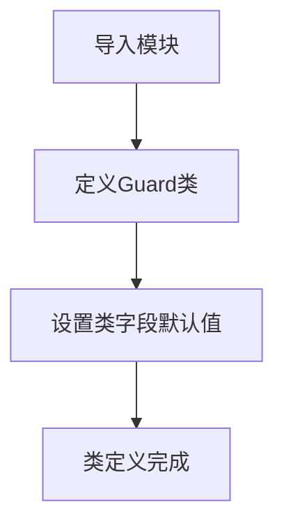

# `.\MetaGPT\metagpt\ext\werewolf\roles\guard.py` 详细设计文档

该代码定义了一个狼人杀游戏中的守卫角色类（Guard），它继承自基础玩家类（BasePlayer），并设置了守卫特有的角色名称、描述和特殊行动能力（保护）。

## 整体流程



## 类结构

```
BasePlayer (基础玩家类)
└── Guard (守卫角色类)
```

## 全局变量及字段


### `RoleType`
    
一个枚举类，定义了狼人杀游戏中所有可能的角色类型，例如狼人、预言家、守卫等。

类型：`Enum`
    


### `Guard.name`
    
守卫角色的名称，其值固定为从RoleType.GUARD枚举中获取的字符串。

类型：`str`
    


### `Guard.profile`
    
守卫角色的简介或描述，其值固定为从RoleType.GUARD枚举中获取的字符串。

类型：`str`
    


### `Guard.special_action_names`
    
守卫角色特有的行动名称列表，当前仅包含‘保护’行动。

类型：`list[str]`
    
    

## 全局函数及方法


## 关键组件


### Guard类

Guard类是狼人杀游戏中的一个具体角色类，继承自BasePlayer，代表守卫角色，其核心职责是在夜间行动阶段保护一名玩家免受狼人袭击。

### 角色类型常量

RoleType.GUARD是一个枚举常量，用于在系统中唯一标识“守卫”这一角色类型，确保角色名称和配置的一致性。

### 特殊行动名称

`special_action_names` 是一个类字段，定义了该角色特有的行动名称列表。对于Guard角色，其特殊行动为“Protect”（保护），这决定了角色在游戏中的可用技能。


## 问题及建议


### 已知问题

-   **类定义过于简单，缺乏核心逻辑**：`Guard` 类目前仅继承了 `BasePlayer` 并设置了几个基本属性，没有实现其核心的“保护”动作 (`Protect`) 的具体逻辑。这导致该类无法履行其游戏职责，是一个不完整的实现。
-   **硬编码的字符串依赖**：类属性 `name` 和 `profile` 直接使用了 `RoleType.GUARD.value`。虽然这确保了与常量定义的一致性，但如果常量值发生变化，需要同步修改所有引用处。更健壮的做法是通过属性或方法来获取，或在基类中统一处理。
-   **缺乏类型注解的完整性**：`special_action_names` 被定义为 `list[str]`，但未提供默认值（虽然代码中已赋值）。更清晰的写法是使用 `typing` 模块的 `List` 并在 `__init__` 或类变量中明确初始化，但当前写法在 Python 3.9+ 下可运行。主要问题在于，这个列表的内容（`"Protect"`）是硬编码的，与可能存在的动作配置或国际化支持脱节。

### 优化建议

-   **实现核心游戏逻辑**：应在 `Guard` 类中实现 `protect` 方法（或通过重写基类的某个行动方法），该方法包含选择保护目标、执行保护、与游戏环境交互等完整逻辑。这是使该类具有功能性的首要任务。
-   **将配置与逻辑解耦**：考虑将 `special_action_names` 这类配置信息移至配置文件、常量类或通过基类的构造函数注入。这样便于统一管理所有角色的特殊动作，也支持动态修改或扩展。
-   **增强代码可测试性**：为 `Guard` 类的核心方法（如未来的 `protect` 方法）编写单元测试。目前由于缺乏逻辑，无法进行有意义的测试。建立测试框架将有助于后续开发。
-   **考虑继承结构的优化**：检查 `BasePlayer` 基类是否提供了足够的抽象和钩子方法（例如 `take_action`）供子类重写。确保 `Guard` 的行为能通过重写基类方法自然融入游戏流程，而不是另起一套机制。如果 `BasePlayer` 设计不足，可能需要重构基类。
-   **添加文档字符串**：为 `Guard` 类添加详细的文档字符串，说明其角色职责、特殊能力（保护）以及如何与其他角色或环境交互。这将提高代码的可读性和可维护性。


## 其它


### 设计目标与约束

该代码的设计目标是实现《狼人杀》游戏中守卫角色的核心逻辑。守卫是一个特殊角色，其核心能力是在夜间保护一名玩家免受狼人袭击。设计约束包括：必须继承自 `BasePlayer` 基类以复用玩家角色的通用属性和行为；必须使用预定义的 `RoleType` 枚举来确保角色类型的一致性；其特殊行动名称必须与游戏规则中定义的守卫行动（“Protect”）相匹配。

### 错误处理与异常设计

当前代码未显式定义错误处理逻辑。错误处理主要依赖于基类 `BasePlayer` 和更上层的游戏环境框架。潜在的异常场景包括：当尝试执行 `special_action_names` 中定义但未在守卫类中实现的具体行动方法时，可能会引发 `AttributeError` 或类似的运行时错误。建议在后续实现具体行动方法（如 `protect`）时，加入参数验证（例如，检查目标玩家是否有效、是否可被保护）并抛出清晰的异常（如 `ValueError`）。

### 数据流与状态机

作为游戏中的一个角色实体，`Guard` 实例的数据流和状态变迁由外部游戏引擎驱动。其典型生命周期和数据流如下：
1.  **初始化**：游戏开始时，根据配置创建 `Guard` 实例，设置 `name` 和 `profile` 为“Guard”，并初始化 `special_action_names` 为 `["Protect"]`。
2.  **接收信息**：通过继承自基类的方法（如 `_observe`）接收来自游戏环境的夜间行动指令或白天讨论信息。
3.  **决策与行动**：在夜间行动阶段，游戏引擎会调用与 `special_action_names` 对应的行动方法（需后续实现，例如 `protect(target_player)`）。该方法将产生一个“保护某玩家”的行动指令。
4.  **状态更新**：行动结果（成功保护或无效）由游戏引擎计算并更新全局游戏状态，`Guard` 对象自身状态（如是否已使用技能）可能随之改变。
5.  **回合结束**：进入下一回合或游戏结束。

### 外部依赖与接口契约

1.  **metagpt.environment.werewolf.const.RoleType**：强依赖。用于获取角色类型的标准枚举值，确保 `name` 和 `profile` 属性与游戏定义一致。
2.  **metagpt.ext.werewolf.roles.base_player.BasePlayer**：强依赖。`Guard` 类继承自此基类，契约是必须实现或继承基类定义的玩家通用接口和行为，包括信息处理、发言、投票等。当前类主要扩展了 `special_action_names` 属性。
3.  **（隐含）游戏环境/引擎**：强依赖。`Guard` 类的实例由游戏环境创建和管理，其 `special_action_names` 中声明的行动需要被环境识别并在适当时机调用相应的行动方法。

### 安全性与合规性考虑

当前代码为简单的类定义，不涉及直接的数据输入/输出、网络通信或敏感操作，因此暂无显著的安全风险。在后续实现行动逻辑时，需注意：
*   **输入验证**：对保护目标等输入参数进行严格验证，防止因非法输入导致游戏状态异常或崩溃。
*   **规则一致性**：实现的保护逻辑必须符合《狼人杀》标准规则（例如，不能连续两晚保护同一玩家、不能保护自己等），这属于游戏逻辑的“合规性”。
*   **基类安全**：依赖的 `BasePlayer` 基类应提供安全的默认行为，例如对接收到的消息进行基本的清理或转义，以防止注入攻击（如果游戏消息来自不可信源）。


    