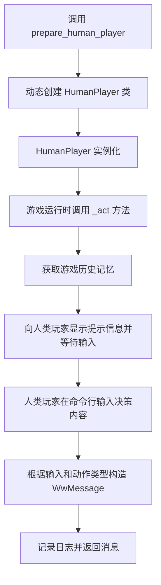
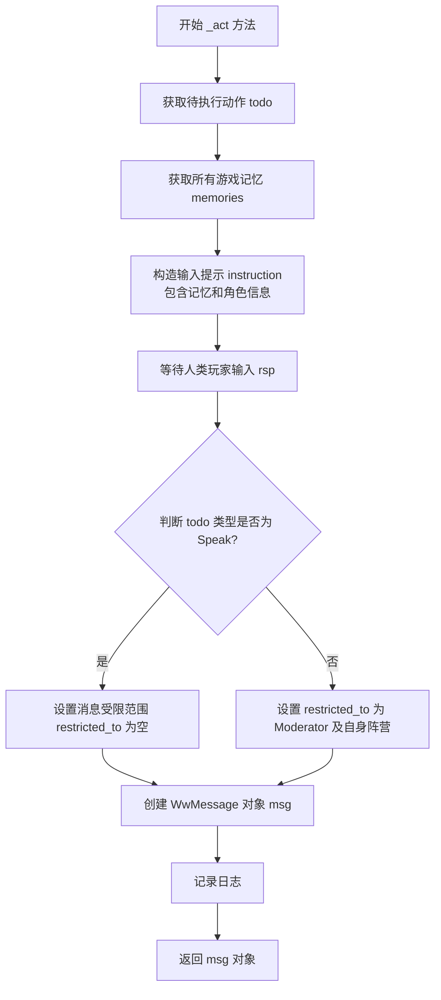
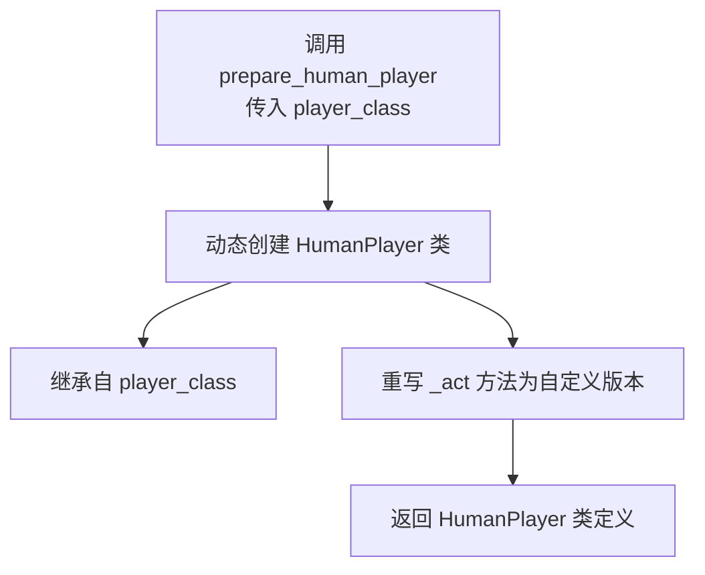
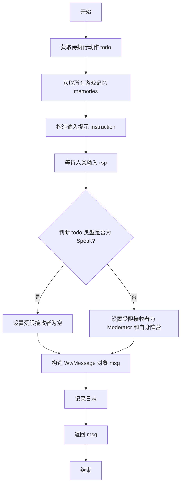

# `.\MetaGPT\metagpt\ext\werewolf\roles\human_player.py` 详细设计文档

该代码提供了一个用于狼人杀游戏的人类玩家角色适配器。它通过动态创建一个继承自指定游戏角色类的新类，并重写其 `_act` 方法，将原本由AI驱动的决策逻辑替换为等待人类玩家通过命令行输入进行交互，从而实现人类玩家在自动化狼人杀游戏框架中的参与。

## 整体流程



## 类结构

```
BasePlayer (基类，来自 metagpt.ext.werewolf.roles)
└── HumanPlayer (动态生成的类，继承自传入的 player_class)
    └── _act (重写的方法，用于人类交互)
```

## 全局变量及字段


### `RoleType`
    
狼人杀游戏中的角色类型枚举，用于标识不同角色（如狼人、村民、预言家等）。

类型：`Enum`
    


### `Speak`
    
狼人杀游戏中的发言动作类，用于处理玩家发言行为。

类型：`Class`
    


### `BasePlayer`
    
狼人杀游戏中所有玩家角色的基类，定义了玩家的基本属性和行为。

类型：`Class`
    


### `WwMessage`
    
狼人杀游戏中的消息类，用于封装玩家之间的通信内容。

类型：`Class`
    


### `logger`
    
日志记录器，用于记录游戏过程中的关键信息和调试日志。

类型：`Logger`
    


    

## 全局函数及方法


### `BasePlayer._act`

这是一个异步方法，用于模拟狼人杀游戏中人类玩家的行动。它通过标准输入（`input`）接收人类玩家的决策输入，并根据当前待执行动作（`todo`）的类型，构造一条格式化的游戏消息（`WwMessage`）。该方法的核心是将人类在控制台的输入转化为游戏内部可处理的消息对象，并指定消息的可见范围（例如，仅对 moderator 和自身阵营可见的特殊行动消息）。

参数：
-  `self`：`BasePlayer` 实例，表示调用此方法的人类玩家角色对象。

返回值：`WwMessage`，返回一个封装了玩家输入内容、发送者、接收者、触发原因及可见性限制的游戏消息对象。

#### 流程图



#### 带注释源码

```python
async def _act(self):
    # 1. 获取当前角色待执行的动作（例如：Speak, Vote, Kill 等）
    todo = self.rc.todo

    # 2. 获取该角色所有的游戏历史记忆，用于提示玩家
    memories = self.get_all_memories()

    # 3. 构造给人类玩家的输入提示信息
    #    提示信息包括游戏历史、玩家当前身份，以及行动格式要求
    input_instruction = f"""
    ## As a reminder, you have access to the following game history:
    {memories}
    ## You are {self.name}({self.profile})
    ## Guidance:
    1. If you are performing a special action or exercising a vote,
    end your response with "PlayerX", replace PlayerX with the actual player name, e.g., "..., kill/protect/poison/.../vote Player1".
    2. If it is a daytime free speech, you can speak in whatever format.
    Now, please speak:
    """
    # 4. 阻塞等待人类玩家在控制台输入决策
    rsp = input(input_instruction)  # wait for human input

    # 5. 确定消息的触发原因（即由哪个动作类触发）
    msg_cause_by = type(todo)
    # 6. 确定消息的受限可见范围：
    #    - 如果是自由发言（Speak），则对所有人可见（restricted_to 为空字典表示无限制）
    #    - 如果是其他特殊行动（如狼人杀人、女巫用药），则仅对 Moderator 和自身阵营角色可见
    msg_restricted_to = {} if isinstance(todo, Speak) else {RoleType.MODERATOR.value, self.profile}

    # 7. 使用收集到的信息构造游戏消息对象
    msg = WwMessage(
        content=rsp,  # 人类玩家的输入内容
        role=self.profile,  # 发送者的角色类型（如 Werewolf, Villager）
        sent_from=self.name,  # 发送者的玩家名称
        cause_by=msg_cause_by,  # 触发此消息的动作类
        send_to={},  # 接收者列表（此处为空，可能由 Moderator 后续分发）
        restricted_to=msg_restricted_to,  # 消息的受限可见范围
    )

    # 8. 记录日志，便于调试和追踪
    logger.info(f"{self._setting}: {rsp}")

    # 9. 返回构造好的消息对象
    return msg
```


### `prepare_human_player`

该函数是一个工厂函数，用于动态创建一个继承自指定玩家基类（`BasePlayer`）的“人类玩家”类。其核心功能是重写（Monkey-Patch）基类的 `_act` 异步方法，将原本由AI驱动的决策和发言逻辑替换为等待人类玩家通过控制台输入指令的交互逻辑。这使得在狼人杀游戏模拟中，可以引入一个由真人控制的玩家角色。

参数：

-  `player_class`：`BasePlayer`，一个玩家角色基类（例如 `Werewolf`， `Villager` 等），新创建的“人类玩家”类将继承自此基类。

返回值：`type`，返回一个动态创建的类（`HumanPlayer`）。这个类继承了传入的 `player_class`，并拥有一个自定义的 `_act` 方法。

#### 流程图



#### 带注释源码

```python
def prepare_human_player(player_class: BasePlayer):
    # Dynamically define a human player class that inherits from a certain role class
    # 使用 type() 函数动态创建一个名为 "HumanPlayer" 的新类。
    # 这个新类：
    # 1. 继承自传入的 player_class（例如 Werewolf）。
    # 2. 拥有一个类属性 `_act`，其值被设置为之前定义的 `_act` 函数（第6-40行）。
    #    这实现了对父类中 `_act` 方法的重写（Monkey-Patch）。
    HumanPlayer = type("HumanPlayer", (player_class,), {"_act": _act})
    # 返回这个新创建的类，调用者可以实例化它来获得一个由人类控制的玩家对象。
    return HumanPlayer
```


### `HumanPlayer._act`

该方法是一个异步方法，用于实现人类玩家在狼人杀游戏中的行动。它通过标准输入（`input`）接收人类玩家的决策输入，并根据当前待执行动作（`todo`）的类型，构造一个包含特定元数据（如发送者、接收者、可见性限制）的游戏消息（`WwMessage`）并返回。此方法的核心是将人类在控制台的输入转化为游戏引擎可处理的结构化消息。

参数：
-  `self`：`HumanPlayer` 实例，表示调用该方法的当前人类玩家对象。

返回值：`WwMessage`，返回一个构造好的游戏消息对象，其中包含了人类玩家的输入内容以及相关的消息元数据。

#### 流程图



#### 带注释源码

```python
async def _act(self):
    # 1. 从角色的运行时上下文（rc）中获取当前待执行的动作
    todo = self.rc.todo

    # 2. 获取该角色所有的游戏历史记忆，用于提示玩家
    memories = self.get_all_memories()

    # 3. 构造给人类玩家的输入提示信息，包含游戏历史、自身角色和行动指南
    input_instruction = f"""
    ## As a reminder, you have access to the following game history:
    {memories}
    ## You are {self.name}({self.profile})
    ## Guidance:
    1. If you are performing a special action or exercising a vote,
    end your response with "PlayerX", replace PlayerX with the actual player name, e.g., "..., kill/protect/poison/.../vote Player1".
    2. If it is a daytime free speech, you can speak in whatever format.
    Now, please speak:
    """
    # 4. 阻塞等待人类玩家在控制台输入决策
    rsp = input(input_instruction)  # wait for human input

    # 5. 确定消息的触发原因（cause_by），即当前待执行动作的类型
    msg_cause_by = type(todo)
    # 6. 确定消息的受限接收者（restricted_to）。
    #    如果当前动作是自由发言（Speak），则消息对所有人可见（空字典表示无限制）。
    #    否则（如狼人杀人、女巫用药等特殊行动），消息仅对裁判（Moderator）和自身阵营角色可见。
    msg_restricted_to = {} if isinstance(todo, Speak) else {RoleType.MODERATOR.value, self.profile}

    # 7. 使用收集到的信息构造一个完整的游戏消息（WwMessage）对象
    msg = WwMessage(
        content=rsp,  # 人类玩家的输入内容
        role=self.profile,  # 发送者的角色类型（如狼人、预言家）
        sent_from=self.name,  # 发送者的玩家名称
        cause_by=msg_cause_by,  # 触发此消息的动作类型
        send_to={},  # 显式发送给谁（此处为空，可能由系统路由）
        restricted_to=msg_restricted_to,  # 消息的可见性限制
    )

    # 8. 记录日志，便于调试和追踪
    logger.info(f"{self._setting}: {rsp}")

    # 9. 返回构造好的消息，供游戏引擎后续处理
    return msg
```


## 关键组件


### 动态角色类生成

通过 `prepare_human_player` 函数，在运行时动态创建一个继承自指定 `BasePlayer` 子类的新类 `HumanPlayer`，并为其注入自定义的 `_act` 方法，从而将AI角色快速转换为需要人类玩家手动输入交互的角色。

### 人类交互式行动方法

通过重写 `_act` 方法，将原本由AI模型驱动的行动决策流程替换为基于控制台的标准输入 (`input`)，允许人类玩家根据游戏历史和角色信息，在游戏流程中手动输入发言或行动指令。

### 消息构造与权限控制

在 `_act` 方法中，根据当前待执行动作 (`todo`) 的类型，动态构造 `WwMessage` 消息对象，并设置其 `restricted_to` 字段，以实现对消息可见范围的精细控制（例如，非公开发言仅对主持人和自身阵营可见）。


## 问题及建议


### 已知问题

-   **阻塞式同步输入**：代码在 `_act` 函数中使用了 `input()` 函数等待用户输入。这是一个同步阻塞操作，会完全停止整个异步程序的执行，直到用户输入完成。这在异步环境中是严重的性能问题和设计缺陷，可能导致整个游戏流程卡死。
-   **硬编码的提示词**：`input_instruction` 提示词字符串被硬编码在函数内部。这使得提示词的修改、定制化或国际化变得困难，降低了代码的可维护性和灵活性。
-   **动态类创建的潜在风险**：`prepare_human_player` 函数通过 `type()` 动态创建类。虽然灵活，但可能使代码结构不够清晰，增加调试难度，并且如果 `player_class` 的基类或 `_act` 方法的签名发生变化，可能导致运行时错误。
-   **日志信息不完整**：日志记录 `f"{self._setting}: {rsp}"` 可能无法提供足够的上文信息（例如，当前游戏轮次、行动类型），不利于问题排查和游戏复盘。
-   **消息接收者逻辑可能不直观**：`msg_restricted_to` 的逻辑是，如果行动是 `Speak`，则接收者为空字典 `{}`（可能意味着广播？），否则只发送给 `MODERATOR` 和自身阵营。这种逻辑对于阅读代码的人来说不够清晰，且 `{}` 作为“广播”的语义不明确。

### 优化建议

-   **采用异步输入**：将 `input()` 替换为异步的输入方法，例如使用 `asyncio` 的 `asyncio.to_thread(input, ...)` 将阻塞调用转移到线程池执行，或者使用专门支持异步的UI/前端库来获取用户输入，以保持异步事件循环的流畅运行。
-   **外部化配置提示词**：将 `input_instruction` 提示词模板移至配置文件（如 YAML、JSON）或常量模块中。这样可以在不修改代码的情况下调整提示内容，也便于支持多语言。
-   **考虑使用显式子类化**：可以定义一个明确的 `HumanPlayer` 基类或混入类（Mixin），而不是每次都动态创建。例如，`class HumanPlayerMixin:` 包含 `_act` 方法，然后通过 `class HumanWerewolf(HumanPlayerMixin, Werewolf):` 的方式组合。这能提高代码的可读性和静态分析工具的友好性。
-   **增强日志上下文**：在日志信息中加入更多上下文，例如当前行动 (`todo`)、玩家ID、游戏阶段等。例如：`logger.info(f"[Phase: {self.rc.state.stage}] Player {self.name}({self.profile}) action '{todo}': {rsp}")`。
-   **明确消息发送语义**：重构 `msg_restricted_to` 的赋值逻辑，使其更清晰。可以为不同的行动类型定义明确的发送规则，或者使用常量来定义“广播”等语义，例如 `BROADCAST = None` 或一个特定的集合，避免使用含义模糊的空字典 `{}`。
-   **增加输入验证与错误处理**：在 `_act` 函数中，对用户的输入 `rsp` 进行基本的验证（例如，非空检查、格式检查）。如果输入不符合要求（如投票时未以“PlayerX”结尾），应提供清晰的错误提示并允许用户重新输入，而不是直接使用可能无效的输入构造消息。
-   **考虑依赖注入**：`prepare_human_player` 函数可以接受一个可选的“输入提供器”回调函数作为参数，而不是硬编码 `input()`。这样可以在测试时注入模拟输入，提高代码的可测试性。


## 其它


### 设计目标与约束

该代码的设计目标是为狼人杀游戏提供一个允许人类玩家通过命令行交互参与游戏的机制。核心约束包括：1) 必须与现有的基于 `BasePlayer` 的自动化玩家角色系统兼容；2) 人类玩家的输入需要无缝集成到游戏的消息传递框架 (`WwMessage`) 中；3) 需要处理游戏内不同阶段（如自由发言、执行特殊行动、投票）的输入格式差异。设计上通过动态创建混合类来实现，避免修改核心游戏逻辑。

### 错误处理与异常设计

当前代码缺乏显式的错误处理机制。主要风险点在于：1) `input()` 函数可能被中断（如键盘中断 `KeyboardInterrupt`），这会导致整个协程意外终止，影响游戏流程。2) 人类玩家的输入 (`rsp`) 未进行任何有效性或格式校验，可能产生不符合游戏规则或 `WwMessage` 结构要求的消息内容。建议在 `_act` 函数中添加 `try-except` 块捕获 `KeyboardInterrupt` 和 `EOFError`，并定义清晰的玩家输入验证逻辑。

### 数据流与状态机

数据流始于 `prepare_human_player` 函数，它接收一个 `BasePlayer` 子类并动态创建一个新的 `HumanPlayer` 类，该类重写了 `_act` 方法。在游戏运行时，当轮到该人类玩家行动时，其 `_act` 方法被调用。方法内部：1) 从 `self.rc.todo` 获取当前行动指令。2) 通过 `self.get_all_memories()` 获取游戏历史。3) 组合提示信息并等待用户命令行输入。4) 根据行动类型 (`todo`) 决定消息的接收范围 (`restricted_to`)。5) 封装输入内容为 `WwMessage` 对象并返回，从而将人类输入注入到游戏的标准消息循环中。状态由 `todo` 参数隐含驱动，区分了“发言”和“执行行动/投票”两种主要状态。

### 外部依赖与接口契约

1.  **外部依赖**：
    *   `metagpt.environment.werewolf.const.RoleType`: 用于定义消息接收者的角色类型。
    *   `metagpt.ext.werewolf.actions.Speak`: 用于判断当前行动是否为自由发言。
    *   `metagpt.ext.werewolf.roles.BasePlayer`: 所有玩家角色的基类，`HumanPlayer` 必须继承自其某个子类。
    *   `metagpt.ext.werewolf.schema.WwMessage`: 游戏内消息的标准数据结构。
    *   `metagpt.logs.logger`: 用于记录日志。
    *   Python 内置 `input()` 函数：用于同步阻塞式获取用户输入。

2.  **接口契约**：
    *   `prepare_human_player(player_class: BasePlayer) -> type`: 契约要求输入一个 `BasePlayer` 的子类，返回一个动态创建的新类。返回的类必须具有与 `BasePlayer` 兼容的接口，特别是 `_act` 方法需返回一个 `WwMessage` 实例。
    *   `_act(self) -> WwMessage`: 作为替换原角色 `_act` 方法的新实现，其内部逻辑必须组装出符合 `WwMessage` 要求的消息对象。它依赖于 `self.rc.todo`、`self.name`、`self.profile` 和 `self.get_all_memories()` 等父类属性或方法的存在。

### 安全与权限考虑

代码通过 `restricted_to` 字段实现了简单的消息权限控制：当行动不是 `Speak`（即执行狼人、预言家等特殊能力或投票）时，消息仅对 `MODERATOR` 和玩家自身阵营 (`self.profile`) 可见，这模拟了游戏中的“私密”行动。然而，权限控制的正确性完全依赖于传入的 `todo` 参数类型。如果未来新增的非发言行动未正确设置此逻辑，可能导致信息泄露。此外，人类玩家的输入内容 (`rsp`) 未经任何过滤或转义，如果直接用于日志或后续处理，存在注入攻击（如日志注入）的潜在风险。

### 测试策略建议

1.  **单元测试**：
    *   测试 `prepare_human_player` 函数：验证其返回的类是否正确继承了指定的 `player_class`，并且其 `_act` 方法已被替换为模块内的 `_act` 函数。
    *   模拟测试 `_act` 方法：使用 `unittest.mock` 模拟 `self.rc.todo`、`self.get_all_memories()` 和 `input()`，验证在不同 `todo` 类型下生成的 `WwMessage` 对象的 `content`、`cause_by` 和 `restricted_to` 字段是否符合预期。
2.  **集成测试**：
    *   将创建的 `HumanPlayer` 类实例放入一个简化的游戏环境中，模拟一轮行动，验证其产生的消息能否被游戏引擎正确处理，并且权限控制生效（例如，狼人行动消息不应被其他阵营玩家看到）。
3.  **手动测试/交互测试**：
    *   由于核心功能依赖人工输入，需要设计测试用例指导测试人员输入各种边界情况（空输入、超长输入、格式正确/错误的行动指令），观察系统行为是否符合预期，并检查错误处理是否健全。

    