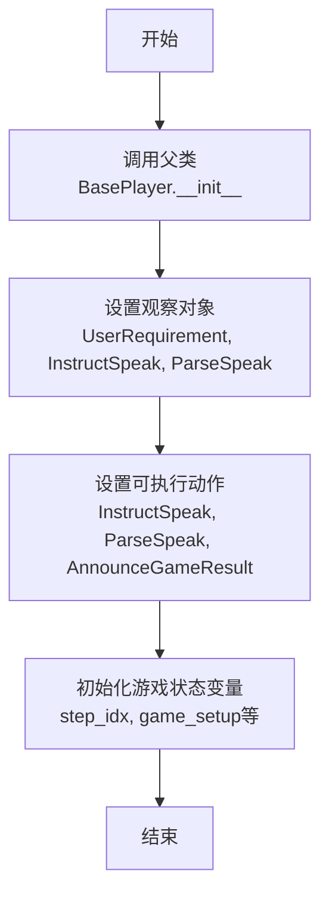
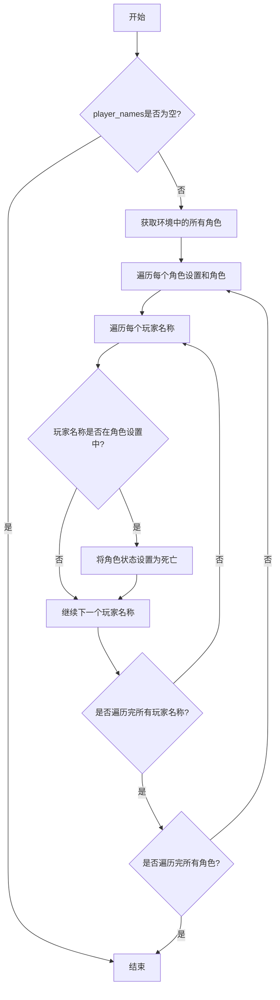
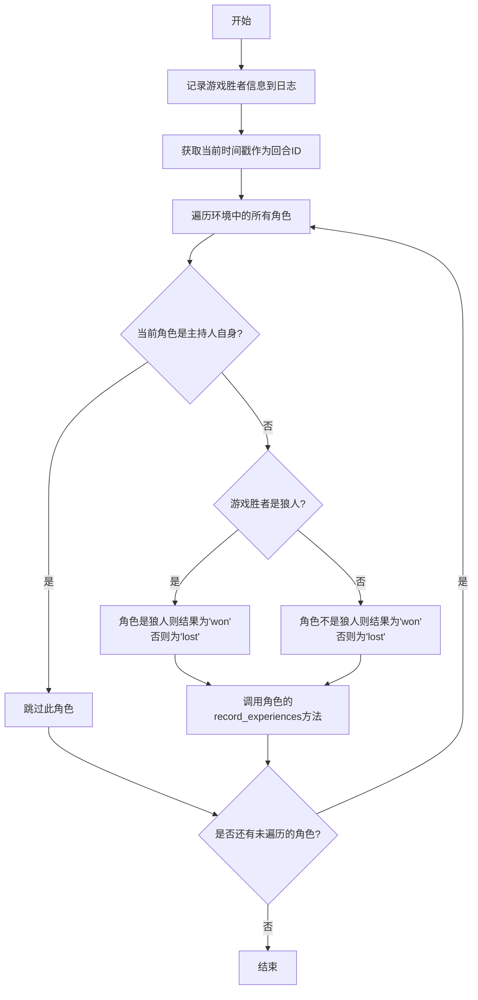
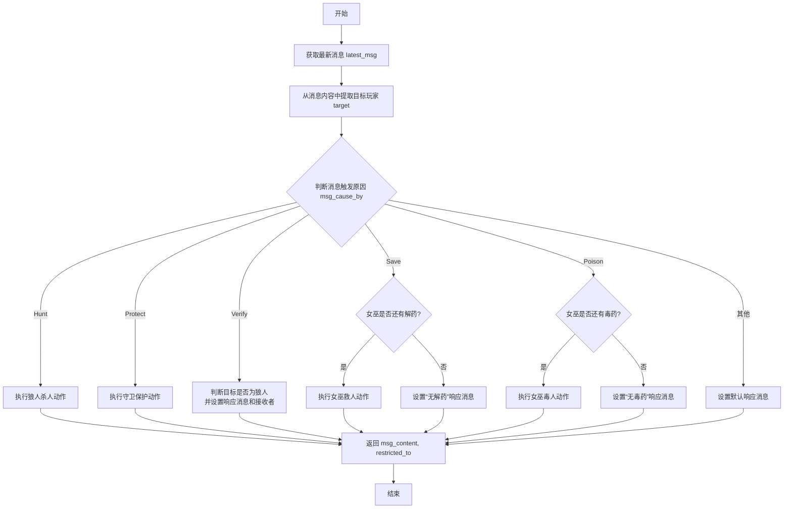
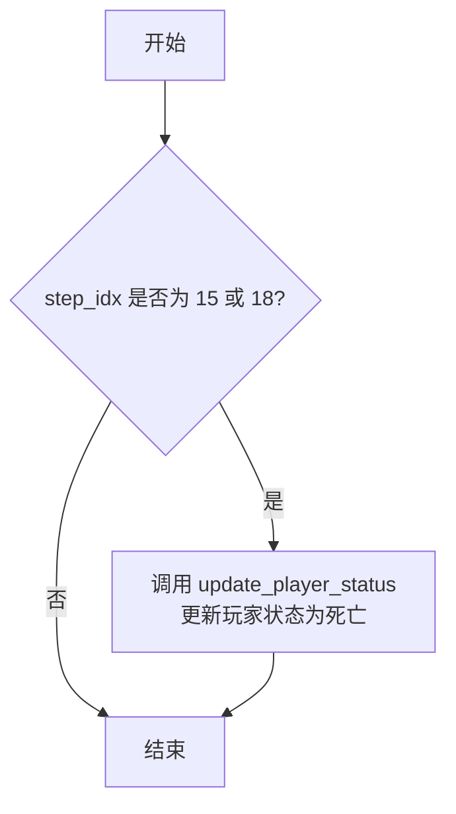
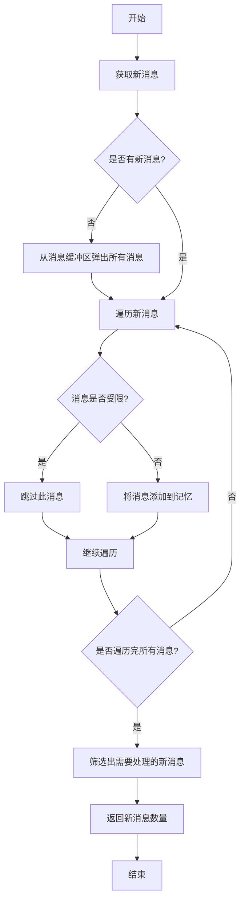
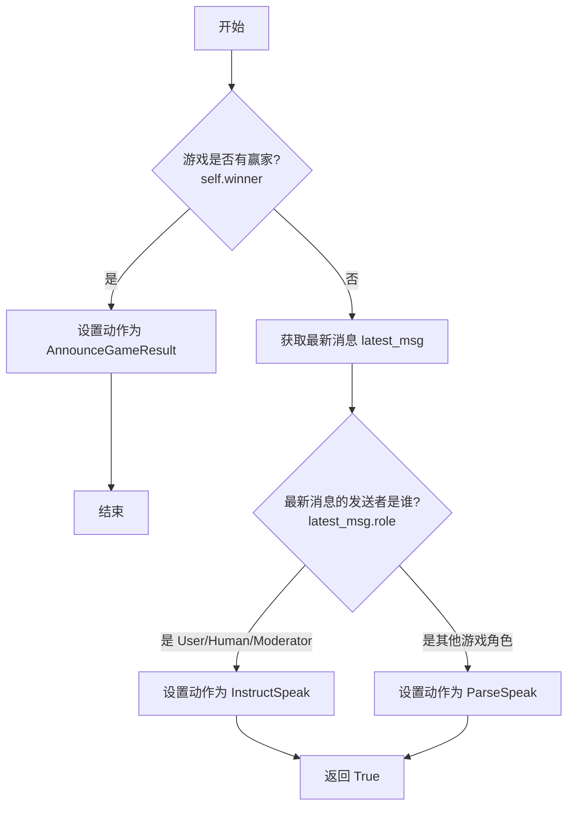
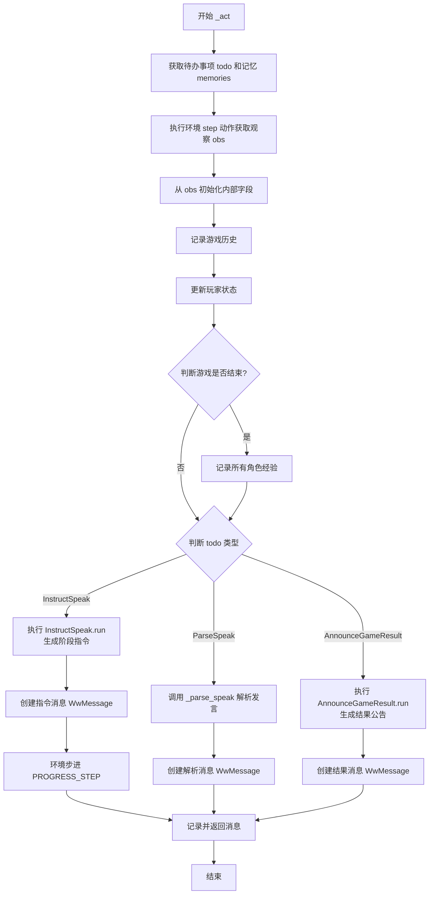

# `.\MetaGPT\metagpt\ext\werewolf\roles\moderator.py` 详细设计文档

该文件定义了一个狼人杀游戏中的 Moderator（主持人/上帝）角色类。它继承自 BasePlayer，负责管理游戏流程，包括：解析玩家发言、执行游戏动作（如狼人杀人、女巫用药、守卫守护、预言家查验）、更新游戏状态（如玩家生死、女巫药水数量）、记录游戏历史、宣布游戏结果以及记录所有角色的游戏经验。它是游戏环境与 AI 角色之间的核心协调者。

## 整体流程

```mermaid
graph TD
    A[Moderator 初始化] --> B[注册观察的Action和自身可执行的Action]
    B --> C[进入主循环: _observe -> _think -> _act]
    C --> D{_observe: 是否有新消息?}
    D -- 是 --> E[过滤并存储消息到 memory]
    D -- 否 --> F[继续等待]
    E --> G{_think: 判断下一步动作}]
    G --> H{游戏是否已结束?}
    H -- 是 --> I[设置待办动作为 AnnounceGameResult]
    H -- 否 --> J{上一条消息来自谁?}
    J -- 用户或自己 --> K[设置待办动作为 InstructSpeak (发布指令)]
    J -- 游戏角色 --> L[设置待办动作为 ParseSpeak (解析发言)]
    I --> M[_act: 执行 AnnounceGameResult]
    K --> N[_act: 执行 InstructSpeak]
    L --> O[_act: 执行 ParseSpeak]
    M --> P[生成并返回游戏结果消息]
    N --> Q[从环境获取最新状态，生成并返回阶段指令消息]
    O --> R[解析角色发言，触发环境动作，生成并返回回应消息]
    P --> S[循环结束]
    Q --> C
    R --> C
```

## 类结构

```
BasePlayer (基础玩家类，来自 metagpt.ext.werewolf.roles.base_player)
└── Moderator (主持人/上帝角色)
    ├── 字段: step_idx, game_setup, werewolf_players, winner, win_reason, witch_poison_left, witch_antidote_left
    ├── 方法: __init__, update_player_status, _record_all_experiences, _parse_speak, _update_player_status, _record_game_history, _observe, _think, _init_fields_from_obj, _act, get_all_memories
    └── 继承的方法: _watch, set_actions, rc (属性) 等
```

## 全局变量及字段


### `Moderator.step_idx`
    
记录当前游戏进行的步骤索引，用于追踪游戏进度和阶段。

类型：`int`
    


### `Moderator.game_setup`
    
存储游戏初始配置信息，用于记录和复盘游戏设置。

类型：`str`
    


### `Moderator.werewolf_players`
    
存储所有狼人玩家的名称列表，用于追踪狼人身份和游戏逻辑判断。

类型：`list[str]`
    


### `Moderator.winner`
    
记录游戏获胜方（如'werewolf'或'villager'），当游戏结束时被设置。

类型：`str | None`
    


### `Moderator.win_reason`
    
记录游戏获胜的原因描述，用于最终结果宣布。

类型：`str | None`
    


### `Moderator.witch_poison_left`
    
记录女巫剩余的毒药使用次数，用于限制女巫的行动能力。

类型：`int`
    


### `Moderator.witch_antidote_left`
    
记录女巫剩余的解毒药使用次数，用于限制女巫的救人能力。

类型：`int`
    
    

## 全局函数及方法

### `Moderator.__init__`

该方法用于初始化 Moderator 类实例，设置游戏状态初始值，并配置其观察和可执行的动作。

参数：

- `kwargs`：`dict`，可变关键字参数，用于传递给父类 `BasePlayer` 的初始化方法。

返回值：`None`，无返回值。

#### 流程图



#### 带注释源码

```python
def __init__(self, **kwargs):
    # 调用父类 BasePlayer 的初始化方法，传递所有关键字参数
    super().__init__(**kwargs)
    # 设置当前角色（Moderator）需要观察的消息类型
    # 当收到这些类型的消息时，会触发 _observe 和后续处理
    self._watch([UserRequirement, InstructSpeak, ParseSpeak])
    # 设置当前角色（Moderator）可以执行的动作
    self.set_actions([InstructSpeak, ParseSpeak, AnnounceGameResult])

    # 初始化游戏状态变量
    self.step_idx = 0  # 当前游戏步骤索引
    self.game_setup = ""  # 游戏设置信息
    self.werewolf_players = []  # 狼人玩家列表
    self.winner = None  # 游戏获胜方
    self.win_reason = None  # 获胜原因
    self.witch_poison_left = 1  # 女巫毒药剩余次数
    self.witch_antidote_left = 1  # 女巫解药剩余次数
```

### `Moderator.update_player_status`

该方法用于更新指定玩家的状态为死亡。它接收一个玩家名称列表，遍历环境中的所有角色，如果角色设置中包含列表中的玩家名称，则将该角色的状态设置为死亡。

参数：

- `player_names`：`list[str]`，需要更新状态的玩家名称列表

返回值：`None`，无返回值

#### 流程图



#### 带注释源码

```python
def update_player_status(self, player_names: list[str]):
    # 如果玩家名称列表为空，直接返回
    if not player_names:
        return
    # 获取环境中的所有角色，roles_in_env是一个字典，键为角色设置，值为角色对象
    roles_in_env = self.rc.env.get_roles()
    # 遍历每个角色设置和对应的角色对象
    for role_setting, role in roles_in_env.items():
        # 遍历每个需要更新状态的玩家名称
        for player_name in player_names:
            # 如果玩家名称在角色设置中，说明该角色对应这个玩家
            if player_name in role_setting:
                # 将该角色的状态更新为死亡
                role.set_status(new_status=RoleState.DEAD)
```

### `Moderator._record_all_experiences`

该方法用于在游戏结束后，记录所有游戏角色（除主持人自身外）的经验数据。它会根据游戏结果（狼人胜利或好人胜利）为每个角色计算胜负结果，并调用每个角色的 `record_experiences` 方法，将游戏回合ID、结果和游戏配置信息记录下来。

参数：无

返回值：`None`，无返回值

#### 流程图



#### 带注释源码

```python
def _record_all_experiences(self):
    # 记录游戏胜者信息到日志
    logger.info(f"The winner of the game: {self.winner}, start to record roles' experiences")
    # 从环境中获取所有角色
    roles_in_env = self.rc.env.get_roles()
    # 生成当前时间戳，作为本回合游戏的唯一标识
    timestamp = datetime.now().strftime("%Y_%m_%d_%H_%M_%S")
    # 遍历环境中的每一个角色
    for _, role in roles_in_env.items():
        # 跳过主持人自身
        if role == self:
            continue
        # 根据游戏胜者判断当前角色的胜负结果
        if self.winner == "werewolf":
            # 如果狼人获胜，狼人角色的结果为'won'，其他角色为'lost'
            outcome = "won" if role.profile in RoleType.WEREWOLF.value else "lost"
        else:
            # 如果好人获胜，非狼人角色的结果为'won'，狼人角色为'lost'
            outcome = "won" if role.profile not in RoleType.WEREWOLF.value else "lost"
        # 调用角色的方法，记录其本次游戏的经验
        role.record_experiences(round_id=timestamp, outcome=outcome, game_setup=self.game_setup)
```

### `Moderator._parse_speak`

该方法用于解析狼人杀游戏中玩家的发言，根据发言内容（触发原因）执行相应的游戏动作（如狼人杀人、女巫救人/毒人等），并生成裁判的响应消息。

参数：

- `memories`：`list[WwMessage]`，包含历史消息的列表，通常用于获取最新的玩家发言。

返回值：`tuple[str, set[str]]`，返回一个元组，包含裁判的响应消息内容（`msg_content`）和该消息的受限接收者集合（`restricted_to`）。

#### 流程图



#### 带注释源码

```python
async def _parse_speak(self, memories):
    # 1. 获取最新的消息，这通常是某个游戏角色的发言
    latest_msg = memories[-1]
    latest_msg_content = latest_msg.content

    # 2. 从消息内容中提取目标玩家的名字（例如 "Player1"）
    # 使用正则表达式在消息内容的最后10个字符中查找，这是一个硬编码的截断逻辑
    match = re.search(r"Player[0-9]+", latest_msg_content[-10:])  # FIXME: hard code truncation
    target = match.group(0) if match else ""

    # 3. 初始化默认的返回值和消息接收者
    msg_content = "Understood"  # 默认响应内容
    restricted_to = set()       # 默认消息发送给所有人（空集合）

    # 4. 根据消息的触发原因（cause_by）执行不同的游戏逻辑
    msg_cause_by = latest_msg.cause_by

    # 4.1 如果触发原因是狼人行动（Hunt），则执行狼人杀人动作
    if msg_cause_by == any_to_str(Hunt):
        self.rc.env.step(
            EnvAction(
                action_type=EnvActionType.WOLF_KILL,
                player_name=latest_msg.sent_from,  # 行动者（狼人）
                target_player_name=target          # 目标玩家
            )
        )
    # 4.2 如果触发原因是守卫行动（Protect），则执行守卫保护动作
    elif msg_cause_by == any_to_str(Protect):
        self.rc.env.step(
            EnvAction(
                action_type=EnvActionType.GUARD_PROTECT,
                player_name=latest_msg.sent_from,  # 行动者（守卫）
                target_player_name=target          # 目标玩家
            )
        )
    # 4.3 如果触发原因是预言家行动（Verify），则判断目标玩家身份并告知预言家
    elif msg_cause_by == any_to_str(Verify):
        if target in self.werewolf_players:
            msg_content = f"{target} is a werewolf"  # 目标是狼人
        else:
            msg_content = f"{target} is a good guy"  # 目标是好人
        # 此消息仅限裁判和预言家可见
        restricted_to = {RoleType.MODERATOR.value, RoleType.SEER.value}
    # 4.4 如果触发原因是女巫救人行动（Save）
    elif msg_cause_by == any_to_str(Save):
        # 检查女巫是否选择跳过（发言中包含“pass”）
        if RoleActionRes.PASS.value in latest_msg_content.lower():
            # the role ignore to response, answer `pass`
            pass
        # 检查女巫是否还有解药
        elif not self.witch_antidote_left:
            msg_content = "You have no antidote left and thus can not save the player"
            # 此消息仅限裁判和女巫可见
            restricted_to = {RoleType.MODERATOR.value, RoleType.WITCH.value}
        else:
            # 执行女巫救人动作
            self.rc.env.step(
                EnvAction(
                    action_type=EnvActionType.WITCH_SAVE,
                    player_name=latest_msg.sent_from,  # 行动者（女巫）
                    target_player_name=target          # 目标玩家
                )
            )
    # 4.5 如果触发原因是女巫毒人行动（Poison）
    elif msg_cause_by == any_to_str(Poison):
        # 检查女巫是否选择跳过（发言中包含“pass”）
        if RoleActionRes.PASS.value in latest_msg_content.lower():
            pass
        # 检查女巫是否还有毒药
        elif not self.witch_poison_left:
            msg_content = "You have no poison left and thus can not poison the player"
            # 此消息仅限裁判和女巫可见
            restricted_to = {RoleType.MODERATOR.value, RoleType.WITCH.value}
        else:
            # 执行女巫毒人动作
            self.rc.env.step(
                EnvAction(
                    action_type=EnvActionType.WITCH_POISON,
                    player_name=latest_msg.sent_from,  # 行动者（女巫）
                    target_player_name=target          # 目标玩家
                )
            )

    # 5. 返回裁判的响应消息和接收者限制
    return msg_content, restricted_to
```

### `Moderator._update_player_status`

该方法用于在游戏特定步骤（夜晚或白天结束时）更新死亡玩家的状态。它检查当前步骤索引是否对应于游戏周期中的关键节点（夜晚结束或白天结束），如果是，则调用 `update_player_status` 方法将指定的玩家状态标记为死亡。

参数：

- `step_idx`：`int`，当前游戏步骤的索引，用于判断是否处于需要更新玩家状态的步骤
- `player_current_dead`：`list[str]`，当前步骤中死亡的玩家名称列表

返回值：`None`，该方法不返回任何值

#### 流程图



#### 带注释源码

```python
def _update_player_status(self, step_idx: int, player_current_dead: list[str]):
    """update dead player's status"""
    # 检查当前步骤是否为夜晚结束（步骤15）或白天结束（步骤18）
    if step_idx in [15, 18]:
        # 如果是，则调用 update_player_status 方法，传入死亡玩家列表
        self.update_player_status(player_current_dead)
```

### `Moderator._record_game_history`

该方法用于在游戏进行到特定节点（如完成一个完整的“一夜一日”循环或游戏结束时）时，将当前游戏的所有对话历史记录写入到本地文件中。

参数：
- `step_idx`：`int`，当前的游戏步骤索引，用于判断是否到达记录节点。

返回值：`None`，该方法不返回任何值。

#### 流程图

```mermaid
flowchart TD
    A[开始] --> B{条件判断<br>step_idx是STEP_INSTRUCTIONS长度的整数倍<br>或游戏已决出胜者？}
    B -- 是 --> C[记录日志<br>“a night and day cycle completed...”]
    C --> D[获取所有记忆<br>self.get_all_memories()]
    D --> E[写入文件<br>DEFAULT_WORKSPACE_ROOT / “werewolf_transcript.txt”]
    E --> F[结束]
    B -- 否 --> F
```

#### 带注释源码

```python
def _record_game_history(self, step_idx: int):
    # 判断记录条件：当step_idx是STEP_INSTRUCTIONS列表长度的整数倍（即完成一个循环）或游戏已决出胜者时
    if step_idx and step_idx % len(STEP_INSTRUCTIONS) == 0 or self.winner:
        # 记录信息级日志，提示一个循环已完成
        logger.info("a night and day cycle completed, examine all history")
        # 记录调试级日志，输出所有记忆内容（仅在调试模式可见）
        logger.debug(f"all_memories: {self.get_all_memories()}")
        # 打开（或创建）位于默认工作空间下的“werewolf_transcript.txt”文件，准备写入
        with open(DEFAULT_WORKSPACE_ROOT / "werewolf_transcript.txt", "w") as f:
            # 调用get_all_memories()方法获取格式化的所有对话历史，并写入文件
            f.write(self.get_all_memories())
```

### `Moderator._observe`

该方法用于观察并处理消息缓冲区中的新消息，将其添加到角色的记忆中，并筛选出当前角色需要处理的新消息。

参数：

- `ignore_memory`：`bool`，是否忽略现有记忆，如果为True，则只处理新消息，不将旧消息纳入考虑。

返回值：`int`，返回当前角色需要处理的新消息数量。

#### 流程图



#### 带注释源码

```python
async def _observe(self, ignore_memory=False) -> int:
    # 初始化新消息列表
    news = []
    # 如果新消息列表为空，则从消息缓冲区中弹出所有消息
    if not news:
        news = self.rc.msg_buffer.pop_all()
    # 获取现有记忆，如果ignore_memory为True，则获取空列表
    old_messages = [] if ignore_memory else self.rc.memory.get()
    # 遍历所有新消息
    for m in news:
        # 检查消息是否受限，即是否发送给当前角色
        if len(m.restricted_to) and self.profile not in m.restricted_to and self.name not in m.restricted_to:
            # 如果消息不是发送给全体（""）也不是发送给当前角色，则跳过此消息
            continue
        # 将消息添加到角色的记忆中
        self.rc.memory.add(m)
    # 筛选出当前角色需要处理的新消息
    # 条件：消息的触发者在观察列表中，或者消息发送给当前角色，或者消息发送给全体
    # 并且消息不在旧消息列表中
    self.rc.news = [
        n
        for n in news
        if (n.cause_by in self.rc.watch or self.profile in n.send_to or MESSAGE_ROUTE_TO_ALL in n.send_to)
        and n not in old_messages
    ]
    # 返回需要处理的新消息数量
    return len(self.rc.news)
```

### `Moderator._think`

该方法用于决定 Moderator 下一步应该执行哪个动作。它根据游戏状态（是否有赢家）和最新的消息来源（是用户/Moderator自身还是其他游戏角色）来设置下一步待执行的动作（`self.rc.todo`）。

参数：
- `self`：`Moderator`，`Moderator` 类的实例。

返回值：`bool`，当设置了待执行动作时返回 `True`，否则无返回值（`None`）。

#### 流程图



#### 带注释源码

```python
async def _think(self):
    # 检查游戏是否已经结束（有赢家）
    if self.winner:
        # 如果游戏结束，则设置下一步动作为宣布游戏结果
        self.rc.todo = AnnounceGameResult()
        return  # 游戏结束，无需返回True

    # 游戏未结束，获取最近的一条消息
    latest_msg = self.rc.memory.get()[-1]
    # 判断最新消息的发送者类型
    if latest_msg.role in ["User", "Human", self.profile]:
        # 情况1: 消息来自用户或人类（游戏开始指令）
        # 情况2: 消息来自Moderator自身（上一条是InstructSpeak或ParseSpeak的结果）
        # 这两种情况都需要Moderator发出新的指令，指导游戏进入下一阶段
        self.rc.todo = InstructSpeak()
    else:
        # 情况3: 消息来自其他游戏角色（如狼人、预言家等）
        # 此时需要解析该角色的发言，以更新游戏状态（如执行狼人杀人、女巫用药等）
        self.rc.todo = ParseSpeak()
    # 成功设置了待执行动作，返回True
    return True
```

### `Moderator._init_fields_from_obj`

该方法用于从环境观察对象中初始化或更新 Moderator 实例的关键游戏状态字段。它接收一个包含游戏当前状态的字典，并将其中的值分别赋给 Moderator 的对应实例变量，以保持 Moderator 内部状态与环境同步。

参数：
- `obs`：`dict[str, Union[int, str, list[str]]]`，从环境（`self.rc.env.step`）返回的观察字典，包含了游戏当前的各项状态信息。

返回值：`None`，该方法不返回任何值，其作用是通过副作用更新实例的字段。

#### 流程图

```mermaid
flowchart TD
    A[开始: _init_fields_from_obj(obs)] --> B[从obs中获取'game_setup'<br>赋值给self.game_setup]
    B --> C[从obs中获取'step_idx'<br>赋值给self.step_idx]
    C --> D[从obs中获取'winner'<br>赋值给self.winner]
    D --> E[从obs中获取'win_reason'<br>赋值给self.win_reason]
    E --> F[从obs中获取'werewolf_players'<br>赋值给self.werewolf_players]
    F --> G[从obs中获取'witch_poison_left'<br>赋值给self.witch_poison_left]
    G --> H[从obs中获取'witch_antidote_left'<br>赋值给self.witch_antidote_left]
    H --> I[结束]
```

#### 带注释源码

```python
def _init_fields_from_obj(self, obs: dict[str, Union[int, str, list[str]]]):
    # 从观察字典`obs`中获取游戏设置字符串，若不存在则使用空字符串，并赋值给实例变量`self.game_setup`
    self.game_setup = obs.get("game_setup", "")
    # 从观察字典`obs`中获取当前游戏步数索引，若不存在则使用0，并赋值给实例变量`self.step_idx`
    self.step_idx = obs.get("step_idx", 0)
    # 从观察字典`obs`中获取游戏获胜方（例如“werewolf”或“villager”），若不存在则为None
    self.winner = obs.get("winner")
    # 从观察字典`obs`中获取获胜原因描述，若不存在则为None
    self.win_reason = obs.get("win_reason")
    # 从观察字典`obs`中获取狼人玩家名称列表，若不存在则使用空列表
    self.werewolf_players = obs.get("werewolf_players", [])
    # 从观察字典`obs`中获取女巫毒药剩余次数，若不存在则使用0
    self.witch_poison_left = obs.get("witch_poison_left", 0)
    # 从观察字典`obs`中获取女巫解药剩余次数，若不存在则使用0
    self.witch_antidote_left = obs.get("witch_antidote_left", 0)
```

### `Moderator._act`

`Moderator._act` 方法是狼人杀游戏 Moderator（主持人）角色的核心行动方法。它根据当前游戏状态（通过环境观察获取）和 `_think` 方法设定的待办事项（`todo`），执行相应的动作：发布游戏阶段指令（`InstructSpeak`）、解析玩家发言（`ParseSpeak`）或宣布游戏结果（`AnnounceGameResult`）。在执行过程中，它会更新内部游戏状态、记录游戏历史、管理玩家状态，并最终生成一个包含行动结果的 `WwMessage` 消息对象。

参数：

-  `self`：`Moderator`，`Moderator` 类的实例，代表游戏主持人。

返回值：`WwMessage`，返回一个 `WwMessage` 消息对象，其中包含了主持人执行动作后生成的内容、发送目标、限制接收者等信息，用于在角色间传递。

#### 流程图



#### 带注释源码

```python
async def _act(self):
    # 1. 获取当前待执行的动作（由 _think 方法设定）和所有记忆
    todo = self.rc.todo
    logger.info(f"{self._setting} ready to {todo}")

    memories = self.get_all_memories(mode="msg")

    # 2. 与环境交互，获取当前游戏状态观察值（obs）
    #    执行一个 NONE 动作仅用于获取状态，不改变环境
    obs, _, _, _, _ = self.rc.env.step(action=EnvAction(action_type=EnvActionType.NONE))
    # 从观察值中提取关键游戏信息
    living_players = obs["living_players"]
    werewolf_players = obs["werewolf_players"]
    player_hunted = obs["player_hunted"]
    player_current_dead = obs["player_current_dead"]
    # 3. 使用观察值更新 Moderator 对象的内部状态字段
    self._init_fields_from_obj(obs)

    # 4. 记录游戏历史（例如，每完成一个日夜循环后写入文件）
    self._record_game_history(self.step_idx)

    # 5. 更新玩家状态（例如，标记已死亡的玩家）
    self._update_player_status(self.step_idx, player_current_dead)
    # 6. 如果游戏已决出胜者，记录所有角色的经验（用于学习等）
    if self.winner:
        self._record_all_experiences()

    # 7. 根据待办事项 `todo` 的类型，执行相应的核心逻辑
    # 7.1 如果是发布指令阶段
    if isinstance(todo, InstructSpeak):
        # 调用 InstructSpeak 动作的 run 方法，生成当前步骤的指令内容、发送目标和限制
        msg_content, msg_to_send_to, msg_restricted_to = await InstructSpeak().run(
            self.step_idx,
            living_players=living_players,
            werewolf_players=werewolf_players,
            player_hunted=player_hunted,
            player_current_dead=player_current_dead,
        )
        # 使用生成的信息创建消息对象
        msg = WwMessage(
            content=msg_content,
            role=self.profile,
            sent_from=self.name,
            cause_by=InstructSpeak,
            send_to=msg_to_send_to,
            restricted_to=msg_restricted_to,
        )
        logger.info(f"current step_idx: {self.step_idx}")
        # 指令发布后，推动环境步进（例如，增加 step_idx）
        self.rc.env.step(EnvAction(action_type=EnvActionType.PROGRESS_STEP))

    # 7.2 如果是解析玩家发言阶段
    elif isinstance(todo, ParseSpeak):
        # 调用内部方法 _parse_speak 来解析最新的玩家发言，并生成回复内容和接收限制
        msg_content, msg_restricted_to = await self._parse_speak(memories)
        # 创建解析回复消息
        msg = WwMessage(
            content=msg_content,
            role=self.profile,
            sent_from=self.name,
            cause_by=ParseSpeak,
            send_to={},
            restricted_to=msg_restricted_to,
        )

    # 7.3 如果是宣布游戏结果阶段
    elif isinstance(todo, AnnounceGameResult):
        # 调用 AnnounceGameResult 动作的 run 方法，生成胜利公告
        msg_content = await AnnounceGameResult().run(winner=self.winner, win_reason=self.win_reason)
        # 创建结果公告消息
        msg = WwMessage(content=msg_content, role=self.profile, sent_from=self.name, cause_by=AnnounceGameResult)

    # 8. 记录生成的消息内容并返回该消息对象
    logger.info(f"{self._setting}: {msg_content}")
    return msg
```

### `Moderator.get_all_memories`

该方法用于获取并格式化当前 `Moderator` 角色的所有记忆（`memories`）。它从角色的记忆存储中检索所有消息，并根据指定的模式（`mode`）将其转换为字符串表示形式或保持原始消息对象列表。

参数：

- `mode`：`str`，指定返回记忆的格式。可选值为 `"str"`（默认）或 `"msg"`。当为 `"str"` 时，返回一个将所有消息格式化为字符串并用换行符连接的单一字符串；当为 `"msg"` 时，直接返回原始的消息对象列表。

返回值：`str` 或 `list`，根据 `mode` 参数，返回格式化后的字符串或原始消息对象列表。

#### 流程图

```mermaid
flowchart TD
    A[开始] --> B{获取记忆列表<br>self.rc.memory.get()}
    B --> C{模式 mode == 'str'?}
    C -- 是 --> D[遍历记忆列表<br>格式化每条消息]
    D --> E[将格式化后的消息<br>用换行符连接成字符串]
    E --> F[返回字符串]
    C -- 否 --> G[直接返回消息对象列表]
    G --> H[结束]
    F --> H
```

#### 带注释源码

```python
def get_all_memories(self, mode="str") -> str:
    # 从角色的记忆存储中获取所有消息对象列表
    memories = self.rc.memory.get()
    # 检查返回模式是否为字符串格式
    if mode == "str":
        # 如果是，遍历每条消息，将其格式化为“发送者(角色): 内容”的字符串
        memories = [f"{m.sent_from}({m.role}): {m.content}" for m in memories]
        # 将所有格式化后的字符串用换行符连接成一个单一的字符串
        memories = "\n".join(memories)
    # 根据模式返回格式化后的字符串或原始的消息对象列表
    return memories
```

## 关键组件

### Moderator 类

狼人杀游戏的主持人（Moderator）角色，负责管理游戏流程、解析玩家发言、执行游戏动作（如狼人杀人、女巫用药、守卫守护等）、更新游戏状态（如玩家生死、女巫药水数量）、判断游戏胜负，并记录游戏历史。

### 游戏状态管理

通过一系列类字段（如 `step_idx`, `winner`, `werewolf_players`, `witch_poison_left`, `witch_antidote_left`）来跟踪和记录游戏的当前状态，包括游戏轮次、获胜方、狼人玩家列表以及女巫的药水剩余次数。

### 动作解析与执行 (`_parse_speak` 方法)

核心逻辑组件，用于解析来自不同角色（狼人、预言家、女巫、守卫）的发言消息，根据消息的 `cause_by` 字段识别动作类型，并调用环境（`self.rc.env.step`）执行相应的游戏动作（如狼人击杀、女巫救人/毒人），或返回特定的信息（如预言家的查验结果）。

### 游戏流程控制 (`_think` 和 `_act` 方法)

实现了游戏的主循环逻辑。`_think` 方法根据最新的消息决定下一步是发出指令（`InstructSpeak`）还是解析发言（`ParseSpeak`）。`_act` 方法则执行 `_think` 的决策，与环境交互获取最新状态，并根据当前待办事项（`todo`）执行相应的动作，生成并发送消息以推动游戏进行。

### 状态更新与历史记录 (`_update_player_status` 和 `_record_game_history` 方法)

在游戏的关键节点（如一夜或一日结束时）更新死亡玩家的状态，并将完整的游戏对话历史记录到文件中，用于复盘和分析。

### 经验记录 (`_record_all_experiences` 方法)

在游戏结束时，根据胜负结果，为所有参与角色（除主持人外）记录本次游戏的经验，包括游戏ID、胜负结果和游戏配置，用于可能的后续学习或分析。

## 问题及建议


### 已知问题

-   **硬编码的字符串匹配逻辑**：在 `_parse_speak` 方法中，使用正则表达式 `r"Player[0-9]+"` 来截取消息末尾的目标玩家名称。这种方式非常脆弱，容易因消息格式的微小变化（如空格、换行、玩家名称格式改变）而失效，且注释 `# FIXME: hard code truncation` 也明确指出了这是一个待修复的问题。
-   **状态更新时机不一致**：玩家状态更新（`_update_player_status`）和游戏历史记录（`_record_game_history`）的逻辑分散在 `_act` 方法中，并与特定的 `step_idx` 值（15, 18）和模运算条件强耦合。这使得游戏循环的逻辑难以理解和维护，状态变更的触发点不清晰。
-   **潜在的竞态条件与状态同步问题**：`_act` 方法在调用 `self.rc.env.step(action=EnvAction(action_type=EnvActionType.NONE))` 获取环境状态后，立即调用 `self._init_fields_from_obj(obs)` 更新内部状态。然而，在后续执行 `InstructSpeak` 或 `ParseSpeak` 时，环境可能已被其他角色的动作改变，导致 Moderator 内部状态（如 `step_idx`, `werewolf_players`）与环境实际状态不同步。
-   **日志记录与文件I/O阻塞**：`_record_game_history` 方法在满足条件时会同步地将所有记忆写入文件 `DEFAULT_WORKSPACE_ROOT / "werewolf_transcript.txt"`。在游戏进行中执行同步文件写入操作可能会阻塞主线程，影响游戏响应的实时性，尤其是在记忆内容很大时。
-   **魔法数字与配置硬编码**：`_update_player_status` 方法中硬编码了 `step_idx in [15, 18]` 作为状态更新的条件。这些数字缺乏解释，与游戏规则（如夜晚/白天阶段）的映射关系不明确，降低了代码的可读性和可维护性。
-   **异常处理缺失**：代码中缺乏对关键操作（如环境交互 `self.rc.env.step`、文件写入、正则匹配失败）的异常处理。例如，如果 `re.search` 未找到匹配项，`match.group(0)` 的调用将抛出 `AttributeError`。
-   **内存使用效率**：`get_all_memories` 方法在 `mode="str"` 时会生成一个可能很长的字符串。在游戏历史很长时，频繁调用此方法（如在 `_record_game_history` 中）可能导致较高的内存消耗和字符串拼接开销。

### 优化建议

-   **重构消息解析逻辑**：建议将 `_parse_speak` 方法中针对不同 `cause_by` 的硬编码逻辑重构。可以定义一个消息处理器（Handler）注册机制，将动作类型（如 `Hunt`, `Protect`）与对应的处理函数进行映射。这样能提高代码的模块化程度，便于扩展新的角色动作。
-   **明确状态管理职责**：将状态更新逻辑集中化。考虑引入一个专门的状态管理器（State Manager）或明确的状态转换函数，负责在游戏循环的特定阶段（如夜晚结束、白天结束）统一更新所有玩家的状态和游戏阶段。移除对特定 `step_idx` 的硬编码依赖，改为基于游戏阶段事件驱动。
-   **确保状态一致性**：在执行关键动作（如 `InstructSpeak`, `ParseSpeak`）之前，重新从环境获取最新状态，或者确保 `_act` 方法中执行动作的代码块是原子的，并且基于获取到的 `obs` 快照进行计算。避免在动作执行期间环境状态发生变化导致逻辑错误。
-   **异步化或缓冲化I/O操作**：将 `_record_game_history` 中的文件写入操作改为异步执行（例如使用 `asyncio.to_thread` 或写入队列由后台线程处理），或者至少添加缓冲机制，避免在游戏主循环中执行阻塞式I/O。同时，考虑使用更高效的日志库或结构化存储格式。
-   **使用常量或配置定义游戏阶段**：将 `[15, 18]` 这样的魔法数字替换为有意义的常量，例如 `NIGHT_END_STEP` 和 `DAY_END_STEP`，并在常量定义处注释其对应的游戏阶段。这能极大提升代码的可读性。
-   **增加健壮性检查与异常处理**：
    -   在 `_parse_speak` 中，对 `re.search` 的结果进行判空处理，提供默认值或抛出清晰的业务异常。
    -   对 `self.rc.env.step` 的调用进行 `try-except` 包装，捕获可能的环境错误。
    -   在文件操作时处理 `IOError`。
-   **优化记忆获取与处理**：
    -   对于 `get_all_memories`，考虑在 `mode="str"` 时使用 `io.StringIO` 或 `"".join()` 来构建大字符串，以提高效率。
    -   评估是否真的需要在每个周期都获取完整的记忆字符串。或许可以增量式记录或仅在游戏结束时一次性导出。
-   **代码结构清晰化**：`_act` 方法目前承担了太多职责：获取状态、更新内部字段、记录历史、更新玩家状态、执行具体行动。建议将这些子任务拆分为更小、职责更单一的内部方法（如 `_update_internal_state`, `_check_and_record_cycle`），使 `_act` 的主干逻辑更清晰。
-   **引入类型注解增强**：虽然已有部分类型提示，但可以进一步强化。例如，`obs` 字典的具体键值类型、`_parse_speak` 返回的 `restricted_to` 集合的元素类型等，可以使用 `TypedDict` 或更精确的集合类型（如 `Set[str]`）来提升代码的静态检查能力和开发者体验。


## 其它


### 设计目标与约束

本模块（`Moderator` 类）是狼人杀游戏环境中的核心控制角色（上帝/主持人）。其主要设计目标是：
1.  **游戏流程驱动**：作为游戏引擎，严格按照“夜晚-白天”的回合制流程，向所有玩家广播指令（`InstructSpeak`），并解析玩家的行动发言（`ParseSpeak`）。
2.  **状态管理与仲裁**：维护游戏全局状态（如当前回合、存活玩家、狼人列表、女巫药剂数量），接收玩家行动（通过解析发言），调用环境（`self.rc.env`）执行相应的游戏逻辑（如狼人杀人、女巫救人/毒人），并更新玩家状态（如死亡）。
3.  **信息路由与隔离**：根据消息的 `restricted_to` 字段，确保特定信息（如预言家的查验结果）仅对指定角色可见，实现游戏内的信息不对称。
4.  **记录与复盘**：在游戏关键节点（如完成一个日夜循环或游戏结束时）记录完整的游戏历史，并在游戏结束后为所有玩家记录经验（`_record_all_experiences`）。

主要约束包括：
*   **强依赖游戏环境**：其核心逻辑严重依赖于 `self.rc.env` 提供的状态和 `step` 方法，必须遵循预定义的 `EnvActionType` 动作枚举。
*   **基于消息的异步通信**：必须与 `BasePlayer` 基类定义的 `_observe`、`_think`、`_act` 异步执行循环以及 `WwMessage` 消息格式紧密集成。
*   **固定的角色逻辑**：游戏规则（如女巫药剂使用次数、预言家查验逻辑）被硬编码在 `_parse_speak` 等方法中，扩展新角色或修改规则需要修改此类。

### 错误处理与异常设计

代码中显式的错误处理较少，主要依赖于外部的环境状态和消息格式的正确性。其错误处理策略如下：
1.  **防御性编程**：在 `_parse_speak` 方法中，使用正则表达式匹配玩家名称时，如果匹配失败（`match` 为 `None`），则将 `target` 设为空字符串 `""`，防止后续操作因 `None` 而崩溃。这是一种静默处理。
2.  **资源检查**：在执行女巫的 `Save`（救人）和 `Poison`（毒人）行动前，会检查 `self.witch_antidote_left` 和 `self.witch_poison_left` 的数量。如果药剂不足，则返回提示信息给女巫，而不是执行环境动作。
3.  **输入验证缺失**：代码假设从环境（`obs`）和消息（`memories`）中获取的数据是正确和完整的。例如，`obs` 字典的键访问使用了 `.get()` 方法并提供默认值，这可以避免 `KeyError`，但并未对值的有效性（如 `werewolf_players` 列表中的名称是否有效）进行验证。
4.  **异常传播**：`async` 方法（如 `_act`）中可能发生的异常（如环境 `step` 方法抛出的异常、`InstructSpeak().run` 等行动类的异常）会向上层调用者（如 `BasePlayer` 的 `run` 循环）传播，由更上层的框架进行处理或记录。
5.  **日志记录**：使用 `logger.info` 和 `logger.debug` 记录关键状态和决策点，这是主要的运行时监控和事后调试手段。

### 数据流与状态机

**核心数据流**：
1.  **消息驱动循环**：`_observe` -> `_think` -> `_act`。`_observe` 从共享的 `msg_buffer` 获取新消息并过滤（基于 `restricted_to`）。`_think` 根据最新消息的发送者决定下一个动作（`todo`）：是发布新指令（`InstructSpeak`）还是解析玩家发言（`ParseSpeak`）。`_act` 执行 `todo`，与环境交互，并生成新的 `WwMessage` 广播出去。
2.  **环境状态同步**：在 `_act` 开始时，通过 `self.rc.env.step(EnvAction(action_type=EnvActionType.NONE))` 获取当前游戏快照（`obs`），并调用 `_init_fields_from_obj` 更新 `Moderator` 自身的状态字段（如 `step_idx`, `winner`）。
3.  **行动解析与执行**：在 `_parse_speak` 中，根据消息的 `cause_by` 字段识别玩家行动类型（如 `Hunt`, `Save`），提取目标玩家，然后调用 `self.rc.env.step` 执行对应的 `EnvAction`（如 `WOLF_KILL`, `WITCH_SAVE`），从而驱动游戏核心逻辑。

**隐式状态机**：
游戏流程由 `step_idx` 和 `STEP_INSTRUCTIONS` 列表隐式控制。`Moderator` 通过 `InstructSpeak` 按顺序发布 `STEP_INSTRUCTIONS` 中的指令。`step_idx` 的推进（通过 `EnvActionType.PROGRESS_STEP`）标志着游戏阶段的转换。`_record_game_history` 和 `_update_player_status` 方法在特定的 `step_idx`（如完成一个循环或特定阶段）被触发，执行记录和状态更新操作。游戏终结状态由环境决定，并通过 `obs[“winner”]` 传递。

### 外部依赖与接口契约

1.  **环境接口 (`self.rc.env`)**：
    *   **方法**：`step(action: EnvAction) -> tuple`。`Moderator` 向其发送动作以改变游戏状态，并获取包含 `living_players`, `werewolf_players`, `winner` 等键的观察字典。
    *   **方法**：`get_roles() -> dict`。用于获取所有游戏角色实例，以便更新状态或记录经验。
    *   **契约**：环境必须理解 `EnvActionType` 中定义的所有动作类型，并返回约定格式的观察字典。

2.  **消息总线 (`self.rc.msg_buffer`) 与内存 (`self.rc.memory`)**：
    *   `Moderator` 通过 `_observe` 从 `msg_buffer` 消费消息，并将有权接收的消息存入自己的 `memory`。
    *   `Moderator` 在 `_act` 中生产的 `WwMessage` 会被发送到 `msg_buffer`，供其他角色消费。
    *   **契约**：消息格式必须符合 `WwMessage` 结构，特别是 `cause_by`, `restricted_to`, `send_to` 字段，用于驱动 `Moderator` 的逻辑和实现信息路由。

3.  **行动类 (`InstructSpeak`, `ParseSpeak`, `AnnounceGameResult`, 以及 `Hunt`, `Save` 等)**：
    *   `Moderator` 实例化并运行这些行动类的 `run` 方法。`_parse_speak` 方法通过 `any_to_str()` 将消息的 `cause_by` 与这些行动类进行比对。
    *   **契约**：行动类必须实现 `run` 方法，并返回预期的结果（如 `InstructSpeak.run` 返回 `(msg_content, msg_to_send_to, msg_restricted_to)`）。

4.  **配置与常量**：
    *   `STEP_INSTRUCTIONS`: 定义了游戏每个步骤的指令文本。
    *   `RoleType`, `RoleState`, `RoleActionRes`, `EnvActionType`: 提供了角色类型、状态、行动响应和动作类型的枚举值。
    *   `DEFAULT_WORKSPACE_ROOT`: 用于确定游戏历史记录文件的保存路径。
    *   **契约**：这些常量必须在模块中被正确导入，且其值符合游戏逻辑的预期。

5.  **基类 (`BasePlayer`)**：
    *   `Moderator` 继承自 `BasePlayer`，因此必须遵循其生命周期（`run` 方法调用 `_observe`, `_think`, `_act`）和字段约定（如 `rc`, `_setting`）。
    *   **契约**：必须正确初始化 `watch` 列表和 `actions` 列表，并实现基类定义的抽象或预期方法。

    