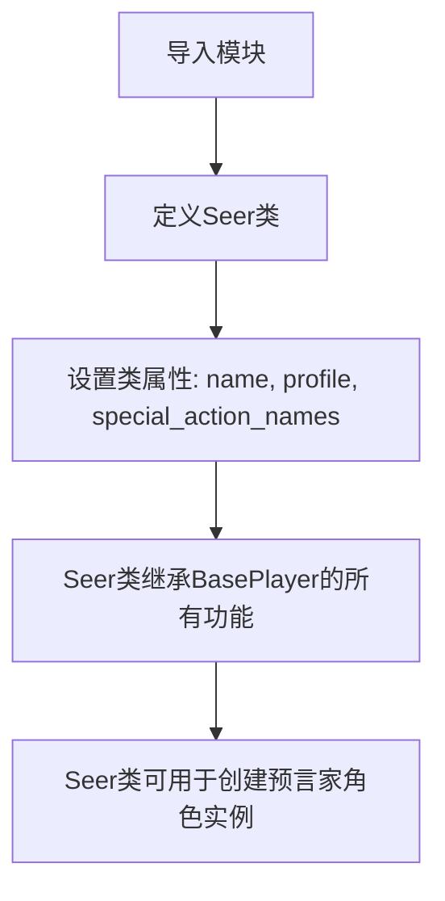

# `.\MetaGPT\metagpt\ext\werewolf\roles\seer.py` 详细设计文档

该代码定义了一个名为 `Seer` 的预言家角色类，它继承自狼人杀游戏中的基础玩家类 `BasePlayer`，并设置了预言家特有的角色名称、描述和特殊行动（查验）。

## 整体流程



## 类结构

```
BasePlayer (基础玩家类)
└── Seer (预言家角色类)
```

## 全局变量及字段


### `Seer.name`
    
预言家角色的名称，固定为角色类型枚举中SEER的值。

类型：`str`
    


### `Seer.profile`
    
预言家角色的简介或描述，固定为角色类型枚举中SEER的值。

类型：`str`
    


### `Seer.special_action_names`
    
预言家角色特有的行动名称列表，当前包含'Verify'（查验）行动。

类型：`list[str]`
    
    

## 全局函数及方法


## 关键组件


### BasePlayer

作为所有玩家角色的基类，定义了角色的基本属性和行为框架。

### Seer

继承自BasePlayer，代表预言家角色，拥有特殊的“查验”行动能力。

### RoleType

一个枚举类，用于定义和区分游戏中的不同角色类型，如预言家(SEER)。

### special_action_names

一个类字段，用于定义特定角色（如预言家）所拥有的特殊行动名称列表。


## 问题及建议


### 已知问题

-   **硬编码的类属性**：`name` 和 `profile` 字段的值直接硬编码为 `RoleType.SEER.value`。这虽然确保了与角色类型枚举的一致性，但降低了代码的灵活性。如果未来需要基于同一个 `RoleType` 创建具有不同 `name` 或 `profile` 的变体角色，或者需要动态设置这些属性，当前的实现将难以扩展。
-   **潜在的继承设计问题**：`Seer` 类继承自 `BasePlayer`。如果 `BasePlayer` 的构造函数或初始化逻辑在未来发生变更，`Seer` 类可能会在不经意间受到影响。目前 `Seer` 类没有显式地定义自己的 `__init__` 方法，这依赖于父类的行为，可能隐藏了初始化顺序或字段设置的潜在风险。
-   **魔法字符串的使用**：`special_action_names` 列表中的字符串 `"Verify"` 是一个魔法字符串。在代码的其他部分（如处理特殊行动的逻辑中）如果也需要引用这个动作名称，就需要重复书写相同的字符串，这容易导致拼写错误和不一致，增加了维护成本。

### 优化建议

-   **将常量提取为类属性或模块级常量**：建议将 `"Verify"` 这样的魔法字符串提取为类属性（如 `VERIFY_ACTION = "Verify"`）或模块级常量。这样，当动作名称需要修改时，只需在一个地方更改，并且能通过常量名提高代码的可读性和避免拼写错误。
-   **考虑使用更灵活的属性初始化策略**：虽然当前硬编码 `name` 和 `profile` 简单直接，但可以考虑在 `__init__` 方法中接收参数来设置这些属性，或者在类级别提供一个工厂方法，以支持更动态的角色创建。这能提升代码在面对需求变化时的适应性。
-   **明确初始化流程**：如果 `BasePlayer` 的初始化逻辑复杂或可能变化，考虑在 `Seer` 类中显式定义 `__init__` 方法，并调用 `super().__init__()`，同时可以清晰地注释或处理 `Seer` 特有的初始化需求。这能增强代码的健壮性和可读性。
-   **审视继承关系的必要性**：评估 `Seer` 与 `BasePlayer` 的继承关系是否是最佳设计。如果所有玩家角色共享大量共同行为和状态，继承是合适的。但如果未来角色差异很大，或者需要支持多重行为组合，可能需要考虑使用组合模式（如角色组件）来代替深层次的继承，以降低耦合度。


## 其它


### 设计目标与约束

1. **设计目标**：
   - 实现预言家（Seer）角色在狼人杀游戏中的核心能力：每晚可以查验一名玩家的身份。
   - 继承并复用 `BasePlayer` 类的通用玩家行为（如发言、投票）和状态管理。
   - 保持角色定义的简洁性，通过配置（如 `special_action_names`）声明其特殊能力，便于扩展和维护。

2. **设计约束**：
   - 必须继承自 `BasePlayer` 类，遵循其定义的接口和行为规范。
   - 角色名称（`name`）和个人资料（`profile`）必须与 `RoleType.SEER` 枚举值严格一致，以确保游戏逻辑能正确识别该角色。
   - `special_action_names` 列表定义了该角色的特殊行动，其具体实现逻辑依赖于 `BasePlayer` 或游戏环境（`Environment`）的调度机制。

### 错误处理与异常设计

1. **输入验证**：
   - 在游戏运行过程中，如果预言家角色尝试执行非 `special_action_names` 中定义的特殊行动，应由基类或游戏环境层进行拦截并抛出 `ActionNotAllowedError` 或类似异常。
   - 在角色初始化时，如果 `RoleType.SEER` 枚举值不存在或类型不匹配，Python 运行时将抛出 `AttributeError` 或 `ValueError`。

2. **运行时错误**：
   - 如果游戏环境未能正确解析 `special_action_names` 并为其绑定对应的行动方法，可能导致预言家角色在夜间无法执行“查验”行动。这属于集成错误，需确保游戏引擎的 action 映射机制正确。
   - 继承自 `BasePlayer` 的通用方法（如 `_think`, `_act`）可能抛出与网络通信、状态同步相关的异常，本类不直接处理，依赖上层框架的统一错误处理。

3. **异常处理策略**：
   - 本类作为数据/配置定义类，不包含主动的错误处理逻辑。所有异常应向上层（游戏回合引擎、环境）传递，由上层决定如何记录日志、通知玩家或重置游戏状态。

### 数据流与状态机

1. **角色状态**：
   - 预言家实例的生命周期状态（如“存活”、“死亡”、“已发言”）由基类 `BasePlayer` 管理。
   - 其特殊能力“查验”的结果（即得知某玩家是好人或狼人）应作为游戏状态的一部分，存储在游戏环境或游戏上下文中，而非直接存储在本角色对象内，以避免信息泄露给其他角色。

2. **行动数据流**：
   - **触发**：在游戏“夜晚”阶段，由游戏环境调用预言家角色的 `take_action` 或类似方法。
   - **输入**：环境提供当前存活玩家列表作为可选目标。
   - **决策**：预言家角色内部的 AI 或玩家输入决定查验目标（假设通过 `_think` 方法实现）。
   - **输出**：角色向环境提交一个“Verify”行动，包含目标玩家 ID。
   - **环境处理**：游戏环境接收行动，执行核心游戏逻辑（判定目标真实身份），并将结果仅反馈给预言家角色（可能通过修改环境状态或发送私有消息）。

3. **状态转移**：
   - 预言家角色的“已使用能力”状态可能由环境维护。在标准规则下，预言家每晚只能查验一人，环境需记录并限制其每夜行动次数。

### 外部依赖与接口契约

1. **继承依赖**：
   - **`BasePlayer`**：强依赖。本类继承了其所有字段、方法和行为契约。任何对 `BasePlayer` 接口的破坏性更改都会影响本类。

2. **枚举依赖**：
   - **`metagpt.environment.werewolf.const.RoleType`**：强依赖。用于定义 `name` 和 `profile` 字段的值。必须确保 `RoleType.SEER` 存在。

3. **框架/环境契约**：
   - **特殊行动声明**：`special_action_names` 列表是一个声明式接口。游戏引擎必须能够识别列表中的字符串（如 `"Verify"`），并将其与具体的游戏逻辑函数绑定。这是本类与游戏运行时之间的关键契约。
   - **角色识别**：游戏环境通过 `name` 或 `profile` 字段识别预言家角色，并将其与其他角色区别对待，尤其是在安排夜间行动顺序时。

4. **假设**：
   - 假设 `BasePlayer` 类提供了 `special_action_names` 字段的定义，并且游戏引擎会使用它。
   - 假设游戏环境能够正确处理 `"Verify"` 行动，并实现其背后的身份查验逻辑。

    