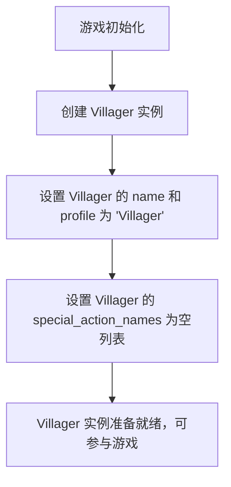

# `.\MetaGPT\metagpt\ext\werewolf\roles\villager.py` 详细设计文档

该代码定义了一个名为 Villager（村民）的类，它是狼人杀游戏中的一个具体角色。Villager 继承自 BasePlayer，代表游戏中没有任何特殊能力的普通村民角色。

## 整体流程



## 类结构

```
BasePlayer (基础玩家类)
└── Villager (村民角色类)
```

## 全局变量及字段


### `Villager.name`
    
村民角色的名称，固定为角色类型枚举中'VILLAGER'的值。

类型：`str`
    


### `Villager.profile`
    
村民角色的简介或描述，固定为角色类型枚举中'VILLAGER'的值。

类型：`str`
    


### `Villager.special_action_names`
    
村民角色可执行的特殊行动名称列表，初始化为空列表，表示村民没有特殊行动能力。

类型：`list[str]`
    
    

## 全局函数及方法


## 关键组件


### BasePlayer

作为所有玩家角色的基类，定义了角色的基本属性和行为框架。

### Villager

继承自BasePlayer，代表游戏中的村民角色，拥有特定的名称和身份描述，但没有特殊行动能力。

### RoleType

一个枚举类，用于定义和管理游戏中所有可能的角色类型及其对应的字符串值。


## 问题及建议


### 已知问题

-   **类定义过于简单，缺乏角色特有逻辑**：`Villager` 类目前仅继承了 `BasePlayer` 并设置了几个基本属性，没有实现任何村民角色特有的行为或决策逻辑。这可能导致游戏运行时村民角色行为与其他有特殊能力的角色（如狼人、预言家）不一致或过于被动。
-   **硬编码的配置值**：`name` 和 `profile` 字段直接硬编码为 `RoleType.VILLAGER.value`。虽然这确保了与枚举值的一致性，但如果未来需要动态生成或本地化角色名称和描述，这种硬编码方式会缺乏灵活性。
-   **空操作列表可能引发误解**：`special_action_names` 被初始化为空列表，明确表示村民没有特殊行动。然而，如果游戏系统期望通过检查此列表来驱动角色回合，空列表是合适的。但若系统设计是通过方法覆盖（如 `_think` 或 `take_action`）来实现行为，那么这个字段可能未被使用，成为冗余设计。

### 优化建议

-   **实现角色特有行为**：应在 `Villager` 类中覆盖父类（如 `BasePlayer`）的关键方法，例如 `_think`（思考发言或投票逻辑）或一个特定的行动方法。即使村民没有夜间特殊行动，也应实现其白天的讨论和投票逻辑，使其成为一个有意义的、活跃的游戏参与者，而不是一个“空壳”角色。
-   **考虑配置化或继承优化**：将 `name` 和 `profile` 的默认值设置逻辑移至父类 `BasePlayer` 的构造函数或类变量中，通过 `RoleType` 来自动初始化，这样可以减少子类中的重复代码。或者，设计一个角色工厂或配置类来集中管理这些属性，提高可维护性。
-   **明确字段用途或移除冗余**：审查游戏引擎如何使用 `special_action_names`。如果该字段确实用于驱动有特殊能力角色的行动选择，那么对于村民，保持空列表是合理的，但应在文档中明确其用途。如果游戏逻辑不依赖此字段，而是通过多态方法调用，则可以考虑移除该字段，以简化设计。
-   **添加文档字符串**：为 `Villager` 类添加详细的文档字符串，说明其设计意图（例如，“代表狼人杀游戏中的村民角色，无特殊夜间能力，主要参与白天讨论和投票”），这有助于其他开发者理解其存在意义和预期行为。


## 其它


### 设计目标与约束

该代码的设计目标是创建一个代表“村民”角色的类，作为狼人杀游戏中的一个基础玩家类型。主要约束包括：
1. 继承自 `BasePlayer` 类，复用其基础玩家属性和行为。
2. 严格遵循 `RoleType` 枚举中定义的 `VILLAGER` 角色标识。
3. 村民角色不具备任何特殊行动能力，因此 `special_action_names` 列表为空。
4. 保持代码简洁，仅定义角色特有的静态属性，不包含额外逻辑。

### 错误处理与异常设计

当前代码结构简单，未显式定义错误处理逻辑。潜在的异常处理依赖于父类 `BasePlayer` 或框架的其他部分。例如：
1. 如果 `RoleType.VILLAGER.value` 不存在，在类定义加载时会引发 `AttributeError`。
2. 对 `Villager` 实例的操作（如调用方法）可能引发父类或框架中定义的异常。
3. 建议在更广泛的游戏流程或角色工厂中，增加对角色类型值有效性的校验。

### 数据流与状态机

`Villager` 类本身是静态的、无状态的。其数据流和状态管理完全集成在父类 `BasePlayer` 及更上层的游戏环境（`Environment`）中：
1. **数据流入**：游戏环境或裁判角色将游戏状态（如白天/黑夜、存活玩家列表、投票信息）传递给 `BasePlayer` 的决策方法。
2. **内部状态**：`BasePlayer` 可能维护着玩家的存活状态、记忆等信息。
3. **数据流出**：`Villager` 实例通过继承自 `BasePlayer` 的 `act` 或 `vote` 等方法，输出其行动决策（如发言内容、投票对象），这些决策被提交到游戏环境进行处理。
4. **状态机**：村民角色的生命周期（如“存活”、“死亡”、“游戏结束”）由游戏引擎的状态机管理，`Villager` 类不直接控制。

### 外部依赖与接口契约

1. **外部依赖**：
    * `metagpt.environment.werewolf.const.RoleType`：用于获取角色类型的标准枚举值，确保角色标识的一致性。
    * `metagpt.ext.werewolf.roles.base_player.BasePlayer`：作为基类，提供了玩家角色的基础结构、属性和方法契约。
2. **接口契约**：
    * 作为 `BasePlayer` 的子类，`Villager` 隐式遵守了 `BasePlayer` 定义的公共接口（如 `name`, `profile`, `special_action_names` 字段，以及 `act`, `vote` 等方法）。
    * `special_action_names` 被明确设置为空列表，这向游戏引擎表明此角色在夜间没有特殊行动阶段，符合村民角色的游戏规则契约。

    