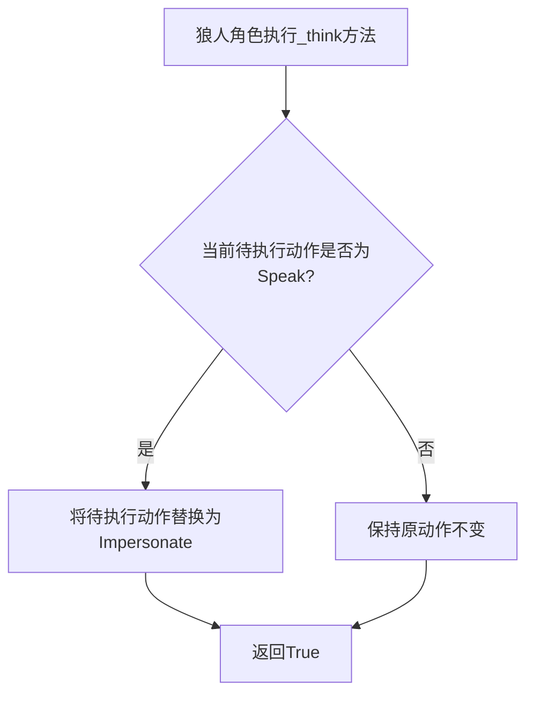
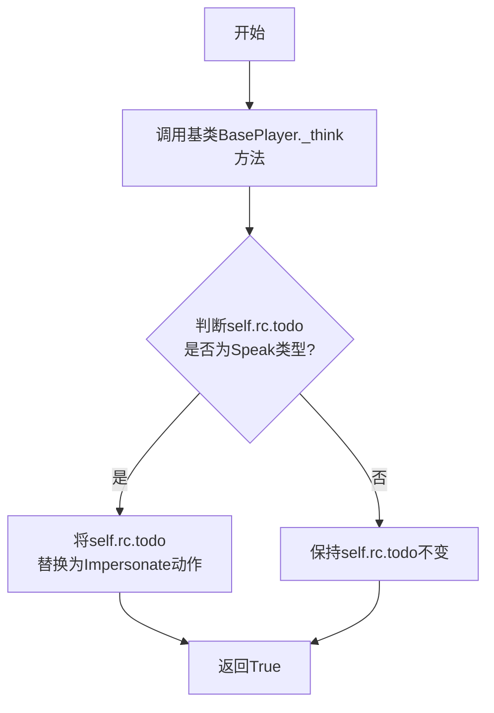

# `.\MetaGPT\metagpt\ext\werewolf\roles\werewolf.py` 详细设计文档

该代码定义了一个狼人（Werewolf）角色类，继承自基础玩家类（BasePlayer）。狼人角色在白天发言阶段拥有特殊行为：它会将原本的发言（Speak）动作替换为伪装（Impersonate）动作，以实现与其他角色不同的发言策略。

## 整体流程



## 类结构

```
BasePlayer (基础玩家类)
└── Werewolf (狼人角色类)
```

## 全局变量及字段


### `Werewolf.name`
    
角色的名称，固定为狼人（RoleType.WEREWOLF.value）。

类型：`str`
    


### `Werewolf.profile`
    
角色的简介或描述，固定为狼人（RoleType.WEREWOLF.value）。

类型：`str`
    


### `Werewolf.special_action_names`
    
该角色特有的行动名称列表，此处包含'猎杀'（Hunt）行动。

类型：`list[str]`
    
    

## 全局函数及方法


### `Werewolf._think`

该方法重写了基类 `BasePlayer` 的 `_think` 方法，用于在狼人角色执行“思考”逻辑时，根据当前待执行动作（`self.rc.todo`）的类型进行特殊处理。具体来说，当狼人白天需要发言（`Speak` 动作）时，它会将待执行动作替换为“伪装”（`Impersonate` 动作），以实现狼人在白天发言时的伪装行为。

参数：

-  `self`：`Werewolf`，当前狼人角色实例的引用。

返回值：`bool`，返回 `True`，表示思考过程执行成功。

#### 流程图



#### 带注释源码

```python
async def _think(self):
    """狼人白天发言时需要伪装，与其他角色不同，因此需要重写_think"""
    # 1. 首先调用基类(BasePlayer)的_think方法，执行通用的思考逻辑
    await super()._think()

    # 2. 检查当前待执行的动作(self.rc.todo)是否是“发言”(Speak)动作
    if isinstance(self.rc.todo, Speak):
        # 3. 如果是，则将待执行动作替换为“伪装”(Impersonate)动作。
        #    这是狼人角色的特殊行为：在白天发言时，需要伪装自己的身份。
        self.rc.todo = Impersonate()

    # 4. 返回True，表示思考过程完成
    return True
```


## 关键组件


### BasePlayer 基类

定义了狼人杀游戏中所有玩家角色的基础行为和属性，包括行动选择、发言、状态管理等通用功能。

### RoleType 枚举

定义了狼人杀游戏中所有角色类型的常量，用于标识和区分不同角色的身份（如狼人、村民等）。

### Impersonate 行动类

代表“伪装”这一特殊行动，狼人角色在白天发言阶段使用此行动来隐藏自己的真实身份。

### Speak 行动类

代表“发言”这一基础行动，是所有玩家在发言阶段执行的标准行为。

### Hunt 行动

狼人角色的特殊行动名称，代表“猎杀”行为，是狼人夜间行动的核心。

### _think 方法重写

狼人角色特有的思考逻辑，在白天发言阶段自动将标准的“发言”行动替换为“伪装”行动，以实现角色特有的行为策略。


## 问题及建议


### 已知问题

-   **硬编码的特殊行为名称**：`special_action_names` 字段被硬编码为 `["Hunt"]`。这限制了代码的灵活性，如果未来需要为狼人角色添加或修改特殊行动，必须直接修改类定义，违反了开闭原则。
-   **潜在的流程控制风险**：在 `_think` 方法中，通过检查 `self.rc.todo` 是否为 `Speak` 实例来将其替换为 `Impersonate`。这种基于类型判断的流程控制可能不够健壮，如果 `Speak` 类的行为或实例化方式发生变化，或者存在其他需要伪装发言的场景未被覆盖，可能导致逻辑错误。
-   **继承与重写的耦合**：`Werewolf._think` 方法首先调用 `super()._think()`，然后修改 `self.rc.todo`。这依赖于父类 `BasePlayer._think` 的具体实现（例如，它设置了 `self.rc.todo`）。如果父类的逻辑发生重大变化，子类的行为可能会被破坏，增加了维护的复杂性。

### 优化建议

-   **将特殊行为配置化**：建议将 `special_action_names` 等角色特定属性移至配置文件或通过类构造参数传入。例如，可以在 `__init__` 方法中接受一个 `special_actions` 参数，或者从外部配置源（如YAML/JSON文件）加载。这样可以在不修改代码的情况下调整角色能力。
-   **引入更明确的角色状态或意图机制**：与其在 `_think` 方法中通过类型判断来改变行动，不如在角色状态机中引入一个明确的“需要伪装”的状态或意图标志。`_think` 方法可以根据这个状态来决定设置 `Impersonate` 还是其他行动，使逻辑更清晰、更易于测试和扩展。
-   **考虑使用策略模式或模板方法模式**：对于“在发言前需要执行特定操作（伪装）”这一行为，可以定义一个更清晰的钩子方法（Hook Method）。例如，在父类 `BasePlayer` 的发言流程中，调用一个如 `before_speak` 的受保护方法。`Werewolf` 类只需重写此方法来设置伪装行动，从而减少对父类内部流程的直接依赖和操作，降低耦合度。
-   **增强类型注解与文档**：为 `special_action_names` 字段和 `_think` 方法添加更详细的类型注解和文档字符串，说明其用途、与父类的交互方式以及可能的状态变迁，有助于提高代码的可读性和可维护性。


## 其它


### 设计目标与约束

该代码的设计目标是实现狼人杀游戏中狼人角色的特殊行为逻辑。狼人角色在白天发言阶段需要伪装成其他角色，而不是直接表达真实意图。因此，代码的核心约束是：在狼人角色的思考流程中，当即将执行的行为是`Speak`（发言）时，必须将其替换为`Impersonate`（伪装）行为。这要求代码必须继承自基础玩家类`BasePlayer`，并重写其思考方法`_think`，以确保在正确的时机进行行为替换，同时不影响角色继承的其他通用逻辑（如行动选择、状态更新等）。

### 错误处理与异常设计

当前代码片段中未显式包含错误处理或异常捕获逻辑。其潜在的异常风险包括：
1.  **属性访问异常**：在`_think`方法中访问`self.rc.todo`时，如果`self.rc`为`None`或其`todo`属性未正确初始化，可能引发`AttributeError`。
2.  **类型判断异常**：使用`isinstance(self.rc.todo, Speak)`进行类型判断时，如果`self.rc.todo`不是预期的类型或为`None`，`isinstance`会返回`False`，流程会正常继续，但若后续代码依赖`self.rc.todo`为特定类型，则可能出错。
3.  **异步操作异常**：`_think`方法被定义为`async`，但其中调用的`super()._think()`可能包含异步I/O操作，这些操作可能因网络、资源等问题抛出异常，当前代码未进行捕获和处理。

**建议的异常处理策略**：在方法内部添加`try-except`块来捕获可能的`AttributeError`或来自父类方法的异常，并根据游戏逻辑进行适当的处理，例如记录日志、设置默认行为或重新抛出异常以供上层处理。

### 数据流与状态机

1.  **数据流**：
    *   **输入**：角色的内部状态（通过`self.rc`访问，其中包含当前待执行动作`todo`、环境信息、历史消息等）。
    *   **处理**：在`_think`方法中，首先调用父类的`_think`方法处理通用逻辑。随后，检查`self.rc.todo`的动作类型。如果是`Speak`类型，则将其替换为`Impersonate`类型的一个新实例。
    *   **输出**：修改后的`self.rc.todo`（可能已从`Speak`变为`Impersonate`）。这个修改后的动作将在后续的执行阶段被调用。

2.  **状态机（角色行为状态）**：
    *   **状态**：角色的行为由`self.rc.todo`决定。`Werewolf`类引入了一个状态转换规则。
    *   **转换**：当角色处于“待发言”（`todo`是`Speak`实例）状态时，`_think`方法会触发一个状态转换，将“待发言”状态转换为“待伪装发言”（`todo`是`Impersonate`实例）状态。
    *   **触发条件**：该转换在狼人角色每次进行思考（`_think`）时被检查，但仅当`todo`是`Speak`类型时才实际发生转换。

### 外部依赖与接口契约

1.  **外部依赖**：
    *   `metagpt.environment.werewolf.const.RoleType`：用于获取狼人角色的名称常量。
    *   `metagpt.ext.werewolf.actions.Impersonate`：伪装行为的动作类。
    *   `metagpt.ext.werewolf.actions.Speak`：发言行为的动作类。
    *   `metagpt.ext.werewolf.roles.base_player.BasePlayer`：所有玩家角色的基类，提供了`_think`等方法的基本实现和角色运行上下文(`rc`)等基础设施。

2.  **接口契约**：
    *   **与父类的契约**：`Werewolf`类继承自`BasePlayer`，因此必须满足`BasePlayer`定义的接口。它重写了`_think`方法，但首先调用了`super()._think()`，这表明它承诺在扩展功能时，不破坏父类`_think`方法的核心职责。同时，它依赖于父类提供的`self.rc`属性。
    *   **与动作类的契约**：代码假设`Impersonate`和`Speak`类具有兼容的接口，因为`self.rc.todo`被直接替换。这意味着`Impersonate`实例必须能够被`self.rc`后续的`act`或类似机制正确执行，且其执行结果应能融入游戏流程。
    *   **与角色类型枚举的契约**：`name`和`profile`字段被设置为`RoleType.WEREWOLF.value`，这依赖于该枚举值是一个字符串，并且游戏系统的其他部分（如UI、日志、角色工厂）能正确识别和使用这个字符串来标识狼人角色。


    