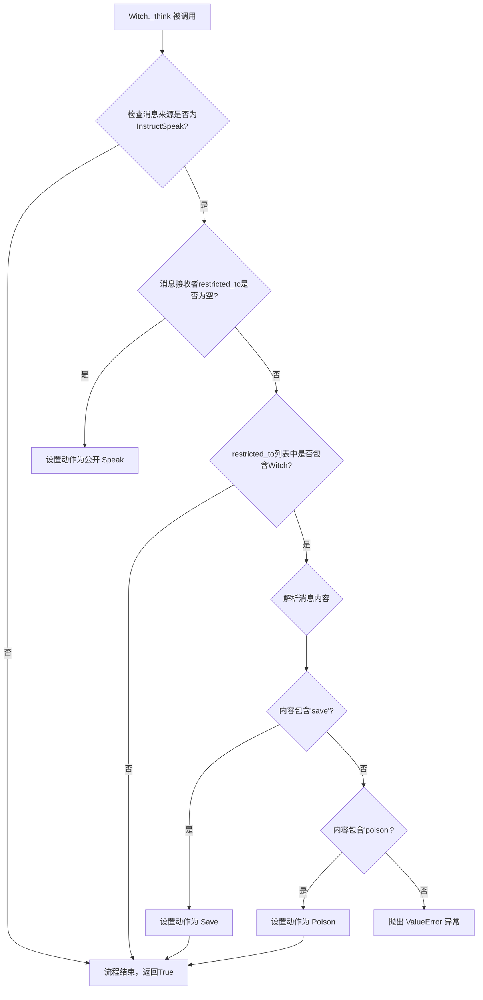
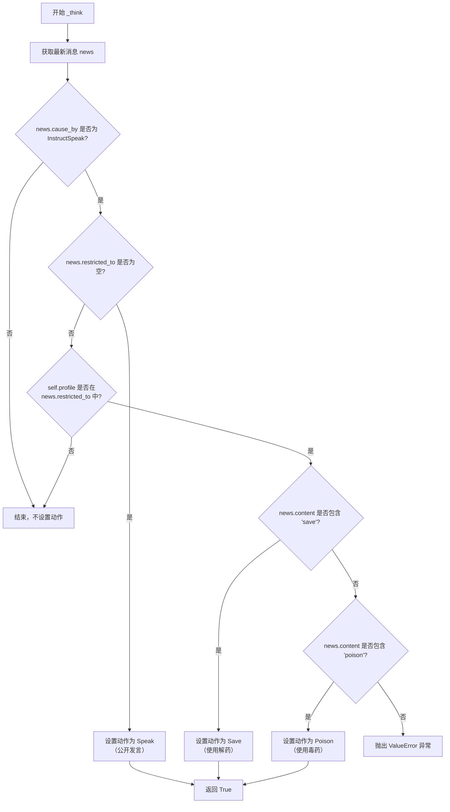

# `.\MetaGPT\metagpt\ext\werewolf\roles\witch.py` 详细设计文档

该文件定义了狼人杀游戏中的女巫角色类（Witch），继承自基础玩家类（BasePlayer）。女巫拥有两个特殊技能（救人和毒人），该类通过重写_think方法，根据游戏主持人（Moderator）发送的加密指令（包含'save'或'poison'关键词）来路由并设置对应的特殊动作（Save或Poison），以响应夜间行动阶段。对于公开消息，则执行普通发言动作（Speak）。

## 整体流程



## 类结构

```
BasePlayer (基础玩家类)
└── Witch (女巫角色类)
```

## 全局变量及字段


### `Witch.name`
    
角色的名称，固定为女巫（Witch）。

类型：`str`
    


### `Witch.profile`
    
角色的身份描述，固定为女巫（Witch）。

类型：`str`
    


### `Witch.special_action_names`
    
女巫角色拥有的特殊技能名称列表，包含‘Save’（救人）和‘Poison’（毒人）。

类型：`list[str]`
    
    

## 全局函数及方法


### `Witch._think`

该方法负责处理女巫角色的决策逻辑。根据接收到的消息类型和内容，决定女巫当前应该执行的动作：公开发言、使用解药救人、或使用毒药杀人。它是女巫角色特殊技能（救人和毒人）的路由器。

参数：

-  `self`：`Witch`，`Witch` 类的实例，代表当前的女巫角色。

返回值：`bool`，固定返回 `True`，表示思考过程已成功完成。

#### 流程图



#### 带注释源码

```python
async def _think(self):
    """女巫涉及两个特殊技能，因此在此需要改写_think进行路由"""
    # 1. 从角色的记忆（rc.news）中获取最新的消息
    news = self.rc.news[0]
    # 2. 断言：确保该消息是由 Moderator 的 InstructSpeak 动作发出的指令
    assert news.cause_by == any_to_str(InstructSpeak)  # 消息为来自Moderator的指令时，才去做动作
    
    # 3. 判断消息的接收范围，以决定执行何种动作
    if not news.restricted_to:
        # 情况A: 消息接收范围为全体角色 -> 执行公开发言动作（包括发表投票观点）
        self.rc.todo = Speak()
    elif self.profile in news.restricted_to:
        # 情况B: 消息是 Moderator 单独发给女巫的 -> 执行特殊技能
        # FIXME: hard code to split, restricted为"Moderator"或"Moderator,角色profile"
        # Moderator加密发给自己的，意味着要执行角色的特殊动作
        # 这里用关键词进行动作的选择，需要Moderator侧的指令进行配合
        if "save" in news.content.lower():
            # 3B-1: 如果指令内容包含‘save’关键词 -> 执行救人动作
            self.rc.todo = Save()
        elif "poison" in news.content.lower():
            # 3B-2: 如果指令内容包含‘poison’关键词 -> 执行毒人动作
            self.rc.todo = Poison()
        else:
            # 3B-3: 指令内容不包含预期关键词 -> 抛出异常
            raise ValueError("Moderator's instructions must include save or poison keyword")
    # 4. 方法执行成功，返回 True
    return True
```


## 关键组件


### 角色基类继承与扩展

Witch 类继承自 BasePlayer，复用基础玩家角色的通用属性和行为（如消息接收、行动执行循环），并在此基础上通过重写 `_think` 方法，实现了女巫特有的技能决策逻辑。

### 基于消息内容的路由决策

在 `_think` 方法中，通过解析 `news` 消息对象的 `restricted_to` 字段和 `content` 内容，来决定女巫当前应采取的行动（公开发言 `Speak`、使用解药 `Save` 或使用毒药 `Poison`），实现了从统一指令到具体技能动作的路由。

### 特殊技能动作封装

将女巫的两个特殊技能封装为独立的动作类 `Save` 和 `Poison`。这些动作类（继承自更基础的 Action 类）负责封装技能执行的具体逻辑，使得技能实现与角色的决策逻辑解耦，便于独立维护和扩展。

### 指令关键词驱动

女巫的技能触发依赖于 Moderator（游戏主持人）发送的指令消息中包含特定的关键词（如 "save" 或 "poison"）。这种设计将技能使用的时机和对象控制权交给了游戏逻辑核心（Moderator），角色仅负责响应和执行。

### 硬编码的字符串处理

当前实现中存在硬编码的字符串分割逻辑（`FIXME` 注释处）和对消息内容进行小写关键词匹配的逻辑。这构成了潜在的技术债务，对指令格式的变更缺乏灵活性，且容易因拼写错误等问题导致功能失效。


## 问题及建议


### 已知问题

-   **硬编码逻辑**：`_think` 方法中通过字符串 `"save"` 和 ``"poison"`` 来匹配指令，这导致指令格式与角色逻辑紧密耦合，缺乏灵活性。如果指令关键词变更，需要同时修改 Moderator 和 Witch 的代码。
-   **脆弱的字符串解析**：代码注释提到 `restricted_to` 字段的格式为 `"Moderator"` 或 `"Moderator,角色profile"`，并在 `self.profile in news.restricted_to` 中进行判断。这种基于字符串包含关系的判断方式容易出错，例如当角色名是另一个角色名的子串时。
-   **异常处理不完善**：当指令不包含 `"save"` 或 `"poison"` 关键词时，直接抛出 `ValueError`。这虽然能阻止错误操作，但可能中断游戏流程，且未提供足够的上层恢复或日志信息。
-   **职责边界模糊**：`Witch` 类直接解析来自 `Moderator` 的指令内容，并将指令关键词映射到具体动作。这模糊了角色（执行者）与游戏控制器（指令发布者）之间的职责边界，使得 `Witch` 类需要了解指令的语义细节。

### 优化建议

-   **定义明确的指令协议**：建议在 `Moderator` 和 `Witch` 等角色之间建立一个明确的指令协议或枚举。例如，可以定义一个 `WitchCommand` 枚举（`SAVE`, `POISON`），`Moderator` 发送指令时指定命令类型和必要参数，`Witch` 根据命令类型而非字符串内容来路由动作。这能解耦双方实现。
-   **使用结构化消息**：将 `news.restricted_to` 设计为列表等结构化数据，而非逗号分隔的字符串，并使用精确匹配（如 `self.profile in news.restricted_to`）来判断接收者，避免子串匹配带来的问题。
-   **增强异常处理与日志**：在抛出异常前，可以记录更详细的错误信息（如无效的指令内容）。或者，考虑设计更健壮的错误处理机制，例如返回一个特定的错误动作或状态，由上层（如 `Moderator`）统一处理非法指令，保证游戏主循环的稳定性。
-   **重构动作选择逻辑**：考虑将动作选择逻辑进一步抽象。例如，可以将 `special_action_names` 与一个映射字典（`指令关键词 -> 动作类`）结合，使 `_think` 方法通过查询映射来决定 `self.rc.todo`，提高可配置性和可扩展性。这样，新增或修改特殊动作时，只需更新配置，而无需修改 `_think` 方法的核心逻辑。


## 其它


### 设计目标与约束

本模块的设计目标是实现狼人杀游戏中的“女巫”角色。该角色继承自基础玩家类，具备公开发言和两个特殊技能（救人、毒人）的能力。核心约束包括：1) 必须响应游戏主持人的加密指令来执行特殊技能；2) 公开信息需进行公开发言；3) 技能执行逻辑依赖于主持人指令中的特定关键词（"save"或"poison"）；4) 需与游戏环境中的其他角色（如Moderator）和动作（InstructSpeak, Speak, Save, Poison）协同工作。

### 错误处理与异常设计

当前代码的错误处理机制较为基础，主要体现在`_think`方法中：
1.  **输入验证**：通过`assert`语句确保触发思考的消息是由`InstructSpeak`动作发出的。如果断言失败，程序将抛出`AssertionError`，这通常意味着游戏状态或消息流出现了意外情况。
2.  **指令解析**：在解析主持人加密指令时，通过检查消息内容是否包含"save"或"poison"关键词来决定执行哪个技能。如果两个关键词均未找到，则抛出`ValueError`异常，表明收到了无法识别的指令格式。
3.  **潜在风险**：当前的指令解析逻辑（`if "save" in news.content.lower():`）存在脆弱性。如果指令内容意外包含这些关键词（例如，“I think the last save was suspicious”），可能导致误触发。此外，对`news.restricted_to`字段的解析依赖硬编码的字符串分割逻辑（代码注释中已说明），这是一个已知的设计缺陷，缺乏健壮性。

### 数据流与状态机

1.  **数据流**：
    *   **输入**：`Witch`角色的主要输入是`self.rc.news`列表中的最新消息（`news`对象）。该消息包含`cause_by`（动作发送者）、`restricted_to`（接收者列表）和`content`（内容）等关键字段。
    *   **处理**：在`_think`方法中，根据消息的`cause_by`和`restricted_to`字段判断消息类型（公开指令或加密指令）。对于加密指令，进一步解析`content`字段以确定具体技能。
    *   **输出**：处理结果是将相应的动作对象（`Speak`、`Save`或`Poison`）赋值给`self.rc.todo`属性。后续框架会执行这个`todo`动作，从而产生新的消息（如发言内容或技能效果），并放入环境的消息流中。

2.  **状态机（逻辑流程）**：
    *   **状态**：`Witch`角色的核心状态体现在`self.rc.todo`中，表示它“打算做什么”。
    *   **转移**：
        *   当收到`InstructSpeak`发出的、`restricted_to`为空的**公开消息**时，状态转移为“准备公开发言”（`todo = Speak()`）。
        *   当收到`InstructSpeak`发出的、`restricted_to`包含女巫角色的**加密消息**时，进入指令解析子状态。
            *   若内容含“save”，状态转移为“准备执行救人技能”（`todo = Save()`）。
            *   若内容含“poison”，状态转移为“准备执行毒人技能”（`todo = Poison()`）。
            *   否则，抛出错误，状态转移失败。
    *   该状态机由外部的游戏循环驱动，每次`Witch`角色被激活（`_think`方法被调用）时，根据输入消息决定下一次的状态。

### 外部依赖与接口契约

1.  **外部依赖**：
    *   **父类**：`BasePlayer`（来自`metagpt.ext.werewolf.roles.base_player`），提供了角色运行的基本框架，如`rc`（RoleContext）属性。
    *   **动作类**：`InstructSpeak`、`Speak`、`Save`、`Poison`（来自`metagpt.ext.werewolf.actions`）。`Witch`需要实例化这些类来创建待执行动作。
    *   **工具函数**：`any_to_str`（来自`metagpt.utils.common`），用于将动作类转换为字符串进行比较。
    *   **常量**：`RoleType`（来自`metagpt.environment.werewolf.const`），用于定义角色名称。

2.  **接口契约**：
    *   **与Moderator的契约**：这是最重要的外部契约。`Witch`期望`Moderator`通过`InstructSpeak`动作向其发送指令。
        *   对于**技能指令**，消息的`restricted_to`字段必须包含`Witch.profile`（即"Witch"），并且`content`字段必须明确包含“save”或“poison”小写关键词以指示技能类型。这是当前实现的强约定。
        *   对于**公开发言指令**，消息的`restricted_to`字段应为空或包含全体角色。
    *   **与框架的契约**：`Witch`必须实现`_think`方法，并返回`True`。该方法负责根据`self.rc.news`设置`self.rc.todo`。框架会调用此方法并执行`todo`动作。
    *   **消息格式契约**：依赖于`news`对象具有`cause_by`（str）、`restricted_to`（str或list）、`content`（str）等特定字段。对`restricted_to`的处理逻辑在代码注释中已标明是硬编码的，这是一个脆弱的契约点。

### 潜在的技术债务或优化空间（补充）

1.  **指令解析的脆弱性**：依赖字符串包含（`in`）和硬编码关键词进行指令解析，容易因指令内容复杂化而产生错误或歧义。建议改为使用更结构化的指令协议（如字典、枚举或特定标记）。
2.  **硬编码的字段解析**：代码中提及对`news.restricted_to`的解析是硬编码的字符串分割逻辑。这严重依赖发送方的实现细节，极易因格式变化而失效。应定义一个明确的、共享的消息接收者字段格式（如始终使用列表），并在此处进行安全解析。
3.  **异常处理粒度**：当前的错误处理（`assert`和`ValueError`）在异常发生时可能直接中断角色执行或游戏流程。应考虑更精细的错误处理，例如记录日志、发送错误反馈给Moderator，或提供默认行为（如跳过无效指令），以增强系统的鲁棒性。
4.  **可测试性**：`_think`方法的逻辑紧密依赖于外部消息的格式和内容，使得单元测试需要构建复杂的消息对象。可以考虑将消息解析和路由逻辑抽取为独立的方法，以便于单独测试。
5.  **配置化**：特殊技能名称`special_action_names`目前是硬编码列表。未来如果技能可变或需要从配置加载，此处可扩展为从配置读取。

### 其它项目：角色职责与技能限制

*   **角色职责**：`Witch`角色在狼人杀游戏中的核心职责是：1) 在白天阶段参与讨论并投票（通过`Speak`动作实现观点表达）；2) 在夜间阶段响应主持人的指令，选择使用解药拯救被狼人袭击的玩家（`Save`动作），或使用毒药毒杀一名玩家（`Poison`动作）。通常，解药和毒药各只能使用一次。
*   **技能限制**：当前的代码实现了技能的执行触发机制，但**并未**在角色内部跟踪解药和毒药的使用状态（例如，是否已用过）。这是一个重要的游戏规则缺失。技能的使用限制逻辑很可能由`Moderator`在发送指令前进行判断，或者由`Save`/`Poison`动作本身在执行时检查游戏全局状态。如果规则要求由角色自身管理技能次数，那么需要在`Witch`类中添加状态字段（如`antidote_used: bool = False`, `poison_used: bool = False`）并在`_think`或动作执行前后更新它们。

    