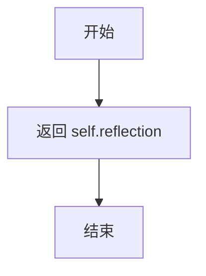

# `.\MetaGPT\metagpt\ext\werewolf\schema.py` 详细设计文档

该代码定义了两个与狼人杀游戏相关的数据模型：RoleExperience 用于存储角色（玩家）在游戏中的经验、反思和指令等信息，并支持基于反思内容进行检索；WwMessage 继承自通用的 Message 类，增加了 restricted_to 字段，用于指定消息的可见范围（即哪些角色可以接收此消息），并通过验证器确保该字段始终为字符串集合。

## 整体流程

```mermaid
graph TD
    A[开始] --> B{创建或处理 WwMessage}
    B --> C[初始化 restricted_to 字段]
    C --> D{restricted_to 是否为有效输入?}
    D -- 是（集合、列表、字符串等） --> E[调用 any_to_str_set 转换]
    D -- 否（None 或空） --> F[设置为空集合 set()]
    E --> G[返回字符串集合]
    F --> G
    G --> H[完成 WwMessage 对象构建]
    I[开始] --> J{处理 RoleExperience}
    J --> K[构建 RoleExperience 对象]
    K --> L[调用 rag_key 方法]
    L --> M[返回 self.reflection 作为检索键]
```

## 类结构

```
BaseModel (Pydantic 基类)
├── RoleExperience
Message (metagpt.schema)
└── WwMessage
```

## 全局变量及字段


### `RoleExperience.id`
    
角色的唯一标识符，默认为空字符串

类型：`str`
    


### `RoleExperience.name`
    
角色的名称，默认为空字符串

类型：`str`
    


### `RoleExperience.profile`
    
角色的背景描述或档案信息

类型：`str`
    


### `RoleExperience.reflection`
    
角色的反思或总结内容，用于RAG检索

类型：`str`
    


### `RoleExperience.instruction`
    
给角色的指令或任务描述，默认为空字符串

类型：`str`
    


### `RoleExperience.response`
    
角色对指令的回应内容

类型：`str`
    


### `RoleExperience.outcome`
    
指令执行的结果或影响，默认为空字符串

类型：`str`
    


### `RoleExperience.round_id`
    
关联的游戏回合标识符，默认为空字符串

类型：`str`
    


### `RoleExperience.game_setup`
    
游戏设置或环境描述，默认为空字符串

类型：`str`
    


### `RoleExperience.version`
    
数据模型的版本标识，默认为空字符串

类型：`str`
    


### `WwMessage.restricted_to`
    
狼人杀消息的可见范围，即允许接收此消息的角色集合

类型：`set[str]`
    
    

## 全局函数及方法


### `RoleExperience.rag_key`

该方法用于生成角色经验的检索键，主要用于搜索功能。它返回`reflection`字段的值作为唯一标识。

参数：无

返回值：`str`，返回`self.reflection`字段的值，作为该角色经验的检索键。

#### 流程图



#### 带注释源码

```python
def rag_key(self) -> str:
    """For search"""
    return self.reflection
```


### `WwMessage.check_restricted_to`

这是一个用于验证和转换 `WwMessage` 类中 `restricted_to` 字段的类方法。它作为 Pydantic 的 `field_validator` 使用，确保无论输入的数据类型如何（例如列表、元组、字符串或集合），最终都能被统一转换为一个字符串集合（`set[str]`）。如果输入为空或 `None`，则返回一个空集合。

参数：

-  `restricted_to`：`Any`，需要被验证和转换的原始 `restricted_to` 字段值。它可以是任何类型，如 `list`、`tuple`、`str` 或 `set`。

返回值：`set[str]`，一个标准化的字符串集合。如果输入为空或 `None`，则返回空集合 `set()`。

#### 流程图

```mermaid
flowchart TD
    A[开始: 输入参数 restricted_to] --> B{restricted_to 是否为真值?};
    B -- 是 --> C[调用 any_to_str_set<br/>处理原始值];
    B -- 否 --> D[返回空集合 set()];
    C --> E[返回转换后的字符串集合];
    D --> F[结束: 返回结果];
    E --> F;
```

#### 带注释源码

```python
@field_validator("restricted_to", mode="before")  # 这是一个Pydantic字段验证器，作用于'restricted_to'字段，在字段赋值前（'before'模式）执行。
@classmethod  # 声明这是一个类方法，第一个参数是类本身（cls）。
def check_restricted_to(cls, restricted_to: Any):
    # 核心逻辑：如果restricted_to为真值（非空、非None），则将其传递给any_to_str_set函数进行转换；
    # 否则，直接返回一个空集合。
    return any_to_str_set(restricted_to if restricted_to else set())
```


## 关键组件


### RoleExperience 类

一个用于表示角色经验的Pydantic数据模型，包含角色在特定场景（如狼人杀游戏）中的身份、反思、指令、响应和结果等信息，并提供了用于检索（RAG）的关键字段。

### WwMessage 类

一个继承自`Message`的Pydantic数据模型，专为狼人杀（Werewolf）游戏场景设计，增加了`restricted_to`字段用于指定消息的可见范围（即哪些角色可以接收此消息），并包含验证器以确保该字段为字符串集合。

### `restricted_to` 字段验证器

一个应用于`WwMessage`类`restricted_to`字段的Pydantic前置验证器，确保无论输入是列表、集合还是其他可迭代对象，最终都被规范化为一个字符串集合，为空时则返回空集合，保证了数据的一致性和类型安全。


## 问题及建议


### 已知问题

-   **`RoleExperience` 类字段默认值不一致**：`id`、`name`、`instruction`、`outcome`、`round_id`、`game_setup`、`version` 字段均使用空字符串 `""` 作为默认值，而 `profile`、`reflection`、`response` 字段没有默认值。这种不一致性可能导致在创建对象时，部分字段必须显式提供值，而部分字段可以省略，增加了使用时的认知负担和潜在的错误风险（如忘记初始化非默认字段）。
-   **`RoleExperience.rag_key` 方法功能单一**：`rag_key` 方法仅返回 `self.reflection` 字段。如果未来需要根据多个字段（如 `reflection` 和 `name`）生成检索键，或者需要格式化 `reflection` 的内容，此方法将需要修改，扩展性不足。
-   **`WwMessage.restricted_to` 字段验证逻辑依赖外部函数**：`@field_validator` 使用了 `any_to_str_set` 函数进行数据清洗。虽然这封装了转换逻辑，但使得 `WwMessage` 类对 `metagpt.utils.common` 模块产生了外部依赖，并且验证逻辑的实现细节对阅读者不透明，需要查看 `any_to_str_set` 的实现才能完全理解其行为（例如，如何处理非字符串元素、是否去重等）。
-   **`WwMessage` 类名可读性**：`WwMessage` 作为类名，其含义 “Werewolf Message” 对于不熟悉项目背景的开发者不够直观，降低了代码的可读性。

### 优化建议

-   **统一 `RoleExperience` 字段的初始化策略**：重新评估所有字段的业务必要性。如果某些字段（如 `profile`, `reflection`, `response`）确实是创建对象时必须的，应保持无默认值。如果其他字段在业务上允许为空，建议统一为 `Optional[str]` 类型并默认 `None`，或者统一为 `str` 类型并默认空字符串 `""`，以保持一致性。例如，将所有字段设为 `Optional[str] = None`。
-   **增强 `RoleExperience.rag_key` 方法的健壮性和扩展性**：可以考虑在方法内部加入空值检查（如 `if not self.reflection: return ""`），并设计为返回一个更稳定的键，例如组合多个字段（如 `f"{self.name}:{self.reflection}"`）或对 `reflection` 进行哈希。也可以考虑将生成逻辑抽象为一个策略，通过类变量或构造函数注入，以便未来灵活调整。
-   **内化或明确 `restricted_to` 的验证逻辑**：如果转换逻辑简单且稳定，可以考虑将 `any_to_str_set` 的逻辑内联到 `@field_validator` 装饰的方法中，减少外部依赖并提高代码的局部性。如果逻辑复杂或广泛使用，应在 `WwMessage` 类文档或 `@field_validator` 的注释中明确说明其行为（例如，“将输入转换为字符串集合，非字符串元素会被转换为字符串，并自动去重”）。
-   **重命名 `WwMessage` 类**：建议将类名改为更具描述性的 `WerewolfMessage`，以提高代码的清晰度和自解释性。如果出于历史或兼容性原因需要保留原名，应至少在类文档字符串中给出全称说明。
-   **考虑使用 `frozenset` 作为 `restricted_to` 的类型**：如果 `restricted_to` 集合在对象创建后不应被修改，可以考虑使用 `frozenset[str]` 作为其类型，以防止意外的运行时修改，增强对象的不可变性和线程安全性。


## 其它


### 设计目标与约束

1.  **设计目标**:
    *   **角色经验建模**: 创建`RoleExperience`类，用于结构化地存储和表示游戏（如狼人杀）中一个角色的完整经验记录，包括其身份、行为、反思和结果，为后续的检索与分析（如RAG）提供数据基础。
    *   **受限消息传递**: 扩展基础的`Message`类，创建`WwMessage`类，以支持在游戏（如狼人杀）中实现消息的定向传递。核心目标是确保某些消息只能被特定的角色或角色集合（`restricted_to`）接收，以模拟游戏中的私聊、阵营内部通信等机制。
    *   **数据验证与标准化**: 利用Pydantic模型确保`RoleExperience`和`WwMessage`对象在创建和修改时，其字段数据类型和格式符合预期，特别是对`WwMessage.restricted_to`字段进行输入标准化，保证其始终为字符串集合（`set[str]`）。
    *   **集成与兼容性**: `WwMessage`继承自`metagpt.schema.Message`，确保其能够无缝融入已有的智能体通信框架中，同时增加游戏特定的功能。

2.  **设计约束**:
    *   **框架依赖**: 必须基于Pydantic BaseModel进行数据模型定义，以利用其数据验证、序列化/反序列化能力。
    *   **继承约束**: `WwMessage`必须继承自项目指定的基础`Message`类，不能改变其核心接口和行为，只能进行扩展。
    *   **字段类型约束**: `RoleExperience`的`rag_key`方法返回的字符串必须能有效代表该条经验的核心内容，用于检索。`WwMessage`的`restricted_to`字段在内部必须始终为`set[str]`类型。
    *   **向后兼容性**: 对`RoleExperience`和`WwMessage`的修改需考虑对现有使用这些类进行序列化存储或网络传输的代码的影响。

### 错误处理与异常设计

1.  **Pydantic 验证错误**: 当创建或更新`RoleExperience`或`WwMessage`实例时，如果提供的字段数据不符合类型注解或`field_validator`的要求，Pydantic将抛出`ValidationError`异常。调用方需要捕获并处理此异常。
2.  **`any_to_str_set` 潜在错误**: `WwMessage`中使用的`any_to_str_set`函数（来自`metagpt.utils.common`）是数据转换的关键。其内部实现需稳健处理各种输入（如`None`, `str`, `list`, `set`等）。如果该函数遇到无法处理的输入类型或格式，应抛出清晰的异常（如`ValueError`或`TypeError`），并在`check_restricted_to`验证器中传播，最终导致Pydantic `ValidationError`。
3.  **`rag_key` 方法**: `RoleExperience.rag_key()`方法依赖于`self.reflection`字段。如果`reflection`字段为`None`或空字符串，该方法仍会返回，但可能无法提供有意义的检索键。这属于逻辑层面的数据质量问题，而非运行时异常。
4.  **设计策略**: 当前设计主要依赖Pydantic在对象构造阶段进行“快速失败”验证，避免了无效数据在系统中传播。对于业务逻辑错误（如向`restricted_to`为空的角色发送受限消息），则需要在更高层级的游戏规则或动作逻辑中进行检查和处理。

### 数据流与状态机

1.  **`RoleExperience` 数据流**:
    *   **创建与填充**: 在游戏进行或复盘分析时，由系统创建`RoleExperience`实例。数据来源可能包括：游戏配置（`name`, `profile`, `game_setup`）、角色决策与行动记录（`instruction`, `response`）、游戏结果（`outcome`）、以及最重要的——事后的总结分析（`reflection`）。
    *   **持久化与检索**: 实例可被序列化（如转换为JSON）后存储到数据库或向量数据库中。`rag_key()`方法返回的`reflection`字符串可作为向量化存储和检索的主要依据。
    *   **使用**: 在后续的游戏或训练中，通过检索系统查询到相关的`RoleExperience`记录，作为上下文或示例提供给智能体，以提升其决策能力。

2.  **`WwMessage` 数据流与状态**:
    *   **消息创建**: 由发送方角色（智能体）创建`WwMessage`实例，指定`content`和`restricted_to`接收者集合。
    *   **验证与转换**: 在实例化过程中，Pydantic自动调用`check_restricted_to`验证器，通过`any_to_str_set`将输入转换为标准的`set[str]`。
    *   **消息路由**: 消息系统（如`Environment`）在广播或传递消息时，会检查每个潜在接收者的身份是否在消息的`restricted_to`集合中。只有匹配的接收者才能“看到”或处理该消息。
    *   **状态影响**: `WwMessage`本身不是状态机，但它携带的`restricted_to`信息直接影响消息的可见性状态，从而驱动游戏中的信息不对称和角色间的互动状态变化。

### 外部依赖与接口契约

1.  **外部依赖**:
    *   **Pydantic**: 核心依赖，用于数据模型定义、验证和序列化。版本兼容性需遵循项目要求。
    *   **`metagpt.schema.Message`**: `WwMessage`的父类。依赖其定义的公共接口（如`content`, `role`, `cause_by`等字段和方法）和可能存在的内部逻辑。`WwMessage`必须遵守`Message`类的契约。
    *   **`metagpt.utils.common.any_to_str_set`**: 一个工具函数，契约是：接收一个任意类型（`Any`）的输入，返回一个`set[str]`。`WwMessage`完全依赖此函数正确实现`restricted_to`字段的输入标准化。

2.  **接口契约**:
    *   **`RoleExperience`**:
        *   **`rag_key() -> str`**: 契约是返回一个用于检索的字符串键。当前实现返回`self.reflection`，调用者应期望此键能代表该经验的核心语义。
    *   **`WwMessage`**:
        *   **`restricted_to: set[str]`**: 公共字段，契约是它始终是一个字符串集合，标识了有权接收此消息的角色名称。
        *   **`check_restricted_to` 类方法**: 这是一个Pydantic验证器，其契约是对`restricted_to`的输入进行清理和转换，确保最终赋值给字段的是`set[str]`。它对模块外部是透明触发的。
    *   **作为`Message`子类**: `WwMessage`对外提供的首要契约是它是一个`Message`对象，可以在任何期望`Message`的地方使用，同时额外提供了`restricted_to`属性供特定的消息路由逻辑消费。

    