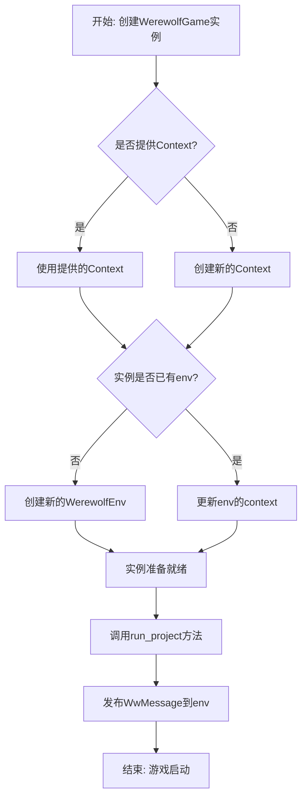
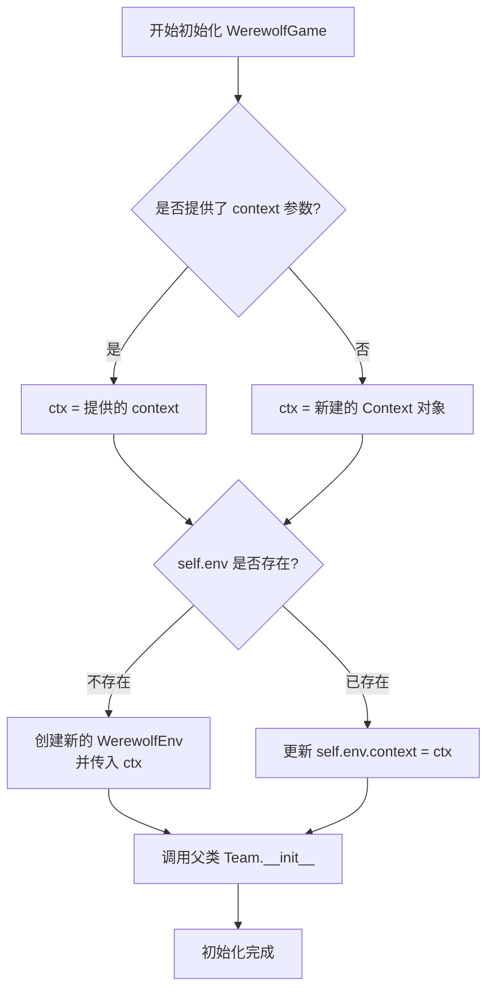

# `.\MetaGPT\metagpt\ext\werewolf\werewolf_game.py` 详细设计文档

该代码定义了一个名为 `WerewolfGame` 的类，它继承自 `Team` 类，旨在利用“软件公司范式”来组织一场狼人杀游戏。其核心功能是初始化游戏环境，并通过发布一条包含用户指令（游戏想法）的特定消息来启动游戏项目。

## 整体流程



## 类结构

```
Team (基类)
└── WerewolfGame (狼人杀游戏类)
```

## 全局变量及字段


### `WerewolfGame.env`
    
游戏运行的环境，负责管理狼人杀游戏的状态、角色和消息传递。

类型：`Optional[WerewolfEnv]`
    
    

## 全局函数及方法

### `WerewolfGame.__init__`

该方法用于初始化一个狼人杀游戏实例。它负责设置游戏的环境（`WerewolfEnv`），确保环境与给定的上下文（`Context`）关联。如果实例没有环境，则创建一个新的；如果已有环境（例如通过反序列化获得），则更新其上下文。

参数：

- `context`：`Context`，可选的上下文对象，用于配置游戏环境。如果未提供，将创建一个新的默认上下文。
- `**data`：`Any`，其他关键字参数，用于传递给父类 `Team` 的初始化方法。

返回值：`None`，此方法不返回任何值。

#### 流程图



#### 带注释源码

```python
def __init__(self, context: Context = None, **data: Any):
    # 调用父类 Team 的初始化方法，传入所有额外的关键字参数
    super(Team, self).__init__(**data)
    
    # 确定要使用的上下文：如果提供了 context 参数则使用它，否则创建一个新的 Context 对象
    ctx = context or Context()
    
    # 检查当前实例是否已经有一个环境对象 (self.env)
    if not self.env:
        # 如果没有环境对象，创建一个新的 WerewolfEnv 实例，并传入确定的上下文
        self.env = WerewolfEnv(context=ctx)
    else:
        # 如果已经存在环境对象（例如通过反序列化创建的实例），则更新其上下文
        self.env.context = ctx  # The `env` object is allocated by deserialization
```

### `WerewolfGame.run_project`

该方法用于启动一个基于用户指令的狼人杀游戏项目。它接收用户的想法（指令），将其封装为特定格式的消息，并通过环境对象发布给游戏中的“主持人”角色，从而触发游戏的初始化与运行流程。

参数：

- `idea`：`str`，用户提供的游戏指令或想法，用于描述游戏的具体需求或规则。

返回值：`None`，该方法不返回任何值。

#### 流程图

```mermaid
flowchart TD
    A[开始] --> B[接收用户指令 idea]
    B --> C[将 idea 赋值给 self.idea]
    C --> D[创建 WwMessage 对象<br>role='User', content=idea, cause_by=UserRequirement, restricted_to={'Moderator'}]
    D --> E[通过 self.env.publish_message 发布消息]
    E --> F[结束]
```

#### 带注释源码

```python
def run_project(self, idea):
    """Run a project from user instruction."""
    # 将用户指令存储到实例变量中，供后续流程使用
    self.idea = idea
    # 通过环境对象发布一条消息，触发游戏流程
    # 消息内容为用户指令，发送者为“User”，接收者限制为“Moderator”（主持人）
    # 消息的触发原因为 UserRequirement，表示这是一个用户需求
    self.env.publish_message(
        WwMessage(role="User", content=idea, cause_by=UserRequirement, restricted_to={"Moderator"})
    )
```

## 关键组件


### WerewolfGame

一个继承自Team的类，用于使用“软件公司范式”来组织一场狼人杀游戏，它封装了游戏环境并提供了启动游戏项目的方法。

### WerewolfEnv

狼人杀游戏的环境类，负责管理游戏状态、处理消息传递（如玩家发言、投票结果）以及执行游戏规则。

### WwMessage

狼人杀游戏中专用的消息类，用于在游戏环境中传递信息，包含发送者角色、消息内容、触发原因以及消息接收者限制等属性。

### UserRequirement

一个动作类，代表用户需求，在游戏启动时用于标记初始消息的触发原因，以驱动游戏流程的开始。

### Team

一个基础团队类，提供了多智能体协作的基本框架，WerewolfGame继承自此类以复用其团队管理和协作机制。

### Context

上下文类，用于管理运行时环境、配置和共享资源，为游戏环境和团队提供必要的上下文信息。


## 问题及建议


### 已知问题

-   **继承链不明确**：`WerewolfGame` 类继承自 `Team`，但在 `__init__` 方法中使用了 `super(Team, self).__init__(**data)`。这通常意味着 `WerewolfGame` 可能不是直接继承自 `Team`，或者存在多层继承，导致 `super()` 调用可能未指向正确的父类，这违反了 Python 的 MRO（方法解析顺序）最佳实践，可能导致初始化错误或行为异常。
-   **环境对象初始化逻辑存在潜在缺陷**：在 `__init__` 方法中，如果 `self.env` 已存在（例如通过反序列化创建），则仅更新其 `context` 属性。然而，`self.env` 可能是一个来自不同上下文或状态不完整的对象，仅更新 `context` 可能不足以确保环境在新的 `WerewolfGame` 实例中正确运行。
-   **`run_project` 方法职责单一但可能过于简单**：该方法仅将用户想法（idea）作为消息发布到环境中。虽然这符合单一职责原则，但作为游戏的主要运行入口，它可能缺乏必要的游戏状态初始化、回合控制或游戏结束判断等逻辑，这些功能可能被隐藏在其他组件中，导致此方法的可理解性和可维护性降低。

### 优化建议

-   **修正 `super()` 调用**：将 `__init__` 方法中的 `super(Team, self).__init__(**data)` 改为 `super().__init__(**data)`。这利用了 Python 3 的隐式 MRO，确保调用正确的父类初始化方法，使代码更清晰、更安全。
-   **重构环境初始化逻辑**：考虑在 `__init__` 方法中始终创建一个新的 `WerewolfEnv` 实例，或者提供一个更明确的方法来重置或重新配置现有环境。如果必须支持反序列化场景，应添加状态验证逻辑，确保 `self.env` 在新上下文中是完整且可用的。
-   **增强 `run_project` 方法或明确其边界**：如果 `run_project` 确实是游戏运行的唯一入口，应考虑在其中或通过调用其他方法，加入游戏循环、回合管理或结果收集等逻辑，使其功能更完整。或者，在文档中明确说明 `run_project` 仅负责“启动”游戏，后续流程由环境 (`WerewolfEnv`) 或其他机制驱动，以澄清职责划分。
-   **考虑添加类型注解和文档**：为 `idea` 参数和 `run_project` 方法添加更详细的类型注解（例如 `str`）和文档字符串，说明其预期格式和用途，提高代码的可读性和可维护性。


## 其它


### 设计目标与约束

本模块的核心设计目标是将“软件公司”协作范式应用于狼人杀游戏场景，实现一个由AI角色扮演的、可自动运行的狼人杀游戏模拟器。主要约束包括：1. 继承并复用`Team`基类的团队协作与消息传递框架；2. 依赖`WerewolfEnv`环境来管理游戏状态、规则与角色交互；3. 通过`WwMessage`消息格式在特定角色（如“Moderator”）间传递游戏指令与状态。

### 错误处理与异常设计

当前代码未显式包含错误处理逻辑。潜在异常点包括：1. `idea`参数为空或格式错误时，可能导致`WwMessage`创建失败或游戏逻辑异常；2. `self.env`在`__init__`中可能因上下文问题初始化失败；3. `publish_message`方法可能因环境未就绪或消息格式问题抛出异常。建议增加参数验证、环境状态检查，并使用try-catch块包装关键操作，将底层异常转换为更具业务语义的异常（如`GameInitializationError`, `InvalidGameInstructionError`）向上抛出。

### 数据流与状态机

1. **初始化数据流**：通过`__init__`接收或创建`Context`，并确保`WerewolfEnv`实例`self.env`与正确的上下文绑定。
2. **游戏启动数据流**：`run_project`方法接收用户指令`idea`，将其封装为`WwMessage`（指定发送者、内容、触发动作及受限接收角色“Moderator”），并通过`self.env.publish_message`发布到环境中，从而触发游戏 moderator 的后续处理流程。
3. **状态机**：游戏的整体状态（如“等待开始”、“进行中”、“结束”）由`WerewolfEnv`内部管理。`WerewolfGame`类主要充当游戏启动的触发器与团队协作框架的载体，其自身不维护复杂的游戏状态。

### 外部依赖与接口契约

1. **继承依赖**：`Team`基类（来自`metagpt.team`），依赖其团队角色管理、内部消息循环等机制。
2. **环境依赖**：`WerewolfEnv`（来自`metagpt.environment.werewolf.werewolf_env`），负责游戏规则执行与角色间交互环境。
3. **消息契约**：`WwMessage`（来自`metagpt.ext.werewolf.schema`），定义了游戏内消息的标准格式，特别是`restricted_to`字段用于实现私聊等游戏机制。
4. **动作契约**：`UserRequirement`（来自`metagpt.actions.add_requirement`），作为消息的`cause_by`，标识消息的起源动作类型。
5. **上下文依赖**：`Context`（来自`metagpt.context`），为整个游戏运行提供配置、日志、存储等共享资源。

    