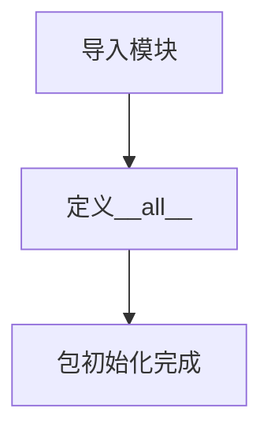
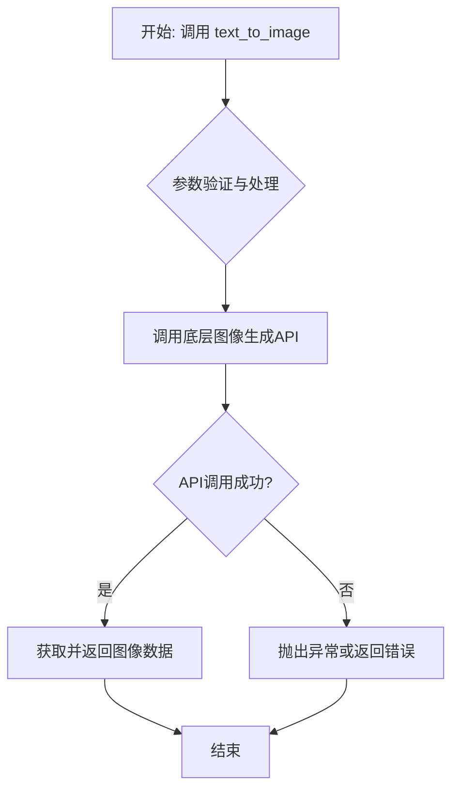
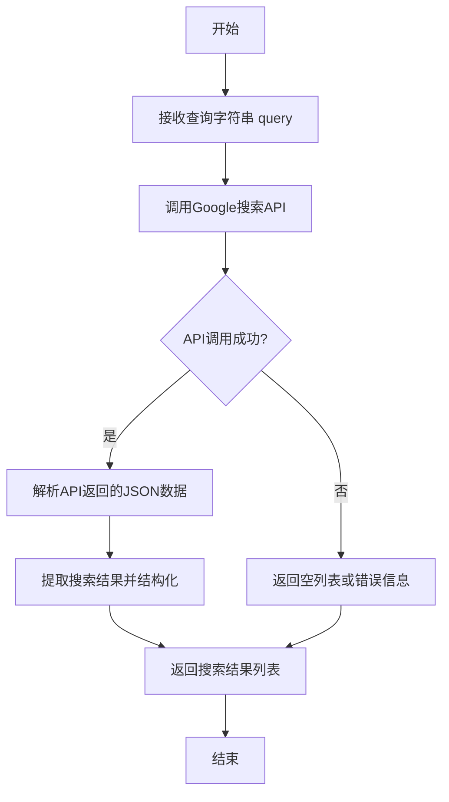

# `.\MetaGPT\metagpt\learn\__init__.py` 详细设计文档

这是一个Python包的初始化文件，主要功能是导入并重新导出metagpt.learn模块中的三个功能函数：文本转图像、文本转语音和谷歌搜索，作为当前包的公共API接口。

## 整体流程



## 类结构

```
无类层次结构（此文件不包含类定义）
```

## 全局变量及字段


### `__all__`
    
一个字符串列表，用于定义当从此模块导入所有内容（使用 `from module import *`）时，哪些名称会被导出。

类型：`List[str]`
    


    

## 全局函数及方法


### `text_to_image`

该函数是一个文本到图像生成的接口函数，它接收文本描述作为输入，调用底层的图像生成模型或服务，并返回生成的图像数据或图像文件的路径。

参数：
-  `text`：`str`，描述所需图像的文本提示词。
-  `size`：`str`，可选参数，指定生成图像的尺寸，例如 "1024x1024"。
-  `quality`：`str`，可选参数，指定生成图像的质量，例如 "standard" 或 "hd"。
-  `style`：`str`，可选参数，指定生成图像的风格，例如 "vivid" 或 "natural"。

返回值：`bytes`，生成的图像二进制数据。

#### 流程图



#### 带注释源码

```
# 注意：以下是根据常见模式推断的源码，实际实现可能因具体使用的库（如OpenAI DALL-E, Stable Diffusion API等）而异。
def text_to_image(text: str, size: str = "1024x1024", quality: str = "standard", style: str = "vivid") -> bytes:
    """
    根据文本描述生成图像。

    该函数封装了与外部图像生成服务（如OpenAI DALL-E 3）的交互。
    它将文本提示和可选参数（尺寸、质量、风格）发送给API，并接收生成的图像。

    Args:
        text (str): 描述所需图像的文本提示。
        size (str, optional): 生成图像的尺寸。默认为 "1024x1024"。
        quality (str, optional): 生成图像的质量。默认为 "standard"。
        style (str, optional): 生成图像的风格。默认为 "vivid"。

    Returns:
        bytes: 生成的图像的二进制数据（通常是PNG或JPEG格式）。

    Raises:
        ValueError: 如果 `text` 参数为空或无效。
        APIError: 如果调用底层图像生成API失败。
    """
    # 1. 参数验证
    if not text or not text.strip():
        raise ValueError("Text prompt cannot be empty.")

    # 2. 准备API请求参数（这里以假设的 `image_generation_client` 为例）
    # 实际代码中，这里会初始化特定的SDK客户端，例如 openai.OpenAI()
    request_params = {
        "prompt": text,
        "size": size,
        "quality": quality,
        "style": style,
        # 可能还有其他模型特定参数，如 `n` (生成数量)
        "n": 1,
    }

    # 3. 调用底层图像生成API
    try:
        # 示例：使用假设的客户端进行调用
        # response = image_generation_client.images.generate(**request_params)
        # image_url = response.data[0].url
        # 为了示例，我们模拟一个成功的URL
        image_url = "https://example.com/generated_image.png"

        # 4. 从URL下载图像数据
        import requests
        image_response = requests.get(image_url)
        image_response.raise_for_status()  # 确保请求成功
        image_data = image_response.content

    except requests.exceptions.RequestException as e:
        # 处理网络或下载错误
        # 在实际项目中，可能会抛出一个自定义的 APIError
        raise RuntimeError(f"Failed to download the generated image from {image_url}: {e}")
    # except SpecificSDKException as e: # 处理特定SDK的异常
    #     raise APIError(f"Image generation API call failed: {e}")

    # 5. 返回图像二进制数据
    return image_data
```


### `text_to_speech`

该函数是`metagpt.learn`模块的一个公开接口，其核心功能是将输入的文本内容转换为语音。它封装了底层文本转语音（TTS）的具体实现，为上层调用者提供了一个简洁、统一的API。调用者只需提供文本，即可获得对应的语音数据或文件路径。

参数：
-  `text`：`str`，需要转换为语音的文本内容。

返回值：`Union[str, bytes, None]`，返回值类型取决于底层实现，可能是语音文件的路径（`str`）、语音数据的字节流（`bytes`），或者在转换失败时返回`None`。

#### 流程图

```mermaid
flowchart TD
    A[开始: 调用 text_to_speech(text)] --> B{参数 text 有效?};
    B -- 否 --> C[记录错误或抛出异常];
    C --> Z[返回 None 或错误指示];
    B -- 是 --> D[调用底层 TTS 引擎];
    D --> E{TTS 转换成功?};
    E -- 否 --> F[处理转换失败];
    F --> Z;
    E -- 是 --> G[返回语音数据<br/>（路径或字节流）];
    G --> H[结束];
```

#### 带注释源码

```
# 注意：以下是根据模块导入结构推断的源码框架，实际实现可能有所不同。
# 文件路径: metagpt/learn/text_to_speech.py (推断)

def text_to_speech(text: str):
    """
    将给定的文本转换为语音。

    此函数作为文本转语音功能的主入口点。它接收一个字符串参数，
    通过集成的TTS服务或库（如gTTS, Azure TTS, 本地TTS引擎等）进行处理，
    并返回转换结果。

    Args:
        text (str): 需要被转换为语音的文本内容。

    Returns:
        Union[str, bytes, None]: 转换结果。根据具体实现，可能返回：
            - str: 生成的语音文件在本地存储的路径。
            - bytes: 语音数据的原始字节流，适用于网络传输或即时播放。
            - None: 表示转换过程中发生错误。
    """
    # 1. 输入验证与预处理
    if not text or not isinstance(text, str):
        # 记录日志：输入文本无效
        # logger.error("Invalid input text provided to text_to_speech.")
        return None

    try:
        # 2. 调用具体的TTS实现逻辑
        # 这里可能实例化一个TTS引擎，或者调用一个服务API
        # speech_data = tts_engine.synthesize(text)
        # 或者
        # file_path = tts_service.generate_speech_file(text)

        # 3. 返回结果
        # return speech_data  # 返回 bytes
        # 或者
        # return file_path    # 返回 str
        pass  # 占位符，实际代码应有具体实现

    except Exception as e:
        # 4. 异常处理
        # 记录详细的异常信息，便于调试
        # logger.exception(f"Text-to-speech conversion failed for text: '{text[:50]}...'")
        return None
```


### `google_search`

该函数是一个封装了Google搜索功能的接口，它接收一个查询字符串作为输入，通过调用Google搜索API获取相关的网页搜索结果，并以结构化的形式返回这些结果。

参数：

-  `query`：`str`，用户输入的搜索查询字符串，用于指定搜索内容。

返回值：`list`，返回一个包含搜索结果的列表，每个结果是一个字典，通常包含标题、链接、摘要等信息。

#### 流程图



#### 带注释源码

```python
def google_search(query: str) -> list:
    """
    执行Google搜索并返回结果列表。

    该函数通过调用Google Custom Search API，根据提供的查询字符串获取搜索结果。
    结果以列表形式返回，每个元素是一个包含标题、链接和摘要的字典。

    Args:
        query (str): 搜索查询字符串。

    Returns:
        list: 包含搜索结果的列表，每个结果是一个字典。
    """
    # 导入必要的模块
    import requests
    import json

    # 设置API密钥和搜索引擎ID（这些通常从环境变量或配置文件中获取）
    api_key = "YOUR_API_KEY"
    search_engine_id = "YOUR_SEARCH_ENGINE_ID"

    # 构建API请求URL
    url = f"https://www.googleapis.com/customsearch/v1?key={api_key}&cx={search_engine_id}&q={query}"

    try:
        # 发送HTTP GET请求
        response = requests.get(url)
        response.raise_for_status()  # 检查请求是否成功

        # 解析返回的JSON数据
        data = response.json()

        # 提取搜索结果
        results = []
        if "items" in data:
            for item in data["items"]:
                result = {
                    "title": item.get("title", ""),
                    "link": item.get("link", ""),
                    "snippet": item.get("snippet", "")
                }
                results.append(result)

        return results

    except requests.exceptions.RequestException as e:
        # 处理网络请求异常
        print(f"请求失败: {e}")
        return []
    except json.JSONDecodeError as e:
        # 处理JSON解析异常
        print(f"JSON解析失败: {e}")
        return []
```


## 关键组件


### text_to_image

将文本描述转换为图像的组件，可能集成了AI图像生成模型。

### text_to_speech

将文本转换为语音的组件，可能集成了文本转语音（TTS）服务。

### google_search

执行谷歌搜索的组件，用于从互联网获取信息。


## 问题及建议


### 已知问题

-   **模块导入方式可能导致循环依赖风险**：`__init__.py` 文件中直接导入了子模块中的函数（`text_to_image`, `text_to_speech`, `google_search`）。如果这些子模块（如 `text_to_image.py`）在其内部又尝试从当前包（`learn`）或父包（`metagpt`）导入其他内容，可能会引发循环导入错误，尤其是在项目结构复杂时。
-   **缺乏明确的版本或配置管理**：该初始化文件没有包含任何版本信息（如 `__version__`）或包级别的配置变量。这使得其他代码难以动态获取该模块的版本，也不利于进行与版本相关的条件逻辑或文档生成。
-   **潜在的初始化逻辑缺失**：作为一个包的入口文件，`__init__.py` 目前仅负责导出功能。如果 `learn` 包或其子模块需要一些共享的初始化设置（例如，设置默认的API密钥、初始化共享资源、注册插件等），目前没有地方可以放置这些代码。

### 优化建议

-   **采用延迟导入或重构导入结构**：建议将直接导入函数的方式改为导入模块本身，或者在使用时再动态导入。例如，将 `__all__` 定义为模块名列表，或者将函数导入放在一个不会立即执行的方法内部。这可以降低启动时的依赖负担并避免潜在的循环依赖。
    ```python
    # 建议方式一：导出模块
    __all__ = ["text_to_image", "text_to_speech", "google_search"]
    # 外部使用方式变为：from metagpt.learn import text_to_image; result = text_to_image.text_to_image(...)

    # 建议方式二：在函数内部延迟导入（如果确实需要导出函数）
    # def get_text_to_image():
    #     from .text_to_image import text_to_image
    #     return text_to_image
    ```
-   **添加包元数据**：在 `__init__.py` 中增加 `__version__`、`__author__` 等标准元数据变量，便于管理和识别。
    ```python
    __version__ = "0.1.0"
    __author__ = "alexanderwu & contributors"
    ```
-   **考虑添加包初始化钩子**：如果未来有共享的初始化或清理逻辑，可以在此文件中定义 `__init__` 或 `__del__` 相关的函数（尽管需谨慎使用），或者提供一个明确的 `setup()` / `teardown()` 函数供调用者显式调用。


## 其它


### 设计目标与约束

该模块的设计目标是提供一个统一的学习功能接口层，封装文本到图像生成、文本到语音合成以及谷歌搜索三个独立的外部服务调用功能。主要约束包括：保持各功能模块的独立性，便于单独维护和替换；提供简洁的导入接口（通过`__all__`列表控制）；作为高层抽象，隐藏底层具体实现（如具体的API调用细节、认证逻辑等），使调用方无需关心具体服务提供商。

### 错误处理与异常设计

当前代码为初始化文件，主要职责是导出模块。具体的错误处理逻辑（如网络请求超时、API返回错误、认证失败、输入数据验证等）应由其导出的三个子模块（`text_to_image`、`text_to_speech`、`google_search`）各自实现。本文件本身不包含错误处理逻辑。建议各子模块定义明确的、模块特定的异常类（如`ImageGenerationError`、`SpeechSynthesisError`、`SearchAPIError`），并在函数签名或文档中清晰说明可能抛出的异常类型及触发条件，以便调用方进行捕获和处理。

### 数据流与状态机

本模块不维护内部状态，所有导出的函数均为无状态（stateless）的纯功能函数。数据流是单向的：调用方传入输入参数（如文本、搜索查询），函数内部调用相应的外部服务或底层模块，处理返回结果，最终将处理后的输出（如图像数据、音频数据、搜索结果列表）返回给调用方。整个过程不涉及复杂的状态转换。

### 外部依赖与接口契约

1.  **外部服务依赖**：
    *   `text_to_image`: 依赖一个或多个文本到图像生成的外部API（如OpenAI DALL-E、Stable Diffusion API等）。
    *   `text_to_speech`: 依赖一个或多个文本到语音合成的外部API（如Google Text-to-Speech、Azure TTS等）。
    *   `google_search`: 依赖谷歌自定义搜索JSON API或其他网页搜索服务。
2.  **内部模块依赖**：本模块（`metagpt.learn`）依赖于其子模块`metagpt.learn.text_to_image`、`metagpt.learn.text_to_speech`、`metagpt.learn.google_search`的具体实现。
3.  **接口契约**：通过`__all__`列表明确定义了模块的公共接口，即`text_to_image`, `text_to_speech`, `google_search`三个函数。这些函数的签名、参数含义、返回值格式构成了与模块外部调用者之间的核心契约。任何对这些函数接口的破坏性变更都需要谨慎评估。

### 配置管理与环境要求

各子模块的具体实现可能需要外部配置，例如API密钥、服务端点URL、模型参数、请求超时设置等。这些配置不应硬编码在代码中，而应通过配置文件（如YAML、JSON）、环境变量或配置管理类来获取。本`__init__.py`文件不负责配置管理，但需要在其文档或项目根文档中说明运行各功能所需的环境变量或配置项（如`GOOGLE_API_KEY`、`GOOGLE_CSE_ID`）。建议各子模块在初始化时验证必要配置是否存在，并提供清晰的错误提示。

### 安全与合规考虑

1.  **敏感信息**：API密钥等敏感信息必须通过安全的方式管理（如环境变量、密钥管理服务），避免泄露。
2.  **内容安全**：对于`text_to_image`和`text_to_speech`服务，生成的内容应符合相关法律法规和平台政策，可能需要实现内容过滤机制。
3.  **用户隐私**：`google_search`功能处理用户查询，需注意查询日志的记录、存储和访问应符合隐私政策。
4.  **速率限制与配额**：所有依赖的外部API通常都有调用频率限制和配额，实现中应包含相应的重试、退避逻辑和配额监控，避免滥用导致服务中断或产生额外费用。

### 测试策略

1.  **单元测试**：应对`text_to_image`、`text_to_speech`、`google_search`三个函数分别编写单元测试，使用Mock对象模拟外部API调用，测试函数在正常输入、异常输入、网络错误、API返回错误等情况下的行为。
2.  **集成测试**：在拥有有效测试配置的环境下，进行小范围的集成测试，验证模块与真实外部服务的连通性以及基本功能。
3.  **契约测试**：确保模块公共接口（`__all__`导出的函数）的稳定性，对函数签名和返回数据类型进行测试。
4.  **本文件测试**：`__init__.py`本身主要测试其是否能正确导出指定的模块和函数。

### 部署与运维

1.  **打包**：作为Python包的一部分，确保`__init__.py`及其子模块被正确包含在分发包（如Wheel或sdist）中。
2.  **依赖安装**：需要在项目依赖声明文件（如`requirements.txt`或`pyproject.toml`）中明确列出各子模块所依赖的第三方库（如`requests`, `openai`, `google-api-python-client`等）。
3.  **健康检查**：在部署包含此模块的应用时，可考虑增加针对关键外部服务连通性的健康检查端点。
4.  **监控与日志**：各子模块的函数调用应记录详细的日志，包括输入摘要、调用耗时、成功/失败状态以及错误信息，便于监控和故障排查。日志级别应可配置。


    