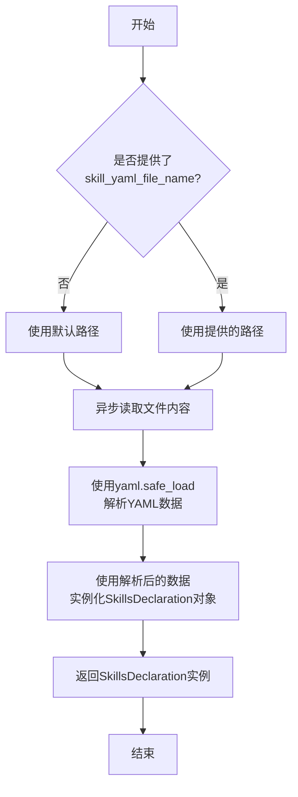
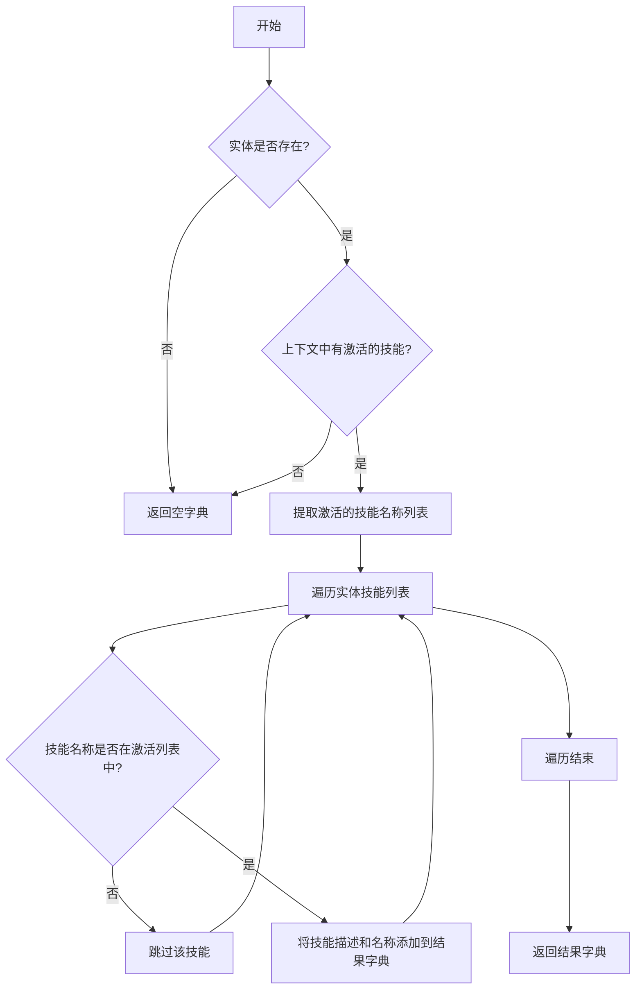
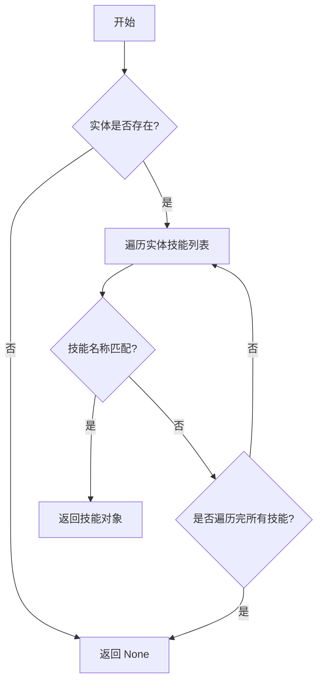

# `.\MetaGPT\metagpt\learn\skill_loader.py` 详细设计文档

该代码实现了一个技能配置加载器，用于从YAML文件中加载和解析技能定义，支持基于实体和上下文过滤技能列表，并提供技能参数和返回值的结构化访问。

## 整体流程

```mermaid
graph TD
    A[开始] --> B{是否指定YAML文件?}
    B -- 否 --> C[使用默认路径]
    B -- 是 --> D[使用指定路径]
    D --> E[异步读取文件内容]
    C --> E
    E --> F[YAML解析为字典]
    F --> G[构造SkillsDeclaration对象]
    G --> H[结束]
    
    subgraph 获取技能列表
        I[调用get_skill_list] --> J{实体是否存在?}
        J -- 否 --> K[返回空字典]
        J -- 是 --> L{上下文中有agent_skills?}
        L -- 否 --> K
        L -- 是 --> M[过滤匹配的技能]
        M --> N[返回{描述: 名称}映射]
    end
    
    subgraph 获取单个技能
        O[调用get_skill] --> P{实体是否存在?}
        P -- 否 --> Q[返回None]
        P -- 是 --> R[遍历技能列表]
        R --> S{名称匹配?}
        S -- 是 --> T[返回Skill对象]
        S -- 否 --> U[继续遍历]
        U --> R
        R -- 遍历结束 --> Q
    end
```

## 类结构

```
BaseModel (Pydantic基类)
├── Example
├── Returns
├── Parameter
├── Skill
├── Entity
├── Components
└── SkillsDeclaration
```

## 全局变量及字段


### `Example.ask`
    
技能示例中的问题或输入描述。

类型：`str`
    


### `Example.answer`
    
技能示例中的预期回答或输出描述。

类型：`str`
    


### `Returns.type`
    
技能返回值的类型描述。

类型：`str`
    


### `Returns.format`
    
技能返回值的格式描述，可选。

类型：`Optional[str]`
    


### `Parameter.type`
    
技能参数的类型描述。

类型：`str`
    


### `Parameter.description`
    
技能参数的详细描述。

类型：`str`
    


### `Skill.name`
    
技能的唯一标识名称。

类型：`str`
    


### `Skill.description`
    
技能的详细功能描述。

类型：`str`
    


### `Skill.id`
    
技能的可选唯一标识符。

类型：`str`
    


### `Skill.x_prerequisite`
    
技能的前置条件或依赖关系，使用别名'x-prerequisite'。

类型：`Dict`
    


### `Skill.parameters`
    
技能所需的参数列表，键为参数名，值为Parameter对象。

类型：`Dict[str, Parameter]`
    


### `Skill.examples`
    
技能的使用示例列表。

类型：`List[Example]`
    


### `Skill.returns`
    
技能返回值的描述。

类型：`Returns`
    


### `Entity.name`
    
实体的名称。

类型：`str`
    


### `Entity.skills`
    
实体所拥有的技能列表。

类型：`List[Skill]`
    


### `SkillsDeclaration.skillapi`
    
技能API的版本或标识符。

类型：`str`
    


### `SkillsDeclaration.entities`
    
所有实体的字典，键为实体名，值为Entity对象。

类型：`Dict[str, Entity]`
    


### `SkillsDeclaration.components`
    
可选的组件配置，当前为空。

类型：`Components`
    
    

## 全局函数及方法

### `Skill.arguments`

`Skill.arguments` 是一个属性方法，用于将 `Skill` 类中定义的 `parameters` 字典转换成一个新的字典。新字典的键与 `parameters` 相同，但其值被替换为对应参数的描述信息。如果某个参数没有描述信息，则使用空字符串作为其值。如果 `parameters` 本身为空，则返回一个空字典。

参数：
- 无显式参数。此属性方法通过 `self` 访问当前 `Skill` 实例的内部状态。

返回值：`Dict`，一个字典，其键为技能参数名，值为对应参数的描述字符串（若描述不存在则为空字符串）。

#### 流程图

```mermaid
flowchart TD
    A[开始] --> B{self.parameters 是否为空?}
    B -- 是 --> C[返回空字典 {}]
    B -- 否 --> D[初始化空字典 ret]
    D --> E[遍历 self.parameters 的每一项 k, v]
    E --> F{参数描述 v.description 是否存在?}
    F -- 是 --> G[ret[k] = v.description]
    F -- 否 --> H[ret[k] = ""]
    G --> I[继续遍历]
    H --> I
    I --> E
    E -- 遍历结束 --> J[返回字典 ret]
    C --> K[结束]
    J --> K
```

#### 带注释源码

```python
    @property
    def arguments(self) -> Dict:
        # 检查当前技能实例的参数字典是否存在
        if not self.parameters:
            # 如果不存在，直接返回一个空字典
            return {}
        # 初始化一个空字典用于存放结果
        ret = {}
        # 遍历参数字典中的每一个键值对
        for k, v in self.parameters.items():
            # 将参数名作为键，参数描述作为值存入结果字典。
            # 如果参数描述不存在，则使用空字符串作为默认值。
            ret[k] = v.description if v.description else ""
        # 返回构建好的字典
        return ret
```

### `SkillsDeclaration.load`

`SkillsDeclaration.load` 是一个静态异步方法，用于从指定的 YAML 配置文件路径异步加载技能声明数据，并将其解析并实例化为一个 `SkillsDeclaration` 对象。如果未提供路径，则使用默认路径。

参数：

- `skill_yaml_file_name`：`Path`，技能声明配置文件的路径。如果为 `None`，则使用默认路径 `docs/.well-known/skills.yaml`。

返回值：`SkillsDeclaration`，返回一个包含从 YAML 文件加载并解析出的技能声明数据的 `SkillsDeclaration` 对象实例。

#### 流程图



#### 带注释源码

```python
    @staticmethod
    async def load(skill_yaml_file_name: Path = None) -> "SkillsDeclaration":
        # 步骤1: 确定要加载的YAML文件路径。
        # 如果调用者没有提供路径参数，则使用项目内的一个默认路径。
        if not skill_yaml_file_name:
            skill_yaml_file_name = Path(__file__).parent.parent.parent / "docs/.well-known/skills.yaml"
        
        # 步骤2: 异步读取指定文件的内容。
        # `aread` 是一个异步文件读取工具函数。
        data = await aread(filename=skill_yaml_file_name)
        
        # 步骤3: 使用 `yaml.safe_load` 将读取的YAML格式字符串解析为Python数据结构（通常是字典或列表）。
        skill_data = yaml.safe_load(data)
        
        # 步骤4: 使用解析出的数据字典，通过解包操作符 `**` 来构造并返回一个 `SkillsDeclaration` 类的实例。
        # Pydantic 模型会自动验证输入数据是否符合字段定义。
        return SkillsDeclaration(**skill_data)
```

### `SkillsDeclaration.get_skill_list`

该方法根据给定的实体名称和上下文，从技能声明中筛选出特定实体（如“Assistant”）的技能列表，并返回一个以技能描述为键、技能名称为值的字典。它首先检查实体是否存在，然后根据上下文中的`agent_skills`（代理激活的技能列表）进行筛选，仅返回那些在上下文中被激活的技能。

参数：

- `entity_name`：`str`，实体名称，默认为“Assistant”，用于指定从哪个实体获取技能列表。
- `context`：`Context`，上下文对象，包含代理的配置信息（如激活的技能列表），如果未提供，则使用默认上下文。

返回值：`Dict`，返回一个字典，其中键为技能描述，值为技能名称。如果实体不存在或上下文中没有激活的技能，则返回空字典。

#### 流程图



#### 带注释源码

```python
def get_skill_list(self, entity_name: str = "Assistant", context: Context = None) -> Dict:
    """Return the skill name based on the skill description."""
    # 1. 根据实体名称获取对应的实体对象
    entity = self.entities.get(entity_name)
    if not entity:
        # 如果实体不存在，返回空字典
        return {}

    # 2. 获取上下文中的激活技能列表
    ctx = context or Context()
    agent_skills = ctx.kwargs.agent_skills
    if not agent_skills:
        # 如果上下文中没有激活的技能，返回空字典
        return {}

    # 3. 定义内部类用于解析激活技能列表中的技能名称
    class _AgentSkill(BaseModel):
        name: str

    # 4. 提取所有激活的技能名称
    names = [_AgentSkill(**i).name for i in agent_skills]

    # 5. 遍历实体技能列表，筛选出在激活列表中的技能，并构建结果字典
    return {s.description: s.name for s in entity.skills if s.name in names}
```

### `SkillsDeclaration.get_skill`

该方法用于根据技能名称和实体名称，从技能声明中检索并返回对应的技能对象。

参数：

- `name`：`str`，要查找的技能名称
- `entity_name`：`str`，实体名称，默认为"Assistant"

返回值：`Skill`，返回匹配到的技能对象，如果未找到则返回`None`

#### 流程图



#### 带注释源码

```python
def get_skill(self, name, entity_name: str = "Assistant") -> Skill:
    """Return a skill by name."""
    # 根据实体名称获取对应的实体对象
    entity = self.entities.get(entity_name)
    # 如果实体不存在，直接返回None
    if not entity:
        return None
    # 遍历实体中的所有技能
    for sk in entity.skills:
        # 检查技能名称是否匹配
        if sk.name == name:
            # 找到匹配的技能，返回该技能对象
            return sk
    # 遍历完所有技能仍未找到匹配项，返回None
    return None
```

## 关键组件


### Pydantic 数据模型

定义了用于验证和序列化技能配置数据的结构化类，包括 `Skill`、`Entity`、`SkillsDeclaration` 等，确保从 YAML 文件加载的数据符合预期格式。

### YAML 配置加载器

通过 `SkillsDeclaration.load` 静态方法，从指定的 YAML 文件路径异步读取并解析技能声明配置，将原始数据转换为强类型的 Pydantic 模型实例。

### 上下文感知的技能筛选器

`SkillsDeclaration.get_skill_list` 方法根据传入的运行时上下文（`Context`）中定义的代理技能列表，动态筛选出指定实体（如 `"Assistant"`）下当前应激活的技能子集，实现了配置与运行时状态的解耦。

### 基于名称的技能检索器

`SkillsDeclaration.get_skill` 方法提供了通过技能名称和实体名称精确查找并返回单个 `Skill` 对象的功能，用于获取特定技能的详细配置信息。


## 问题及建议


### 已知问题

-   **硬编码的默认文件路径**：`SkillsDeclaration.load` 方法中，当未提供 `skill_yaml_file_name` 参数时，默认路径 `Path(__file__).parent.parent.parent / "docs/.well-known/skills.yaml"` 是硬编码的。这降低了代码的灵活性和可配置性，如果项目结构或配置文件位置发生变化，需要修改源代码。
-   **潜在的循环导入风险**：代码中导入了 `metagpt.context.Context`。如果 `Context` 类或其依赖项反过来导入了 `skill_loader` 模块中的类（例如 `SkillsDeclaration`），可能会导致循环导入错误，影响模块的独立性和可测试性。
-   **`get_skill_list` 方法逻辑耦合与潜在错误**：该方法将业务逻辑（根据上下文筛选技能）与数据访问逻辑耦合在一起。它依赖于 `context.kwargs.agent_skills` 的结构，如果 `agent_skills` 的格式不符合预期（例如，不是字典列表或缺少 `name` 键），内部的 `_AgentSkill` 模型实例化可能会失败，且错误处理不够明确。
-   **`Components` 类定义空置**：`Components` 类当前定义为空 (`pass`)，但在 `SkillsDeclaration` 模型中作为可选字段存在。这可能导致序列化/反序列化时的混淆，或者表明该功能尚未实现，是一个不完整的接口。
-   **`Skill.arguments` 属性逻辑可能不完整**：该属性返回一个字典，其中键是参数名，值是参数的描述（如果存在，否则为空字符串）。这个设计意图可能是为了快速获取参数的描述信息，但它忽略了参数的类型 (`Parameter.type`)，这可能在某些需要完整参数信息的场景下不够用。

### 优化建议

-   **将默认路径配置化**：建议将默认的 YAML 文件路径提取到配置文件、环境变量或通过依赖注入的方式提供。例如，可以设置一个模块级常量或从应用配置中读取，从而提高代码的可维护性和部署灵活性。
-   **解耦数据模型与业务上下文**：`SkillsDeclaration` 类作为数据模型，应专注于数据的加载和验证。建议将 `get_skill_list` 方法中依赖于特定 `Context` 结构的筛选逻辑移出，放到更上层的业务逻辑或服务层中。`SkillsDeclaration` 可以只提供基础的数据查询方法（如 `get_skills_for_entity`），由调用者结合业务上下文进行过滤。
-   **增强 `get_skill_list` 的健壮性**：在解析 `agent_skills` 时，应增加更完善的错误处理和数据验证。例如，使用 `try-except` 捕获 `_AgentSkill` 初始化失败的情况，或者使用更宽松的数据提取方式（如直接使用 `.get('name')`），并记录或忽略无效条目，避免因单个数据问题导致整个方法失败。
-   **明确 `Components` 类的用途或移除**：如果项目中确实不需要 `Components` 字段，应考虑将其从 `SkillsDeclaration` 模型中移除，以简化模型。如果需要，则应为其定义具体的字段，避免使用空的 `BaseModel` 造成困惑。
-   **重构 `Skill.arguments` 属性**：考虑将该属性重命名为更贴切的名称，如 `parameter_descriptions`，以准确反映其内容。或者，可以创建一个新的属性（如 `parameter_details`）来返回包含类型和描述的完整参数信息字典，以满足不同场景的需求。
-   **考虑添加缓存机制**：`SkillsDeclaration.load` 方法每次调用都会读取文件并解析 YAML。如果配置文件不常变化，可以考虑引入简单的缓存机制（例如，使用 `lru_cache` 装饰异步函数），在相同路径下重复加载时直接返回缓存的对象，以提高性能。


## 其它


### 设计目标与约束

本模块的核心设计目标是提供一个类型安全、可扩展的YAML技能配置加载器，用于解析和管理预定义的技能声明。主要约束包括：1) 依赖Pydantic进行数据验证和序列化，确保配置数据的结构正确性；2) 异步文件读取以支持可能的远程或大文件加载场景；3) 向后兼容性，通过`x-prerequisite`等字段支持扩展属性；4) 与项目特定的`Context`对象集成，用于运行时技能过滤。

### 错误处理与异常设计

模块的错误处理主要围绕配置文件的加载和解析。`SkillsDeclaration.load`方法可能抛出`yaml.YAMLError`（如YAML格式错误）或`FileNotFoundError`（如文件路径错误）。Pydantic模型在实例化时（如`SkillsDeclaration(**skill_data)`）会进行数据验证，若传入数据与模型定义不匹配（如缺少必填字段、类型错误），将抛出`pydantic.ValidationError`。`get_skill`和`get_skill_list`方法在未找到对应实体或技能时返回`None`或空字典，属于静默失败，调用方需检查返回值。目前缺乏对网络超时、权限错误等I/O异常的处理。

### 数据流与状态机

数据流起始于外部的YAML配置文件。通过`SkillsDeclaration.load`异步加载并解析为`SkillsDeclaration`对象，该对象是内存中的核心数据结构，包含所有实体及其技能定义的静态快照。运行时，`Context`对象（包含`agent_skills`列表）作为输入，与`SkillsDeclaration`对象在`get_skill_list`方法中交互，通过匹配技能名称来动态过滤出当前代理可用的技能子集，输出为一个描述到名称的映射字典。`get_skill`方法提供按名称直接查找特定技能的路径。整个流程无复杂的状态变迁，本质是配置数据的加载、存储和查询。

### 外部依赖与接口契约

1.  **输入接口**：主要依赖一个符合特定YAML schema的文件。该文件必须包含`skillapi`、`entities`等顶级字段，其中`entities`下的每个`Skill`必须包含`name`、`examples`、`returns`等字段。`Parameters`和`Example`的结构也需符合定义。
2.  **输出接口**：`get_skill_list`方法返回`Dict[str, str]`（描述->技能名），`get_skill`返回`Skill`对象或`None`。`Skill`对象的`arguments`属性提供参数字典。
3.  **库依赖**：
    *   `yaml`：用于解析YAML配置文件。
    *   `pydantic`：用于定义数据模型、验证和序列化。
    *   `pathlib.Path`：用于处理文件路径。
    *   `metagpt.utils.common.aread`：项目内部封装的异步文件读取工具。
    *   `metagpt.context.Context`：项目内部定义的上下文对象，用于传递运行时信息（如`agent_skills`）。
4.  **隐式契约**：调用`get_skill_list`时，传入的`Context`对象中的`agent_skills`列表，其每一项应是一个包含`"name"`键的字典。YAML配置文件中技能的名称(`Skill.name`)必须与`agent_skills`中提供的名称完全匹配。

    