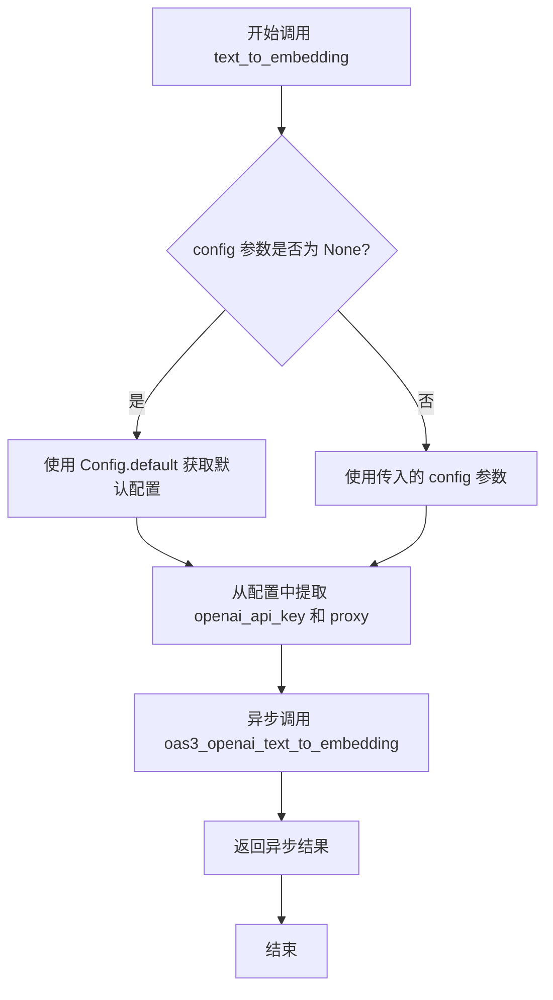

# `.\MetaGPT\metagpt\learn\text_to_embedding.py` 详细设计文档

该代码实现了一个文本转嵌入向量的技能，它封装了对OpenAI文本嵌入API的异步调用。核心功能是接收文本输入，通过配置的OpenAI模型（默认使用text-embedding-ada-002）将其转换为向量表示，并返回嵌入结果。

## 整体流程

```mermaid
graph TD
    A[开始: 调用text_to_embedding函数] --> B{config参数是否为None?}
    B -- 是 --> C[使用Config.default()获取默认配置]
    B -- 否 --> D[使用传入的config]
    C --> E[从config中提取openai_api_key和proxy]
    D --> E
    E --> F[异步调用oas3_openai_text_to_embedding]
    F --> G{调用成功?}
    G -- 是 --> H[返回ResultEmbedding对象的JSON表示]
    G -- 否 --> I[返回空字典{}]
    H --> J[结束]
    I --> J
```

## 类结构

```
该文件不包含类定义，主要是一个异步函数。
├── 全局函数: text_to_embedding
└── 依赖的外部函数: oas3_openai_text_to_embedding
```

## 全局变量及字段


### `text`
    
The input text to be converted into an embedding vector.

类型：`str`
    


### `model`
    
The identifier of the OpenAI embedding model to use, defaults to 'text-embedding-ada-002'.

类型：`str`
    


### `config`
    
An optional configuration object containing OpenAI API settings such as API key and proxy.

类型：`Optional[Config]`
    


### `openai_api_key`
    
The API key for authenticating requests to the OpenAI API, extracted from the config.

类型：`str`
    


### `proxy`
    
The proxy server URL to be used for OpenAI API requests, extracted from the config.

类型：`str`
    


    

## 全局函数及方法


### `text_to_embedding`

该函数是一个异步函数，提供文本到嵌入向量（Text-to-Embedding）的功能。它主要作为调用OpenAI嵌入模型API的封装层，负责处理配置信息并调用底层的具体实现函数。

参数：

- `text`：`str`，需要进行向量化处理的文本内容。
- `model`：`str`，指定使用的嵌入模型ID，默认为`"text-embedding-ada-002"`。更多模型信息可参考OpenAI官方文档。
- `config`：`Optional[Config]`，可选的配置对象，包含调用OpenAI API所需的密钥和代理设置。如果未提供，则使用默认配置。

返回值：`Awaitable[dict]`，返回一个异步可等待对象，其结果为字典类型。如果调用成功，字典包含嵌入向量结果（对应`ResultEmbedding`类的结构）；如果失败，则返回空字典`{}`。

#### 流程图



#### 带注释源码

```python
async def text_to_embedding(text, model="text-embedding-ada-002", config: Optional[Config] = None):
    """Text to embedding

    :param text: The text used for embedding.
    :param model: One of ['text-embedding-ada-002'], ID of the model to use. For more details, checkout: `https://api.openai.com/v1/models`.
    :param config: OpenAI config with API key, For more details, checkout: `https://platform.openai.com/account/api-keys`
    :return: A json object of :class:`ResultEmbedding` class if successful, otherwise `{}`.
    """
    # 步骤1: 处理配置。如果传入的config为None，则使用系统默认配置。
    config = config if config else Config.default()
    # 步骤2: 从配置对象中提取调用OpenAI API所需的具体参数：API密钥和网络代理。
    openai_api_key = config.get_openai_llm().api_key
    proxy = config.get_openai_llm().proxy
    # 步骤3: 异步调用底层的OpenAI接口封装函数，并返回其结果。
    return await oas3_openai_text_to_embedding(text, model=model, openai_api_key=openai_api_key, proxy=proxy)
```


## 关键组件


### OpenAI文本转嵌入服务接口

提供与OpenAI Embedding API交互的异步接口，将文本转换为向量表示。

### 配置管理组件

管理OpenAI API密钥和代理设置，支持从全局配置中获取认证信息。

### 异步执行框架

基于Python异步编程模型实现非阻塞的API调用，提高并发处理能力。


## 问题及建议


### 已知问题

-   **硬编码的模型选择**：函数参数 `model` 的默认值被硬编码为 `"text-embedding-ada-002"`，并且在文档字符串中仅提及此一个选项。这限制了代码的灵活性，如果未来需要支持新的或不同的嵌入模型（如OpenAI的其他模型或第三方模型），需要修改函数签名和实现。
-   **紧密的OpenAI依赖**：函数的实现直接依赖于 `oas3_openai_text_to_embedding` 这个特定的OpenAI实现。这导致该技能与OpenAI的API强耦合，难以替换为其他提供文本嵌入服务的供应商（如Cohere, Hugging Face等），违反了依赖倒置原则。
-   **配置处理过于具体**：函数内部从 `Config` 对象中提取 `openai_api_key` 和 `proxy` 的逻辑是硬编码的，假设配置中一定存在名为 `get_openai_llm()` 的方法。如果配置结构发生变化，或者需要为不同的嵌入服务使用不同的配置节点，此函数将无法工作。
-   **错误处理不透明**：函数文档说明在失败时返回 `{}`，但调用者无法得知失败的具体原因（如网络错误、认证失败、额度不足、模型不存在等）。这不利于上游调用者进行有效的错误处理和恢复。
-   **缺乏输入验证**：函数没有对输入参数 `text` 进行基本的验证（例如是否为空字符串、长度是否超过模型限制）。无效的输入可能导致直接传递给底层API，产生不必要的错误或消耗配额。

### 优化建议

-   **抽象嵌入服务接口**：定义一个抽象的 `TextEmbedding` 基类或协议（Protocol），其中包含 `async def embed(text: str, model: str)` 等方法。然后让 `OpenAITextEmbedding` 实现此接口。`text_to_embedding` 函数应接收一个此接口的实例（或通过工厂根据配置创建），而非直接调用具体的OpenAI函数。这将解耦核心逻辑与具体实现。
-   **增强配置的灵活性**：将模型名称和配置键作为参数，或从更通用的配置节点读取，而不是硬编码 `get_openai_llm()`。可以考虑使用一个专门为嵌入功能设计的配置节。
-   **改进错误处理**：将底层可能抛出的异常进行捕获和转换，抛出更具业务语义的自定义异常（如 `EmbeddingServiceError`, `InvalidInputError`, `ModelNotSupportedError`），或者返回一个包含成功状态、数据和错误信息的 `Result` 对象，而不是简单地返回空字典。
-   **添加输入验证**：在函数开始处，对 `text` 参数进行验证。例如，检查其是否为非空字符串，并可根据选定的 `model` 参数检查其长度是否在允许范围内。
-   **提供模型枚举或列表**：可以定义一个 `EmbeddingModel` 枚举类，列出当前支持的所有模型，作为 `model` 参数的类型提示，提高代码的可读性和安全性。
-   **考虑异步上下文管理**：如果底层嵌入客户端需要资源清理（如关闭会话），可以考虑将核心嵌入功能实现为异步上下文管理器，并在 `text_to_embedding` 函数中妥善管理其生命周期。


## 其它


### 设计目标与约束

1. **功能目标**：提供一个异步函数，将输入的文本转换为向量嵌入（embedding），主要用于支持下游的语义搜索、文本聚类或相似度计算等任务。
2. **质量目标**：
    - **可用性**：函数应易于调用，对上层业务逻辑透明。
    - **可维护性**：代码结构清晰，依赖明确，便于后续替换底层嵌入模型提供商。
    - **性能**：作为IO密集型操作（网络请求），采用异步设计以避免阻塞。
3. **约束条件**：
    - 当前实现强依赖OpenAI的Embedding API及其特定的模型（如`text-embedding-ada-002`）。
    - 需要有效的OpenAI API Key和可能的网络代理配置才能正常工作。
    - 必须遵循`metagpt`项目的配置管理规范（使用`Config`类）。

### 错误处理与异常设计

1. **异常来源**：
    - 网络请求失败（如超时、连接错误）。
    - OpenAI API返回错误（如认证失败、额度不足、无效请求参数）。
    - 本地配置错误（如`api_key`缺失或无效）。
2. **处理策略**：
    - 当前代码将大部分异常处理职责委托给了底层的`oas3_openai_text_to_embedding`函数。
    - 函数文档说明在失败时返回空字典`{}`，这为调用者提供了简单的错误感知方式，但丢失了具体的错误原因，不利于调试和上游的精细化错误处理。
3. **建议的改进**：
    - 考虑定义自定义异常类型（如`EmbeddingError`），包装底层异常，并携带更多上下文信息。
    - 或者在错误时返回一个包含`success`标志和`error`信息的结构化结果，而不是静默返回`{}`。

### 数据流与状态机

1. **数据流**：
    - **输入**：纯文本字符串、可选的模型标识符、可选的配置对象。
    - **处理**：函数内部从配置中提取API Key和代理设置，组合所有参数调用底层OpenAI接口。
    - **输出**：成功时返回包含嵌入向量的JSON对象（对应`ResultEmbedding`类结构）；失败时返回空字典。
2. **状态机**：
    - 此函数是无状态的（Stateless），每次调用都是独立的，不依赖于之前的调用结果或维护内部状态。其“状态”完全由输入参数和外部API的状态决定。

### 外部依赖与接口契约

1. **外部依赖**：
    - **OpenAI API**：核心功能依赖，通过`oas3_openai_text_to_embedding`函数封装。版本和模型特性需遵循OpenAI官方文档。
    - `metagpt.config2.Config`：用于管理应用配置，特别是获取LLM（此处即OpenAI）相关的密钥和网络设置。
    - `metagpt.tools.openai_text_to_embedding.oas3_openai_text_to_embedding`：具体的OpenAI API调用实现。
2. **接口契约**：
    - **对上游调用者**：提供`text_to_embedding`异步函数，承诺输入文本，返回嵌入结果或空结果。
    - **对下游被调用者（`oas3_openai_text_to_embedding`）**：期望该函数接收文本、模型、api_key、proxy参数，并返回OpenAI API的原始响应或处理后的结果。当前代码假设其接口稳定。
3. **配置契约**：期望传入的`Config`对象或默认配置能通过`get_openai_llm()`方法获取到包含有效`api_key`和`proxy`信息的对象。

    