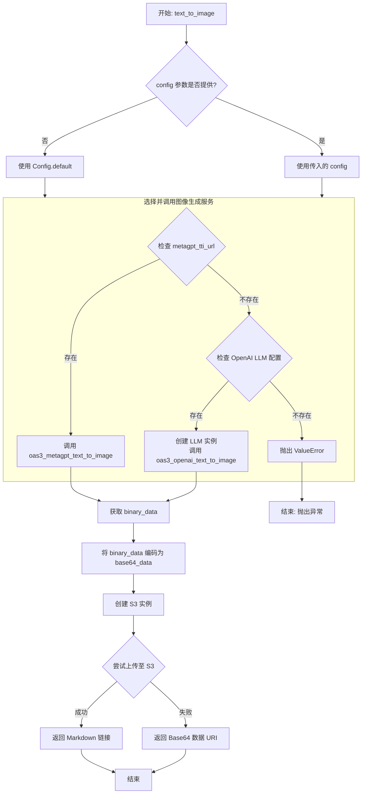
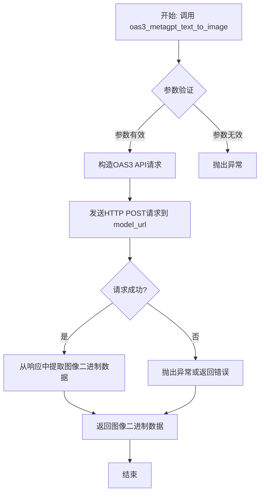
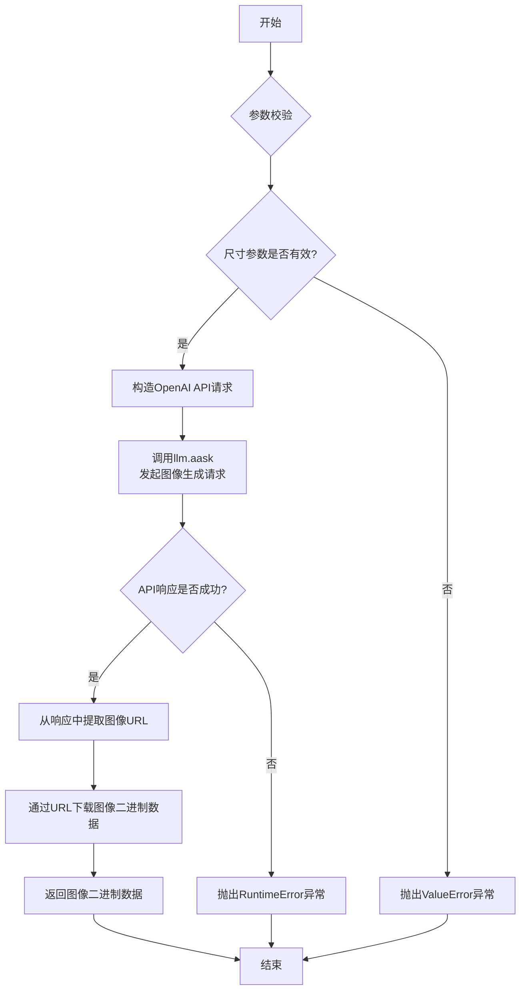
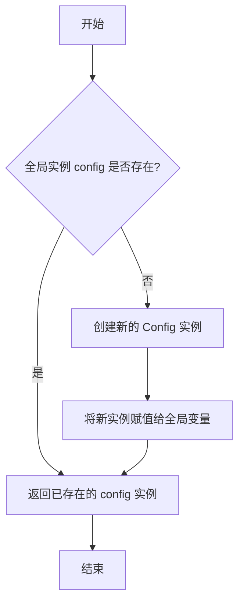
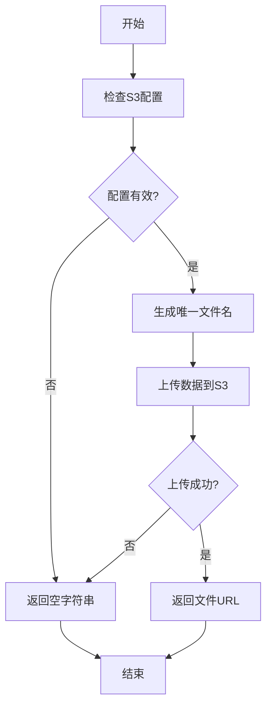

# `.\MetaGPT\metagpt\learn\text_to_image.py` 详细设计文档

该代码实现了一个文本转图像的功能，根据配置选择使用MetaGPT或OpenAI的文本转图像服务，将生成的图像数据转换为Base64编码，并可选地上传至S3存储后返回Markdown格式的图片链接或Base64数据URI。

## 整体流程

```mermaid
graph TD
    A[开始: 调用text_to_image] --> B{检查config.metagpt_tti_url?}
    B -- 是 --> C[调用oas3_metagpt_text_to_image]
    B -- 否 --> D{检查config.get_openai_llm()?}
    D -- 是 --> E[创建LLM实例并调用oas3_openai_text_to_image]
    D -- 否 --> F[抛出ValueError]
    C --> G[将二进制图像数据编码为Base64]
    E --> G
    G --> H[创建S3实例并尝试缓存数据]
    H --> I{S3缓存成功?}
    I -- 是 --> J[返回Markdown格式的图片链接]
    I -- 否 --> K[返回Base64数据URI]
    F --> L[结束: 抛出异常]
    J --> M[结束: 返回结果]
    K --> M
```

## 类结构

```
text_to_image.py
├── 全局函数: text_to_image
├── 导入类: Config, LLM, S3
└── 导入函数: oas3_metagpt_text_to_image, oas3_openai_text_to_image
```

## 全局变量及字段


### `BASE64_FORMAT`
    
用于标识数据格式为Base64编码的常量字符串，通常用于文件存储或传输时的格式标识。

类型：`str`
    


### `Config.metagpt_tti_url`
    
MetaGPT文本转图像服务的URL地址，如果配置了此URL，则使用MetaGPT的文本转图像服务。

类型：`Optional[str]`
    


### `Config.s3`
    
S3存储服务的配置信息，用于将生成的图像数据上传到S3存储并获取访问URL。

类型：`Optional[Dict]`
    
    

## 全局函数及方法


### `text_to_image`

该函数是一个文本转图像的异步功能，根据配置选择使用MetaGPT或OpenAI的文本转图像服务，将生成的图像数据转换为Base64编码，并可选地上传至S3存储后返回Markdown图片链接或Base64数据URI。

参数：

- `text`：`str`，用于图像转换的文本描述。
- `size_type`：`str`，图像尺寸类型。如果使用OpenAI，可选值为['256x256', '512x512', '1024x1024']；如果使用MetaGPT，可选值为['512x512', '512x768']。默认为"512x512"。
- `config`：`Optional[Config]`，应用程序的配置对象，包含API端点、S3设置等。如果未提供，则使用默认配置。

返回值：`str`，返回一个字符串。如果图像数据成功上传至S3，则返回Markdown格式的图片链接（如``）；否则返回Base64编码的数据URI（如`data:image/png;base64,...`）。如果生成失败，则返回空字符串。

#### 流程图



#### 带注释源码

```python
async def text_to_image(text, size_type: str = "512x512", config: Optional[Config] = None):
    """Text to image

    :param text: The text used for image conversion.
    :param size_type: If using OPENAI, the available size options are ['256x256', '512x512', '1024x1024'], while for MetaGPT, the options are ['512x512', '512x768'].
    :param config: Config
    :return: The image data is returned in Base64 encoding.
    """
    # 步骤 1: 处理配置参数。如果未提供config，则使用默认配置。
    config = config if config else Config.default()
    # 定义Base64数据URI的前缀，用于后续构建返回值。
    image_declaration = "data:image/png;base64,"

    # 步骤 2: 根据配置决定使用哪个文本转图像服务。
    model_url = config.metagpt_tti_url
    if model_url:
        # 情况 A: 如果配置了MetaGPT的服务URL，则调用其对应的函数。
        binary_data = await oas3_metagpt_text_to_image(text, size_type, model_url)
    elif config.get_openai_llm():
        # 情况 B: 如果配置了OpenAI的LLM，则创建LLM实例并调用OpenAI对应的函数。
        llm = LLM(llm_config=config.get_openai_llm())
        binary_data = await oas3_openai_text_to_image(text, size_type, llm=llm)
    else:
        # 情况 C: 两者都未配置，抛出异常。
        raise ValueError("Missing necessary parameters.")

    # 步骤 3: 将服务返回的二进制图像数据编码为Base64字符串。
    base64_data = base64.b64encode(binary_data).decode("utf-8")

    # 步骤 4: 尝试将Base64数据缓存到S3。
    s3 = S3(config.s3)  # 根据配置初始化S3客户端
    # 调用cache方法上传，指定文件扩展名为.png，格式为Base64。
    url = await s3.cache(data=base64_data, file_ext=".png", format=BASE64_FORMAT)

    # 步骤 5: 根据S3上传结果决定返回值格式。
    if url:
        # 如果上传成功，返回Markdown格式的图片链接。
        return f""
    # 如果上传失败或未配置S3，返回Base64数据URI。
    return image_declaration + base64_data if base64_data else ""
```


### `oas3_metagpt_text_to_image`

该函数是MetaGPT框架中文本转图像功能的核心实现之一，它通过调用一个符合OpenAPI Specification 3.0 (OAS3) 标准的远程图像生成服务，将输入的文本描述转换为图像数据。

参数：

-  `text`：`str`，用于描述期望生成图像的文本内容。
-  `size_type`：`str`，指定生成图像的尺寸。根据服务支持，可选值为 `'512x512'` 或 `'512x768'`。
-  `model_url`：`str`，提供文本转图像功能的远程OAS3 API服务的URL地址。

返回值：`bytes`，返回由远程服务生成的图像原始二进制数据。

#### 流程图



#### 带注释源码

```python
async def oas3_metagpt_text_to_image(text, size_type: str = "512x512", model_url: str = None):
    """
    调用符合OAS3规范的远程服务进行文本转图像。
    
    Args:
        text (str): 描述图像的文本。
        size_type (str): 图像尺寸，例如 '512x512'。
        model_url (str): 图像生成服务的API端点URL。

    Returns:
        bytes: 生成的图像二进制数据。

    Raises:
        ValueError: 当缺少必要参数（如model_url）时抛出。
        RuntimeError: 当API请求失败或响应格式不符合预期时抛出。
    """
    # 1. 参数校验：确保提供了必要的服务地址
    if not model_url:
        raise ValueError("MetaGPT TTI service URL (model_url) is required.")

    # 2. 准备请求载荷：根据OAS3接口规范构造JSON数据
    # 通常包含提示词(text)和图像尺寸(size_type)
    payload = {
        "prompt": text,
        "size": size_type,
        # 可能包含其他参数，如生成数量(n)、风格(style)等
        # "n": 1,
    }

    # 3. 发送异步HTTP POST请求
    # 使用aiohttp或httpx等异步HTTP客户端
    async with aiohttp.ClientSession() as session:
        try:
            async with session.post(model_url, json=payload) as response:
                # 4. 检查HTTP响应状态
                response.raise_for_status()
                
                # 5. 解析响应内容
                # 假设服务直接返回图像二进制流（如image/png）
                image_data = await response.read()
                return image_data
                
        except aiohttp.ClientError as e:
            # 处理网络或HTTP协议级别的错误
            raise RuntimeError(f"Failed to call TTI API: {e}")
        except Exception as e:
            # 处理其他意外错误
            raise RuntimeError(f"An unexpected error occurred during TTI call: {e}")
```


### `oas3_openai_text_to_image`

该函数是OpenAI文本转图像功能的核心实现。它接收文本描述和尺寸参数，通过调用OpenAI的DALL·E模型生成图像，并返回图像的二进制数据。

参数：
- `text`：`str`，用于生成图像的文本描述。
- `size_type`：`str`，指定生成图像的尺寸。可选值为`'256x256'`、`'512x512'`、`'1024x1024'`。
- `llm`：`LLM`，配置好的OpenAI大语言模型实例，用于发起图像生成请求。

返回值：`bytes`，生成的图像的二进制数据。

#### 流程图



#### 带注释源码

```python
async def oas3_openai_text_to_image(text: str, size_type: str, llm: LLM) -> bytes:
    """
    Generate an image from a text prompt using OpenAI's DALL·E model.

    Args:
        text (str): The text prompt for image generation.
        size_type (str): The size of the generated image. Must be one of '256x256', '512x512', '1024x1024'.
        llm (LLM): An instance of the LLM class configured for OpenAI.

    Returns:
        bytes: The binary data of the generated image.

    Raises:
        ValueError: If the size_type is not one of the allowed values.
        RuntimeError: If the OpenAI API call fails or returns an invalid response.
    """
    # 1. 定义OpenAI DALL·E模型支持的图像尺寸
    openai_size = ["256x256", "512x512", "1024x1024"]
    # 2. 校验传入的尺寸参数是否有效
    if size_type not in openai_size:
        raise ValueError(f"Size type must be one of {openai_size}")
    
    # 3. 构造符合OpenAI Images API要求的请求体
    # 模型固定为'dall-e-2'，生成数量固定为1
    data = {
        "model": "dall-e-2",
        "prompt": text,
        "n": 1,
        "size": size_type,
    }
    
    # 4. 使用配置好的LLM实例发起异步API调用
    # 这里调用了llm.aask方法，其内部会处理与OpenAI的通信
    resp = await llm.aask(data, stream=False, schema="text")
    
    # 5. 解析API响应
    # 响应是一个JSON字符串，需要解析为字典
    res = json.loads(resp)
    
    # 6. 检查响应中是否包含错误
    if "error" in res:
        # 如果存在错误字段，抛出运行时异常
        raise RuntimeError(res["error"])
    
    # 7. 从成功的响应中提取生成的图像URL
    # API返回一个包含图像信息的列表，这里取第一个元素的'url'字段
    image_url = res["data"][0]["url"]
    
    # 8. 通过HTTP请求下载图像数据
    async with aiohttp.ClientSession() as session:
        async with session.get(image_url) as response:
            # 确保HTTP请求成功
            if response.status == 200:
                # 读取并返回图像的二进制数据
                image_data = await response.read()
                return image_data
            else:
                # 如果HTTP请求失败，抛出运行时异常
                raise RuntimeError(f"Failed to download image from {image_url}, status code: {response.status}")
```

### `Config.get_openai_llm`

该方法用于从配置对象中获取OpenAI大语言模型（LLM）的配置信息。它检查配置中是否包含有效的OpenAI API密钥，如果存在则返回一个包含该密钥的LLM配置字典，否则返回None。

参数：
-  `self`：`Config`，Config类的实例，代表当前的配置对象。

返回值：`Optional[Dict]`，如果配置中包含有效的OpenAI API密钥，则返回一个字典，其结构为`{"api_key": "your-api-key"}`；否则返回None。

#### 流程图

```mermaid
flowchart TD
    A[开始] --> B{检查self.openai_api_key}
    B -- 存在且非空 --> C[返回字典<br/>{'api_key': self.openai_api_key}]
    B -- 不存在或为空 --> D[返回None]
    C --> E[结束]
    D --> E
```

#### 带注释源码

```python
def get_openai_llm(self):
    """Get openai llm config.

    Returns:
        Optional[Dict]: openai llm config dict if openai_api_key is configured, else None
    """
    # 检查当前配置对象的openai_api_key属性是否存在且非空
    if self.openai_api_key:
        # 如果存在有效的API密钥，则返回一个包含该密钥的配置字典
        return {"api_key": self.openai_api_key}
    # 如果API密钥不存在或为空，则返回None
    return None
```


### `Config.default`

`Config.default` 是一个类方法，用于获取或创建一个全局的 `Config` 单例实例。它确保在整个应用程序中，`Config` 类的配置信息是唯一且一致的。

参数：
- 无

返回值：`Config`，返回全局唯一的 `Config` 配置对象实例。

#### 流程图



#### 带注释源码

```python
    @classmethod
    def default(cls) -> "Config":
        """
        获取或创建默认的全局配置实例。
        这是一个类方法，用于实现单例模式，确保整个应用中只有一个配置实例。
        
        Returns:
            Config: 全局唯一的配置对象实例。
        """
        global _config  # 引用全局变量 _config，用于存储单例实例
        if _config is None:  # 检查全局实例是否已存在
            _config = cls()  # 如果不存在，则创建新的 Config 实例
        return _config  # 返回（可能是新建的）全局配置实例
```


### `S3.cache`

该方法用于将数据（如图片、文件等）缓存到S3存储服务中，并返回一个可访问的URL。如果缓存成功，返回URL；否则返回空字符串。

参数：

- `data`：`str`，需要缓存的数据，可以是Base64编码的字符串或其他格式的数据。
- `file_ext`：`str`，文件扩展名，用于指定缓存文件的格式，例如：`.png`、`.jpg`等。
- `format`：`str`，数据的格式，例如：`BASE64_FORMAT`表示数据为Base64编码。

返回值：`str`，返回缓存文件的URL（如果缓存成功），否则返回空字符串。

#### 流程图



#### 带注释源码

```python
async def cache(self, data: str, file_ext: str, format: str = "") -> str:
    """
    将数据缓存到S3存储服务中，并返回可访问的URL。

    :param data: 需要缓存的数据，可以是Base64编码的字符串或其他格式的数据。
    :param file_ext: 文件扩展名，用于指定缓存文件的格式，例如：`.png`、`.jpg`等。
    :param format: 数据的格式，例如：`BASE64_FORMAT`表示数据为Base64编码。
    :return: 缓存文件的URL（如果缓存成功），否则返回空字符串。
    """
    # 检查S3配置是否有效
    if not self.config:
        return ""

    # 生成唯一的文件名
    filename = self._generate_filename(file_ext)

    try:
        # 根据数据格式处理数据
        if format == BASE64_FORMAT:
            # 如果是Base64格式，解码为二进制数据
            binary_data = base64.b64decode(data)
        else:
            # 否则直接使用原始数据
            binary_data = data.encode("utf-8")

        # 上传数据到S3存储服务
        url = await self._upload_to_s3(binary_data, filename)
        return url
    except Exception as e:
        # 处理上传过程中的异常
        logger.error(f"Failed to cache data to S3: {e}")
        return ""
```


## 关键组件


### 文本转图像核心函数

提供异步文本转图像功能，根据配置选择不同的后端服务（MetaGPT TTI 或 OpenAI DALL-E），处理图像数据并返回Base64编码结果或S3存储链接。

### 配置管理

通过`Config`对象管理应用程序配置，决定使用哪个文本转图像服务（MetaGPT TTI URL 或 OpenAI LLM 配置）以及S3存储设置。

### 服务适配器

包含`oas3_metagpt_text_to_image`和`oas3_openai_text_to_image`两个适配器函数，分别封装了对MetaGPT TTI服务和OpenAI DALL-E服务的具体调用逻辑。

### 数据编码与存储

使用`base64`模块进行二进制图像数据的编码，并通过`S3`类提供的方法将Base64数据缓存到对象存储服务中，返回可访问的URL。

### 结果格式化

根据处理结果，智能地返回Markdown格式的图片链接（当数据成功存入S3时）或直接返回内联的Base64数据URI字符串。


## 问题及建议


### 已知问题

-   **错误处理不充分**：代码中仅通过`ValueError`处理缺少必要参数的情况，对于网络请求失败、S3上传失败、图像生成服务返回错误等其他潜在异常缺乏捕获和处理，可能导致程序意外终止。
-   **配置依赖模糊**：功能逻辑严重依赖外部配置（`config.metagpt_tti_url`, `config.get_openai_llm()`），但未在函数签名或文档中明确说明这些配置项的优先级、必需性以及默认值的来源，增加了使用和调试的复杂度。
-   **硬编码与灵活性不足**：图像格式（`image/png`）、文件扩展名（`.png`）以及返回的Markdown链接格式被硬编码在函数中。如果未来需要支持其他图像格式（如JPEG、WebP）或不同的链接表示方式，需要修改代码。
-   **潜在的资源泄漏**：函数中创建了`S3`对象，但代码中没有显示其资源（如网络连接）的清理或关闭逻辑，在长期运行或高并发场景下可能存在问题。
-   **返回值不一致**：函数根据S3上传是否成功返回两种完全不同格式的字符串（Markdown链接或Base64数据URI）。这种不一致性会给调用方带来额外的解析负担，并可能违反单一职责原则。

### 优化建议

-   **增强健壮性与错误处理**：使用更广泛的`try-except`块来捕获`oas3_metagpt_text_to_image`、`oas3_openai_text_to_image`、`s3.cache`等操作可能抛出的异常（如`ConnectionError`, `TimeoutError`, `ClientError`等）。可以定义自定义异常类，使错误信息更清晰，并考虑加入重试机制。
-   **明确配置契约与注入**：在函数文档字符串中详细说明`config`参数所需的具体属性及其优先级（例如，优先使用`metagpt_tti_url`）。考虑将必要的配置项作为独立参数传入，而非依赖整个`Config`对象，以降低耦合度。
-   **提高可配置性与可扩展性**：将图像格式（MIME type）、文件扩展名、返回的链接模板（如``）作为可配置参数或从配置中读取。这提高了代码的灵活性，便于适应未来需求变化。
-   **确保资源管理**：确保`S3`客户端或其他可能持有资源的对象在使用后能被正确清理。可以考虑使用上下文管理器（`async with`）或确保在函数结束时调用清理方法。
-   **统一返回值设计**：重新考虑函数的设计目标。可以始终返回一个包含图像数据（Base64）和可能URL的结构化对象（如字典或Pydantic模型），或者根据一个明确的参数（如`return_type: Literal[‘url‘, ‘base64‘]`）决定返回格式，使接口行为更可预测。
-   **代码结构与单一职责**：考虑将“选择图像生成服务”的逻辑、“编码与上传”的逻辑、“格式化返回结果”的逻辑拆分为更小的、可测试的独立函数或类方法。这符合单一职责原则，并使主函数`text_to_image`的流程更清晰。
-   **补充单元测试**：为不同的配置路径（MetaGPT URL、OpenAI LLM）、成功/失败场景以及S3上传成功/失败的情况编写全面的单元测试，以确保代码质量。


## 其它


### 设计目标与约束

1.  **核心目标**：提供一个统一的、可配置的文本生成图像（Text-to-Image, TTI）服务接口，支持对接不同的后端图像生成模型（如OpenAI DALL-E和自定义的MetaGPT TTI服务）。
2.  **关键约束**：
    *   **配置驱动**：功能选择（使用哪个后端服务）和参数（如服务端点URL、API密钥）应完全由外部配置（`Config`对象）决定，代码逻辑不硬编码。
    *   **输出标准化**：无论使用哪个后端，最终输出应统一为可嵌入的Markdown图片链接或Base64数据URI格式，便于在文档或聊天上下文中直接使用。
    *   **异步支持**：所有网络I/O操作（调用外部API、上传至对象存储）必须是异步的，以避免阻塞主线程。
    *   **缓存与持久化**：生成的图像应能可选地持久化到对象存储（如S3），并返回一个可访问的URL，以支持大图像或长期存储场景，避免Base64编码导致数据传输臃肿。
3.  **非功能性目标**：
    *   **可扩展性**：通过策略模式（`oas3_metagpt_text_to_image` 和 `oas3_openai_text_to_image` 函数）支持未来轻松接入新的文本生成图像服务提供商。
    *   **容错性**：当配置不完整或后端服务调用失败时，应有清晰的错误提示。

### 错误处理与异常设计

1.  **输入验证**：函数入口处未对`text`和`size_type`参数进行显式有效性检查（如非空、尺寸枚举值校验）。当前依赖后端API的验证，这可能导致错误信息不直观或请求延迟。
2.  **配置缺失处理**：代码通过检查`config.metagpt_tti_url`和`config.get_openai_llm()`来决定使用哪个后端。如果两者都未配置，会抛出`ValueError("Missing necessary parameters.")`。这是一个明确的配置错误。
3.  **服务调用异常**：`oas3_metagpt_text_to_image`和`oas3_openai_text_to_image`函数内部应处理HTTP请求异常（如连接超时、状态码非200、响应解析失败等），并向上抛出适当的异常（如`ConnectionError`, `RuntimeError`）。当前函数文档未明确说明，但调用方应准备捕获这些异常。
4.  **S3操作异常**：`S3.cache`方法可能因网络问题、权限错误或存储空间不足而失败。当前代码在`url`为`None`时回退到Base64数据URI，这是一种优雅降级策略，但可能丢失了失败的具体原因，不利于调试和监控。
5.  **建议的增强**：
    *   在函数开始处添加参数校验，并抛出`ValueError`。
    *   考虑定义更细粒度的自定义异常类（如`TTIConfigError`, `TTIServiceError`, `TTIStorageError`），使错误处理更精确。
    *   为`S3.cache`的失败添加日志记录。

### 数据流与状态机

1.  **数据流**：
    *   **输入**：用户提供的`text`（字符串）、`size_type`（字符串，代表图像尺寸）、`config`（`Config`对象，包含认证信息和服务端点）。
    *   **处理**：
        *   根据`config`选择执行路径（MetaGPT TTI服务 或 OpenAI TTI服务）。
        *   调用相应的外部API，获取原始的图像二进制数据（`binary_data`）。
        *   将二进制数据编码为Base64字符串（`base64_data`）。
        *   尝试将Base64数据上传至配置的S3存储，获取一个可访问的URL。
    *   **输出**：
        *   **成功上传S3**：返回Markdown格式的图片链接，例如``。
        *   **S3上传失败或未启用**：返回Base64数据URI，例如`data:image/png;base64,...`。
        *   **处理失败**：抛出异常。
2.  **状态机（简化）**：
    *   **状态**：`初始` -> `配置校验` -> `调用服务` -> `编码数据` -> `存储尝试` -> `完成（URL输出）` 或 `完成（Base64输出）`。
    *   **分支**：在`配置校验`后，根据配置选择`调用服务`的分支（MetaGPT 或 OpenAI）。在`存储尝试`后，根据S3操作结果选择输出格式。
    *   该过程是线性的，没有循环或复杂的状态转移，主要是一个条件分支的管道流程。

### 外部依赖与接口契约

1.  **外部依赖**：
    *   **MetaGPT TTI 服务**：一个通过HTTP/HTTPS访问的、符合OAS3（OpenAPI Specification 3）规范的RESTful API。依赖`metagpt.tools.metagpt_text_to_image.oas3_metagpt_text_to_image`函数进行调用。契约包括请求方法（POST）、端点（由`config.metagpt_tti_url`提供）、请求体格式（包含`text`和`size`）、以及成功响应返回图像二进制流。
    *   **OpenAI TTI API (DALL-E)**：依赖`metagpt.tools.openai_text_to_image.oas3_openai_text_to_image`函数进行调用。该函数内部使用OpenAI SDK，需要有效的API Key（通过`config.get_openai_llm()`获取的`LLM`配置）。契约由OpenAI官方API定义。
    *   **对象存储服务 (S3兼容)**：依赖`metagpt.utils.s3.S3`类。契约包括存储桶访问权限、上传接口（`cache`方法），要求能接收Base64字符串和文件扩展名，并返回一个可公开访问的URL。
2.  **接口契约（本模块提供）**：
    *   **函数**：`async def text_to_image(text, size_type: str = "512x512", config: Optional[Config] = None)`
    *   **前置条件**：调用者必须提供有效的`text`。`config`参数应包含至少一个可用的TTI后端配置（MetaGPT URL 或 OpenAI LLM配置）。如果希望使用S3缓存，`config.s3`也必须正确配置。
    *   **后置条件**：函数返回一个字符串。成功时，该字符串要么是Markdown图片链接，要么是Base64数据URI，均代表由输入文本生成的图像。失败时抛出异常。
    *   **副作用**：可能产生网络请求（调用TTI服务、调用S3服务），并可能在S3存储桶中创建新的对象。

    