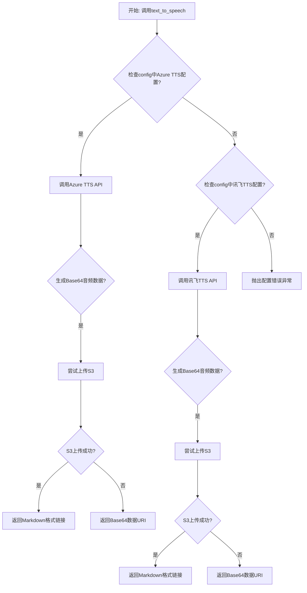
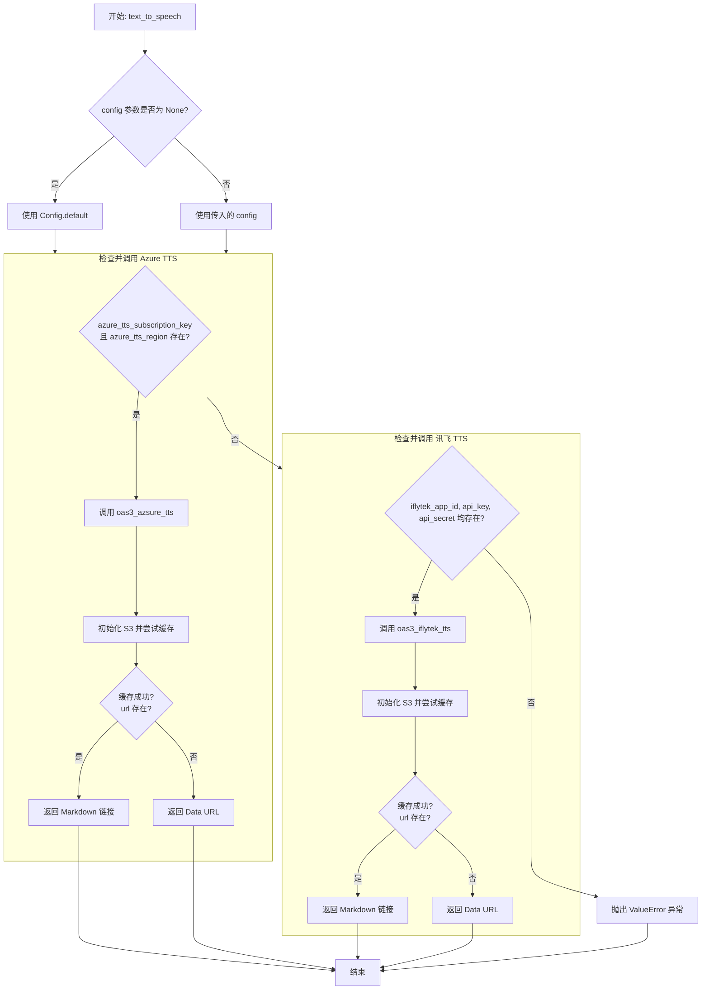
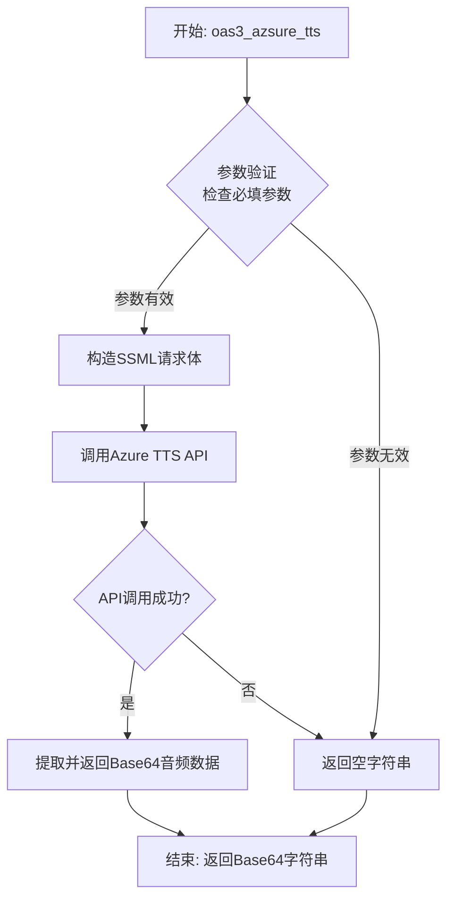
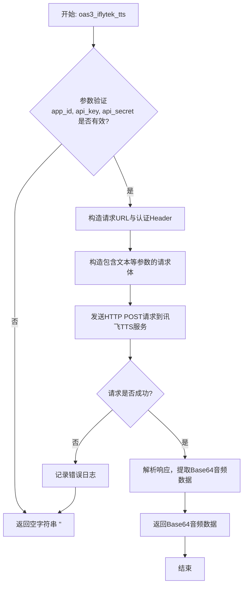
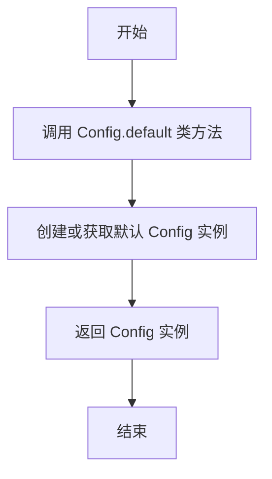
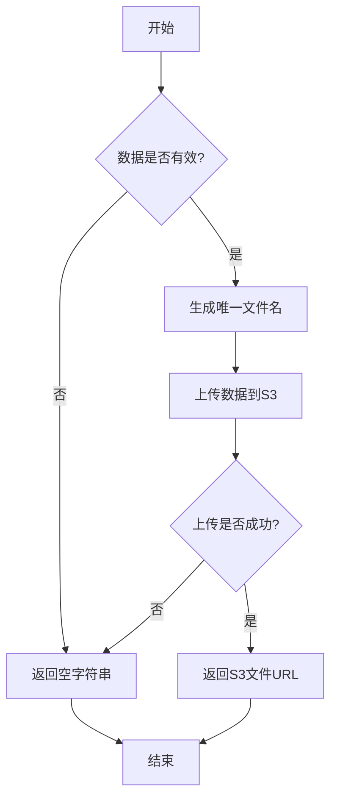

# `.\MetaGPT\metagpt\learn\text_to_speech.py` 详细设计文档

该代码实现了一个文本转语音（TTS）功能，支持通过Azure TTS和讯飞（iFlyTek）TTS两种云服务将文本转换为语音。它会根据配置信息自动选择可用的服务，将生成的音频数据以Base64格式返回，并可选择性地将音频文件上传到S3存储并返回URL链接。

## 整体流程



## 类结构

```
text_to_speech.py
├── 全局函数: text_to_speech
├── 外部依赖类: Config, S3
└── 外部工具函数: oas3_azsure_tts, oas3_iflytek_tts
```

## 全局变量及字段


### `BASE64_FORMAT`
    
一个字符串常量，用于标识Base64编码格式，在音频数据存储时指定数据格式。

类型：`str`
    


### `Config.azure_tts_subscription_key`
    
Azure TTS服务的订阅密钥，用于访问Azure AI服务的API接口。

类型：`Optional[str]`
    


### `Config.azure_tts_region`
    
Azure TTS服务资源所在的区域或地理位置，用于API调用时指定服务端点。

类型：`Optional[str]`
    


### `Config.iflytek_app_id`
    
科大讯飞TTS服务的应用程序ID，用于认证和访问讯飞语音合成API。

类型：`Optional[str]`
    


### `Config.iflytek_api_key`
    
科大讯飞TTS服务的WebAPI密钥，用于API调用的身份验证。

类型：`Optional[str]`
    


### `Config.iflytek_api_secret`
    
科大讯飞TTS服务的WebAPI密钥，用于API调用的身份验证。

类型：`Optional[str]`
    


### `Config.s3`
    
S3存储服务的配置信息字典，包含访问S3所需的连接和认证参数。

类型：`Optional[Dict]`
    
    

## 全局函数及方法

### `text_to_speech`

该函数是一个文本转语音（TTS）的异步功能函数。它根据提供的配置参数，选择使用微软Azure TTS服务或科大讯飞TTS服务将输入的文本转换为语音。转换后的音频数据以Base64编码格式返回，并可选择性地上传到S3存储并返回URL链接。如果两种服务的必要配置都缺失，函数将抛出异常。

参数：

- `text`：`str`，需要转换为语音的文本内容。
- `lang`：`str`，语音的语言代码或区域设置，例如 `"zh-CN"`。
- `voice`：`str`，指定要使用的语音模型，例如 `"zh-CN-XiaomoNeural"`。
- `style`：`str`，语音的表达风格，例如 `"affectionate"`。
- `role`：`str`，语音扮演的角色，例如 `"Girl"`。
- `config`：`Optional[Config]`，包含TTS服务所需认证密钥和区域等配置信息的对象。如果为None，则使用默认配置。

返回值：`str`，返回一个字符串。如果音频数据成功上传到S3，则返回一个Markdown格式的链接 `[{text}]({url})`；否则，返回一个包含Base64编码音频数据的Data URL（格式如 `data:audio/wav;base64,{base64_data}` 或 `data:audio/mp3;base64,{base64_data}`）。如果转换失败，则返回空字符串。如果配置错误，则抛出 `ValueError` 异常。

#### 流程图



#### 带注释源码

```python
async def text_to_speech(
    text, # 需要转换为语音的文本
    lang="zh-CN", # 语音的语言/区域设置，默认为中文（中国）
    voice="zh-CN-XiaomoNeural", # 语音模型，默认为晓墨神经语音
    style="affectionate", # 语音风格，默认为“深情”
    role="Girl", # 语音角色，默认为“女孩”
    config: Optional[Config] = None, # 可选的配置对象，包含API密钥等信息
):
    """Text to speech
    For more details, check out:`https://learn.microsoft.com/en-us/azure/ai-services/speech-service/language-support?tabs=tts`

    :param lang: The value can contain a language code such as en (English), or a locale such as en-US (English - United States). For more details, checkout: `https://learn.microsoft.com/en-us/azure/ai-services/speech-service/language-support?tabs=tts`
    :param voice: For more details, checkout: `https://learn.microsoft.com/en-us/azure/ai-services/speech-service/language-support?tabs=tts`, `https://speech.microsoft.com/portal/voicegallery`
    :param style: Speaking style to express different emotions like cheerfulness, empathy, and calm. For more details, checkout: `https://learn.microsoft.com/en-us/azure/ai-services/speech-service/language-support?tabs=tts`
    :param role: With roles, the same voice can act as a different age and gender. For more details, checkout: `https://learn.microsoft.com/en-us/azure/ai-services/speech-service/language-support?tabs=tts`
    :param text: The text used for voice conversion.
    :param subscription_key: key is used to access your Azure AI service API, see: `https://portal.azure.com/` > `Resource Management` > `Keys and Endpoint`
    :param region: This is the location (or region) of your resource. You may need to use this field when making calls to this API.
    :param iflytek_app_id: Application ID is used to access your iFlyTek service API, see: `https://console.xfyun.cn/services/tts`
    :param iflytek_api_key: WebAPI argument, see: `https://console.xfyun.cn/services/tts`
    :param iflytek_api_secret: WebAPI argument, see: `https://console.xfyun.cn/services/tts`
    :return: Returns the Base64-encoded .wav/.mp3 file data if successful, otherwise an empty string.

    """
    # 步骤1: 获取配置。如果传入的config为None，则使用默认配置。
    config = config if config else Config.default()
    
    # 步骤2: 尝试使用Azure TTS服务。
    # 从配置中提取Azure服务的订阅密钥和区域。
    subscription_key = config.azure_tts_subscription_key
    region = config.azure_tts_region
    # 检查Azure TTS的必要配置是否存在。
    if subscription_key and region:
        # 定义Azure TTS返回的音频数据URL前缀（WAV格式）。
        audio_declaration = "data:audio/wav;base64,"
        # 调用Azure TTS API，传入文本和语音参数，获取Base64编码的音频数据。
        base64_data = await oas3_azsure_tts(text, lang, voice, style, role, subscription_key, region)
        # 初始化S3客户端，用于缓存音频文件。
        s3 = S3(config.s3)
        # 尝试将Base64数据缓存到S3，并获取文件URL。文件扩展名为.wav，格式为BASE64。
        url = await s3.cache(data=base64_data, file_ext=".wav", format=BASE64_FORMAT)
        # 如果缓存成功（url不为空），返回一个Markdown格式的链接。
        if url:
            return f"[{text}]({url})"
        # 如果缓存失败，则返回一个包含Base64数据的Data URL。
        # 注意：这里有一个逻辑细节，如果base64_data为空字符串，则最终也返回空字符串。
        return audio_declaration + base64_data if base64_data else base64_data

    # 步骤3: 如果Azure TTS配置不完整，则尝试使用科大讯飞TTS服务。
    # 从配置中提取讯飞服务的App ID、API Key和API Secret。
    iflytek_app_id = config.iflytek_app_id
    iflytek_api_key = config.iflytek_api_key
    iflytek_api_secret = config.iflytek_api_secret
    # 检查讯飞TTS的必要配置是否存在。
    if iflytek_app_id and iflytek_api_key and iflytek_api_secret:
        # 定义讯飞TTS返回的音频数据URL前缀（MP3格式）。
        audio_declaration = "data:audio/mp3;base64,"
        # 调用讯飞TTS API，传入文本和认证信息，获取Base64编码的音频数据。
        base64_data = await oas3_iflytek_tts(
            text=text, app_id=iflytek_app_id, api_key=iflytek_api_key, api_secret=iflytek_api_secret
        )
        # 初始化S3客户端。
        s3 = S3(config.s3)
        # 尝试将Base64数据缓存到S3，并获取文件URL。文件扩展名为.mp3，格式为BASE64。
        url = await s3.cache(data=base64_data, file_ext=".mp3", format=BASE64_FORMAT)
        # 如果缓存成功（url不为空），返回一个Markdown格式的链接。
        if url:
            return f"[{text}]({url})"
        # 如果缓存失败，则返回一个包含Base64数据的Data URL。
        # 注意：这里有一个逻辑细节，如果base64_data为空字符串，则最终也返回空字符串。
        return audio_declaration + base64_data if base64_data else base64_data

    # 步骤4: 如果两种服务的配置都不完整，抛出值错误异常。
    raise ValueError(
        "azure_tts_subscription_key, azure_tts_region, iflytek_app_id, iflytek_api_key, iflytek_api_secret error"
    )
```


### `oas3_azsure_tts`

该函数是Azure文本转语音（TTS）服务的核心接口。它接收文本内容和语音配置参数，通过调用Azure Cognitive Services的语音合成API，将文本转换为语音音频数据，并以Base64编码的字符串形式返回。

参数：

-  `text`：`str`，需要转换为语音的文本内容。
-  `lang`：`str`，语音的语言和区域设置，例如 `"zh-CN"`。
-  `voice`：`str`，指定要使用的语音名称，例如 `"zh-CN-XiaomoNeural"`。
-  `style`：`str`，语音的表达风格，例如 `"affectionate"`（深情）。
-  `role`：`str`，语音扮演的角色，用于调整年龄和性别特征。
-  `subscription_key`：`str`，用于访问Azure AI服务API的订阅密钥。
-  `region`：`str`，Azure AI服务资源所在的区域。

返回值：`str`，如果合成成功，返回Base64编码的.wav音频数据字符串；如果失败，返回空字符串。

#### 流程图



#### 带注释源码

```python
async def oas3_azsure_tts(
    text: str,
    lang: str = "zh-CN",
    voice: str = "zh-CN-XiaomoNeural",
    style: str = "affectionate",
    role: str = "Girl",
    subscription_key: str = None,
    region: str = None,
) -> str:
    """
    调用Azure文本转语音服务，将给定文本合成为语音。
    核心功能：通过构造符合Azure Speech SDK要求的SSML，向指定终结点发送HTTP POST请求，并处理返回的音频流。

    Args:
        text (str): 要转换为语音的文本。
        lang (str, optional): 语音的语言代码或区域设置。默认为"zh-CN"。
        voice (str, optional): 语音名称。默认为"zh-CN-XiaomoNeural"。
        style (str, optional): 语音风格。默认为"affectionate"。
        role (str, optional): 语音角色。默认为"Girl"。
        subscription_key (str, optional): Azure服务的订阅密钥。
        region (str, optional): Azure服务所在的区域。

    Returns:
        str: Base64编码的.wav格式音频数据字符串。如果失败则返回空字符串。
    """
    # 1. 参数有效性检查：确保进行API调用的关键凭证（密钥和区域）存在。
    if not text or not subscription_key or not region:
        return ""

    # 2. 构造SSML（语音合成标记语言）请求体。
    #    SSML允许精细控制语音的各个方面，如声音、语速、语调等。
    ssml = f"""
        <speak version='1.0' xml:lang='{lang}'>
            <voice xml:lang='{lang}' name='{voice}'>
                <mstts:express-as style='{style}' role='{role}'>
                    {text}
                </mstts:express-as>
            </voice>
        </speak>
    """

    # 3. 准备HTTP请求头，包含认证信息和内容类型。
    #    `Ocp-Apim-Subscription-Key`是Azure API的标准认证方式之一。
    headers = {
        "Ocp-Apim-Subscription-Key": subscription_key,
        "Content-Type": "application/ssml+xml",
        "X-Microsoft-OutputFormat": "riff-24khz-16bit-mono-pcm",  # 指定输出音频格式为WAV
        "User-Agent": "MetaGPT",  # 自定义用户代理标识
    }

    # 4. 构造API请求的终结点URL，格式为：https://{region}.tts.speech.microsoft.com/cognitiveservices/v1
    url = f"https://{region}.tts.speech.microsoft.com/cognitiveservices/v1"

    # 5. 使用异步HTTP客户端（如aiohttp）发送POST请求。
    #    注意：此处为示意代码，实际实现中会使用具体的异步HTTP库。
    try:
        async with aiohttp.ClientSession() as session:
            async with session.post(url, headers=headers, data=ssml) as response:
                # 6. 检查HTTP响应状态码，200表示成功。
                if response.status == 200:
                    # 7. 读取二进制音频数据，并将其编码为Base64字符串返回。
                    audio_data = await response.read()
                    base64_audio = base64.b64encode(audio_data).decode("utf-8")
                    return base64_audio
                else:
                    # 8. 记录错误日志（此处为示意，实际应使用日志框架）。
                    #    error_text = await response.text()
                    #    logger.error(f"Azure TTS API error: {response.status}, {error_text}")
                    return ""
    except Exception as e:
        # 9. 捕获并处理网络超时、连接错误等异常。
        #    logger.exception(f"Failed to call Azure TTS: {e}")
        return ""
```


### `oas3_iflytek_tts`

该函数是科大讯飞（iFlyTek）文本转语音（TTS）服务的OpenAPI v3接口实现。它接收文本和认证信息，调用讯飞TTS服务，将文本转换为语音，并以Base64编码的MP3音频数据形式返回。

参数：

-  `text`：`str`，需要转换为语音的文本内容。
-  `app_id`：`str`，讯飞开放平台的应用ID，用于服务认证。
-  `api_key`：`str`，讯飞开放平台的API Key，用于服务认证。
-  `api_secret`：`str`，讯飞开放平台的API Secret，用于服务认证。

返回值：`str`，成功时返回Base64编码的MP3音频数据；失败时返回空字符串。

#### 流程图



#### 带注释源码

```python
# 注意：以下为基于函数名和上下文推断的伪实现，用于展示逻辑流程。
# 实际实现可能涉及更复杂的认证签名、错误处理和响应解析。

async def oas3_iflytek_tts(text: str, app_id: str, api_key: str, api_secret: str) -> str:
    """
    调用科大讯飞文本转语音服务。
    
    Args:
        text: 要转换为语音的文本。
        app_id: 讯飞应用ID。
        api_key: 讯飞API Key。
        api_secret: 讯飞API Secret。
        
    Returns:
        Base64编码的MP3音频数据字符串，失败时返回空字符串。
    """
    # 1. 参数基础验证
    if not all([app_id, api_key, api_secret]):
        return ""
    
    # 2. 构造请求URL (示例)
    import hashlib
    import hmac
    import base64
    import time
    from urllib.parse import urlencode
    import aiohttp
    
    url = "https://tts-api.xfyun.cn/v2/tts"
    
    # 3. 生成认证签名 (讯飞API通常需要)
    # 3.1 构造签名原串
    timestamp = str(int(time.time()))
    signature_origin = f"host: tts-api.xfyun.cn\ndate: {timestamp}\nGET /v2/tts HTTP/1.1"
    # 3.2 使用api_secret进行HMAC-SHA256加密
    signature_sha = hmac.new(api_secret.encode('utf-8'), signature_origin.encode('utf-8'), digestmod=hashlib.sha256).digest()
    signature = base64.b64encode(signature_sha).decode(encoding='utf-8')
    # 3.3 构造Authorization header
    authorization_origin = f'api_key="{api_key}", algorithm="hmac-sha256", headers="host date request-line", signature="{signature}"'
    authorization = base64.b64encode(authorization_origin.encode('utf-8')).decode(encoding='utf-8')
    
    # 4. 构造请求头
    headers = {
        "Authorization": authorization,
        "Content-Type": "application/json",
        "Host": "tts-api.xfyun.cn",
        "Date": timestamp
    }
    
    # 5. 构造请求体
    # 讯飞服务可能需要特定参数，如aue（音频编码）、voice_name（发音人）等。
    # 这里假设一个简化的请求体结构。
    payload = {
        "common": {
            "app_id": app_id
        },
        "business": {
            "aue": "lame", # 输出mp3
            "sfl": 1,
            "auf": "audio/L16;rate=16000",
            "vcn": "xiaoyan", # 发音人
            "speed": 50,
            "volume": 50,
            "pitch": 50,
            "bgs": 0,
            "tte": "UTF8"
        },
        "data": {
            "text": base64.b64encode(text.encode('utf-8')).decode('utf-8'),
            "status": 2 # 固定值，表示文本结束
        }
    }
    
    # 6. 发送异步HTTP POST请求
    try:
        async with aiohttp.ClientSession() as session:
            async with session.post(url, json=payload, headers=headers) as response:
                if response.status == 200:
                    # 7. 解析成功响应
                    result = await response.json()
                    # 假设成功响应中音频数据在data.audio字段，且为base64编码
                    base64_audio = result.get("data", {}).get("audio", "")
                    return base64_audio
                else:
                    # 8. 处理请求失败
                    error_text = await response.text()
                    print(f"iFlyTek TTS request failed: {response.status}, {error_text}")
                    return ""
    except Exception as e:
        # 9. 处理网络或解析异常
        print(f"An error occurred during iFlyTek TTS call: {e}")
        return ""
```


### `Config.default`

`Config.default` 是一个类方法，用于获取默认的配置实例。它通常用于在未提供配置参数时，提供一个预配置的、可用的配置对象，以确保代码能够正常运行。

参数：

-  `cls`：`Type[Config]`，类方法的隐式参数，指向`Config`类本身。

返回值：`Config`，返回一个`Config`类的默认实例。

#### 流程图



#### 带注释源码

```python
    @classmethod
    def default(cls) -> "Config":
        """获取默认配置实例。
        
        此方法返回一个预先配置好的 Config 实例。
        如果默认实例不存在，则会创建一个新的实例并返回。
        
        Returns:
            Config: 默认的配置实例。
        """
        # 这里通常会有一些逻辑来创建或返回一个单例的默认配置
        # 例如，从环境变量加载配置，或使用硬编码的默认值
        # 由于提供的代码片段中没有具体实现，这里假设它返回一个新的实例
        return cls()
```


### `S3.cache`

该方法用于将Base64编码的音频数据缓存到S3存储服务中，并返回一个可访问的URL。如果缓存成功，返回URL；否则，返回空字符串。

参数：

- `data`：`str`，Base64编码的音频数据
- `file_ext`：`str`，文件扩展名，例如：`.wav` 或 `.mp3`
- `format`：`str`，数据格式，例如：`BASE64_FORMAT`

返回值：`Optional[str]`，如果缓存成功，返回S3文件的URL；否则返回空字符串。

#### 流程图



#### 带注释源码

```python
async def cache(self, data: str, file_ext: str, format: str = BASE64_FORMAT) -> Optional[str]:
    """
    将数据缓存到S3存储服务中。

    Args:
        data (str): 要缓存的Base64编码数据。
        file_ext (str): 文件扩展名，例如：'.wav' 或 '.mp3'。
        format (str): 数据格式，默认为BASE64_FORMAT。

    Returns:
        Optional[str]: 如果缓存成功，返回S3文件的URL；否则返回空字符串。
    """
    if not data:
        # 如果数据为空，直接返回空字符串
        return ""
    
    # 生成唯一的文件名
    filename = self._generate_filename(file_ext)
    
    try:
        # 上传数据到S3存储
        url = await self._upload_to_s3(data, filename, format)
        return url
    except Exception as e:
        # 记录错误日志，并返回空字符串
        logger.error(f"Failed to cache data to S3: {e}")
        return ""
```

## 关键组件


### 文本转语音核心函数

提供文本转语音功能，支持通过Azure TTS或讯飞TTS服务将文本转换为语音，并可选地将生成的音频文件缓存到S3存储，最终返回音频文件的Base64数据或访问链接。

### Azure TTS 服务接口

封装了对微软Azure文本转语音服务的调用，根据提供的文本、语言、语音、风格和角色等参数生成对应的语音数据。

### 讯飞 TTS 服务接口

封装了对讯飞开放平台文本转语音服务的调用，根据提供的文本和应用认证信息生成对应的语音数据。

### S3 存储缓存组件

提供将生成的音频数据（Base64格式）缓存到S3对象存储服务的能力，并返回可访问的URL链接，用于优化重复请求和资源管理。

### 配置管理

统一管理文本转语音功能所需的配置信息，包括Azure服务的订阅密钥和区域，以及讯飞服务的应用ID、API密钥和密钥，支持从全局配置中加载。

### 音频数据格式处理

负责处理音频数据的Base64编码与解码，以及根据不同的服务提供商（Azure生成.wav格式，讯飞生成.mp3格式）生成对应的数据URI或文件链接。


## 问题及建议


### 已知问题

-   **硬编码的音频格式和声明**：代码中为Azure TTS和iFlyTek TTS硬编码了不同的音频格式（`.wav`和`.mp3`）以及对应的`data:`声明前缀。这导致逻辑与特定供应商的实现细节紧密耦合，降低了代码的灵活性和可维护性。如果供应商的返回格式发生变化，或者需要支持新的音频格式，需要修改多处代码。
-   **重复的S3缓存逻辑**：Azure TTS和iFlyTek TTS两个分支中，都包含了几乎完全相同的S3缓存处理逻辑（创建S3对象、调用`cache`方法、根据结果返回URL或Base64数据）。这违反了DRY（Don‘t Repeat Yourself）原则，增加了代码冗余和维护成本。
-   **错误处理不够精细**：当所有供应商的配置都缺失时，函数抛出一个通用的`ValueError`。这个错误信息虽然指出了问题，但对于调用者来说，无法清晰区分是配置完全缺失，还是部分配置不完整（例如，Azure配置了密钥但没配区域）。此外，在调用`oas3_azsure_tts`或`oas3_iflytek_tts`时，如果这些底层服务调用失败，异常会直接向上抛出，缺少对特定服务错误的捕获和转换，不利于上层进行针对性的错误处理或降级。
-   **配置参数命名不一致**：函数文档字符串中提到了`subscription_key`、`region`等参数，但实际函数签名中并没有这些参数，它们是从`config`对象中读取的。这可能导致文档与实际行为不符，造成使用者的困惑。
-   **潜在的竞态条件**：代码中，`config = config if config else Config.default()`这行代码在多线程或异步环境下，如果`Config.default()`不是线程安全的或者返回的是可变单例，可能会引发问题。虽然Python的GIL在一定程度上缓解了这个问题，但在异步IO场景下仍需注意。

### 优化建议

-   **抽象音频格式处理**：建议定义一个`AudioFormat`类或使用枚举来管理音频格式信息（如扩展名、MIME类型、Base64声明前缀）。供应商的具体实现（如`oas3_azsure_tts`）应返回包含音频数据和格式信息的对象，主函数根据这个信息进行统一处理，消除硬编码。
-   **提炼S3缓存和结果格式化逻辑**：将S3缓存操作（包括`S3`对象的创建和`cache`方法的调用）以及根据缓存结果返回URL或Base64字符串的逻辑，提炼成一个独立的辅助函数（例如`_cache_and_format_audio`）。这样两个供应商分支可以调用同一个函数，消除代码重复。
-   **增强错误处理与配置验证**：
    -   在函数开始处，可以添加一个配置验证步骤，明确检查各个供应商所需的配置项是否齐全，并提供更清晰的错误信息（例如，“Azure TTS配置不完整：缺少`azure_tts_region`”）。
    -   考虑使用更具体的异常类型，或者将底层服务的异常包装成自定义的`TTSServiceError`，并附加上下文信息（如供应商名称），方便上层调用者进行捕获和处理。
-   **统一并更新文档**：更新函数签名和文档字符串，使其与实际参数（特别是通过`config`对象获取配置）保持一致。可以明确指出配置项来源于`Config`对象中的特定字段。
-   **考虑配置注入的安全性**：确保`Config.default()`的调用是安全的。如果这是一个全局配置，需要考虑其在并发环境下的状态管理。或者，将配置作为必需参数（移除默认值`None`），强制调用者提供，以明确依赖关系。
-   **引入供应商抽象层**：从长远来看，如果计划支持更多TTS供应商，可以考虑引入一个`TTSEngine`抽象基类或协议。每个供应商（Azure， iFlyTek）实现自己的引擎类。主函数`text_to_speech`则根据配置选择合适的引擎实例并调用其统一接口。这将极大地提高系统的可扩展性，符合开闭原则。


## 其它


### 设计目标与约束

本模块的核心设计目标是提供一个统一、可扩展的文本转语音（TTS）服务接口，能够灵活对接多个后端云服务提供商（目前支持 Azure TTS 和 iFlyTek TTS）。主要约束包括：1) 必须通过配置动态选择服务提供商，无需修改代码；2) 生成的音频数据需要支持两种输出形式：直接返回 Base64 内联数据，或上传至 S3 兼容对象存储后返回 URL 链接；3) 函数设计为异步，以适应网络 I/O 操作；4) 必须提供清晰的参数说明以指导用户配置和使用不同的 TTS 服务特性。

### 错误处理与异常设计

模块的错误处理策略如下：1) **参数验证**：函数入口处未对 `text` 等必填参数进行显式非空或类型检查，依赖后续服务调用方或内部逻辑可能产生的错误。2) **服务调用异常**：对 `oas3_azsure_tts` 和 `oas3_iflytek_tts` 的调用可能因网络、认证、参数错误等原因抛出异常，这些异常会直接向上层传播，由调用者捕获处理。3) **配置错误**：当配置中未提供任何有效的服务商认证信息（即 Azure 和 iFlyTek 的密钥均缺失或不完整）时，函数会主动抛出一个 `ValueError` 异常，提示配置错误。4) **S3 操作异常**：`S3.cache` 方法可能因网络或权限问题失败，目前逻辑是失败时返回 `None`，函数会回退到返回 Base64 数据，这可能导致功能降级但不会中断流程，属于静默失败，可能需要更明确的日志或错误处理。

### 数据流与状态机

1.  **数据流**：
    *   **输入**：用户提供的文本 (`text`) 和语音参数（语言、音色等），以及包含认证信息的全局 `Config` 对象。
    *   **处理**：根据 `Config` 中的密钥判断可用服务商（Azure 优先）。调用对应服务商的 SDK 函数，传入文本和参数，获取 Base64 编码的音频数据。
    *   **输出分支**：
        *   **成功缓存**：将 Base64 数据通过 `S3.cache` 上传，成功则返回格式为 `[text](url)` 的 Markdown 链接。
        *   **缓存失败或未启用**：直接返回 `data:audio/[format];base64,` 前缀拼接 Base64 数据的内联字符串，或仅返回 Base64 数据（当 `base64_data` 为空时）。
    *   **状态**：无复杂的内部状态机。流程是线性的，基于配置和 S3 操作结果进行分支。

### 外部依赖与接口契约

1.  **外部服务依赖**：
    *   **Azure Cognitive Services - Speech Service (TTS)**：通过 `metagpt.tools.azure_tts.oas3_azsure_tts` 函数调用。依赖 `subscription_key` 和 `region` 进行认证和路由。
    *   **iFlyTek 开放平台 - 语音合成服务**：通过 `metagpt.tools.iflytek_tts.oas3_iflytek_tts` 函数调用。依赖 `app_id`, `api_key`, `api_secret` 进行认证。
    *   **S3 兼容对象存储服务**：通过 `metagpt.utils.s3.S3` 类进行操作。依赖 `config.s3` 中的配置信息（如 endpoint, access key, secret key, bucket 等）。
2.  **内部接口契约**：
    *   `text_to_speech` 函数：是模块的主要对外接口。它承诺在提供有效配置和文本时，返回音频内容的引用（URL 或 Base64 数据）。调用者需处理其可能抛出的 `ValueError`（配置错误）及其他来自底层服务或网络的不明异常。
    *   `oas3_azsure_tts` / `oas3_iflytek_tts` 函数：承诺接收特定参数并返回 Base64 编码的音频字符串，或在失败时抛出异常或返回空值（具体行为需查看其实现）。
    *   `S3.cache` 方法：承诺接收 Base64 数据、文件扩展名和格式，尝试上传并返回可访问的 URL；失败时返回 `None`。
3.  **配置契约**：函数严重依赖 `Config` 对象，要求其必须包含以下字段：`azure_tts_subscription_key`, `azure_tts_region`, `iflytek_app_id`, `iflytek_api_key`, `iflytek_api_secret`, `s3`。这些字段的缺失或错误将导致功能不可用或降级。

### 安全与合规考虑

1.  **敏感信息管理**：所有服务商（Azure, iFlyTek）的认证密钥（Subscription Key, API Key/Secret, App ID）以及 S3 的访问密钥均通过 `Config` 对象管理，应避免硬编码在源码中，建议通过环境变量或安全的配置管理服务注入。
2.  **数据传输安全**：与 Azure、iFlyTek 服务的通信应基于 HTTPS 以确保传输安全（依赖于底层 SDK 的实现）。与 S3 的通信也应配置为使用 HTTPS。
3.  **数据存储与隐私**：生成的音频文件可能包含用户输入的文本信息。上传至 S3 时，需考虑存储桶的访问策略（如私有存储，通过预签名 URL 访问），以符合数据隐私要求。当前返回的 URL 如果是公开可访问的，可能存在信息泄露风险。
4.  **输入验证**：缺乏对输入文本 `text` 的有效性验证（如长度限制、敏感词过滤等），可能带来服务滥用或安全风险。

    