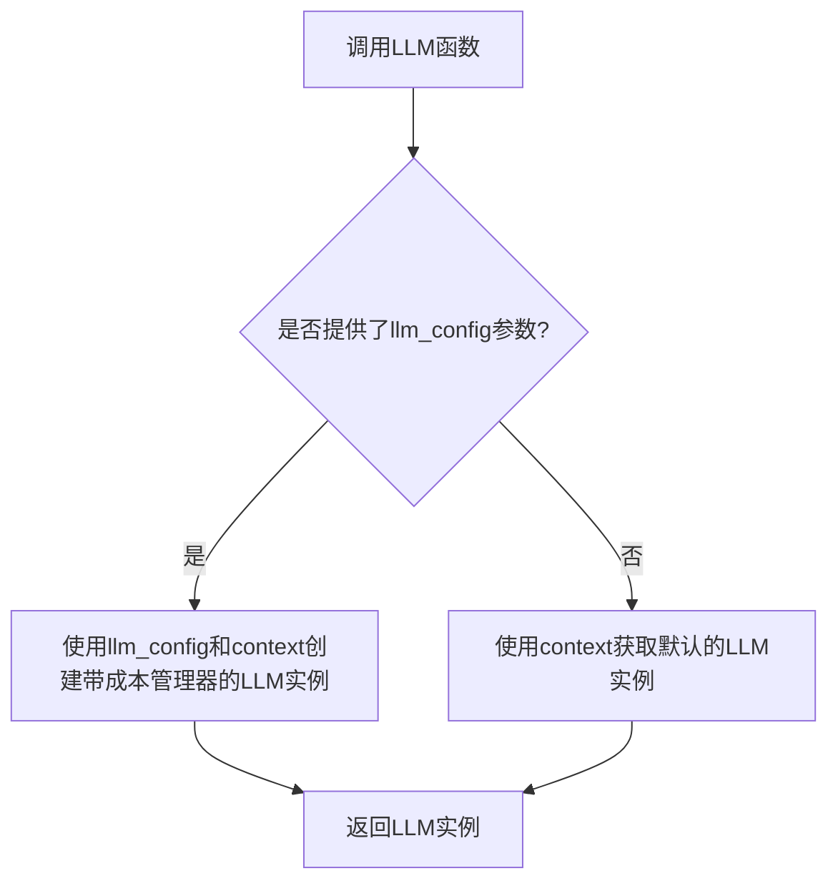
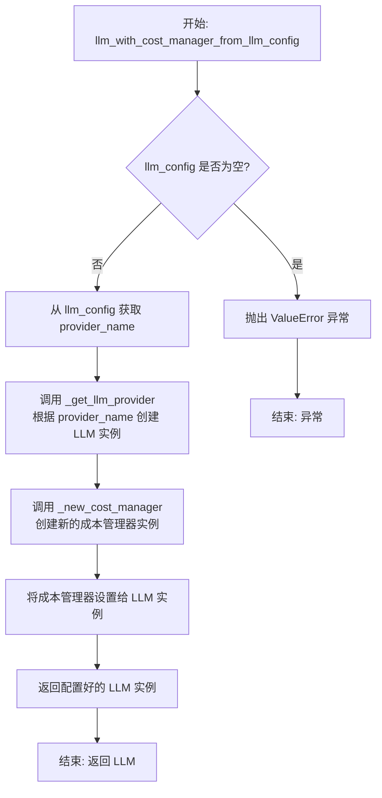

# `.\MetaGPT\metagpt\llm.py` 详细设计文档

该代码文件提供了一个工厂函数 `LLM`，用于根据配置或上下文获取一个大型语言模型（LLM）的提供者实例。其核心功能是作为LLM实例的创建入口，优先使用传入的 `llm_config` 配置创建带有成本管理器的LLM，若无配置则返回上下文中的默认LLM实例。

## 整体流程



## 类结构

```
BaseLLM (抽象基类，来自metagpt.provider.base_llm)
├── 由Context.llm_with_cost_manager_from_llm_config方法返回的具体LLM类
└── 由Context.llm方法返回的具体LLM类
```

## 全局变量及字段


### `ctx`
    
用于获取或创建上下文实例，作为LLM工厂函数的工作上下文。

类型：`Context`
    


    

## 全局函数及方法


### `LLM`

这是一个工厂函数，用于根据提供的配置和上下文，获取一个配置了成本管理器的LLM（大语言模型）提供者实例。其核心逻辑是优先使用传入的`llm_config`参数来构建LLM，如果该参数未提供，则回退到使用上下文中的默认LLM。

参数：

-  `llm_config`：`Optional[LLMConfig]`，可选的LLM配置对象。如果提供，函数将使用此配置来创建LLM实例。
-  `context`：`Context`，可选的上下文对象。用于获取或创建LLM实例及其关联的成本管理器。如果未提供，将创建一个新的默认上下文。

返回值：`BaseLLM`，返回一个实现了`BaseLLM`接口的LLM提供者实例。该实例通常已与成本管理器关联，用于跟踪使用成本。

#### 流程图

```mermaid
flowchart TD
    A[开始: 调用 LLM(llm_config, context)] --> B{context 参数是否为 None?}
    B -- 是 --> C[ctx = 新建 Context]
    B -- 否 --> D[ctx = 传入的 context]
    C --> E{llm_config 参数是否为 None?}
    D --> E
    E -- 是 --> F[返回 ctx.llm<br>（默认LLM）]
    E -- 否 --> G[返回 ctx.llm_with_cost_manager_from_llm_config(llm_config)<br>（根据配置创建带成本管理的LLM）]
    F --> H[结束: 返回 BaseLLM 实例]
    G --> H
```

#### 带注释源码

```python
def LLM(llm_config: Optional[LLMConfig] = None, context: Context = None) -> BaseLLM:
    """get the default llm provider if name is None"""
    # 步骤1: 确定使用的上下文（Context）
    # 如果调用者没有提供context参数，则创建一个新的默认Context实例。
    # 否则，使用调用者提供的context。
    ctx = context or Context()

    # 步骤2: 根据llm_config参数决定如何获取LLM实例
    # 如果调用者提供了具体的LLM配置（llm_config不为None），
    # 则通过上下文的`llm_with_cost_manager_from_llm_config`方法，
    # 使用该配置创建一个新的、附带成本管理器的LLM实例。
    if llm_config is not None:
        return ctx.llm_with_cost_manager_from_llm_config(llm_config)

    # 步骤3: 回退到默认LLM
    # 如果调用者没有提供llm_config参数（即使用默认配置），
    # 则直接返回上下文中的默认LLM实例（通过`ctx.llm()`获取）。
    return ctx.llm()
```


### `Context.llm_with_cost_manager_from_llm_config`

此方法是`Context`类的核心方法之一，负责根据传入的`LLMConfig`配置对象，创建并配置一个集成了成本管理功能的`BaseLLM`实例。它充当了配置（`LLMConfig`）与实际大语言模型服务提供者（`BaseLLM`）之间的桥梁，并确保成本管理器被正确关联。

参数：

-  `llm_config`：`LLMConfig`，一个包含大语言模型提供商、API密钥、模型名称、温度等配置参数的对象。

返回值：`BaseLLM`，一个配置好的、集成了成本管理功能的大语言模型提供者实例。

#### 流程图



#### 带注释源码

```python
def llm_with_cost_manager_from_llm_config(self, llm_config: LLMConfig) -> BaseLLM:
    """
    根据给定的LLM配置，创建一个带有成本管理器的LLM实例。
    
    此方法执行以下步骤：
    1. 验证传入的llm_config不为空。
    2. 从配置中提取提供商名称（provider_name）。
    3. 使用提供商名称通过_get_llm_provider方法实例化对应的BaseLLM子类。
    4. 通过_new_cost_manager方法创建一个新的成本管理器（CostManager）实例。
    5. 将创建的成本管理器赋值给LLM实例的`cost_manager`属性。
    6. 返回这个已配置好成本管理器的LLM实例。
    
    参数:
        llm_config (LLMConfig): 包含LLM提供商、API密钥、模型等配置信息的对象。
        
    返回:
        BaseLLM: 一个配置完毕且绑定了成本管理器的大语言模型提供者实例。
        
    异常:
        ValueError: 当llm_config参数为None时抛出。
    """
    # 1. 参数校验：确保配置对象有效
    if llm_config is None:
        raise ValueError("llm_config must be provided")
        
    # 2. 从配置对象中获取提供商名称（例如："openai", "zhipuai"等）
    provider_name = llm_config.provider_name
    
    # 3. 工厂方法：根据提供商名称创建对应的LLM实例
    #    _get_llm_provider 内部会处理不同提供商的初始化逻辑
    llm = self._get_llm_provider(provider_name, llm_config)
    
    # 4. 创建成本管理器实例
    #    _new_cost_manager 负责初始化成本跟踪组件
    cost_manager = self._new_cost_manager()
    
    # 5. 依赖注入：将成本管理器与LLM实例关联
    #    这使得LLM在每次调用API时，都能通过cost_manager记录开销
    llm.cost_manager = cost_manager
    
    # 6. 返回最终可用的LLM对象
    return llm
```


### `LLM`

这是一个全局函数，用于根据提供的配置或上下文，获取一个LLM（大语言模型）提供者实例。它优先使用传入的`llm_config`参数来创建LLM，否则返回当前上下文中的默认LLM。

参数：

-  `llm_config`：`Optional[LLMConfig]`，可选的LLM配置对象。如果提供，函数将使用此配置创建一个新的LLM实例。
-  `context`：`Context`，可选的上下文对象。如果未提供，函数将创建一个新的默认上下文。

返回值：`BaseLLM`，返回一个实现了`BaseLLM`接口的LLM提供者实例。

#### 流程图

```mermaid
flowchart TD
    A[开始: 调用 LLM(llm_config, context)] --> B{llm_config 是否为 None?}
    B -- 否 --> C[调用 ctx.llm_with_cost_manager_from_llm_config(llm_config)]
    C --> D[返回配置的 LLM 实例]
    B -- 是 --> E[调用 ctx.llm()]
    E --> F[返回默认的 LLM 实例]
    D --> G[结束]
    F --> G
```

#### 带注释源码

```
def LLM(llm_config: Optional[LLMConfig] = None, context: Context = None) -> BaseLLM:
    """get the default llm provider if name is None"""
    # 如果未提供context参数，则创建一个新的默认Context实例
    ctx = context or Context()
    # 如果提供了llm_config参数，则使用该配置通过上下文创建一个带成本管理的LLM实例
    if llm_config is not None:
        return ctx.llm_with_cost_manager_from_llm_config(llm_config)
    # 如果未提供llm_config参数，则返回上下文中的默认LLM实例
    return ctx.llm()
```


## 关键组件


### LLM 工厂函数

一个用于获取默认或指定配置的 LLM 提供者实例的工厂函数，它封装了从应用上下文中实例化和管理 LLM 的逻辑。

### 应用上下文 (Context)

作为依赖注入和控制反转的容器，负责管理 LLM 提供者实例及其关联的成本管理器，并根据配置创建相应的实例。

### LLM 配置 (LLMConfig)

定义了 LLM 提供者的配置参数，如模型名称、API 密钥、基础 URL 等，用于指导 Context 如何实例化特定的 LLM 提供者。

### 基础 LLM 提供者 (BaseLLM)

定义了所有 LLM 提供者必须实现的抽象接口，确保了不同 LLM 后端（如 OpenAI, Anthropic）在使用上的一致性。

### 成本管理器 (Cost Manager)

一个可选的组件，用于跟踪和管理 LLM API 调用的成本，通过 Context 与 LLM 提供者实例关联。


## 问题及建议


### 已知问题

-   **函数签名设计存在歧义**：`LLM` 函数的参数 `llm_config` 和 `context` 都提供了默认值（`None`）。当调用者不传入 `context` 但传入 `llm_config` 时，函数内部会创建一个新的默认 `Context` 实例。这可能导致调用者意图使用全局上下文，但实际上却使用了新创建的、可能未正确初始化的局部上下文，引发配置不一致或资源（如成本管理器）未正确关联的问题。
-   **依赖隐式全局状态**：该函数的核心逻辑依赖于外部的 `Context` 类及其内部状态（如默认的 LLM 配置、成本管理器）。当 `llm_config` 为 `None` 时，直接返回 `ctx.llm()`，这使得函数的输出完全由调用时 `ctx` 的内部状态决定，行为不够透明和可预测，增加了调试和测试的复杂度。
-   **函数命名不符合 PEP8 规范**：函数名 `LLM` 使用了全大写字母，这在 Python 的 PEP8 风格指南中通常用于表示常量或类。作为工厂函数，它应该使用 `snake_case` 命名法（如 `get_llm` 或 `create_llm`），以避免与类名混淆，提高代码可读性。
-   **缺乏错误处理与边界情况检查**：函数没有对传入的 `llm_config` 或从上下文中获取的 LLM 实例进行有效性验证。例如，如果 `ctx.llm()` 返回 `None` 或一个无效对象，函数会直接将其返回给调用者，可能导致下游代码出现难以追踪的 `AttributeError` 或其他运行时错误。

### 优化建议

-   **明确参数依赖，避免创建隐式上下文**：建议修改函数逻辑，当需要 `llm_config` 时，强制要求调用者必须也提供与之配套的 `context` 参数，或者从某个明确的、可靠的来源（如一个单例或明确的全局变量）获取上下文。这样可以消除因默认创建新上下文导致的状态不一致风险。更好的设计是让 `context` 参数变为必需参数（移除默认值），或提供两个独立的、功能明确的函数。
-   **将函数重命名为符合规范的名称**：将函数名从 `LLM` 改为更具描述性且符合 `snake_case` 规范的名称，例如 `get_llm` 或 `build_llm`。这能立即改善代码的可读性，并明确其工厂函数的角色。
-   **增加输入验证与健壮的错误处理**：在函数开始处或调用 `ctx` 的方法前，添加参数检查。例如，检查 `llm_config` 是否为 `LLMConfig` 类型（如果提供了），检查 `ctx.llm()` 返回的对象是否是 `BaseLLM` 的实例。对于无效输入或内部错误，应抛出明确的、带有描述性信息的异常（如 `ValueError` 或自定义异常），而不是返回 `None` 或无效对象。
-   **考虑提供更细粒度的工厂方法**：根据使用场景，可以提供两个独立的函数：一个用于获取默认配置的 LLM（`get_default_llm(context)`），另一个用于根据指定配置创建 LLM（`create_llm_from_config(llm_config, context)`）。这可以使接口意图更清晰，减少因参数默认值带来的逻辑复杂性。
-   **完善文档字符串**：当前的文档字符串过于简单。应更新文档，清晰说明每个参数的作用、返回值是什么、在何种情况下会创建新的上下文、函数可能抛出的异常等，这对于使用者正确理解和使用该函数至关重要。


## 其它


### 设计目标与约束

该模块的核心设计目标是提供一个统一、便捷的接口来获取和配置大语言模型（LLM）实例。它旨在封装底层LLM提供商的创建逻辑，并支持通过配置或全局上下文进行灵活管理。主要约束包括：1）向后兼容性，确保现有调用方式（如不传参）继续有效；2）依赖注入，通过`Context`对象管理依赖，而非硬编码；3）配置驱动，允许通过`LLMConfig`对象精细控制LLM行为。

### 错误处理与异常设计

当前代码片段中未显式包含错误处理逻辑。潜在的异常可能来源于：1）`Context`对象未正确初始化；2）`llm_config`参数格式无效；3）底层`ctx.llm_with_cost_manager_from_llm_config`或`ctx.llm()`方法调用失败（例如，提供商初始化失败、API密钥错误等）。建议在调用这些方法时添加`try-except`块，捕获特定异常（如`ValueError`, `KeyError`, 或自定义的`LLMError`），并向上抛出更清晰的异常信息或返回一个安全的默认值/降级方案，以提高系统的健壮性。

### 数据流与状态机

该函数的数据流相对简单：输入参数（`llm_config`, `context`）经过条件判断，决定调用`Context`对象的哪个方法来获取`BaseLLM`实例。它本身不维护状态。状态主要由外部的`Context`对象管理，该对象可能内部缓存了LLM实例、配置和成本管理器。函数的行为构成一个简单的决策状态：如果提供了`llm_config`，则使用该配置创建/获取一个带成本管理的LLM；否则，返回上下文中默认的LLM实例。

### 外部依赖与接口契约

1.  **外部依赖**：
    *   `metagpt.configs.llm_config.LLMConfig`：提供LLM的配置数据结构。
    *   `metagpt.context.Context`：提供应用程序上下文，负责LLM实例的生命周期管理和依赖解析。
    *   `metagpt.provider.base_llm.BaseLLM`：所有LLM提供商必须实现的抽象基类，定义了统一的接口。
2.  **接口契约**：
    *   **函数`LLM`**：
        *   **输入**：可选的`llm_config`（`LLMConfig`类型）和`context`（`Context`类型）。
        *   **输出**：一个实现了`BaseLLM`接口的对象。
        *   **行为**：根据输入参数，返回一个配置好的LLM实例。这是模块对外的核心契约。
    *   **`Context`类契约**：该函数强依赖`Context`的`llm_with_cost_manager_from_llm_config`和`llm`方法。前者需接受一个`LLMConfig`并返回一个带成本管理的`BaseLLM`；后者需返回一个默认的`BaseLLM`实例。

    