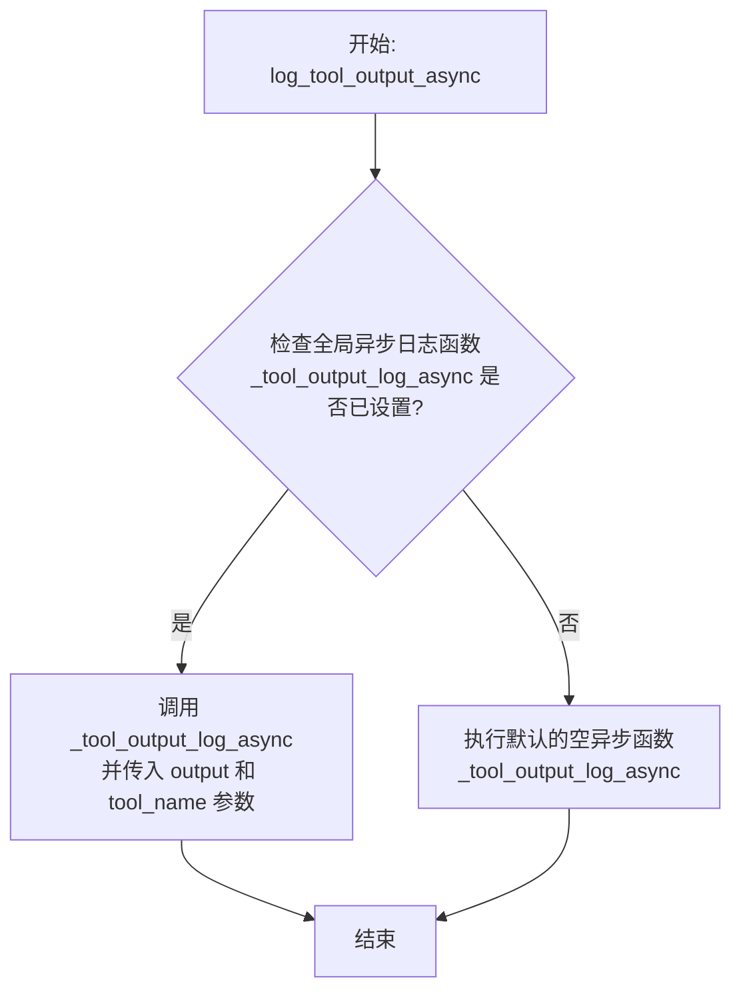

# `.\MetaGPT\metagpt\logs.py` 详细设计文档

该文件是MetaGPT项目的日志管理模块，提供了灵活的日志记录、LLM（大语言模型）流式输出处理、工具输出日志以及用户输入获取等功能。它通过可配置的日志级别、上下文变量管理异步队列，并允许运行时动态替换日志处理函数，以支持不同场景下的日志输出需求。

## 整体流程


## 类结构

```
BaseModel (Pydantic基类)
└── ToolLogItem (工具日志项数据模型)

全局函数与变量
├── 全局变量: LLM_STREAM_QUEUE, TOOL_LOG_END_MARKER, _print_level, logger, _llm_stream_log, _tool_output_log, _tool_output_log_async, _get_human_input
├── 配置函数: define_log_level
├── 日志记录函数: log_llm_stream, log_tool_output, log_tool_output_async
├── 用户输入函数: get_human_input
└── 函数设置器: set_llm_stream_logfunc, set_tool_output_logfunc, set_tool_output_logfunc_async, set_human_input_func, create_llm_stream_queue, get_llm_stream_queue
```

## 全局变量及字段


### `LLM_STREAM_QUEUE`
    
用于存储和管理异步LLM流式输出消息的上下文变量队列。

类型：`ContextVar[asyncio.Queue]`
    


### `TOOL_LOG_END_MARKER`
    
一个特殊的日志项，用于标记工具日志流的结束。

类型：`ToolLogItem`
    


### `_print_level`
    
控制控制台日志输出级别的全局变量。

类型：`str`
    


### `logger`
    
配置好的全局日志记录器实例，用于记录应用日志。

类型：`loguru.logger`
    


### `_llm_stream_log`
    
用于处理LLM流式日志输出的可调用函数，默认为print函数。

类型：`Callable`
    


### `_tool_output_log`
    
用于处理工具输出日志的同步可调用函数，默认为空操作。

类型：`Callable`
    


### `_tool_output_log_async`
    
用于处理工具输出日志的异步可调用函数，默认为空操作。

类型：`Callable`
    


### `_get_human_input`
    
用于获取用户输入的可调用函数，默认为Python内置的input函数。

类型：`Callable`
    


### `ToolLogItem.type_`
    
表示`value`字段数据类型的字符串。

类型：`str`
    


### `ToolLogItem.name`
    
工具日志项的名称标识符。

类型：`str`
    


### `ToolLogItem.value`
    
工具日志项的实际数据值，类型由`type_`字段指定。

类型：`Any`
    
    

## 全局函数及方法


### `define_log_level`

该函数用于配置日志系统，设置控制台和日志文件的输出级别，并初始化日志记录器。它会根据提供的参数调整日志级别，并创建带有日期戳的日志文件。

参数：

-  `print_level`：`str`，控制台日志的输出级别，默认为 "INFO"
-  `logfile_level`：`str`，日志文件的输出级别，默认为 "DEBUG"
-  `name`：`str`，日志文件名的前缀，可选，默认为 `None`

返回值：`loguru.logger`，配置好的日志记录器实例

#### 流程图

```mermaid
flowchart TD
    A[开始: define_log_level] --> B[更新全局变量 _print_level]
    B --> C[获取当前日期并格式化]
    C --> D{name 参数是否提供?}
    D -- 是 --> E[构造带前缀的日志文件名]
    D -- 否 --> F[构造仅含日期的日志文件名]
    E --> G
    F --> G[移除 logger 现有处理器]
    G --> H[添加控制台日志处理器<br>级别: print_level]
    H --> I[添加文件日志处理器<br>路径: logs/{log_name}.txt<br>级别: logfile_level]
    I --> J[返回配置好的 logger 实例]
    J --> K[结束]
```

#### 带注释源码

```python
def define_log_level(print_level="INFO", logfile_level="DEBUG", name: str = None):
    """Adjust the log level to above level"""
    # 更新全局变量，记录当前控制台打印级别
    global _print_level
    _print_level = print_level

    # 获取当前日期，并格式化为 YYYYMMDD 形式
    current_date = datetime.now()
    formatted_date = current_date.strftime("%Y%m%d")
    # 根据是否提供 name 参数，构造日志文件名
    log_name = f"{name}_{formatted_date}" if name else formatted_date  # name a log with prefix name

    # 移除 logger 现有的所有处理器（sink）
    _logger.remove()
    # 添加一个输出到标准错误（控制台）的处理器，日志级别为 print_level
    _logger.add(sys.stderr, level=print_level)
    # 添加一个输出到文件的处理器，文件路径为 METAGPT_ROOT/logs/{log_name}.txt，日志级别为 logfile_level
    _logger.add(METAGPT_ROOT / f"logs/{log_name}.txt", level=logfile_level)
    # 返回配置好的 logger 实例
    return _logger
```


### `log_llm_stream`

该函数用于将消息记录到LLM（大语言模型）流中。它首先尝试从上下文变量中获取一个异步队列，如果队列存在，则将消息非阻塞地放入队列。随后，无论队列是否存在，它都会调用一个内部日志函数（默认为`print`）来输出消息。

参数：

-  `msg`：`Any`，需要被记录的消息。

返回值：`None`，该函数不返回任何值。

#### 流程图

```mermaid
flowchart TD
    A[开始: log_llm_stream(msg)] --> B[获取LLM流队列<br>queue = get_llm_stream_queue()]
    B --> C{队列是否存在?}
    C -- 是 --> D[将消息放入队列<br>queue.put_nowait(msg)]
    C -- 否 --> E[跳过队列操作]
    D --> F
    E --> F[调用内部日志函数<br>_llm_stream_log(msg)]
    F --> G[结束]
```

#### 带注释源码

```python
def log_llm_stream(msg):
    """
    Logs a message to the LLM stream.

    Args:
        msg: The message to be logged.

    Notes:
        If the LLM_STREAM_QUEUE has not been set (e.g., if `create_llm_stream_queue` has not been called),
        the message will not be added to the LLM stream queue.
    """
    # 1. 尝试从上下文变量中获取LLM流队列
    queue = get_llm_stream_queue()
    # 2. 如果队列存在，则非阻塞地将消息放入队列
    if queue:
        queue.put_nowait(msg)
    # 3. 调用内部日志函数记录消息（默认行为是打印到控制台）
    _llm_stream_log(msg)
```


### `log_tool_output`

该函数是一个用于记录工具（Tool）输出结果的接口。它接收工具的输出数据（可以是单个`ToolLogItem`或一个列表），并可选地指定工具名称。该函数本身不直接处理日志逻辑，而是将调用转发给一个全局可配置的日志处理函数`_tool_output_log`。这种设计允许在运行时动态地改变日志记录的行为（例如，输出到控制台、文件或远程服务），而无需修改调用此函数的代码。

参数：

-  `output`：`ToolLogItem | list[ToolLogItem]`，需要记录的工具输出数据，可以是单个日志项或一个日志项列表。
-  `tool_name`：`str`，可选参数，产生此输出的工具名称。

返回值：`None`，该函数不返回任何值。

#### 流程图


#### 带注释源码

```python
def log_tool_output(output: ToolLogItem | list[ToolLogItem], tool_name: str = ""):
    """interface for logging tool output, can be set to log tool output in different ways to different places with set_tool_output_logfunc"""
    # 调用全局定义的日志记录函数 _tool_output_log。
    # 该函数的具体行为（如输出到哪里、以什么格式）由 set_tool_output_logfunc 设置。
    _tool_output_log(output=output, tool_name=tool_name)
```


### `log_tool_output_async`

这是一个异步接口函数，用于记录工具（Tool）的输出。它被设计为可以接收单个或多个`ToolLogItem`对象，并支持通过`set_tool_output_logfunc_async`函数设置自定义的异步日志处理逻辑。当工具的输出包含异步对象（例如，来自异步API调用的结果）时，应使用此异步版本。

参数：

-  `output`：`ToolLogItem | list[ToolLogItem]`，需要记录的单个工具日志项或工具日志项列表。
-  `tool_name`：`str`，可选参数，产生此输出的工具名称。

返回值：`None`，此函数不返回任何值。

#### 流程图



#### 带注释源码

```python
async def log_tool_output_async(output: ToolLogItem | list[ToolLogItem], tool_name: str = ""):
    """async interface for logging tool output, used when output contains async object"""
    # 调用全局定义的异步日志处理函数 `_tool_output_log_async`。
    # 默认情况下，`_tool_output_log_async` 是一个什么都不做的异步函数。
    # 可以通过 `set_tool_output_logfunc_async` 函数将其替换为自定义的异步处理逻辑。
    await _tool_output_log_async(output=output, tool_name=tool_name)
```


### `get_human_input`

`get_human_input` 是一个用于获取用户输入的接口函数。它提供了一个统一的异步调用入口，内部会根据全局函数 `_get_human_input` 的实际实现（可能是同步或异步函数）来获取输入。其核心设计是允许通过 `set_human_input_func` 函数动态替换底层的输入获取逻辑，从而支持从不同来源（如控制台、Web界面、API等）获取输入，增强了代码的灵活性和可测试性。

参数：

-  `prompt`：`str`，提示信息字符串，用于在请求用户输入时显示。默认为空字符串。

返回值：`Any`，返回从底层输入函数 `_get_human_input` 获取到的用户输入内容，其具体类型由 `_get_human_input` 的实现决定。

#### 流程图

```mermaid
flowchart TD
    A[调用 get_human_input(prompt)] --> B{检查 _get_human_input 是否为协程函数?}
    B -- 是 --> C[await _get_human_input(prompt)]
    B -- 否 --> D[_get_human_input(prompt)]
    C --> E[返回用户输入]
    D --> E
```

#### 带注释源码

```python
async def get_human_input(prompt: str = ""):
    """interface for getting human input, can be set to get input from different sources with set_human_input_func"""
    # 使用 inspect.iscoroutinefunction 检查全局函数 _get_human_input 是否为异步协程函数
    if inspect.iscoroutinefunction(_get_human_input):
        # 如果是异步函数，则使用 await 关键字等待其执行完成并返回结果
        return await _get_human_input(prompt)
    else:
        # 如果是同步函数，则直接调用并返回结果
        return _get_human_input(prompt)
```


### `set_llm_stream_logfunc`

该函数用于设置一个全局的LLM（大语言模型）流式日志处理函数。它允许用户自定义如何处理由`log_llm_stream`函数发出的日志消息，从而将日志输出重定向到不同的目标（例如，控制台、文件、WebSocket等），而不是默认的`print`函数。

参数：

-  `func`：`Callable`，一个可调用对象（函数），它接受一个参数（日志消息）并负责处理该消息。该函数将替换默认的`_llm_stream_log`函数。

返回值：`None`，该函数不返回任何值，其作用是通过修改全局变量来改变程序行为。

#### 流程图

```mermaid
flowchart TD
    A[调用 set_llm_stream_logfunc(func)] --> B{参数 func 是否有效?}
    B -- 是 --> C[将全局变量 _llm_stream_log 指向 func]
    B -- 否 --> D[函数执行结束，无实际效果]
    C --> E[函数执行结束]
    D --> E
```

#### 带注释源码

```python
def set_llm_stream_logfunc(func):
    # 声明使用全局变量 _llm_stream_log
    global _llm_stream_log
    # 将传入的函数 `func` 赋值给全局变量 `_llm_stream_log`
    # 此后，当 `log_llm_stream` 函数调用 `_llm_stream_log(msg)` 时，
    # 实际执行的是用户通过此函数设置的 `func`
    _llm_stream_log = func
```


### `set_tool_output_logfunc`

`set_tool_output_logfunc` 是一个全局函数，用于设置工具输出日志的处理函数。它允许用户自定义如何记录和处理由工具（Tool）产生的输出日志。通过调用此函数并传入一个自定义的日志处理函数，可以覆盖默认的、不执行任何操作的日志记录行为，从而实现将工具输出定向到不同的目的地（如文件、数据库、WebSocket等）或进行特定的格式化处理。

参数：

-  `func`：`Callable`，一个可调用对象（通常是函数），用于处理工具输出日志。该函数应接受与 `log_tool_output` 函数相同的参数。

返回值：`None`，此函数不返回任何值，其作用是通过修改全局变量来改变程序的行为。

#### 流程图

```mermaid
flowchart TD
    A[调用 set_tool_output_logfunc(func)] --> B{参数 func 是否有效?};
    B -- 是 --> C[将全局变量 _tool_output_log 指向 func];
    B -- 否 --> D[函数调用无效或可能引发错误];
    C --> E[后续调用 log_tool_output 将使用新的 func];
    D --> F[流程结束];
    E --> F;
```

#### 带注释源码

```python
def set_tool_output_logfunc(func):
    # 声明使用全局变量 _tool_output_log
    global _tool_output_log
    # 将传入的函数对象 func 赋值给全局变量 _tool_output_log
    # 这将覆盖 _tool_output_log 的初始值（一个不执行任何操作的 lambda 函数）
    _tool_output_log = func
```


### `set_tool_output_logfunc_async`

这是一个异步函数，用于设置一个全局的异步回调函数，该函数将用于处理工具（Tool）的输出日志。通过调用此函数，可以将自定义的异步日志处理逻辑注入到系统中，替代默认的空操作。这提供了灵活的日志处理扩展能力，允许将工具输出记录到文件、数据库或发送到远程监控系统等。

参数：

-  `func`：`Callable[[ToolLogItem | list[ToolLogItem], str], Awaitable[None]]`，一个异步可调用对象（async function）。它接受两个参数：`output`（一个`ToolLogItem`对象或其列表）和`tool_name`（字符串类型的工具名称）。该函数负责处理传入的工具输出数据。

返回值：`None`，此函数不返回任何值。

#### 流程图

```mermaid
flowchart TD
    A[调用 set_tool_output_logfunc_async(func)] --> B{检查 func 是否为异步函数?}
    B -- 是 --> C[将全局变量 _tool_output_log_async 指向 func]
    B -- 否 --> D[函数执行，但后续异步调用可能失败]
    C --> E[函数执行结束]
    D --> E
```

#### 带注释源码

```python
async def set_tool_output_logfunc_async(func):
    # async version
    global _tool_output_log_async  # 声明要修改的全局变量
    _tool_output_log_async = func  # 将传入的异步函数赋值给全局变量
```


### `set_human_input_func`

`set_human_input_func` 是一个全局函数，用于设置或替换获取用户输入的核心回调函数。它允许系统动态地更改获取用户输入的来源或方式，例如从控制台输入切换到图形界面输入或网络API调用，从而提供了高度的灵活性和可扩展性。

参数：

-  `func`：`Callable[[str], Any]`，一个可调用对象（函数或方法），用于获取用户输入。它接收一个字符串类型的提示信息 `prompt` 作为参数，并返回用户提供的输入。

返回值：`None`，此函数不返回任何值，其作用是通过修改全局变量 `_get_human_input` 来改变系统行为。

#### 流程图

```mermaid
flowchart TD
    A[调用 set_human_input_func(func)] --> B{检查 func 是否为可调用对象?}
    B -- 是 --> C[将全局变量 _get_human_input 指向 func]
    B -- 否 --> D[函数调用失败<br>（通常由Python解释器抛出TypeError）]
    C --> E[函数执行完毕<br>后续的 get_human_input 调用将使用新的输入函数]
```

#### 带注释源码

```python
def set_human_input_func(func):
    # 声明 _get_human_input 为全局变量，以便在函数内部修改它
    global _get_human_input
    # 将传入的函数对象 func 赋值给全局变量 _get_human_input。
    # 此后，当其他代码（如 `get_human_input` 函数）调用 `_get_human_input` 时，
    # 实际上执行的是这里传入的 `func` 函数。
    _get_human_input = func
```


### `create_llm_stream_queue`

该函数用于创建一个新的异步队列（`asyncio.Queue`），并将其设置为当前上下文（`ContextVar`）中的LLM（大语言模型）流队列。这是实现LLM流式输出处理的关键组件，允许在不同的异步上下文中安全地传递和处理LLM生成的流式消息。

参数：
- 无

返回值：`asyncio.Queue`，返回新创建并已设置到当前上下文中的异步队列实例。

#### 流程图


#### 带注释源码

```python
def create_llm_stream_queue():
    """Creates a new LLM stream queue and sets it in the context variable.

    Returns:
        The newly created asyncio.Queue instance.
    """
    # 创建一个新的异步队列实例，用于存储LLM流式输出的消息
    queue = asyncio.Queue()
    # 使用 ContextVar 的 set 方法，将新创建的队列设置为当前上下文中的值。
    # 这确保了在同一个异步任务链中，后续调用 `get_llm_stream_queue` 能获取到正确的队列。
    LLM_STREAM_QUEUE.set(queue)
    # 返回新创建的队列，调用者可以立即使用它（例如，开始消费队列中的消息）
    return queue
```


### `get_llm_stream_queue`

该函数用于从上下文变量中检索当前设置的LLM（大语言模型）流队列。它是一个辅助函数，确保在需要访问流队列时，能够安全地获取到队列实例，如果未设置则返回None。

参数：
- 无

返回值：`asyncio.Queue | None`，如果上下文变量中已设置LLM流队列，则返回该`asyncio.Queue`实例；否则返回`None`。

#### 流程图


#### 带注释源码

```python
def get_llm_stream_queue():
    """Retrieves the current LLM stream queue from the context variable.

    Returns:
        The asyncio.Queue instance if set, otherwise None.
    """
    # 从名为 "llm-stream" 的上下文变量 LLM_STREAM_QUEUE 中获取值。
    # 如果该变量在当前上下文中未被设置（即 `create_llm_stream_queue` 未被调用），
    # 则返回默认值 None。
    return LLM_STREAM_QUEUE.get(None)
```

## 关键组件


### 日志系统配置与初始化

提供日志系统的全局配置和初始化功能，包括定义日志级别、设置日志输出目标（控制台和文件），并返回一个配置好的logger实例供整个应用使用。

### 日志记录器实例

一个预配置的loguru日志记录器实例，作为模块的默认日志记录器，提供标准化的日志记录接口。

### 上下文变量：LLM_STREAM_QUEUE

一个存储异步队列的上下文变量，用于在不同协程或异步上下文中安全地传递LLM（大语言模型）的流式输出消息。

### 工具日志项数据模型

一个基于Pydantic的数据模型，用于结构化地记录工具（Tool）的输出信息，包含类型、名称和值等字段，并定义了一个特殊的结束标记项。

### 日志函数接口与占位符

定义了一系列用于记录LLM流式输出、工具输出以及获取人工输入的全局函数接口。这些接口通过可设置的占位符函数（如 `_llm_stream_log`, `_tool_output_log`）实现，允许运行时动态替换实际的日志处理逻辑，提供了高度的灵活性和可扩展性。

### 异步队列管理

提供创建和获取LLM流式输出异步队列的函数，用于支持LLM流式响应的消息传递和消费。


## 问题及建议


### 已知问题

-   **日志级别控制不一致**：`_llm_stream_log` 函数内部硬编码了 `if _print_level in ["INFO"]:` 的条件判断，这与 `define_log_level` 函数设置的全局 `_print_level` 变量逻辑上相关，但并未直接使用该变量进行统一控制，可能导致日志输出行为与预期不符。
-   **异步函数定义与实现不一致**：`set_tool_output_logfunc_async` 被定义为 `async def`，但其功能仅仅是设置一个全局函数指针，并不需要异步执行。这可能会误导调用者，并可能在不必要的异步上下文中使用。
-   **默认日志函数存在潜在阻塞风险**：默认的 `_llm_stream_log` 函数使用 `print`，在异步环境中，如果标准输出被阻塞，可能会影响整个异步任务的性能。
-   **工具日志结束标记硬编码**：`TOOL_LOG_END_MARKER` 的值 `"\x18\x19\x1B\x18"` 是一个硬编码的、含义不明确的特殊字符序列，缺乏文档说明其具体含义和选择原因，降低了代码的可读性和可维护性。
-   **缺少类型注解**：部分函数（如 `_llm_stream_log`, `_tool_output_log`, `_tool_output_log_async`）缺少完整的类型注解，不利于静态类型检查和代码理解。

### 优化建议

-   **统一日志级别判断逻辑**：修改 `_llm_stream_log` 函数，使其直接使用 `_print_level` 全局变量或通过 `logger` 的级别来判断是否应输出流日志，确保日志控制逻辑的一致性。
-   **修正异步函数定义**：将 `set_tool_output_logfunc_async` 改为普通的 `def` 定义，因为其操作（赋值）是同步且瞬时的，不需要 `async`。
-   **使用异步安全的日志输出**：考虑在异步上下文中，将默认的 `_llm_stream_log` 实现改为使用 `asyncio` 提供的异步打印方式（如通过 `loop.run_in_executor`）或确保其不会阻塞事件循环，特别是在高并发场景下。
-   **为结束标记添加常量与注释**：将 `TOOL_LOG_END_MARKER` 的值定义为一个有明确名称的常量（如 `TOOL_LOG_STREAM_TERMINATOR`），并添加注释说明其用途（例如，标识工具日志流的结束，用于解析）。
-   **补充类型注解**：为所有函数和变量添加完整的类型注解，特别是 `_llm_stream_log`, `_tool_output_log` 等函数，明确其参数和返回值的类型。
-   **增强错误处理**：在 `log_llm_stream` 函数中，当 `queue.put_nowait` 调用时，如果队列已满，会引发 `asyncio.QueueFull` 异常。建议添加异常处理逻辑，例如记录警告或采取其他降级策略。
-   **考虑配置化**：将日志文件路径、格式、轮转策略等从硬编码改为可通过配置文件或环境变量设置，提高部署灵活性。


## 其它


### 设计目标与约束

本模块的设计目标是提供一个灵活、可扩展的日志记录和事件流处理框架，核心约束包括：1) 支持同步和异步日志记录；2) 允许运行时动态替换日志处理函数，以实现输出目标（如控制台、文件、网络）和格式的灵活切换；3) 通过上下文变量（ContextVar）管理异步环境下的流队列，确保线程/协程安全；4) 提供默认的简单实现，同时不强制绑定特定实现，保持模块的轻量和可插拔性。

### 错误处理与异常设计

模块本身不主动抛出业务异常，主要遵循“静默失败”或“默认行为”原则。例如：`get_llm_stream_queue`在上下文变量未设置时返回`None`，`log_llm_stream`会检查队列是否存在；未设置`_tool_output_log`函数时，使用一个什么都不做的lambda函数作为默认值，防止调用失败。这种设计将错误处理的责任交给了调用者或替换后的日志处理函数。潜在的异常可能来自`asyncio.Queue.put_nowait`（当队列满时）或替换后的自定义函数，这些需要由相应的函数实现者处理。

### 数据流与状态机

模块管理两个主要数据流：
1.  **LLM流日志**：数据通过`log_llm_stream(msg)`发布。如果通过`create_llm_stream_queue`创建了上下文队列，消息会被放入该队列，供其他协程消费（如实时推送到前端）。同时，消息会通过`_llm_stream_log`函数处理（默认打印到控制台）。这是一个典型的生产者-消费者模式，队列是核心的数据缓冲区。
2.  **工具输出日志**：`ToolLogItem`或列表通过`log_tool_output`或`log_tool_output_async`发布。数据由`_tool_output_log`或`_tool_output_log_async`函数处理，这些函数可在运行时被替换，从而将数据导向不同目的地（如数据库、监控系统）。模块本身没有复杂的状态机，其状态主要体现在可替换的函数指针和上下文变量中的队列实例上。

### 外部依赖与接口契约

*   **loguru**: 作为底层日志记录库，负责将格式化的日志消息输出到标准错误流和文件。`define_log_level`函数封装了其配置。
*   **pydantic**: 用于定义和验证`ToolLogItem`数据模型，确保日志数据的结构一致性。
*   **asyncio**: 提供异步队列（`Queue`）和协程支持，用于实现异步日志流。
*   **contextvars**: 提供`ContextVar`，用于在异步上下文中安全地存储和访问`LLM_STREAM_QUEUE`。
*   **接口契约**:
    *   `_llm_stream_log`: 接受一个参数`msg`（通常为字符串），无返回值。
    *   `_tool_output_log`: 同步版本，接受`output`（`ToolLogItem`或列表）和`tool_name`（字符串）参数，无返回值。
    *   `_tool_output_log_async`: 异步版本，参数同`_tool_output_log`，为异步函数。
    *   `_get_human_input`: 接受一个`prompt`字符串参数，返回一个字符串（同步）或`Awaitable[str]`（异步）。
    *   替换这些函数的用户代码必须遵守相应的调用签名。

### 配置管理与初始化

日志系统的初始配置由`define_log_level`函数完成。它设置全局的`_print_level`，并配置`loguru`的logger：移除所有现有sink，然后添加一个输出到`sys.stderr`的sink（级别由`print_level`参数控制）和一个输出到文件`logs/{log_name}.txt`的sink（级别由`logfile_level`参数控制）。文件日志按日期命名，并可选择添加前缀。模块在导入时即调用`define_log_level()`创建默认的`logger`实例。其他组件（如流队列、工具输出处理函数）的初始化是惰性的或由外部代码通过`set_*`函数或`create_llm_stream_queue`触发。

### 线程与协程安全

模块通过以下机制确保在异步环境下的安全：
1.  **上下文变量（ContextVar）**: `LLM_STREAM_QUEUE`使用`ContextVar`存储，确保在不同的异步任务（或线程）中访问的是各自上下文内独立的队列实例，避免了状态污染。
2.  **异步函数支持**: 提供了`log_tool_output_async`和`set_tool_output_logfunc_async`，允许处理函数是异步的，从而支持IO密集型日志操作（如写入远程数据库）。
3.  **队列操作**: `asyncio.Queue`是设计用于协程间的安全通信。
4.  **函数指针替换**: 全局函数指针（如`_llm_stream_log`）的替换操作（`set_*`函数）非原子操作，在极高并发场景下可能存在极短时间的不一致，但鉴于配置通常在启动阶段完成，实际风险很低。对它们的读取是原子的。

    