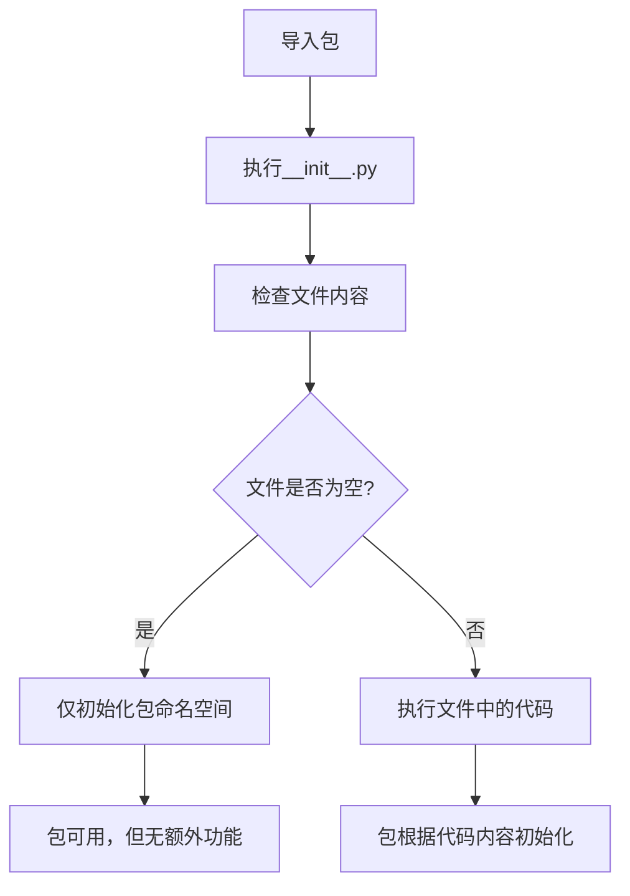

# `.\MetaGPT\metagpt\management\__init__.py` 详细设计文档

这是一个Python包的初始化文件，当前为空文件，仅包含文件头注释信息，用于标识包的元数据和作者信息。

## 整体流程



## 类结构

```
无类层次结构
此文件不包含任何类定义
```

## 全局变量及字段


    

## 全局函数及方法


## 关键组件


### 代码文件

这是一个空的Python包初始化文件，用于标识当前目录为一个Python包。


## 问题及建议


### 已知问题

-   **空文件问题**：当前文件 (`__init__.py`) 仅包含元数据注释和导入声明，未定义任何实际功能、类、函数或变量。这导致该模块在项目中可能不提供任何价值，或者其功能分散在其他文件中，结构不清晰。
-   **缺乏明确职责**：作为包初始化文件，其职责不明确。它可能旨在暴露子模块的公共接口、执行初始化逻辑或定义包级常量，但目前这些均未实现。
-   **潜在的导入错误**：如果此包下的子模块期望通过 `from . import something` 的方式被导入，但 `__init__.py` 中没有相应的导入语句，可能会导致 `ImportError` 或需要使用者直接导入深层子模块，破坏了包的封装性。

### 优化建议

-   **定义包公共接口**：在 `__init__.py` 中显式导入并暴露希望用户直接使用的类、函数或变量。例如，使用 `from .module_a import ClassA, function_b` 或 `__all__ = ['ClassA', 'function_b']` 来声明包的公共API，使用户可以通过 `from your_package import ClassA` 直接访问，而不是 `from your_package.module_a import ClassA`。
-   **执行包初始化代码**：如果包或任何子模块需要初始化（如配置日志、设置环境变量、验证依赖、注册插件等），可以将这些逻辑放在 `__init__.py` 中。确保这些操作是幂等的且不会产生副作用。
-   **添加包级文档字符串**：在文件顶部添加一个模块文档字符串，简要说明此包的目的、主要功能和用法示例。这能极大提升代码的可读性和可维护性。
-   **管理版本信息**：考虑在 `__init__.py` 中定义 `__version__` 变量，便于统一管理和查询包的版本。
-   **移除冗余注释**：如果文件顶部的 `@Time`、`@Author`、`@File` 注释是自动生成且不包含实际有用信息（如版权声明、重要修改记录），可以考虑移除或替换为更有意义的文档字符串，以保持文件简洁。


## 其它


### 设计目标与约束

该代码文件是一个包的初始化模块（`__init__.py`），其主要设计目标是定义Python包的命名空间，并可能执行包的初始化逻辑。当前文件内容为空，表明该包可能仅作为模块的组织结构，或初始化逻辑由其他模块承担。约束包括遵循Python的包导入机制，确保该文件存在以标识目录为Python包。

### 错误处理与异常设计

当前`__init__.py`文件为空，因此不包含任何显式的错误处理或异常抛出逻辑。包的导入过程由Python解释器管理，如果发生导入错误（如模块不存在、语法错误等），解释器将抛出标准的`ImportError`或`SyntaxError`等异常。未来若在该文件中添加代码，需考虑相应的异常处理机制。

### 数据流与状态机

由于当前文件不包含任何可执行代码，因此不存在内部数据流或状态机。该文件仅作为包结构的标识，在Python导入系统中的作用是初始化包的命名空间，其“状态”即包的加载完成与否，由解释器控制。

### 外部依赖与接口契约

该`__init__.py`文件本身没有声明外部依赖。作为包的入口，它隐式依赖于其所在目录下的其他模块（如果存在）。它对外提供的接口（即可导入的名称）由`__all__`变量或文件内定义的全局名称决定，但当前文件未定义任何内容，因此默认不导出任何额外名称，仅暴露通过隐式导入的子模块。

### 安全考虑

空白的`__init__.py`文件不引入特定的安全风险。安全考虑主要在于未来可能在该文件中添加的代码，应避免执行不受信任的动态代码、安全地处理输入输出等。当前状态无需特别的安全措施。

### 测试策略

对于空的`__init__.py`文件，无需编写特定的单元测试。测试重点应放在该包所包含的实际功能模块上。可以编写一个简单的集成测试来验证包能够被成功导入且不引发错误。

### 部署与运维

该文件是标准Python包的一部分，部署时需确保其随整个包目录一起被正确打包（例如在`setup.py`或`pyproject.toml`中声明）。运维中无需针对此文件进行特殊监控或配置。

### 扩展性与维护性

当前为空的`__init__.py`文件具有很高的扩展性，可以在其中添加包的版本信息、便捷的导入语句（如`from .module import Class`）、或初始化代码以增强包的功能。维护简单，但任何修改都需考虑对包用户的影响，特别是对`__all__`和导入结构的更改。

    