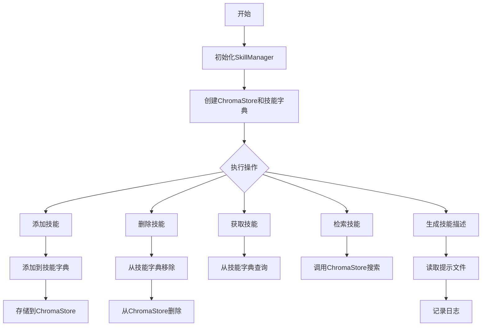
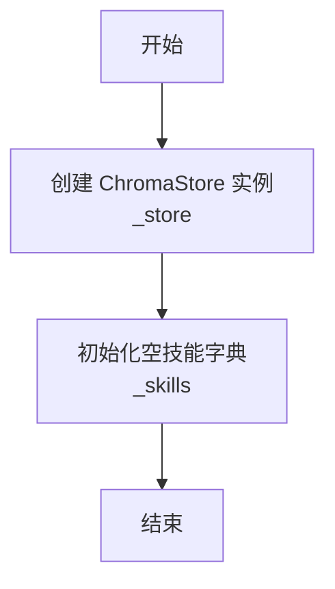
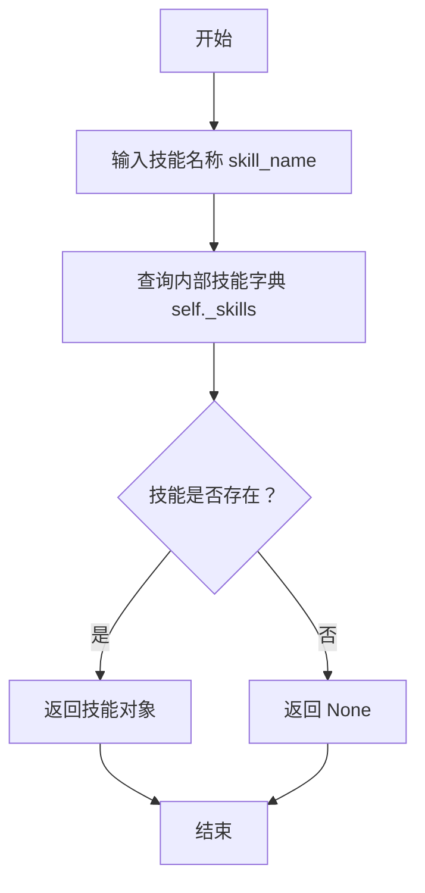

# `.\MetaGPT\metagpt\management\skill_manager.py` 详细设计文档

该代码实现了一个技能管理器，用于管理、存储和检索基于Action类的技能。它通过ChromaStore提供持久化存储和语义搜索能力，支持技能的增删查改以及基于描述的技能检索。

## 整体流程



## 类结构

```
SkillManager
├── 字段: _store, _skills
├── 方法: __init__, add_skill, del_skill, get_skill, retrieve_skill, retrieve_skill_scored, generate_skill_desc
```

## 全局变量及字段


### `Skill`
    
为Action类定义的别名，用于表示技能（Skill）的概念，使代码更具语义化。

类型：`TypeAlias for Action`
    


### `logger`
    
用于记录日志的全局日志记录器实例，来自metagpt.logs模块。

类型：`Logger`
    


### `SkillManager._store`
    
用于存储和检索技能信息的ChromaDB存储实例，支持基于描述的技能搜索。

类型：`ChromaStore`
    


### `SkillManager._skills`
    
存储所有已添加技能的字典，键为技能名称，值为对应的Skill（Action）对象。

类型：`dict[str, Skill]`
    
    

## 全局函数及方法

### `SkillManager.__init__`

该方法用于初始化 `SkillManager` 类的实例，主要职责是创建技能存储和技能字典，为后续的技能管理操作提供基础数据结构。

参数：

- 无显式参数（`self` 为实例自身引用）

返回值：`None`，无显式返回值

#### 流程图



#### 带注释源码

```python
def __init__(self):
    # 初始化一个 ChromaStore 实例，用于技能的持久化存储和检索
    # 存储名称为 "skill_manager"
    self._store = ChromaStore("skill_manager")
    
    # 初始化一个空字典，用于在内存中缓存技能
    # 键为技能名称（字符串），值为 Skill（Action）对象
    self._skills: dict[str:Skill] = {}
```

### `SkillManager.add_skill`

该方法用于向技能管理器添加一个新的技能。它会将技能添加到内存中的技能池（字典）以及可搜索的持久化存储（ChromaDB）中，确保技能可以通过名称快速访问，并能通过描述进行语义检索。

参数：

- `skill`：`Skill`（即`Action`类型），需要添加的技能对象，包含技能的名称和描述等信息。

返回值：`None`，该方法不返回任何值。

#### 流程图

```mermaid
flowchart TD
    A[开始: add_skill(skill)] --> B[将技能存入内存字典<br>self._skills[skill.name] = skill]
    B --> C[将技能存入向量数据库<br>self._store.add(...)]
    C --> D[结束]
```

#### 带注释源码

```python
def add_skill(self, skill: Skill):
    """
    Add a skill, add the skill to the skill pool and searchable storage
    :param skill: Skill
    :return:
    """
    # 1. 将技能对象存入内存字典，以技能名称为键，便于通过名称快速获取。
    self._skills[skill.name] = skill
    # 2. 将技能的描述文本、关联的元数据（名称和描述）以及技能名称作为ID，存入向量数据库（ChromaDB）。
    #    这使得后续可以通过描述进行语义搜索来检索技能。
    self._store.add(skill.desc, {"name": skill.name, "desc": skill.desc}, skill.name)
```

### `SkillManager.del_skill`

该方法用于从技能管理器中删除一个指定的技能。它会将该技能从内存中的技能字典和持久化的向量存储中同时移除。

参数：

- `skill_name`：`str`，要删除的技能的名称。

返回值：`None`，该方法不返回任何值。

#### 流程图

```mermaid
flowchart TD
    A[开始: SkillManager.del_skill(skill_name)] --> B{技能字典中<br>是否存在 skill_name?}
    B -- 是 --> C[从技能字典 _skills 中<br>弹出并删除该技能]
    C --> D[从向量存储 _store 中<br>删除该技能]
    D --> E[结束]
    B -- 否 --> E
```

#### 带注释源码

```python
def del_skill(self, skill_name: str):
    """
    Delete a skill, remove the skill from the skill pool and searchable storage
    :param skill_name: Skill name
    :return:
    """
    # 从内存中的技能字典 `_skills` 中移除指定名称的技能。
    # 如果 `skill_name` 不存在，`pop` 方法会抛出 KeyError 异常。
    self._skills.pop(skill_name)
    # 从持久化的向量存储 `_store` 中删除指定名称的技能条目。
    self._store.delete(skill_name)
```

### `SkillManager.get_skill`

该方法用于根据技能名称从技能管理器中获取特定的技能实例。它通过查询内部技能字典来返回对应的技能对象，如果技能不存在则返回 `None`。

参数：

- `skill_name`：`str`，技能的名称，用于唯一标识一个技能。

返回值：`Skill`，返回与给定名称对应的技能对象；如果技能不存在，则返回 `None`。

#### 流程图



#### 带注释源码

```python
def get_skill(self, skill_name: str) -> Skill:
    """
    根据技能名称获取特定的技能实例。
    该方法通过查询内部技能字典 `self._skills` 来返回对应的技能对象。
    如果技能不存在，则返回 `None`。

    :param skill_name: 技能的名称，用于唯一标识一个技能。
    :return: 返回与给定名称对应的技能对象；如果技能不存在，则返回 `None`。
    """
    return self._skills.get(skill_name)  # 使用字典的 get 方法获取技能，不存在时返回 None
```


### `SkillManager.retrieve_skill`

该方法通过搜索引擎，根据技能描述检索最相关的技能。它内部调用技能存储库的搜索功能，并返回匹配的技能名称列表。

参数：

-  `desc`：`str`，用于检索相关技能的描述文本。
-  `n_results`：`int`，指定要返回的匹配结果数量，默认为2。

返回值：`list[Skill]`，返回一个包含匹配技能名称的列表。注意：根据源码实现，实际返回的是搜索结果中`"ids"`字段的第一个元素，其类型为`list[str]`，即技能名称列表。方法签名中声明的返回类型`list[Skill]`与实现不完全一致，这可能是潜在的技术债务。

#### 流程图

```mermaid
flowchart TD
    A[开始: retrieve_skill(desc, n_results)] --> B[调用 self._store.search<br>传入 desc 和 n_results]
    B --> C{搜索完成?}
    C -->|是| D[获取搜索结果字典中的 'ids' 键<br>并取第一个元素 list[str]]
    D --> E[返回技能名称列表]
    C -->|否| F[返回空列表或异常]
    F --> E
```

#### 带注释源码

```python
def retrieve_skill(self, desc: str, n_results: int = 2) -> list[Skill]:
    """
    通过搜索引擎获取技能
    :param desc: 技能描述
    :return: 多个技能
    """
    # 调用底层的 ChromaStore 实例的 search 方法进行语义搜索。
    # search 方法返回一个字典，其中 'ids' 键对应的值是一个列表的列表，
    # 每个子列表代表一次查询的结果（此处仅一次查询）。
    # 通过 ["ids"][0] 取出第一次查询结果中的技能标识符（技能名称）列表。
    return self._store.search(desc, n_results=n_results)["ids"][0]
```


### `SkillManager.retrieve_skill_scored`

该方法通过搜索引擎（基于向量数据库）根据给定的技能描述，检索出最相关的技能，并返回一个包含技能ID、元数据（如名称和描述）以及相关性分数的字典。

参数：

-  `desc`：`str`，用于检索相关技能的描述性文本。
-  `n_results`：`int`，指定要返回的最相关结果的数量，默认为2。

返回值：`dict`，一个字典，通常包含以下键：`'ids'`（技能标识符列表）、`'metadatas'`（技能元数据列表）和`'distances'`（查询向量与技能向量之间的距离/分数列表）。距离越小通常表示相关性越高。

#### 流程图

```mermaid
flowchart TD
    A[开始: retrieve_skill_scored(desc, n_results)] --> B[调用 self._store.search(desc, n_results)]
    B --> C{底层向量数据库执行检索}
    C --> D[返回包含 ids, metadatas, distances 的字典]
    D --> E[方法结束，返回结果字典]
```

#### 带注释源码

```python
def retrieve_skill_scored(self, desc: str, n_results: int = 2) -> dict:
    """
    通过搜索引擎获取技能
    :param desc: 技能描述
    :return: 由技能和分数组成的字典
    """
    # 调用底层的 ChromaStore 实例的 search 方法进行向量相似性检索。
    # 传入查询描述 `desc` 和期望的结果数量 `n_results`。
    # 返回一个字典，其中包含匹配的技能ID、元数据以及对应的距离分数。
    return self._store.search(desc, n_results=n_results)
```


### `SkillManager.generate_skill_desc`

该方法旨在为给定的技能（Action）生成描述性文本。其核心逻辑是从预设的提示模板文件路径中读取一个Markdown模板文件，并将文件内容记录到日志中。**注意：根据提供的代码，该方法当前并未实际使用传入的`skill`参数来生成描述，也未返回任何字符串，其功能是不完整的。**

参数：

-  `skill`：`Skill`（即`Action`），需要生成描述的目标技能对象。

返回值：`str`，理论上应返回生成的技能描述字符串，但当前实现中该方法没有`return`语句，实际返回值为`None`。

#### 流程图

```mermaid
flowchart TD
    A[开始: generate_skill_desc(skill)] --> B[构造提示文件路径 path]
    B --> C[从路径 path 读取文件内容 text]
    C --> D[将 text 记录到日志 logger]
    D --> E[结束: 隐式返回 None]
```

#### 带注释源码

```python
def generate_skill_desc(self, skill: Skill) -> str:
    """
    为每个技能生成描述性文本
    :param skill: 技能对象
    :return: 理论上应返回描述字符串，但当前未实现
    """
    # 步骤1: 根据常量PROMPT_PATH，拼接生成技能描述的提示模板文件路径。
    path = PROMPT_PATH / "generate_skill.md"
    
    # 步骤2: 读取上述路径指向的Markdown文件内容。
    text = path.read_text()
    
    # 步骤3: 将读取到的文件内容记录到日志中（INFO级别）。
    # 问题: 此步骤仅为日志记录，并未利用`skill`参数，也未对`text`进行处理或返回。
    logger.info(text)
    
    # 缺失: 方法签名声明返回`str`，但此处没有`return`语句。
    # 实际执行将隐式返回`None`，与类型注解不符，这是一个功能缺陷。
```


## 关键组件


### ChromaStore

用于存储和检索技能信息的向量数据库组件，支持基于描述的相似性搜索。

### Skill (Action)

技能的基础表示单元，继承自Action类，每个技能实例包含名称和描述等属性，是SkillManager管理的核心对象。

### 技能检索引擎

基于向量相似度的搜索机制，通过技能描述文本在向量空间中进行语义匹配，返回最相关的技能列表。

### 技能描述生成器

根据技能模板生成标准化描述文本的组件，使用外部提示文件作为模板来源。


## 问题及建议


### 已知问题

-   **`retrieve_skill` 方法返回类型与实现不符**：方法签名声明返回 `list[Skill]`，但实际实现返回的是 `self._store.search(...)["ids"][0]`。根据 `ChromaStore.search` 的典型返回结构（如 `retrieve_skill_scored` 方法所示），这很可能返回一个字符串列表（技能名称），而非 `Skill` 对象列表。这会导致类型错误和调用方逻辑混乱。
-   **`generate_skill_desc` 方法逻辑不完整**：该方法读取了一个提示模板文件，记录了其内容，但没有使用传入的 `skill` 参数，也没有返回任何生成的描述文本。其功能与名称不符，目前是一个无效的方法。
-   **技能删除操作缺乏健壮性**：`del_skill` 方法直接使用 `self._skills.pop(skill_name)` 和 `self._store.delete(skill_name)`。如果 `skill_name` 不存在于字典中，`pop` 会引发 `KeyError`。同样，如果技能不存在于存储中，`delete` 操作也可能失败或引发异常。
-   **`__init__` 中硬编码了存储标识**：初始化 `ChromaStore` 时使用了固定的字符串 `"skill_manager"`。这使得 `SkillManager` 的实例无法灵活地使用不同的存储命名空间或路径，降低了代码的可配置性和复用性。
-   **潜在的资源管理问题**：代码没有展示 `ChromaStore` 的连接生命周期管理（如 `__del__` 或 `close` 方法）。在长期运行的应用中，可能会存在数据库连接未正确关闭的风险。

### 优化建议

-   **修正 `retrieve_skill` 方法的返回逻辑**：应使其实际返回 `Skill` 对象列表。建议先通过 `retrieve_skill_scored` 或直接调用 `_store.search` 获取技能名称（ID）列表，然后使用 `get_skill` 方法将这些名称映射为 `Skill` 对象并返回。同时更新方法签名和文档以反映其真实行为。
-   **完善或重构 `generate_skill_desc` 方法**：明确该方法的设计目标。如果目的是生成技能描述，则应实现模板渲染逻辑（例如，使用 `skill` 参数填充 `generate_skill.md` 模板）并返回生成的描述字符串。如果此功能不再需要，应考虑移除该方法。
-   **增强 `del_skill` 方法的健壮性**：在删除技能前，应先检查技能是否存在。可以使用 `self._skills.get(skill_name)` 进行检查，或者使用 `self._skills.pop(skill_name, None)` 来避免 `KeyError`。对于存储删除操作，也应考虑处理可能出现的异常。
-   **将存储标识参数化**：考虑在 `__init__` 方法中添加一个参数（如 `collection_name`），允许在创建 `SkillManager` 实例时指定底层存储的集合名称。这提高了组件的灵活性。
-   **明确资源管理职责**：如果 `ChromaStore` 需要显式清理，应在 `SkillManager` 类中提供 `close` 或 `__enter__`/`__exit__` 方法，以确保资源被正确释放。或者，在项目层面明确约定生命周期管理方式。
-   **考虑添加批量操作和查询方法**：例如，`add_skills(skills: List[Skill])`、`get_all_skills() -> List[Skill]` 等方法，可以提高使用效率。
-   **改进错误处理与日志记录**：在关键操作（如存储增删查改）周围添加更细致的异常捕获和日志记录，有助于调试和监控。


## 其它


### 设计目标与约束

该模块旨在提供一个轻量级、可扩展的技能管理系统，用于在智能体框架中注册、存储、检索和管理可执行的`Action`（技能）。核心设计目标包括：1) 提供基于内存字典和持久化向量数据库的双层技能存储与快速检索能力；2) 支持通过技能名称进行精确查找和通过自然语言描述进行语义相似度检索；3) 保持接口简洁，与框架中的`Action`基类无缝集成。主要约束是依赖外部的`ChromaStore`进行向量化存储和检索，技能的描述文本质量直接影响语义检索的准确性。

### 错误处理与异常设计

当前代码中显式的错误处理较少。`add_skill`和`del_skill`方法直接操作字典和数据库，如果传入的`skill`对象格式不正确或`skill_name`不存在，可能会引发`KeyError`或底层存储的异常。`get_skill`在技能不存在时返回`None`，调用方需自行处理。`retrieve_skill`和`retrieve_skill_scored`方法依赖`_store.search`，其内部可能因查询失败或数据库连接问题而抛出异常。`generate_skill_desc`方法中读取文件可能引发`FileNotFoundError`或`IOError`。建议在关键操作中添加`try-except`块，并定义自定义异常（如`SkillNotFoundError`, `SkillStorageError`）以提高代码健壮性和可调试性。

### 数据流与状态机

系统数据流始于技能的注册（`add_skill`）。一个`Skill`（即`Action`）对象被同时添加到内存字典`_skills`（用于键值快速访问）和向量数据库`_store`（用于语义检索）。`_store`中存储的数据包括技能的描述文本（作为可搜索的文档）、关联的元数据（如技能名称和描述）以及技能名称作为ID。检索时存在两条路径：1) 通过`get_skill(skill_name)`直接从`_skills`字典获取；2) 通过`retrieve_skill(desc)`或`retrieve_skill_scored(desc)`向`_store`发起语义查询，返回匹配的技能ID列表，再间接关联到`_skills`中的技能对象。删除操作（`del_skill`）需同步更新两个存储。系统本身没有复杂的状态转换，主要状态是`_skills`字典和`_store`数据库内容的一致性。

### 外部依赖与接口契约

1.  **内部依赖**:
    *   `metagpt.actions.Action`: 技能管理的核心对象，所有技能都是其子类或实例。依赖其`name`和`desc`属性。
    *   `metagpt.document_store.chromadb_store.ChromaStore`: 提供技能的向量化存储、索引和语义检索功能。`SkillManager`与其契约是通过`add`, `delete`, `search`方法交互，传递特定的数据格式。
    *   `metagpt.const.PROMPT_PATH`: 用于定位技能描述生成模板的文件路径。
    *   `metagpt.logs.logger`: 用于记录信息日志。

2.  **接口契约**:
    *   `__init__()`: 初始化技能存储。无参数。
    *   `add_skill(skill: Skill) -> None`: 契约要求传入的`skill`对象必须具有`name`和`desc`属性。
    *   `del_skill(skill_name: str) -> None`: 契约要求`skill_name`必须已存在于系统中。
    *   `get_skill(skill_name: str) -> Skill | None`: 返回找到的技能对象，未找到则返回`None`。
    *   `retrieve_skill(desc: str, n_results: int = 2) -> list[Skill]`: 返回与描述语义最接近的`n_results`个技能对象列表。
    *   `retrieve_skill_scored(desc: str, n_results: int = 2) -> dict`: 返回一个字典，包含语义检索的详细结果（如ID、距离分数等）。
    *   `generate_skill_desc(skill: Skill) -> str`: （当前未实现完整功能）计划根据模板生成技能描述，目前仅读取模板文件并记录日志。

### 性能考量

*   **优势**: `get_skill`操作基于哈希字典，时间复杂度为O(1)，效率极高。内存缓存`_skills`避免了频繁的数据库访问。
*   **瓶颈**: `retrieve_skill`系列操作依赖于向量数据库的近似最近邻搜索，其性能受数据库规模、索引构建方式和查询复杂度影响，是系统的潜在性能瓶颈。
*   **一致性**: 双存储（内存字典与向量库）带来了数据一致性的挑战。当前的`add_skill`和`del_skill`是同步操作，但在并发环境下或操作中途失败时，可能产生不一致状态。
*   **扩展性**: 当技能数量极大时，内存字典`_skills`可能占用较多内存。向量数据库的检索速度可能下降，需考虑分库分片或更高效的索引策略。

### 安全与权限控制

当前代码未体现任何安全或权限控制机制。在实际应用中，可能需要考虑：1) 技能操作的权限验证（如哪些用户或角色可以添加、删除技能）；2) 技能内容的安全性，防止注入恶意代码（因为技能本质上是可执行的`Action`）；3) 向量数据库的访问权限控制。这些都需要在更上层的业务逻辑或框架层面进行设计和实现。

### 测试策略建议

1.  **单元测试**: 针对每个公有方法编写测试用例，包括正常流程和边界情况（如添加重复技能、删除不存在的技能、空描述检索等）。使用Mock对象隔离`ChromaStore`的依赖。
2.  **集成测试**: 测试`SkillManager`与真实的`ChromaStore`的集成，验证技能的双向存储和检索功能是否正常工作，数据是否一致。
3.  **性能测试**: 模拟大量技能的添加和并发检索，评估系统的响应时间和资源消耗，特别是语义检索的性能。
4.  **一致性测试**: 模拟在添加或删除操作过程中抛出异常的场景，验证系统状态是否能够保持一致性或具备恢复机制。

    