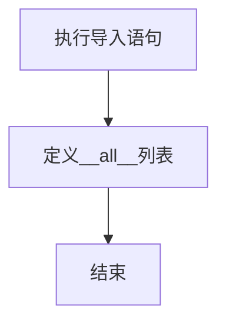

# `.\MetaGPT\metagpt\memory\__init__.py` 详细设计文档

这是一个Python包的初始化文件，主要功能是定义包的公共接口，从metagpt.memory.memory模块导入Memory类，并声明包的导出成员。

## 整体流程



## 类结构

```
metagpt.memory (包)
├── __init__.py (当前文件)
└── memory.py (外部模块，包含Memory类)
```

## 全局变量及字段


### `__all__`
    
一个字符串列表，定义了此模块的公共接口，指定了当使用 'from module import *' 时哪些名称会被导出。

类型：`List[str]`
    


    

## 全局函数及方法


## 关键组件


### Memory

一个基础的记忆组件，用于存储和管理信息。

### LongTermMemory (已注释)

一个长期记忆组件，用于持久化存储和检索信息，当前代码中已被注释掉，未启用。


## 问题及建议


### 已知问题

-   **代码结构不完整**：当前文件仅作为模块的`__init__.py`，导入了`Memory`类，但注释掉了`LongTermMemory`类的导入。这表明`LongTermMemory`功能可能尚未实现或处于开发暂停状态，导致模块功能不完整。
-   **潜在的导入错误**：如果`LongTermMemory`类在`metagpt.memory.longterm_memory`模块中实际存在，但在此处被注释掉，那么其他尝试从该模块导入`LongTermMemory`的代码将引发`ImportError`。
-   **缺乏版本控制信息**：文件头部的注释包含了作者和创建时间，但没有版本号或变更历史，不利于追踪模块的迭代和变更。

### 优化建议

-   **明确功能状态**：应评估`LongTermMemory`类的开发状态。如果已废弃，应删除相关代码和导入语句；如果仍在开发中，应取消注释并确保其功能可用，或者添加明确的`TODO`注释说明开发计划。
-   **完善模块导出**：确保`__all__`列表与实际的导出内容保持一致。如果决定不导出`LongTermMemory`，应从`__all__`列表中移除；如果决定导出，则应取消注释并添加到列表中。
-   **添加模块文档字符串**：在文件顶部添加模块级别的文档字符串，简要说明`memory`模块的职责、包含的主要组件（如`Memory`和`LongTermMemory`）及其关系，提高代码可读性。
-   **考虑使用相对导入**：检查项目结构，如果合适，可以考虑使用相对导入（例如`from .memory import Memory`），以增强模块的封装性和可移植性。
-   **规范化文件头**：考虑在文件头部添加标准的版本信息或引用外部的`CHANGELOG.md`文件，以更好地管理代码变更历史。


## 其它


### 设计目标与约束

该模块的设计目标是提供一个基础的内存抽象，用于在智能体系统中存储和检索信息。主要约束包括：保持接口简洁，便于后续扩展为不同类型的记忆（如短期记忆、长期记忆）；与现有智能体框架无缝集成；确保内存操作的高效性和线程安全性。

### 错误处理与异常设计

当前代码未显式定义错误处理机制。预期在 `Memory` 类及其子类中，对于无效的存储键、检索失败或序列化/反序列化错误等情况，应抛出明确的异常（如 `KeyError`, `SerializationError`）。全局导入语句应处理模块导入失败的情况，但当前代码中未体现。

### 数据流与状态机

该 `__init__.py` 文件本身不定义数据流或状态机。它作为 `metagpt.memory` 包的入口点，负责导出公共接口（当前仅 `Memory` 类）。数据流和状态管理将由具体的 `Memory` 类及其实现来定义，例如数据如何从智能体写入内存，又如何被查询和读取。

### 外部依赖与接口契约

1.  **内部依赖**：依赖于同一项目内的 `metagpt.memory.memory` 模块中的 `Memory` 类。
2.  **外部依赖**：无直接第三方库依赖。但 `Memory` 类的具体实现可能依赖如 `pickle`、数据库驱动等。
3.  **接口契约**：通过 `__all__` 变量明确定义了本模块对外公开的接口，即 `Memory` 类。这承诺了使用者可以通过 `from metagpt.memory import Memory` 来获取 `Memory` 类。被注释的 `LongTermMemory` 表明该功能在规划中但尚未实现或发布。

### 配置与初始化

该文件不涉及配置管理。内存系统的配置（如存储路径、缓存大小、序列化方式）预计将在 `Memory` 类或其子类的构造函数或专门的配置类中进行初始化。

### 安全考虑

当前代码无直接安全风险。但在 `Memory` 类的实现中，如果涉及从不可信源加载序列化数据，需要考虑反序列化安全（如使用 `pickle` 时的风险）。此外，若内存存储敏感信息，需考虑数据的加密存储和访问控制。

### 测试策略

应对 `metagpt.memory` 包进行单元测试和集成测试。单元测试应覆盖 `Memory` 类及其方法的核心功能（存储、检索、更新、删除）。集成测试应验证智能体与内存组件的正确交互。测试应模拟各种边界情况，如内存满、键冲突等。

### 部署与运维

该模块作为核心库的一部分进行打包和部署。运维方面，需要关注内存使用情况，防止内存泄漏。如果未来 `LongTermMemory` 涉及持久化存储，则需要制定相应的数据备份与恢复策略。

### 扩展性与维护性

通过定义基础的 `Memory` 抽象类或接口，为未来扩展不同的记忆存储策略（如 `ShortTermMemory`， `LongTermMemory`， `VectorMemory`）奠定了基础。代码结构清晰，符合 Python 包规范，便于维护。`__all__` 的使用有助于维护公共API的清晰度。

    