# `.\MetaGPT\metagpt\memory\brain_memory.py` 详细设计文档

该代码定义了一个名为 `BrainMemory` 的类，用于实现智能代理的长期记忆存储与管理。其核心功能包括：1) 存储对话历史 (`history`) 和知识库 (`knowledge`)，支持通过 Redis 进行持久化缓存；2) 提供自动摘要生成功能，能够将冗长的对话历史压缩为简洁的总结；3) 支持语义相关性判断和文本重写，以增强记忆的关联性和信息密度；4) 通过滑动窗口和递归摘要策略处理超长文本，确保在 LLM 的 token 限制内完成摘要任务。该类是 MetaGPT 框架中 Agent 长期记忆系统的关键组件。

## 整体流程

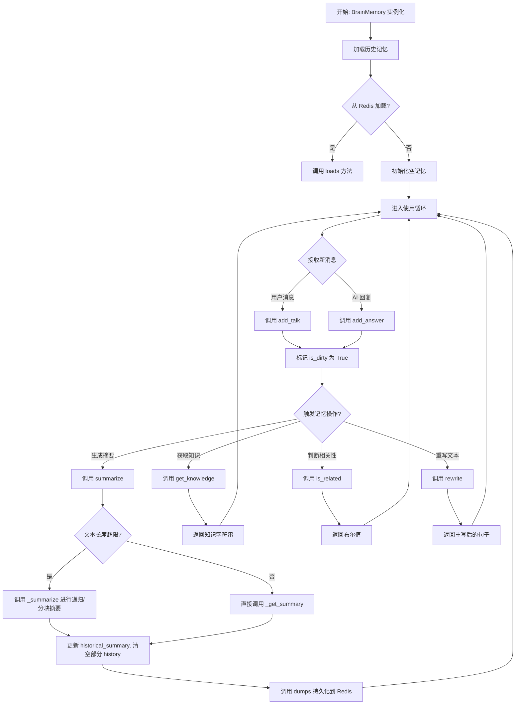

## 类结构

```
BrainMemory (继承自 pydantic.BaseModel)
├── 字段 (Fields)
│   ├── history: List[Message]
│   ├── knowledge: List[Message]
│   ├── historical_summary: str
│   ├── last_history_id: str
│   ├── is_dirty: bool
│   ├── last_talk: Optional[str]
│   ├── cacheable: bool
│   ├── llm: Optional[BaseLLM]
│   └── config: Optional[_Config]
├── 验证器 (Validators)
│   └── set_default_config (classmethod)
├── 配置类 (Config Class)
│   └── arbitrary_types_allowed = True
├── 实例方法 (Instance Methods)
│   ├── add_talk
│   ├── add_answer
│   ├── get_knowledge
│   ├── loads
│   ├── dumps
│   ├── set_history_summary
│   ├── add_history
│   ├── exists
│   ├── pop_last_talk
│   ├── summarize
│   ├── get_title
│   ├── is_related
│   ├── rewrite
│   ├── _openai_summarize
│   ├── _metagpt_summarize
│   ├── _summarize
│   └── _get_summary
└── 静态方法 (Static Methods)
    ├── to_redis_key
    ├── to_int
    ├── to_metagpt_history_format
    ├── _metagpt_is_related
    ├── _openai_is_related
    ├── _metagpt_rewrite
    ├── _openai_rewrite
    ├── extract_info
    └── split_texts
```

## 全局变量及字段


### `BrainMemory.history`
    
存储对话历史消息的列表，用于记录用户和助手之间的交互。

类型：`List[Message]`
    


### `BrainMemory.knowledge`
    
存储知识库消息的列表，用于长期存储和检索相关信息。

类型：`List[Message]`
    


### `BrainMemory.historical_summary`
    
历史对话的摘要文本，用于压缩和概括之前的对话内容。

类型：`str`
    


### `BrainMemory.last_history_id`
    
最后一条历史消息的ID，用于防止重复添加消息。

类型：`str`
    


### `BrainMemory.is_dirty`
    
标记内存状态是否已修改，用于决定是否需要持久化到存储。

类型：`bool`
    


### `BrainMemory.last_talk`
    
存储最后一次对话的内容，用于临时缓存或特殊处理。

类型：`Optional[str]`
    


### `BrainMemory.cacheable`
    
标记内存是否可缓存，控制是否将数据持久化到Redis等存储。

类型：`bool`
    


### `BrainMemory.llm`
    
语言模型实例，用于执行摘要生成、相关性判断等自然语言处理任务。

类型：`Optional[BaseLLM]`
    


### `BrainMemory.config`
    
配置对象，包含Redis连接、语言设置等运行时配置信息。

类型：`Optional[_Config]`
    
    

## 全局函数及方法

### `BrainMemory.add_talk`

该方法用于将用户消息添加到大脑记忆的历史记录中，并标记为“用户”角色，同时将内存状态标记为“脏”（需要持久化）。

参数：
- `msg`：`Message`，要添加的消息对象，其内容将被视为用户输入。

返回值：`None`，该方法不返回任何值。

#### 流程图

```mermaid
flowchart TD
    A[开始: add_talk(msg)] --> B[设置消息角色为 'user']
    B --> C[调用 add_history(msg) 添加历史记录]
    C --> D[设置 is_dirty 为 True]
    D --> E[结束]
```

#### 带注释源码

```python
def add_talk(self, msg: Message):
    """
    Add message from user.
    """
    # 将传入消息的角色强制设置为“用户”
    msg.role = "user"
    # 调用内部方法将消息添加到历史记录列表中
    self.add_history(msg)
    # 将内存状态标记为“脏”，表示内容已更改，需要后续持久化
    self.is_dirty = True
```

### `BrainMemory.add_answer`

该方法用于添加来自LLM（大语言模型）的回复消息到对话历史中，并将其标记为“助手”角色，同时将内存状态标记为“脏”（需要持久化）。

参数：
- `msg`：`Message`，需要添加的LLM回复消息对象。

返回值：`None`，该方法不返回任何值。

#### 流程图

```mermaid
flowchart TD
    A[开始: add_answer(msg)] --> B[设置消息角色为 'assistant']
    B --> C[调用 add_history(msg) 方法]
    C --> D[将消息添加到 history 列表]
    D --> E[更新 last_history_id]
    E --> F[设置 is_dirty 为 True]
    F --> G[结束]
```

#### 带注释源码

```python
def add_answer(self, msg: Message):
    """Add message from LLM"""  # 方法描述：添加来自LLM的消息
    msg.role = "assistant"  # 将传入消息的角色设置为“助手”
    self.add_history(msg)   # 调用内部方法将消息添加到历史记录中
    self.is_dirty = True    # 将内存状态标记为“脏”，表示内容已更改需要保存
```

### `BrainMemory.get_knowledge`

该方法用于获取存储在`BrainMemory`实例中所有知识（`knowledge`）的文本内容。它遍历`knowledge`列表，提取每个`Message`对象的`content`字段，并将这些内容连接成一个字符串返回。

参数：
- 无

返回值：`str`，返回一个由所有知识内容拼接而成的字符串，每个知识内容之间用换行符分隔。

#### 流程图

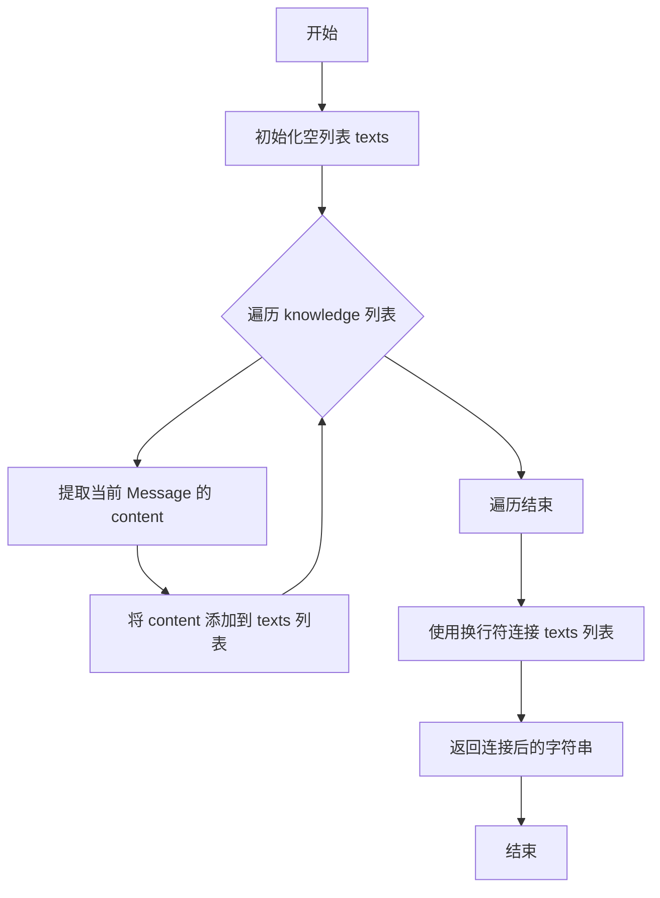

#### 带注释源码

```python
def get_knowledge(self) -> str:
    # 遍历 self.knowledge 列表，提取每个 Message 对象的 content 字段
    texts = [m.content for m in self.knowledge]
    # 使用换行符连接所有提取出的文本内容，形成一个完整的字符串
    return "\n".join(texts)
```

### `BrainMemory.loads`

该方法用于从Redis缓存中加载一个序列化的`BrainMemory`对象。它接收一个Redis键名，尝试从Redis中获取对应的JSON数据，如果数据存在则反序列化为`BrainMemory`对象并返回，同时将对象的`is_dirty`标志设为`False`。如果键名为空或数据不存在，则返回一个新的空`BrainMemory`对象。

参数：

- `redis_key`：`str`，用于在Redis中定位数据的键名。

返回值：`BrainMemory`，返回从Redis加载的`BrainMemory`对象，如果加载失败则返回一个新的空对象。

#### 流程图

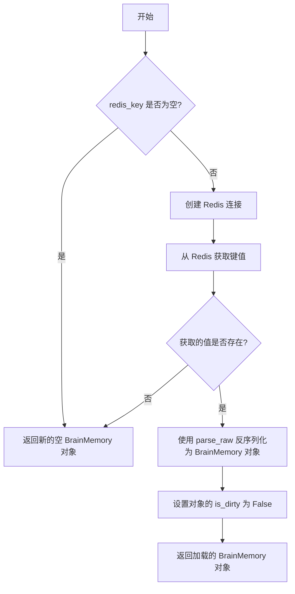

#### 带注释源码

```python
async def loads(self, redis_key: str) -> "BrainMemory":
    # 创建Redis连接，使用配置中的Redis连接参数
    redis = Redis(self.config.redis)
    # 检查传入的Redis键名是否为空
    if not redis_key:
        # 如果键名为空，直接返回一个新的空BrainMemory对象
        return BrainMemory()
    # 尝试从Redis中异步获取指定键名的值
    v = await redis.get(key=redis_key)
    # 记录调试日志，显示获取的键名和值
    logger.debug(f"REDIS GET {redis_key} {v}")
    # 检查获取的值是否存在
    if v:
        # 如果值存在，使用Pydantic的parse_raw方法将JSON字符串反序列化为BrainMemory对象
        bm = BrainMemory.parse_raw(v)
        # 将加载对象的脏数据标志设为False，表示数据与存储一致
        bm.is_dirty = False
        # 返回加载的对象
        return bm
    # 如果Redis中没有找到数据，返回一个新的空BrainMemory对象
    return BrainMemory()
```

### `BrainMemory.dumps`

该方法用于将`BrainMemory`实例的当前状态序列化为JSON格式，并持久化存储到Redis缓存中。它仅在实例的`is_dirty`标志为`True`（表示数据有变更）时执行存储操作，并支持设置缓存过期时间。

参数：

- `redis_key`：`str`，用于在Redis中存储和检索此`BrainMemory`实例的唯一键。
- `timeout_sec`：`int`，可选参数，默认为`1800`秒（30分钟），指定Redis键的生存时间（TTL）。

返回值：`None`，该方法不返回任何值，其执行效果是更新外部缓存状态。

#### 流程图

```mermaid
flowchart TD
    A[开始: dumps(redis_key, timeout_sec)] --> B{检查 is_dirty?}
    B -- 否 --> C[结束]
    B -- 是 --> D{检查 redis_key 是否有效?}
    D -- 否 --> C
    D -- 是 --> E[创建 Redis 连接]
    E --> F[将实例序列化为 JSON]
    F --> G{检查 cacheable?}
    G -- 否 --> H[跳过缓存设置]
    G -- 是 --> I[调用 Redis.set 存储数据]
    I --> J[记录调试日志]
    J --> K[重置 is_dirty 为 False]
    H --> K
    K --> C
```

#### 带注释源码

```python
async def dumps(self, redis_key: str, timeout_sec: int = 30 * 60):
    # 1. 检查脏数据标志，如果数据未变更，则直接返回，避免不必要的I/O操作。
    if not self.is_dirty:
        return
    # 2. 根据配置初始化Redis连接。
    redis = Redis(self.config.redis)
    # 3. 验证提供的Redis键是否有效，无效则返回。
    if not redis_key:
        return False
    # 4. 使用Pydantic的`model_dump_json`方法将当前实例序列化为JSON字符串。
    v = self.model_dump_json()
    # 5. 检查实例是否允许被缓存。
    if self.cacheable:
        # 6. 调用Redis异步接口，将JSON数据存储到指定的键中，并设置过期时间。
        await redis.set(key=redis_key, data=v, timeout_sec=timeout_sec)
        # 7. 记录调试日志，便于追踪数据存储操作。
        logger.debug(f"REDIS SET {redis_key} {v}")
    # 8. 无论是否实际执行了缓存操作，都将脏数据标志重置为False，表示当前状态已同步。
    self.is_dirty = False
```

### `BrainMemory.set_history_summary`

该方法用于更新`BrainMemory`实例的历史摘要(`historical_summary`)。如果传入的新摘要与当前存储的摘要不同，它会更新摘要并清空当前的历史记录(`history`)，然后将更新后的状态持久化到Redis缓存中。如果摘要相同但实例的`is_dirty`标志为`True`，它也会执行持久化操作。此方法主要用于在生成新的历史摘要后，重置对话上下文，为新的对话轮次做准备。

参数：
- `history_summary`：`str`，新的历史摘要文本。
- `redis_key`：`str`，用于在Redis中存储当前`BrainMemory`实例状态的键。

返回值：`None`，此方法不返回任何值。

#### 流程图

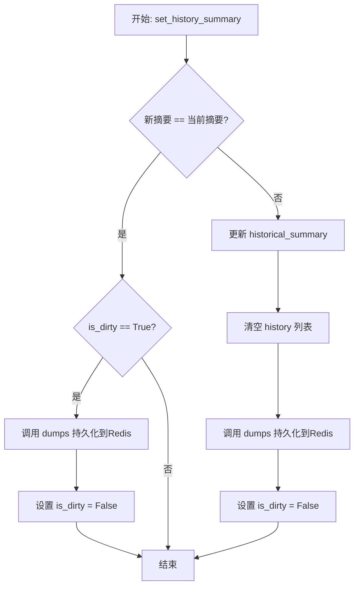

#### 带注释源码

```python
async def set_history_summary(self, history_summary, redis_key):
    # 检查传入的新摘要是否与当前存储的摘要相同
    if self.historical_summary == history_summary:
        # 如果摘要相同，但实例状态有变更（is_dirty为True），则执行持久化
        if self.is_dirty:
            await self.dumps(redis_key=redis_key)
            self.is_dirty = False
        # 无论是否持久化，方法在此处结束
        return

    # 如果新摘要与当前摘要不同，则更新摘要
    self.historical_summary = history_summary
    # 清空当前的历史记录列表，为新对话轮次做准备
    self.history = []
    # 将更新后的完整状态（新摘要、空历史）持久化到Redis
    await self.dumps(redis_key=redis_key)
    # 重置脏数据标志
    self.is_dirty = False
```

### `BrainMemory.add_history`

该方法用于向历史记录中添加新的消息，并确保消息按ID顺序添加，避免重复或乱序。

参数：

- `msg`：`Message`，要添加的消息对象，包含消息内容和ID等信息。

返回值：`None`，无返回值。

#### 流程图

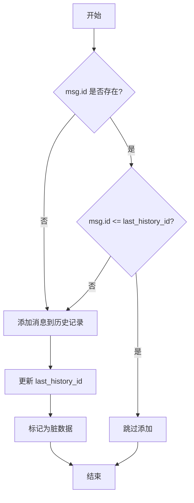

#### 带注释源码

```python
def add_history(self, msg: Message):
    # 检查消息是否有ID，并且ID是否大于最后一条历史记录的ID
    if msg.id:
        if self.to_int(msg.id, 0) <= self.to_int(self.last_history_id, -1):
            # 如果消息ID小于或等于最后一条历史记录的ID，则跳过添加
            return

    # 将消息添加到历史记录列表中
    self.history.append(msg)
    # 更新最后一条历史记录的ID
    self.last_history_id = str(msg.id)
    # 标记内存状态为脏数据，表示需要持久化
    self.is_dirty = True
```

### `BrainMemory.exists`

检查给定的文本内容是否存在于历史消息记录中，通过从最新到最旧的顺序遍历历史消息，比较消息内容与给定文本是否完全一致。

参数：

- `text`：`str`，需要检查是否存在于历史消息中的文本内容

返回值：`bool`，如果历史消息中存在内容与给定文本完全一致的消息则返回 `True`，否则返回 `False`

#### 流程图

```mermaid
flowchart TD
    A[开始: exists(text)] --> B[初始化循环: 从history末尾开始]
    B --> C{还有历史消息?}
    C -- 是 --> D[获取当前消息m]
    D --> E{m.content == text?}
    E -- 是 --> F[返回 True]
    E -- 否 --> G[移动到前一条消息]
    G --> C
    C -- 否 --> H[返回 False]
    F --> I[结束]
    H --> I
```

#### 带注释源码

```python
def exists(self, text) -> bool:
    # 从最新的消息开始，反向遍历历史消息列表
    for m in reversed(self.history):
        # 如果当前消息的内容与传入的文本完全一致
        if m.content == text:
            # 找到匹配项，返回True
            return True
    # 遍历完所有历史消息未找到匹配项，返回False
    return False
```

### `BrainMemory.pop_last_talk`

该方法用于获取并清除`BrainMemory`实例中存储的最后一次对话内容（`last_talk`）。它返回最后一次对话的字符串，并将内部状态重置为`None`，确保该内容不会被重复获取。

参数：
- 无

返回值：`Optional[str]`，返回存储的最后一次对话内容。如果之前没有存储对话内容，则返回`None`。

#### 流程图

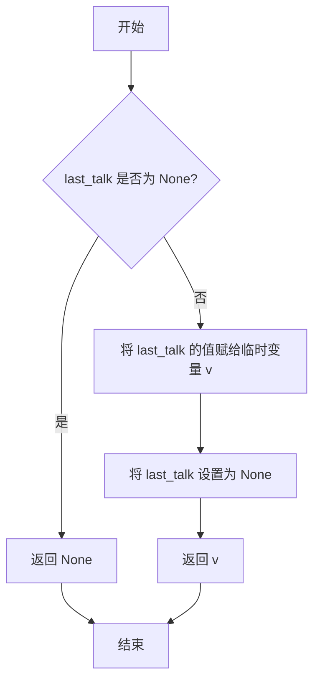

#### 带注释源码

```python
def pop_last_talk(self):
    # 将当前存储的最后一次对话内容保存到临时变量 v 中
    v = self.last_talk
    # 将内部状态 last_talk 重置为 None，防止内容被重复使用
    self.last_talk = None
    # 返回之前保存的最后一次对话内容
    return v
```

### `BrainMemory.summarize`

该方法用于对历史对话和知识库内容进行智能摘要，支持两种不同的LLM后端（MetaGPTLLM和OpenAI兼容LLM）。对于OpenAI类LLM，它会将历史摘要和当前对话历史合并后进行智能总结，并更新存储；对于MetaGPTLLM，则采用简单的截断策略。

参数：

- `llm`：`BaseLLM`，用于生成摘要的语言模型实例
- `max_words`：`int`，可选，默认200，摘要的最大字数限制
- `keep_language`：`bool`，可选，默认False，是否保持原文语言
- `limit`：`int`，可选，默认-1，触发摘要的文本长度阈值（-1表示总是触发）
- `**kwargs`：`Any`，其他可选参数

返回值：`str`，生成的摘要文本

#### 流程图

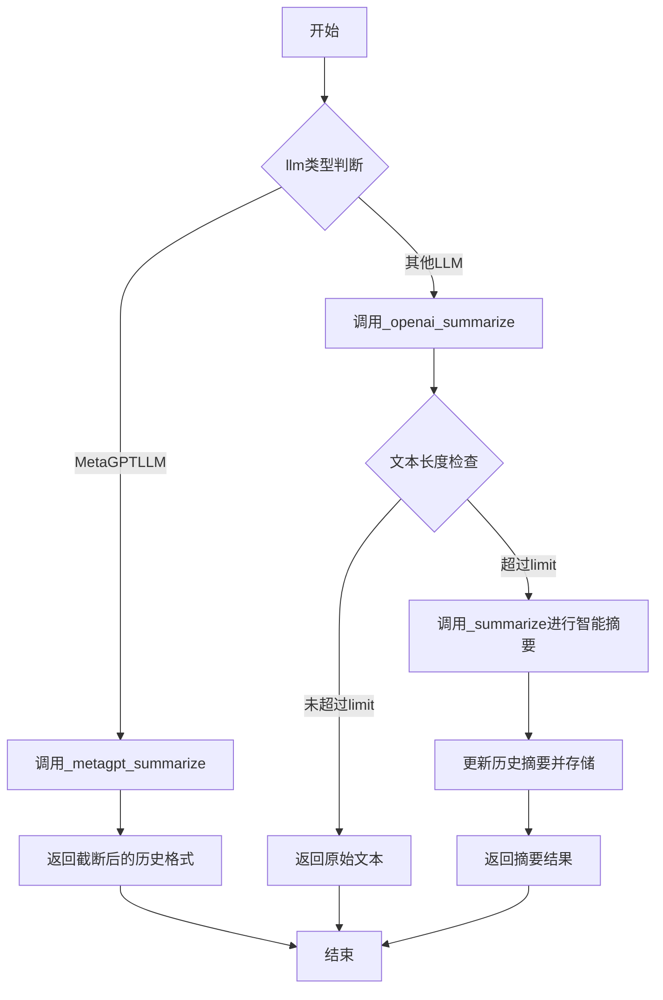

#### 带注释源码

```python
async def summarize(self, llm, max_words=200, keep_language: bool = False, limit: int = -1, **kwargs):
    # 判断LLM类型，选择不同的摘要策略
    if isinstance(llm, MetaGPTLLM):
        # 对于MetaGPTLLM，使用简单的截断策略
        return await self._metagpt_summarize(max_words=max_words)

    # 对于OpenAI兼容LLM，设置实例并调用智能摘要
    self.llm = llm
    return await self._openai_summarize(llm=llm, max_words=max_words, keep_language=keep_language, limit=limit)
```

### `BrainMemory.get_title`

该方法用于基于对话历史生成一个简洁的标题。它首先尝试对历史进行摘要，然后根据配置的语言要求，指示LLM将摘要提炼成一个不超过指定字数的标题。

参数：

- `llm`：`BaseLLM`，用于生成标题的语言模型实例。
- `max_words`：`int`，可选，默认为5。指定生成标题的最大单词数。
- `**kwargs`：`Any`，其他可选关键字参数，当前方法中未使用。

返回值：`str`，生成的标题字符串。

#### 流程图

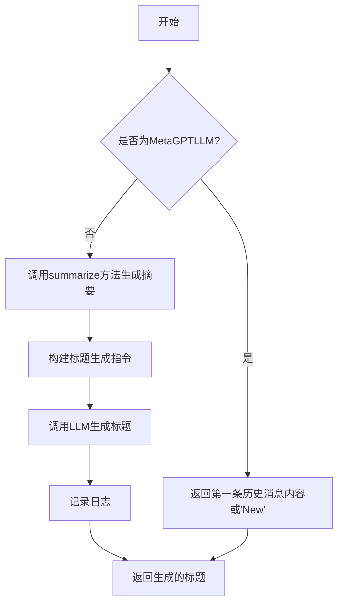

#### 带注释源码

```python
async def get_title(self, llm, max_words=5, **kwargs) -> str:
    """Generate text title"""
    # 检查是否为MetaGPTLLM类型，如果是，则直接返回第一条历史消息的内容，若无历史则返回"New"
    if isinstance(llm, MetaGPTLLM):
        return self.history[0].content if self.history else "New"

    # 调用summarize方法，生成一个最多500字的摘要
    summary = await self.summarize(llm=llm, max_words=500)

    # 从配置中获取目标语言，并构建指令，要求LLM将摘要翻译成指定语言的标题
    language = self.config.language
    command = f"Translate the above summary into a {language} title of less than {max_words} words."
    # 将摘要和指令拼接成完整的消息
    summaries = [summary, command]
    msg = "\n".join(summaries)
    # 记录请求消息到调试日志
    logger.debug(f"title ask:{msg}")
    # 调用LLM的aask方法生成标题
    response = await llm.aask(msg=msg, system_msgs=[], stream=False)
    # 记录响应消息到调试日志
    logger.debug(f"title rsp: {response}")
    # 返回LLM生成的标题
    return response
```

### `BrainMemory.is_related`

该方法用于判断两段文本（`text1` 和 `text2`）在语义上是否相关。它根据传入的 `llm` 参数类型，选择使用 MetaGPTLLM 或 OpenAI 兼容的 LLM 进行判断。对于 MetaGPTLLM，直接返回 `False`；对于 OpenAI 兼容的 LLM，它会构造一个包含两段文本的上下文，并提示 LLM 判断其相关性，最终根据 LLM 的响应返回布尔值。

参数：

- `text1`：`str`，需要判断相关性的第一段文本。
- `text2`：`str`，需要判断相关性的第二段文本。
- `llm`：`BaseLLM`，用于进行语义相关性判断的语言模型实例。

返回值：`bool`，如果 `text1` 和 `text2` 在语义上相关则返回 `True`，否则返回 `False`。

#### 流程图

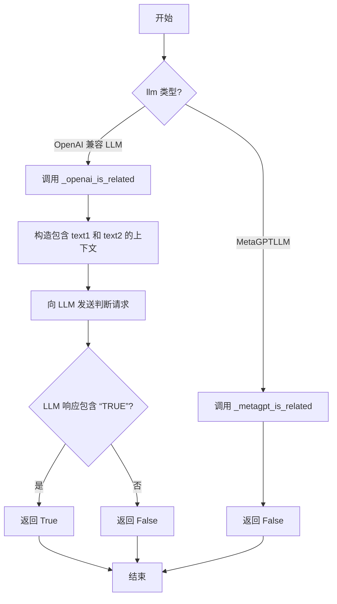

#### 带注释源码

```python
async def is_related(self, text1, text2, llm):
    # 根据传入的 llm 类型，选择不同的实现方法
    if isinstance(llm, MetaGPTLLM):
        # 如果是 MetaGPTLLM 类型，调用对应的内部方法（目前直接返回 False）
        return await self._metagpt_is_related(text1=text1, text2=text2, llm=llm)
    # 否则，调用 OpenAI 兼容 LLM 的实现方法
    return await self._openai_is_related(text1=text1, text2=text2, llm=llm)

@staticmethod
async def _metagpt_is_related(**kwargs):
    # MetaGPTLLM 的默认实现，直接返回 False
    # 这可能是一个占位符或特定场景下的简化逻辑
    return False

@staticmethod
async def _openai_is_related(text1, text2, llm, **kwargs):
    # 构造一个清晰的提示上下文，将两段文本分别标记为 Paragraph 1 和 Paragraph 2
    context = f"## Paragraph 1\n{text2}\n---\n## Paragraph 2\n{text1}\n"
    # 向 LLM 发送请求，要求其判断两段文本的语义相关性
    rsp = await llm.aask(
        msg=context,
        system_msgs=[
            "You are a tool capable of determining whether two paragraphs are semantically related."
            'Return "TRUE" if "Paragraph 1" is semantically relevant to "Paragraph 2", otherwise return "FALSE".'
        ],
        stream=False,
    )
    # 根据 LLM 的响应是否包含 "TRUE" 字符串来判断结果
    result = True if "TRUE" in rsp else False
    # 为了日志清晰，移除文本中的换行符
    p2 = text2.replace("\n", "")
    p1 = text1.replace("\n", "")
    # 记录详细的判断日志，便于调试和审计
    logger.info(f"IS_RELATED:\nParagraph 1: {p2}\nParagraph 2: {p1}\nRESULT: {result}\n")
    # 返回最终的布尔值结果
    return result
```

### `BrainMemory.rewrite`

该方法用于根据给定的上下文（Context）对输入的句子（Sentence）进行重写或信息增强。它会调用大语言模型（LLM）来理解上下文，并将上下文中的相关信息自然地融入到原句中，从而生成一个信息更丰富、更符合语境的句子。该方法支持不同的LLM后端（如OpenAI和MetaGPT），并会根据使用的LLM类型调用不同的内部实现。

参数：

- `sentence`：`str`，需要被重写或增强的原始句子。
- `context`：`str`，提供额外信息的上下文文本，用于增强原句。
- `llm`：`BaseLLM`，用于执行重写任务的大语言模型实例。

返回值：`str`，返回经过LLM处理后的、增强了上下文信息的新句子。

#### 流程图

```mermaid
flowchart TD
    A[开始: rewrite(sentence, context, llm)] --> B{llm 类型是 MetaGPTLLM?};
    B -- 是 --> C[调用 _metagpt_rewrite];
    C --> D[返回原句 sentence];
    B -- 否 --> E[调用 _openai_rewrite];
    E --> F[构建提示词 prompt];
    F --> G[调用 llm.aask 获取响应];
    G --> H[记录日志];
    H --> I[返回LLM生成的句子 rsp];
    D --> J[结束];
    I --> J;
```

#### 带注释源码

```python
    async def rewrite(self, sentence: str, context: str, llm):
        # 根据传入的LLM类型，决定调用哪个具体的重写方法
        if isinstance(llm, MetaGPTLLM):
            # 如果是MetaGPTLLM，调用其专用方法（当前版本直接返回原句）
            return await self._metagpt_rewrite(sentence=sentence, context=context, llm=llm)
        # 默认调用OpenAI兼容的LLM处理方法
        return await self._openai_rewrite(sentence=sentence, context=context, llm=llm)

    @staticmethod
    async def _metagpt_rewrite(sentence: str, **kwargs):
        # MetaGPTLLM版本的重写方法，当前实现为直接返回原句，未做任何处理。
        # 这是一个潜在的扩展点，未来可以集成MetaGPT特有的重写逻辑。
        return sentence

    @staticmethod
    async def _openai_rewrite(sentence: str, context: str, llm):
        # 为OpenAI兼容的LLM构建提示词，将上下文和原句清晰地分隔开。
        prompt = f"## Context\n{context}\n---\n## Sentence\n{sentence}\n"
        # 调用LLM，并指定系统提示，指导模型如何利用上下文增强原句。
        rsp = await llm.aask(
            msg=prompt,
            system_msgs=[
                'You are a tool augmenting the "Sentence" with information from the "Context".',
                "Do not supplement the context with information that is not present, especially regarding the subject and object.",
                "Return the augmented sentence.",
            ],
            stream=False,
        )
        # 记录重写操作的输入和输出，便于调试和追踪。
        logger.info(f"REWRITE:\nCommand: {prompt}\nRESULT: {rsp}\n")
        # 返回LLM生成的重写后的句子。
        return rsp
```

### `BrainMemory._openai_summarize`

该方法用于对存储在`BrainMemory`中的历史对话和已有的历史摘要进行总结。它首先将历史摘要和所有历史消息内容合并成一个文本，然后检查文本长度是否超过指定的限制。如果超过限制，则调用内部的`_summarize`方法进行总结；如果未超过限制，则直接返回合并后的文本。总结完成后，会更新`BrainMemory`的历史摘要字段，并将更新后的状态持久化到Redis缓存中。

参数：

- `llm`：`BaseLLM`，用于执行文本总结任务的大语言模型实例。
- `max_words`：`int`，可选，默认值为200。指定总结文本的最大单词数。
- `keep_language`：`bool`，可选，默认值为False。指示是否保持总结文本与原始文本相同的语言。
- `limit`：`int`，可选，默认值为-1。指定触发总结的文本长度阈值。如果文本长度小于此值，则直接返回原始文本。

返回值：`str`，返回总结后的文本字符串。如果总结成功，则返回总结文本；如果文本过长且总结失败，则抛出`ValueError`异常。

#### 流程图

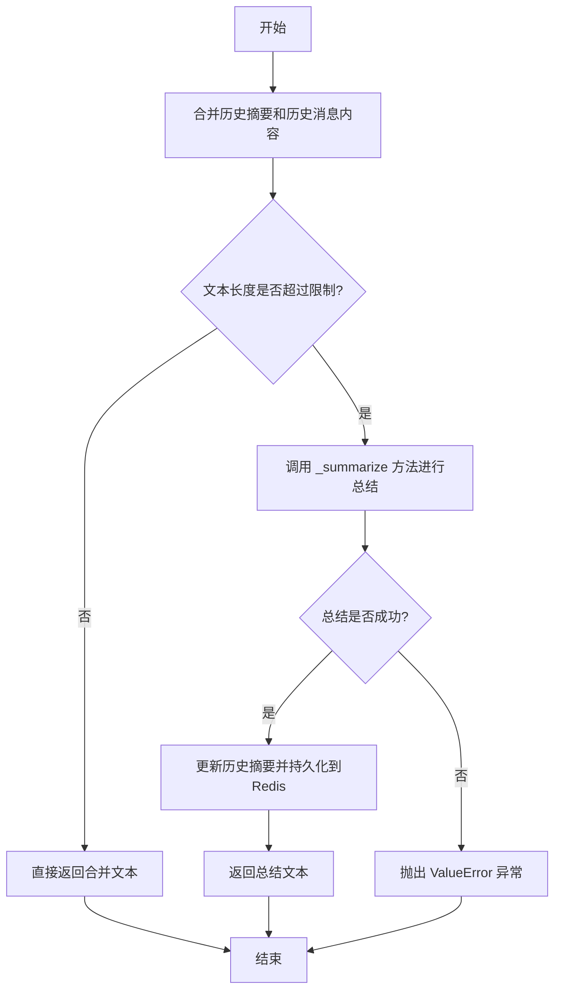

#### 带注释源码

```python
async def _openai_summarize(self, llm, max_words=200, keep_language: bool = False, limit: int = -1):
    # 1. 将历史摘要和所有历史消息内容合并成一个文本
    texts = [self.historical_summary]
    for m in self.history:
        texts.append(m.content)
    text = "\n".join(texts)

    # 2. 检查文本长度是否超过指定的限制
    text_length = len(text)
    if limit > 0 and text_length < limit:
        # 如果未超过限制，直接返回合并后的文本
        return text

    # 3. 调用内部的 _summarize 方法进行总结
    summary = await self._summarize(text=text, max_words=max_words, keep_language=keep_language, limit=limit)

    # 4. 如果总结成功，更新历史摘要并持久化到Redis
    if summary:
        await self.set_history_summary(history_summary=summary, redis_key=self.config.redis_key)
        return summary

    # 5. 如果总结失败（例如文本过长），抛出异常
    raise ValueError(f"text too long:{text_length}")
```

### `BrainMemory._metagpt_summarize`

该方法用于在特定条件下（当使用的LLM是`MetaGPTLLM`类型时）对`BrainMemory`实例中的历史对话记录进行摘要。其核心逻辑是：从最新的历史消息开始，反向遍历并选取内容，直到累积的字符数达到指定的`max_words`上限，然后截断并保留这些消息，最后将处理后的历史消息列表转换为特定的JSON格式字符串返回。此过程会直接修改`self.history`并标记数据为脏状态，随后尝试将更新后的状态持久化到Redis缓存中。

参数：
-  `self`：`BrainMemory`，当前`BrainMemory`类的实例。
-  `max_words`：`int`，可选参数，默认值为200。指定摘要结果允许的最大字符数（更准确地说是用于控制选取历史消息内容的总长度上限）。

返回值：`str`，返回一个JSON格式的字符串，该字符串是经过截断处理后的历史消息列表的序列化表示。如果`self.history`为空，则返回空字符串`""`。

#### 流程图

```mermaid
flowchart TD
    A[开始] --> B{self.history 是否为空?}
    B -- 是 --> C[返回空字符串 ""]
    B -- 否 --> D[初始化 total_length = 0, msgs = []]
    D --> E[反向遍历 self.history]
    E --> F{遍历结束?}
    F -- 是 --> G[反转 msgs 列表]
    F -- 否 --> H[计算当前消息内容长度 delta]
    H --> I{total_length + delta > max_words?}
    I -- 否 --> J[将当前消息 m 加入 msgs]
    J --> K[total_length += delta]
    K --> E
    I -- 是 --> L[计算剩余可容纳长度 left = max_words - total_length]
    L --> M{left == 0?}
    M -- 是 --> F
    M -- 否 --> N[截取当前消息内容的前 left 个字符]
    N --> O[将截取后的消息加入 msgs]
    O --> G
    G --> P[更新 self.history = msgs, self.is_dirty = True]
    P --> Q[调用 self.dumps 持久化到Redis]
    Q --> R[设置 self.is_dirty = False]
    R --> S[调用 to_metagpt_history_format 格式化并返回]
    S --> T[结束]
```

#### 带注释源码

```python
async def _metagpt_summarize(self, max_words=200):
    # 检查历史记录是否为空，为空则直接返回空字符串
    if not self.history:
        return ""

    # 初始化总长度和用于存储筛选后消息的列表
    total_length = 0
    msgs = []
    # 从最新的消息开始反向遍历历史记录（即从后往前）
    for m in reversed(self.history):
        # 计算当前消息内容的长度
        delta = len(m.content)
        # 判断加入当前消息后是否会超过总长度限制
        if total_length + delta > max_words:
            # 计算还能容纳的字符数
            left = max_words - total_length
            if left == 0:
                # 如果剩余容量为0，则停止添加消息
                break
            # 截取当前消息内容的前`left`个字符
            m.content = m.content[0:left]
            # 将截取后的消息加入列表
            msgs.append(m)
            # 由于已达到上限，跳出循环
            break
        # 如果未超限，则将完整消息加入列表
        msgs.append(m)
        # 更新已使用的总长度
        total_length += delta
    # 将列表反转回原始的时间顺序（因为之前是反向遍历的）
    msgs.reverse()
    # 用处理后的消息列表替换原始历史记录
    self.history = msgs
    # 标记内存状态为“脏”，表示已修改需要持久化
    self.is_dirty = True
    # 尝试将当前BrainMemory实例的状态保存到Redis缓存
    await self.dumps(redis_key=self.config.redis.key)
    # 持久化完成后，重置脏标记
    self.is_dirty = False

    # 调用静态方法，将处理后的历史消息列表转换为特定的JSON格式字符串并返回
    return BrainMemory.to_metagpt_history_format(self.history)
```

### `BrainMemory._summarize`

该方法用于对长文本进行自动摘要。当输入文本超过指定长度限制时，它会将文本分割成多个窗口，分别对每个窗口进行摘要，然后递归地合并摘要结果，直到生成一个满足长度要求的最终摘要。

参数：

- `text`：`str`，需要被摘要的原始文本。
- `max_words`：`int`，默认值为200，指定摘要的最大单词数。
- `keep_language`：`bool`，默认值为False，指示生成的摘要是否应保持与原始文本相同的语言。
- `limit`：`int`，默认值为-1，指定文本长度的阈值。如果文本长度小于此阈值，则直接返回原文本，不进行摘要。

返回值：`str`，返回生成的摘要文本。

#### 流程图

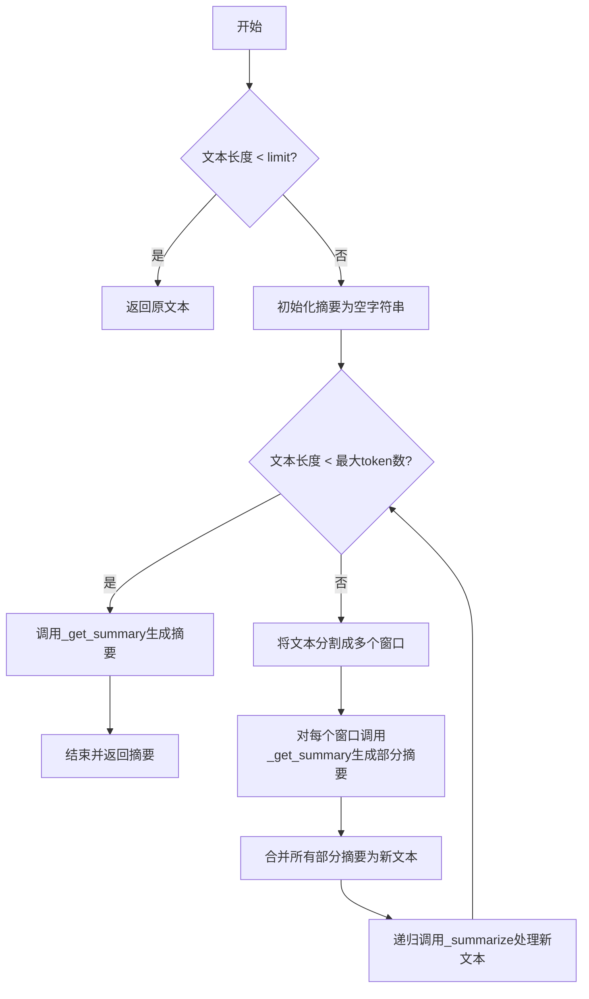

#### 带注释源码

```python
async def _summarize(self, text: str, max_words=200, keep_language: bool = False, limit: int = -1) -> str:
    # 定义最大token数，用于判断是否需要分割文本
    max_token_count = DEFAULT_MAX_TOKENS
    # 设置最大递归次数，防止无限循环
    max_count = 100
    # 获取输入文本的长度
    text_length = len(text)
    # 如果设置了长度限制且文本长度小于该限制，则直接返回原文本
    if limit > 0 and text_length < limit:
        return text
    # 初始化摘要字符串
    summary = ""
    # 进入循环，最多执行max_count次
    while max_count > 0:
        # 如果文本长度小于最大token数，则直接生成摘要
        if text_length < max_token_count:
            summary = await self._get_summary(text=text, max_words=max_words, keep_language=keep_language)
            break

        # 设置填充大小，用于实现滑动窗口的重叠
        padding_size = 20 if max_token_count > 20 else 0
        # 将长文本分割成多个窗口
        text_windows = self.split_texts(text, window_size=max_token_count - padding_size)
        # 计算每个窗口摘要的最大单词数
        part_max_words = min(int(max_words / len(text_windows)) + 1, 100)
        summaries = []
        # 对每个窗口生成摘要
        for ws in text_windows:
            response = await self._get_summary(text=ws, max_words=part_max_words, keep_language=keep_language)
            summaries.append(response)
        # 如果只有一个窗口，则直接使用其摘要
        if len(summaries) == 1:
            summary = summaries[0]
            break

        # 合并所有窗口的摘要，形成新的文本
        text = "\n".join(summaries)
        text_length = len(text)

        # 减少递归计数器，防止无限循环
        max_count -= 1  # safeguard
    # 返回最终生成的摘要
    return summary
```

### `BrainMemory._get_summary`

该方法是一个私有异步方法，用于调用配置的大语言模型（LLM）对输入的文本进行摘要生成。它接收一段文本，并指示LLM将其总结为不超过指定字数的摘要。如果原始文本长度已经小于目标字数，则直接返回原文本。该方法主要用于长文本的压缩和摘要生成，是`BrainMemory`类中`_summarize`方法的核心组件。

参数：

- `text`：`str`，需要被总结的原始文本内容。
- `max_words`：`int`，默认值为20，指定生成摘要的最大字数限制。
- `keep_language`：`bool`，默认值为`False`，指示生成的摘要是否必须与原始文本保持相同的语言。

返回值：`str`，返回由LLM生成的、符合字数限制的文本摘要。

#### 流程图

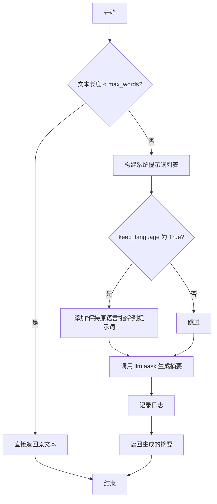

#### 带注释源码

```python
async def _get_summary(self, text: str, max_words=20, keep_language: bool = False):
    """Generate text summary"""
    # 1. 边界检查：如果输入文本长度小于目标字数，直接返回原文本，无需调用LLM。
    if len(text) < max_words:
        return text

    # 2. 构建系统提示词列表，指示LLM的角色和核心任务。
    system_msgs = [
        "You are a tool for summarizing and abstracting text.",
        f"Return the summarized text to less than {max_words} words.",
    ]

    # 3. 根据参数决定是否添加“保持原语言”的指令。
    if keep_language:
        system_msgs.append("The generated summary should be in the same language as the original text.")

    # 4. 调用配置的LLM实例的异步提问方法，传入待总结的文本和系统提示词。
    response = await self.llm.aask(msg=text, system_msgs=system_msgs, stream=False)

    # 5. 记录调试日志，便于追踪输入和输出。
    logger.debug(f"{text}\nsummary rsp: {response}")

    # 6. 返回LLM生成的摘要。
    return response
```

### `BrainMemory.to_redis_key`

这是一个静态方法，用于根据给定的前缀、用户ID和聊天ID生成一个格式化的Redis键字符串。

参数：
- `prefix`：`str`，Redis键的前缀，通常用于标识应用或模块。
- `user_id`：`str`，用户的唯一标识符。
- `chat_id`：`str`，聊天会话的唯一标识符。

返回值：`str`，返回一个由前缀、用户ID和聊天ID组成的字符串，格式为`{prefix}:{user_id}:{chat_id}`。

#### 流程图

```mermaid
flowchart TD
    A[开始] --> B[接收参数 prefix, user_id, chat_id]
    B --> C[拼接字符串 f"{prefix}:{user_id}:{chat_id}"]
    C --> D[返回拼接后的字符串]
    D --> E[结束]
```

#### 带注释源码

```python
    @staticmethod
    def to_redis_key(prefix: str, user_id: str, chat_id: str):
        # 使用f-string将三个参数拼接成一个字符串，格式为`{prefix}:{user_id}:{chat_id}`
        return f"{prefix}:{user_id}:{chat_id}"
```

### `BrainMemory.to_int`

这是一个静态工具方法，用于安全地将一个值转换为整数。如果转换失败（例如，输入不是有效的数字字符串），则返回一个预设的默认值，确保程序的健壮性。

参数：
- `v`：`Any`，需要被转换为整数的值。
- `default_value`：`int`，当转换失败时返回的默认整数值。

返回值：`int`，转换成功后的整数值，或转换失败时的默认值。

#### 流程图

```mermaid
flowchart TD
    A[开始: to_int(v, default_value)] --> B{尝试将 v 转换为 int}
    B -- 成功 --> C[返回转换后的整数]
    B -- 失败 --> D[返回 default_value]
    C --> E[结束]
    D --> E
```

#### 带注释源码

```python
    @staticmethod
    def to_int(v, default_value):
        """
        安全地将一个值转换为整数。
        如果转换失败（例如，v不是有效的数字字符串），则返回指定的默认值。

        Args:
            v (Any): 需要被转换为整数的值。
            default_value (int): 转换失败时返回的默认值。

        Returns:
            int: 转换成功后的整数值，或转换失败时的默认值。
        """
        try:
            # 尝试将输入值v转换为整数
            return int(v)
        except:
            # 如果转换过程中发生任何异常（如ValueError, TypeError），则捕获异常并返回默认值
            return default_value
```

### `BrainMemory.to_metagpt_history_format`

这是一个静态方法，用于将 `BrainMemory` 实例中的历史消息列表（`history`）转换为 MetaGPT 框架内部使用的历史消息格式字符串。该格式是一个 JSON 字符串，其中每个消息都被序列化为一个包含 `role` 和 `content` 字段的字典。

参数：

- `history`：`List[Message]`，需要被转换的历史消息对象列表。

返回值：`str`，一个 JSON 格式的字符串，表示序列化后的消息列表。

#### 流程图

```mermaid
flowchart TD
    A[开始: 输入历史消息列表 history] --> B{列表是否为空?}
    B -- 是 --> C[返回空字符串]
    B -- 否 --> D[遍历 history 列表]
    D --> E[将每个 Message 对象转换为 SimpleMessage 对象]
    E --> F[调用 SimpleMessage.model_dump() 获取字典]
    F --> G[将所有字典收集到列表 mmsg 中]
    G --> H[使用 json.dumps 将 mmsg 序列化为 JSON 字符串]
    H --> I[返回 JSON 字符串]
    I --> J[结束]
```

#### 带注释源码

```python
    @staticmethod
    def to_metagpt_history_format(history) -> str:
        """
        将 Message 对象列表转换为 MetaGPT 内部使用的历史格式字符串。
        该格式是一个 JSON 字符串，包含每个消息的 'role' 和 'content' 信息。

        参数:
            history (List[Message]): 需要转换的历史消息列表。

        返回:
            str: 序列化后的 JSON 字符串。
        """
        # 1. 遍历输入的 history 列表，将每个 Message 对象转换为 SimpleMessage 对象，
        #    然后调用 model_dump() 方法将其转换为字典格式。
        #    SimpleMessage 是 Message 的一个简化版本，通常只包含 role 和 content。
        mmsg = [SimpleMessage(role=m.role, content=m.content).model_dump() for m in history]

        # 2. 使用 json.dumps 将字典列表序列化为一个 JSON 字符串。
        #    ensure_ascii=False 参数确保非 ASCII 字符（如中文）能正确显示，而不是被转义。
        return json.dumps(mmsg, ensure_ascii=False)
```

### `BrainMemory._metagpt_is_related`

这是一个静态方法，用于在特定条件下（当使用的语言模型是 `MetaGPTLLM` 类型时）判断两个文本段落是否语义相关。当前实现是一个占位符，直接返回 `False`，表示不执行实际的语义相关性判断。

参数：

-  `kwargs`：`dict`，接收任意关键字参数。在当前实现中，这些参数（如 `text1`, `text2`, `llm`）未被使用。

返回值：`bool`，总是返回 `False`，表示两个文本段落不相关。

#### 流程图

```mermaid
flowchart TD
    A[开始] --> B[接收任意关键字参数 kwargs]
    B --> C[忽略所有参数]
    C --> D[返回 False]
    D --> E[结束]
```

#### 带注释源码

```python
    @staticmethod
    async def _metagpt_is_related(**kwargs):
        # 这是一个占位符方法。
        # 当 `BrainMemory.is_related` 方法检测到使用的语言模型是 `MetaGPTLLM` 类型时，
        # 会调用此方法。当前实现不进行任何处理，直接返回 False。
        # 参数 `kwargs` 包含了调用时传入的 `text1`, `text2`, `llm` 等参数，但在此方法中未被使用。
        return False
```

### `BrainMemory._openai_is_related`

该方法用于判断两个文本段落（`text1` 和 `text2`）在语义上是否相关。它通过调用大型语言模型（LLM）来分析两个段落的内容，并根据模型的返回结果判断相关性。如果模型返回的响应中包含“TRUE”，则认为两个段落相关；否则，认为不相关。

参数：

- `text1`：`str`，第一个文本段落，用于与第二个段落进行语义相关性比较。
- `text2`：`str`，第二个文本段落，作为参考段落，与第一个段落进行语义相关性比较。
- `llm`：`BaseLLM`，大型语言模型实例，用于执行语义相关性分析。
- `**kwargs`：`Any`，其他可选参数，当前方法中未使用。

返回值：`bool`，如果两个文本段落语义相关，返回 `True`；否则返回 `False`。

#### 流程图

```mermaid
graph TD
    A[开始] --> B[构建包含两个段落的上下文]
    B --> C[调用LLM进行语义分析]
    C --> D{LLM返回结果中是否包含“TRUE”?}
    D -->|是| E[返回True]
    D -->|否| F[返回False]
    E --> G[结束]
    F --> G
```

#### 带注释源码

```python
@staticmethod
async def _openai_is_related(text1, text2, llm, **kwargs):
    # 构建包含两个段落的上下文字符串，用于输入给LLM
    context = f"## Paragraph 1\n{text2}\n---\n## Paragraph 2\n{text1}\n"
    
    # 调用LLM的异步ask方法，传入上下文和系统提示
    rsp = await llm.aask(
        msg=context,
        system_msgs=[
            "You are a tool capable of determining whether two paragraphs are semantically related."
            'Return "TRUE" if "Paragraph 1" is semantically relevant to "Paragraph 2", otherwise return "FALSE".'
        ],
        stream=False,
    )
    
    # 根据LLM返回的响应中是否包含“TRUE”来判断相关性
    result = True if "TRUE" in rsp else False
    
    # 为了日志清晰，移除文本中的换行符
    p2 = text2.replace("\n", "")
    p1 = text1.replace("\n", "")
    
    # 记录判断过程和结果到日志
    logger.info(f"IS_RELATED:\nParagraph 1: {p2}\nParagraph 2: {p1}\nRESULT: {result}\n")
    
    # 返回布尔值结果
    return result
```

### `BrainMemory._metagpt_rewrite`

这是一个静态方法，当使用 `MetaGPTLLM` 作为大语言模型时，用于处理文本重写请求。其核心功能是直接返回输入的原始句子，不对其进行任何修改或基于上下文的增强。这通常是一个占位符或默认实现，表明在使用特定LLM时，重写功能未被实现或不需要。

参数：

- `sentence`：`str`，需要被重写的原始句子。
- `**kwargs`：`Any`，可变关键字参数，用于接收方法签名中未明确列出的其他参数（例如 `context` 和 `llm`），但在此方法中会被忽略。

返回值：`str`，直接返回未经修改的输入 `sentence` 参数。

#### 流程图

```mermaid
flowchart TD
    A[开始] --> B[接收参数 sentence 和 **kwargs]
    B --> C[直接返回 sentence 参数]
    C --> D[结束]
```

#### 带注释源码

```python
    @staticmethod
    async def _metagpt_rewrite(sentence: str, **kwargs):
        # 这是一个针对 MetaGPTLLM 的静态重写方法。
        # 它不执行任何基于上下文的文本增强或修改。
        # 参数:
        #   sentence (str): 需要处理的原始句子。
        #   **kwargs: 接收但不使用其他参数（如 context, llm）。
        # 返回值:
        #   str: 原样返回输入的 sentence。
        return sentence
```

### `BrainMemory._openai_rewrite`

这是一个静态异步方法，用于根据给定的上下文（Context）对输入的句子（Sentence）进行信息增强和重写。它通过调用大型语言模型（LLM），将上下文中的相关信息整合到原句中，生成一个更丰富、更准确的句子，同时严格避免引入上下文中不存在的信息。

参数：

- `sentence`：`str`，需要被重写的原始句子。
- `context`：`str`，提供额外信息的上下文文本。
- `llm`：`BaseLLM`，用于执行重写任务的大型语言模型实例。

返回值：`str`，经过LLM增强和重写后的新句子。

#### 流程图

```mermaid
graph TD
    A[开始] --> B[构造提示词Prompt<br/>包含Context和Sentence]
    B --> C[调用LLM.aask方法<br/>传入Prompt和系统指令]
    C --> D{LLM返回结果}
    D --> E[记录日志]
    E --> F[返回重写后的句子]
    F --> G[结束]
```

#### 带注释源码

```python
    @staticmethod
    async def _openai_rewrite(sentence: str, context: str, llm):
        # 1. 构造提示词：将上下文和待重写的句子以特定格式组合。
        prompt = f"## Context\n{context}\n---\n## Sentence\n{sentence}\n"
        # 2. 调用LLM的异步问答接口，传入构造好的提示词和系统指令。
        rsp = await llm.aask(
            msg=prompt,
            system_msgs=[
                # 系统指令1：定义LLM的角色和核心任务。
                'You are a tool augmenting the "Sentence" with information from the "Context".',
                # 系统指令2：强调约束条件，禁止引入上下文之外的信息，特别是关于主语和宾语。
                "Do not supplement the context with information that is not present, especially regarding the subject and object.",
                # 系统指令3：明确要求返回增强后的句子。
                "Return the augmented sentence.",
            ],
            stream=False, # 非流式返回
        )
        # 3. 记录详细的输入输出日志，便于调试和追踪。
        logger.info(f"REWRITE:\nCommand: {prompt}\nRESULT: {rsp}\n")
        # 4. 返回LLM生成的重写结果。
        return rsp
```


### `BrainMemory.extract_info`

这是一个静态方法，用于从输入字符串中提取特定格式的信息。它使用正则表达式匹配模式，如果匹配成功，则返回匹配到的键和值；如果匹配失败，则返回`None`和原始输入字符串。

参数：

-  `input_string`：`str`，需要被解析的输入字符串。
-  `pattern`：`str`，可选参数，用于匹配的正则表达式模式，默认值为`r"\[([A-Z]+)\]:\s*(.+)"`。

返回值：`tuple[Optional[str], str]`，一个包含两个元素的元组。第一个元素是匹配到的键（大写字母字符串），如果匹配失败则为`None`；第二个元素是匹配到的值或原始输入字符串。

#### 流程图

```mermaid
flowchart TD
    A[开始: extract_info(input_string, pattern)] --> B{使用正则表达式 pattern 匹配 input_string}
    B -- 匹配成功 --> C[提取匹配组1作为 key<br>提取匹配组2作为 value]
    C --> D[返回 (key, value)]
    B -- 匹配失败 --> E[返回 (None, input_string)]
    D --> F[结束]
    E --> F
```

#### 带注释源码

```python
    @staticmethod
    def extract_info(input_string, pattern=r"\[([A-Z]+)\]:\s*(.+)"):
        # 使用给定的正则表达式模式尝试匹配输入字符串
        match = re.match(pattern, input_string)
        if match:
            # 如果匹配成功，返回匹配到的第一个捕获组（键）和第二个捕获组（值）
            return match.group(1), match.group(2)
        else:
            # 如果匹配失败，返回 None 和原始输入字符串
            return None, input_string
```


### `BrainMemory.split_texts`

`BrainMemory.split_texts` 是一个静态方法，用于将长文本分割成一系列重叠的文本窗口（滑动窗口）。该方法主要用于处理超出模型上下文长度限制的文本，通过滑动窗口的方式将长文本切分成多个可管理的片段，以便后续进行分块摘要或处理。每个窗口的大小由参数指定，并且相邻窗口之间会有一定的重叠（通过 `padding_size` 控制），以确保上下文信息的连续性。

参数：

- `text`：`str`，需要被分割的原始长文本。
- `window_size`：`int`，每个文本窗口的目标大小（以字符数为单位）。如果传入的值小于等于0，则使用默认的 `DEFAULT_TOKEN_SIZE`。

返回值：`List[str]`，返回一个字符串列表，列表中的每个元素都是一个文本窗口。如果原始文本长度小于或等于窗口大小，则返回包含原始文本的列表。

#### 流程图

```mermaid
flowchart TD
    A[开始: split_texts(text, window_size)] --> B{window_size <= 0?}
    B -- 是 --> C[window_size = DEFAULT_TOKEN_SIZE]
    B -- 否 --> D
    C --> D
    D{total_len <= window_size?}
    D -- 是 --> E[返回 [text]]
    D -- 否 --> F[计算 padding_size 和 data_len]
    F --> G[初始化 idx=0, windows=[]]
    G --> H{idx < total_len?}
    H -- 否 --> I[返回 windows]
    H -- 是 --> J{idx + window_size > total_len?}
    J -- 是 --> K[windows.append(text[idx:])]
    K --> I
    J -- 否 --> L[截取窗口 w = text[idx: idx+window_size]]
    L --> M[windows.append(w)]
    M --> N[idx += data_len]
    N --> H
```

#### 带注释源码

```python
    @staticmethod
    def split_texts(text: str, window_size) -> List[str]:
        """Splitting long text into sliding windows text"""
        # 1. 参数校验与默认值设置：如果窗口大小无效，则使用默认值。
        if window_size <= 0:
            window_size = DEFAULT_TOKEN_SIZE
        # 2. 获取文本总长度。
        total_len = len(text)
        # 3. 边界情况处理：如果文本长度小于等于窗口大小，直接返回整个文本。
        if total_len <= window_size:
            return [text]

        # 4. 计算重叠区域大小和实际数据步长。
        # padding_size 决定了相邻窗口之间的重叠字符数，确保上下文连贯。
        padding_size = 20 if window_size > 20 else 0
        # data_len 是每次窗口移动的步长，等于窗口大小减去重叠部分。
        data_len = window_size - padding_size
        # 5. 初始化结果列表和起始索引。
        windows = []
        idx = 0
        # 6. 循环分割文本，直到处理完所有字符。
        while idx < total_len:
            # 6.1 检查剩余文本是否不足一个完整窗口。
            if window_size + idx > total_len:  # 不足一个滑窗
                # 将剩余所有文本作为一个窗口。
                windows.append(text[idx:])
                break
            # 6.2 截取一个完整的窗口。
            # 每个窗口少算padding_size自然就可实现滑窗功能, 比如: [1, 2, 3, 4, 5, 6, 7, ....]
            # window_size=3, padding_size=1：
            # [1, 2, 3], [3, 4, 5], [5, 6, 7], ....
            #   idx=2,  |  idx=5   |  idx=8  | ...
            w = text[idx : idx + window_size]
            windows.append(w)
            # 6.3 移动索引，步长为 data_len，实现滑动窗口。
            idx += data_len

        # 7. 返回分割后的窗口列表。
        return windows
```

## 关键组件


### 消息历史管理

负责存储和管理用户与AI助手之间的对话历史记录，支持添加、检索、持久化和摘要生成。

### 知识库管理

负责存储和管理长期的知识信息，这些信息独立于对话历史，可用于增强AI的上下文理解。

### Redis持久化缓存

提供基于Redis的序列化存储和加载功能，用于实现BrainMemory对象的长期持久化和状态恢复，支持缓存控制。

### 智能摘要生成

提供基于LLM的自动摘要功能，能够将冗长的对话历史或文本内容压缩为指定长度的概要，支持分块处理和语言保持。

### 语义相关性判断

利用LLM判断两段文本在语义上的相关性，用于知识关联或对话连贯性分析。

### 上下文增强重写

利用LLM根据提供的上下文信息对给定句子进行信息补充和重写，使其更符合上下文语义。

### 文本分割器

提供将长文本分割成指定大小滑动窗口的功能，用于处理超出LLM上下文长度的文本，是长文本摘要的基础组件。


## 问题及建议


### 已知问题

-   **Redis键生成逻辑依赖外部配置**：`to_redis_key` 方法使用 `prefix` 参数，但 `set_history_summary` 和 `_metagpt_summarize` 方法中直接使用了 `self.config.redis_key` 或 `self.config.redis.key`，这要求 `config` 对象必须正确设置这些属性，否则会导致键不一致或错误，使得数据无法正确存储或读取。
-   **`_summarize` 方法存在潜在死循环风险**：该方法使用 `while max_count > 0` 循环来递归合并摘要。如果合并后的文本长度始终大于 `max_token_count`，循环可能无法退出。虽然设置了 `max_count` 作为安全阀，但这掩盖了核心问题：递归合并策略可能导致摘要无法收敛到指定长度。
-   **`_openai_summarize` 方法中的 `limit` 参数逻辑不一致**：该方法在调用 `_summarize` 时传递了 `limit` 参数，但 `_summarize` 方法内部仅在入口处检查 `limit`，在递归合并过程中并未考虑 `limit`，可能导致最终生成的摘要长度超过 `limit` 的原始意图。
-   **`pop_last_talk` 方法缺乏类型安全**：该方法返回 `self.last_talk`，其类型为 `Optional[str]`，但调用方可能期望一个字符串。当 `last_talk` 为 `None` 时，返回 `None` 可能导致下游逻辑错误。
-   **`exists` 方法效率较低**：该方法通过遍历整个 `history` 列表来查找内容，时间复杂度为 O(n)。对于较长的历史记录，这可能会成为性能瓶颈。
-   **`_metagpt_summarize` 方法功能不完整**：该方法仅通过截断历史记录来“总结”，并未真正进行语义上的总结和抽象，与 `_openai_summarize` 的功能存在显著差异，可能导致使用 `MetaGPTLLM` 时行为不符合预期。
-   **`_metagpt_is_related` 和 `_metagpt_rewrite` 方法仅为桩函数**：这两个静态方法直接返回 `False` 或原句，没有实现任何实际功能。如果代码路径调用到这些方法，将无法获得预期的关联性判断或句子重写效果。
-   **`history_text` 属性逻辑可能不完整**：该属性在拼接文本时排除了 `self.history` 的最后一条消息 (`self.history[:-1]`)。这种设计意图不明，可能导致返回的历史上下文缺失最近的一次交互，影响依赖此属性的功能（如对话连贯性）。
-   **`llm` 字段在部分方法中未正确初始化**：在 `_openai_summarize` 和 `_get_summary` 等方法中，直接使用了 `self.llm`，但该字段仅在 `summarize` 方法中被赋值。如果通过其他途径（如直接调用 `_openai_summarize`）且未设置 `llm`，将导致 `AttributeError`。

### 优化建议

-   **统一并封装Redis键管理**：建议在 `BrainMemory` 类内部维护一个生成Redis键的逻辑，例如通过一个 `_make_redis_key` 私有方法，确保在整个类中键的生成方式一致。避免直接依赖外部传入的 `prefix` 或 `config` 中的分散字段。
-   **重构 `_summarize` 方法，避免递归循环**：可以改为迭代算法，明确计算每次分割和总结后的预期长度。或者，当文本过长时，采用更激进的一次性总结策略，而不是试图通过多次合并来达到目标。确保算法有明确的终止条件。
-   **明确 `limit` 参数的设计意图并贯穿使用**：重新审视 `limit` 参数的含义（是总结前的文本长度限制，还是总结后的长度限制？），并在 `_summarize` 的递归过程中也应用此限制，或者在文档中明确其仅作为初始过滤条件。
-   **增强 `pop_last_talk` 方法的健壮性**：考虑在返回前检查 `self.last_talk` 是否为 `None`，并返回一个默认值（如空字符串）或抛出一个明确的异常，使错误更早暴露。
-   **优化 `exists` 方法**：如果 `Message` 对象有唯一标识符（如 `id`），可以考虑使用字典或集合进行缓存，以实现 O(1) 时间复杂度的查找。或者，如果调用不频繁，当前实现也可接受，但需在文档中说明其性能特征。
-   **实现或移除桩方法**：对于 `_metagpt_summarize`、`_metagpt_is_related` 和 `_metagpt_rewrite` 方法，应根据 `MetaGPTLLM` 的实际能力进行实现，或者如果 `MetaGPTLLM` 不支持这些功能，应考虑重构代码逻辑，移除对这些方法的调用路径，或抛出 `NotImplementedError` 异常。
-   **审查并明确 `history_text` 属性的行为**：确认排除最后一条消息是否是预期行为。如果是，应在属性文档中明确说明原因（例如，用于生成下一轮回复的上下文，不包括当前轮的问题）。如果不是，则应修复逻辑以包含所有消息。
-   **确保 `llm` 字段的懒加载或构造函数初始化**：考虑在 `__init__` 方法中提供 `llm` 参数的默认值（如 `None`），并在所有依赖 `self.llm` 的方法开头进行检查。或者，采用依赖注入模式，确保在调用相关方法前，`llm` 已被正确设置。
-   **增加类型注解和文档**：为所有方法参数和返回值添加更详细的类型注解（例如使用 `TypedDict` 或更具体的泛型）。为复杂方法（如 `_summarize`）添加更详细的文档字符串，解释其算法步骤和设计考量。
-   **考虑异步上下文管理器**：对于Redis连接，可以考虑实现 `__aenter__` 和 `__aexit__` 方法，或使用现有的异步上下文管理工具来确保连接的正确获取和释放，避免资源泄漏。
-   **引入配置验证**：在 `Config` 设置或 `loads`/`dumps` 方法中，增加对 `redis_key` 等关键配置项的验证，避免因配置错误导致静默失败。


## 其它


### 设计目标与约束

1.  **长期存储与自动压缩**：核心目标是实现对话历史的长期存储，并通过智能摘要（压缩）机制，在保留核心语义的前提下，控制存储内容的规模，避免无限增长。
2.  **多后端支持**：设计需支持多种存储后端（如内存、Redis）和多种大语言模型（如OpenAI API、MetaGPT内置LLM），通过抽象接口和策略模式实现可插拔性。
3.  **性能与效率**：通过缓存机制（`is_dirty`标志、Redis缓存）减少不必要的序列化/反序列化和I/O操作。摘要和重写等操作需考虑LLM的Token限制，采用分块处理策略。
4.  **数据一致性**：确保对话历史的顺序性（通过`id`字段比较）和状态同步（通过`is_dirty`标志管理持久化时机）。
5.  **资源约束**：受限于外部LLM API的调用成本、延迟以及Token上限，摘要、标题生成、相关性判断等高级功能需进行优化设计（如设置`max_words`、`limit`参数）。

### 错误处理与异常设计

1.  **静默处理**：
    *   `add_history`方法中，通过`to_int`函数静默处理非数字`id`，避免因格式问题中断流程。
    *   `loads`方法在Redis键不存在或值为空时，返回一个新的`BrainMemory`实例，而非抛出异常。
    *   `dumps`方法在`is_dirty`为`False`或`redis_key`为空时直接返回，避免无效操作。
2.  **显式异常**：
    *   `_openai_summarize`方法在文本过长且无法生成摘要时，抛出`ValueError`。
    *   Pydantic模型验证失败时会抛出`ValidationError`。
3.  **日志记录**：
    *   关键操作（如Redis读写、LLM请求与响应、相关性判断、重写操作）均通过`logger`记录`debug`或`info`级别日志，便于调试和审计。
4.  **默认值与回退**：
    *   `config`字段通过验证器设置默认配置。
    *   `to_int`方法提供`default_value`参数作为转换失败时的回退值。
    *   对于MetaGPT LLM，部分高级功能（如`_metagpt_is_related`, `_metagpt_rewrite`）提供无操作的静态方法作为回退。

### 数据流与状态机

1.  **核心数据流**：
    *   **输入**：用户消息（`add_talk`）和AI回复（`add_answer`）作为原始`Message`流入`history`列表。
    *   **处理**：`history`可被`summarize`方法压缩为`historical_summary`，同时清空`history`。`knowledge`列表存储独立的知识片段。
    *   **输出**：通过`history_text`、`get_knowledge`、`summarize`、`get_title`等方法提供格式化后的历史、知识、摘要和标题。
    *   **持久化**：数据通过`dumps`方法序列化为JSON并存储至Redis；通过`loads`方法从Redis反序列化恢复状态。
2.  **状态机（`is_dirty`标志）**：
    *   **初始/干净状态** (`is_dirty=False`)：内存数据与持久化存储一致。
    *   **修改状态** (`is_dirty=True`)：当`history`、`knowledge`、`historical_summary`等字段被`add_history`、`set_history_summary`等方法修改后进入此状态。
    *   **持久化触发**：`dumps`方法检查`is_dirty`，若为`True`则执行Redis存储操作。
    *   **状态重置**：成功执行`loads`、`dumps`或`set_history_summary`（当摘要未变化且已持久化）后，`is_dirty`被重置为`False`。
3.  **缓存状态** (`cacheable`)：控制实例是否允许被持久化到Redis缓存。

### 外部依赖与接口契约

1.  **大语言模型 (BaseLLM)**：
    *   **依赖**：`BaseLLM`抽象类（来自`metagpt.provider.base_llm`）。
    *   **契约**：依赖其`aask`方法进行异步文本生成。通过`isinstance(llm, MetaGPTLLM)`进行运行时类型检查，以适配不同LLM提供商的行为差异（如摘要、相关性判断、重写）。
2.  **配置系统 (Config)**：
    *   **依赖**：`Config`类（来自`metagpt.config2`）。
    *   **契约**：通过`config`字段获取Redis连接配置(`redis`)、语言设置(`language`)等。使用`Config.default()`作为后备。
3.  **Redis缓存**：
    *   **依赖**：`Redis`包装类（来自`metagpt.utils.redis`）。
    *   **契约**：依赖其`get`和`set`异步方法进行键值存储与读取。键的格式由`to_redis_key`静态方法生成(`{prefix}:{user_id}:{chat_id}`)。
4.  **数据模型 (Pydantic BaseModel)**：
    *   **依赖**：`BaseModel`、`Field`、`field_validator`（来自`pydantic`）；`Message`, `SimpleMessage`（来自`metagpt.schema`）。
    *   **契约**：`BrainMemory`自身继承`BaseModel`，利用Pydantic进行数据验证、序列化(`model_dump_json`)、反序列化(`parse_raw`)。其字段类型需符合Pydantic要求。
5.  **常量与工具**：
    *   **依赖**：`DEFAULT_MAX_TOKENS`, `DEFAULT_TOKEN_SIZE`（来自`metagpt.const`）；`logger`（来自`metagpt.logs`）。
    *   **契约**：使用预定义的常量控制文本分割和处理的默认边界。通过标准化的`logger`接口记录日志。

### 安全与隐私考虑

1.  **数据存储**：敏感的用户对话数据被持久化在Redis中，需依赖Redis本身的安全配置（如认证、网络隔离、加密传输）来保障。
2.  **LLM交互**：发送给外部LLM API的数据（如对话历史、待摘要文本）可能包含用户隐私信息。代码层面未进行脱敏处理，此责任依赖于上游调用方或部署环境。
3.  **输入验证**：当前代码对输入的`Message`内容缺乏严格的净化或验证，存在潜在注入风险（尽管在上下文中风险较低）。若从不可信源接收数据，需加强验证。
4.  **密钥管理**：访问LLM API和Redis所需的密钥由外部的`Config`对象管理，本模块不直接处理，符合安全最佳实践。

### 测试策略建议

1.  **单元测试**：
    *   **数据管理**：测试`add_history`、`add_talk`、`add_answer`对`history`和`is_dirty`状态的影响；测试`to_int`的边界情况。
    *   **序列化/反序列化**：测试`loads`和`dumps`方法与Redis的交互（可使用Mock）。
    *   **摘要逻辑**：测试`_summarize`和`split_texts`方法的分块逻辑，模拟不同长度的输入。
    *   **策略选择**：测试`isinstance(llm, MetaGPTLLM)`分支，确保对不同LLM类型调用正确的方法。
2.  **集成测试**：
    *   **Redis集成**：测试完整的保存、加载、过期周期。
    *   **LLM集成**：使用Mock或测试专用的LLM，测试`summarize`、`get_title`、`is_related`、`rewrite`等功能的端到端流程，验证提示词和结果解析。
3.  **性能测试**：
    *   测试长历史记录下的摘要性能，特别是`_summarize`方法中的循环和分块逻辑。
    *   测试高并发下的`dumps`和`loads`操作对Redis的压力。
4.  **一致性测试**：
    *   验证`set_history_summary`在摘要未变化时，是否能正确避免不必要的持久化并重置`is_dirty`。
    *   测试`last_history_id`机制是否能有效防止历史记录乱序或重复。

    