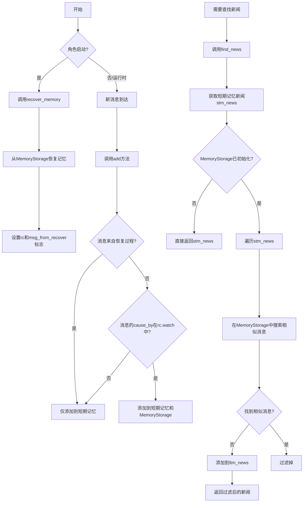
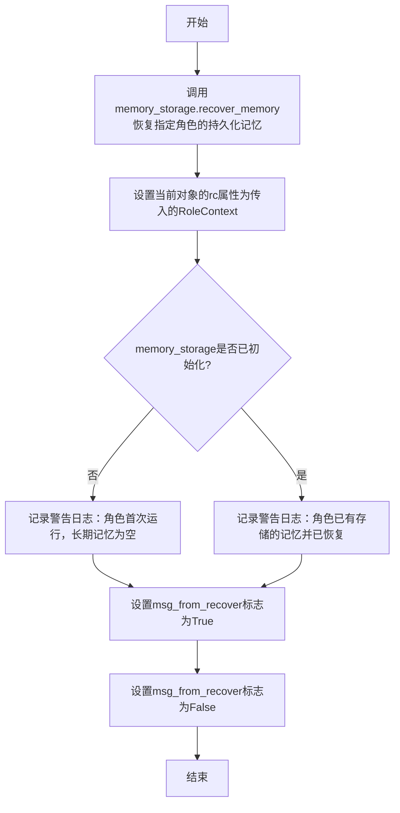
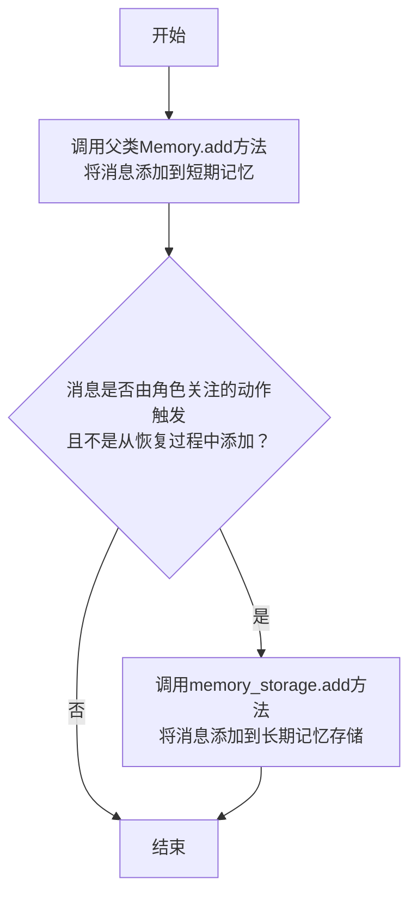
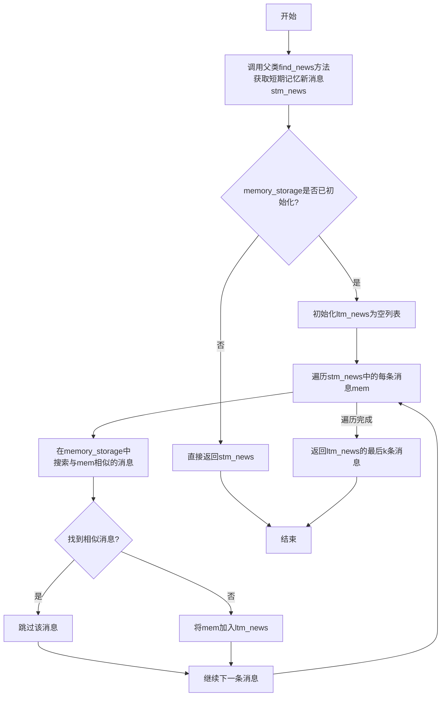
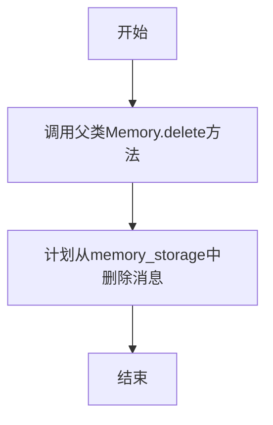
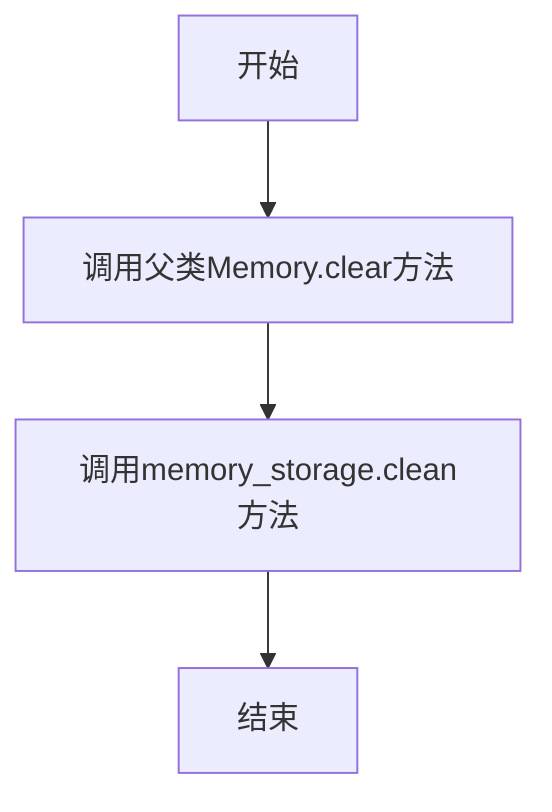

# `.\MetaGPT\metagpt\memory\longterm_memory.py` 详细设计文档

该文件实现了角色的长期记忆（LongTermMemory）功能，继承自基础Memory类。它通过MemoryStorage组件持久化存储角色关注的消息（由rc.watch指定），并在角色启动时恢复记忆。核心功能包括：从存储中恢复记忆、添加新消息到长期存储、在短期记忆新闻中过滤掉长期记忆中已存在的相似消息以获取真正的新消息，以及提供持久化和清理操作。

## 整体流程



## 类结构

```
Memory (基础记忆类)
└── LongTermMemory (长期记忆类)
```

## 全局变量及字段


### `LongTermMemory.model_config`
    
Pydantic模型配置，允许任意类型以支持复杂字段类型。

类型：`pydantic.ConfigDict`
    


### `LongTermMemory.memory_storage`
    
负责角色长期记忆的持久化存储和检索的核心组件。

类型：`MemoryStorage`
    


### `LongTermMemory.rc`
    
角色上下文，提供角色运行时的环境信息和行为观察列表。

类型：`Optional[RoleContext]`
    


### `LongTermMemory.msg_from_recover`
    
标志位，用于指示当前消息是否来自内存恢复过程，以避免重复存储。

类型：`bool`
    
    

## 全局函数及方法

### `LongTermMemory.recover_memory`

该方法用于在角色启动时恢复其长期记忆。它从持久化存储中加载指定角色的历史记忆，并初始化相关的上下文和状态标志。

参数：

- `role_id`：`str`，需要恢复记忆的角色的唯一标识符。
- `rc`：`RoleContext`，角色的上下文对象，包含角色运行所需的环境和配置信息。

返回值：`None`，该方法不返回任何值。

#### 流程图



#### 带注释源码

```python
def recover_memory(self, role_id: str, rc: RoleContext):
    # 1. 调用memory_storage的recover_memory方法，从持久化存储中恢复指定role_id的记忆
    self.memory_storage.recover_memory(role_id)
    # 2. 将传入的角色上下文rc保存到当前对象的rc属性中
    self.rc = rc
    # 3. 检查memory_storage是否已初始化（即是否有历史记忆）
    if not self.memory_storage.is_initialized:
        # 3.1 如果未初始化，记录警告日志，表明可能是角色首次运行，长期记忆为空
        logger.warning(f"It may the first time to run Role {role_id}, the long-term memory is empty")
    else:
        # 3.2 如果已初始化，记录警告日志，表明角色已有存储的记忆并已成功恢复
        logger.warning(f"Role {role_id} has existing memory storage and has recovered them.")
    # 4. 将msg_from_recover标志设置为True，用于在后续add方法中<br>避免将从恢复过程中得到的消息重复添加到memory_storage
    self.msg_from_recover = True
    # 5. 注释掉的代码：TODO no need<br>此处原本可能计划批量添加消息，但当前版本不需要
    # self.add_batch(messages) # TODO no need
    # 6. 将msg_from_recover标志重置为False，恢复正常的消息添加逻辑
    self.msg_from_recover = False
```


### `LongTermMemory.add`

该方法用于向长期记忆中添加消息。它首先调用父类的 `add` 方法将消息添加到短期记忆中，然后检查该消息是否由角色关注的动作触发，并且不是从恢复过程中添加的。如果是，则将消息添加到长期记忆存储中。

参数：

- `message`：`Message`，要添加到记忆中的消息对象。

返回值：`None`，无返回值。

#### 流程图



#### 带注释源码

```python
def add(self, message: Message):
    # 调用父类Memory的add方法，将消息添加到短期记忆（基类逻辑）
    super().add(message)
    # 遍历角色关注的动作列表（self.rc.watch）
    for action in self.rc.watch:
        # 检查消息的触发动作是否在关注列表中，并且该消息不是从恢复过程中添加的
        if message.cause_by == action and not self.msg_from_recover:
            # 如果条件满足，将消息添加到长期记忆存储中
            # 目前仅将角色关注的消息添加到memory_storage，避免从恢复过程中重复添加
            self.memory_storage.add(message)
```


### `LongTermMemory.find_news`

该方法用于从观察到的消息列表中找出“新消息”。它首先基于短期记忆（STM）找出初步的新消息，然后进一步根据长期记忆（LTM）过滤掉与历史消息相似的内容，最终返回真正的新消息。

参数：

- `observed`：`list[Message]`，观察到的消息列表
- `k`：`int`，指定从最近的k条记忆中查找新消息，当k=0时从所有记忆中查找

返回值：`list[Message]`，经过长期记忆过滤后的新消息列表

#### 流程图



#### 带注释源码

```python
async def find_news(self, observed: list[Message], k=0) -> list[Message]:
    """
    find news (previously unseen messages) from the the most recent k memories, from all memories when k=0
        1. find the short-term memory(stm) news
        2. furthermore, filter out similar messages based on ltm(long-term memory), get the final news
    """
    # 1. 调用父类Memory的find_news方法，基于短期记忆找出初步的新消息
    stm_news = super().find_news(observed, k=k)  # shot-term memory news
    
    # 2. 检查长期记忆存储是否已初始化
    if not self.memory_storage.is_initialized:
        # 如果未初始化，直接返回短期记忆的新消息
        return stm_news

    # 3. 初始化长期记忆过滤后的新消息列表
    ltm_news: list[Message] = []
    
    # 4. 遍历每条短期记忆新消息
    for mem in stm_news:
        # 在长期记忆中搜索相似的消息
        mem_searched = await self.memory_storage.search_similar(mem)
        
        # 5. 如果没有找到相似消息，说明这是真正的新消息
        if len(mem_searched) == 0:
            ltm_news.append(mem)
    
    # 6. 返回过滤后的新消息（如果k>0则返回最后k条）
    return ltm_news[-k:]
```


### `LongTermMemory.persist`

该方法用于将内存存储中的内容持久化到外部存储介质（如数据库或文件系统）中。它不执行任何复杂的逻辑，仅作为对底层 `MemoryStorage` 持久化功能的一个简单封装调用。

参数：
- 无

返回值：`None`，无返回值

#### 流程图

```mermaid
flowchart TD
    A[开始] --> B[调用 self.memory_storage.persist()]
    B --> C[结束]
```

#### 带注释源码

```python
def persist(self):
    # 调用内存存储实例的 persist 方法，将当前内存中的数据保存到持久化存储中。
    self.memory_storage.persist()
```


### `LongTermMemory.delete`

该方法用于从长期记忆中删除指定的消息。它首先调用父类的 `delete` 方法从短期记忆中删除消息，然后计划从 `memory_storage` 中删除该消息（当前为待实现状态）。

参数：

- `message`：`Message`，要删除的消息对象

返回值：`None`，无返回值

#### 流程图



#### 带注释源码

```python
def delete(self, message: Message):
    super().delete(message)  # 调用父类Memory的delete方法，从短期记忆中删除消息
    # TODO delete message in memory_storage  # 待实现：从memory_storage中删除消息
```

### `LongTermMemory.clear`

该方法用于清空长期记忆（LongTermMemory）中的所有消息。它首先调用父类（Memory）的`clear`方法清空短期记忆，然后调用`memory_storage.clean()`方法清空持久化存储中的长期记忆。

参数：无

返回值：`None`，无返回值

#### 流程图



#### 带注释源码

```python
def clear(self):
    # 调用父类Memory的clear方法，清空短期记忆（如self.msg列表）
    super().clear()
    # 调用memory_storage的clean方法，清空持久化存储中的长期记忆
    self.memory_storage.clean()
```

## 关键组件


### LongTermMemory 类

作为角色的长期记忆系统，继承自基础 Memory 类，负责在角色启动时恢复记忆、在运行时更新记忆，并将重要消息持久化存储到外部存储中。

### MemoryStorage 组件

长期记忆的底层存储与检索引擎，负责实际的数据持久化（如写入数据库/文件）、恢复以及基于相似性的搜索，是长期记忆功能的核心依赖。

### 消息筛选与去重机制 (`find_news` 方法)

通过结合短期记忆（父类方法）和长期记忆（MemoryStorage 的相似性搜索）来识别真正“新”的消息，过滤掉与历史长期记忆相似的内容，确保角色只处理新鲜、非重复的信息。

### 观察-行动触发存储机制 (`add` 方法)

根据角色上下文（`rc.watch`）中设定的关注动作（`action`），自动将特定类型的消息（`message.cause_by == action`）存入长期存储，实现了基于角色行为的、有选择的记忆持久化。

### 记忆恢复与初始化流程 (`recover_memory` 方法)

在角色启动时，从持久化存储中恢复其历史记忆，并初始化内存状态。此过程会设置标志位以防止恢复过程中的消息被重复存储，并处理首次运行无历史数据的情况。


## 问题及建议


### 已知问题

-   **`delete` 方法未完全实现**：`LongTermMemory.delete` 方法调用了父类的 `delete` 方法，但注释 `TODO delete message in memory_storage` 表明其核心功能——从持久化存储中删除消息——尚未实现。这会导致数据不一致，即消息从短期内存中移除，但仍保留在长期存储中。
-   **`recover_memory` 方法存在冗余逻辑**：方法中设置了 `self.msg_from_recover = True` 和 `False`，并附有注释 `# self.add_batch(messages) # TODO no need`。这表明当前恢复逻辑可能绕过了 `add` 方法中的过滤机制（`if not self.msg_from_recover`），但相关代码（`add_batch`）已被注释，存在逻辑冗余和潜在的混淆。
-   **`find_news` 方法切片逻辑可能不符合预期**：方法最后返回 `ltm_news[-k:]`。当 `k=0` 时（意味着查看所有记忆），此切片操作 `[-0:]` 会返回整个列表，逻辑正确。但当 `k>0` 时，此操作返回的是列表**最后**的 `k` 条消息，这可能与“最近 `k` 条记忆”的意图相符，但需要注意，`stm_news` 本身可能已经过短期记忆的筛选，此处的切片是基于已过滤的长期记忆新闻再次进行尾部切片，其最终语义需要结合父类 `find_news` 的行为来确认，可能存在理解复杂性。
-   **缺乏对 `memory_storage` 操作失败的异常处理**：代码中直接调用了 `memory_storage.recover_memory`, `memory_storage.add`, `memory_storage.search_similar`, `memory_storage.persist` 等方法，但未包含任何 `try-except` 块来处理可能发生的异常（如存储连接失败、IO错误等）。这可能导致程序因底层存储问题而意外崩溃。
-   **`msg_from_recover` 状态管理存在风险**：`msg_from_recover` 是一个实例变量，用于在 `recover_memory` 过程中标记消息来源，以防止恢复的消息被重复添加到存储。然而，在多线程或异步环境下，如果 `recover_memory` 和 `add` 方法可能并发执行，此标志的状态可能被错误地读写，导致数据竞争或不一致。

### 优化建议

-   **实现完整的 `delete` 方法**：应实现 `memory_storage.delete(message)` 方法（或类似功能），确保在调用 `LongTermMemory.delete` 时，消息能从长期存储中同步删除，保持内存状态的一致性。
-   **重构 `recover_memory` 方法，消除冗余**：重新审视内存恢复流程。如果恢复的消息确实不应通过 `add` 方法触发存储操作，应明确其路径，并考虑移除 `msg_from_recover` 标志或将其使用逻辑封装得更清晰，同时清理被注释的代码。
-   **明确 `find_news` 的切片语义并考虑性能**：在文档或注释中明确说明 `ltm_news[-k:]` 在 `k>0` 时的行为（返回最新的 `k` 条长期记忆新闻）。同时，评估当 `k` 值很大或 `stm_news` 很大时，遍历 `stm_news` 并对每个元素调用 `search_similar`（这可能是IO密集型或计算密集型操作）的性能影响。考虑是否可以批量查询或引入缓存机制。
-   **增强异常处理与日志记录**：在 `memory_storage` 的关键操作调用处添加异常处理。例如，在 `add`, `persist`, `recover_memory`, `search_similar` 等外围使用 `try-except`，捕获特定异常并记录详细的错误日志（`logger.error`），同时根据业务场景决定是向上抛出异常还是进行降级处理（例如，存储失败时仅记录日志并继续运行，但需明确其影响）。
-   **评估并发安全性**：如果该 `LongTermMemory` 实例有可能在并发场景下被多个线程或异步任务访问（例如，多个角色并发更新记忆），需要对 `msg_from_recover` 的访问以及 `memory_storage` 的操作进行同步控制。可以考虑使用线程锁（如 `threading.Lock`）或异步锁（如 `asyncio.Lock`）来保护临界区，或者明确声明该类非线程安全，由调用者保证串行访问。
-   **考虑为 `memory_storage` 提供抽象接口**：当前 `memory_storage` 被直接实例化为 `MemoryStorage`。为了提升灵活性和可测试性，可以考虑定义一个抽象基类（ABC）或协议（Protocol），`LongTermMemory` 依赖于此接口而非具体实现。这样可以更容易地替换不同的存储后端（如数据库、向量数据库等）。


## 其它


### 设计目标与约束

本模块旨在为智能体（Role）提供长期记忆能力，使其能够跨会话持久化关键交互信息。核心设计目标包括：1) 与短期记忆（父类Memory）无缝集成，提供分层记忆机制；2) 通过可插拔的存储后端（MemoryStorage）实现记忆的持久化与检索；3) 支持基于内容相似度的去重，确保输入长期记忆的信息是新鲜且非重复的。主要约束包括：当前仅持久化由特定关注动作（`rc.watch`）触发的消息，且记忆的删除功能尚未在持久化层完全实现。

### 错误处理与异常设计

模块采用防御性编程与日志告警结合的策略。在`recover_memory`方法中，当持久化存储未初始化（如首次运行）时，会记录警告日志而非抛出异常，确保角色可正常启动。`memory_storage`的方法（如`search_similar`）被假定为已处理其内部可能出现的异常（如存储连接失败）。当前设计未显式定义或抛出模块级别的特定异常，依赖底层存储组件的错误处理。`add`方法中通过`msg_from_recover`标志位避免了恢复数据时的重复存储，这是一种静默的容错处理。

### 数据流与状态机

数据流始于外部`Message`的输入。在`add`流程中：消息首先被添加至短期记忆（父类），随后检查其触发动作是否在角色的关注列表（`rc.watch`）中，若是且非来自恢复操作，则进一步存入长期记忆存储。在`find_news`流程中：先通过短期记忆获取初步的新消息列表，再对其中每条消息，查询长期记忆存储中是否存在语义相似的历史记录，以此过滤，最终返回真正“新鲜”的消息。模块的状态主要由`memory_storage.is_initialized`（标识持久化存储是否就绪）和`msg_from_recover`（防止恢复循环）两个布尔标志控制。

### 外部依赖与接口契约

1.  **父类依赖**：继承自`metagpt.memory.Memory`，依赖其提供的短期记忆管理方法（如`find_news`、基础`add/delete`）。
2.  **存储抽象依赖**：强依赖`MemoryStorage`抽象接口。契约要求其必须实现`recover_memory`, `add`, `search_similar`, `persist`, `clean`等方法，并维护`is_initialized`状态。`LongTermMemory`不关心具体存储介质（向量数据库、关系型数据库等）。
3.  **上下文依赖**：依赖`RoleContext`（`rc`），特别是其中的`watch`列表，用于判断哪些消息需要长期保存。
4.  **数据模型依赖**：操作的核心数据对象为`Message`，依赖其`cause_by`等字段进行逻辑判断。
5.  **框架依赖**：使用`pydantic`进行数据验证与配置管理。

### 并发与线程安全考虑

当前代码未显式处理并发访问。`LongTermMemory`实例通常由单个角色持有，在典型的异步执行环境中，对同一角色的消息处理是串行的，因此可能不存在严重的并发问题。然而，如果`MemoryStorage`的实现是共享的或可能被多线程/多协程访问，则其内部需要实现线程安全或异步安全的机制。`add`和`find_news`方法中的操作序列（检查标志、存储操作）在并发环境下可能需加锁或使用原子操作来保证一致性。

### 配置与可扩展性

通过`MemoryStorage`的默认工厂注入，提供了替换存储后端的灵活性。`model_config = ConfigDict(arbitrary_types_allowed=True)`允许`MemoryStorage`等复杂类型作为字段。模块的行为可通过`RoleContext`中的`watch`列表进行配置，以控制哪些类型的消息进入长期记忆。`find_news`方法中的参数`k`提供了控制检索窗口的扩展点。未来若需支持更复杂的记忆过滤、压缩或归档策略，可在`add`或`find_news`环节进行扩展。

### 测试策略建议

1.  **单元测试**：Mock `MemoryStorage`和`RoleContext`，测试`add`方法在`watch`匹配/不匹配、`msg_from_recover`为真/假时的行为；测试`find_news`方法与`MemoryStorage.search_similar`的交互逻辑及过滤结果。
2.  **集成测试**：使用一个真实的（如内存型）`MemoryStorage`实现，测试`recover_memory`、`add`、`persist`、`find_news`的完整流程，验证数据能否正确持久化与恢复。
3.  **场景测试**：模拟角色连续多轮对话，验证长期记忆去重功能的有效性，确保不会因历史相似信息而丢失真正的新消息。

    