# `.\MetaGPT\metagpt\memory\memory.py` 详细设计文档

该代码实现了一个基础的记忆存储类 `Memory`，用于在智能体系统中管理消息（`Message`）对象。它提供了消息的增删改查功能，并通过索引（`index`）支持按消息触发原因（`cause_by`）进行快速检索，同时具备忽略消息ID、批量操作、查找新消息等特性，是智能体记忆系统的核心组件。

## 整体流程

```mermaid
graph TD
    A[开始: 操作Memory] --> B{操作类型?}
    B -- 添加消息 --> C[调用add或add_batch]
    C --> D{ignore_id为True?}
    D -- 是 --> E[设置消息ID为IGNORED_MESSAGE_ID]
    D -- 否 --> F[保持原消息ID]
    F --> G[消息是否已存在?]
    G -- 是 --> H[跳过添加]
    G -- 否 --> I[添加到storage列表]
    I --> J{消息有cause_by?}
    J -- 是 --> K[更新index字典: cause_by -> 消息]
    J -- 否 --> L[添加完成]
    B -- 检索消息 --> M[调用get_by_role/get_by_content/get_by_action等]
    M --> N[遍历storage或查询index]
    N --> O[返回匹配的消息列表]
    B -- 删除消息 --> P[调用delete或delete_newest]
    P --> Q[从storage中移除消息]
    Q --> R{消息有cause_by?}
    R -- 是 --> S[从index对应列表中移除消息]
    R -- 否 --> T[删除完成]
    B -- 清空 --> U[调用clear]
    U --> V[重置storage和index]
    B -- 查找新消息 --> W[调用find_news]
    W --> X[获取已观察消息(get)]
    X --> Y[对比observed列表，找出未出现的消息]
    Y --> Z[返回新消息列表]
```

## 类结构

```
BaseModel (Pydantic基类)
└── Memory (记忆存储类)
    ├── 字段: storage, index, ignore_id
    ├── 方法: add, add_batch, get_by_role, get_by_content, delete_newest, delete, clear, count, try_remember, get, find_news, get_by_action, get_by_actions, get_by_position
```

## 全局变量及字段


### `IGNORED_MESSAGE_ID`
    
一个常量字符串，用于标识应被忽略的消息ID，当ignore_id为True时，消息的ID会被设置为该值。

类型：`str`
    


### `Memory.storage`
    
一个存储Message对象的列表，作为Memory类的主要数据存储容器，按添加顺序保存所有消息。

类型：`list[SerializeAsAny[Message]]`
    


### `Memory.index`
    
一个默认字典，以消息的cause_by（触发动作）为键，值为包含所有由该动作触发的Message对象的列表，用于快速按动作检索消息。

类型：`DefaultDict[str, list[SerializeAsAny[Message]]]`
    


### `Memory.ignore_id`
    
一个布尔标志，指示是否忽略消息的ID。当为True时，新添加消息的ID会被设置为IGNORED_MESSAGE_ID。

类型：`bool`
    
    

## 全局函数及方法

### `any_to_str`

将任意类型的输入转换为字符串表示。该函数主要用于将对象（如类实例、函数等）转换为其字符串标识，通常用于索引或键的生成。

参数：

- `obj`：`Any`，任意类型的输入对象，需要被转换为字符串

返回值：`str`，输入对象的字符串表示

#### 流程图

```mermaid
flowchart TD
    A[开始] --> B{输入是否为None?}
    B -- 是 --> C[返回空字符串]
    B -- 否 --> D{输入是否为字符串?}
    D -- 是 --> E[直接返回该字符串]
    D -- 否 --> F{输入是否为类?}
    F -- 是 --> G[返回类的__name__属性]
    F -- 否 --> H{输入是否为函数或方法?}
    H -- 是 --> I[返回函数的__name__属性]
    H -- 否 --> J[返回str(obj)的结果]
    C --> K[结束]
    E --> K
    G --> K
    I --> K
    J --> K
```

#### 带注释源码

```python
def any_to_str(obj: Any) -> str:
    """
    将任意对象转换为字符串表示。
    
    处理逻辑：
    1. 如果输入为None，返回空字符串。
    2. 如果输入已经是字符串，直接返回。
    3. 如果输入是类（type），返回类的名称（__name__）。
    4. 如果输入是函数或方法，返回函数的名称（__name__）。
    5. 其他情况，使用str()函数进行转换。
    
    参数：
        obj: 任意类型的输入对象
        
    返回：
        字符串表示
    """
    if obj is None:
        return ""
    if isinstance(obj, str):
        return obj
    if isinstance(obj, type):
        return obj.__name__
    if callable(obj):
        return obj.__name__
    return str(obj)
```

### `any_to_str_set`

将输入的集合（Set）中的每个元素转换为字符串，并返回一个包含这些字符串的新集合。如果输入不是集合类型，会先将其转换为集合。

参数：

- `actions`：`Set`，一个包含任意类型元素的集合，需要将其中的每个元素转换为字符串。

返回值：`Set[str]`，一个包含输入集合中每个元素字符串表示的新集合。

#### 流程图

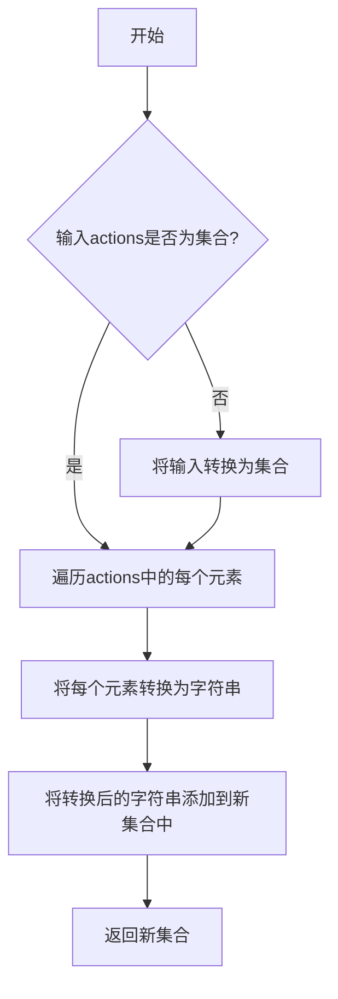

#### 带注释源码

```python
def any_to_str_set(actions: Set) -> Set[str]:
    """
    将输入的集合中的每个元素转换为字符串，并返回一个包含这些字符串的新集合。
    如果输入不是集合类型，会先将其转换为集合。
    
    Args:
        actions (Set): 一个包含任意类型元素的集合，需要将其中的每个元素转换为字符串。
    
    Returns:
        Set[str]: 一个包含输入集合中每个元素字符串表示的新集合。
    """
    # 如果输入不是集合类型，先将其转换为集合
    if not isinstance(actions, Set):
        actions = set(actions)
    
    # 遍历集合中的每个元素，将其转换为字符串，并添加到新集合中
    result = set()
    for action in actions:
        result.add(str(action))
    
    return result
```

### `handle_exception`

`handle_exception` 是一个装饰器函数，用于包装其他函数或方法，以提供统一的异常处理机制。当被装饰的函数执行过程中发生异常时，该装饰器会捕获异常，并根据配置进行相应的处理，如记录日志、返回默认值或重新抛出异常。

参数：

-  `func`：`Callable`，需要被包装以进行异常处理的函数或方法

返回值：`Callable`，返回一个包装后的函数，该函数在执行原始函数时会进行异常处理

#### 流程图

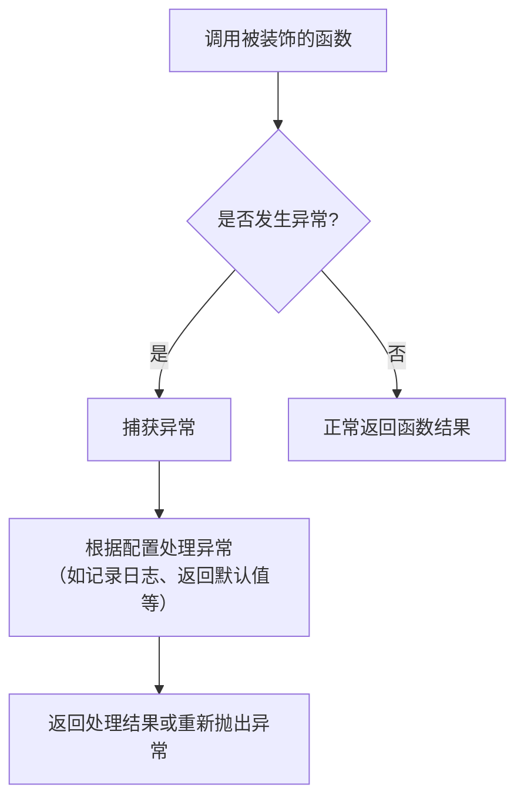

#### 带注释源码

```python
def handle_exception(func):
    """
    异常处理装饰器，用于捕获被装饰函数执行过程中的异常，并进行统一处理。
    
    参数:
        func (Callable): 需要被装饰的函数或方法。
    
    返回:
        Callable: 包装后的函数，具有异常处理能力。
    """
    @wraps(func)
    def wrapper(*args, **kwargs):
        try:
            # 尝试执行原始函数
            return func(*args, **kwargs)
        except Exception as e:
            # 捕获异常，并根据配置进行处理
            # 例如：记录日志、返回默认值或重新抛出异常
            # 这里可以根据实际需求扩展异常处理逻辑
            print(f"Exception caught in {func.__name__}: {e}")
            # 可以选择返回一个默认值或重新抛出异常
            # return None  # 返回默认值
            raise  # 重新抛出异常
    return wrapper
```

### `Memory.add`

将新的消息添加到存储中，同时更新索引。

参数：

- `message`：`Message`，要添加的消息对象

返回值：`None`，无返回值

#### 流程图

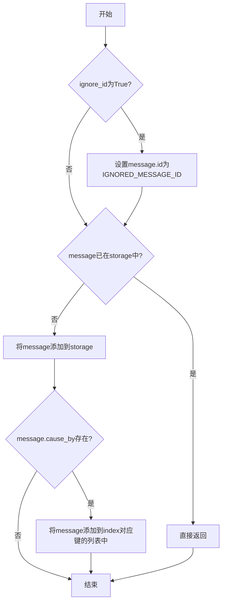

#### 带注释源码

```python
def add(self, message: Message):
    """Add a new message to storage, while updating the index"""
    # 如果ignore_id标志为True，则将消息的ID设置为忽略值
    if self.ignore_id:
        message.id = IGNORED_MESSAGE_ID
    # 检查消息是否已存在于存储中，避免重复添加
    if message in self.storage:
        return
    # 将消息添加到存储列表
    self.storage.append(message)
    # 如果消息有cause_by属性，则将其添加到索引中对应cause_by的列表中
    if message.cause_by:
        self.index[message.cause_by].append(message)
```

### `Memory.add_batch`

该方法用于批量添加消息到内存存储中，通过遍历传入的消息迭代器，逐个调用 `add` 方法将消息添加到存储并更新索引。

参数：

- `messages`：`Iterable[Message]`，一个可迭代的消息对象集合，包含要添加到内存中的消息。

返回值：`None`，无返回值。

#### 流程图

```mermaid
flowchart TD
    A[开始] --> B[遍历messages中的每个message]
    B --> C{是否遍历完成？}
    C -- 是 --> D[结束]
    C -- 否 --> E[调用self.add(message)]
    E --> B
```

#### 带注释源码

```python
def add_batch(self, messages: Iterable[Message]):
    # 遍历传入的消息迭代器
    for message in messages:
        # 对每个消息调用add方法，将其添加到存储并更新索引
        self.add(message)
```

### `Memory.get_by_role`

该方法用于从内存存储中检索所有属于指定角色的消息。

参数：

- `role`：`str`，指定的角色名称，用于筛选消息。

返回值：`list[Message]`，返回一个包含所有匹配指定角色的消息列表。

#### 流程图

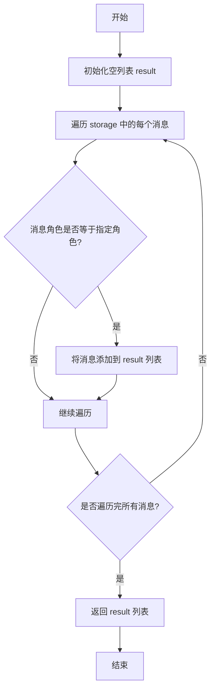

#### 带注释源码

```python
def get_by_role(self, role: str) -> list[Message]:
    """Return all messages of a specified role"""
    # 使用列表推导式遍历 storage 中的所有消息
    # 检查每个消息的 role 属性是否与传入的 role 参数匹配
    # 如果匹配，则将该消息添加到返回的列表中
    return [message for message in self.storage if message.role == role]
```

### `Memory.get_by_content`

该方法用于从内存存储中检索所有包含指定内容的消息。

参数：

- `content`：`str`，要搜索的文本内容

返回值：`list[Message]`，包含指定内容的所有消息列表

#### 流程图

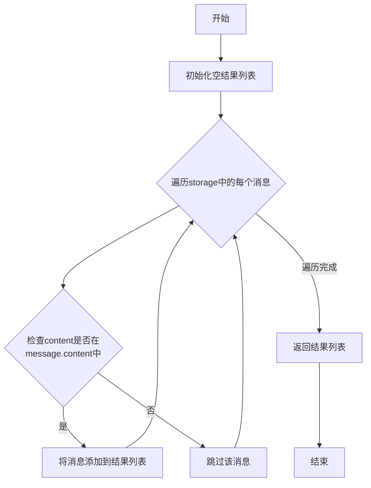

#### 带注释源码

```python
def get_by_content(self, content: str) -> list[Message]:
    """Return all messages containing a specified content"""
    # 使用列表推导式遍历storage中的所有消息
    # 检查指定的content是否在当前消息的content字段中
    # 如果包含，则将该消息添加到返回列表中
    return [message for message in self.storage if content in message.content]
```

### `Memory.delete_newest`

删除存储中最新的消息，并更新索引以保持一致性。

参数：无

返回值：`Message`，返回被删除的最新消息对象，如果存储为空则返回 `None`

#### 流程图

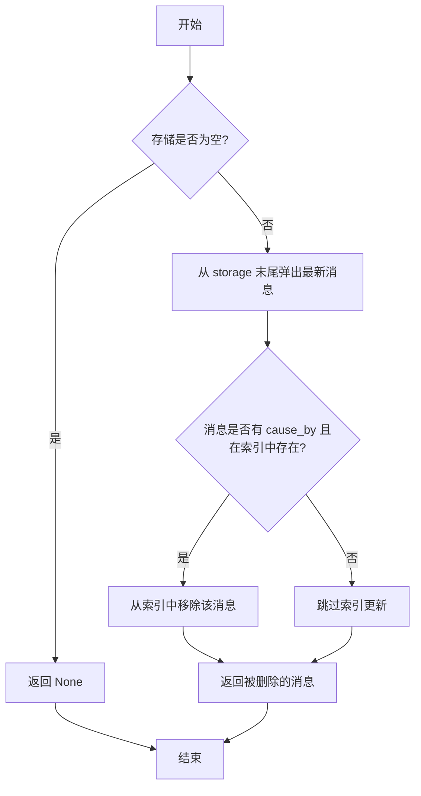

#### 带注释源码

```python
def delete_newest(self) -> "Message":
    """delete the newest message from the storage"""
    # 检查存储中是否有消息
    if len(self.storage) > 0:
        # 从存储列表末尾弹出最新消息（LIFO原则）
        newest_msg = self.storage.pop()
        # 如果消息有触发原因（cause_by）且在对应索引列表中存在，则从索引中移除
        if newest_msg.cause_by and newest_msg in self.index[newest_msg.cause_by]:
            self.index[newest_msg.cause_by].remove(newest_msg)
    else:
        # 存储为空时，返回None
        newest_msg = None
    # 返回被删除的消息（或None）
    return newest_msg
```

### `Memory.delete`

删除指定的消息对象，同时更新索引以保持数据一致性。

参数：

- `message`：`Message`，要删除的消息对象

返回值：`None`，无返回值

#### 流程图

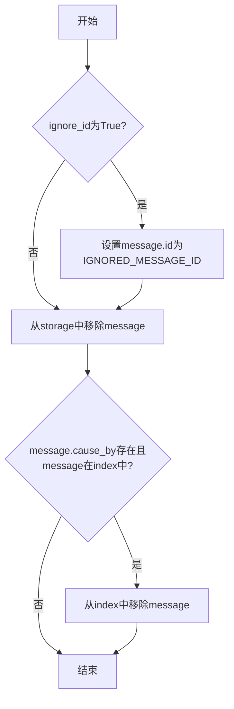

#### 带注释源码

```python
def delete(self, message: Message):
    """Delete the specified message from storage, while updating the index"""
    # 如果设置了忽略ID，则将消息ID设置为忽略值
    if self.ignore_id:
        message.id = IGNORED_MESSAGE_ID
    
    # 从存储列表中移除指定的消息
    self.storage.remove(message)
    
    # 如果消息有触发原因，并且该消息存在于索引中，则从索引中移除
    if message.cause_by and message in self.index[message.cause_by]:
        self.index[message.cause_by].remove(message)
```

### `Memory.clear`

该方法用于清空Memory实例中的存储列表（storage）和索引字典（index），将内存恢复到初始空状态。

参数：无

返回值：`None`，无返回值

#### 流程图

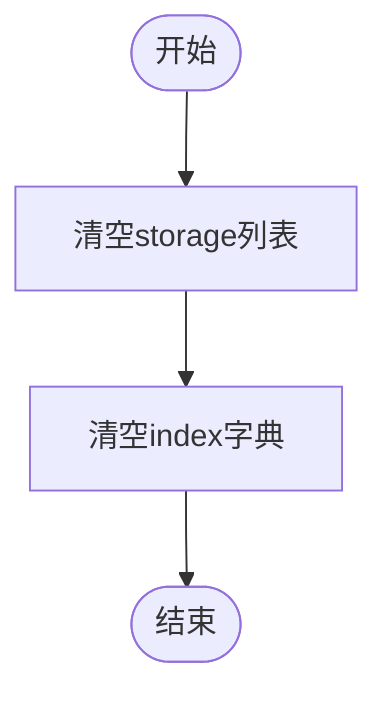

#### 带注释源码

```python
def clear(self):
    """Clear storage and index"""
    self.storage = []  # 将存储消息的列表重置为空列表
    self.index = defaultdict(list)  # 将索引字典重置为默认字典，值为空列表
```

### `Memory.count`

返回存储中消息的数量。

参数：无

返回值：`int`，存储中消息的数量

#### 流程图

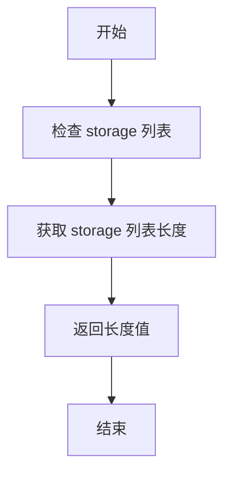

#### 带注释源码

```python
def count(self) -> int:
    """Return the number of messages in storage"""
    return len(self.storage)  # 直接返回 storage 列表的长度
```

### `Memory.try_remember`

该方法尝试从内存存储中回忆所有包含指定关键词的消息。

参数：

- `keyword`：`str`，用于在消息内容中搜索的关键词

返回值：`list[Message]`，包含所有内容中包含指定关键词的消息列表

#### 流程图

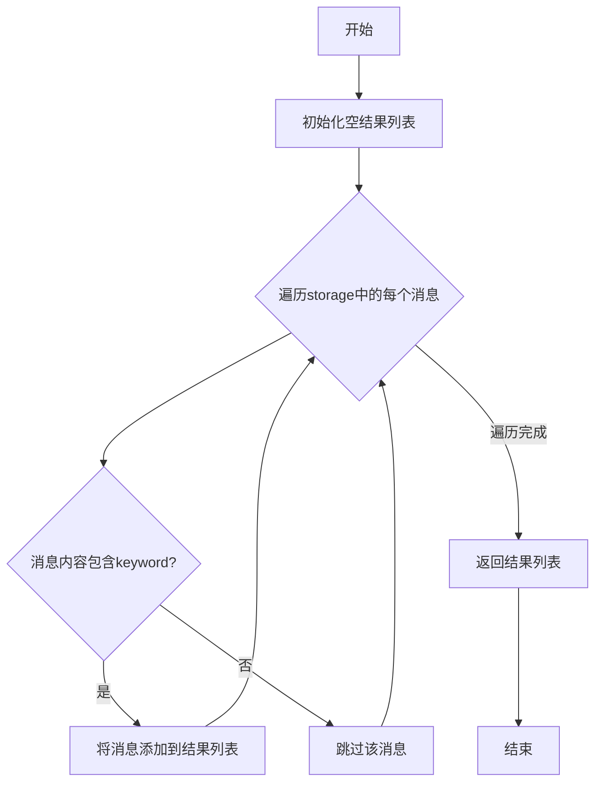

#### 带注释源码

```python
def try_remember(self, keyword: str) -> list[Message]:
    """Try to recall all messages containing a specified keyword"""
    # 使用列表推导式遍历storage中的所有消息
    # 对于每个消息，检查keyword是否在消息内容中
    # 如果包含，则将该消息添加到返回列表中
    return [message for message in self.storage if keyword in message.content]
```

### `Memory.get`

该方法用于从内存存储中获取最近的消息。当参数 `k` 为 0 时，返回所有存储的消息；否则返回最近 `k` 条消息。

参数：

- `k`：`int`，指定要获取的消息数量。当 `k=0` 时返回所有消息；否则返回最近 `k` 条消息。

返回值：`list[Message]`，返回一个消息列表，包含最近 `k` 条消息或所有消息（当 `k=0` 时）。

#### 流程图

```mermaid
flowchart TD
    A[开始] --> B{检查 k 的值}
    B -- k == 0 --> C[返回所有消息 storage]
    B -- k > 0 --> D[返回最近 k 条消息 storage[-k:]]
    C --> E[结束]
    D --> E
```

#### 带注释源码

```python
def get(self, k=0) -> list[Message]:
    """Return the most recent k memories, return all when k=0"""
    return self.storage[-k:]  # 当 k=0 时，返回整个 storage 列表；否则返回最近 k 条消息
```

### `Memory.find_news`

该方法用于从最近k条记忆中找出新消息（即之前未观察到的消息）。当k=0时，从所有记忆中查找。

参数：

- `observed`：`list[Message]`，待检查的消息列表
- `k`：`int`，要检查的记忆数量，0表示检查所有记忆

返回值：`list[Message]`，返回observed中不在已有记忆中的新消息列表

#### 流程图

```mermaid
flowchart TD
    A[开始] --> B[获取已观察的记忆<br>already_observed = self.get(k)]
    B --> C[初始化空列表 news = []]
    C --> D{遍历observed中的<br>每个消息i}
    D --> E{i是否在<br>already_observed中?}
    E -->|是| F[跳过该消息]
    E -->|否| G[将i添加到news列表]
    F --> H{还有更多消息?}
    G --> H
    H -->|是| D
    H -->|否| I[返回news列表]
    I --> J[结束]
```

#### 带注释源码

```python
def find_news(self, observed: list[Message], k=0) -> list[Message]:
    """find news (previously unseen messages) from the most recent k memories, from all memories when k=0"""
    # 获取已观察的记忆：当k=0时获取所有记忆，否则获取最近k条记忆
    already_observed = self.get(k)
    
    # 初始化新消息列表
    news: list[Message] = []
    
    # 遍历待检查的观察消息
    for i in observed:
        # 如果消息已经在已观察的记忆中存在，则跳过
        if i in already_observed:
            continue
        # 否则将其添加到新消息列表
        news.append(i)
    
    # 返回找到的新消息
    return news
```

### `Memory.get_by_action`

根据指定的 Action 名称，返回所有由该 Action 触发的消息。

参数：

- `action`：`Any`，指定的 Action 对象或名称。方法内部会将其转换为字符串作为索引键。

返回值：`list[Message]`，由指定 Action 触发的所有 `Message` 对象列表。如果索引中不存在该键，则返回空列表。

#### 流程图

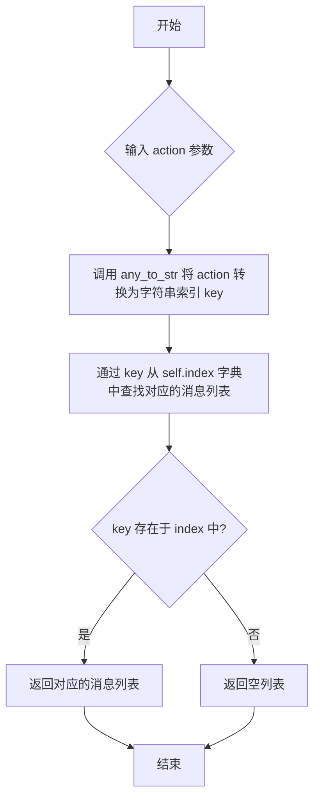

#### 带注释源码

```python
def get_by_action(self, action) -> list[Message]:
    """Return all messages triggered by a specified Action"""
    # 将输入的 action 参数（可以是对象或字符串）转换为统一的字符串格式，作为索引键。
    index = any_to_str(action)
    # 从 self.index 字典中查找该键对应的值（一个 Message 列表）。
    # 如果键不存在，则返回一个空列表（因为 self.index 是 collections.defaultdict(list) 类型）。
    return self.index[index]
```

### `Memory.get_by_actions`

该方法用于检索由指定的一组动作（Actions）触发的所有消息。它通过将动作集合转换为字符串索引，然后在内存的索引字典中查找这些索引，收集并返回所有相关的消息。

参数：

- `actions`：`Set`，一个包含动作对象的集合，这些动作用于检索相关的消息。

返回值：`list[Message]`，返回一个消息列表，这些消息是由指定的动作集合触发的。

#### 流程图

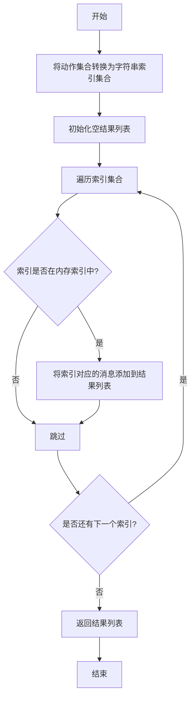

#### 带注释源码

```python
def get_by_actions(self, actions: Set) -> list[Message]:
    """Return all messages triggered by specified Actions"""
    rsp = []  # 初始化结果列表
    indices = any_to_str_set(actions)  # 将动作集合转换为字符串索引集合
    for action in indices:  # 遍历每个索引
        if action not in self.index:  # 如果索引不在内存索引中，跳过
            continue
        rsp += self.index[action]  # 将索引对应的消息列表添加到结果中
    return rsp  # 返回结果列表
```

### `Memory.get_by_position`

该方法用于根据指定的位置索引从内存存储中获取消息。如果位置有效，则返回该位置的消息；如果位置无效（例如超出索引范围），则返回 `None`。

参数：

- `position`：`int`，要获取的消息在存储列表中的位置索引（从0开始）

返回值：`Optional[Message]`，如果位置有效则返回对应位置的 `Message` 对象，否则返回 `None`

#### 流程图

```mermaid
graph TD
    A[开始] --> B{position 是否有效?};
    B -- 是 --> C[返回 storage[position]];
    B -- 否 --> D[返回 None];
    C --> E[结束];
    D --> E;
```

#### 带注释源码

```python
@handle_exception  # 异常处理装饰器，用于捕获并处理可能发生的异常
def get_by_position(self, position: int) -> Optional[Message]:
    """Returns the message at the given position if valid, otherwise returns None"""
    return self.storage[position]  # 直接通过索引访问存储列表，如果索引越界会触发异常，由装饰器处理并返回None
```

## 关键组件


### 消息存储与索引

提供基于消息对象的存储、检索和管理功能，核心是`storage`列表和`index`字典，支持按角色、内容、触发动作等多种维度查询。

### 惰性加载与反量化支持

通过`SerializeAsAny`包装`Message`类型，支持在序列化/反序列化时保留完整的子类信息，实现多态对象的延迟加载和正确还原。

### 消息触发动作索引

利用`cause_by`字段和`index`字典建立从动作（Action）到消息的逆向映射，实现高效的“由果溯因”查询，是工作流回溯的关键机制。

### 异常安全的消息操作

通过`@handle_exception`装饰器包裹`get_by_position`等方法，确保在索引越界等异常情况下能优雅降级（返回`None`）而非崩溃，提升系统鲁棒性。


## 问题及建议


### 已知问题

-   **`delete_newest` 方法在存储为空时返回 `None`，但类型注解为 `-> "Message"`，这可能导致类型不匹配和调用方需要处理 `None` 值。**
-   **`delete` 方法在 `self.ignore_id` 为 `True` 时会修改传入的 `message` 对象的 `id` 属性，这违反了函数式编程的“无副作用”原则，可能对调用方造成意外影响。**
-   **`find_news` 方法的时间复杂度为 O(n*k)，其中 n 是 `observed` 列表的长度，k 是 `already_observed` 列表的长度。当存储的消息量很大时，此方法的性能可能成为瓶颈。**
-   **`index` 字段的键（`cause_by`）被直接用作字典键，但 `Message` 的 `cause_by` 字段可能为 `None`。当 `cause_by` 为 `None` 时，`add` 方法不会将其加入索引，但 `delete` 和 `delete_newest` 方法会尝试从 `self.index[message.cause_by]` 中移除消息，这可能导致 `KeyError` 异常。**
-   **`get_by_position` 方法使用了 `@handle_exception` 装饰器来捕获索引越界异常并返回 `None`。虽然这提供了安全性，但可能掩盖了调用方逻辑中的潜在错误（例如，传递了错误的索引）。**

### 优化建议

-   **修正 `delete_newest` 方法的返回类型注解，明确其可能返回 `Optional[Message]`，并在文档中说明空存储时的行为。**
-   **修改 `delete` 方法的逻辑，避免直接修改传入的 `message` 参数。可以创建一个内部副本进行处理，或者重新设计 `ignore_id` 的逻辑，使其不影响外部对象。**
-   **优化 `find_news` 方法的性能。可以考虑将 `already_observed` 转换为集合（`set`）以提高查找效率，将时间复杂度从 O(n*k) 降低到 O(n + k)。注意，这要求 `Message` 对象是可哈希的。**
-   **在 `delete` 和 `delete_newest` 方法中，访问 `self.index[message.cause_by]` 之前，先检查 `message.cause_by` 是否为 `None` 或空值，以避免潜在的 `KeyError`。**
-   **重新评估 `get_by_position` 方法中 `@handle_exception` 的使用。可以考虑移除装饰器，让调用方处理 `IndexError`，或者将方法重命名为更安全的 `try_get_by_position` 以明确其行为。同时，确保调用方代码能够妥善处理 `None` 返回值。**
-   **考虑为 `Memory` 类添加更多基于索引的高效查询方法，例如根据时间范围、消息类型或其他元数据过滤消息，以支持更复杂的应用场景。**
-   **评估 `storage` 使用列表数据结构是否满足所有访问模式。如果需要频繁的中间插入、删除或基于非顺序键的访问，可能需要考虑其他数据结构或引入额外的索引。**


## 其它


### 设计目标与约束

设计目标：提供一个轻量级、可扩展的内存管理组件，用于存储和检索基于消息的交互历史。核心目标是支持基于角色、内容、触发动作等多种维度的快速查询，同时维护消息之间的因果关系索引以支持工作流追溯。
设计约束：1. 保持内存的线程安全性（当前实现非线程安全，需在并发环境下由调用方加锁）。2. 内存容量受限于Python列表和字典，不适合海量消息存储（如超过百万条）。3. 消息去重基于`__eq__`方法，需确保Message类正确实现相等性逻辑。4. 索引仅支持单向因果关系（cause_by），不支持复杂图结构。

### 错误处理与异常设计

错误处理策略：1. 对于无效参数（如空消息、非法类型），依赖Pydantic验证和Python类型检查。2. 对于查找操作（如`get_by_position`），使用装饰器`@handle_exception`捕获索引越界等异常并返回None，避免程序中断。3. 对于删除操作（如`delete`），若消息不存在于storage中，将引发ValueError，需由调用方处理。4. 关键操作（如`add`）包含条件检查（如重复消息跳过），但未对并发修改提供保护。

### 数据流与状态机

数据流：1. 输入流：外部通过`add`或`add_batch`注入Message对象。2. 存储流：消息存入`storage`列表（按时间顺序），同时根据`cause_by`字段更新`index`字典（映射到消息列表）。3. 查询流：通过各类`get_by_*`方法从storage或index中检索，返回消息列表。4. 删除流：通过`delete`或`delete_newest`移除消息，同步清理index。
状态机：内存状态由`storage`和`index`共同定义。初始状态为空。添加消息时，状态转移为`storage`增加元素，`index`可能更新。删除消息时，状态转移为`storage`和`index`减少元素。`clear`方法将状态重置为空。

### 外部依赖与接口契约

外部依赖：1. 依赖`metagpt.schema.Message`类作为数据模型，需提供`id`、`role`、`content`、`cause_by`等字段。2. 依赖`metagpt.const.IGNORED_MESSAGE_ID`常量用于忽略消息ID。3. 依赖`metagpt.utils.common.any_to_str`和`any_to_str_set`用于动作类型转换。4. 依赖`metagpt.utils.exceptions.handle_exception`装饰器进行异常处理。
接口契约：1. `add`方法要求Message对象实现`__eq__`用于去重。2. `get_by_actions`要求输入为Set类型，内部转换为字符串集合。3. 所有查询方法返回`list[Message]`，空列表表示无结果。4. `ignore_id`标志为True时，所有消息ID被覆盖为`IGNORED_MESSAGE_ID`，可能影响基于ID的去重或追踪。

### 性能与扩展性分析

性能特征：1. 添加消息：O(1)平均时间，但需检查重复（O(n)最坏情况）。2. 按角色或内容查询：O(n)全表扫描。3. 按动作查询：利用index实现O(1)平均时间。4. 删除消息：O(n)查找时间（列表删除）加上O(1)索引更新。
扩展性局限：1. storage为列表，大型数据集中间插入/删除效率低。2. index仅支持单键（cause_by），无法支持多维度联合查询。3. 无持久化机制，内存数据生命周期与对象实例绑定。4. 消息内容查询使用`in`操作符，对于长文本或频繁查询可能成为瓶颈。

### 测试策略建议

测试重点：1. 功能正确性：验证添加、查询、删除、清空等基本操作。2. 边界条件：空内存操作、重复消息处理、越界位置访问。3. 索引一致性：确保添加/删除操作后index与storage同步。4. 异常场景：传入无效消息、并发修改模拟。
建议的测试用例：1. 测试`add`方法忽略ID标志的行为。2. 测试`find_news`方法在k=0和k>0时的差异。3. 测试`delete`方法对不存在消息的容错。4. 性能测试：大规模消息的添加和查询耗时。

    