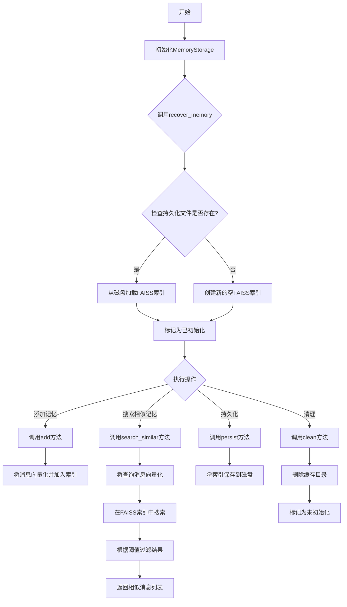
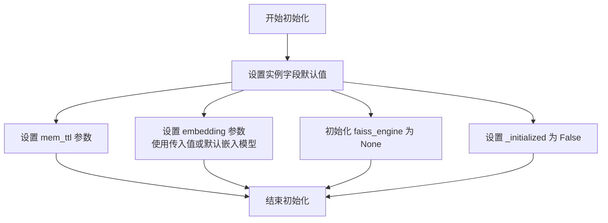
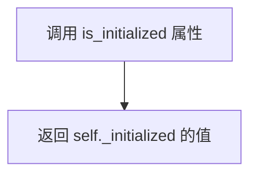
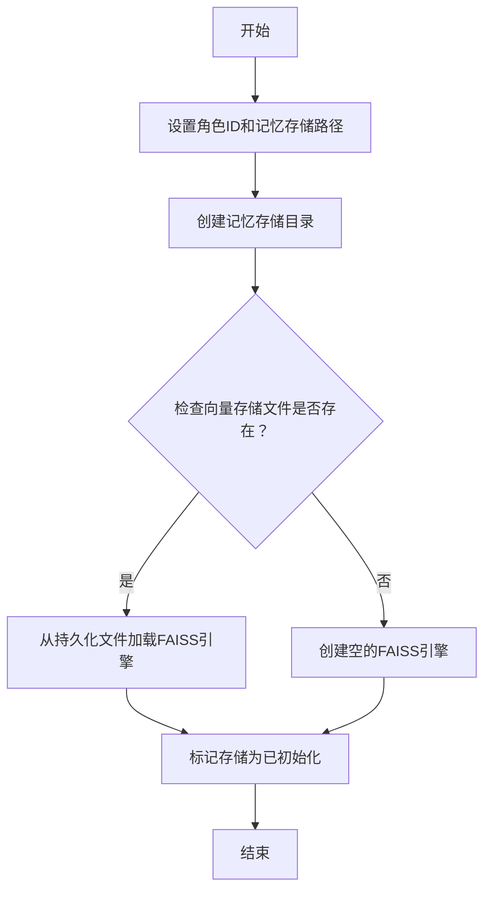
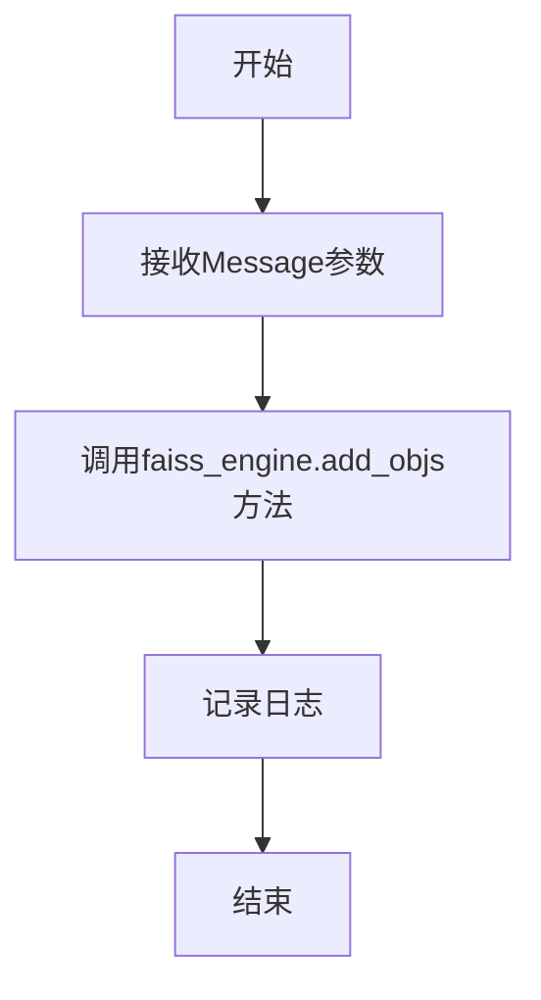
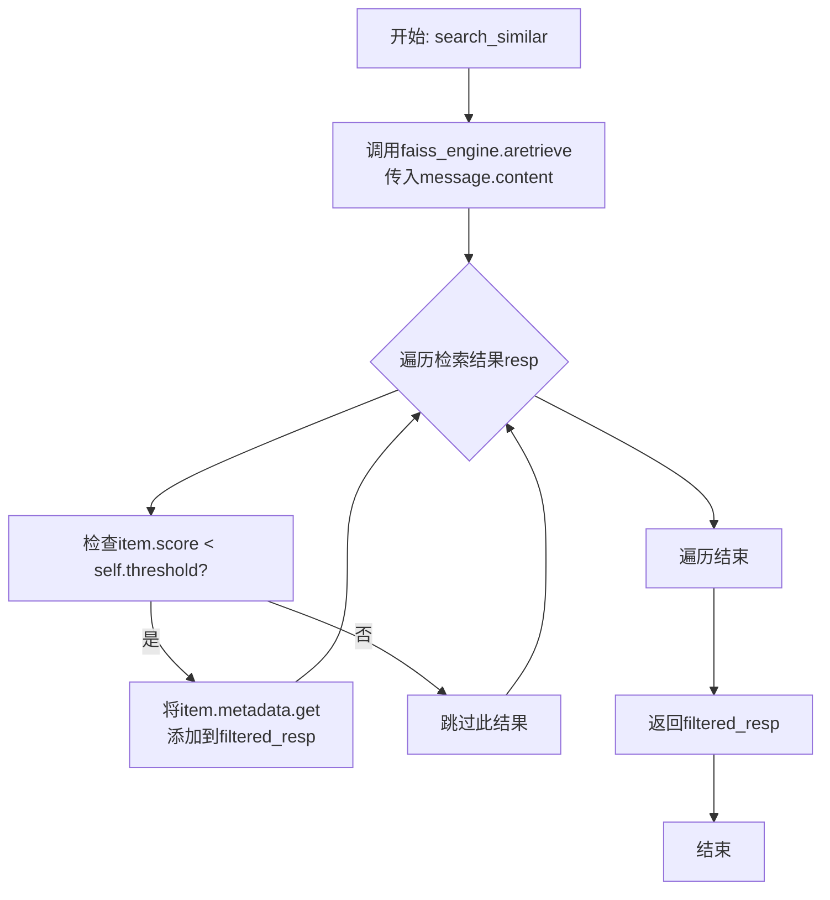
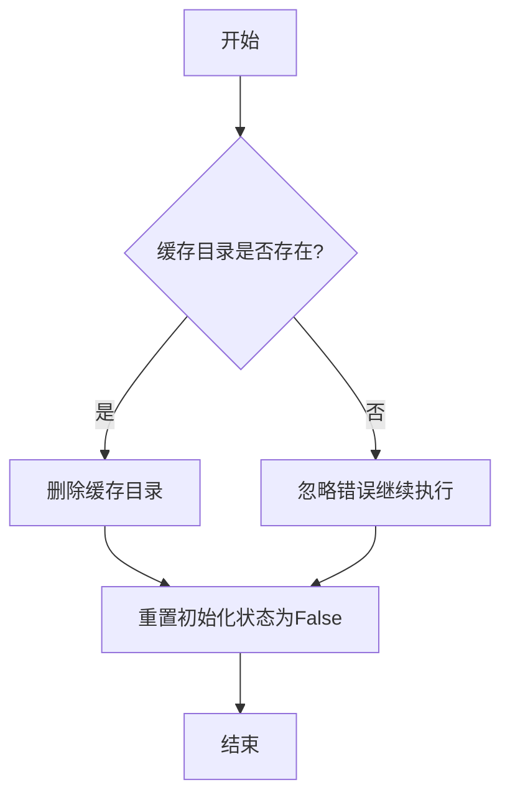
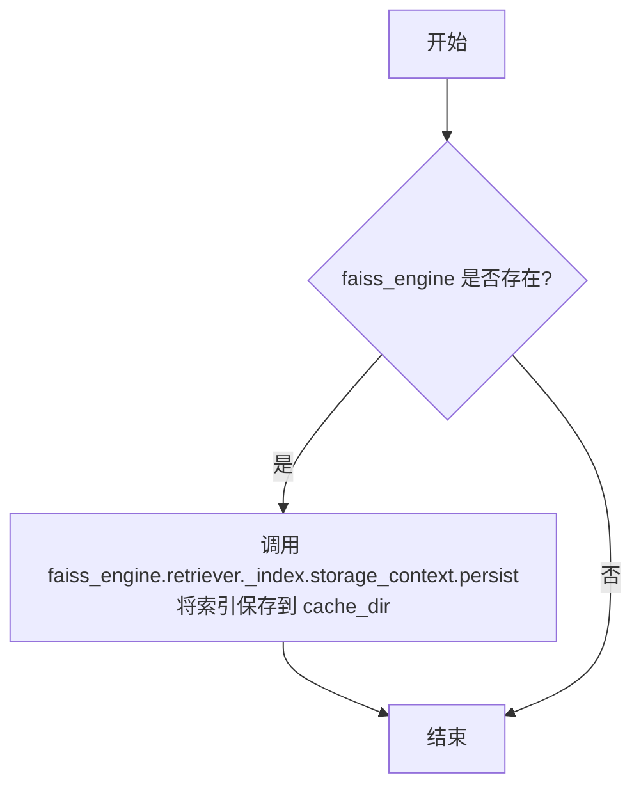

# `.\MetaGPT\metagpt\memory\memory_storage.py` 详细设计文档

该代码实现了一个基于FAISS向量数据库的记忆存储系统，用于为角色（role）存储和检索消息（Message）。它通过嵌入模型将消息转换为向量，利用FAISS进行高效的近似最近邻搜索，支持记忆的持久化存储、恢复和清理。

## 整体流程



## 类结构

```
MemoryStorage (记忆存储类)
├── 字段: role_id, role_mem_path, mem_ttl, threshold, _initialized, embedding, faiss_engine
├── 属性: is_initialized
├── 方法: __init__, recover_memory, add, search_similar, clean, persist
```

## 全局变量及字段


### `MemoryStorage.role_id`
    
存储当前内存所属角色的唯一标识符

类型：`str`
    


### `MemoryStorage.role_mem_path`
    
角色内存数据在文件系统中的存储路径

类型：`str`
    


### `MemoryStorage.mem_ttl`
    
内存的生存时间（Time To Live），用于后续实现内存过期机制

类型：`int`
    


### `MemoryStorage.threshold`
    
相似度过滤阈值，用于在检索时过滤掉相似度低于此值的记忆

类型：`float`
    


### `MemoryStorage._initialized`
    
内部标志，表示内存存储引擎是否已完成初始化

类型：`bool`
    


### `MemoryStorage.embedding`
    
用于将文本转换为向量表示的嵌入模型

类型：`BaseEmbedding`
    


### `MemoryStorage.faiss_engine`
    
基于FAISS的检索引擎，负责向量的存储、索引和相似性搜索

类型：`SimpleEngine`
    


### `MemoryStorage.cache_dir`
    
FAISS索引和向量存储的持久化目录路径

类型：`Path`
    
    

## 全局函数及方法

### `MemoryStorage.__init__`

初始化 MemoryStorage 实例，设置内存存储的基本参数和组件，包括内存过期时间、嵌入模型以及 FAISS 搜索引擎的初始化准备。

参数：

- `mem_ttl`：`int`，内存的生存时间（Time To Live），用于控制内存的有效期，目前未使用，留作后续扩展。
- `embedding`：`BaseEmbedding`，用于文本嵌入的模型实例，如果未提供，则使用默认的嵌入模型。

返回值：`None`，此方法为构造函数，不返回任何值。

#### 流程图



#### 带注释源码

```python
def __init__(self, mem_ttl: int = MEM_TTL, embedding: BaseEmbedding = None):
    # 初始化角色ID和内存路径为None，将在recover_memory方法中设置
    self.role_id: str = None
    self.role_mem_path: str = None
    # 设置内存的生存时间，目前未使用，留作后续功能扩展
    self.mem_ttl: int = mem_ttl  # later use
    # 设置相似度过滤阈值，经验值，用于过滤相似记忆
    self.threshold: float = 0.1  # experience value. TODO The threshold to filter similar memories
    # 标记存储是否已初始化
    self._initialized: bool = False
    # 设置嵌入模型，如果未提供则使用默认的嵌入模型
    self.embedding = embedding or get_embedding()

    # 初始化FAISS搜索引擎为None，将在recover_memory方法中创建
    self.faiss_engine = None
```

### `MemoryStorage.is_initialized`

这是一个属性访问器，用于获取 `MemoryStorage` 类实例的初始化状态。

参数：
- 无

返回值：`bool`，返回一个布尔值，表示 `MemoryStorage` 实例是否已经初始化完成。

#### 流程图



#### 带注释源码

```
    @property
    def is_initialized(self) -> bool:
        # 使用 @property 装饰器，将方法转换为只读属性。
        # 当外部代码访问 `instance.is_initialized` 时，会调用此方法。
        # 返回内部私有变量 `self._initialized` 的当前值。
        # `self._initialized` 是一个布尔标志，用于记录 MemoryStorage 实例的初始化状态。
        # 在 `recover_memory` 方法中，初始化完成后会将其设置为 `True`。
        # 在 `clean` 方法中，清理存储后会将其重置为 `False`。
        return self._initialized
```

### `MemoryStorage.recover_memory`

该方法用于恢复指定角色的记忆存储。它首先根据角色ID设置记忆存储路径，并确保该路径存在。然后，它检查是否存在持久化的向量存储文件。如果存在，则从该文件加载FAISS索引引擎；否则，创建一个空的FAISS索引引擎。最后，将存储标记为已初始化。

参数：

- `role_id`：`str`，角色的唯一标识符，用于确定记忆存储的路径。

返回值：`list[Message]`，该方法没有显式返回值，但会初始化`self.faiss_engine`和`self._initialized`。

#### 流程图



#### 带注释源码

```python
def recover_memory(self, role_id: str) -> list[Message]:
    # 设置角色ID和记忆存储路径
    self.role_id = role_id
    self.role_mem_path = Path(DATA_PATH / f"role_mem/{self.role_id}/")
    # 确保记忆存储目录存在
    self.role_mem_path.mkdir(parents=True, exist_ok=True)
    self.cache_dir = self.role_mem_path

    # 检查是否存在持久化的向量存储文件
    if self.role_mem_path.joinpath("default__vector_store.json").exists():
        # 如果存在，从持久化文件加载FAISS索引引擎
        self.faiss_engine = SimpleEngine.from_index(
            index_config=FAISSIndexConfig(persist_path=self.cache_dir),
            retriever_configs=[FAISSRetrieverConfig()],
            embed_model=self.embedding,
        )
    else:
        # 如果不存在，创建一个空的FAISS索引引擎
        self.faiss_engine = SimpleEngine.from_objs(
            objs=[], retriever_configs=[FAISSRetrieverConfig()], embed_model=self.embedding
        )
    # 标记存储为已初始化
    self._initialized = True
```

### `MemoryStorage.add`

该方法用于将一条消息添加到内存存储中，具体是通过底层的Faiss向量搜索引擎实现的。

参数：

- `message`：`Message`，需要添加到内存存储中的消息对象。

返回值：`bool`，该方法没有显式返回值（返回`None`），但根据其文档字符串，它应返回一个布尔值表示操作是否成功。当前实现中，它总是返回`None`。

#### 流程图



#### 带注释源码

```python
def add(self, message: Message) -> bool:
    """add message into memory storage"""
    # 调用底层Faiss引擎的add_objs方法，将传入的Message对象添加到索引中
    self.faiss_engine.add_objs([message])
    # 记录一条信息日志，表明已为特定角色添加了一条消息到内存存储
    logger.info(f"Role {self.role_id}'s memory_storage add a message")
    # 注意：方法签名声明返回bool，但此处没有return语句，实际返回None。
```

### `MemoryStorage.search_similar`

该方法用于在内存存储中搜索与给定消息内容相似的消息。它通过调用底层的RAG引擎进行检索，并根据预设的相似度阈值对结果进行过滤，最终返回一个相似消息的列表。

参数：
- `message`：`Message`，需要搜索相似内容的消息对象。
- `k`：`int`，可选参数，指定检索时返回的最相似结果数量，默认值为4。

返回值：`list[Message]`，返回一个经过阈值过滤后的、与输入消息内容相似的`Message`对象列表。

#### 流程图



#### 带注释源码

```python
async def search_similar(self, message: Message, k=4) -> list[Message]:
    """search for similar messages"""
    # filter the result which score is smaller than the threshold
    filtered_resp = []  # 初始化一个空列表，用于存放过滤后的结果
    # 调用faiss_engine的异步检索方法，传入消息内容进行检索
    resp = await self.faiss_engine.aretrieve(message.content)
    # 遍历检索返回的结果列表
    for item in resp:
        # 判断当前结果的相似度分数是否小于预设的阈值
        if item.score < self.threshold:
            # 如果满足条件，则从item的元数据中获取原始的Message对象，并添加到结果列表中
            filtered_resp.append(item.metadata.get("obj"))
    # 返回经过阈值过滤后的相似消息列表
    return filtered_resp
```

### `MemoryStorage.clean`

清理内存存储，删除缓存目录并重置初始化状态。

参数：无

返回值：`None`，无返回值

#### 流程图



#### 带注释源码

```python
def clean(self):
    # 使用shutil.rmtree删除缓存目录，ignore_errors=True确保即使目录不存在也不会抛出异常
    shutil.rmtree(self.cache_dir, ignore_errors=True)
    # 将_initialized标志设置为False，表示内存存储已清理且未初始化
    self._initialized = False
```

### `MemoryStorage.persist`

该方法用于将当前内存存储中的FAISS索引持久化到磁盘上，以便后续可以恢复使用。它通过调用底层引擎的持久化方法，将索引数据保存到指定的缓存目录中。

参数：
- 无显式参数。该方法依赖于实例的 `self.faiss_engine` 和 `self.cache_dir` 属性。

返回值：`None`，该方法不返回任何值，其作用是执行持久化操作。

#### 流程图



#### 带注释源码

```python
def persist(self):
    # 检查当前实例是否已初始化并拥有一个有效的 faiss_engine 对象
    if self.faiss_engine:
        # 调用 faiss_engine 内部检索器的索引存储上下文（storage_context）的 persist 方法
        # 将内存中的 FAISS 索引数据持久化到 self.cache_dir 指定的目录中
        self.faiss_engine.retriever._index.storage_context.persist(self.cache_dir)
```

## 关键组件


### 内存存储 (MemoryStorage)

该类是RAG（检索增强生成）系统中基于FAISS向量数据库的长期记忆存储核心组件，负责管理特定角色（role）的记忆数据的持久化、检索、添加和清理。

### FAISS检索引擎集成 (SimpleEngine)

作为MemoryStorage的核心依赖，SimpleEngine封装了LlamaIndex的FAISS索引和检索器，提供了文档（或消息）的向量化存储、索引构建和相似性检索能力。

### 消息对象 (Message)

作为存储和检索的基本数据单元，封装了需要被记忆的文本内容及其相关元数据，是MemoryStorage类中`add`和`search_similar`方法操作的主要对象。

### 嵌入模型 (BaseEmbedding)

负责将文本消息（Message.content）转换为向量表示，是构建向量索引和进行相似性搜索的基础。MemoryStorage通过`get_embedding()`函数获取默认的嵌入模型实例。

### 持久化存储路径管理

通过`role_mem_path`和`cache_dir`管理FAISS索引文件（如`default__vector_store.json`）的磁盘存储位置，支持记忆的跨会话恢复（`recover_memory`）和持久化（`persist`）。

### 相似性过滤阈值 (threshold)

一个经验性的浮点数值，用于在检索结果（`search_similar`）中过滤掉与查询内容相似度不足的记忆，以提升返回结果的相关性。


## 问题及建议


### 已知问题

-   **`recover_memory` 方法名不副实**：该方法不仅负责从磁盘恢复内存（如果存在），还负责在内存不存在时进行初始化。其名称“恢复”未能准确反映其全部职责，容易造成误解。
-   **硬编码的阈值和配置**：相似度过滤的阈值 (`self.threshold = 0.1`) 和检索器配置 (`FAISSRetrieverConfig()`) 在代码中硬编码，缺乏灵活性，无法适应不同场景或角色的需求调整。
-   **`mem_ttl` 参数未使用**：初始化时接收的 `mem_ttl` 参数在后续代码中未被使用，属于无效参数，可能意味着计划中的记忆过期功能尚未实现或设计已变更。
-   **`search_similar` 方法存在潜在性能问题**：该方法在检索后，通过遍历列表并比较分数来过滤结果。如果 `FAISSRetrieverConfig` 支持在检索时直接传入分数阈值（如 `similarity_top_k` 或 `score_threshold`），当前做法会导致不必要的性能开销。
-   **缺乏异常处理**：`clean` 方法使用 `shutil.rmtree` 删除目录，但仅设置了 `ignore_errors=True`。对于关键操作（如持久化 `persist`）或可能失败的操作（如初始化引擎），缺乏明确的异常捕获和处理逻辑，可能导致程序意外终止或状态不一致。
-   **`embedding` 模型初始化时机**：在 `__init__` 中，如果未传入 `embedding` 参数，则调用 `get_embedding()` 进行初始化。这可能导致在不需要嵌入模型的场景下（例如仅进行清理操作）也进行了初始化，造成不必要的资源消耗。

### 优化建议

-   **重构 `recover_memory` 方法并明确职责**：建议将方法拆分为 `initialize`（或 `load`）和 `_create_new_engine`。`initialize` 方法根据路径是否存在决定是加载现有索引还是创建新引擎，使逻辑更清晰，职责更单一。
-   **将阈值和配置参数化**：将 `threshold`、`retriever_configs` 等作为 `__init__` 或 `recover_memory` 的可配置参数，提高类的灵活性和可测试性。可以为它们提供合理的默认值。
-   **移除未使用的 `mem_ttl` 参数或实现其功能**：如果暂无实现记忆过期功能的计划，应考虑从 `__init__` 签名中移除 `mem_ttl` 参数，避免混淆。若有计划，则应补充相关逻辑。
-   **优化检索过滤逻辑**：检查 `FAISSRetrieverConfig` 是否支持配置相似度阈值。如果支持，应在构建检索器时配置，让 FAISS 引擎在底层进行过滤，以提高效率。如果不支持，当前方法可以接受，但可考虑添加注释说明。
-   **增强异常处理与状态管理**：在 `persist`、`recover_memory`/`initialize`、`add` 等可能失败的方法中添加 `try-except` 块，记录错误日志，并根据情况重置 `_initialized` 状态或抛出明确的异常。在 `clean` 方法中，除了忽略错误，也可以记录删除操作的结果。
-   **延迟初始化嵌入模型**：考虑将 `embedding` 的默认值设为 `None`，并在真正需要用到引擎（如在 `recover_memory` 或首次调用 `add`/`search_similar`）时才调用 `get_embedding()` 进行初始化。这符合懒加载原则，节省资源。
-   **考虑添加类型提示和文档字符串**：为方法参数和返回值添加更详细的类型提示（例如 `search_similar` 返回 `list[Message]`）。完善关键方法的文档字符串，说明其行为、参数和可能抛出的异常。


## 其它


### 设计目标与约束

本模块旨在为角色提供一个基于向量相似度检索的长期记忆存储系统。核心设计目标包括：1) 支持高效、可扩展的相似记忆检索，以增强角色决策的上下文感知能力；2) 实现记忆的持久化存储，确保角色状态在系统重启后得以恢复；3) 提供简单的API（`add`, `search_similar`, `clean`, `persist`）供上层业务调用。主要约束包括：1) 当前强依赖于FAISS作为向量索引和检索后端；2) 相似度过滤阈值（`threshold`）为经验值，缺乏自适应或可配置机制；3) 内存清理（`clean`）操作不可逆，会删除所有持久化数据。

### 错误处理与异常设计

当前代码的错误处理较为基础。`clean`方法使用了`shutil.rmtree`的`ignore_errors`参数来静默处理删除错误，这可能掩盖潜在的文件系统问题。`recover_memory`和`persist`方法在文件操作或引擎初始化时可能抛出未捕获的异常（如`FileNotFoundError`, `PermissionError`或FAISS/llama-index相关异常）。`search_similar`方法假设`resp`中的`item`均包含`score`和`metadata['obj']`属性，缺乏健壮性检查。整体缺乏统一的异常处理策略和用户友好的错误信息反馈。

### 数据流与状态机

数据流始于`recover_memory`，该方法根据`role_id`建立或加载本地向量存储目录，并初始化`faiss_engine`。`add`方法将`Message`对象添加至引擎的索引中。`search_similar`方法接收查询`Message`，通过引擎进行异步向量检索，并根据`threshold`过滤结果后返回。`persist`将当前索引状态写入磁盘。`clean`删除整个存储目录并将实例重置为未初始化状态。状态机简单：实例在`recover_memory`成功调用后进入`_initialized=True`状态，方可进行`add`、`search`等操作；`clean`操作后状态回到未初始化。

### 外部依赖与接口契约

**外部依赖：**
1.  **llama-index-core**: 提供`BaseEmbedding`抽象和`SimpleEngine`，是构建检索引擎的核心。
2.  **FAISS (通过llama-index)**: 用于高效的向量相似性搜索和索引存储。
3.  **metagpt内部模块**:
    *   `metagpt.const`: 提供`DATA_PATH`, `MEM_TTL`等常量。
    *   `metagpt.rag.*`: 提供`SimpleEngine`, `FAISSIndexConfig`, `FAISSRetrieverConfig`。
    *   `metagpt.schema`: 提供`Message`数据类。
    *   `metagpt.utils.embedding`: 提供`get_embedding`默认嵌入模型。

**接口契约：**
1.  `__init__`: 接受可选的`mem_ttl`和`embedding`模型。`embedding`默认为`get_embedding()`的返回值，必须符合`BaseEmbedding`接口。
2.  `recover_memory(role_id: str) -> list[Message]`: 契约要求`role_id`唯一标识一个角色。返回类型为`list[Message]`，但当前实现并未返回任何列表，存在接口定义与实际行为不符的问题。
3.  `add(message: Message) -> bool`: 契约要求输入一个`Message`对象。返回`bool`但当前实现始终返回`None`。
4.  `search_similar(message: Message, k=4) -> list[Message]`: 契约要求异步调用，返回相似度低于`threshold`的`Message`列表。参数`k`在当前实现中未使用。
5.  `persist()` 和 `clean()`: 无返回值，但具有明确的副作用（写入磁盘/删除数据）。

### 配置管理与环境变量

模块的配置主要通过以下方式管理：
1.  **硬编码常量**：相似度过滤`threshold`（0.1）为硬编码的经验值。
2.  **初始化参数**：`mem_ttl`（通过`MEM_TTL`常量提供默认值）和`embedding`模型可在实例化时传入。
3.  **文件路径**：存储路径由`DATA_PATH`常量与`role_id`拼接而成（`DATA_PATH / "role_mem/{self.role_id}/"`）。`DATA_PATH`是一个关键的环境或配置常量。
4.  **检索引擎配置**：使用`FAISSRetrieverConfig()`和`FAISSIndexConfig()`的默认配置，缺乏对FAISS索引参数（如度量标准、索引类型）或检索参数（如相似度top k）的外部配置入口。

### 并发与线程安全

代码未显式处理并发问题。`MemoryStorage`实例的方法（如`add`, `search_similar`, `persist`）在多线程或多进程环境下同时被调用时，可能导致状态不一致或数据竞争。例如，多个线程同时调用`add`可能干扰FAISS索引的内部状态。`SimpleEngine`及其底层FAISS索引的线程安全性未知。当前设计适用于单线程角色执行场景，若需在并发环境中使用，需要在外部加锁或重构为线程安全的设计。

### 测试策略与可测试性

模块的可测试性面临挑战，主要因为：
1.  **强外部依赖**：对FAISS、本地文件系统以及`SimpleEngine`的深度耦合，使得单元测试需要大量mock。
2.  **状态依赖**：大多数方法（`add`, `search_similar`）要求实例先通过`recover_memory`初始化，增加了测试设置复杂度。
3.  **异步方法**：`search_similar`是异步方法，需要测试框架支持。

**建议的测试策略：**
*   **单元测试**：使用mock替代`faiss_engine`、`embedding`和文件系统操作，专注于`MemoryStorage`自身的逻辑（如状态管理、参数传递）。
*   **集成测试**：针对`recover_memory`, `add`, `persist`, `clean`与真实文件系统的交互进行测试。
*   **契约测试**：验证`search_similar`的返回结果确实符合`threshold`过滤条件。
*   **性能测试**：针对大量`Message`的添加和检索操作进行基准测试。

### 部署与运维考量

1.  **存储空间**：记忆持久化会占用本地磁盘空间，需要监控`DATA_PATH/role_mem/`目录的增长，尤其是当角色数量多或记忆信息量大时。
2.  **性能**：FAISS索引在内存中构建，检索速度快，但初始加载大型持久化索引到内存可能耗时。`mem_ttl`字段预留用于未来实现记忆过期，但目前未启用。
3.  **备份与恢复**：`clean`操作是破坏性的。生产环境需要考虑对`role_mem`目录进行定期备份的策略。
4.  **跨平台兼容性**：使用`pathlib.Path`处理路径，具有良好的跨平台性。但FAISS库可能有特定的平台依赖或优化。
5.  **扩展性**：当前设计为每个角色在本地文件系统存储独立索引。若需扩展到分布式环境或共享存储，需要重新设计存储后端和索引管理机制。

    