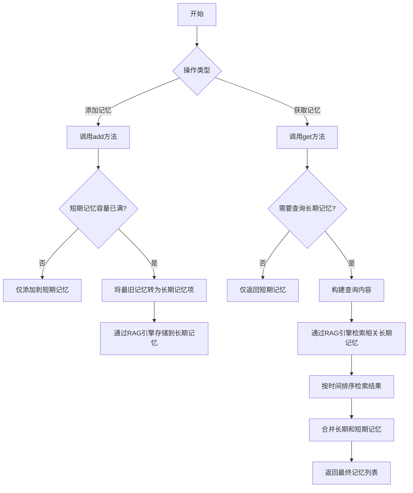
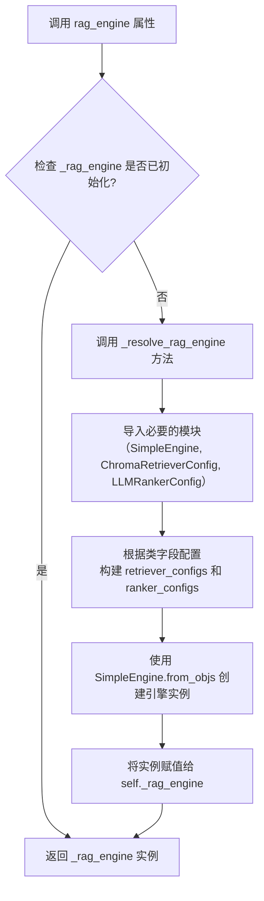
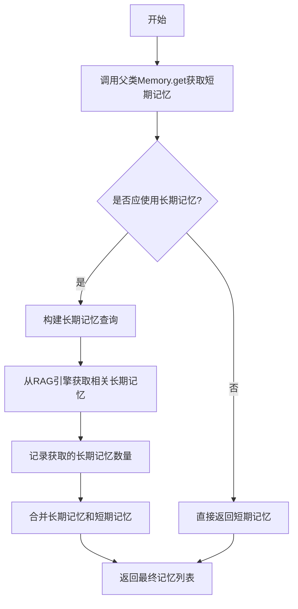
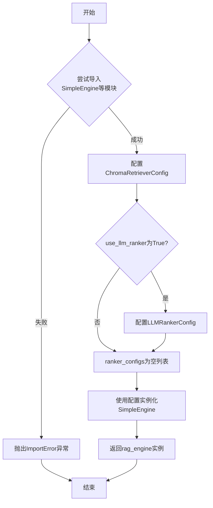
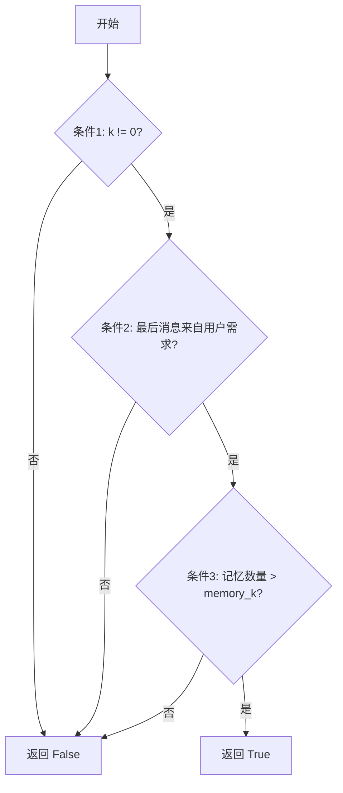
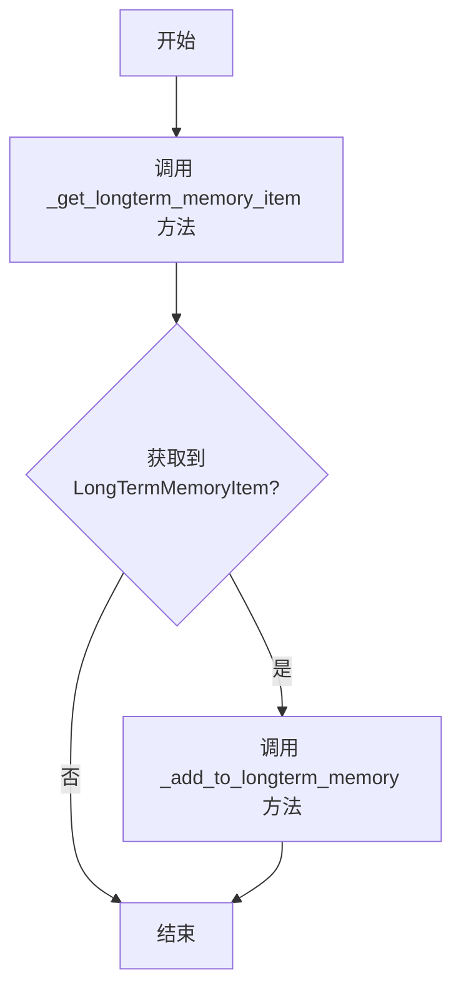
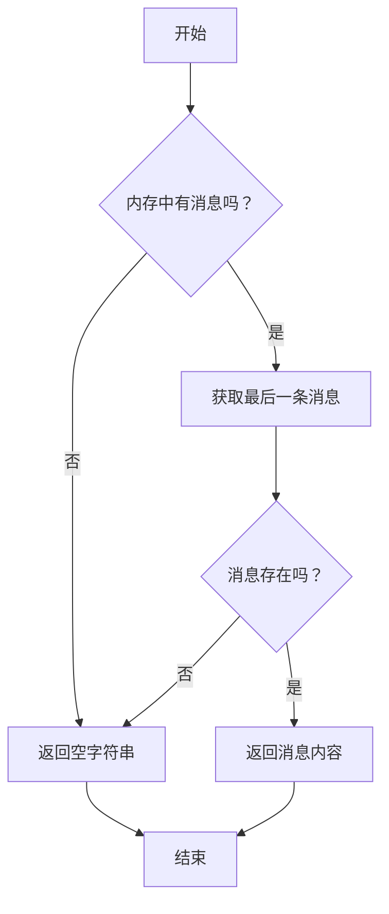
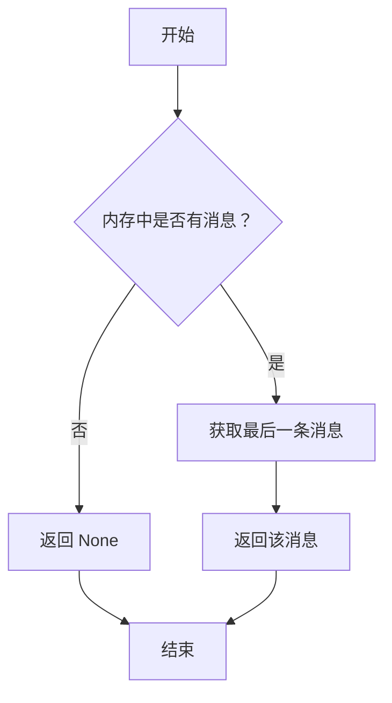
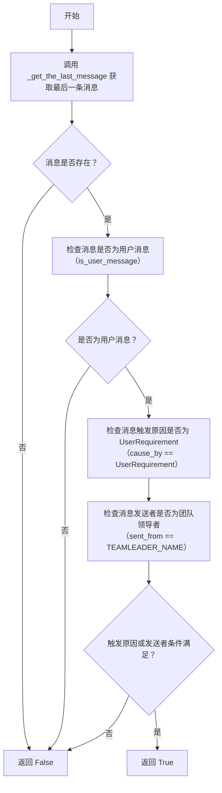

# `.\MetaGPT\metagpt\memory\role_zero_memory.py` 详细设计文档

该模块实现了一个结合短期和长期存储的记忆系统，用于AI角色记忆管理。它使用RAG（检索增强生成）引擎进行长期记忆的存储和检索，当短期记忆容量达到上限时，会将旧记忆转移到长期存储中，并在需要时检索相关的长期记忆与短期记忆结合使用。

## 整体流程



## 类结构

```
Memory (基类)
└── RoleZeroLongTermMemory (角色零长期记忆类)
    ├── 字段: persist_path, collection_name, memory_k, similarity_top_k, use_llm_ranker, _rag_engine
    ├── 属性: rag_engine
    ├── 公共方法: add, get
    ├── 私有方法: _resolve_rag_engine, _should_use_longterm_memory_for_add, _should_use_longterm_memory_for_get
    ├── 私有方法: _transfer_to_longterm_memory, _get_longterm_memory_item, _add_to_longterm_memory
    ├── 私有方法: _fetch_longterm_memories, _get_items_from_nodes, _build_longterm_memory_query
    └── 私有方法: _get_the_last_message, _is_last_message_from_user_requirement
```

## 全局变量及字段


### `RoleZeroLongTermMemory.persist_path`
    
RAG引擎持久化数据的存储目录路径。

类型：`str`
    


### `RoleZeroLongTermMemory.collection_name`
    
RAG引擎中用于存储和检索的集合名称，通常与角色名相关。

类型：`str`
    


### `RoleZeroLongTermMemory.memory_k`
    
短期记忆的容量阈值，超过此阈值将触发向长期记忆的转移。

类型：`int`
    


### `RoleZeroLongTermMemory.similarity_top_k`
    
从长期记忆中检索时，返回的最相似记忆项的数量。

类型：`int`
    


### `RoleZeroLongTermMemory.use_llm_ranker`
    
是否使用LLM重排序器来优化检索结果的排序质量。

类型：`bool`
    


### `RoleZeroLongTermMemory._rag_engine`
    
用于长期记忆存储和检索的RAG引擎实例，通过属性`rag_engine`进行懒加载。

类型：`Any`
    
    

## 全局函数及方法

### `RoleZeroLongTermMemory.rag_engine`

这是一个属性（property），用于惰性加载并返回一个 RAG（检索增强生成）引擎实例。该引擎负责长时记忆的存储和检索，使用 Chroma 作为向量检索后端，并可选地使用 LLM 进行结果重排序。

参数：无

返回值：`SimpleEngine`，一个配置好的 RAG 引擎实例，用于处理长时记忆的存储和检索操作。

#### 流程图



#### 带注释源码

```python
    @property
    def rag_engine(self) -> "SimpleEngine":
        # 属性访问器，用于惰性加载 RAG 引擎。
        # 如果引擎尚未初始化（_rag_engine 为 None），则调用 _resolve_rag_engine 方法进行创建。
        if self._rag_engine is None:
            self._rag_engine = self._resolve_rag_engine()

        # 返回已初始化的 RAG 引擎实例。
        return self._rag_engine
```

### `RoleZeroLongTermMemory.add`

该方法用于向角色的记忆系统中添加一条新的消息。它是短期记忆添加流程的扩展，在添加消息后，会检查当前短期记忆的容量。如果短期记忆已满（超过设定的 `memory_k` 容量），则会触发将最旧的短期记忆转移到长期记忆存储（RAG引擎）中的过程。

参数：

- `message`：`Message`，需要添加到记忆系统中的消息对象。

返回值：`None`，该方法不返回任何值。

#### 流程图

```mermaid
flowchart TD
    A[开始: add(message)] --> B[调用父类Memory.add<br>将消息存入短期记忆]
    B --> C{调用 _should_use_longterm_memory_for_add?}
    C -- 否 --> D[结束]
    C -- 是 --> E[调用 _transfer_to_longterm_memory]
    E --> F[结束]
```

#### 带注释源码

```python
def add(self, message: Message):
    """Add a new message and potentially transfer it to long-term memory."""

    # 1. 首先调用父类 Memory 的 add 方法，将消息存入短期记忆列表
    super().add(message)

    # 2. 检查当前条件是否需要使用长期记忆（具体为是否需要转移记忆）
    #    核心逻辑是判断当前短期记忆数量是否超过了容量上限 (memory_k)
    if not self._should_use_longterm_memory_for_add():
        return

    # 3. 如果短期记忆已满，则执行将最旧的记忆转移到长期记忆存储的逻辑
    self._transfer_to_longterm_memory()
```

### `RoleZeroLongTermMemory.get`

该方法用于获取角色的记忆。它首先从短期记忆中检索最近的 `k` 条消息，然后根据特定条件判断是否需要从长期记忆中检索相关记忆。如果需要，它会构建一个查询，从RAG引擎中获取相关的长期记忆，并将它们与短期记忆合并后返回。

参数：

- `k`：`int`，默认值为0。指定从短期记忆中获取最近的消息数量。如果为0，则获取所有短期记忆。

返回值：`list[Message]`，返回一个消息列表，其中可能包含从长期记忆中检索到的相关消息和从短期记忆中获取的最近消息。

#### 流程图



#### 带注释源码

```python
def get(self, k=0) -> list[Message]:
    """Return recent memories and optionally combines them with related long-term memories."""

    # 1. 首先调用父类Memory的get方法，获取最近的k条短期记忆。
    memories = super().get(k)

    # 2. 判断当前情况是否需要使用长期记忆。
    #    条件包括：k不为0、最后一条消息是用户需求、短期记忆数量超过阈值。
    if not self._should_use_longterm_memory_for_get(k=k):
        # 如果不需要，直接返回短期记忆。
        return memories

    # 3. 如果需要使用长期记忆，则构建一个查询字符串。
    #    默认使用最近一条用户消息的内容作为查询。
    query = self._build_longterm_memory_query()
    # 4. 使用RAG引擎根据查询检索相关的长期记忆。
    related_memories = self._fetch_longterm_memories(query)
    # 5. 记录检索到的长期记忆数量。
    logger.info(f"Fetched {len(related_memories)} long-term memories.")

    # 6. 将检索到的长期记忆（按时间排序）与短期记忆合并。
    #    注意：长期记忆在前，短期记忆在后。
    final_memories = related_memories + memories

    # 7. 返回合并后的最终记忆列表。
    return final_memories
```

### `RoleZeroLongTermMemory._resolve_rag_engine`

该方法用于惰性加载RAG引擎组件，确保仅在需要时才进行初始化。它配置并实例化一个`SimpleEngine`，该引擎使用`Chroma`作为检索器，并可选择性地使用`LLMRanker`进行结果重排序。

参数：
-  `self`：`RoleZeroLongTermMemory`，当前`RoleZeroLongTermMemory`类的实例。

返回值：`SimpleEngine`，一个配置好的RAG引擎实例，用于长时记忆的存储和检索。

#### 流程图



#### 带注释源码

```python
def _resolve_rag_engine(self) -> "SimpleEngine":
    """惰性加载RAG引擎组件，确保仅在需要时才进行初始化。

    它使用`Chroma`进行检索，并可选择使用`LLMRanker`进行重排序。
    """

    try:
        # 尝试导入必要的RAG模块
        from metagpt.rag.engines import SimpleEngine
        from metagpt.rag.schema import ChromaRetrieverConfig, LLMRankerConfig
    except ImportError:
        # 如果导入失败，抛出明确的错误信息，提示用户需要安装rag模块
        raise ImportError("To use the RoleZeroMemory, you need to install the rag module.")

    # 配置Chroma检索器，使用类中定义的持久化路径、集合名和检索数量
    retriever_configs = [
        ChromaRetrieverConfig(
            persist_path=self.persist_path,
            collection_name=self.collection_name,
            similarity_top_k=self.similarity_top_k,
        )
    ]
    # 根据`use_llm_ranker`标志决定是否配置LLM重排序器
    ranker_configs = [LLMRankerConfig()] if self.use_llm_ranker else []

    # 使用配置好的检索器和排序器实例化SimpleEngine
    rag_engine = SimpleEngine.from_objs(retriever_configs=retriever_configs, ranker_configs=ranker_configs)

    # 返回创建好的RAG引擎实例
    return rag_engine
```

### `RoleZeroLongTermMemory._should_use_longterm_memory_for_add`

该方法用于判断在向内存中添加新消息时，是否应该触发将旧消息转移到长期记忆的逻辑。其核心决策依据是当前短期记忆的容量是否已超过预设的阈值。

参数：
-  `self`：`RoleZeroLongTermMemory`，当前`RoleZeroLongTermMemory`类的实例。

返回值：`bool`，如果当前短期记忆中的消息数量超过了`memory_k`（短期记忆容量），则返回`True`，表示应该使用长期记忆（即触发转移操作）；否则返回`False`。

#### 流程图

```mermaid
flowchart TD
    A[开始] --> B{调用 self.count()<br>获取当前消息数量}
    B --> C{消息数量 > self.memory_k?}
    C -- 是 --> D[返回 True]
    C -- 否 --> E[返回 False]
    D --> F[结束]
    E --> F
```

#### 带注释源码

```python
def _should_use_longterm_memory_for_add(self) -> bool:
    """Determines if long-term memory should be used for add."""

    # 核心逻辑：比较当前内存中的消息总数与预设的短期记忆容量（memory_k）
    # 如果总数超过容量，则返回True，触发向长期记忆的转移
    return self.count() > self.memory_k
```

### `RoleZeroLongTermMemory._should_use_longterm_memory_for_get`

该方法用于判断在调用 `get` 方法检索记忆时，是否需要结合长期记忆。其决策基于三个条件：查询数量 `k` 是否为非零、最后一条消息是否来自用户需求、以及当前短期记忆的数量是否超过了设定的容量。

参数：

- `k`：`int`，指定要获取的最近记忆的数量。当 `k` 不为 0 时，表示需要查询特定数量的记忆，此时可能触发长期记忆检索。

返回值：`bool`，返回 `True` 表示需要结合长期记忆进行检索；返回 `False` 表示仅使用短期记忆即可。

#### 流程图



#### 带注释源码

```python
def _should_use_longterm_memory_for_get(self, k: int) -> bool:
    """Determines if long-term memory should be used for get.

    Long-term memory is used if:
    - k is not 0.
    - The last message is from user requirement.
    - The count of recent memories is greater than self.memory_k.
    """

    # 定义三个判断条件
    conds = [
        k != 0,  # 条件1：查询数量k不为0
        self._is_last_message_from_user_requirement(),  # 条件2：最后一条消息来自用户需求
        self.count() > self.memory_k,  # 条件3：当前记忆数量超过短期记忆容量
    ]

    # 当且仅当所有条件都为True时，才返回True，表示需要使用长期记忆
    return all(conds)
```

### `RoleZeroLongTermMemory._transfer_to_longterm_memory`

该方法负责将短期记忆中的旧消息转移到长期记忆存储中。当短期记忆容量达到上限时，系统会调用此方法，将超出容量的最旧消息提取出来，并封装成长期记忆项，然后通过RAG引擎存入长期记忆库。

参数：
- 无

返回值：`None`，无返回值

#### 流程图



#### 带注释源码

```python
def _transfer_to_longterm_memory(self):
    # 1. 获取需要转移的长期记忆项
    #    该方法会计算并获取短期记忆中，超出容量限制的最旧的一条消息。
    item = self._get_longterm_memory_item()
    # 2. 将获取到的长期记忆项添加到RAG引擎中
    #    如果item为None或内容为空，内部方法会直接返回。
    self._add_to_longterm_memory(item)
```

### `RoleZeroLongTermMemory._get_longterm_memory_item`

该方法用于从短期记忆中获取一个特定的消息，并将其封装为长期记忆项。具体来说，它根据 `memory_k` 参数计算出目标消息在短期记忆列表中的索引位置，然后获取该位置的消息。如果消息存在，则将其包装成 `LongTermMemoryItem` 对象返回；否则返回 `None`。此方法通常在短期记忆容量已满，需要将旧消息转移到长期记忆时被调用。

参数：
-  `self`：`RoleZeroLongTermMemory`，当前 `RoleZeroLongTermMemory` 类的实例。

返回值：`Optional[LongTermMemoryItem]`，如果成功获取到指定位置的消息，则返回一个包含该消息的 `LongTermMemoryItem` 对象；否则返回 `None`。

#### 流程图

```mermaid
graph TD
    A[开始] --> B[计算索引 index = -(self.memory_k + 1)]
    B --> C[调用 self.get_by_position(index) 获取消息]
    C --> D{消息是否存在?}
    D -- 是 --> E[创建 LongTermMemoryItem(message=message)]
    D -- 否 --> F[返回 None]
    E --> G[返回 LongTermMemoryItem 对象]
    F --> G
    G --> H[结束]
```

#### 带注释源码

```python
def _get_longterm_memory_item(self) -> Optional[LongTermMemoryItem]:
    """Retrieves the most recent message before the last k messages."""

    # 计算目标消息的索引位置。`memory_k` 是短期记忆的容量。
    # 索引 `-(self.memory_k + 1)` 表示从列表末尾向前数第 `memory_k + 1` 个元素。
    # 例如，如果 `memory_k` 为 200，则获取倒数第 201 条消息。
    index = -(self.memory_k + 1)

    # 调用父类 Memory 的 `get_by_position` 方法，根据索引获取具体的 Message 对象。
    message = self.get_by_position(index)

    # 如果成功获取到消息，则将其包装成 LongTermMemoryItem 对象并返回。
    # 否则，返回 None。
    return LongTermMemoryItem(message=message) if message else None
```

### `RoleZeroLongTermMemory._add_to_longterm_memory`

该方法负责将一个长期记忆项（`LongTermMemoryItem`）添加到RAG引擎中。它是内存系统从短期记忆向长期记忆转移过程的关键步骤。方法被`@handle_exception`装饰器保护，确保在添加失败时仅记录错误而不中断程序执行。

参数：

- `item`：`LongTermMemoryItem`，需要被添加到长期记忆存储中的记忆项。

返回值：`None`，该方法不返回任何值。

#### 流程图

```mermaid
flowchart TD
    A[开始: _add_to_longterm_memory(item)] --> B{检查item是否有效?<br>item 且 item.message.content}
    B -- 否 --> C[直接返回]
    B -- 是 --> D[调用 rag_engine.add_objs([item])]
    D --> E[结束]
```

#### 带注释源码

```python
@handle_exception
def _add_to_longterm_memory(self, item: LongTermMemoryItem):
    """Adds a long-term memory item to the RAG engine.

    If adding long-term memory fails, it will only log the error without interrupting program execution.
    """

    # 1. 有效性检查：确保传入的item及其包含的消息内容不为空。
    if not item or not item.message.content:
        return

    # 2. 核心操作：通过RAG引擎将记忆项添加到长期存储中。
    #    `add_objs`方法预期接收一个对象列表。
    self.rag_engine.add_objs([item])
```

### `RoleZeroLongTermMemory._fetch_longterm_memories`

该方法用于根据给定的查询字符串，从长时记忆存储（RAG引擎）中检索相关的记忆。它是`get`方法的一部分，用于在需要时获取与当前上下文相关的历史记忆，并将其与短期记忆合并返回。该方法被`@handle_exception`装饰器保护，当检索失败时会静默返回一个空列表，确保程序流程不被中断。

参数：
- `query`：`str`，用于搜索相关记忆的查询字符串。

返回值：`list[Message]`，一个包含与查询相关的用户和AI消息的列表。如果查询为空或检索失败，则返回空列表。

#### 流程图

```mermaid
flowchart TD
    A[“开始: _fetch_longterm_memories(query)”] --> B{“query 是否为空?”}
    B -- 是 --> C[“返回空列表 []”]
    B -- 否 --> D[“调用 rag_engine.retrieve(query)”]
    D --> E[“从检索结果节点中提取 LongTermMemoryItem 对象”]
    E --> F[“按 created_at 时间戳对 items 进行排序”]
    F --> G[“从每个 item 中提取 message 字段”]
    G --> H[“返回提取出的 messages 列表”]
    C --> I[“结束”]
    H --> I
```

#### 带注释源码

```python
@handle_exception(default_return=[])
def _fetch_longterm_memories(self, query: str) -> list[Message]:
    """Fetches long-term memories based on a query.

    If fetching long-term memories fails, it will return the default value (an empty list) without interrupting program execution.

    Args:
        query (str): The query string to search for relevant memories.

    Returns:
        list[Message]: A list of user and AI messages related to the query.
    """

    # 1. 边界检查：如果查询字符串为空，直接返回空列表，避免不必要的检索操作。
    if not query:
        return []

    # 2. 核心检索：调用RAG引擎的retrieve方法，根据查询获取相关的节点（NodeWithScore）。
    nodes = self.rag_engine.retrieve(query)
    # 3. 数据转换：从检索到的节点中提取出LongTermMemoryItem对象。
    items = self._get_items_from_nodes(nodes)
    # 4. 消息提取：从每个LongTermMemoryItem中获取其封装的Message对象。
    memories = [item.message for item in items]

    # 5. 返回结果：返回与查询相关的消息列表。
    return memories
```

### `RoleZeroLongTermMemory._get_items_from_nodes`

该方法从检索到的 `NodeWithScore` 对象列表中提取 `LongTermMemoryItem` 对象，并按照其创建时间（`created_at`）进行排序，以确保返回的记忆项按时间顺序排列。

参数：

- `nodes`：`list["NodeWithScore"]`，从 RAG 引擎检索到的、包含元数据和相关性分数的节点列表。

返回值：`list[LongTermMemoryItem]`，一个按创建时间升序排列的 `LongTermMemoryItem` 对象列表。

#### 流程图

```mermaid
flowchart TD
    A[开始] --> B{输入节点列表 nodes}
    B --> C{列表是否为空?}
    C -- 是 --> D[返回空列表]
    C -- 否 --> E[遍历 nodes<br>从每个节点的 metadata['obj'] 中提取 LongTermMemoryItem]
    E --> F[将所有提取的 items 存入列表]
    F --> G[按每个 item 的 created_at 字段进行排序]
    G --> H[返回排序后的 items 列表]
    H --> I[结束]
```

#### 带注释源码

```python
def _get_items_from_nodes(self, nodes: list["NodeWithScore"]) -> list[LongTermMemoryItem]:
    """Get items from nodes and arrange them in order of their `created_at`."""

    # 从每个节点的元数据中提取出 LongTermMemoryItem 对象。
    # 假设每个节点的 metadata 字典中都包含一个键为 'obj' 的值，该值即为 LongTermMemoryItem 实例。
    items: list[LongTermMemoryItem] = [node.metadata["obj"] for node in nodes]

    # 使用 Python 内置的 sort 方法，根据每个 LongTermMemoryItem 的 created_at 属性进行升序排序。
    # 这确保了返回的记忆项是按时间顺序排列的，最早的在最前面。
    items.sort(key=lambda item: item.created_at)

    # 返回排序后的 LongTermMemoryItem 列表。
    return items
```

### `RoleZeroLongTermMemory._build_longterm_memory_query`

该方法用于构建查询长时记忆的查询字符串。其默认逻辑是获取最近的一条用户消息，并以其内容作为查询条件。如果不存在任何消息，则返回空字符串。

参数：
- `self`：`RoleZeroLongTermMemory`，当前`RoleZeroLongTermMemory`类的实例。

返回值：`str`，用于查询相关长时记忆的字符串。如果存在最近的消息，则返回其内容；否则返回空字符串。

#### 流程图



#### 带注释源码

```python
def _build_longterm_memory_query(self) -> str:
    """构建用于查询相关长时记忆的内容。

    默认逻辑是获取最近的一条用户消息，如果找不到则返回空字符串。
    """

    # 调用内部方法获取最后一条消息
    message = self._get_the_last_message()

    # 如果消息存在，返回其内容；否则返回空字符串
    return message.content if message else ""
```

### `RoleZeroLongTermMemory._get_the_last_message`

该方法用于获取内存中最新的一条消息。它首先检查内存中是否有消息，如果没有则返回 `None`；否则，返回内存列表中的最后一条消息。

参数：
- 无

返回值：`Optional[Message]`，返回内存中最新的一条消息，如果内存为空则返回 `None`。

#### 流程图



#### 带注释源码

```python
def _get_the_last_message(self) -> Optional[Message]:
    # 检查内存中是否有消息
    if not self.count():
        # 如果没有消息，返回 None
        return None

    # 获取内存列表中的最后一条消息（索引为 -1）
    return self.get_by_position(-1)
```

### `RoleZeroLongTermMemory._is_last_message_from_user_requirement`

该方法用于检查内存中的最后一条消息是否来自用户需求或由团队领导者发送。它通过分析消息的发送者、触发原因以及是否为用户消息来判断。

参数：
- 无

返回值：`bool`，如果最后一条消息是用户消息且（由`UserRequirement`动作触发或由团队领导者`TEAMLEADER_NAME`发送），则返回`True`；否则返回`False`。

#### 流程图



#### 带注释源码

```python
def _is_last_message_from_user_requirement(self) -> bool:
    """Checks if the last message is from a user requirement or sent by the team leader."""

    # 1. 获取内存中的最后一条消息
    message = self._get_the_last_message()

    # 2. 如果消息不存在，直接返回 False
    if not message:
        return False

    # 3. 检查消息是否来自用户（而非AI）
    is_user_message = message.is_user_message()
    # 4. 检查消息的触发原因是否为 UserRequirement 动作
    cause_by_user_requirement = message.cause_by == any_to_str(UserRequirement)
    # 5. 检查消息的发送者是否为团队领导者
    sent_from_team_leader = message.sent_from == TEAMLEADER_NAME

    # 6. 返回判断结果：是用户消息，并且（由UserRequirement触发 或 由团队领导者发送）
    return is_user_message and (cause_by_user_requirement or sent_from_team_leader)
```

## 关键组件


### 张量索引与惰性加载

通过 `_rag_engine` 属性和 `_resolve_rag_engine` 方法实现 RAG 引擎的惰性加载，仅在首次访问时初始化，以优化启动性能和资源使用。

### 反量化支持

通过 `_fetch_longterm_memories` 方法从 RAG 引擎检索到的 `NodeWithScore` 节点中提取并反序列化 `LongTermMemoryItem` 对象，将底层存储的数据结构还原为应用层可用的内存项。

### 量化策略

通过 `memory_k` 字段和 `_should_use_longterm_memory_for_add` 方法实现基于容量的量化策略，当短期记忆数量超过阈值时，触发将旧记忆转移到长期存储的过程。


## 问题及建议


### 已知问题

-   **长时记忆查询条件过于严格**：`_should_use_longterm_memory_for_get` 方法要求所有条件（k != 0，最后一条消息来自用户需求，短时记忆数量超过容量）同时满足才触发长时记忆检索。这可能导致在需要历史上下文时（例如，k=0 但需要大量历史信息），系统无法有效利用长时记忆，影响回复的相关性和连贯性。
-   **长时记忆转移策略可能导致信息丢失**：当短时记忆超过容量 (`memory_k`) 时，仅将最旧的一条消息（索引为 `-(memory_k + 1)`）转移到长时记忆。这种“先进先出”的简单策略可能无法保留最重要的信息，且每次触发只转移一条消息，效率较低。
-   **长时记忆查询构建逻辑简单**：`_build_longterm_memory_query` 方法仅使用最近一条用户消息的内容作为查询词。对于复杂或需要多轮对话上下文的问题，单一的查询词可能无法准确检索到所有相关的长时记忆，影响召回率。
-   **异常处理可能掩盖关键错误**：`_add_to_longterm_memory` 和 `_fetch_longterm_memories` 方法使用了 `@handle_exception` 装饰器，在出错时分别静默跳过和返回空列表。虽然保证了程序不中断，但也可能使得底层存储（如 ChromaDB）的连接问题、数据格式错误等关键异常被忽略，不利于系统监控和调试。
-   **硬编码的依赖与配置**：`_resolve_rag_engine` 方法内部硬编码了 `ChromaRetrieverConfig` 和 `LLMRankerConfig`。这使得系统难以扩展或替换为其他检索器（如 FAISS、ES）或排序器，降低了组件的可插拔性和灵活性。
-   **潜在的初始化竞争条件**：`rag_engine` 属性通过 `_resolve_rag_engine` 方法懒加载。在多线程或异步环境下，如果多个线程同时检查 `self._rag_engine is None`，可能导致 `_resolve_rag_engine` 被调用多次，造成资源浪费或初始化错误。

### 优化建议

-   **优化长时记忆触发与查询逻辑**：
    -   重构 `_should_use_longterm_memory_for_get` 方法，考虑更灵活的触发条件，例如基于查询的复杂性、对话轮次或显式的用户指令来启用长时记忆检索。
    -   增强 `_build_longterm_memory_query` 方法，使其能够综合最近几条消息、当前对话主题或通过摘要提取的关键词来构建更丰富的查询，提高检索准确性。
-   **改进记忆转移与存储策略**：
    -   设计更智能的记忆转移策略。例如，可以基于消息的重要性评分（可通过 LLM 评估或基于交互频率）、类型或包含的关键信息来决定哪些消息应优先存入长时记忆。
    -   考虑批量转移机制，当触发转移时，将一批较旧的、且符合条件的内存项一次性存入长时记忆，提高效率。
-   **增强错误处理与可观测性**：
    -   在 `@handle_exception` 装饰器捕获异常后，至少应使用 `logger.error` 记录完整的异常堆栈信息，并可能上报到监控系统，以便于问题排查。
    -   对于 `_add_to_longterm_memory` 等关键操作，可以考虑实现重试机制或降级策略（如先缓存到本地文件）。
-   **提升系统可配置性与可扩展性**：
    -   将 `_resolve_rag_engine` 中的检索器、排序器配置改为通过类参数（如 `retriever_configs` 和 `ranker_configs`）传入，允许用户在初始化时自定义 RAG 引擎的组件。
    -   定义清晰的 `Retriever` 和 `Ranker` 抽象接口，使系统能够更容易地集成新的实现。
-   **确保资源初始化的线程安全**：
    -   使用锁（`threading.Lock`）或更高级的同步机制来保护 `_rag_engine` 的懒加载过程，确保在并发环境下只初始化一次。
-   **考虑记忆的去重与更新**：
    -   在 `_add_to_longterm_memory` 前，可以增加基于内容相似度的检查，避免将高度相似或重复的记忆重复存储到长时记忆中。
    -   为 `LongTermMemoryItem` 设计更新机制，允许对已存储的记忆进行修正或补充，而不是只能新增。
-   **性能优化**：
    -   对于频繁的 `get` 操作，如果 `k` 参数变化不大，可以考虑缓存最近一次“短时记忆+长时记忆”的合并结果，避免重复的检索开销（需注意缓存失效条件）。
    -   评估 `similarity_top_k` 的默认值是否合理，过大的值可能增加不必要的检索延迟和 LLM 排序成本。


## 其它


### 设计目标与约束

本模块旨在为AI角色实现一个结合短期与长期存储的记忆系统。核心设计目标包括：1) 提供可扩展的记忆容量，当短期记忆达到上限时，自动将旧记忆归档至长期存储；2) 支持高效的记忆检索，在需要时能结合短期记忆与相关的长期记忆；3) 确保系统的健壮性，关键操作（如长期记忆的增删改查）失败时不应中断主流程。主要约束包括：依赖外部RAG引擎（如Chroma）进行向量存储与检索；长期记忆的查询效果受限于嵌入模型和检索策略；短期记忆容量（`memory_k`）和检索数量（`similarity_top_k`）需要在性能与资源消耗间权衡。

### 错误处理与异常设计

模块采用集中式的异常处理策略。在可能失败的关键操作（`_add_to_longterm_memory` 和 `_fetch_longterm_memories`）上使用了 `@handle_exception` 装饰器。对于添加操作，异常被捕获并仅记录日志，程序继续执行。对于获取操作，异常被捕获后返回默认的空列表。这种设计确保了记忆系统的辅助功能不会导致主业务流程崩溃。其他方法（如 `_resolve_rag_engine`）在依赖缺失时会抛出 `ImportError` 以明确指示配置问题。

### 数据流与状态机

数据流始于外部调用 `add(Message)` 或 `get(k)`。`add` 流程：消息加入短期记忆列表 -> 检查是否触发转移条件（`count() > memory_k`）-> 若触发，则构建 `LongTermMemoryItem` 并调用RAG引擎存入长期存储。`get` 流程：获取近期短期记忆 -> 检查是否触发检索条件（k非零、最后消息为用户需求、短期记忆超限）-> 若触发，则基于最后一条用户消息构建查询 -> 调用RAG引擎检索相关长期记忆 -> 将长期记忆（按时间排序）与短期记忆合并返回。系统状态主要由短期记忆列表和外部RAG引擎的存储状态共同定义。

### 外部依赖与接口契约

1.  **RAG引擎 (`metagpt.rag.engines.SimpleEngine`)**: 核心外部依赖，负责长期记忆的向量化、存储与检索。本模块通过 `_resolve_rag_engine` 方法惰性初始化该引擎，并依赖其 `add_objs` 和 `retrieve` 接口。
2.  **向量数据库 (Chroma)**: 通过 `ChromaRetrieverConfig` 配置，是 `SimpleEngine` 的底层存储。依赖其持久化路径 (`persist_path`) 和集合名 (`collection_name`)。
3.  **LLM Reranker (`LLMRankerConfig`)**: 可选依赖，当 `use_llm_ranker=True` 时启用，用于对检索结果进行重排序以提高相关性。
4.  **消息与内存项 (`Message`, `LongTermMemoryItem`)**: 依赖上游模块定义的数据结构。`LongTermMemoryItem` 是存入RAG引擎的基本单元，封装了 `Message` 及其元数据。
5.  **异常处理器 (`@handle_exception`)**: 依赖 `metagpt.utils.exceptions.handle_exception` 提供的统一异常处理装饰器。

### 配置管理与环境假设

模块配置通过Pydantic字段管理，包括持久化路径、集合名称、短期记忆容量、检索数量等，支持运行时修改。假设工作目录具有写入权限，以便在 `persist_path` 下存储Chroma数据。`use_llm_ranker` 为 `True` 时，假设已正确配置并可访问所需的大语言模型（LLM）服务。模块设计为在 `rag` 模块可用时才能完整运行，否则会在首次尝试初始化引擎时抛出 `ImportError`。

### 性能考量与扩展性

性能瓶颈可能出现在：1) RAG引擎的检索延迟，尤其是启用LLM Reranker时；2) 短期记忆列表线性搜索（当前实现使用Python列表）。扩展性方面，短期记忆容量固定，超限后旧记忆被转移，适合处理记忆量有限但需长期归档的场景。若要支持更大规模的短期记忆或更复杂的记忆淘汰策略，需重构底层存储结构。检索相关性依赖于查询构建策略（当前仅使用最后一条用户消息），未来可扩展为更复杂的查询生成机制。

    