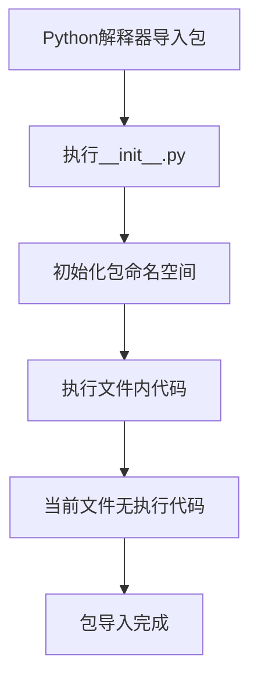

# `.\MetaGPT\metagpt\prompts\__init__.py` 详细设计文档

这是一个空的Python包初始化文件，其主要功能是标记当前目录为一个Python包，并可能包含包的元数据、版本信息或初始化逻辑。在当前代码中，该文件仅包含文档字符串和编码声明，没有定义任何类、函数或变量。

## 整体流程



## 类结构

```
无类层次结构
```

## 全局变量及字段


    

## 全局函数及方法


## 关键组件


### 代码文件结构

这是一个Python包的初始化文件（__init__.py），用于定义包的公共接口和初始化逻辑。

### 包元数据

文件头部包含了标准的Python脚本声明、编码格式以及作者、创建时间等元数据注释。

### 包导入与导出

当前文件为空，表明该包目前没有定义任何需要公开导出的模块、类或函数，其行为依赖于Python的隐式命名空间包机制或将在未来添加具体内容。


## 问题及建议


### 已知问题

-   **空文件问题**：当前文件 (`__init__.py`) 仅包含元信息注释，没有定义任何类、函数或变量。这导致该模块（或包）不提供任何实际功能，可能是一个未完成或占位的模块。

### 优化建议

-   **明确模块职责**：应明确此 `__init__.py` 文件所属包的职责。如果它是一个包的入口点，应考虑在其中导入并公开包内关键的类、函数或子模块，以简化外部调用（例如使用 `from package import Something`）。如果它目前不需要任何功能，可以考虑添加一个 `__all__` 列表来明确导出的内容，或者至少添加一行模块文档字符串 (`"""Package description."""`) 来说明其用途。
-   **移除冗余注释**：文件顶部的 `@Time`、`@Author`、`@File` 等注释通常是IDE或代码生成器自动添加的元数据，并非Python官方认可的模块文档。建议使用标准的模块文档字符串（`""" ... """`）来替代或补充这些信息，以提高代码的可读性和与Python帮助工具（如 `help()`）的兼容性。


## 其它


### 设计目标与约束

该代码文件是一个包的初始化文件（`__init__.py`），其主要设计目标是定义Python包的命名空间，并可能用于执行包的初始化逻辑或暴露包的主要公共接口。当前文件内容为空，表明该包可能仅作为模块的组织结构，或初始化逻辑由其他模块承担。约束包括必须遵循Python的包结构规范，确保该文件存在以标识目录为Python包。

### 错误处理与异常设计

当前`__init__.py`文件为空，因此不包含任何显式的错误处理或异常抛出逻辑。任何导入或使用该包时发生的错误将依赖于Python解释器的默认行为（例如`ImportError`）。未来若在此文件中添加代码，应考虑适当的异常捕获和抛出，以提供清晰的错误信息。

### 数据流与状态机

由于当前文件不包含任何可执行代码，因此不存在内部数据流或状态机。该文件仅作为包的标识符，不参与数据处理或状态管理。

### 外部依赖与接口契约

该`__init__.py`文件本身没有显式的外部依赖（如导入其他模块）。然而，作为包的一部分，它隐式依赖于其所在目录下的其他模块。该文件当前没有定义任何公共接口（如`__all__`列表），这意味着从该包导入（`from package import *`）时，行为将遵循Python的默认规则。

### 安全与权限考虑

当前空文件不引入任何特定的安全风险。若未来在此文件中添加代码，特别是涉及文件操作、网络请求或系统调用时，需进行输入验证、权限检查和防范常见安全漏洞（如代码注入）。

### 测试策略

对于空的`__init__.py`文件，无需编写特定的单元测试。测试重点应放在该包所包含的实际功能模块上。如果未来在此文件中添加初始化逻辑或定义`__all__`，则需要增加相应的测试用例，验证导入行为是否符合预期。

### 部署与运维

该文件作为标准Python包的一部分，部署时需确保其随整个包目录一起被正确打包（例如使用`setuptools`、`pip`或容器化）。运维中无需针对此文件进行特殊监控或配置。

### 文档与注释

当前文件仅包含基础的元信息注释（如作者、时间）。作为最佳实践，应在文件顶部添加包级别的文档字符串，简要描述包的用途、主要功能和模块组成，以提升代码的可维护性和可读性。

    